# Winograd加速算法

详解卷积中的Winograd加速算法：https://zhuanlan.zhihu.com/p/260109670

模型推理】一文看懂 winograd 卷积加速算法：https://zhuanlan.zhihu.com/p/409050916

# 简述

本文详细解释了 winograd 算法加速卷积的实现原理。

前面已经写过几篇卷积加速相关的文章，感兴趣的同学可以查阅《[【模型推理】一文看懂Img2Col卷积加速算法](https://link.zhihu.com/?target=https%3A//blog.csdn.net/weixin_42405819/article/details/118416675)》、《[【模型推理】一文看懂 Google TPU 脉动阵列加速卷积计算原理](https://link.zhihu.com/?target=https%3A//blog.csdn.net/weixin_42405819/article/details/118558620)》、《[【模型推理】谈谈为什么卷积加速更喜欢 NHWC Layout](https://link.zhihu.com/?target=https%3A//blog.csdn.net/weixin_42405819/article/details/119348563)》。

winograd 算法最早是 1980 年由 Shmuel Winograd 提出的《[Fast Algorithms for Convolutional Neural Networks](https://link.zhihu.com/?target=https%3A//arxiv.org/abs/1509.09308)》，当时并没有引起太大的轰动。在 CVPR 2016 会议上，Lavin 等人提出了利用 winograd 加速卷积运算，于是 winograd 加速卷积优化在算法圈里火了一把。

winograd 为什么能加速卷积运算呢，简单来说就是用更多的加法计算来减少乘法计算，从而降低计算量，且不像 FFT 那样会引入复数 (关于 FFT 加速卷积后面会再写一篇)，但前提是，处理器中的乘法计算的时钟周期要大于加法计算的时钟周期。好了，下面开始。

## **1、winograd 加速一维卷积计算**

下面是一个比较经典的例子，假设我们的输入信号和卷积核是这样：

```text
# 输入信号 
d = [d0, d1, d2, d3]T 

# 卷积核 
g = [g0, g1, g2]T
```

那么整个的卷积过程可以转换成如下的矩阵乘形式：


捋得清楚吗，怎么就转换到如上的矩阵乘了，下面解释一下，应该比较形象了。


这个矩阵乘计算过程是这样的：

```bash
r0 = d0*g0 + d1*g1 + d2*g2   # 3次乘法+2次加法 

r1 = d1*g0 + d2*g1 + d3*g2   # 3次乘法+2次加法
```

以上的计算过程总共需要 6 次乘法和 4 次加法。

观察以上的计算过程，由于在卷积层的设计中，往往 stride < kernel_size 的，所以最后转换的矩阵乘中往往有规律的分布着大量的重复元素，比如这个一维卷积例子中矩阵乘输入矩阵第一行的 d1、d2 和 第二行中的 d1、d2。

而 winograd 的做法是这样的：

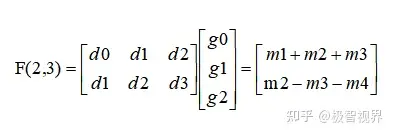

其中，

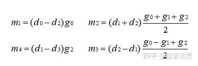

如上的转换将原本需要 6 次乘法减少到了 4 次，看上去加法运算是增加的，但是 m1、m2、m3、m4 是可以提前计算好的，所以实际加法还是 4 次。以上的转换作者只给出了结论，并没有给出推导，下面我们进行一下反推。

上面已经说过，如果我们直接进行矩阵乘，会得到 r0 = d0 x g0 + d1 x g1 + d2 x g2，r1 = d1 x g0 + d2 x g1 + d3 x g2 ，所以我们可以令：m1 + m2 + m3 = r0，m2 - m3 - m4 = r1。像这样：


先观察，两个等式中 m1、m4 是没有重复出现的，我先令 m1 = d0 x g0，m4 = -d3 x g2，这样可以约掉 m1 和 m4，所以左边只剩两个变量，两个等式两个变量即可求出 m3、m4，所以这个时候的 m1、m2、m3、m4 是这样的：

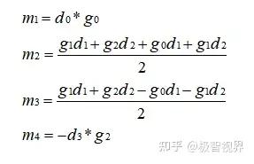

观察 m2 中包含了 d1、d2、g0、g1、g2，将其转换为两个多项式乘积形式，拆成 d 和 g 分开的形式，如下：

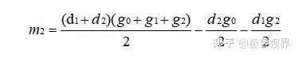

同理，对 m3 也进行如上转换，完了之后现在的 m1、m2、m3、m4 是这样的：

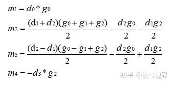

这个时候让我们回到最开始的等价关系，进行观察，要是我在 m2、m3 上同时加上一个值，对于式 (b) 来说是不变的（所以 m4 不用动），对于式 (a) 来说需要给 m1 减去两倍的这个值。

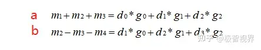

观察现在的 m1、m2、m3、m4，当这个值是 (d2g0) / 2 时可以简化表达式，所以这样给上面等式进行等价变换后得到的 m1、m2、m3、m4 如下：

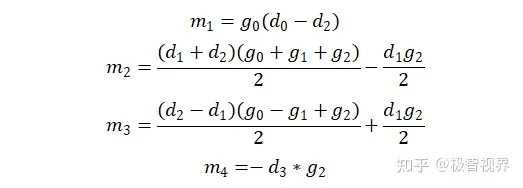

继续如上操作，如果给 m2 加上一个值，同时给 m3 减去这个值，那么对于式 (a) 来说是不变的 (所以 m1 不用动)，对于式 (b) 来说需要给 m4 减去两倍的这个值才能等价。同样观察现在的 m1、m2、m3、m4，当这个值为 (d1g2) / 2 时可以进一步简化表达式，接着作这样的变换后得到最终的 m1、m2、m3、m4，如下：

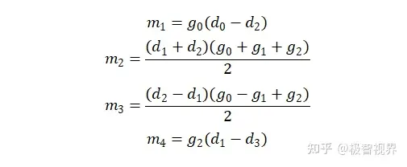

开不开心，激不激动，我们经历了上述的推导之后终于得到了作者给你的结果。

将上面的计算过程写成矩阵的形式为：

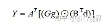

其中：


- g：表示卷积核；
- d：表示输入信号；
- G：表示卷积核变换矩阵，尺寸为 (m+r-1) x r
- BT：表示输入变换矩阵，尺寸为 (m+r-1) x (m+r-1)
- AT：输出变换矩阵，尺寸为 m x (m+r-1)

## **2、winograd 加速二维卷积计算**

将一维卷积的变换扩展到二维卷积，同样用矩阵形式表示为：


其中，g为 r x r 的卷积核，d 为 (m + r -1) x (m + r -1) 的图像块，此时为 F(2 x 2，3 x 3)。

二维卷积可先参考这个《[【模型推理】一文看懂Img2Col卷积加速算法](https://link.zhihu.com/?target=https%3A//blog.csdn.net/weixin_42405819/article/details/118416675)》将卷积过程进行 img2col 展开成矩阵乘的形式，示意图如下：


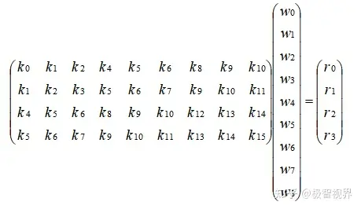

将如上的矩阵乘过程进行分块：

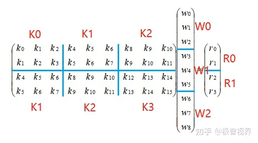

即可以表示成如下形式：

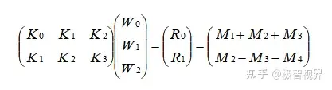

怎么样，熟不熟悉，是不是跟前面一维卷积的形式一毛一样。所以 winograd 对于二维卷积的优化就像套娃一样，你把它一层层拨开就能看到一维卷积的优化姿势了。

## **3、winograd 优化小结**

在 winograd 卷积加速算法中，对于一维卷积，当输出为 m，卷积核长为 r，对应的乘法计算次数为 m+r-1 次；将一维卷积扩展到二维，如果输出维度是 m x n，卷积核维度为 r x s，则需要的乘法次数是 (m+r-1) x (n+s-1)。对一个矩阵大小为 4 x 4 的输入，卷积核大小为 3 x 3，对应的输出为 2 x 2,正常计算的情况下，使用 im2col 加速方法的乘法次数为 2 x 2 x 3 x 3 = 36 次，而当使用 winograd 时，对应的乘法次数为 (2+3−1) x (2+3−1) =16，可以看到乘法次数明显减少，从而加速效果会更加明显。

winograd 算法通过减少乘法次数来实现提速，但是加法的数量会相应增加，同时需要额外的转换计算以及存储转换矩阵，随着卷积核 (kernel) 和 分块 (tile，对于大尺寸 feature map，会将 feature map 切分成一个个等大小有重叠的 tile，在每个 tile 上面进行 winograd 卷积) 的尺寸增大，就需要考虑加法、转换计算 和 存储 的代价，而且 tile 越大，转换矩阵越大，计算精度的损失会进一步增加，所以一般 winograd 只适用于较小的卷积核和 tile（对大尺寸的卷积核，可使用 FFT 进行加速）。


# 详解

## **1. 为什么会引入WinoGrad？**

做过ACM/OI的朋友大家应该对FFT并不陌生，我们知道对于两个序列的乘法通过FFT可以从原始O(n^2)复杂度变成O(nlogn)，所以我们就会想着FFT这个算法是否可以应用到我们计算卷积中来呢？当然是可以的，但是FFT的计算有个问题哦，会引入复数。而移动端是不好处理复数的，对于小卷积核可能减少的计算量和复数运算带来的降速效果是不好说谁会主导的。所以在这种情况下，针对卷积的WinoGrad算法出现了，它不仅可以类似FFT一样降低计算量，它还不会引入复数，使得卷积的运算加速成为了可能。因此，本文尝试从工程实现的角度来看一下WinoGrad，希望对从事算法加速的小伙伴有一些帮助。

## **2. 为什么会有这篇文章？**

最近尝试给MsnhNet做3×3卷积的WinoGrad实现，然后开始了解这个算法，并尝试参考着NCNN来理解和动手写一下。参考了多篇优秀的讲解文章和NCNN源码，感觉算是对这个算法有了较为清楚的认识，这篇文章就记录一下我在实现3×3并且步长为1的WinoGrad卷积时的一些理解。这篇文章的重点是WinoGrad卷积的实现，关于WinoGrad卷积里面的变化矩阵如何推导可以看梁德澎作者的文章：[详解Winograd变换矩阵生成原理](https://link.zhihu.com/?target=https%3A//mp.weixin.qq.com/s/_CKl1cdWHziUYYlG6tuQmA) （听说后续他会做个视频来仔细讲讲QAQ)，现在就假设我们知道了WinoGrad的几个变换矩阵。如果你不知道也没关系，因为有一个Python工具包可以直接帮我们计算，地址为：`https://github.com/andravin/wincnn` 。然后现在我们就要用拿到的这几个矩阵来实现WinoGrad算法，听起来比较简单，但我们还是得一步步理清楚是不。

## **3. WinoGrad算法原理**

WinoGrad算法起源于1980年，是Shmuel Winograd提出用来减少FIR滤波器计算量的一个算法。它指出，对于输出个数为m，参数个数为r的FIR滤波器，不需要m×r次乘法计算，而只需要u(F(m,r))=m+r−1次乘法计算即可。

下面是一个经典例子，以1维卷积为例，输入信号d=[d0,d1,d2,d3]T，卷积核g=[g0,g1,g2]T，则卷积可以写成如下矩阵乘法形式：


如果这个计算过程使用普通的矩阵乘法，则一共需要**「6次乘法和4次加法」** 。

但是，我们仔细观察一下，卷积运算中输入信号转换得到的矩阵不是任意矩阵，其有规律的分布着大量的重复元素，例如第一行的d1和d2，卷积转换成的矩阵乘法比一般乘法的问题域更小，所以这就让优化存为了可能。

然后WinoGrad的做法就是：


我们知道，在CNN的推理阶段，卷积核上的元素是固定的，所以上式中和g相关的式子可以提前算好，在预测阶段只用计算一次，可以忽略。所以这里一共需要**「4次乘法加4次加法」**。

相比于普通的矩阵乘法，使用WinoGrad算法之后乘法次数减少了，这样就可以达到加速的目的了。

这个例子实际上是**「1D的WinoGrad算法」**，我们将上面的计算过程写成矩阵的形式如下：


其中，⊙表示element-wise multiplication（Hadamard product）对应位置相乘。其中，

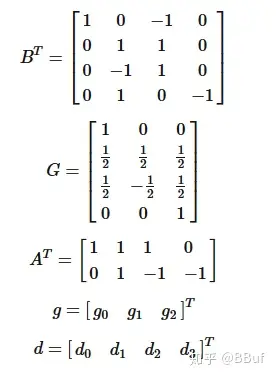

- ：表示卷积核
- d：表示输入信号
- G：卷积核变换矩阵，尺寸为(m+r−1)×r
- BT：输入变换矩阵，尺寸(m+r−1)×(m+r−1)
- AT：输出变换矩阵，尺寸m×(m+r−1)

所以整个计算过程可以分为4步：

- 输入变换
- 卷积核变换
- 外积
- 输出变换

然后我们将1D的WinoGrad扩展到2D，就可以实现3×3卷积的加速了，那么如何从1维扩展到2维呢？公式如下：


2D WinoGrad矩阵形式计算推导

其中，g为r×r的卷积核，d为(m+r−1)×(m+r−1)的图像块，我们把上面的F(2,3)扩展到F(2×2,3×3)，先写成矩阵乘法的方式：

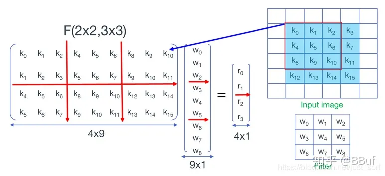

(2x2,3x3) 图片来自https://www.cnblogs.com/shine-lee/p/10906535.html

上图表示我们将卷积核的元素拉成了一列，将输入信号每个滑动窗口中的元素拉成了一行。注意图中红线分成的矩阵块，每个矩阵块中重复元素的位置与一维相同，即：


二维和一维的WinoGrad矩阵关系

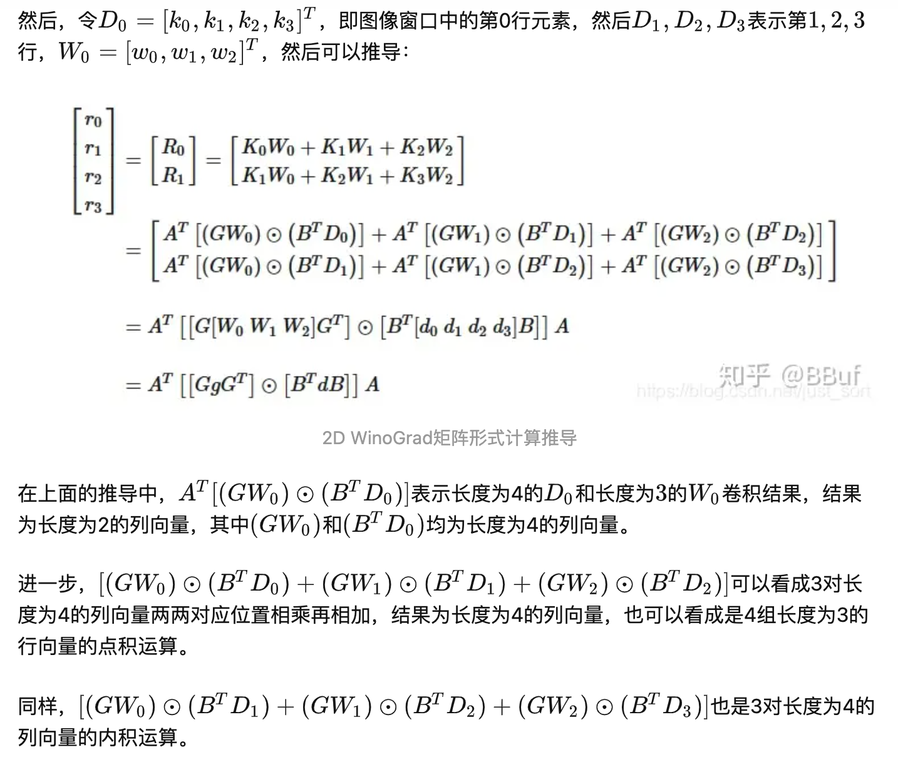


这个时候，WinoGrad算法的乘法次数为4×4=16，而如果直接卷积乘法次数为36，**「降低了2.25倍的乘法计算复杂度」**。

## **4. 从工程角度来看WinoGrad**

下面我们就从一个实际例子来说，如何利用WinoGrad来实现3×3并且步长为1的卷积运算。基于上面介绍的2D WinoGrad的原理，我们现在只需要分4步即可实现WnoGrad算法：


接下来我们就以WinoGrad实现3×3并且步长为1的卷积计算为例子，来理解一下WinoGrad的工程实现。

## **4.1 对输入卷积核进行变换**


```cpp
// 矩阵G
        const float ktm[8][3] = {
            {1.0f,      0.0f,      0.0f},
            {-2.0f / 9, -2.0f / 9, -2.0f / 9},
            {-2.0f / 9, 2.0f / 9, -2.0f / 9},
            {1.0f / 90, 1.0f / 45, 2.0f / 45},
            {1.0f / 90, -1.0f / 45, 2.0f / 45},
            {1.0f / 45, 1.0f / 90, 1.0f / 180},
            {1.0f / 45, -1.0f / 90, 1.0f / 180},
            {0.0f, 0.0f, 1.0f}
        };

        const int kernelTmSize = inChannel * 8 * 8;

#if USE_OMP
    #pragma omp parallel for num_threads(OMP_THREAD)
#endif
        for(int outc = 0; outc < outChannel; outc++){
            for(int inc = 0; inc < inChannel; inc++){
                const float* kernel0 = (const float*)kernel + outc * inChannel * 9 + inc * 9;
                float *kernel_tm0 = kernel_tm + outc * kernelTmSize + inc * 64;

                //需要变换的卷积核
                const float* k0 = kernel0;
                const float* k1 = kernel0 + 3;
                const float* k2 = kernel0 + 6;

                float tmpG[8][3];    // tmp = G*g
                for(int i = 0; i < 8; i++){
                    tmpG[i][0] = k0[0] * ktm[i][0] + k0[1] * ktm[i][1] + k0[2] * ktm[i][2];
                    tmpG[i][1] = k1[0] * ktm[i][0] + k1[1] * ktm[i][1] + k1[2] * ktm[i][2];
                    tmpG[i][2] = k2[0] * ktm[i][0] + k2[1] * ktm[i][1] + k2[2] * ktm[i][2];
                }

                //U = kernel_tm0 = G*g*G^T
                //[8*3] x [3*8]
                for(int i = 0; i < 8; i++){
                    float *tmpPtr = &tmpG[i][0];
                    for(int j = 0; j < 8; j++){
                        kernel_tm0[i * 8 + j] = tmpPtr[0] * ktm[j][0] + tmpPtr[1] * ktm[j][1] + tmpPtr[2] * ktm[j][2];
                    }
                }

            }
        }
```

通过这段代码，所有的卷积核g都被转换成了U，存放在了`kernel_tm`上，一行代表一个U(k,c)，`kernel_tm`的内存排布如下图所示：

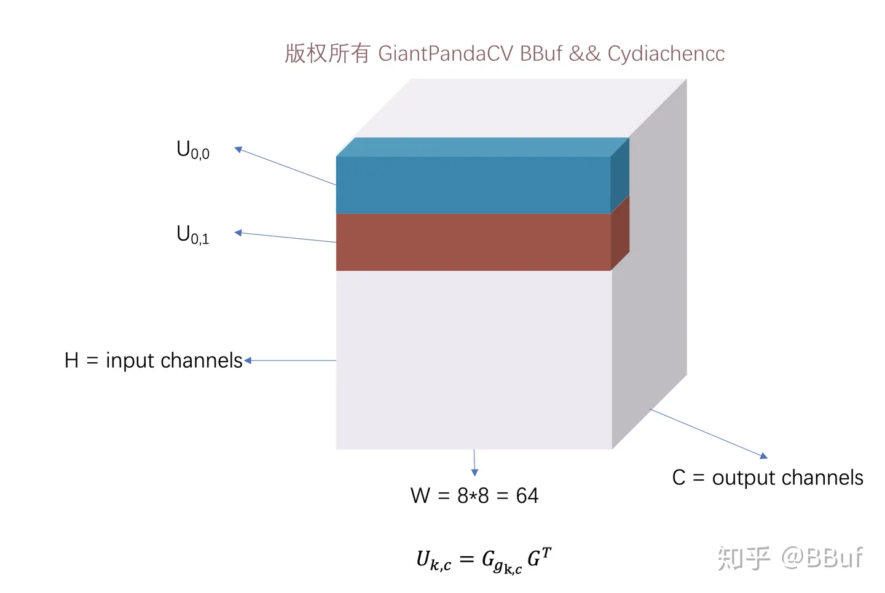

U_{k,c}的内存排布

其中W=64的原因是因为F(6x6,3x3)需要每一个输入图像块(tile)的大小为8×8，权重块也对应8×8，这样才可以做卷积运算（eltwise_mult）。

然后上次我们讲到数据Pack的优势[详解Im2Col+Pack+Sgemm策略更好的优化卷积运算](https://link.zhihu.com/?target=https%3A//mp.weixin.qq.com/s/lqVsMDutBwsjiiM_NkGsAg)，所以这里仍然使用NCNN的Pack策略来获得更好的访存，即将上面的`kernel_tm`进行一次重排，将H维度全部压到W维度上，另外再对C维度做一个额外的4倍压缩，来获得更好的访存。

将H的维度全部压到W维度上示意图：

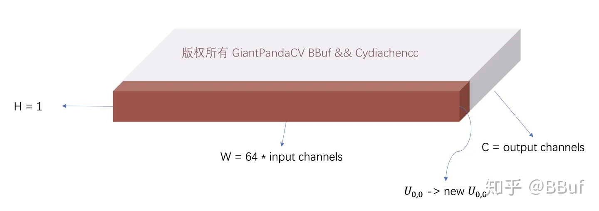

将kernel_tm的H维度全部压到W维度变成一个扁平的Blob

然后在这个基础上，将C维度进行进一步压缩，这个时候还需要注意的是对于每一个输出通道，我们在H×W这个平面上是同时拿出了2行，也就是拿出了128个数据，然后进行交织排列，最后获得`kernel_tm2`。这里以输出通道的前4个为例，即刚好处理8个U矩阵之后结果矩阵`kernel_tm2`应该是长什么样子，如下图所示：


Pack策略之后的矩阵kernel_tm2就长这个样子

这部分的代码实现如下：

```cpp
int nnOutchannel = outChannel >> 2;
        int remainOutChannel = nnOutchannel << 2;
        
        int packOutChannel = nnOutchannel + (outChannel % 4 + 3) / 4;
        int packOutH = 1;
        int packOutW = (8 * 8 * inChannel * 4);

        //float *kernel_tm2 = new float[packOutChannel * packOutH * packOutW];

#if USE_OMP
    #pragma omp parallel for num_threads(OMP_THREAD)
#endif       
        for(int cc = 0; cc < nnOutchannel; cc++){
            int c = cc << 2;
            float *ktm2 = kernel_tm2 + cc * packOutH * packOutW;
            
            const float *kernel0_tm = kernel_tm + c * kernelTmSize;
            const float *kernel1_tm = kernel_tm + (c + 1) * kernelTmSize;
            const float *kernel2_tm = kernel_tm + (c + 2) * kernelTmSize;
            const float *kernel3_tm = kernel_tm + (c + 3) * kernelTmSize;

            int q = 0;
         
            for(; q + 1 < inChannel; q += 2){
                const float *k00 = kernel0_tm + q * 64;
                const float *k01 = kernel0_tm + (q + 1) * 64;
                const float *k10 = kernel1_tm + q * 64;
                const float *k11 = kernel1_tm + (q + 1) * 64;
                const float *k20 = kernel2_tm + q * 64;
                const float *k21 = kernel2_tm + (q + 1) * 64;
                const float *k30 = kernel3_tm + q * 64;
                const float *k31 = kernel3_tm + (q + 1) * 64;

                for(int i = 0; i < 16; i++){
                    for(int j = 0; j < 4; j++){
                        ktm2[0 + j] = k00[j];
                        ktm2[4 + j] = k01[j];
                        ktm2[8 + j] = k10[j];
                        ktm2[12 + j] = k11[j];
                        ktm2[16 + j] = k20[j];
                        ktm2[20 + j] = k21[j];
                        ktm2[24 + j] = k30[j];
                        ktm2[28 + j] = k31[j];
                    }

                    k00 += 4;
                    k01 += 4;
                    k10 += 4;
                    k11 += 4;
                    k20 += 4;
                    k21 += 4;
                    k30 += 4;
                    k31 += 4;
                    ktm2 += 32;

                }
            }

            //inChannel方向的拖尾部分
            for(; q < inChannel; q++){
                const float *k00 = kernel0_tm + q * 64;
                const float *k10 = kernel1_tm + q * 64;
                const float *k20 = kernel2_tm + q * 64;
                const float *k30 = kernel3_tm + q * 64;

                for(int i = 0; i < 16; i++){
                    for(int j = 0; j < 4; j++){
                        ktm2[0 + j] = k00[j];
                        ktm2[4 + j] = k10[j];
                        ktm2[8 + j] = k20[j];
                        ktm2[12 + j] = k30[j];
                    }

                    k00 += 4;
                    k10 += 4;
                    k20 += 4;
                    k30 += 4;
                    ktm2 += 16;
                }
            }

        }

#if USE_OMP
    #pragma omp parallel for num_threads(OMP_THREAD)
#endif      
        for(int cc = remainOutChannel; cc < outChannel; cc++){
            float *ktm2 = kernel_tm2  + nnOutchannel * packOutH * packOutW + 8 * 8 * inChannel * (cc - remainOutChannel);

            const float* kernel0_tm = kernel_tm + cc * kernelTmSize;

            int q = 0;

            for(; q < inChannel; q++){
                const float* k00 = kernel0_tm + q * 64;
                for(int i = 0; i < 16; i++){
                    for(int j = 0; j < 4; j++){
                        ktm2[j] = k00[j];
                    }
                    k00 += 4;
                    ktm2 += 4;
                }
            }
        }        
```

## **4.2 对输入数据进行变换**


```cpp
// Vc,b = B^Td_{c,b}B
        
        // 输出特征图如果长宽不够需要Padding
        int outW = (outWidth + 5) / 6 * 6;
        int outH = (outHeight + 5) / 6 * 6;

        int W = outW + 2;
        int H = outH + 2;
        int Top = 0;
        int Left = 0;
        int Bottom = H;
        int Right = W;
        int PadHeight = Bottom - Top;
        int PadWidth = Right - Left;
        int PadSize = PadHeight * PadWidth;
        float *srcPadding = new float[PadHeight * PadWidth * inChannel];
        PaddingLayerArm now;
        now.padding(src, inWidth, inHeight, inChannel, srcPadding, 0, H - inHeight, 0, W - inWidth, 0);
        
        int w_tm = outW / 6 * 8;
        int h_tm = outH / 6 * 8;
        int tiles = w_tm / 8 * h_tm / 8;

        int src_tm_channel = inChannel;
        int src_tm_h = 16 * w_tm / 8 * h_tm / 8;
        int src_tm_w = 4;
        
        int src_tm_size = src_tm_h * src_tm_w;
        float *src_tm  = new float[src_tm_channel * src_tm_h * src_tm_w];
```

注意上面`src_tm`的形状，这是考虑到了卷积核变换矩阵已经执行了Pack策略，所以这里为了方便后续的卷积计算和进行指令集加速，同样将`src_tm`进行Pack，这个Pack是直接规定计算完之后4个4个岔开存储的方式来实现的。另外，输入Blob的一个Channel对应了输出Blob的一个Channel。

然后我们再通过WinCNN工具可以获得B矩阵和B的转置矩阵，并确定V矩阵更好的计算策略（指的是可以复用一些中间变量）。

```cpp
// BT = 
        // ⎡1   0    -21/4    0    21/4     0    -1  0⎤
        // ⎢                                          ⎥
        // ⎢0   1      1    -17/4  -17/4    1    1   0⎥
        // ⎢                                          ⎥
        // ⎢0   -1     1    17/4   -17/4   -1    1   0⎥
        // ⎢                                          ⎥
        // ⎢0  1/2    1/4   -5/2   -5/4     2    1   0⎥
        // ⎢                                          ⎥
        // ⎢0  -1/2   1/4    5/2   -5/4    -2    1   0⎥
        // ⎢                                          ⎥
        // ⎢0   2      4    -5/2    -5     1/2   1   0⎥
        // ⎢                                          ⎥
        // ⎢0   -2     4     5/2    -5    -1/2   1   0⎥
        // ⎢                                          ⎥
        // ⎣0   -1     0    21/4     0    -21/4  0   1⎦

        //B = 
        // ⎡1     0     0    0    0   0     0   0    ⎤
     // ⎢0     1     -1    1/2    -1/2   2    -2   -1   ⎥
     // ⎢-21/4 1     1    1/4    1/4   4     4   0    ⎥
     // ⎢0     -17/4 17/4   -5/2    5/2   -5/2 5/2   21/4 ⎥
     // ⎢21/4 -17/4 -17/4  -5/4   -5/4   -5 -5   0    ⎥   
     // ⎢0     1     -1    2    2   1/2 -1/2  -21/4⎥
     // ⎢-1     1     1    1    1   1     1   0    ⎥
     // ⎢0     0     0    0    0   0     0   1    ⎥


        // 0 = r00 - r06 + (r04 - r02) * 5.25
        // 7 = r07 - r01 + (r03 - r05) * 5.25

        // 1 = (r02 + r06 - r04 * 4.25) + (r01 - r03 * 4.25 + r05)
        // 2 = (r02 + r06 - r04 * 4.25) - (r01 - r03 * 4.25 + r05)

        // 3 = (r06 + r02 * 0.25 - r04 * 1.25) + (r01 * 0.5 - r03 * 2.5 + r05 * 2)
        // 4 = (r06 + r02 * 0.25 - r04 * 1.25) - (r01 * 0.5 - r03 * 2.5 + r05 * 2)

        // reuse r04 * 1.25
        // reuse r03 * 2.5
        // 5 = (r06 + (r02 - r04 * 1.25) * 4) + (r01 * 2 - r03 * 2.5 + r05 * 0.5)
        // 6 = (r06 + (r02 - r04 * 1.25) * 4) - (r01 * 2 - r03 * 2.5 + r05 * 0.5)
```

接下来我们就可以开始计算V矩阵了，代码如下：

```cpp
#if USE_OMP
    #pragma omp parallel for num_threads(OMP_THREAD)
#endif
        for(int q = 0; q < inChannel; q++){
            const float *padptr = srcPadding + q * PadSize;
            float *srcptr = src_tm + q * src_tm_size;

            float tmpV[8][8];

            //tile
            for(int i = 0; i < h_tm / 8; i++){
                for(int j = 0; j < w_tm / 8; j++){
                    float *r0 = padptr + i * 6 * PadWidth + j * 6;
                    
                    // Bd_{c,b}
                    for(int m = 0; m < 8; m++){

                        tmpV[0][m] = r0[0] - r0[6] + (r0[4] - r0[2]) * 5.25f;
                        tmpV[7][m] = r0[7] - r0[1] + (r0[3] - r0[5]) * 5.25f;

                        float t1 = (r0[2] + r0[6] - r0[4] * 4.25f);
                        float t2 = (r0[1] + r0[5] - r0[3] * 4.25f);

                        tmpV[1][m] = t1 + t2;
                        tmpV[2][m] = t1 - t2;

                        float t3 = (r0[6] + r0[2] * 0.25f - r0[4] * 1.25f);
                        float t4 = (r0[1] * 0.5f - r0[3] * 2.5f + r0[5] * 2.f);
                        tmpV[3][m] = t3 + t4;
                        tmpV[4][m] = t3 - t4;

                        float t5 = (r0[6] + (r0[2] - r0[4] * 1.25f) * 4.f);
                        float t6 = (r0[1] * 2.f - r0[3] * 2.5f + r0[5] * 0.5f);

                        tmpV[5][m] = t5 + t6;
                        tmpV[6][m] = t5 - t6;

                        r0 += PadWidth;
                    }

                    //Bd_{c,b}B^T
                    float *r00 = srcptr + (i * w_tm / 8 + j) * src_tm_w;
                    float *r04 = srcptr + (i * w_tm /8 + j + tiles) * src_tm_w;

                    for(int m = 0; m < 8; m++){
                        float* tmpVPtr = tmpV[m];
                        r00[0] = tmpVPtr[0] - tmpVPtr[6] + (tmpVPtr[4] - tmpVPtr[2]) * 5.25f;
                        r04[3] = tmpVPtr[7] - tmpVPtr[1] + (tmpVPtr[3] - tmpVPtr[5]) * 5.25f;
                        
                        float t1 =  (tmpVPtr[2] + tmpVPtr[6] - tmpVPtr[4] * 4.25f);
                        float t2 =  (tmpVPtr[1] - tmpVPtr[3] * 4.25f + tmpVPtr[5]);
                        r00[1] = t1 + t2;
                        r00[2] = t1 - t2;

                        float t3 = (tmpVPtr[6] + tmpVPtr[2] * 0.25f - tmpVPtr[4] * 1.25);
                        float t4 = (tmpVPtr[1] * 0.5f - tmpVPtr[3] * 2.5f + tmpVPtr[5] * 2.f);
                        r00[3] = t3 + t4;
                        r04[0] = t3 - t4;

                        float t5 = (tmpVPtr[6] + (tmpVPtr[2] - tmpVPtr[4] * 1.25f) * 4.f);
                        float t6 = (tmpVPtr[1] * 2.f - tmpVPtr[3] * 2.5f + tmpVPtr[5] * 0.5f);

                        r04[1] = t5 + t6;
                        r04[2] = t5 - t6;

                        r00 += 2 * tiles * src_tm_w;
                        r04 += 2 * tiles * src_tm_w;

                    }

                }
            }
        }

        delete [] srcPadding;
```

可以看到这个地方不仅计算了V矩阵，并在存储时就对V矩阵进行了重新排列，以适应卷积核变化矩阵的Pack结果，方便后面进行卷积计算的加速同时获得更好的访存，这个过程如下图所示：

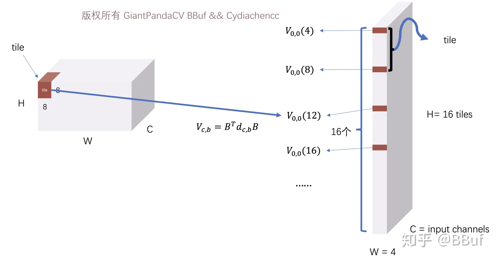

对输入矩阵进行变换的过程

## **4.3 计算M矩阵**

M矩阵的计算公式为：

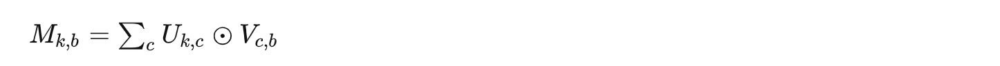

其中，k代表输出通道数，b表示tile序号。

由于上面输入图像块已经执行了Pack策略，这里只需要将对应小块进行乘加操作即完成了M矩阵的计算，这部分的代码实现如下：

```text
#if USE_OMP
    #pragma omp parallel for num_threads(OMP_THREAD)
#endif
        for(int cc = 0; cc < nnOutChannel; cc++){
            int c = cc * 4;
            float *dest0 = dest_tm + c * dst_tm_size;
            float *dest1 = dest_tm + (c + 1) * dst_tm_size;
            float *dest2 = dest_tm + (c + 2) * dst_tm_size;
            float *dest3 = dest_tm + (c + 3) * dst_tm_size;

            const float *ktm = kernel + cc * kernelSize;
            int q = 0;
            
            for(; q + 1 < inChannel; q += 2){
                const float* r0 = src_tm + q * src_tm_size;
                const float* r1 = src_tm + (q + 1) * src_tm_size;
                
                float* destptr0 = dest0;
                float *destptr1 = dest1;
                float *destptr2 = dest2;
                float *destptr3 = dest3;

                for(int r = 0; r < 16; r++){
                    for(int t = 0; t < tiles; t++){
                        for(int m = 0; m < 4; m++){
                            destptr0[m] += r0[m] * ktm[m];
                            destptr0[m] += r1[m] * ktm[m + 4];
                            destptr1[m] += r0[m] * ktm[m + 8];
                            destptr1[m] += r1[m] * ktm[m + 12];
                            destptr2[m] += r0[m] * ktm[m + 16];
                            destptr2[m] += r1[m] * ktm[m + 20];
                            destptr3[m] += r0[m] * ktm[m + 24];
                            destptr3[m] += r1[m] * ktm[m + 28];  
                        }

                        r0 += 4;
                        r1 += 4;
                        destptr0 += 4;
                        destptr1 += 4;
                        destptr2 += 4;
                        destptr3 += 4;
                    }

                    ktm += 32;
                }
            }

            for(; q < inChannel; q++){
                const float *r0 = src_tm + q * src_tm_size;
                float* destptr0 = dest0;
                float *destptr1 = dest1;
                float *destptr2 = dest2;
                float *destptr3 = dest3;

                for(int r = 0; r < 16; r++){
                    for(int t = 0; t < tiles; t++){
                        for(int m = 0; m < 4; m++){
                            destptr0[m] += r0[m] * ktm[m];
                            destptr1[m] += r0[m] * ktm[m + 4];
                            destptr2[m] += r0[m] * ktm[m + 8];
                            destptr3[m] += r0[m] * ktm[m + 12];
                        }

                        r0 += 4;
                        destptr0 += 4;
                        destptr1 += 4;
                        destptr2 += 4;
                        destptr3 += 4;
                    }

                    ktm += 16;
                }
            }
        }
        
#if USE_OMP
    #pragma omp parallel for num_threads(OMP_THREAD)
#endif
        for(int cc = remainOutChannel; cc < outChannel; cc++){
            int c = cc;
            float *dest0 = dest_tm + c * dst_tm_size;
            const float *ktm = kernel + nnOutChannel * kernelSize + 8 * 8 * inChannel * (c - remainOutChannel);

            int q = 0;
            for(; q < inChannel; q++){
                const float* r0 = src_tm + q * src_tm_size;
                float* destptr0 = dest0;
                for(int r = 0; r < 16; r++){
                    for(int i = 0; i < tiles; i++){
                        for(int m = 0; m < 4; m++){
                            destptr0[m] += r0[m] * ktm[m];
                        }

                        r0 += 4;
                        destptr0 += 4;
                    }

                    ktm += 4;
                }
            }
        }
```

至此，我们获得了M矩阵，矩阵大概长下面这样子，它仍然是交错排列的：

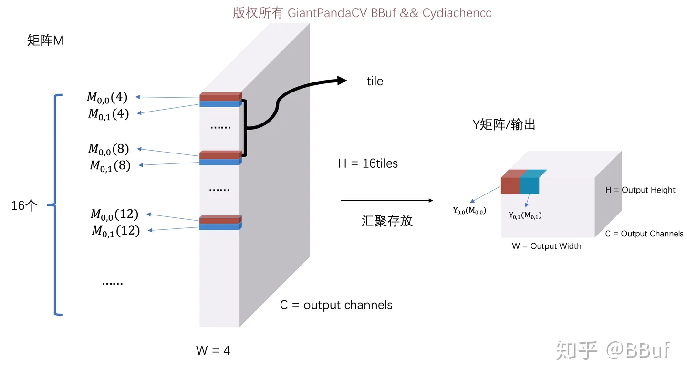

M矩阵长得和V矩阵有点像，主要是通道维度变了

## **4.4 计算结果Y矩阵**

现在就到了最后一步了，我们需要计算结果矩阵Y，公式为：

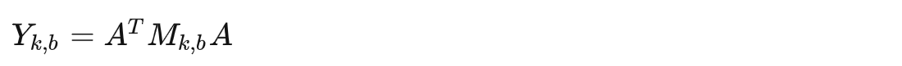

其中k表示输出通道数，b表示tile标号，这部分和上面卷积核的计算类似，代码如下：

```cpp
// Yk,b=A^TMk,bA
// AT=
// ⎡1  1  1   1    1    1      1    0⎤
// ⎢                                 ⎥
// ⎢0  1  -1  2   -2   1/2   -1/2   0⎥
// ⎢                                 ⎥
// ⎢0  1  1   4    4   1/4    1/4   0⎥
// ⎢                                 ⎥
// ⎢0  1  -1  8   -8   1/8   -1/8   0⎥
// ⎢                                 ⎥
// ⎢0  1  1   16  16   1/16  1/16   0⎥
// ⎢                                 ⎥
// ⎣0  1  -1  32  -32  1/32  -1/32  1⎦

        // 0 = r0 + (r1 + r2) + (r3 + r4)     + (r5 + r6) * 32
        // 1 =      (r1 - r2) + (r3 - r4) * 2 + (r5 - r6) * 16
        // 2 =      (r1 + r2) + (r3 + r4) * 4 + (r5 + r6) * 8
        // 3 =      (r1 - r2) + (r3 - r4) * 8 + (r5 - r6) * 4
        // 4 =      (r1 + r2) + (r3 + r4) * 16+ (r5 + r6) * 2
        // 5 = r7 + (r1 - r2) + (r3 - r4) * 32+ (r5 - r6)


        float *dest_tm2 = new float[outW * outH * outChannel];
        const int dst_tm_size2 = outW * outH;
        

        const int outSize = outHeight * outWidth;

#if USE_OMP
    #pragma omp parallel for num_threads(OMP_THREAD)
#endif
        for(int cc = 0; cc < outChannel; cc++){
            float *destptr = dest_tm + cc * dst_tm_size;
            float *outptr = dest_tm2 + cc * dst_tm_size2;

            float tmpA[6][8];

            for(int i = 0; i < outH / 6; i++){
                for(int j = 0; j < outW / 6; j++){
                    float *destptr0 = destptr + (i * w_tm / 8 + j) * dst_tm_w;
                    float *destptr4 = destptr + (i * w_tm / 8 + j + tiles) * dst_tm_w;

                    for(int m = 0; m < 8; m++){

                        float t1 = destptr0[1] + destptr0[2];
                        float t2 = destptr0[1] - destptr0[2];

                        float t3 = destptr0[3] + destptr4[0];
                        float t4 = destptr0[3] - destptr4[0];

                        float t5 = destptr4[1] + destptr4[2];
                        float t6 = destptr4[1] - destptr4[2];

                        tmpA[0][m] = destptr0[0] + t1 + t3 + t5 * 32;
                        tmpA[2][m] = t1 + t3 * 4 + t5 * 8;
                        tmpA[4][m] = t1 + t3 * 16 + t5 + t5;

                        tmpA[1][m] = t2 + t4 + t4 + t6 * 16;
                        tmpA[3][m] = t2 + t4 * 8 + t6 * 4;
                        tmpA[5][m] = destptr4[3] + t2 + t4 * 32 + t6;

                        destptr0 += dst_tm_w * 2 * tiles;
                        destptr4 += dst_tm_w * 2 * tiles;
                    }

                    float *outptr0 = outptr + (i * 6) * outW + j * 6;

                    for(int m = 0; m < 6; m++){

                        const float* tmp0 = tmpA[m];

                        float t1 = tmp0[1] + tmp0[2];
                        float t2 = tmp0[1] - tmp0[2];

                        float t3 = tmp0[3] + tmp0[4];
                        float t4 = tmp0[3] - tmp0[4];

                        float t5 = tmp0[5] + tmp0[6];
                        float t6 = tmp0[5] - tmp0[6];

                        outptr0[0] = tmp0[0] + t1 + t3 + t5 * 32;
                        outptr0[2] = t1 + t3 * 4 + t5 * 8;
                        outptr0[4] = t1 + t3 * 16 + t5 + t5;

                        outptr0[1] = t2 + t4 + t4 + t6 * 16;
                        outptr0[3] = t2 + t4 * 8 + t6 * 4;
                        outptr0[5] = tmp0[7] + t2 + t4 * 32 + t6;

                        outptr0 += outW;
                    }
                }
            }
        } 
```

这部分代码就实现了M矩阵汇聚并利用A矩阵获得了最终的结果Y。这个过程上一节图中已经画了，这里主要实现的是图中的右半部分：


Y矩阵汇聚存放获得输出Blob

但是需要注意的是这里获得的Y有可能是多了几行或者几列，也就是拖尾为0的部分，所以需要把这一部分Crop掉，才能获得我们最终outHeight∗outWidth∗outChannel的结果特征图。Crop部分的代码如下：

```cpp
//crop
        for(int cc = 0; cc < outChannel; cc++){
            float *outptr = dest_tm2 + cc * dst_tm_size2;
            float *outptr2 = dest + cc * outHeight * outWidth;
            for(int i = 0; i < outHeight; i++){
                for(int j = 0; j < outWidth; j++){
                    outptr2[0] = outptr[0];
                    outptr2++;
                    outptr++;
                }
                outptr += (outW - outWidth);
            }
        }
```

至此，WinoGrad的算法流程结束，我们获得了最后的卷积计算结果。

## **5. WinoGrad算法进一步加速**

上面无论是针对U,V,M还是Y矩阵的计算我们使用的都是暴力计算，所以接下来可以使用Neon Instrics和Neon Assembly技术进行优化。介于篇幅原因，这里就不贴代码了，有需要学习的可以关注后续MsnhNet的WinoGrad代码部分`https://github.com/msnh2012/Msnhnet/blob/master/src/layers/arm/MsnhConvolution3x3s1Winograd.cpp`。这个代码实现的思路取自开源框架NCNN，在此表示感谢NCNN这一优秀工作(github：`https://github.com/Tencent/ncnn`)。

## **6. 何时开启WinoGrad卷积**

和Sgemm用于3×3卷积一样，我们也需要思考WinoGrad在何种情况下是适用的，或者说是有明显加速的。这篇文章介绍的WinoGrad卷积是针对NCHW这种内存排布的，然后我们来看一下NCNN在基于NCHW这种内存排布下，是在何种情况下启用WinoGrad(F(6,3))？

通过查看NCNN的源码(`https://github.com/Tencent/ncnn/blob/master/src/layer/arm/convolution_arm.cpp`)可以发现，只有在输入输出通道均>=16，并且特征图长宽均小于等于120的条件下才会启用WinoGrad卷积。

那么这个条件是如何得出的，除了和手工优化的`conv3x3s1`(`https://github.com/msnh2012/Msnhnet/blob/master/src/layers/arm/MsnhConvolution3x3s1.cpp`)在不同条件下做速度对比测试之外，我们也可以感性的分析一下。

第一，WinoGrad算法设计到几个矩阵变换，如果计算量不大，这几个矩阵变换的成本占计算总成本的比例就越大，所以WinoGrad应当是在计算量比较大时才能有效，如VGG16。

第二，当计算量比较大的时候，又要考虑到Cache命中率的问题，这个时候WinoGrad访存可能会比直接手动优化更差，导致速度上不去。

## **7. 速度测试**

由于笔者还未实现完整Neon Instrics和Assembly部分，所以暂时无法给出速度对比。尝试从NCNN的BenchMark中找到WinoGrad的加速效果大概是什么样的，但只能找到各个网络在各种板子上的整体推理速度，没有WinoGrad F(6,3)单独的速度对比，等国庆争取补上来吧。

## **8. 结语**

关于WinoGrad的原理介绍还有工程实现（基于NCNN）暂时就讲到这里了，有问题欢迎在评论区讨论哦。我刚入门移动端优化几个月还有非常多知识需要学习，nihui，虫叔，白牛，大老师他们都是高人，这几个月从他们的文章受益良多，非常感谢！

## **9. 致谢**

- https://zhuanlan.zhihu.com/p/72149270
- [https://www.cnblogs.com/shine-lee/p/10906535.html](https://link.zhihu.com/?target=https%3A//www.cnblogs.com/shine-lee/p/10906535.html)
- https://zhuanlan.zhihu.com/p/81201840