# 一文详解Softmax函数

https://zhuanlan.zhihu.com/p/105722023

## 前言

提到二分类首先想到的可能就是逻辑回归算法。逻辑回归算法是在各个领域中应用比较广泛的机器学习算法。逻辑回归算法本身并不难，最关键的步骤就是将线性模型输出的实数域映射到[0, 1]表示概率分布的有效实数空间，其中Sigmoid函数刚好具有这样的功能。

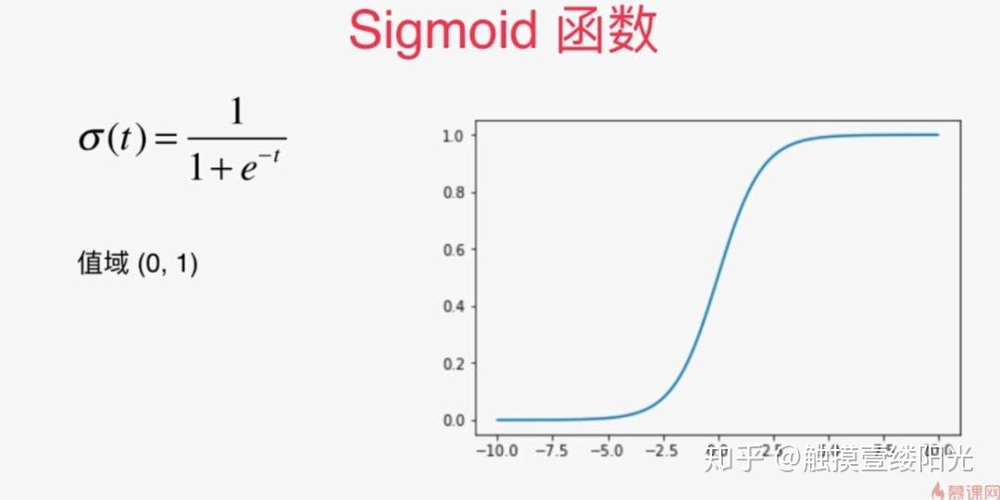

sigmoid激活函数

例如使用逻辑回归算法预测患者是否有恶性肿瘤的二分类问题中，输出层可以只设置一个节点，表示某个事件A发生的概率为 ，其中x为输入。对于患者是否有恶性肿瘤的二分类问题中，A事件可以表示为恶性肿瘤或表示为良性肿瘤（ 表示为良性肿瘤或恶性肿瘤），x为患者的一些特征指标。

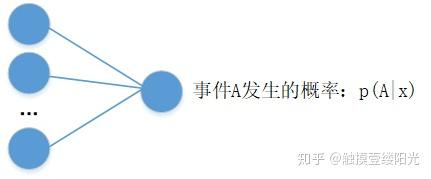

拥有单个输出节点的二分类

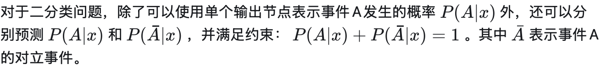

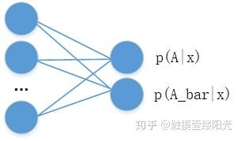

拥有两个输出节点的二分类

两个节点输出的二分类相比于单节点输出的二分类多了一个P(A|x) + P(\bar{A}|x) = 1的约束条件，这个约束条件将输出节点的输出值变成一个概率分布，简单来说各个输出节点的输出值范围映射到[0, 1]，并且约束各个输出节点的输出值的和为1。**当然可以将输出为两个节点的二分类推广成拥有n个输出节点的n分类问题。**

有没有将各个输出节点的输出值范围映射到[0, 1]，并且约束各个输出节点的输出值的和为1的函数呢？

当然，这个函数就是Softmax函数。

## 1. 什么是Softmax？

Softmax从字面上来说，可以分成soft和max两个部分。max故名思议就是最大值的意思。Softmax的核心在于soft，而soft有软的含义，与之相对的是hard硬。很多场景中需要我们找出数组所有元素中值最大的元素，实质上都是求的hardmax。下面使用Numpy模块以及[TensorFlow](https://zhida.zhihu.com/search?content_id=111624172&content_type=Article&match_order=1&q=TensorFlow&zhida_source=entity)深度学习框架实现hardmax。

使用Numpy模块实现hardmax：

```python3
import numpy as np

a = np.array([1, 2, 3, 4, 5]) # 创建ndarray数组
a_max = np.max(a)
print(a_max) # 5
```

使用TensorFlow深度学习框架实现hardmax：

```python3
import tensorflow as tf

print(tf.__version__) # 2.0.0
a_max = tf.reduce_max([1, 2, 3, 4, 5])
print(a_max) # tf.Tensor(5, shape=(), dtype=int32)
```

通过上面的例子可以看出hardmax最大的特点就是只选出其中一个最大的值，即非黑即白。但是往往在实际中这种方式是不合情理的，比如对于文本分类来说，一篇文章或多或少包含着各种主题信息，我们更期望得到文章对于每个可能的文本类别的概率值（置信度），可以简单理解成属于对应类别的可信度。所以此时用到了soft的概念，Softmax的含义就在于不再唯一的确定某一个最大值，而是为每个输出分类的结果都赋予一个概率值，表示属于每个类别的可能性。

下面给出Softmax函数的定义（以第i个节点输出为例）：

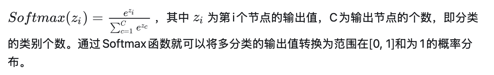

引入指数函数对于Softmax函数是把双刃剑，即得到了优点也暴露出了缺点：

- **引入指数形式的优点**

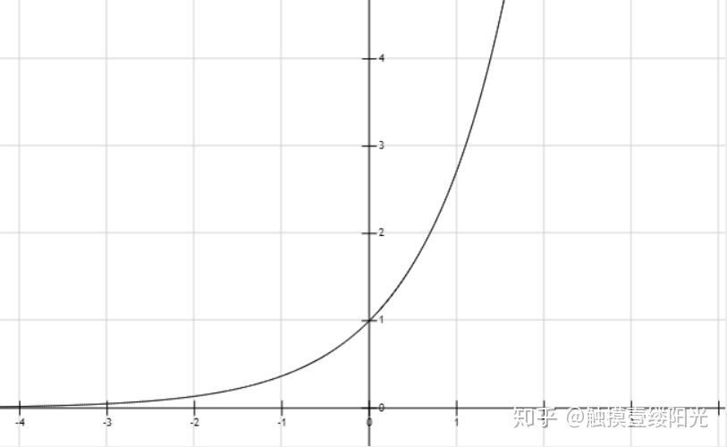

y = e^{x}函数图像

指数函数曲线呈现递增趋势，最重要的是斜率逐渐增大，也就是说在x轴上一个很小的变化，可以导致y轴上很大的变化。这种函数曲线能够将输出的数值拉开距离。假设拥有三个输出节点的输出值为 为[2, 3, 5]。首先尝试不使用指数函数 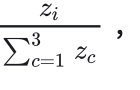，接下来使用指数函数的Softmax函数计算。

```python3
import tensorflow as tf

print(tf.__version__) # 2.0.0
a = tf.constant([2, 3, 5], dtype = tf.float32)

b1 = a / tf.reduce_sum(a) # 不使用指数
print(b1) # tf.Tensor([0.2 0.3 0.5], shape=(3,), dtype=float32)

b2 = tf.nn.softmax(a) # 使用指数的Softmax
print(b2) # tf.Tensor([0.04201007 0.11419519 0.8437947 ], shape=(3,), dtype=float32)
```

两种计算方式的输出结果分别是：

- tf.Tensor([0.2 0.3 0.5], shape=(3,), dtype=float32)
- tf.Tensor([0.04201007 0.11419519 0.8437947 ], shape=(3,), dtype=float32)

结果还是挺明显的，经过使用指数形式的Softmax函数能够将差距大的数值距离拉的更大。

在深度学习中通常使用反向传播求解梯度进而使用梯度下降进行参数更新的过程，而指数函数在求导的时候比较方便。比如 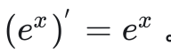。

- **引入指数形式的缺点**

指数函数的曲线斜率逐渐增大虽然能够将输出值拉开距离，但是也带来了缺点，当 zi 值非常大的话，计算得到的数值也会变的非常大，数值可能会溢出。

```python3
import numpy as np

scores = np.array([123, 456, 789])
softmax = np.exp(scores) / np.sum(np.exp(scores))
print(softmax) # [ 0.  0. nan]
```

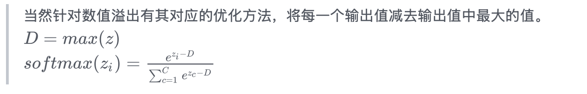

```python3
import numpy as np

scores = np.array([123, 456, 789])
scores -= np.max(scores)
p = np.exp(scores) / np.sum(np.exp(scores))
print(p) # [5.75274406e-290 2.39848787e-145 1.00000000e+000]
```

这里需要注意一下，当使用Softmax函数作为输出节点的激活函数的时候，一般使用交叉熵作为损失函数。由于Softmax函数的数值计算过程中，很容易因为输出节点的输出值比较大而发生数值溢出的现象，在计算交叉熵的时候也可能会出现数值溢出的问题。为了数值计算的稳定性，TensorFlow提供了一个统一的接口，将Softmax与[交叉熵损失函数](https://zhida.zhihu.com/search?content_id=111624172&content_type=Article&match_order=1&q=交叉熵损失函数&zhida_source=entity)同时实现，同时也处理了数值不稳定的异常，使用TensorFlow深度学习框架的时候，一般推荐使用这个统一的接口，避免分开使用Softmax函数与交叉熵损失函数。

TensorFlow提供的统一函数式接口为：

```python3
import tensorflow as tf

print(tf.__version__) # 2.0.0
tf.keras.losses.categorical_crossentropy(y_true, y_pred, from_logits = False)
```

其中y_true代表了One-hot编码后的真实标签，y_pred表示网络的实际预测值：

- 当from_logits设置为True时，y_pred表示未经Softmax函数的输出值；
- 当from_logits设置为False时，y_pred表示为经过Softmax函数后的输出值；

为了在计算Softmax函数时候数值的稳定，一般将from_logits设置为True，此时tf.keras.losses.categorical_crossentropy将在内部进行Softmax的计算，所以在不需要在输出节点上添加Softmax激活函数。

```python3
import tensorflow as tf

print(tf.__version__)
z = tf.random.normal([2, 10]) # 构造2个样本的10类别输出的输出值
y = tf.constant([1, 3]) # 两个样本的真实样本标签是1和3
y_true = tf.one_hot(y, depth = 10) # 构造onehot编码

# 输出层未经过Softmax激活函数,因此讲from_logits设置为True
loss1 = tf.keras.losses.categorical_crossentropy(y_true, z, from_logits = True)
loss1 = tf.reduce_mean(loss1)
print(loss1) # tf.Tensor(2.6680193, shape=(), dtype=float32)

y_pred = tf.nn.softmax(z)
# 输出层经过Softmax激活函数,因此讲from_logits设置为True
loss2 = tf.keras.losses.categorical_crossentropy(y_true, y_pred, from_logits = False)
loss2 = tf.reduce_mean(loss2)
print(loss2) # tf.Tensor(2.668019, shape=(), dtype=float32)
```

虽然上面两个过程结果差不多，但是当遇到一些不正常的数值时，将from_logits设置为True时TensorFlow会启用一些优化机制。**因此推荐使用将from_logits参数设置为True的统一接口。**

## 2. Softmax函数求导

单个输出节点的二分类问题一般在输出节点上使用Sigmoid函数，拥有两个及其以上的输出节点的二分类或者多分类问题一般在输出节点上使用Softmax函数。其他层建议使用的激活函数可以参考下面的文章。

现在可以构建比较复杂的神经网络模型，最重要的原因之一得益于[反向传播算法](https://zhida.zhihu.com/search?content_id=111624172&content_type=Article&match_order=1&q=反向传播算法&zhida_source=entity)。反向传播算法从输出端也就是损失函数开始向输入端基于链式法则计算梯度，然后通过计算得到的梯度，应用梯度下降算法迭代更新待优化参数。

由于反向传播计算梯度基于链式法则，因此下面为了更加清晰，首先推导一下Softmax函数的导数。作为最后一层的激活函数，求导本身并不复杂，但是需要注意需要分成两种情况来考虑。

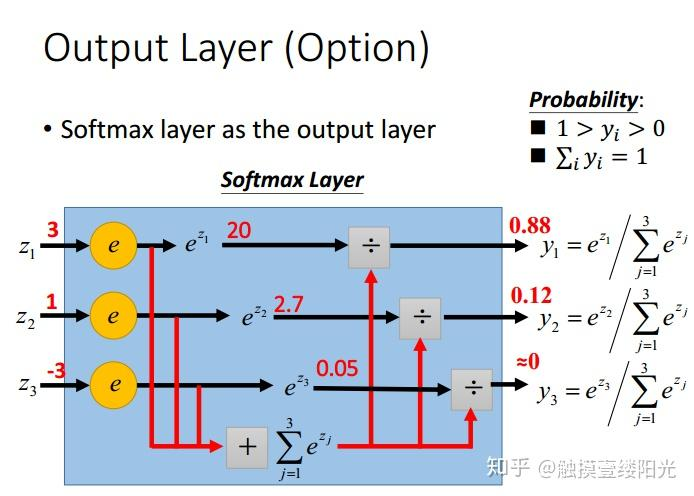

来源李宏毅老师PPT

为了方便说明，先来简单看一个小例子。

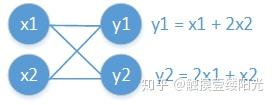

简单计算图

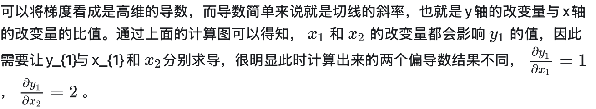

绘制拥有三个输出节点的Softmax函数的计算图：

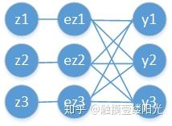

拥有三个输出节点的Softmax函数的计算图

回顾Softmax函数的表达式：

 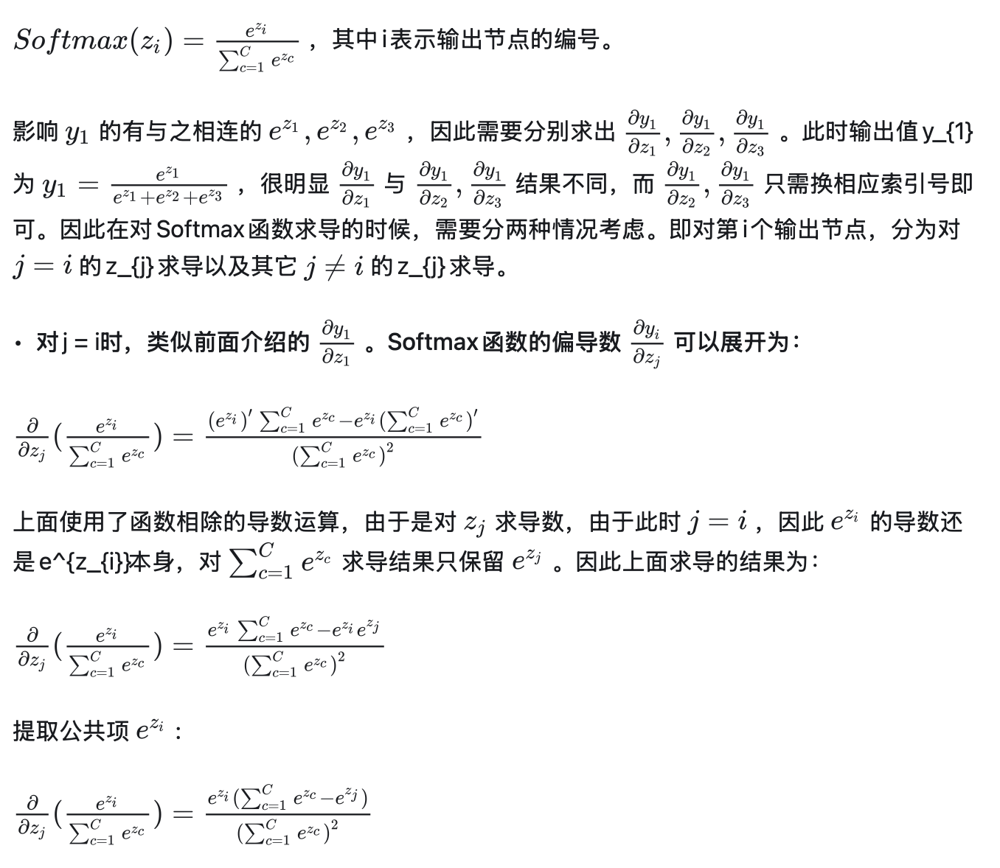

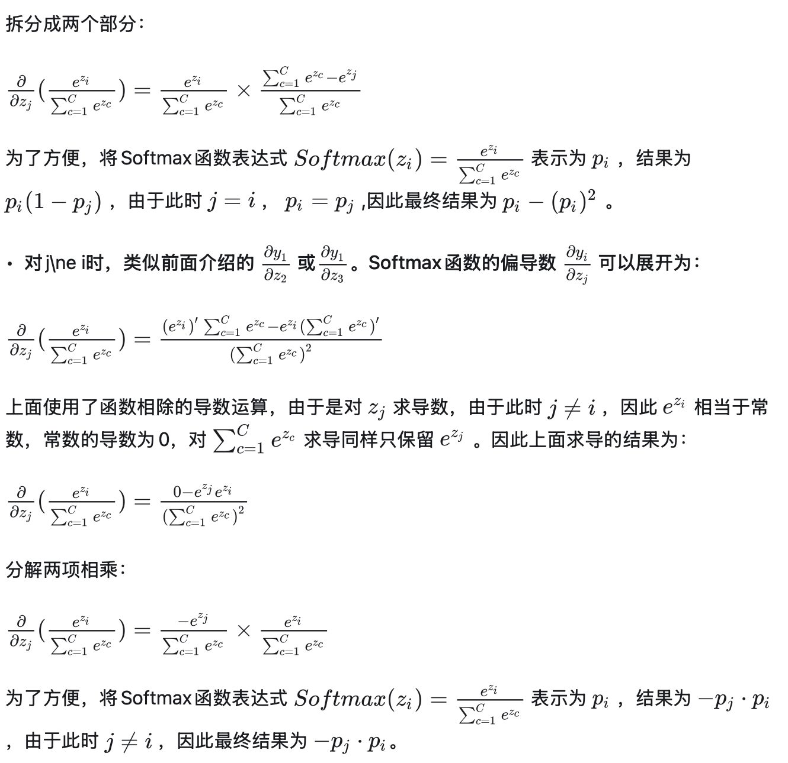

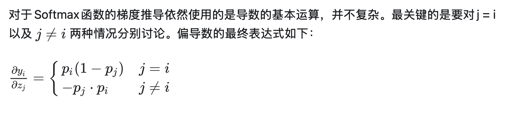

## 3. 交叉熵损失函数

接下来看一看Softmax的损失函数。回顾Softmax函数的表达式：

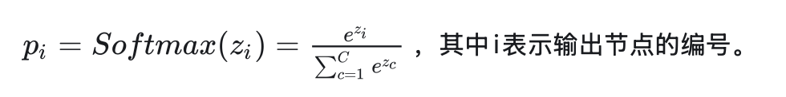

假设此时第i个输出节点为正确类别对应的输出节点，则 是正确类别对应输出节点的概率值。添加 运算不影响函数的单调性，首先为 添加 运算：


由于此时的 是正确类别对应的输出节点的概率，当然希望此时的 越大越好（当然最大不能超过1）。通常情况下使用梯度下降法来迭代求解，因此只需要为 加上一个负号变成损失函数，现在变成希望损失函数越小越好：


对上面的式子进一步处理：


这样就将上面的Softmax一步一步转换成了Softmax的损失函数。


但是通常我们说起交叉熵往往是下面的式子：


**那上面这种形式的损失函数和上面通过Softmax函数一步一步转换推导成的损失函数有什么区别呢？**

为了方便将第一个 命名为式子1，将通常的交叉熵损失函 数命名为式子2。其实式子1和式子2本质上是一样的。对于式子1来说，只针对正确类别的对应的输出节点，将这个位置的Softmax值最大化，而式子2则是直接衡量真实分布和实际输出的分布之间的距离。

对于分类任务来说，真实的样本标签通常表示为one-hot的形式。比如对于三分类来说，真实类别的索引位置为1，也就是属于第二个类别，那么使用one-hot编码表示为[0, 1, 0]，也就是仅正确类别位置为1，其余位置都为0。而式子2中的 就是真实样本的标签值，将[0, 1, 0]代入式子2中即 ：

最终的结果为 ，式子1只是对正确类别位置计算损失值 

既然式子1和式子2两个损失函数一样，那么接下来计算损失函数的导数使用比较常见的式子2，也就是 ，在这里直接推导最终损失函数 对网络输出变量 的偏导数，展开为：


接下来利用复合函数分解成：


 ，其中 就是我们前面推导的Softmax函数的偏导数。

对于Softmax函数分为两种情况，因此需要将求和符号拆分成 以及 这两种情况，代入求解公式，可得：


进一步进一步化简为：


提取公共项 ，可得：


至此完成了对交叉熵函数的梯度推导。对于分类问题中标签y通过one-hot编码的方式，则有如下关系：


因此将交叉熵的偏导数进一步简化为：


虽然求导过程非常废杂，但是最终推导的结果非常简单。


最后为了直观的感受Softmax与交叉熵的效果，我使用一个简单的输出值[4, -4, 3]，通过计算做了下面三分类的表格。


按比例推所有拉一个

此时 是模型输出的实际值，而 是真实的标签值。

- **计算交叉熵损失值：**

```python3
import tensorflow as tf

print(tf.__version__) # 2.0.0
z = tf.constant([4, -4, 3], dtype = tf.float32)
y_hat = tf.nn.softmax(z)
y = tf.one_hot(2, depth = 3)
print("x:",z)
print("y_hat:", y_hat)
print("y:", y)

CE = tf.keras.losses.categorical_crossentropy(y, z, from_logits = True)
CE = tf.reduce_mean(CE)

print("cross_entropy:", CE)
```

输出结果：

```text
x: tf.Tensor([ 4. -4.  3.], shape=(3,), dtype=float32)

y_hat: tf.Tensor([7.3087937e-01 2.4518272e-04 2.6887551e-01], shape=(3,), dtype=float32)

y: tf.Tensor([0. 0. 1.], shape=(3,), dtype=float32)

cross_entropy: tf.Tensor(1.3135068, shape=(), dtype=float32)
```

- **计算梯度值：**

```python3
import tensorflow as tf

print(tf.__version__) # 2.0.0
z = tf.constant([4, -4, 3], dtype = tf.float32)

# 构造梯度记录器
with tf.GradientTape(persistent = True) as tape:
    tape.watch([z])
    # 前向传播过程
    y = tf.one_hot(2, depth=3)
    CE = tf.keras.losses.categorical_crossentropy(y, z, from_logits=True)
    CE = tf.reduce_mean(CE)

dCE_dz = tape.gradient(CE, [z])[0]
print(dCE_dz)
```

输出结果：

```text
<tf.Tensor: id=60, shape=(3,)
, dtype=float32, numpy=array([ 7.3087937e-01,  2.4518272e-04, -7.3112452e-01], dtype=float32)>
```

最后参数更新只需看最后一行，可以看出Softmax和交叉熵损失函数的梯度下降更新结果：

1. 先将所有的 值减去对应的Softmax的结果，可以简单记为推所有；
2. 然后将真实标记中的对应位置的值加上1，简单记为拉一个；

总的概括Softmax+交叉熵损失函数参数更新为"推所有，拉一个"。


> *参考：*
> *1. [三分钟带你对 Softmax 划重点](https://link.zhihu.com/?target=https%3A//www.jianshu.com/p/2b35be46a098%3Futm_source%3Doschina-app)*
> *2. 《TensorFlow深度学习》*
> *3. [触摸壹缕阳光：[L4\]使用LSTM实现语言模型-softmax与交叉熵](https://zhuanlan.zhihu.com/p/41571249)*