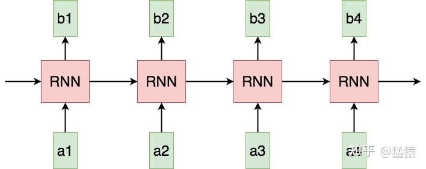
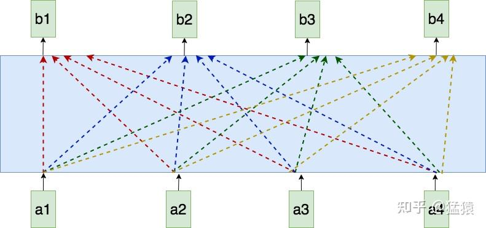
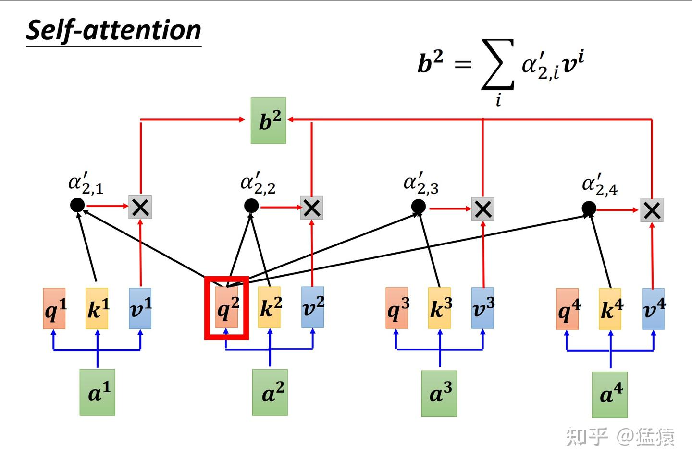
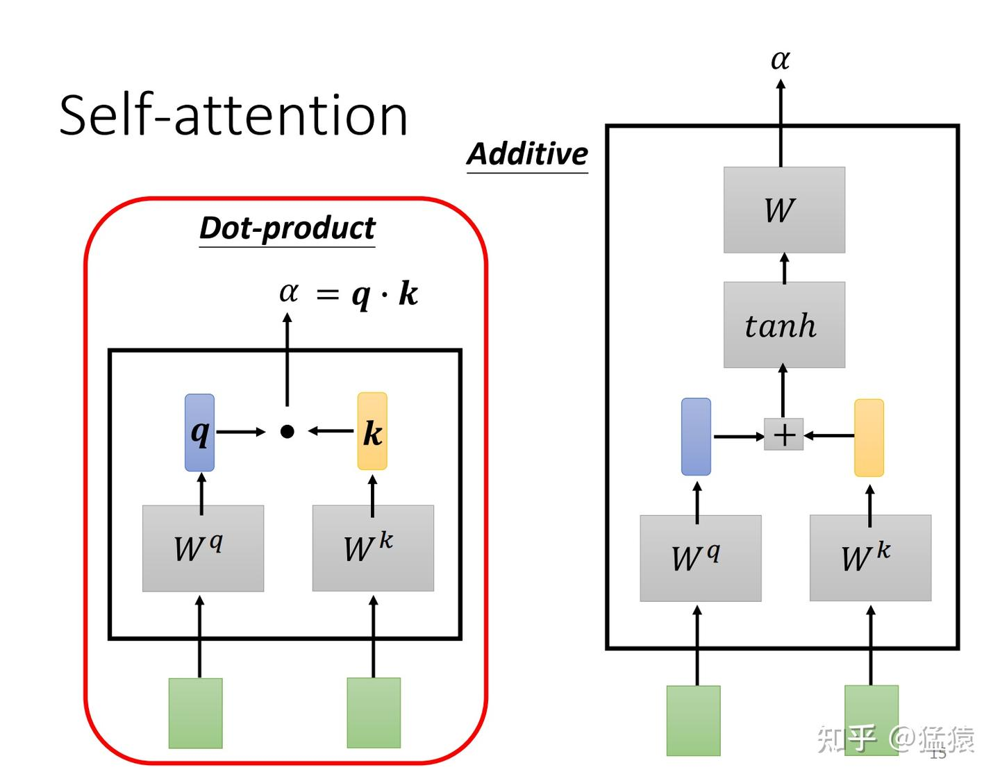
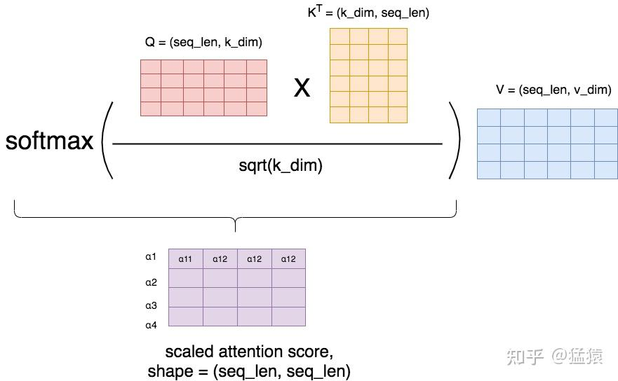
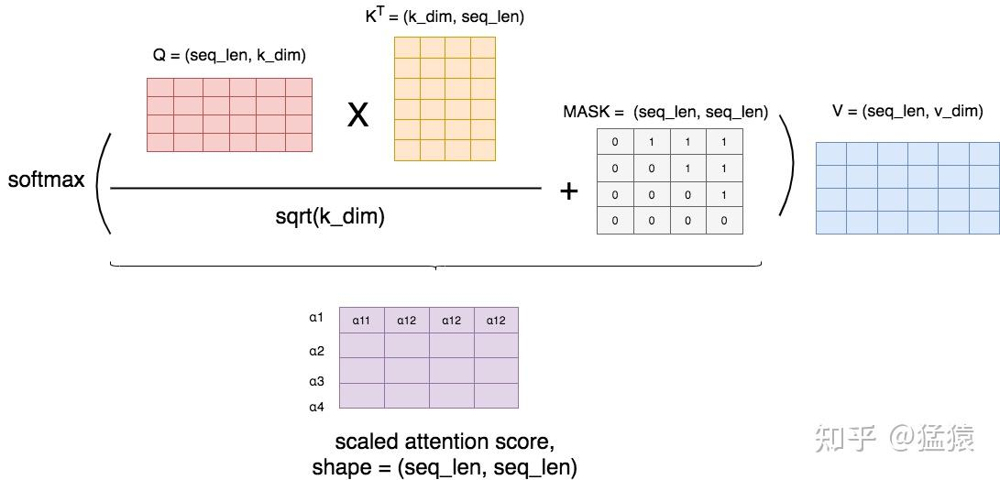
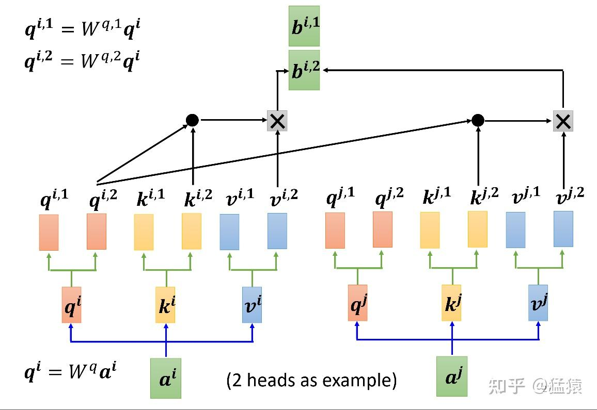
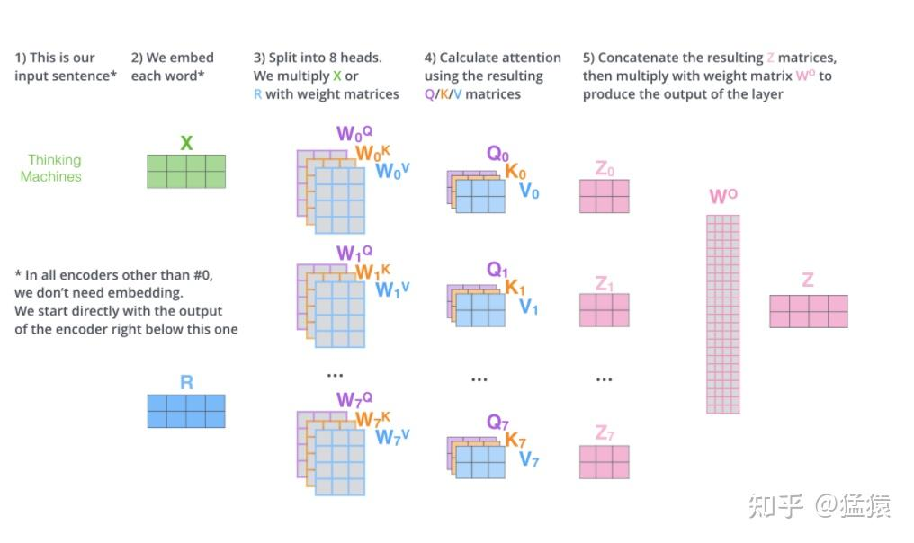
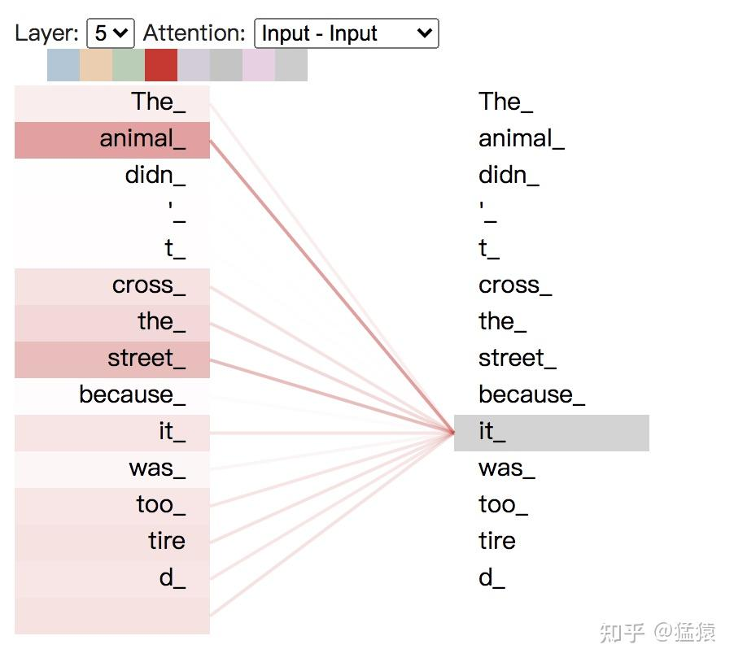
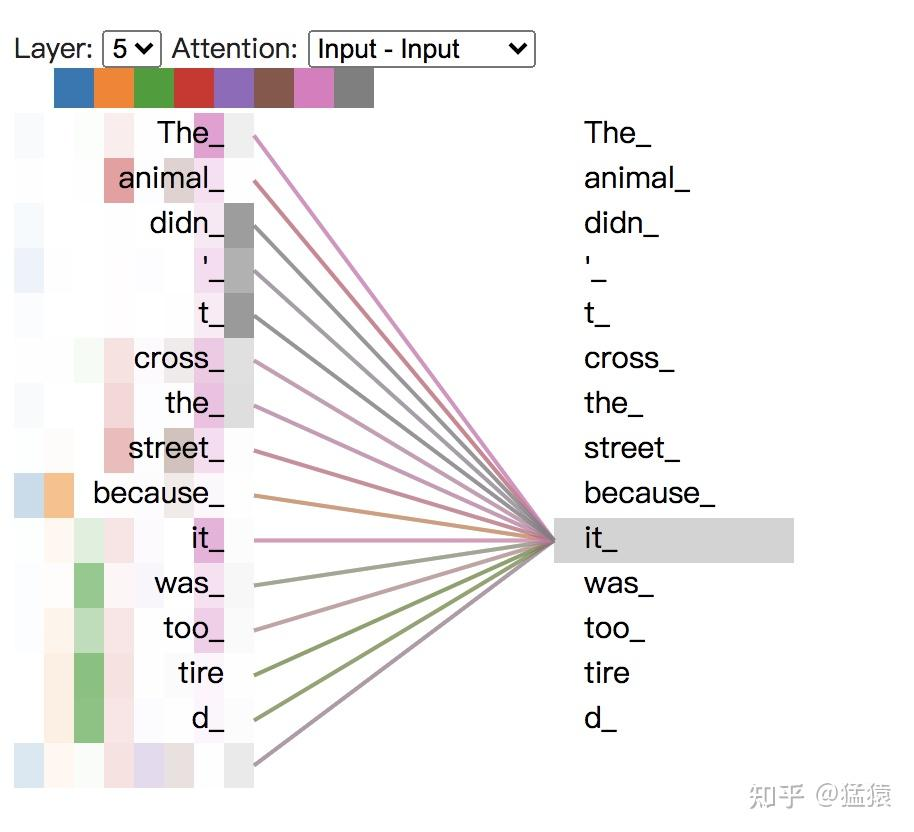

# Transformer学习笔记二：Self-Attention（自注意力机制）

https://zhuanlan.zhihu.com/p/455399791

## 二、Attention构造

### 2.1 Attention的基本运作方式

首先，来看RNN这样一个用于处理序列数据的经典模型。




图1: 传统RNN


在RNN当中，tokens是一个一个被喂给模型的。比如在a3的位置，模型要等a1和a2的信息都处理完成后，才可以生成a3。这样的作用机制，使得RNN存在以下几个问题：
**(1) Sequential operations的复杂度随着序列长度的增加而增加。**
这是指模型下一步计算的等待时间，在RNN中为O(N)。该复杂度越大，模型并行计算的能力越差，反之则反。
**(2) Maximum Path length的复杂度随着序列长度的增加而增加。**
这是指信息从一个数据点传送到另一个数据点所需要的距离，在RNN中同样为O(N)，距离越大，则在传送的过程中越容易出现信息缺失的情况，即数据点对于远距离处的信息，是很难“看见”的。

那么，在处理序列化数据的时候，是否有办法，在提升模型的并行运算能力的同时，对于序列中的每个token，也能让它不损失信息地看见序列里的其他tokens呢？

Attention就作为一种很好的改进办法出现了。



图2: Self-attention


如图，蓝色方框为一个attention模型。在每个位置，例如在a2处产生b2时，attention将会同时看过a1到a4的每个token。此外，每个token生成其对应的输出的过程是同时进行的，计算不需要等待。下面来看attention内部具体的运算过程。

###   2.2 Attention的计算过程图解


**2.2.1 Self-attention**


**（1）计算框架**


Self-attention的意思是，我们给Attention的输入都来自同一个序列，其计算方式如下：



图3: self-attention计算框架 （图片来自李宏毅老师PPT）

这张图所表示的大致运算过程是：
对于每个token，先产生三个向量query，key，value：

- query向量类比于询问。某个token问：“其余的token都和我有多大程度的相关呀？”
- key向量类比于索引。某个token说：“我把每个询问内容的回答都压缩了下装在我的key里”
- value向量类比于回答。某个token说：“我把我自身涵盖的信息又抽取了一层装在我的value里”


以图中的token a2为例：

- 它产生一个query，每个query都去和别的token的key做“**某种方式**”的计算，得到的结果我们称为attention score（即为图中的$$\alpha $$）。则一共得到四个attention score。（attention score又可以被称为attention weight）。
- 将这四个score分别乘上每个token的value，我们会得到四个抽取信息完毕的向量。
- 将这四个向量相加，就是最终a2过attention模型后所产生的结果b2。


**（2）产生query，key和value**


下图描述了产生query(q)，key(k)和value(v)的过程：


图4: 产生query， key和value


假设batch_size=1，输入序列X的形状为(seq_len = 4, d_model = 6)，则对于这串序列，我们产生三个参数矩阵： $W^{Q}, W^{K}, W^{V}$ 。通过上述的矩阵乘法，我们可以得到最终的结果Q，K，V。

一般来说， $W^{Q}$ 和 $W^{K}$ 都同样使用k_dim， $$W^{V}$ 使用v_dim。k_dim和v_dim不一定要相等，但在transformer的原始论文中，采用的策略是，设num_heads为self-attention的头数，则:
$k\_dim = v\_dim = d\_model//num\_heads$

上图所绘是num_heads = 1的情况。关于num_heads的概念，在本文的后面会详细解释。


**（3）计算attention score**


总结一下，到目前为止，对于某条输入序列X，我们有：
$\left\{\begin{matrix} Q = XW^Q\\ K = XW^K\\ V = XW^V \end{matrix}\right.$

现在，我们做两件事：

- 利用Q和K，计算出attention score矩阵，这个矩阵由图3中的 $\alpha$ 组成。
- 利用V和attention score矩阵，计算出Attention层最终的输出结果矩阵，这个矩阵由图3中的b组成。

记最终的输出结果为 $Attention(Q,K,V)$ ，则有：


$Attention(Q,K,V) = softmax(\frac{QK^T}{\sqrt{d_k} } )V$

这个 $d_k$ 就是k_dim，而 $softmax(\frac{QK^T}{\sqrt{d_k} } )$ 就是Attention Score矩阵，我们来详细看下这个矩阵的计算过程。

如图5，计算attention score的主流方式有两种，在transformer的论文中，采用的是dot-product（因为不需要额外再去训练一个W矩阵，运算量更小），因此我们来重点关注一下dot-product。



图5: 计算attention score的两种方式


更确切地说，论文中所采用的是scaled dot-product，因为乘上了因子 $1/\sqrt{d_k}$ 。在softmax之后，attention score矩阵的每一行表示一个token，每一列表示该token和对应位置token的 $\alpha$ 值，因为进行了softmax，每一行的 $\alpha$ 值相加等于1。



图6: scaled-dot-product

**（勘误：紫色方框中的下标应该是 $\alpha_{11}, \alpha_{12},\alpha_{13},\alpha_{14},$ )**

**之所以进行scaling，是为了使得在softmax的过程中，梯度下降得更加稳定，避免因为梯度过小而造成模型参数更新的停滞**。下面我们通过数学证明，来解释这个结论。为了表达方便（也为了和论文的标识保持一致），我们把k_dim写成 $d_{k}$ ，同理v_dim写成 $d_{v}$ ，S表示softmax函数，假设在做softmax之前，紫色矩阵里的每一个值为 $\alpha_{ij}^{*}$ ，则有：

$\alpha_{ij}=S(\alpha_{ij}^{*}) = \frac{e^{\alpha_{ij}^{*}}}{ {\textstyle \sum_{j=1}^{d_k}e^{\alpha_{ij}^{*}}} } $


聚焦到紫色矩阵的某一行，对于其中某个 ${j}' $ ，我们有：


$\begin{aligned} \frac{\partial S(\alpha_{i{j}'}^{*})}{\partial \alpha_{i{j}'}^{*}} &= S(\alpha_{i{j}'}^{*})(1-S(\alpha_{i{j}'}^{*}))\\ \frac{\partial S(\alpha_{i{j}'}^{*})}{\partial \alpha_{ij}^{*}} &= -S(\alpha_{i{j}'}^{*})S(\alpha_{ij}^{*}), \qquad j\ne {j}' \end{aligned}$

从上面可以看出：

- 当 $\alpha_{i{j}'}^{*}$ 相对于同一行其他的 $\alpha_{ij}^{*}$ 更大的时候， $S(\alpha_{i{j}'}^{*})$ 趋近于1， $S(\alpha_{ij}^{*})$ 趋近于0，此时以上的两个结果都趋近于0。
- 当 $\alpha_{i{j}'}^{*}$ 相对于同一行其他的 $\alpha_{ij}^{*}$ 更小的时候， $S(\alpha_{i{j}'}^{*})$ 趋近于0， $S(\alpha_{ij}^{*})$ 趋近于1，此时以上的两个结果都趋近于0。


**总结起来，即当** **$\alpha_{i{j}'}^{\*}$** **相对于其他结果过大或者过小时，都会造成softmax函数的偏导趋近于0（梯度过低）。**在这种情况下，整个模型在backprop的过程中，经过softmax之后，就无法继续传播到softmax之前的函数上，造成模型参数无法更新，影响了模型的训练效率。

那么 $\alpha_{i{j}}^{*}$ 是怎么计算来的呢？通过前面的讲解可以知道：
$\alpha_{ij}^{*}=qk^{T} = \sum_{j=1}^{d_{k}}q_{ij}k_{ji}$
假设向量q和k中的每一个元素都是相互独立，均值为0，方差为1的随机变量，那么易知 $\alpha_{i{j}}^{*}$ 的均值也为0，方差为 $d_{k}$ 。 $d_k$ 较大，意味着不同 $\alpha_{i{j}}^{*}$ 间值的差距也很大，这就导致了上面所说的梯度消失的问题。


###  2.3 Masked Attention


有时候，我们并不想在做attention的时候，让一个token看到整个序列，我们只想让它看见它左边的序列，而要把右边的序列遮蔽（Mask）起来。例如在transformer的decoder层中，我们就用到了masked attention，这样的操作可以理解为模型为了防止decoder在解码encoder层输出时“作弊”，提前看到了剩下的答案，因此需要强迫模型根据输入序列左边的结果进行attention。

Masked的实现机制其实很简单，如图：



图7: Masked Attention


首先，我们按照前文所说，正常算attention score，然后我们用一个MASK矩阵去处理它（这里的+号并不是表示相加，只是表示提供了位置覆盖的信息）。在MASK矩阵标1的地方，也就是需要遮蔽的地方，我们把原来的值替换为一个很小的值（比如-1e09），而在MASK矩阵标0的地方，我们保留原始的值。这样，在进softmax的时候，那些被替换的值由于太小，就可以自动忽略不计，从而起到遮蔽的效果。

举例来说明MASK矩阵的含义，每一行表示对应位置的token。例如在第一行第一个位置是0，其余位置是1，这表示第一个token在attention时，只看到它自己，它右边的tokens是看不到的。以此类推。

###  2.4 Multihead Attention 

在图像中，我们知道有不同的channel，每一个channel可以用来识别一种模式。如果我们对一张图采用attention，比如把这张图的像素格子拉平成一列，那么我们可以对每个像素格子训练不同的head，每个head就类比于一个channel，用于识别不同的模式。


而在NLP中，这种模式识别同样重要。比如第一个head用来识别词语间的指代关系(某个句子里有一个单词it，这个it具体指什么呢），第二个head用于识别词语间的时态关系（看见yesterday就要用过去式）等等。

图8展示了multihead attention的运作方式。设头的数量为num_heads，那么本质上，就是训练num_heads个 $W^Q，W^K, W^V$ 个矩阵，用于生成num_heads个 $Q, K, V$ 结果。每个结果的计算方式和单头的attention的计算方式一致。最终将生成的b连接起来生成最后的结果。图9详细展示了8个head的矩阵化的运算过程，由于拆分成了多头，则此时有
$k\_dim = v\_dim = d\_model // num\_heads$
也就是说， $W^Q，W^K, W^V$ 的维度变为 $(d\_model, d\_model // num\_heads)$。按照这个规则拆分后，多头的运算量和原来单头的运算量一样。同时在图9中，在输出部分出现了一个 $W^O$ 矩阵，这个矩阵用于将拼接起来的多头输出转换为最终总输出



图8: Multihead Attention




图9: 8头Attention矩阵化计算过程


将每个head上的attention score分数打出，可以具象化地感受每个head的关注点，以入句子"The animal didn't cross the streest because it was too tired"为例，可视化代码可[点此](https://link.zhihu.com/?target=https%3A//colab.research.google.com/github/tensorflow/tensor2tensor/blob/master/tensor2tensor/notebooks/hello_t2t.ipynb%23scrollTo%3DOJKU36QAfqOC)（存在Google colab上，需要翻墙）。



图10: 单头attention可视化


如图10，颜色越深表示attention score越大，我们构造并连接五层的attention模块，可以发现it和animal，street关系密切。现在我们把8个头全部加上去，参见图11。



图11: 8头attention


如图11，一种颜色表示一个头下attention score的分数，可以看出，不同的头所关注的点各不相同。


## 三、Attention代码实践

这里提供一个Mutihead Attention的python实现方法，它可以快速帮助我们了解一个attention层的计算过程，同时可以很方便地打出中间步骤。Tensorflow和Pytorch的源码里有更为工业化的实现方式，包加速运算、引入bias，自定义维度等等。

```python3
import numpy as np
import torch
from torch import Tensor
from typing import Optional, Any, Union, Callable
import torch.nn as nn
import torch.nn.functional as F
import math, copy, time


class MultiHeadedAttention(nn.Module):
    def __init__(self, 
                num_heads: int, 
                d_model: int, 
                dropout: float=0.1):
        super(MultiHeadedAttention, self).__init__()
        assert d_model % num_heads == 0, "d_model must be divisible by num_heads"
        # Assume v_dim always equals k_dim
        self.k_dim = d_model // num_heads
        self.num_heads = num_heads
        self.proj_weights = clones(nn.Linear(d_model, d_model), 4) # W^Q, W^K, W^V, W^O
        self.attention_score = None
        self.dropout = nn.Dropout(p=dropout)
        
    def forward(self, 
                query:Tensor, 
                key: Tensor, 
                value: Tensor, 
                mask:Optional[Tensor]=None):
        """
        Args:
            query: shape (batch_size, seq_len, d_model)
            key: shape (batch_size, seq_len, d_model)
            value: shape (batch_size, seq_len, d_model)
            mask: shape (batch_size, seq_len, seq_len). Since we assume all data use a same mask, so
                  here the shape also equals to (1, seq_len, seq_len)
        
        Return:
            out: shape (batch_size, seq_len, d_model). The output of a multihead attention layer
        """
        if mask is not None:
            mask = mask.unsqueeze(1)
        batch_size = query.size(0)
        
        # 1) Apply W^Q, W^K, W^V to generate new query, key, value
        query, key, value \
            = [proj_weight(x).view(batch_size, -1, self.num_heads, self.k_dim).transpose(1, 2)
                for proj_weight, x in zip(self.proj_weights, [query, key, value])] # -1 equals to seq_len
        
        # 2) Calculate attention score and the out
        out, self.attention_score = attention(query, key, value, mask=mask, 
                                 dropout=self.dropout)
        
        # 3) "Concat" output
        out = out.transpose(1, 2).contiguous() \
             .view(batch_size, -1, self.num_heads * self.k_dim)

        # 4) Apply W^O to get the final output
        out = self.proj_weights[-1](out)
        
        return out


def clones(module, N):
        "Produce N identical layers."
        return nn.ModuleList([copy.deepcopy(module) for _ in range(N)])
    
    
def attention(query: Tensor, 
              key: Tensor, 
              value: Tensor, 
              mask: Optional[Tensor] = None, 
              dropout: float = 0.1):
    """
    Define how to calculate attention score
    Args:
        query: shape (batch_size, num_heads, seq_len, k_dim)
        key: shape(batch_size, num_heads, seq_len, k_dim)
        value: shape(batch_size, num_heads, seq_len, v_dim)
        mask: shape (batch_size, num_heads, seq_len, seq_len). Since our assumption, here the shape is
              (1, 1, seq_len, seq_len)
    Return:
        out: shape (batch_size, v_dim). Output of an attention head.
        attention_score: shape (seq_len, seq_len).

    """
    k_dim = query.size(-1)

    # shape (seq_len ,seq_len)，row: token，col: that token's attention score
    scores = torch.matmul(query, key.transpose(-2, -1)) / math.sqrt(k_dim)
        
    if mask is not None:
        scores = scores.masked_fill(mask == 0, -1e10)

    attention_score = F.softmax(scores, dim = -1)

    if dropout is not None:
        attention_score = dropout(attention_score)
        
    out = torch.matmul(attention_score, value)
    
    return out, attention_score # shape: (seq_len, v_dim), (seq_len, seq_lem)


if __name__ == '__main__':
    d_model = 8
    seq_len = 3
    batch_size = 6
    num_heads = 2
    # mask = None
    mask = torch.tril(torch.ones((seq_len, seq_len)), diagonal = 0).unsqueeze(0)
    
    input = torch.rand(batch_size, seq_len, d_model)
    multi_attn = MultiHeadedAttention(num_heads = num_heads, d_model = d_model, dropout = 0.1)
    out = multi_attn(query = input, key = input, value = input, mask = mask)
    print(out.shape)
```


## 四、参考

1. [https://jalammar.github.io/illustrated-transformer/](https://link.zhihu.com/?target=https%3A//jalammar.github.io/illustrated-transformer/)
2. [https://speech.ee.ntu.edu.tw/~hylee/ml/ml2021-course-data/self_v7.pdf](https://link.zhihu.com/?target=https%3A//speech.ee.ntu.edu.tw/~hylee/ml/ml2021-course-data/self_v7.pdf)
3. [https://colab.research.google.com/github/tensorflow/tensor2tensor/blob/master/tensor2tensor/notebooks/hello_t2t.ipynb#scrollTo=odi2vIMHC3Rm](https://link.zhihu.com/?target=https%3A//colab.research.google.com/github/tensorflow/tensor2tensor/blob/master/tensor2tensor/notebooks/hello_t2t.ipynb%23scrollTo%3Dodi2vIMHC3Rm)