# 一文读懂：混合专家模型 (MoE)-deepseek

https://zhuanlan.zhihu.com/p/680190127

本文大部分部分内容摘自[https://huggingface.co/blog/moe](https://link.zhihu.com/?target=https%3A//huggingface.co/blog/moe)

> 先了解一下moe和transformer的差别：
>
> 1. 核心机制差异：
>
> Transformer 的核心是[自注意力机制](https://zhida.zhihu.com/search?content_id=239283275&content_type=Article&match_order=1&q=自注意力机制&zhida_source=entity)，通过全连接的方式建模序列内所有位置的交互，属于密集计算范式。MoE 的本质是条件计算，将模型拆分为多个专家网络，通过动态路由（如Top-k门控）对每个输入选择性地激活部分专家，实现稀疏化计算。二者的根本区别在于是全参数或局部参数参与计算。
>
> 2. 参数与计算效率的权衡：
>
> Transformer 的参数量和计算成本严格绑定（参数量增长必然导致计算量增加）。MoE 通过专家并行化实现了参数规模与计算成本的解耦——模型总参数量无论是多少，其实际计算量仅取决于激活的专家数（如每token仅使用2个专家）。

------

deepseek的王炸出现，MOE方法更加引起关注。


在这文中，将深入探讨 MoE 的核心组件、训练方法，以及在推理过程中需要考量的各种因素。

混合专家模型 (MoE)的特点:

- 与稠密模型相比， **预训练速度更快**
- 与具有相同参数数量的模型相比，具有更快的 **推理速度**
- 需要 **大量显存**，因为所有专家系统都需要加载到内存中
- 在 **微调方面存在诸多挑战**，但 近期的研究 表明，对混合专家模型进行 **指令调优具有很大的潜力**。

为实现大模型的高效训练与推理，研究方向主要有三种：

一是从底层架构入手，如将Transformer架构改为基于状态空间模型（SSM）的Mamba架构之类的；

二是优化预训练模型微调方法，例如通过少量示例和系统提示对基础LLM进行对齐；

三是采用混合专家模型（Mixture of Experts，MoE）的大而化之处理方式。随着Mixtral 8x7B的推出，其基于MoE的Transformer架构受到广泛关注。

## **什么是混合专家模型？**

大模型的参数规模是提升大模型性能的关键因素之一。在有限的计算资源预算下，用更少的训练步数训练一个更大的模型，往往比用更多的步数训练一个较小的模型效果更好。

混合专家模型 的显著优势是能够在远少于稠密模型所需的计算资源下进行有效的预训练。也就是在相同的计算开销条件下，可以显著扩大模型或数据集的规模。特别是在预训练阶段，与稠密模型相比，混合专家模型通常能够更快地达到相近的性能水平。

### 混合专家模型MoE

MoE的思想出发点是：如果有一个包括了多个领域知识的复杂问题，应该使用什么样的方法来解决呢？

最直接的办法就是把各个领域的专家集合到一起来攻克这个任务，比如事先要把不同的任务先分离出来，这样才便于分发给不同领域的专家，让他们各自独立处理，最后再汇总结论。

混合专家模型正是基于这样的理念，它由多个专业化的子模型（即“专家”）组合而成，每一个“专家”都在其擅长的领域内做出贡献。而决定哪个“专家”参与解答特定问题的，是一个称为“[门控网络](https://zhida.zhihu.com/search?content_id=239283275&content_type=Article&match_order=1&q=门控网络&zhida_source=entity)”的机制。

那么，究竟什么是一个混合专家模型呢？混合专家模型主要由两个关键部分组成:

- **稀疏 MoE 层**: 这些层代替了传统 Transformer 模型中的前馈网络 (FFN) 层。MoE 层包含若干“专家”(例如 8 个)，每个专家本身是一个独立的神经网络。在实际应用中，这些专家通常是前馈网络 (FFN)，或更复杂的网络结构，从而形成层级式的 MoE 结构。
- **门控网络或路由**: 这个部分用于决定哪些词元(token) 被分发到哪个专家。例如，在下图中，“More”这个令牌可能被发送到第二个专家，而“Parameters”这个词元被发送到第一个专家。有时候，一个词元甚至可以分发给多个专家。词元的路由方式是 MoE 使用中的一个关键点，因为路由器由学习的参数组成，并且与网络的其他部分一同进行预训练。

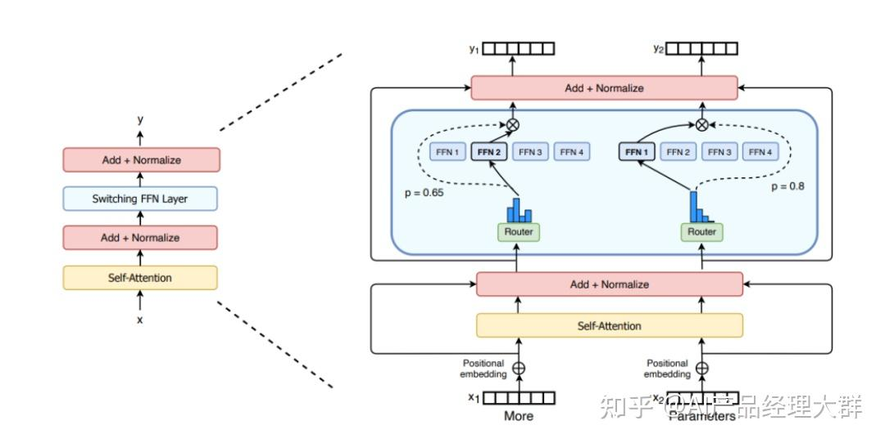

Switch Transformers paper 论文中的 MoE layer

简单来说，在混合专家模型 中，我们将传统 Transformer 模型中的每个前馈网络 (FFN) 层替换为 MoE 层，其中 MoE 层由两个核心部分组成: 一个门控网络和若干数量的专家。

尽管混合专家模型 提供了若干显著优势，例如更高效的预训练和与稠密模型相比更快的推理速度，但它们也伴随着一些挑战:

- **训练挑战**: 虽然 MoE 能够实现更高效的计算预训练，但它们在微调阶段往往面临泛化能力不足的问题，长期以来易于引发过拟合现象。
- **推理挑战**: MoE 模型虽然可能拥有大量参数，但在推理过程中只使用其中的一部分，这使得它们的推理速度快于具有相同数量参数的稠密模型。然而，这种模型需要将所有参数加载到内存中，因此对内存的需求非常高。以 Mixtral 8x7B MoE 为例，需要足够的 VRAM 来容纳一个 47B 参数的稠密模型。之所以是 47B 而不是 8 x 7B = 56B，是因为在 MoE 模型中，只有 FFN 层被视为独立的专家，而模型的其他参数是共享的。此外，假设每个token只使用两个专家，那么推理速度 (以 FLOPs 计算) 类似于使用 12B 模型 (而不是 14B 模型)，因为虽然它进行了 2x7B 的矩阵乘法计算，但某些层是共享的。

### Moe的优点

1. 任务特异性：采用混合专家方法可以有效地充分利用多个专家模型的优势，每个专家都可以专门处理不同的任务或数据的不同部分，在处理复杂任务时取得更卓越的性能。各个专家模型能够针对不同的数据分布和模式进行建模，从而显著提升模型的准确性和泛化能力，因此模型可以更好地适应任务的复杂性。
2. 灵活性：混合专家方法展现出卓越的灵活性，能够根据任务的需求灵活选择并组合适宜的专家模型。模型的结构允许根据任务的需要动态选择激活的专家模型，实现对输入数据的灵活处理。这使得模型能够适应不同的输入分布和任务场景，提高了模型的灵活性。
3. 高效性：由于只有少数专家模型被激活，大部分模型处于未激活状态，混合专家模型具有很高的[稀疏性](https://zhida.zhihu.com/search?content_id=239283275&content_type=Article&match_order=1&q=稀疏性&zhida_source=entity)。这种稀疏性带来了计算效率的提升，因为只有特定的专家模型对当前输入进行处理，减少了计算的开销。
4. 表现能力：每个专家模型可以被设计为更加专业化，能够更好地捕捉输入数据中的模式和关系。整体模型通过组合这些专家的输出，提高了对复杂数据结构的建模能力，从而增强了模型的性能。
5. 可解释性：由于每个专家模型相对独立，因此模型的决策过程更易于解释和理解，为用户提供更高的可解释性，这对于一些对模型决策过程有强解释要求的应用场景非常重要。
6. 适应大规模数据：混合专家方法是处理大规模数据集的理想选择，能够有效地应对数据量巨大和特征复杂的挑战，可以利用稀疏矩阵的高效计算，利用GPU的并行能力计算所有专家层，能够有效地应对海量数据和复杂特征的挑战。

------

### **混合专家模型简史**

混合专家模型 的理念起源于 1991 年的论文 Adaptive Mixture of Local Experts。这个概念与集成学习方法相似，旨在为由多个单独网络组成的系统建立一个监管机制。

在moe中，每个网络 (被称为“专家”) 处理训练样本的不同子集，专注于输入空间的特定区域。那么，如何选择哪个专家来处理特定的输入呢？这就是门控网络的任务，它决定了分配给每个专家的权重。在训练过程中，这些专家和门控网络都同时接受训练，以优化它们的性能和决策能力。

## 混合专家模型 的关键研究:

1. **组件专家**: 在早期的 MoE 设置中，整个系统由一个门控网络和多个专家组成。在支持向量机 (SVM) 、高斯过程和其他方法的研究中，MoE 通常被视为整个模型的一部分。后来 MoE 也作为更深层网络的一个组件。这种方法允许将 MoE 嵌入到多层网络中的某一层，使得模型既大又高效。
2. **条件计算**: 传统的神经网络通过每一层处理所有输入数据。后来人们开始探索基于输入令牌动态激活或停用网络组件的方法。

这两项研究的融合促进了在自然语言处理 (NLP) 领域对混合专家模型的探索。通过引入稀疏性，在保持极高规模的同时实现了快速的推理速度。但主要集中在翻译领域，但面临着如高通信成本和训练不稳定性等多种挑战。

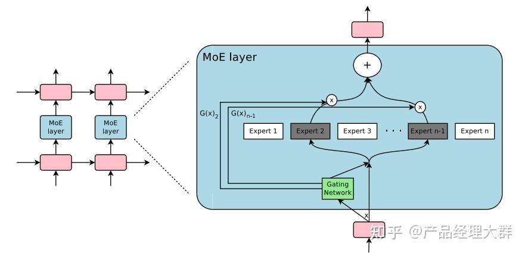

Outrageously Large Neural Network 论文中的 MoE layer

混合专家模型 的引入使得训练具有数千亿甚至万亿参数的模型成为可能，如开源的 1.6 万亿参数的 Switch Transformers 等。

> 这种方法即可以在自然语言处理 领域得到了广泛应用，也可以在计算机视觉领域进行探索。

## Moe模型结构

混合专家模型是一种稀疏门控制的深度学习模型，它主要由一组专家模型和一个门控模型组成。MoE的基本理念是将输入数据根据任务类型分割成多个区域，并将每个区域的数据分配一个或多个专家模型。每个专家模型可以专注于处理输入这部分数据，从而提高模型的整体性能。

MoE架构的基本原理非常简单明了，它主要包括两个核心组件：GateNet和Experts。GateNet的作用在于判定输入样本应该由哪个专家模型接管处理。而Experts则构成了一组相对独立的专家模型，每个专家负责处理特定的输入子空间。

### 门控网络GateNet：

混合专家模型中“门”是一种稀疏门网络，它接收单个数据元素作为输入，然后输出一个权重，这些权重表示每个专家模型对处理输入数据的贡献。一般是通过softmax门控函数通过专家或token对概率分布进行建模，并选择前K个。

例如，如果模型有三个专家，输出的概率可能为0.5和0.4、0.1，这意味着第一个专家对处理此数据的贡献为50%，第二个专家为40%，第二个专家为10%，这个时候的K就可以选择为2，我们认为前两个专家模型的建议会更好，可以用于更加精确的回答中，而第三个专家模型的建议可以用于更加富有创意性的答案中。

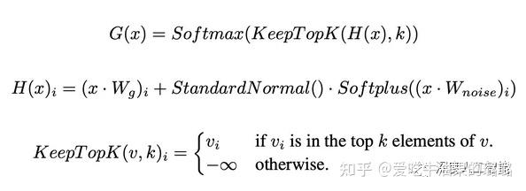

### 专家Experts：

在训练的过程中，输入的数据被门控模型分配到不同的专家模型中进行处理；在推理的过程中，被门控选择的专家会针对输入的数据，产生相应的输出。这些输出最后会和每个专家模型处理该特征的能力分配的权重进行加权组合，形成最终的预测结果。

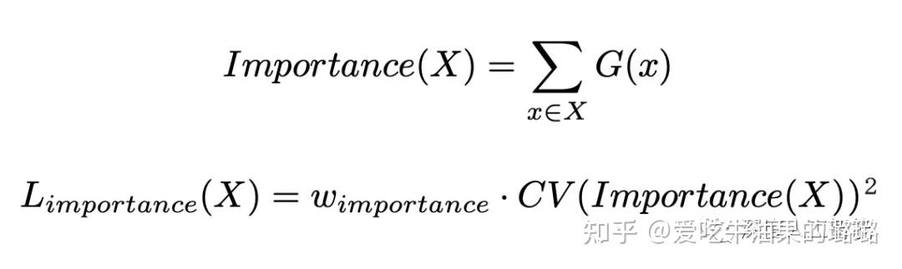

混合专家模型在训练过程中通过门控模型实现“因材施教”，进而在推理过程中实现专家模型之间的“博采众长”。MoE的专家模型可以是小型的MLP或者复杂的LLM。

## **MOE与稀疏性**

### 稀疏性

稀疏性的概念采用了条件计算的思想。在传统的稠密模型中，所有的参数都会对所有输入数据进行处理。相比之下，稀疏性允许我们仅针对整个系统的某些特定部分执行计算。这意味着并非所有参数都会在处理每个输入时被激活或使用，而是根据输入的特定特征或需求，只有部分参数集合被调用和运行。

条件计算概念 的提出(即仅在每个样本的基础上激活网络的不同部分) 使得在不增加额外计算负担的情况下扩展模型规模成为可能。这一策略在每个 MoE 层中实现了数以千计甚至更多的专家的有效利用。

这种稀疏性设置确实带来了一些挑战。例如，在混合专家模型 中，尽管较大的批量大小通常有利于提高性能，但当数据通过激活的专家时，实际的批量大小可能会减少。

比如，假设输入批量包含 10 个token， **可能会有五个token被路由到同一个专家，而剩下的五个token分别被路由到不同的专家。这导致了批量大小的不均匀分配和资源利用效率不高的问题**。在接下来的部分中，将会讨论让 MoE 高效运行的其他挑战以及相应的解决方案。

### MoE对稀疏性的处理

利用一个可学习的门控网络 (G) 决定将输入的哪一部分发送给哪些专家 (E):

为了有效控制稀疏性，主要依赖于门控网络的设计和参数调整。门控网络负责决定哪些专家模型参与处理当前的输入数据。然而，在进行参数选择时需要注意一个权衡：如果门控网络在单次选择中激活了较多的专家模型，虽然这可能提升了模型的表现能力，但却会导致稀疏性的降低。因为更多的专家模型参与计算，这会带来额外的计算复杂性和耗时。

MoE模型的稀疏性存在平衡的挑战，需要根据具体的应用需求和计算资源限制来调整门控网络的设计和参数。在实际应用中，可以根据不同的场景，灵活地选择专家模型的数量，以在效率和性能之间找到最佳的平衡点。这种个性化的调整能够确保混合专家模型在各种应用中发挥出最佳的优势，为模型提供更大的灵活性和可塑性。

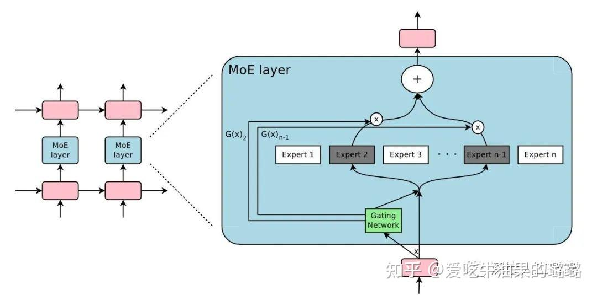

这里的“门”概念，与LSTM网络的“门”概念有所不同，MoE的“门”概念主要是用于匹配数据和专家模型之间的连接，就好比不同班级的学生要进不同的教室上课一样，而LSTM的“门”概念主要是一种控制信息流动的装置，它可以保留或通过一定比例的数据，更像是在控制流量，而MoE的“门”概念可以看作是选择要通过的对象。

MoE的稀疏性与dropout的原理类似，MoE是根据任务的具体情况选择激活一定数量的专家模型来完成这个任务，而dropout则是对神经网络中的神经元进行随机性失活，每次训练的时候只保留一定的参数，这不但让网络具备了稀疏性特征，减轻了整个网络的参数压力，还会降低模型发生过拟合的概率，提高模型的泛化能力。

在这种设置下，虽然所有专家都会对所有输入进行运算，但通过门控网络的输出进行加权乘法操作。但是，如果 G (门控网络的输出) 为 0 会发生什么呢？如果是这种情况，就没有必要计算相应的专家操作，因此我们可以节省计算资源。那么一个典型的门控函数是什么呢？一个典型的门控函数通常是一个带有 softmax 函数的简单的网络。这个网络将学习将输入发送给哪个专家。

还有另外一种门控机制，其中包括带噪声的 TopK 门控 (Noisy Top-K Gating)。这种门控方法引入了一些可调整的噪声，然后保留前 k 个值。具体来说:

1. 添加一些噪声
2. 选择保留前 K 个值
3. 应用 Softmax 函数

这种稀疏性引入了一些有趣的特性。通过使用较低的 k 值 (例如 1 或 2)，我们可以比激活多个专家时更快地进行训练和推理。为什么不仅选择最顶尖的专家呢？最初的假设是，需要将输入路由到不止一个专家，以便门控学会如何进行有效的路由选择，因此至少需要选择两个专家。

为什么要添加噪声呢？这是为了专家间的负载均衡！

## **混合专家模型中令牌的负载均衡**

正如之前讨论的，如果所有的令牌都被发送到只有少数几个受欢迎的专家，那么训练效率将会降低。在通常的MoE训练中，门控网络往往倾向于主要激活相同的几个专家。这种情况可能会自我加强，因为受欢迎的专家训练得更快，因此它们更容易被选择。为了缓解这个问题，引入了一个 **辅助损失**，旨在鼓励给予所有专家相同的重要性。这个损失确保所有专家接收到大致相等数量的训练样本，从而平衡了专家之间的选择。接下来的部分还将探讨专家容量的概念，它引入了一个关于专家可以处理多少令牌的阈值。在 

```text
transformers
```

库中，可以通过 

```text
aux_loss
```

参数来控制辅助损失。

## **MoE 和 Transformer**

Transformer 类模型明确表明，增加参数数量可以提高性能，因此谷歌使用 GShard 尝试将 Transformer 模型的参数量扩展到超过 6000 亿并不令人惊讶。

GShard 将在编码器和解码器中的每个前馈网络 (FFN) 层中的替换为使用 Top-2 门控的MoE层。下图展示了编码器部分的结构。这种架构对于大规模计算非常有效: 当扩展到多个设备时，MoE 层在不同设备间共享，而其他所有层则在每个设备上复制。我们将在 “让 MoE 起飞”部分对这一点进行更详细的讨论。

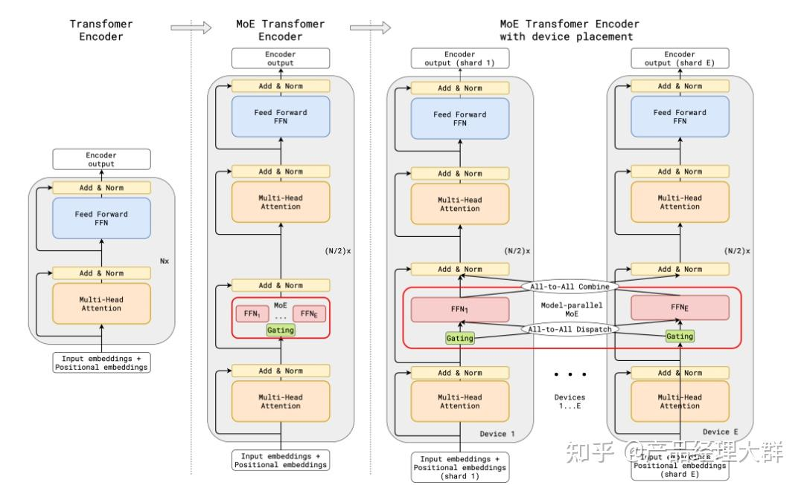

GShard 论文中的 MoE Transformer Encoder

为了保持负载平衡和训练效率，GShard 的作者除了引入了上一节中讨论的类似辅助损失外，还引入了一些关键变化:

- **随机路由**: 在 Top-2 设置中，我们始终选择排名最高的专家，但第二个专家是根据其权重比例随机选择的。
- **专家容量**: 我们可以设定一个阈值，定义一个专家能处理多少令牌。如果两个专家的容量都达到上限，令牌就会溢出，并通过残差连接传递到下一层，或在某些情况下被完全丢弃。专家容量是 MoE 中最重要的概念之一。为什么需要专家容量呢？因为所有张量的形状在编译时是静态确定的，我们无法提前知道多少令牌会分配给每个专家，因此需要一个固定的容量因子。

GShard 的工作对适用于 MoE 的并行计算模式也做出了重要贡献，但这些内容的讨论超出了这篇博客的范围。

**注意**: 在推理过程中，只有部分专家被激活。同时，有些计算过程是共享的，例如自注意力 (self-attention) 机制，它适用于所有令牌。这就解释了为什么我们可以使用相当于 12B 稠密模型的计算资源来运行一个包含 8 个专家的 47B 模型。如果我们采用 Top-2 门控，模型会使用高达 14B 的参数。但是，由于自注意力操作 (专家间共享) 的存在，实际上模型运行时使用的参数数量是 12B。

## **Switch Transformers**

尽管混合专家模型 显示出了很大的潜力，但它们在训练和微调过程中存在稳定性问题。Switch Transformers 是一项非常激动人心的工作，它深入研究了这些话题。作者甚至在 Hugging Face 上发布了一个 1.6 万亿参数的 MoE，拥有 2048 个专家，你可以使用 

```text
transformers
```

库来运行它。Switch Transformers 实现了与 T5-XXL 相比 4 倍的预训练速度提升。

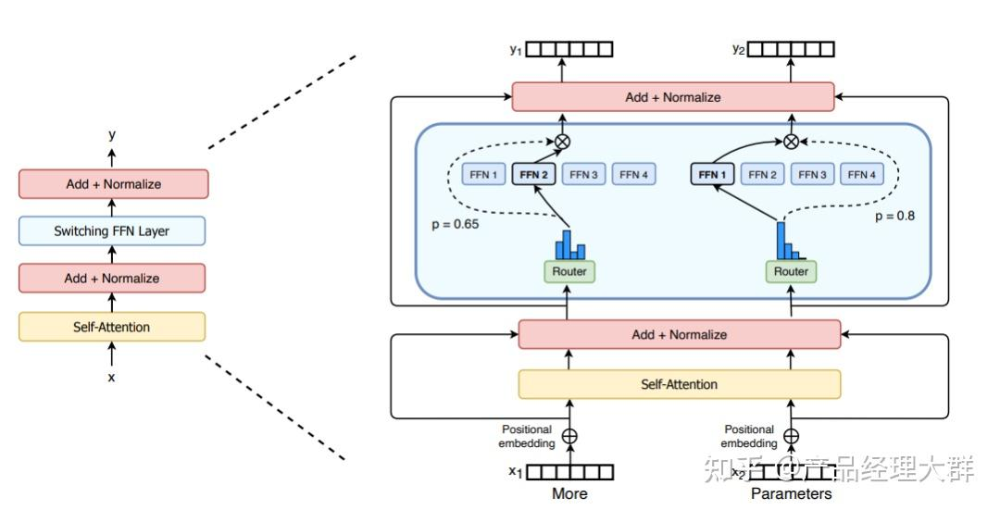

Switch Transformer 论文中的 Switch Transformer Layer

就像在 GShard 中一样，作者用混合专家模型 层替换了前馈网络 (FFN) 层。Switch Transformers 提出了一个 Switch Transformer 层，它接收两个输入 (两个不同的令牌) 并拥有四个专家。

与早期使用至少两个专家的想法相反，Switch Transformers 采用了简化的单专家策略。这种方法的效果包括:

- 减少门控网络 (路由) 计算负担
- 每个专家的批量大小至少可以减半
- 降低通信成本
- 保持模型质量

Switch Transformers 也对 **专家容量** 这个概念进行了研究。

上述建议的容量是将批次中的令牌数量均匀分配到各个专家。如果我们使用大于 1 的容量因子，我们为令牌分配不完全平衡时提供了一个缓冲。增加容量因子会导致更高的设备间通信成本，因此这是一个需要考虑的权衡。特别值得注意的是，Switch Transformers 在低容量因子 (例如 1 至 1.25) 下表现出色。

Switch Transformer 重新审视并简化了前面章节中提到的负载均衡损失。在训练期间，对于每个 Switch 层的辅助损失被添加到总模型损失中。这种损失鼓励均匀路由，并可以使用超参数进行加权。

Switch Transformer使用了混合精度的方法，例如用 

```text
bfloat16
```

精度训练专家，同时对其余计算使用全精度进行。较低的精度可以减少处理器间的通信成本、计算成本以及存储张量的内存。然而，注意，当专家和门控网络都使用 

```text
bfloat16
```

精度训练时，出现了不稳定的训练现象。这种不稳定性特别是由路由计算引起的，因为路由涉及指数函数等操作，这些操作对精度要求较高。因此，为了保持计算的稳定性和精确性，保持更高的精度是重要的。为了减轻不稳定性，路由过程也使用了全精度。

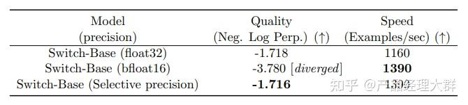

使用混合精度不会降低模型质量并可实现更快的训练

Switch Transformers 采用了编码器 - 解码器的架构，实现了与 T5 类似的混合专家模型 版本。GLaM 这篇工作探索了如何使用仅为原来 1/3 的计算资源 (因为 MoE 模型在训练时需要的计算量较少，从而能够显著降低碳足迹) 来训练与 GPT-3 质量相匹配的模型来提高这些模型的规模。作者专注于仅解码器 (decoder-only) 的模型以及少样本和单样本评估，而不是微调。他们使用了 Top-2 路由和更大的容量因子。此外，他们探讨了将容量因子作为一个动态度量，根据训练和评估期间所使用的计算量进行调整。

## **用 Router z-loss 稳定模型训练**

之前讨论的平衡损失可能会导致稳定性问题。我们可以使用许多方法来稳定稀疏模型的训练，但这可能会牺牲模型质量。例如，引入 dropout 可以提高稳定性，但会导致模型质量下降。另一方面，增加更多的乘法分量可以提高质量，但会降低模型稳定性。

ST-MoE 引入的 

```text
Router z-loss
```

在保持了模型性能的同时显著提升了训练的稳定性。这种损失机制通过惩罚门控网络输入的较大 

```text
logits
```

来起作用，目的是促使数值的绝对大小保持较小，这样可以有效减少计算中的舍入误差。这一点对于那些依赖指数函数进行计算的门控网络尤其重要。为了深入了解这一机制，建议参考原始论文以获得更全面的细节。

## **专家如何学习？**

ST-MoE 的研究者们发现，编码器中不同的专家倾向于专注于特定类型的令牌或浅层概念。例如，某些专家可能专门处理标点符号，而其他专家则专注于专有名词等。与此相反，解码器中的专家通常具有较低的专业化程度。此外，研究者们还对这一模型进行了多语言训练。尽管人们可能会预期每个专家处理一种特定语言，但实际上并非如此。由于令牌路由和负载均衡的机制，没有任何专家被特定配置以专门处理某一特定语言。

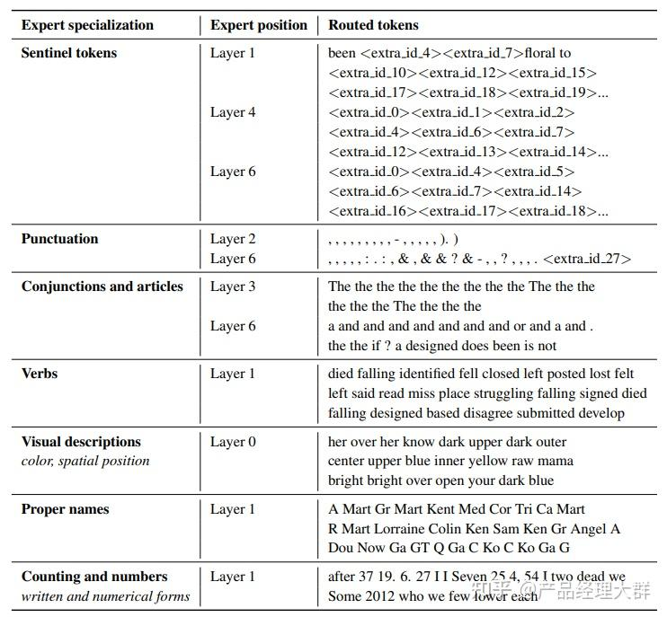

ST-MoE 论文中显示了哪些令牌组被发送给了哪个专家的表格

## **专家的数量对预训练有何影响？**

增加更多专家可以提升处理样本的效率和加速模型的运算速度，但这些优势随着专家数量的增加而递减 (尤其是当专家数量达到 256 或 512 之后更为明显)。同时，这也意味着在推理过程中，需要更多的显存来加载整个模型。

值得注意的是，Switch Transformers 的研究表明，其在大规模模型中的特性在小规模模型下也同样适用，即便是每层仅包含 2、4 或 8 个专家。

## **微调混合专家模型**

```text
4.36.0
```

> 版本的 

```text
transformers
```

> 库支持 Mixtral 模型。安装命令: 

```text
pip install "transformers==4.36.0 --upgrade
```

稠密模型和稀疏模型在过拟合的动态表现上存在显著差异。稀疏模型更易于出现过拟合现象，因此在处理这些模型时，尝试更强的内部正则化措施是有益的，比如使用更高比例的 dropout。例如，我们可以为稠密层设定一个较低的 dropout 率，而为稀疏层设置一个更高的 dropout 率，以此来优化模型性能。

在微调过程中是否使用辅助损失是一个需要决策的问题。ST-MoE 的作者尝试关闭辅助损失，发现即使高达 11% 的令牌被丢弃，模型的质量也没有显著受到影响。令牌丢弃可能是一种正则化形式，有助于防止过拟合。

Switch Transformers 的作者观察到，在相同的预训练困惑度下，稀疏模型在下游任务中的表现不如对应的稠密模型，特别是在重理解任务 (如 SuperGLUE) 上。另一方面，对于知识密集型任务 (如 TriviaQA)，稀疏模型的表现异常出色。作者还观察到，在微调过程中，较少的专家的数量有助于改善性能。另一个关于泛化问题确认的发现是，模型在小型任务上表现较差，但在大型任务上表现良好。

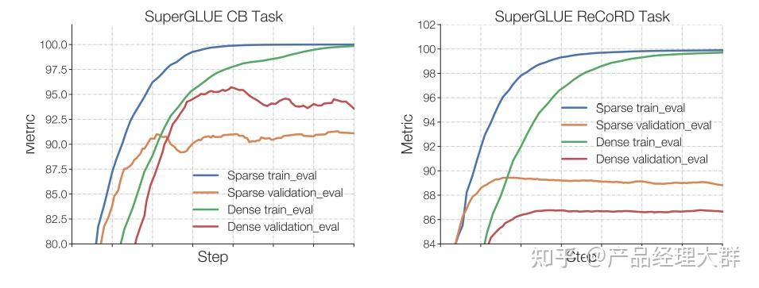

在小任务 (左图) 中，我们可以看到明显的过拟合，因为稀疏模型在验证集中的表现要差得多。在较大的任务 (右图) 中，MoE 则表现良好。该图来自 ST-MoE 论文

一种可行的微调策略是尝试冻结所有非专家层的权重。实践中，这会导致性能大幅下降，但这符合我们的预期，因为MoE层占据了网络的主要部分。我们可以尝试相反的方法: 仅冻结 MoE 层的参数。实验结果显示，这种方法几乎与更新所有参数的效果相当。这种做法可以加速微调过程，并降低显存需求。

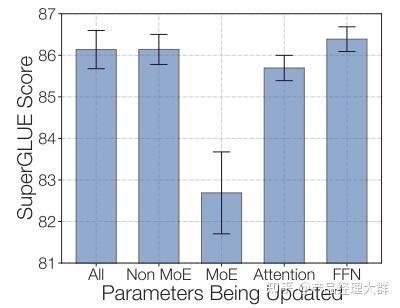

通过仅冻结 MoE 层，我们可以在保持质量的同时加快训练速度。该图来自 ST-MoE 论文

在微调稀疏MoE时需要考虑的最后一个问题是，它们有特别的微调超参数设置——例如，稀疏模型往往更适合使用较小的批量大小和较高的学习率，这样可以获得更好的训练效果。

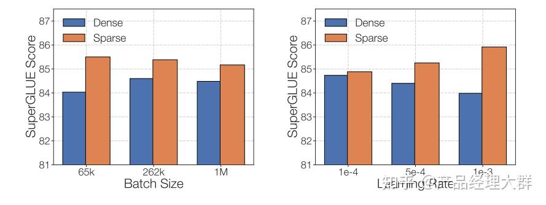

降低学习率和调大批量可以提升稀疏模型微调质量。该图来自 ST-MoE 论文

2023 年 7 月的论文 《MoEs Meets Instruction Tuning》 进行了以下实验:

- 单任务微调
- 多任务指令微调
- 多任务指令微调后接单任务微调

当对 MoE 和对应性能相当的 T5 模型进行微调时，可以发现 T5 的对应模型表现更为出色。然而，当研究者们对 [Flan T5](https://zhida.zhihu.com/search?content_id=239283275&content_type=Article&match_order=1&q=Flan+T5&zhida_source=entity) (一种 T5 的指令优化版本) 的 MoE 版本进行微调时，MoE 的性能显著提升。更值得注意的是，Flan-MoE 相比原始 MoE 的性能提升幅度超过了 Flan T5 相对于原始 T5 的提升，这意味着 MoE 模型可能从指令式微调中获益更多，甚至超过了稠密模型。此外，MoE 在多任务学习中表现更佳。与之前关闭 **辅助损失** 函数的做法相反，实际上这种损失函数可以帮助防止过拟合。

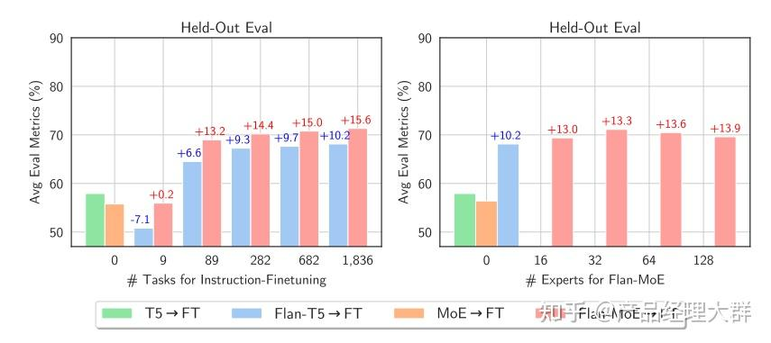

与稠密模型相比，稀疏模型从指令微调中受益更多。该图来自 MoEs Meets instructions Tuning 论文

## **稀疏 VS 稠密，如何选择?**

稀疏MoE适用于拥有多台机器且要求高吞吐量的场景。在固定的预训练计算资源下，稀疏模型往往能够实现更优的效果。相反，在显存较少且吞吐量要求不高的场景，稠密模型则是更合适的选择。

**注意**: 直接比较稀疏模型和稠密模型的参数数量是不恰当的，因为这两类模型基于的概念和参数量的计算方法完全不同。

## **优化 MoE** 

最初的MoE设计采用了分支结构，这导致了计算效率低下。这种低效主要是因为 GPU 并不是为处理这种结构而设计的，而且由于设备间需要传递数据，网络带宽常常成为性能瓶颈。接下来，我们会讨论如何使这些模型在预训练和推理阶段更加高效和实用。

### **并行计算**

让我们简要回顾一下并行计算的几种形式:

- **数据并行**: 相同的权重在所有节点上复制，数据在节点之间分割。
- **模型并行**: 模型在节点之间分割，相同的数据在所有节点上复制。
- **模型和数据并行**: 我们可以在节点之间同时分割模型和数据。注意，不同的节点处理不同批次的数据。
- **专家并行**: 专家被放置在不同的节点上。如果与数据并行结合，每个节点拥有不同的专家，数据在所有节点之间分割。

在专家并行中，专家被放置在不同的节点上，每个节点处理不同批次的训练样本。对于非 MoE 层，专家并行的行为与数据并行相同。对于 MoE 层，序列中的令牌被发送到拥有所需专家的节点。

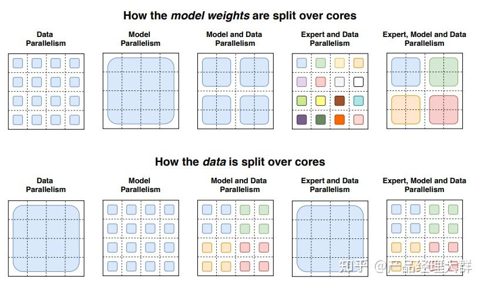

Switch Transformers 论文中展示如何使用不同的并行技术在节点上分割数据和模型的插图

### **容量因子和通信开销**

提高容量因子 (Capacity Factor, CF) 可以增强模型的性能，但这也意味着更高的通信成本和对保存激活值的显存的需求。在设备通信带宽有限的情况下，选择较小的容量因子可能是更佳的策略。一个合理的初始设置是采用 Top-2 路由、1.25 的容量因子，同时每个节点配置一个专家。在评估性能时，应根据需要调整容量因子，以在设备间的通信成本和计算成本之间找到一个平衡点。

### **部署技术**

> 可以在 

```text
Inference Endpoints
```

> 部署 mistralai/Mixtral-8x7B-Instruct-v0.1。

部署混合专家模型 (MoE) 的一个关键挑战是其庞大的参数规模。对于本地使用情况，我们可能希望使用更小的模型。为了使模型更适合部署，下面是几种有用的技术:

- 预先蒸馏实验: Switch Transformers 的研究者们进行了预先蒸馏的实验。他们通过将 MoE 模型蒸馏回其对应的稠密模型，成功保留了 30-40%的由稀疏性带来的性能提升。预先蒸馏不仅加快了预训练速度，还使得在推理中使用更小型的模型成为可能。
- 任务级别路由: 最新的方法中，路由器被修改为将整个句子或任务直接路由到一个专家。这样做可以提取出一个用于服务的子网络，有助于简化模型的结构。
- 专家网络聚合: 这项技术通过合并各个专家的权重，在推理时减少了所需的参数数量。这样可以在不显著牺牲性能的情况下降低模型的复杂度。

### **高效训练**

FasterMoE 深入分析了 MoE 在不同并行策略下的理论性能极限，并且探索了一系列创新技术，包括用于专家权重调整的方法、减少延迟的细粒度通信调度技术，以及一个基于最低延迟进行专家选择的拓扑感知门控机制。这些技术的结合使得 MoE 运行速度提升高达 17 倍。

Megablocks 则专注于通过开发新的 GPU kernel 来处理 MoE 模型中的动态性，以实现更高效的稀疏预训练。其核心优势在于，它不会丢弃任何令牌，并能高效地适应现代硬件架构 (支持块稀疏矩阵乘)，从而达到显著的加速效果。Megablocks 的创新之处在于，它不像传统 MoE 那样使用批量矩阵乘法 (这通常假设所有专家形状相同且处理相同数量的令牌)，而是将 MoE 层表示为块稀疏操作，可以灵活适应不均衡的令牌分配。

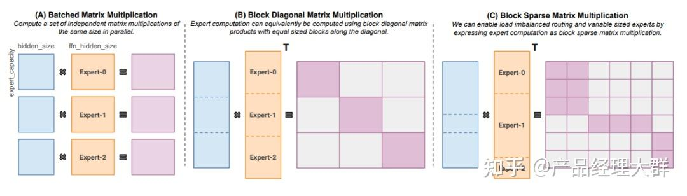

针对不同规模的专家和令牌数量的块稀疏矩阵乘法。该图来自 MegaBlocks 论文

## **开源混合专家模型**

目前，下面这些开源项目可以用于训练混合专家模型 (MoE):

- Megablocks: [https://github.com/stanford-futuredata/megablocks](https://link.zhihu.com/?target=https%3A//github.com/stanford-futuredata/megablocks)
- Fairseq: [https://github.com/facebookresearch/fairseq/tree/main/examples/moe_lm](https://link.zhihu.com/?target=https%3A//github.com/facebookresearch/fairseq/tree/main/examples/moe_lm)
- OpenMoE: [https://github.com/XueFuzhao/OpenMoE](https://link.zhihu.com/?target=https%3A//github.com/XueFuzhao/OpenMoE)

对于开源的混合专家模型 (MoE)，可以:

- Switch Transformers (Google): 基于 T5 的 MoE 集合，专家数量从 8 名到 2048 名。最大的模型有 1.6 万亿个参数。
- NLLB MoE (Meta): NLLB 翻译模型的一个 MoE 变体。
- OpenMoE: 社区对基于 Llama 的模型的 MoE 尝试。
- Mixtral 8x7B (Mistral): 一个性能超越了 Llama 2 70B 的高质量混合专家模型，并且具有更快的推理速度。此外，还发布了一个经过指令微调的模型。有关更多信息，可以在 Mistral 的 公告博客文章 中了解。

## MoE可能面临的问题

1. 训练复杂性：混合专家模型的训练相对复杂，尤其是涉及到门控网络的参数调整。为了正确地学习专家的权重和整体模型的参数，可能需要更多的训练时间。
2. 超参数调整：选择适当的超参数，特别是与门控网络相关的参数，以达到最佳性能，是一个复杂的任务。这可能需要通过交叉验证等技术进行仔细调整。
3. 专家模型设计：专家模型的设计对模型的性能影响显著。选择适当的专家模型结构，确保其在特定任务上有足够的表现力，是一个挑战。
4. 稀疏性失真：在某些情况下，为了实现稀疏性，门控网络可能会过度地激活或不激活某些专家，导致模型性能下降。需要谨慎设计稀疏性调整策略，以平衡效率和性能。
5. 动态性问题：在处理动态或快速变化的数据分布时，门控网络可能需要更加灵活的调整，以适应输入数据的变化。这需要额外的处理和设计。

6.对数据噪声的敏感性：混合专家模型对于数据中的噪声相对敏感，可能在一些情况下表现不如其他更简单的模型。

7.专家冲突：在MoE模型训练中，处理专家冲突主要通过门控机制和稀疏性策略实现。门控机制根据专家的预测准确度分配权重，让表现好的专家获得更多权重，从而减少冲突。同时，稀疏性策略只激活部分专家，降低计算复杂度并进一步减少冲突，使模型更高效地处理大规模数据集和适应新任务。

此外，还有重要的一点是混合专家模型在分布式计算环境下可能面临通信宽带瓶颈的问题。这主要涉及到混合专家模型的分布式部署，其中不同的专家模型或门控网络可能分布在不同的计算节点上。在这种情况下，模型参数的传输和同步可能导致通信开销过大，成为性能瓶颈。

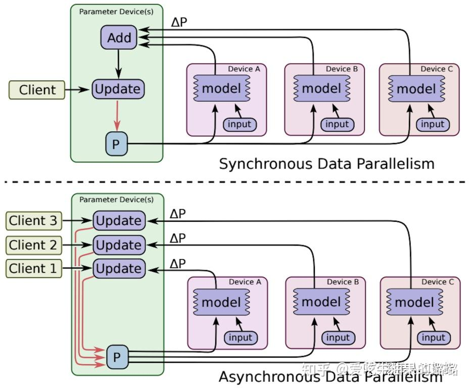

