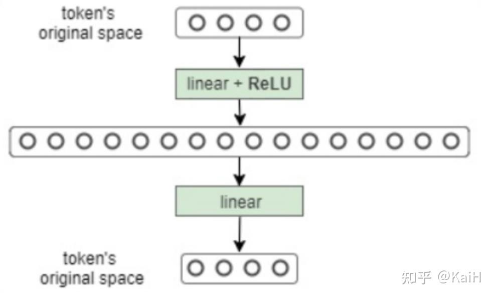
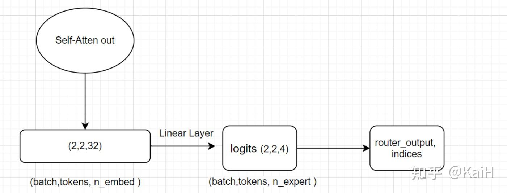
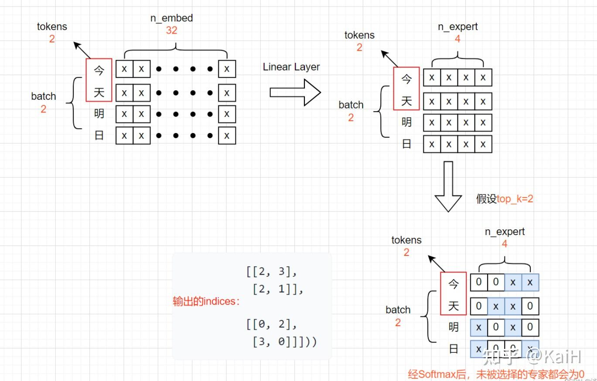
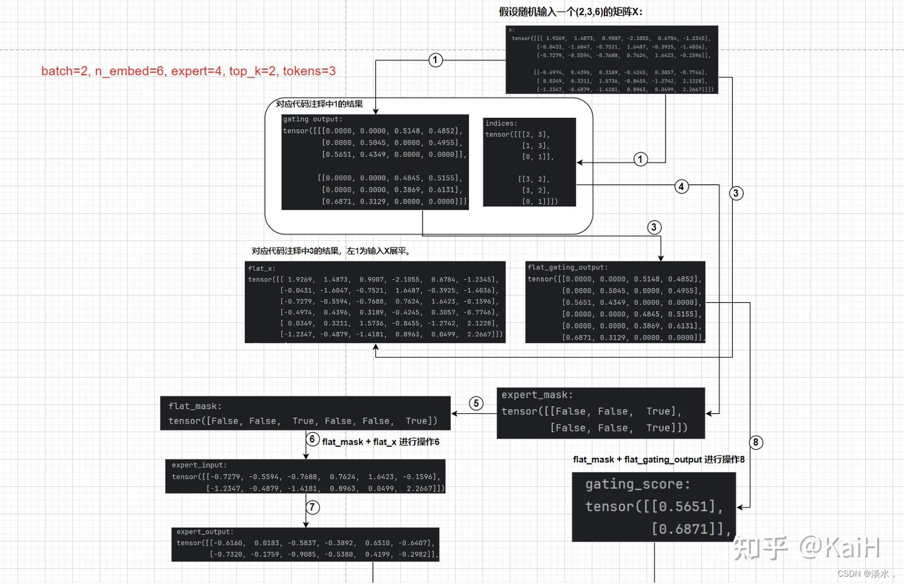

https://zhuanlan.zhihu.com/p/701777558

## 什么是混合模型

MOE主要由两个关键点组成：

一是将传统[Transformer](https://zhida.zhihu.com/search?content_id=244081063&content_type=Article&match_order=1&q=Transformer&zhida_source=entity)中的[FFN](https://zhida.zhihu.com/search?content_id=244081063&content_type=Article&match_order=1&q=FFN&zhida_source=entity)（前馈网络层）替换为**多个稀疏的[专家层](https://zhida.zhihu.com/search?content_id=244081063&content_type=Article&match_order=1&q=专家层&zhida_source=entity)（Sparse MoE layers）**。每个专家本身是一个独立的神经网络，实际应用中，这些专家通常是前馈网络 (FFN)，但也可以是更复杂的网络结构。

二是**[门控网络](https://zhida.zhihu.com/search?content_id=244081063&content_type=Article&match_order=1&q=门控网络&zhida_source=entity)或[路由](https://zhida.zhihu.com/search?content_id=244081063&content_type=Article&match_order=1&q=路由&zhida_source=entity)**：此部分用来决定输入的token分发给哪一个专家。

可能有对FFN（前馈网络层）不太熟悉的小伙伴可以看一下下面的代码及图例，很简单就是一个我们平时常见的结构。

```python
class FeedForward(nn.Module):
    def __init__(self, dim_vector, dim_hidden, dropout=0.1):
        super().__init__()
        self.feedforward = nn.Sequential(
            nn.Linear(dim_vector, dim_hidden),
            nn.ReLU(),
            nn.Dropout(dropout),
            nn.Linear(dim_hidden, dim_vector)
        )
        
    def forward(self, x):
        out = self.feedforward(x)
        return out
```



MLP

## 从零实现一个MOE

完整的从零实现MOE代码已集成至git代码训练框架项目，项目包括一个每个人都可以以此为基础构建自己的开源大模型训练框架流程、支持主流模型使用deepspeed进行[Lora](https://zhida.zhihu.com/search?content_id=244081063&content_type=Article&match_order=1&q=Lora&zhida_source=entity)、[Qlora](https://zhida.zhihu.com/search?content_id=244081063&content_type=Article&match_order=1&q=Qlora&zhida_source=entity)等训练、主流模型的chat template模版、以及一些tricks的从零实现模块。欢迎大家star 共同学习！：

[https://github.com/mst272/LLM-Dojo/blob/main/llm_tricks/moe/READEME.mdgithub.com/mst272/LLM-Dojo/blob/main/llm_tricks/moe/READEME.md](https://link.zhihu.com/?target=https%3A//github.com/mst272/LLM-Dojo/blob/main/llm_tricks/moe/READEME.md)

### 1. 创建一个专家模型

这一步也很简单了，其实就是一个多层感知机MLP。

```python
class Expert(nn.Module):
    def __init__(self, n_embd):
        super().__init__()
        self.net = nn.Sequential(
            nn.Linear(n_embd, 4 * n_embd),
            nn.ReLU(),
            nn.Linear(4 * n_embd, n_embd),
            nn.Dropout(dropout),
        )

    def forward(self, x):
        return self.net(x)
```

### 2. 创建TopKrouter

即创建MOE的路由部分。

假设我们定义了4个专家，路由取前2名专家，即expert=4， top_k=2。接收注意力层的输出作为输入X，即将输入从（Batch size，Tokens，n_embed）的形状（2，4，32）投影到对应于（Batch size，Tokens，num_experts）的形状（2，4，4），其中num_experts即expert=4。其中返回的indices可以理解为对于每个token的4个专家来说，选的两个专家的序号索引。

代码如下：

```python
# 这里我们假设定义n_embed为32， num_experts=4, top_k=2

class TopkRouter(nn.Module):
    def __init__(self, n_embed, num_experts, top_k):
        super(TopkRouter, self).__init__()
        self.top_k = top_k
        self.linear =nn.Linear(n_embed, num_experts)
    
    def forward(self, mh_output):
        logits = self.linear(mh_output)    # (2,4,32) ---> (2,4,4)
        # 获取前K大的值和索引，沿列。
        top_k_logits, indices = logits.topk(self.top_k, dim=-1)
        # 创建一个形状和logits相同全'-inf'矩阵，即(2,4,4)
        zeros = torch.full_like(logits, float('-inf'))
        # 按照索引和值填充上述zeros矩阵
        sparse_logits = zeros.scatter(-1, indices, top_k_logits)
        # 对其进行softmax，未被填充的位置会为0
        router_output = F.softmax(sparse_logits, dim=-1)
        return router_output, indices
```

看完代码之后配合整体流程图将会更清晰：



更清晰的图示如下，每个字代表一个token：



### 3. 添加noisy噪声

从本质上讲，我们不希望所有token都发送给同一组“受青睐”的expert。需要一个良好平衡，因此，将标准正态噪声添加到来自门控线性层的logits。

代码对比2中的代码只改动了几行，非常的简单。

```python
class NoisyTopkRouter(nn.Module):
    def __init__(self, n_embed, num_experts, top_k):
        super(NoisyTopkRouter, self).__init__()
        self.top_k = top_k
        self.topkroute_linear = nn.Linear(n_embed, num_experts)
        # add noise
        self.noise_linear =nn.Linear(n_embed, num_experts)

    
    def forward(self, mh_output):
        # mh_ouput is the output tensor from multihead self attention block
        logits = self.topkroute_linear(mh_output)

        #Noise logits
        noise_logits = self.noise_linear(mh_output)

        #Adding scaled unit gaussian noise to the logits
        noise = torch.randn_like(logits)*F.softplus(noise_logits)
        noisy_logits = logits + noise

        top_k_logits, indices = noisy_logits.topk(self.top_k, dim=-1)
        zeros = torch.full_like(noisy_logits, float('-inf'))
        sparse_logits = zeros.scatter(-1, indices, top_k_logits)
        router_output = F.softmax(sparse_logits, dim=-1)
        return router_output, indices
```

### 4. 构建完整的稀疏MOE module

前面的操作主要是获取了router分发的结果，获取到这些结果后我们就可以将router乘给对应的token。这种选择性加权乘法最终构成了稀疏MOE。

代码部分如下所示：

```python
class SparseMoE(nn.Module):
    def __init__(self, n_embed, num_experts, top_k):
        super(SparseMoE, self).__init__()
        self.router = NoisyTopkRouter(n_embed, num_experts, top_k)
        self.experts = nn.ModuleList([Expert(n_embed) for _ in range(num_experts)])
        self.top_k = top_k

    def forward(self, x):
        # 1. 输入进入router得到两个输出
        gating_output, indices = self.router(x)
        # 2.初始化全零矩阵，后续叠加为最终结果
        final_output = torch.zeros_like(x)

        # 3.展平，即把每个batch拼接到一起，这里对输入x和router后的结果都进行了展平
        flat_x = x.view(-1, x.size(-1))
        flat_gating_output = gating_output.view(-1, gating_output.size(-1))

        # 以每个专家为单位进行操作，即把当前专家处理的所有token都进行加权
        for i, expert in enumerate(self.experts):
            # 4. 对当前的专家(例如专家0)来说，查看其对所有tokens中哪些在前top2
            expert_mask = (indices == i).any(dim=-1)
            # 5. 展平操作
            flat_mask = expert_mask.view(-1)
            # 如果当前专家是任意一个token的前top2
            if flat_mask.any():
                # 6. 得到该专家对哪几个token起作用后，选取token的维度表示
                expert_input = flat_x[flat_mask]
                # 7. 将token输入expert得到输出
                expert_output = expert(expert_input)

                # 8. 计算当前专家对于有作用的token的权重分数
                gating_scores = flat_gating_output[flat_mask, i].unsqueeze(1)
                # 9. 将expert输出乘上权重分数
                weighted_output = expert_output * gating_scores

                # 10. 循环进行做种的结果叠加
                final_output[expert_mask] += weighted_output.squeeze(1)

        return final_output
```

其中的一些讲解都在注释中了，特别注意的是该部分的**逻辑是：**以**专家为单位**遍历每个专家，抽取每个专家对于**所有token**中在**前top_k的tokens**。可能有一些绕，但是结合上述代码注释中的序号，可以参考下面tensor流向图，可以完整清晰的理解该内容，**图中的序号代表注释中的数字顺序**。




#### 补充

博客中没提到的一点是 Expert Capacity。大概意思就是为了防止所有tokens都被一个或几个expert处理，我们需要设置一个专家容量。如果某个专家处理超过容量的tokens后就会给他截断，下面给出一个简单的代码示例，实际生产中会有更高级复杂的策略,
例如在https://arxiv.org/abs/2101.03961 中讨论的switch transformer架构。

我们简单的介绍代码如下，与我们技术博客中讲的SparseMoE基本相同，只是加了两个部分，在代码注释中也已标明。
```python
class SparseMoE(nn.Module):
    def __init__(self, n_embed, num_experts, top_k, capacity_factor=1.0):
        super(SparseMoE, self).__init__()
        self.router = NoisyTopkRouter(n_embed, num_experts, top_k)
        self.experts = nn.ModuleList([Expert(n_embed) for _ in range(num_experts)])
        self.top_k = top_k
        self.capacity_factor = capacity_factor
        self.num_experts = num_experts
    
    def forward(self, x):
        batch_size, seq_len, _ = x.shape
        gating_output, indices = self.router(x)
        final_output = torch.zeros_like(x)

        flat_x = x.view(-1, x.size(-1))  
        flat_gating_output = gating_output.view(-1, gating_output.size(-1))

        tokens_per_batch = batch_size * seq_len * self.top_k
        # 定义专家容量
        expert_capacity = int((tokens_per_batch / self.num_experts) * self.capacity_factor)

        updates = torch.zeros_like(flat_x)

        for i, expert in enumerate(self.experts):
            expert_mask = (indices == i).any(dim=-1)
            flat_mask = expert_mask.view(-1)
            selected_indices = torch.nonzero(flat_mask).squeeze(-1)
            
            # 进行容量判断
            limited_indices = selected_indices[:expert_capacity] if selected_indices.numel() > expert_capacity else selected_indices
            if limited_indices.numel() > 0:
                expert_input = flat_x[limited_indices]
                expert_output = expert(expert_input)

                gating_scores = flat_gating_output[limited_indices, i].unsqueeze(1)
                weighted_output = expert_output * gating_scores

                updates.index_add_(0, limited_indices, weighted_output)

        # Reshape updates to match the original dimensions of x
        final_output += updates.view(batch_size, seq_len, -1)

        return final_output

```

### 5. 将MOE与transformer结合

这一部分主要就是将上述所做的工作与常规的transformer层结合，即用moe替代MLP层。

```python
class Block(nn.Module):
    """Mixture of Experts Transformer block: communication followed by computation (multi-head self attention + SparseMoE) """
    def __init__(self, n_embed, n_head, num_experts, top_k):
        super().__init__()
        head_size = n_embed // n_head
        self.sa = MultiHeadAttention(n_head, head_size)
        self.smoe = SparseMoE(n_embed, num_experts, top_k)
        self.ln1 = nn.LayerNorm(n_embed)
        self.ln2 = nn.LayerNorm(n_embed)

    def forward(self, x):
        x = x + self.sa(self.ln1(x))
        x = x + self.smoe(self.ln2(x))
        return x
```

## 总结

最终我们得到了上述block，算是一个完整的模块了，并从头到尾将MOE的实现细节都讲解了一遍，理解原理后我们就可以对当前的一些主流模型进行moe魔改等操作了。

完整的从零实现MOE代码已集成至git代码训练框架项目，项目包括一个每个人都可以以此为基础构建自己的开源大模型训练框架流程、支持主流模型使用deepspeed进行Lora、Qlora等训练、主流模型的chat template模版、以及一些tricks的从零实现模块。欢迎大家star 共同学习！：