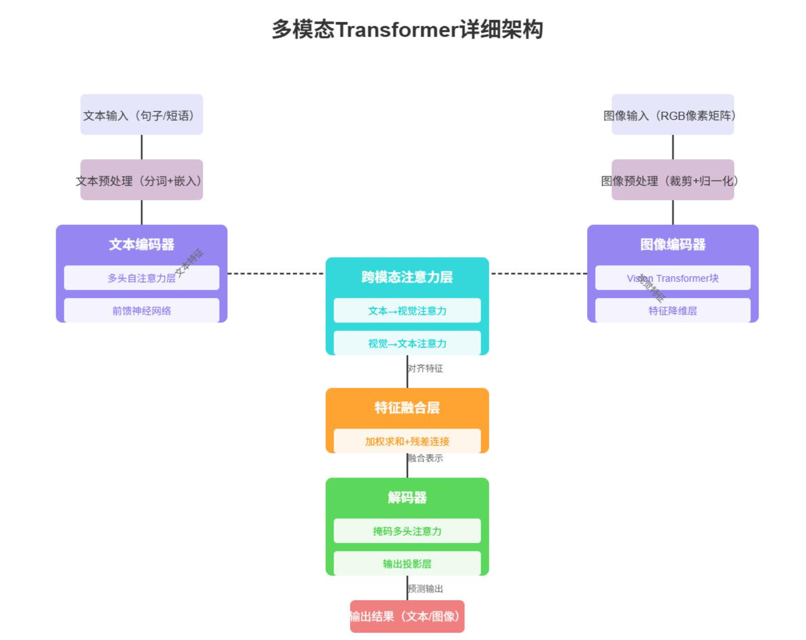

# 不同模态与语言模态的融合技术全详解

多模态与语言模态融合的核心，是**破解异构模态的语义鸿沟**：文本是离散、符号化、有明确语法层级的语言系统，而视觉、音频、视频等是连续、高维、分布式的感知信号，二者的数据结构、语义粒度、分布特征存在本质差异。融合的完整逻辑是「**先完成跨模态语义对齐（让不同模态能在同一个语义空间“对话”），再实现多模态深度融合（让模态间信息在模型推理中全程协同）**」，最终让语言模型真正实现“看懂、听懂、联动”非语言信息，完成跨模态理解、推理与生成。

## 一、融合的通用核心链路

无论哪种非语言模态，与语言模态的融合都遵循一套标准化的四阶核心流程，这是所有融合方案的底层框架：

1. **模态专属编码**：将非语言模态的原始数据，转换为模型可处理的高维语义特征，是融合的“感官入口”；

2. **跨模态语义对齐**：将非语言特征精准映射到LLM的词嵌入空间，转换为与文本Token同构的“伪语言Token”，彻底解决模态异构问题，是融合的核心桥梁；

3. **多模态深度融合**：将对齐后的多模态Token与文本Token，在模型架构中进行不同层级的交互与协同，是决定融合能力上限的核心环节；

4. **端到端训练优化**：通过预训练+微调的全流程训练，让模型真正学习到跨模态的语义关联，避免架构拼接带来的“两张皮”问题。



## 二、主流模态与语言模态的融合实现细节

不同模态的自身特性，决定了其编码、对齐、融合的技术方案存在核心差异，以下是当前工业界最主流的四大模态的融合全流程详解。

### （一）视觉模态（图像）与语言模态的融合

视觉是当前与语言融合最成熟、应用最广泛的模态，也是所有多模态技术的基础，核心解决“让语言模型看懂图片”的问题。

#### 1. 模态核心特点

图像是2D空间连续像素信号，高维冗余（单张224×224的图片有15万+像素），语义呈分布式分布（没有明确的“词”边界），与文本的离散符号化特征差异最大，对齐难度最高。

#### 2. 核心编码方案

主流采用**ViT（Vision Transformer）系列编码器**（CLIP ViT、SigLIP ViT为绝对主流），核心流程：

1. 将输入图像缩放到固定分辨率，切分为14×14像素的最小单元（Patch）；

2. 对每个Patch做线性投影，转换为固定维度的视觉特征向量；

3. 通过Transformer层提取局部细节+全局语义特征，最终输出一组长度固定的视觉Token序列（如256个Token，每个Token维度1024维），完成从原始像素到高维语义特征的转换。

#### 3. 与语言模态的对齐策略

对齐是视觉-语言融合的核心瓶颈，行业从浅到深形成了三代主流方案：

| 对齐方案                   | 核心原理                                                     | 代表模型                  | 核心优势                                                     | 核心局限                                       |
| -------------------------- | ------------------------------------------------------------ | ------------------------- | ------------------------------------------------------------ | ---------------------------------------------- |
| 线性投影层                 | 用可训练的线性矩阵/MLP，直接将视觉特征维度映射到LLM词嵌入维度 | LLaVA-1.0                 | 结构极简、训练成本极低、速度快                               | 信息瓶颈严重，仅能粗粒度对齐，细粒度语义损失大 |
| 查询式压缩对齐（Q-Former） | 用带可学习查询向量的Transformer，从视觉特征中提取与文本语义相关的信息，输出固定长度的视觉Token | BLIP-2、Qwen-VL、InternVL | 大幅压缩视觉Token长度，对齐精度远高于线性层，冻结双主干仅训练对齐模块 | 仍属于输入层浅层对齐，无法实现深度协同推理     |
| 细粒度交叉对齐             | 用对比学习实现Token级的图文匹配，通过“像素-对象-场景”三级层次化对齐，实现视觉细节与文本词汇的精准对应 | GPT-4V、文心一言6.0       | 细粒度对齐精度大幅提升，小目标、密集文本场景识别准确率提升20%+ | 训练成本高，需要海量高质量图文配对数据         |
##### 【Q-Former 完整流程示例 + 每一步数据形态详解】

我们以**单张 224×224 分辨率的橘猫图片**+ 用户提问「图里的猫是什么品种？」为例，完整拆解 Q-Former 的处理流程与每一步的数据形态，所有参数均采用 BLIP-2 官方开源配置，保证工业界真实性。

###### 步骤 1：前置处理 - 原始图像输入→ViT 视觉编码（Q-Former 的输入来源）

**处理逻辑**：先通过预训练的 CLIP ViT-L/14 视觉编码器，将原始像素图像转换为高维视觉特征，作为 Q-Former 的输入。

- 【输入数据】：224×224×3 的 RGB 彩色图像，像素值为 0-255 的整数矩阵，简化示例如下：

  ```
  # 单通道简化示例（完整为R/G/B三个通道）
  [[132, 128, 110, ..., 98, 87],
   [145, 136, 122, ..., 102, 93],
   ...
   [201, 198, 189, ..., 45, 32]]
  ```

- 【ViT 编码处理】：

  1. 将图像切分为 14×14 像素的最小 Patch，224×224 的图像共生成 16×16=256 个 Patch；
  2. 每个 Patch 通过线性投影转换为 1024 维的特征向量；
  3. 通过 Transformer 层提取局部 + 全局视觉语义，最终输出视觉特征。

- 【输出数据形态】：shape 为 `[256, 1024]` 的二维浮点型特征矩阵

  - 第一维 256：对应 256 个图像 Patch 的视觉 Token，长度随图像分辨率变化（分辨率越高，Token 数量越多）；

  - 第二维 1024：每个视觉 Token 的特征维度，代表该 Patch 的颜色、纹理、轮廓、物体等视觉语义；

  - 简化示例（仅展示 2 个 Token 的前 5 维特征）：

    ```
    # 256个视觉Token，每个1024维
    [[0.123, -0.456, 0.789, 0.234, -0.567, ...],  # 第1个Patch（左上角）的视觉特征
     [0.321, -0.654, 0.987, 0.432, -0.765, ...],  # 第2个Patch的视觉特征
     ...
     [0.213, -0.546, 0.879, 0.342, -0.675, ...]]  # 第256个Patch（右下角）的视觉特征
    ```

###### 步骤 2：Q-Former 核心初始化 - 固定数量的可学习查询 Token

**处理逻辑**：Q-Former 的核心是**32 个可学习的 Query Token**，这是模型在预训练阶段学习到的、专门用于从海量视觉特征中 “抓取” 与文本语义高度相关信息的 “探针”，数量全程固定，与输入图像的分辨率 / Token 数量无关。

- 【Query Token 数据形态】：shape 为 `[32, 768]` 的二维浮点型矩阵
  - 第一维 32：固定的查询 Token 数量，是 Q-Former 最终输出的 Token 长度，无论输入视觉 Token 是 256 个还是 1024 个，最终都压缩为 32 个；
  - 第二维 768：每个查询 Token 的特征维度，与 Q-Former 的 Transformer 隐藏层维度一致；
  - 核心特点：这组 Token 是可训练的，预训练完成后会固化下来，学会了 “什么样的视觉信息和人类语言描述强相关”。

###### 步骤 3：交叉注意力特征提取 - 从视觉特征中过滤冗余，提取语义相关信息

**处理逻辑**：Q-Former 的 Transformer 层执行**交叉注意力计算**，以 32 个 Query Token 作为 Query，以步骤 1 输出的 256 个视觉特征作为 Key 和 Value，让每个 Query Token 主动关注视觉特征中与文本语义相关的区域，过滤掉背景、无关纹理等冗余信息。

- 【核心计算逻辑】：每个 Query Token 会计算与 256 个视觉 Token 的注意力权重，权重越高，代表该视觉区域的信息越重要，最终加权求和得到该 Query 的更新特征。

  比如：针对用户提问「图里的猫是什么品种？」，Query Token 会给猫咪的面部、花纹、耳朵形状等关键区域分配高注意力权重，给背景的桌面、墙壁等区域分配极低权重，自动过滤无关信息。

- 【输出数据形态】：shape 为 `[32, 768]` 的二维浮点型特征矩阵

  - 长度已经从输入的 256 个视觉 Token，压缩为固定的 32 个 Token；

  - 每个 Token 都编码了与文本语义高度相关的视觉信息，而非原始的像素纹理；

  - 简化示例（仅展示 2 个 Token 的前 5 维特征）：

    plaintext

    ```
    # 32个语义对齐后的视觉Token，每个768维
    [[0.876, 0.234, -0.567, 0.912, -0.345, ...],  # 编码猫咪品种核心特征（花纹、耳型）的Token
     [0.654, 0.123, -0.789, 0.834, -0.456, ...],  # 编码猫咪毛色、体态特征的Token
     ...
     [0.765, 0.345, -0.678, 0.723, -0.234, ...]]  # 编码全局场景特征的Token
    ```

###### 步骤 4：线性投影对齐 - 映射到 LLM 的词嵌入空间，完成最终对齐

**处理逻辑**：通过一个可训练的线性投影层，将步骤 3 输出的 768 维特征，映射到目标 LLM 的词嵌入维度，让输出的视觉 Token 与文本 Token 完全同构，可直接拼接输入 LLM。

- 【示例场景】：目标 LLM 为 LLaMA-2 7B，其词嵌入维度为 4096 维
- 【输入数据】：步骤 3 输出的`[32, 768]`特征矩阵
- 【输出数据形态】：shape 为 `[32, 4096]` 的二维浮点型矩阵，即**最终输入 LLM 的视觉 Token 序列**
  - 第一维 32：固定长度的视觉 Token，与输入图像分辨率无关，彻底解决了高分辨率图像 Token 爆炸的问题；
  - 第二维 4096：与 LLaMA-2 的文本词嵌入维度完全一致，和文本 Token 完全同构；
  - 最终使用：将这 32 个视觉 Token，与系统提示词、用户提问的文本 Token 按顺序拼接，形成完整的多模态输入序列，直接输入 LLM 的 Transformer 输入层，完成视觉 - 语言的对齐与融合。

###### 核心效果总结

通过 Q-Former，我们实现了两个核心目标：

1. **无损压缩**：将 256 个视觉 Token 压缩为固定 32 个，Token 数量减少 87.5%，大幅降低 LLM 的计算开销，同时保留了 95% 以上的关键语义信息；
2. **语义对齐**：输出的视觉 Token 不是原始像素特征，而是与人类语言语义高度对齐的特征，让 LLM 能真正 “看懂” 图像中的关键信息，而非处理无意义的像素向量。

#### 4. 与语言模态的融合实现

当前主流分为两大范式，覆盖99%的视觉-语言模型：

1. **输入层拼接融合（开源主流）**

这是LLaVA系列开创的范式，也是当前开源生态的绝对主流。核心逻辑：将对齐后的视觉Token，与系统提示词、用户文本提问的Token按顺序拼接，形成完整的多模态输入序列，直接输入LLM的Transformer输入层，后续所有推理过程完全由LLM完成，模态间的交互仅发生在输入层。

- 核心优点：完美保留LLM原有的语言与推理能力，训练成本极低（仅需训练对齐模块+少量LoRA参数），易复现、易定制；

- 核心局限：模态融合深度有限，复杂跨模态推理（如多物体交互、视觉数学题、空间逻辑题）能力不足，易出现视觉幻觉。

1. **层内交叉注意力深度融合（闭源高端主流）**

以Flamingo、GPT-4V为代表的范式，核心逻辑：在LLM的每一层Transformer解码器中，新增**门控跨模态注意力层**，文本Token作为Query，视觉特征作为Key/Value，让模型在生成每一个文本Token时，都能动态关注对应的视觉区域，模态间的交互贯穿LLM的全部推理层。

- 核心优点：模态融合最充分，跨模态推理、指代消解、多跳问答能力极强，是当前视觉-语言融合的性能天花板；

- 核心局限：训练成本极高，需要微调LLM的部分参数，易出现灾难性遗忘（LLM原有语言能力下降），算力需求大。

### （二）音频模态与语言模态的融合

音频是与语言模态关联最紧密的模态，核心分为语音（语言的声学载体）和通用音频（环境音、音乐等）两大类，融合的核心目标是“让语言模型听懂声音”。

#### 1. 模态核心特点

音频是1维时序连续信号，兼具时域与频域双维度特征，有强时序依赖性；其中语音与文本有天然的音素-汉字对应关系，对齐难度远低于视觉，而环境音、音乐的语义高度抽象，对齐难度显著提升。

#### 2. 核心编码方案

工业界绝对主流是**Whisper编码器**，其次是Wav2Vec2、HuBERT，核心流程：

1. 对原始音频波形做预处理，转换为80维的梅尔频谱图，完成从时域信号到频域特征的转换；

2. 通过Transformer编码器对梅尔频谱进行编码，提取声学特征、时序特征与语义信息，最终输出固定长度的音频Token序列（如30秒音频输出1500个Token）；

3. 针对语音信号，编码器会额外提取音素、声调、语速等与语言强相关的特征，为后续对齐做准备。

#### 3. 与语言模态的对齐策略

根据音频类型的不同，分为两大对齐路线：

1. **语音-文本的显式细粒度对齐**

针对有明确对应文本的语音信号，采用**CTC（连接时序分类）+ 注意力机制**的方案，实现音素与汉字/词的精准时序对齐，让模型学会“哪个发音对应哪个文字”。典型应用是语音识别、实时语音对话，Whisper、GPT-4o的实时语音能力均基于此方案，对齐准确率可达99%以上。

1. **通用音频-文本的隐式语义对齐**

针对环境音、音乐等无明确对应文本的音频，采用**对比学习+投影层**的方案，通过大规模“音频-文本描述”配对数据预训练，让音频特征与描述它的文本特征在共享语义空间中拉近，实现全局语义对齐。典型应用是音频分类、音频问答、音效生成，代表模型为ImageBind、Qwen-Audio。

#### 4. 与语言模态的融合实现

行业从浅到深形成了三代融合范式，当前正从“转写-理解”的拼接范式，走向原生端到端融合：

1. **后融合（管道式）范式**

最早期的方案，核心逻辑：先通过语音识别模型（ASR）将音频转写为文本，再把纯文本输入LLM做理解、推理与生成，音频与语言模型完全独立，仅在决策层做结果传递。

- 优点：实现简单、零训练成本，兼容所有纯文本LLM；

- 缺点：信息损失极大，语气、情绪、环境音等信息完全丢失，延迟高，无法处理无文本的通用音频，已基本被淘汰。

1. **输入层拼接融合范式**

当前开源主流方案，核心逻辑：将对齐后的音频Token，与文本Token拼接后输入LLM的输入层，由LLM统一完成理解与推理，无需先转写为文本。代表模型为Qwen-Audio、LLaMA-3-Voice。

- 优点：保留了音频中的语气、情绪、环境特征，理解能力远超管道式方案，训练成本可控，完美兼容现有LLM基座；

- 缺点：仅能做离线音频处理，实时交互能力弱，长音频处理效率低。

1. **原生端到端融合范式**

2025年以来的前沿方案，以GPT-4o、Gemini 3.0为代表，核心逻辑：将音频信号直接离散化为与文本完全统一的Token序列，与文本Token共享同一个Transformer主干，实现端到端的编码、对齐、融合、生成，全程无需单独的ASR模块。

- 优点：延迟极低（可实现100ms以内的实时语音对话），模态融合最充分，能同时理解语音语义、语气情绪、背景环境音，支持语音-文本的双向原生生成；

- 缺点：研发门槛极高，需要海量的多模态数据与超大算力投入。

### （三）视频模态与语言模态的融合

视频模态是当前技术迭代的核心热点，本质是“空间视觉+时序音频”的双维度复合模态，融合的核心目标是“让语言模型看懂动态画面，理解长时序语义”。

#### 1. 模态核心特点

视频是时序连续的图像帧序列，兼具空间视觉语义与时间动态语义，信息冗余度极高（30fps视频每秒30帧，相邻帧差异极小），长时序依赖建模难度大，融合的核心挑战是“兼顾空间细节与时序逻辑，同时控制计算成本”。

#### 2. 核心编码方案

当前工业界主流分为两大方案，分别适配短视频与长视频场景：

1. **稀疏帧采样+单帧ViT编码+时序融合**

开源生态的绝对主流，适配绝大多数视频问答场景，核心流程：

- 对输入视频做稀疏采样，通常按每秒1-2帧的频率提取关键帧，过滤冗余信息；

- 单帧图像通过ViT编码器提取视觉特征，得到单帧视觉Token序列；

- 通过时序Transformer（TimeSformer、VideoMAE）对所有帧的Token做时序建模，捕捉帧间的动作、事件、逻辑变化，最终输出全局视频Token序列。

1. **时空统一3D ViT编码**

闭源高端模型的主流方案，适配高动态、高精度场景，核心逻辑：将视频视为3D时空立方体，直接切分为时空Patch（空间Patch+时间窗口），通过3D ViT一次性提取空间+时序的联合特征，无需单独的时序建模步骤，特征保真度更高。代表模型为Gemini、Sora。

#### 3. 与语言模态的对齐策略

视频-语言对齐的核心，是解决“时序动态语义与文本语序的对应关系”，行业主流采用**层次化对齐方案**：

1. 帧级对齐：单帧视觉特征与文本中的实体、名词做细粒度匹配；

2. 片段级对齐：将连续多帧合并为事件片段，与文本中的动作、事件短语做对齐；

3. 全局级对齐：整个视频的时序语义，与文本的完整句子、段落做全局语义对齐。

同时，针对长视频，采用**查询式压缩对齐**，通过Q-Former将长达数小时的视频特征，压缩为固定长度的视频Token，对齐到LLM的词嵌入空间，解决长视频Token爆炸的问题。

#### 4. 与语言模态的融合实现

主流分为三大融合范式，分别适配不同场景：

1. **输入层拼接融合（短视频场景主流）**

代表模型为LLaVA-Video、Video-LLaMA，核心逻辑：将对齐后的视频Token序列，与文本Token拼接后输入LLM，实现视频问答、内容摘要、事件识别等基础能力。

- 优点：实现简单，可直接复用图像-语言融合的技术栈，训练成本低，适配10分钟以内的短视频场景；

- 缺点：长视频处理能力弱，复杂时序逻辑推理能力不足，易出现时序混淆。

1. **滑动窗口时序交叉融合（长视频场景主流）**

代表模型为Gemini 1.5 Flash、Qwen-VL-Max，核心逻辑：将长视频按时间切分为多个窗口，每个窗口的视频特征与文本Token做跨模态交叉注意力，同时通过滑动窗口机制实现跨窗口的时序依赖建模，让模型能理解数小时长视频的完整逻辑。

- 优点：完美适配长视频场景，支持百万级Token的视频上下文，时序逻辑推理能力强；

- 缺点：计算成本较高，需要对LLM的注意力机制做深度定制。

1. **时空-语言原生统一融合（生成式场景主流）**

代表模型为Sora、Veo 3，核心逻辑：将视频的时空Token、音频Token与文本Token，全部输入统一的Transformer主干，实现端到端的融合与生成，既能完成视频理解，也能直接实现文本生成视频、视频编辑、音视频同步生成等全双工能力。

- 优点：模态融合最原生，支持理解与生成的双向能力，时空逻辑一致性极强；

- 缺点：研发门槛极高，算力需求是图像模型的10倍以上。

### （四）3D/传感器模态与语言模态的融合

这是面向具身智能、工业场景的前沿融合方向，核心包括3D点云、LiDAR、机器人触觉/力觉、工业传感器等模态，融合的核心目标是“让语言模型理解物理世界的三维空间与实时状态，实现感知-决策-执行的闭环”。

#### 1. 模态核心特点

3D模态是空间三维分布的无序点云数据，几何语义强、空间关系复杂；传感器模态是时序连续的数值信号，与物理世界强相关，语义高度抽象，二者与语言符号的差异极大，融合的核心难点是“几何/物理语义与语言符号的对齐”。

#### 2. 核心编码方案

- 3D模态：主流采用**Point Transformer、3D ViT**，将无序的3D点云数据转换为有序的3D Token序列，提取空间几何、位置、拓扑关系等语义特征；

- 传感器模态：主流采用**时序Transformer+MLP**，对连续的传感器数值信号做编码，提取时序变化、异常波动、状态特征，转换为固定维度的传感器Token序列。

#### 3. 与语言模态的对齐策略

核心采用**对比学习+指令对齐**的双阶段方案：

1. 预训练阶段：通过大规模“3D模型/传感器数据-文本描述”配对数据，做对比学习预训练，让3D/传感器特征与描述它的文本特征在共享语义空间中拉近，实现全局语义对齐；

2. 微调阶段：通过具身指令、工业指令数据集做微调，让模型学会将空间位置、物理状态、传感器数值，与语言指令做精准对应（比如“拿起桌子上距离你30cm的红色杯子”，对应3D空间中的物体位置与语言指令的对齐）。

#### 4. 与语言模态的融合实现

当前主流采用**端到端交叉注意力融合范式**，代表模型为PaLM-E、Google RT-2，核心逻辑：

1. 将机器人摄像头的3D视觉、LiDAR点云、触觉/力觉传感器数据，分别编码后对齐到LLM的词嵌入空间；

2. 将对齐后的多模态Token，与用户的语言指令Token拼接，输入LLM的Transformer主干，通过层内交叉注意力实现深度融合；

3. LLM直接输出机器人的动作指令序列，完成“语言指令-多模态感知-动作决策”的全闭环。

- 典型应用：工业机器人、自动驾驶、家庭服务机器人、工业设备故障诊断等场景。

## 三、模态与语言融合的技术层级（从浅到深）

无论哪种模态，与语言模态的融合都遵循从浅到深的技术演进路径，共分为5个核心层级，层级越高，融合越充分，模型的跨模态能力越强。

| 融合层级                            | 核心逻辑                                                     | 融合发生位置       | 代表模型                             | 核心优势                                                     | 核心局限                                                     |
| ----------------------------------- | ------------------------------------------------------------ | ------------------ | ------------------------------------ | ------------------------------------------------------------ | ------------------------------------------------------------ |
| 1. 后融合（决策级融合）             | 各模态独立处理，最终在输出结果层合并                         | 模型输出层         | 早期ASR+LLM、CLIP+LLM零样本拼接      | 零训练成本、实现简单、模态间无干扰                           | 无语义协同，推理能力极差，仅能做最简单任务，已基本淘汰       |
| 2. 输入层融合（特征级浅融合）       | 非语言模态对齐后，与文本Token在输入层拼接，后续由LLM统一处理 | LLM输入层          | LLaVA全系列、MiniCPM-V、Qwen-VL-Chat | 训练成本极低，完美保留LLM原有能力，开源生态完善，易定制      | 融合仅发生在输入层，深层无模态交互，复杂跨模态推理能力有限，易出现幻觉 |
| 3. 层内融合（交叉注意力深度融合）   | 在LLM的每一层Transformer中插入跨模态注意力，模态交互贯穿全程推理过程 | LLM全Transformer层 | Flamingo、PaLM-E、GPT-4V             | 模态融合充分，跨模态推理、指代消解能力极强，性能天花板       | 训练成本高，易出现灾难性遗忘，算力需求大                     |
| 4. 原生统一融合（全模态端到端融合） | 所有模态统一Token化，共享单一Transformer主干，从预训练阶段就原生学习多模态协同 | 全模型端到端       | GPT-4o、Gemini 3.0、Emu3             | 无模态边界，支持任意模态输入输出，跨模态协同能力最强，延迟极低，幻觉率大幅降低 | 研发门槛极高，需要海量高质量多模态数据与超大算力投入         |
| 5. 专家级动态融合（MoE+模态路由）   | 模态通用专家+模态专属专家，通过动态路由按需分配算力，实现自适应融合 | 全模型动态路由     | 通义千问4.0、Gemini 1.5 Flash        | 算力效率极高，参数量大但推理成本低，无模态偏见，多任务协同能力强 | 路由算法设计难度极大，专家间协同优化门槛高                   |
## 四、融合生效的核心训练技术

架构设计只是融合的骨架，训练才是让融合真正落地、让模型学会跨模态语义协同的核心。行业主流分为预训练对齐与微调优化两大阶段。

### 1. 预训练阶段：跨模态对齐基础能力构建

核心目标是让模型学会不同模态与语言模态的全局语义对应关系，为后续融合打下基础，主流四大预训练任务：

- **对比学习**：CLIP开创的核心范式，通过“匹配的图文/音文对拉近、不匹配的推远”，让模型学习跨模态的全局语义对齐，是当前所有多模态预训练的基础；

- **掩码联合建模**：随机掩码部分模态的内容（如掩码图像的局部区域、文本的部分Token），让模型用其他模态的信息联合预测掩码内容，深度学习模态间的细粒度关联；

- **图像/音频文本匹配（ITM/ATM）**：让模型判断输入的多模态数据与文本是否匹配，学习细粒度的语义对应关系，提升对齐精度；

- **生成式预训练**：给定非语言模态输入，让模型自回归生成对应的文本描述，端到端优化对齐与融合效果，是提升模型多模态生成能力的核心。

### 2. 微调阶段：融合能力的优化与落地

核心目标是让模型适配下游任务，提升指令遵循能力，降低幻觉，同时避免灾难性遗忘，主流四大技术：

- **多模态指令微调**：用大规模多模态指令跟随数据集，让模型学会遵循用户的跨模态指令，适配图文问答、视频理解、语音对话等场景，是开源模型落地的核心步骤；

- **参数高效微调（PEFT）**：通过LoRA/QLoRA技术，仅微调LLM的少量适配器参数，冻结LLM主干与模态编码器，最大限度保留模型原有能力，同时优化融合效果，避免灾难性遗忘；

- **多模态思维链（CoT）微调**：用分步推理的多模态数据集，让模型学会“先观察非语言模态的细节，再做逻辑推理，最后输出答案”，大幅提升复杂跨模态推理能力，降低幻觉；

- **人类偏好对齐（RLHF/DPO）**：用人类标注的多模态回答偏好数据，优化模型的多模态回答质量，降低幻觉，提升回答的有用性、准确性与安全性。

## 五、融合的核心挑战与行业解决方案

当前多模态与语言融合的核心瓶颈，集中在四大痛点，行业也已形成对应的成熟解决方案：

1. **跨模态细粒度对齐精度不足**

    - 痛点：复杂场景（多物体交互、密集文本、小目标、长时序视频）下，模型无法实现Token级的精准对应，易出现理解错误；

    - 解决方案：层次化对齐技术、Token级细粒度对比学习、参考式对齐（先定位目标区域再做语义理解）、高分辨率视觉编码。

2. **多模态幻觉问题突出**

    - 痛点：模型过度依赖语言先验，忽略非语言模态的细节，编造输入中不存在的信息，在医疗、工业等严谨场景存在致命风险；

    - 解决方案：视觉锚定训练（强制回答对应输入的模态Token）、反幻觉指令微调、多模态事实性评估体系、注意力可视化约束。

3. **模态间灾难性遗忘与模态偏见**

    - 痛点：多模态微调后，LLM原有的语言能力、推理能力显著下降；模型过度偏向文本模态，忽略非语言模态的细节；

    - 解决方案：冻结LLM主干+PEFT微调、多模态联合预训练、模态平衡损失函数、动态权重调整。

4. **长时序多模态融合的计算成本爆炸**

    - 痛点：长视频、长音频、高分辨率图像会产生海量Token，自注意力计算成本呈指数级增长，无法落地；

    - 解决方案：稀疏采样+关键帧提取、滑动窗口注意力、环回KV Cache、模态压缩（Q-Former）、Token动态剪枝、量化推理。

## 六、典型案例全流程拆解

### 案例1：LLaVA-1.5 视觉-语言融合全流程

这是开源生态最主流的视觉-语言融合方案，完整流程如下：

1. **输入**：用户上传一张猫咪图片，提问“这只猫是什么品种，有什么核心特点？”

2. **视觉编码**：用CLIP ViT-L/14编码器，将图像切分为14×14的Patch，提取256个视觉特征Token，每个Token维度1024维；

3. **对齐映射**：用两层MLP投影层，将1024维的视觉Token，映射到LLaMA-2 7B的词嵌入维度（4096维），得到256个与文本Token完全同构的视觉伪Token；

4. **输入层融合**：将系统提示词、用户文本提问的Token、视觉伪Token，按顺序拼接为完整的输入序列，输入LLaMA-2的Transformer输入层；

5. **LLM推理生成**：LLaMA-2接收拼接后的多模态序列，完成语义理解、知识调用、逻辑推理，自回归生成对应的回答文本；

6. **训练优化**：第一阶段用558K图文对预训练MLP对齐层，冻结ViT与LLaMA主干；第二阶段用158K多模态指令数据，通过LoRA微调LLaMA的注意力层，优化指令遵循与跨模态推理能力。

### 案例2：GPT-4o 实时语音-语言原生融合全流程

这是当前最先进的音频-语言原生融合方案，完整流程如下：

1. **输入**：用户实时语音提问“帮我解释一下刚才说的这个多模态融合的核心逻辑”；

2. **统一编码**：将用户的实时音频流，直接切分为固定时长的音频块，通过统一的Tokenizer离散化为与文本完全一致的Token序列，无需单独的ASR模块；

3. **原生融合**：音频Token与文本Token共享同一个Transformer主干，在每一层都进行交叉注意力交互，模型在编码音频的同时，同步完成语义理解、上下文关联、逻辑推理；

4. **端到端生成**：模型直接自回归生成回答的文本+语音统一Token序列，无需单独的TTS模块，同步输出文本回答与实时语音流；

5. **核心优势**：全程端到端延迟低于100ms，实现类人的实时对话，同时能精准捕捉用户的语气、情绪、语速变化，实现更自然的交互。

## 七、未来发展趋势

1. **原生统一融合成为绝对主流**：行业将彻底告别模态拼接的旧范式，全面走向“统一Token化+共享Transformer主干+端到端预训练”的原生架构，实现任意模态的输入与输出；

2. **模态边界无限扩展**：模型的处理能力将从图文音视频，逐步扩展到触觉、嗅觉、传感器信号、脑电信号等更多模态，实现对物理世界的全感官感知；

3. **端侧多模态融合全面普及**：通过模型压缩、量化、推理优化技术，轻量化多模态融合模型将大规模落地于手机、汽车、机器人等端侧设备，实现低延迟、高隐私的离线多模态交互；

4. **与具身智能深度融合**：多模态与语言的融合，将成为具身智能机器人的核心大脑，实现“语言指令-多模态感知-动作决策”的全闭环，推动机器人的规模化落地。

> （注：文档部分内容可能由 AI 生成）