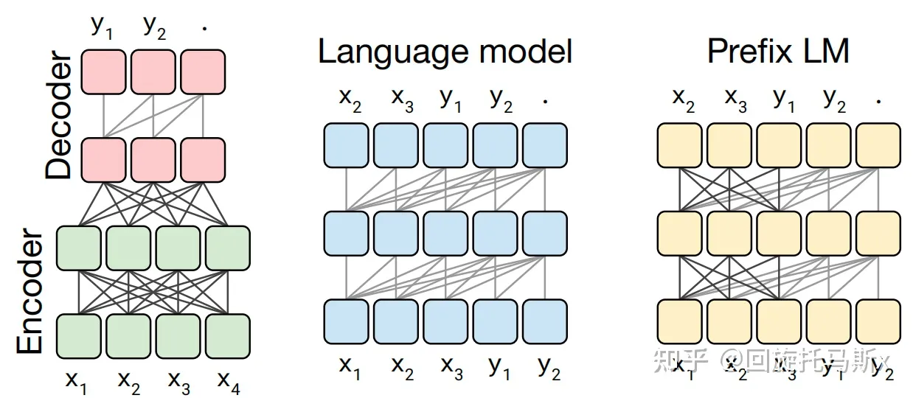
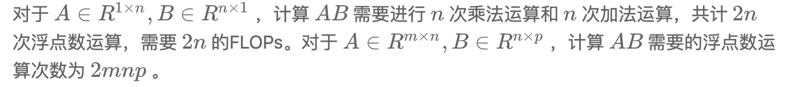
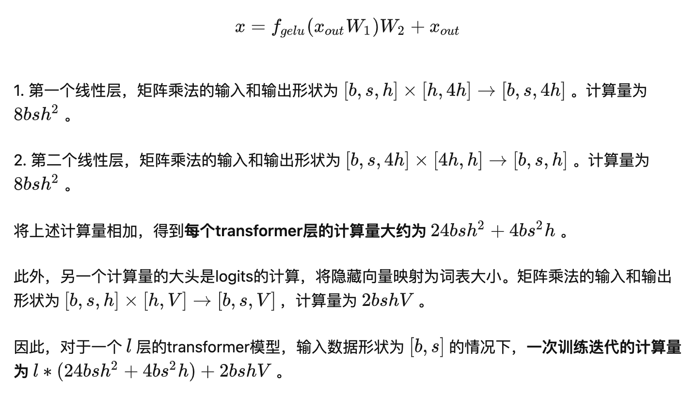
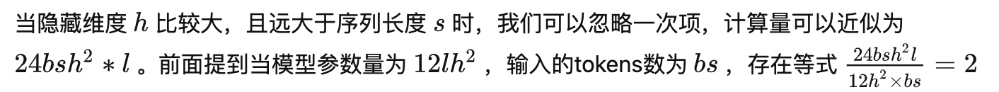
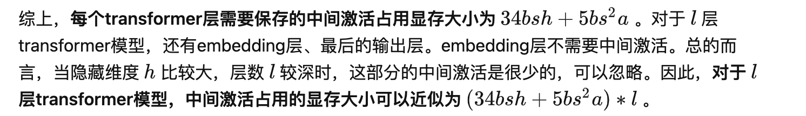
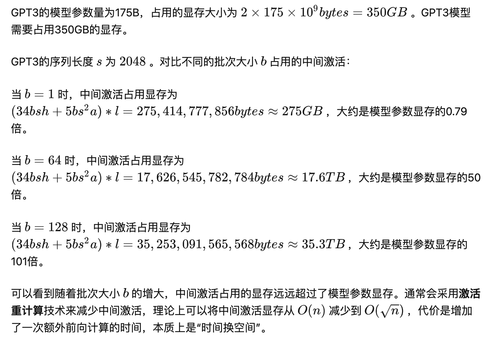
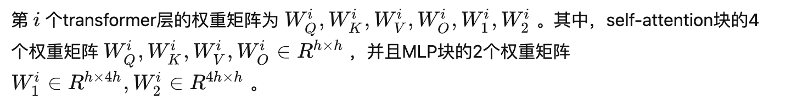

## 分析transformer模型的参数量、计算量、中间激活、KV cache

分析transformer模型的参数量、计算量、中间激活、KV cache：https://zhuanlan.zhihu.com/p/624740065

[LLM]KV cache详解 图示，显存，计算量分析，代码：https://zhuanlan.zhihu.com/p/646577898

## 1. 前言

最近，OpenAI推出的ChatGPT展现出了卓越的性能，引发了大规模语言模型(Large Language Model, LLM)的研究热潮。大规模语言模型的“大”体现在两个方面：模型参数规模大，训练数据规模大。以GPT3为例，GPT3的参数量为1750亿，训练数据量达到了570GB。进而，训练大规模语言模型面临两个主要挑战：显存效率和计算效率。

现在业界的大语言模型都是基于transformer模型的，模型结构主要有两大类：encoder-decoder（代表模型是T5）和decoder-only，具体的，decoder-only结构又可以分为Causal LM（代表模型是GPT系列）和Prefix LM（代表模型是GLM）。归因于GPT系列取得的巨大成功，大多数的主流大语言模型都采用Causal LM结构。因此，针对decoder-only框架，为了更好地理解训练训练大语言模型的显存效率和计算效率，本文分析采用decoder-only框架transformer模型的模型参数量、计算量、中间激活值、KV cache。

为了方便分析，先定义好一些数学符号。记transformer模型的层数为 l ，隐藏层维度为 h ，注意力头数为 a 。词表大小为 V ，训练数据的批次大小为 b ，序列长度为 s 。

## 2. 模型参数量

transformer模型由 l 个相同的层组成，每个层分为两部分：self-attention块和MLP块。

self-attention块的模型参数有 Q、K、V 的权重矩阵 WQ、WK、WV 和偏置，输出权重矩阵 WO 和偏置，4个权重矩阵的形状为 [h,h] ，4个偏置的形状为 [h] 。self- attention块的参数量为 4h^2+4h 。

MLP块由2个线性层组成，一般地，第一个线性层是先将维度从 h 映射到 4h ，第二个线性层再将维度从4h映射到h。第一个线性层的权重矩阵 W1 的形状为 [h,4h] ，偏置的形状为 [4h] 。第二个线性层权重矩阵 W2 的形状为 [4h,h] ，偏置形状为 [h] 。MLP块的参数量为 8h^2+5h 。

self-attention块和MLP块各有一个layer normalization，包含了2个可训练模型参数：缩放参数 γ 和平移参数 β ，形状都是 [h] 。2个layer normalization的参数量为 4h 。

总的，**每个transformer层的参数量**为 12h^2+13h 。

除此之外，词嵌入矩阵的参数量也较多，词向量维度通常等于隐藏层维度 h ，词嵌入矩阵的参数量为 Vh 。最后的输出层的权重矩阵通常与词嵌入矩阵是参数共享的。

关于位置编码，如果采用可训练式的位置编码，会有一些可训练模型参数，数量比较少。如果采用相对位置编码，例如RoPE和ALiBi，则不包含可训练的模型参数。我们忽略这部分参数。

综上， **l 层transformer模型的可训练模型参数量为** l(12h^2+13h)+Vh 。当隐藏维度 h 较大时，可以忽略一次项，**模型参数量近似为** 12lh^2 。

接下来，我们估计不同版本LLaMA模型的参数量。

| 实际参数量 | 隐藏维度h | 层数l | 12lh^2         |
| ---------- | --------- | ----- | -------------- |
| 6.7B       | 4096      | 32    | 6,442,450,944  |
| 13.0B      | 5120      | 40    | 12,582,912,000 |
| 32.5B      | 6656      | 60    | 31,897,681,920 |
| 65.2B      | 8192      | 80    | 64,424,509,440 |

### 2.1 训练过程中的显存占用分析

在训练神经网络的过程中，占用显存的大头主要分为四部分：**模型参数、前向计算过程中产生的中间激活、后向传递计算得到的梯度、优化器状态**。这里着重分析参数、梯度和优化器状态的显存占用，中间激活的显存占用后面会详细介绍。训练大模型时通常会采用AdamW优化器，并用混合精度训练来加速训练，基于这个前提分析显存占用。

在一次训练迭代中，每个可训练模型参数都会对应1个梯度，并对应2个优化器状态（Adam优化器梯度的一阶动量和二阶动量）。设模型参数量为 Φ ，那么梯度的元素数量为 Φ ，AdamW优化器的元素数量为 2Φ 。float16数据类型的元素占2个bytes，float32数据类型的元素占4个bytes。在混合精度训练中，会使用float16的模型参数进行前向传递和后向传递，计算得到float16的梯度；在优化器更新模型参数时，会使用float32的优化器状态、float32的梯度、float32的模型参数来更新模型参数。因此，对于每个可训练模型参数，占用了 (2+4)+(2+4)+(4+4)=20bytes 。使用AdamW优化器和混合精度训练来训练参数量为 Φ 的大模型，**模型参数、梯度和优化器状态占用的显存大小为** 20Φ bytes 。

### **2.2 推理过程中的显存占用分析**

在神经网络的推理阶段，没有优化器状态和梯度，也不需要保存中间激活。**少了梯度、优化器状态、中间激活，模型推理阶段占用的显存要远小于训练阶段**。模型推理阶段，占用显存的大头主要是模型参数，如果使用float16来进行推理，**推理阶段模型参数占用的显存大概是** 2Φ bytes 。如果使用KV cache来加速推理过程，**KV cache也需要占用显存**，KV cache占用的显存下文会详细介绍。此外，输入数据也需要放到GPU上，还有一些中间结果（推理过程中的中间结果用完会尽快释放掉），不过这部分占用的显存是很小的，可以忽略。

## 3. 计算量FLOPs估计

FLOPs，floating point operations，表示浮点数运算次数，衡量了计算量的大小。

如何计算矩阵乘法的FLOPs呢？

在一次训练迭代中，假设输入数据的形状为 [b,s] 。我们**先分析self-attention块的计算**，计算公式如下：

**接下来分析MLP块的计算，计算公式如下**：

### 3.1 计算量与参数量的关联

我们可以近似认为：**在一次前向传递中，对于每个token，每个模型参数，需要进行2次浮点数运算**，即一次乘法法运算和一次加法运算。

一次训练迭代包含了前向传递和后向传递，**后向传递的计算量是前向传递的2倍**。因此，前向传递 + 后向传递的系数 =1+2=3 。一次训练迭代中，对于每个token，每个模型参数，需要进行 2∗3=6 次浮点数运算。

接下来，我们可以估计训练GPT3-175B所需要的计算量。对于GPT3，每个token，每个参数进行了6次浮点数运算，再乘以参数量和总tokens数就得到了总的计算量。GPT3的模型参数量为 174600M ，训练数据量为 300B tokens。

### 3.2 训练时间估计

模型参数量和训练总tokens数决定了训练transformer模型需要的计算量。给定硬件GPU类型的情况下，可以估计所需要的训练时间。给定计算量，训练时间（也就是GPU算完这么多flops的计算时间）不仅跟GPU类型有关，还与GPU利用率有关。计算端到端训练的GPU利用率时，不仅要考虑前向传递和后向传递的计算时间，还要考虑CPU加载数据、优化器更新、多卡通信和记录日志的时间。一般来讲，**GPU利用率一般在 0.3∼0.55 之间**。

上文讲到一次前向传递中，对于每个token，每个模型参数，进行2次浮点数计算。使用激活重计算技术来减少中间激活显存（下文会详细介绍）需要进行一次额外的前向传递，因此前向传递 + 后向传递 + 激活重计算的系数=1+2+1=4。使用**激活重计算**的一次训练迭代中，对于每个token，每个模型参数，需要进行 2∗4=8 次浮点数运算。**在给定训练tokens数、硬件环境配置的情况下，训练transformer模型的计算时间为**：

以GPT3-175B为例，在1024张40GB显存的A100上，在300B tokens的数据上训练175B参数量的GPT3。40GB显存A100的峰值性能为312TFLOPS，设GPU利用率为0.45，则**所需要的训练时间为34天，这与[7]中的训练时间是对得上的**。

以LLaMA-65B为例，在2048张80GB显存的A100上，在1.4TB tokens的数据上训练了65B参数量的模型。80GB显存A100的峰值性能为624TFLOPS，设GPU利用率为0.3，则**所需要的训练时间为21天，这与[4]中的实际训练时间是对得上的**。

## 4. 中间激活值分析

除了模型参数、梯度、优化器状态外，占用显存的大头就是前向传递过程中计算得到的中间激活值了，需要保存中间激活以便在后向传递计算梯度时使用。这里的激活（activations）指的是：**前向传递过程中计算得到的，并在后向传递过程中需要用到的所有张量**。这里的激活不包含模型参数和优化器状态，但包含了dropout操作需要用到的mask矩阵。

在分析中间激活的显存占用时，只考虑激活占用显存的大头，忽略掉一些小的buffers。比如，对于layer normalization，计算梯度时需要用到层的输入、输入的均值 μ 和方差 σ^2 。输入包含了 bsh 个元素，而输入的均值和方差分别包含了 bs 个元素。由于 h 通常是比较大的（千数量级），有 bsh≫bs 。因此，对于layer normalization，中间激活近似估计为 bsh ，而不是 bsh+2bs 。

大模型在训练过程中通常采用混合精度训练，中间激活值一般是float16或者bfloat16数据类型的。在分析中间激活的显存占用时，**假设中间激活值是以float16或bfloat16数据格式来保存的，每个元素占了2个bytes。唯一例外的是，dropout操作的mask矩阵，每个元素只占1个bytes**。在下面的分析中，单位是bytes，而不是元素个数。

每个transformer层包含了一个self-attention块和MLP块，并分别对应了一个layer normalization连接。

**先分析self-attention块的中间激活**。self-attention块的计算公式如下：

1. 对于 Q,K,V ，需要保存它们共同的输入 x ，这就是中间激活。输入 x 的形状为 [b,s,h] ，元素个数为 bsh ，占用显存大小为 2∗bsh=2bsh 。
2. 对于 QKT 矩阵乘法，需要保存中间激活 Q,K ，两个张量的形状都是 [b,s,h] ，占用显存大小合计为 2∗2∗bsh=4bsh 。
3. 对于 softmax() 函数，需要保存函数的输入 QKT ，占用显存大小为 2bs^2a ，这里的 a 表示注意力头数。

4. 计算完 softmax() 函数后，会进行dropout操作。需要保存一个mask矩阵，mask矩阵的形状与 QKT 相同，占用显存大小为 bs^2a 。
5. 计算在 V 上的attention，即 score⋅V ，需要保存 score ，大小为 2bs^2a ；以及 V ，大小为 2bsh 。二者占用显存大小合计为 2bs^2a+2bsh 。
6. 计算输出映射以及一个dropout操作。输入映射需要保存其输入，大小为 2bsh ；dropout需要保存mask矩阵，大小为 bsh 。二者占用显存大小合计为 3bsh 。

因此，将上述中间激活相加得到，self-attention块的中间激活占用显存大小为 11bsh+5bs^2a 。

接下来**看MLP块的中间激活。MLP块的计算公式如下**：

1. 第一个线性层需要保存其输入，占用显存大小为 2bsh 。
2. 激活函数需要保存其输入，占用显存大小为 8bsh 。
3. 第二个线性层需要保存其输入，占用显存大小为 8bsh 。
4. 最后有一个dropout操作，需要保存mask矩阵，占用显存大小为 bsh 。

对于MLP块，需要保存的中间激活值为 19bsh 。

另外，self-attention块和MLP块分别对应了一个layer normalization。每个layer norm需要保存其输入，大小为 2bsh 。2个layer norm需要保存的中间激活为 4bsh 。

### 4.1 对比中间激活与模型参数的显存大小

在一次训练迭代中，模型参数（或梯度）占用的显存大小只与模型参数量和参数数据类型有关，与输入数据的大小是没有关系的。优化器状态占用的显存大小也是一样，与优化器类型有关，与模型参数量有关，但与输入数据的大小无关。而**中间激活值与输入数据的大小（批次大小 b 和序列长度 s ）是成正相关的**，随着批次大小 b 和序列长度 s 的增大，中间激活占用的显存会同步增大。当我们训练神经网络遇到显存不足OOM（Out Of Memory）问题时，通常会尝试减小批次大小来避免显存不足的问题，这种方式减少的其实是中间激活占用的显存，而不是模型参数、梯度和优化器的显存。

以GPT3-175B为例，我们来直观地对比下模型参数与中间激活的显存大小。GPT3的模型配置如下。我们假设采用混合精度训练，模型参数和中间激活都采用float16数据类型，每个元素占2个bytes。

| 模型名 | 参数量 | 层数 | 隐藏维度 | 注意力头数 |
| ------ | ------ | ---- | -------- | ---------- |
| GPT3   | 175B   | 96   | 12288    | 96         |

## 5. KV cache

在推断阶段，transformer模型加速推断的一个常用策略就是使用 KV cache。一个典型的大模型生成式推断包含了两个阶段：

1. **预填充阶段**：输入一个prompt序列，为每个transformer层生成 key cache和value cache（KV cache）。
2. **解码阶段**：使用并更新KV cache，一个接一个地生成词，当前生成的词依赖于之前已经生成的词。

**预填充阶段**

**解码阶段**

### 5.1 KV cache的显存占用分析

假设输入序列的长度为 s ，输出序列的长度为 n ，以float16来保存KV cache，那么**KV cache的峰值显存占用大小为** b(s+n)h∗l∗2∗2=4blh(s+n) 。这里第一个2表示K/V cache，第二个2表示float16占2个bytes。

以GPT3为例，对比KV cache与模型参数占用显存的大小。GPT3模型占用显存大小为350GB。假设批次大小 b=64 ，输入序列长度 s=512 ，输出序列长度 n=32 ，则KV cache占用显存为 4blh(s+n)=164,282,499,072bytes≈164GB ，大约是模型参数显存的0.5倍。

## 6. 总结

本文首先介绍了如何计算transformer模型的参数量，基于参数量可以进一步估计模型参数、梯度和优化器状态占用的显存大小。接着，本文估计了训练迭代中，在给定训练tokens数的情况下transformer模型的计算量，给予计算量和显卡性能可以进一步估计训练迭代的计算耗时。然后，本文分析了transformer模型前向计算过程中产生的中间激活值的显存大小，中间激活的显存大小与输入数据大小正相关，甚至会远超过模型参数占用的显存。最后，本文介绍了transformer模型推理过程常用的加速策略：使用KV cache。总的来说，分析transformer模型的参数量、计算量、中间激活和KV cache，有助于理解大模型训练和推断过程中的显存效率和计算效率。

## 7. 参考链接

1. Raffel C, Shazeer N, Roberts A, et al. Exploring the limits of transfer learning with a unified text-to-text transformer[J]. The Journal of Machine Learning Research, 2020, 21(1): 5485-5551.
2. Vaswani A, Shazeer N, Parmar N, et al. Attention is all you need[J]. Advances in neural information processing systems, 2017, 30.
3. Brown T, Mann B, Ryder N, et al. Language models are few-shot learners[J]. Advances in neural information processing systems, 2020, 33: 1877-1901.
4. Touvron H, Lavril T, Izacard G, et al. Llama: Open and efficient foundation language models[J]. arXiv preprint arXiv:2302.13971, 2023.
5. Sheng Y, Zheng L, Yuan B, et al. High-throughput generative inference of large language models with a single gpu[J]. arXiv preprint arXiv:2303.06865, 2023.
6. Korthikanti V, Casper J, Lym S, et al. Reducing activation recomputation in large transformer models[J]. arXiv preprint arXiv:2205.05198, 2022.
7. Narayanan D, Shoeybi M, Casper J, et al. Efficient large-scale language model training on gpu clusters using megatron-lm[C]//Proceedings of the International Conference for High Performance Computing, Networking, Storage and Analysis. 2021: 1-15.
8. Smith S, Patwary M, Norick B, et al. Using deepspeed and megatron to train megatron-turing nlg 530b, a large-scale generative language model[J]. arXiv preprint arXiv:2201.11990, 2022.