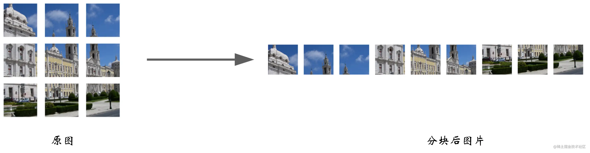

# CV攻城狮入门VIT(vision transformer)之旅——VIT原理详解篇

来源：https://juejin.cn/post/7153427278054031391

来源：https://blog.csdn.net/qq_37541097/article/details/118242600

## 写在前面

  在上一篇，我已经详细为大家介绍了NLP邻域中的[Transformer](https://juejin.cn/post/7152002993204756487)，足足写了10000+字，酝酿了好多天才下笔，也写了很久，自认为写的还算是通俗全面。如若你对Transformer还没什么了解，建议你点击[☞☞☞](https://juejin.cn/post/7152002993204756487)了解详情。

  其实，作为CV程序猿的我们，学习NLP邻域的Transformer更像是被迫之举，毕竟现在基于Transformer的算法在CV邻域可谓是大杀特杀。那么今天我就为大家带来将Transformer引入到视觉物体分类中的一篇文章，标题为 `AN IMAGE IS WORTH 16X16 WORDS:TRANSFORMERS FOR IMAGE RECOGNITION AT SCALE  `，这篇文章发表于2021年，下载链接如下：[download](https://link.juejin.cn?target=https%3A%2F%2Farxiv.org%2Fpdf%2F2010.11929.pdf) 📥📥📥

  那么这篇文章将为大家详细讲解VIT的原理，下一篇将给大家带来VIT的代码实战。🌼🌼🌼

  准备好了嘛，滴滴滴，让我们坐上入门VIT旅途的观光车，一览VIT的风采。🚖🚖🚖

## VIT模型整体框架✨✨✨

下图是原论文中给出的关于Vision Transformer(ViT)的模型框架。简单而言，模型由三个模块组成：

Linear Projection of Flattened Patches(Embedding层)
Transformer Encoder(图右侧有给出更加详细的结构)
MLP Head（最终用于分类的层结构

  从整体上来看，VIT模型的结构是很少的，事实上确实如此。如果你明白了我上一篇讲解的Transformer的话，那这篇文章真的就特别简单了，可以说没什么难点。这篇文章作者企图不改变Transformer的结构来实现物体分类任务，我们可以来看一下VIT中的Transformer Encoder 结构，基本是和Transformer中是一样的。注意我这里说的是基本喔，你对比两篇论文中Encoder的结构你会发现，Norm这个结构的位置是有所变化的，至于为什么这样做，作者也没有提及，个人感觉这个改变对结构影响不会很大，感兴趣的可以改变这个结构尝试尝试效果。另外一点是在VIT中没有使用Decoder结构，这里大家需要注意一下。

  整体框架大家有个印象就好，肯定还有一些不清楚的地方。不用担心，后面我会详细的为大家讲述一些结构上的细节！！！🌴🌴🌴

## VIT细节梳理✨✨✨

  首先，我觉得大家有必要想想NLP中的Transformer和CV中的VIT这两个结构输入有什么区别？从变量的类型来看，两者都是一个tensor张量；而从变量的维度来看，NLP中的输入往往是二维的tensor，而CV中往往是一个三维的RGB图像。**【都忽略了Batch维度】** 这种维度的不统一会导致我们不能直接将图片数据喂入到Transformer结构中去，而是需要进行一定的维度转换，即将三维的tensor转换成二维的tensor，这个过程被称为patch_embedding。

  那论文中是如何将三维的tensor转化为二维的tensor的呢？如下图所示：

  可以看到，上图将一张RGB图片分成了9个相同大小的小块。假设原图尺寸为H×W×C, 每个块的大小为m×n×C，对于上图我们一共分成了9块，应有 $$\frac{H}{m} = 3 $$、$$\frac{W}{n} = 3$$。不知道大家发现没有，其实就进行这样的一个操作我们就已经把三维的tensor转化为二维的tensor了，即由原图的 H×W×C→9×(m×n×C)。**【注：此时每个小块的图片尺寸都是m×n×C，我们将其展平其实就是一个维度】**

上文为大家介绍了三维tensor到二维tensor的转换，理论上很简单，代码其实就更简单了，就只需要调用一个函数即可，具体什么函数不知道的大家可以参考[这篇文章](https://link.juejin.cn?target=https%3A%2F%2Fzhuanlan.zhihu.com%2Fp%2F342261872)。

  我这里没有讲这个函数是因为我参考的代码并不是这样做维度变换的，而是通过卷积的方式进行。听上去是不是很奇妙呢，下面就跟我一起来看看吧。为方便大家理解，这里我们拿具体的数字来举例。设原图的尺寸为 `224*224*3`，每个块（patch）的尺寸为`16∗16∗3`，则我们一共会得到 $$\frac {224}{16}*\frac {224}{16} =14*14=196$$个patchs， 所以经分块后，一个`224*224*3`的三维tensor会变成一个`196*(16*16*3)`，即`196*768`的二维张量。那么由`224*224*3`变换到`196*768`的这个过程是可以由卷积实现的，即我们对原图进行卷积，卷积核大小为`16*16*3 `,步长为16，padding=0，卷积核个数为768，卷积后，我们会得到特征图，其尺寸为`14*14*768`，接着将前两个维度展平，就得到了维度为`196*798`的tensor。其大致过程如下：

  我认为这步使用卷积真的很巧妙，我们得到的`196*798`的二维向量，其实每一行即`1*798`都包含了原图中`16*16*3`大小的patch，这就是卷积的提取特征的功能嘛。**【我这样介绍不知道大家会不会有这样的思路——我先用一些CNN模型来对图片提取特征，只要使CNN最后的输出维度为196\*768，最后再送入Transformer模型中。其实这就将CNN和Transformer很好的结合在一起了，这种方法是可行的，大家可以自己尝试尝试喔】**

---

现在我们已经得到了`196*768`维的tensor，我们假设其为x。接下来我们会使用一个维度为`1*768`维的Class token来和x进行Concat操作，输出结果为`197*768`维的tensor。这里肯定有人有疑问了，为什么这里会加一个Class token，在上篇讲述的Transformer中可没有这个操作。--小傻瓜--因为这篇文章我们要用来对物体进行分类啊！！！说不定你现在有点怀疑自己了，因为是分类任务所以要加上Class token？这两个还有因果关系不成？一个个问号从你脑海中冒出，百思不得其解。其实啊，这可没什么啥因果关系，只是我们在分类任务中加上Class token可能会效果更好。🌵🌵🌵

  与其介绍为什么加上Class token会效果更好，不如我们先来看看不加Class token会产生什么效果。如果我们不加Class token，直接将`196*768`维的tensor输入Encode中，我们的输出同样是`196*768`，即196个`1*768`维的向量，这时候我们应该拿哪个向量来当作最后的输出向量进而进行物体分类任务呢？这我们是很难确定的。所以我们干脆在输入Encode前就加上一个`1*768`维的向量**（这个1维向量放在196\*768维向量前面）**，这样在输出时向量的维度就会是`197*768`，然后我们只需要通过切片的方式获得第一个`1*768`维向量并将其送入分类头进行分类即可。在代码中这个Class token是一个可学习的向量，初始为全0的`1*768`维向量。🌱🌱🌱

---

 Class token和x拼接后，输出尺寸变成了`197*768`，此时我们会加上一个位置编码向量position Embedding，其维度为`197*768`。关于这部分我在上一篇介绍Transformer中已经很详细的介绍过了，这里不再过多阐述原理。但我们可以看一下如果我们不使用位置编码，那么下面两幅图输出的结果将是一致的，这显然是有违我们直觉的。

            图片来源于yutubu Shusen Wang老师

  需要注意的是，在上一篇我们采用的是正弦位置编码的方式，而这里我们将位置编码向量设置为一个可学习的向量，初始为全0的197*768维向量。至于这两种编码方式哪个好我也没有做过实验，感兴趣的可以查查资料，做做实验，个人感觉使用可学习的位置编码效果应该不会差！🌲🌲🌲

接下来我们将经过位置编码的输入喂入encoder网络中，并重复L次encoder结构，encoder的结构如下：

            

  这部分我也不再细讲了，不明白的可以看我上一篇关于Transformer中Encoder的讲解。经过L个encoder结构后，输入维度没有发生变换，仍为`197*768`维。**【到这里大家可能就发现了VIT模型很多结构都和Transformer很类似，所以大家搞懂了Transformer再来看这篇文章真的就很简单了】**

---

经过encoder结构后，输出的维度维`197*768`，此时我们会通过切片的方式提取出Class token的信息，其维度为`1*768`。接着会拿这个`1*768`维的Class token经过MLP Head层。MLP Head层的结构如下：

              

  其中Pre-Logits这部分是可选的，其就是一个全连接层加上一个tanh激活函数，具体我们会在下一篇代码实战部分进行讲解。Linear就用于分类了，输出节点个数为我们任务的类别数。

这样，我们VIT的整个流程就都学完了，是不是发现还蛮简单的呢。最后，我找到了一张整个过程的动态图，大家可以参考：【图片来源于[此篇博客](https://link.juejin.cn/?target=https%3A%2F%2Fblog.csdn.net%2Fwuchaohuo724%2Farticle%2Fdetails%2F120060992)】

## VIT模型参数

  在论文中给出了三个模型（Base    Large    Huge）的参数，如下：

| Model     | Patch size | Layers | Hidden Size | MLP size | Heads | Params |
| --------- | ---------- | ------ | ----------- | -------- | ----- | ------ |
| VIT-Base  | 16*16      | 12     | 768         | 3072     | 12    | 86M    |
| VIT-Large | 16*16      | 24     | 1024        | 4096     | 16    | 307M   |
| VIT-Huge  | 14*14      | 32     | 1280        | 5120     | 16    | 632M   |

  这里对上表中某些参数做个简要的介绍。Patch size为将一张图片分成小块每小块的尺寸，在我们的代码中其实就是卷积核的尺寸。Layers表示encoder结构重复的次数。Hidden Size为通过输入encoder前每个token的维度，在我们上文举的例子中为768，在下篇代码中其实就是卷积核的个数。MLP size是在encoder结构中的MLP Block中第一个全连接层的节点个数，这个我们再代码部分细讲。Heads表示Multi-Head Attention的Heads数目。params表示模型所用参数大小。

## 实验结论

  这部分论文中还是放了好几张图的，这里我就介绍一张比较关键的，如下图所示：

  这幅图展示了什么呢——作者分别在ImageNet、ImageNet-21k和JFT-300M这三个数据集上做实验。**【注：这三个数据集数据量越来越大】**

  我们发现，当在小数据集ImageNet上做预训练时，VIT的模型架构效果普遍低于BiT【注：BiT是用ResNet搭建的结构】；当在中等数据集ImageNet-21k上做预训练时，VIT的模型架构基本位于BiT最好和最差的之间；而当在大数据集JFT-300M上做预训练时，VIT的模型架构最好的效果已经超过了BiT。

  这个实验告诉我们什么呢？——**VIT模型需要在大数据集上进行预训练，在大数据集上预训练的效果会比卷积神经网络的上限高！**

