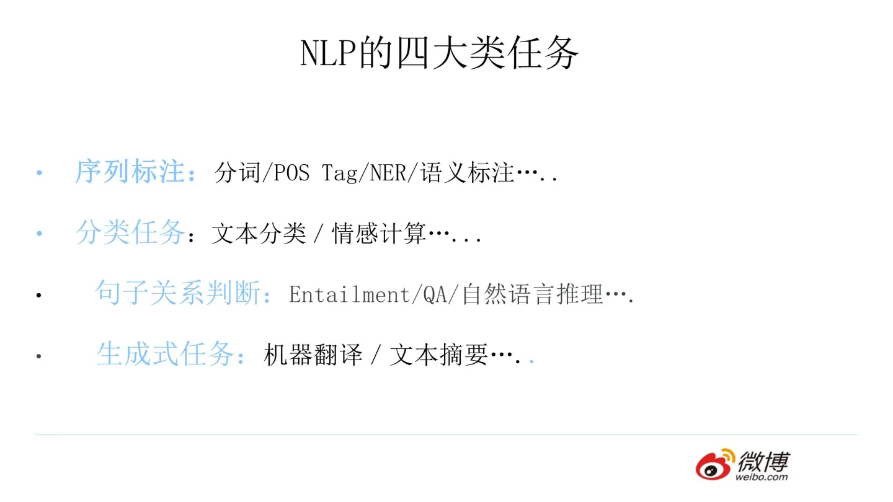
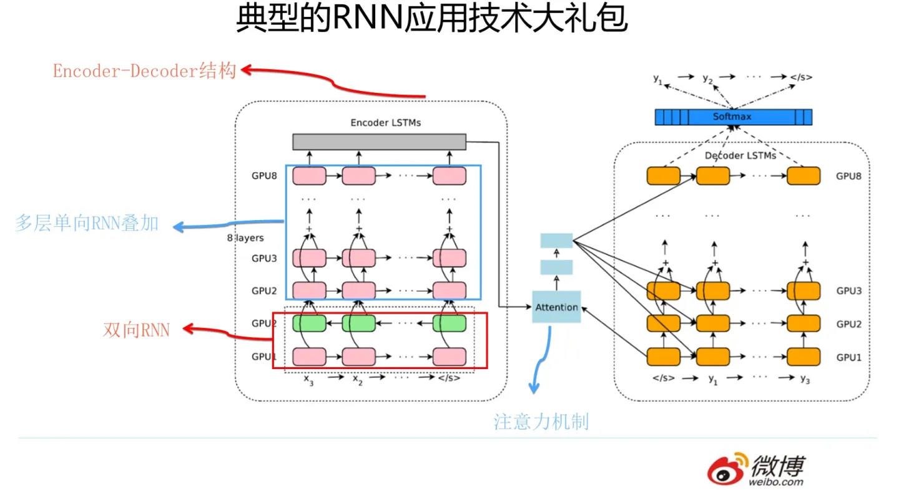
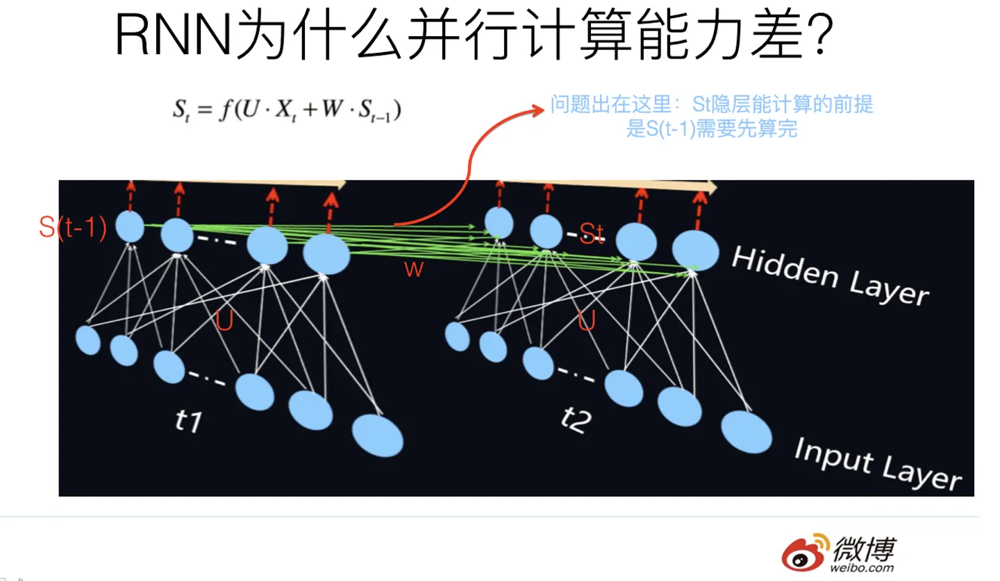
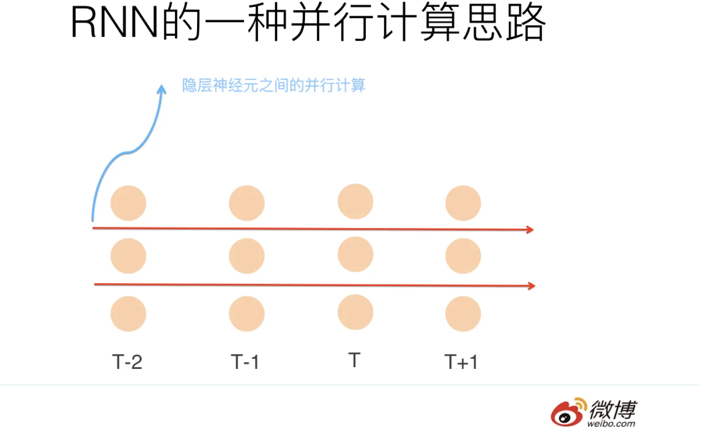
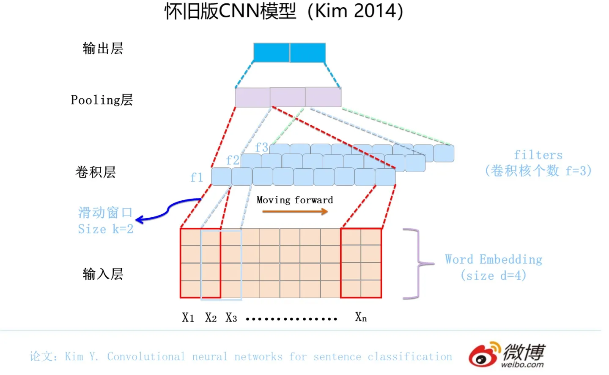
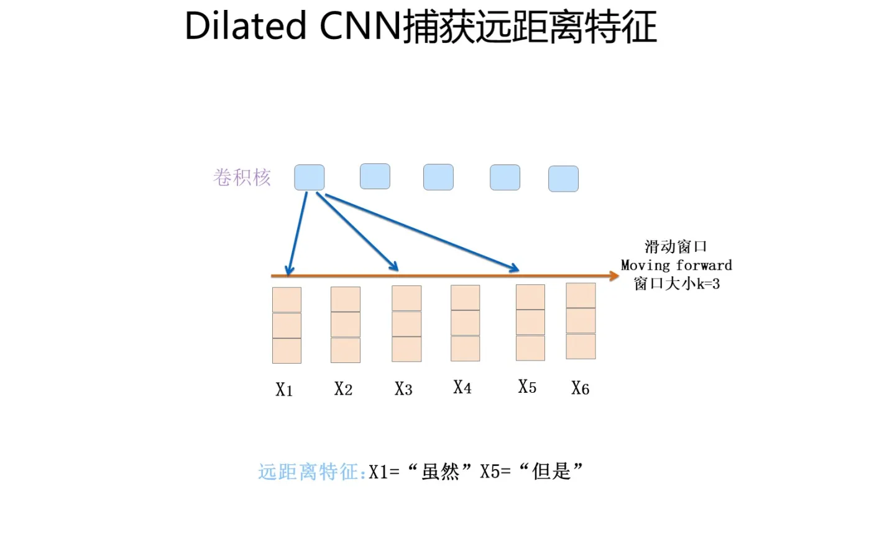
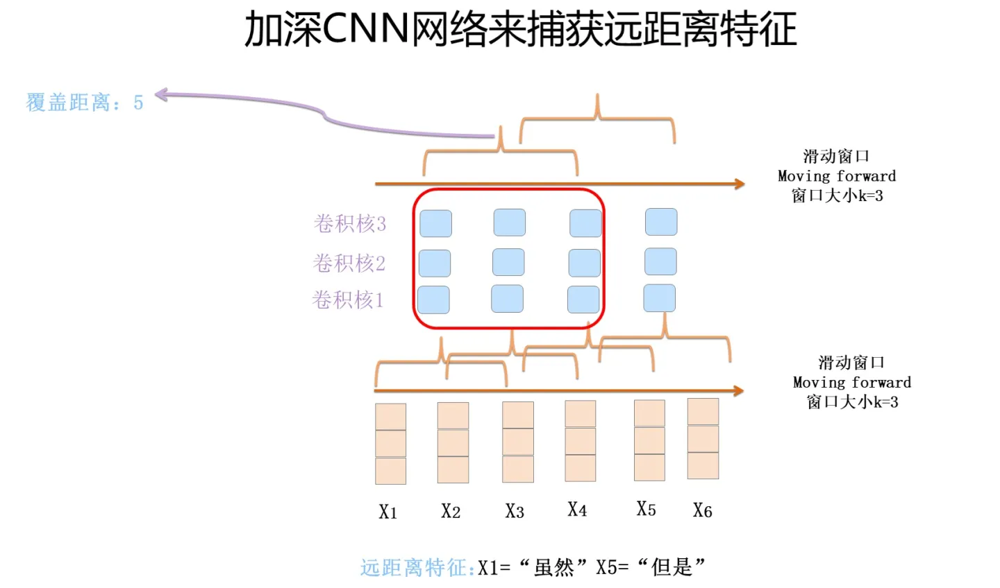
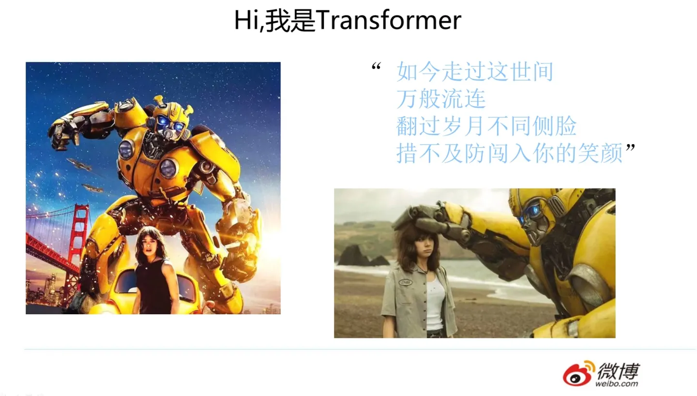
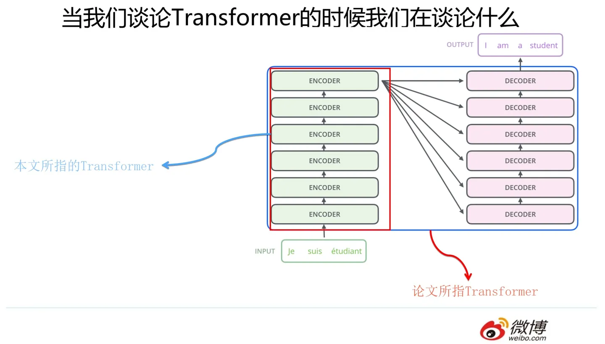
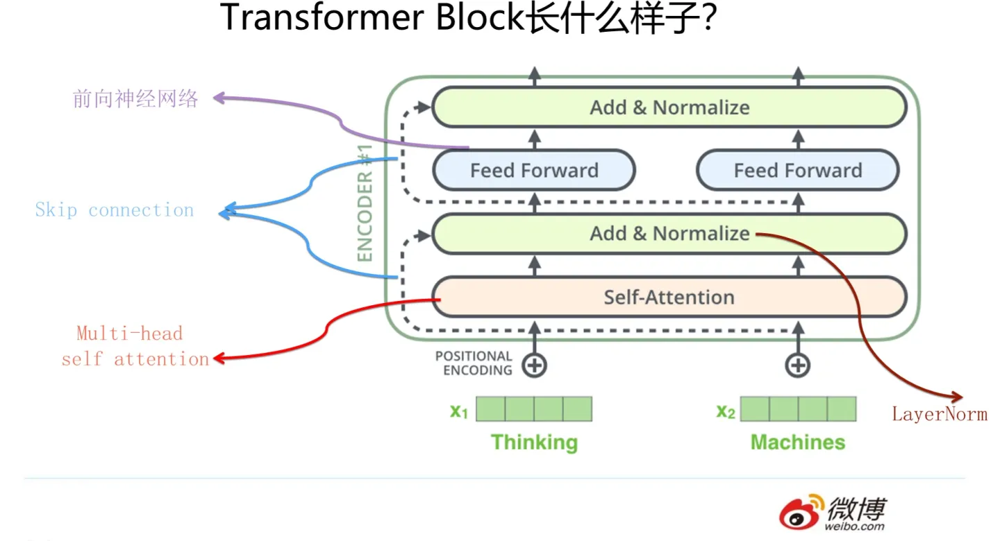

# 放弃幻想，全面拥抱Transformer：自然语言处理三大特征抽取器（CNN/RNN/TF）比较

来源：https://zhuanlan.zhihu.com/p/54743941

发布于 2019-01-13 10:08

在辞旧迎新的时刻，大家都在忙着回顾过去一年的成绩（或者在灶台前含泪数锅），并对2019做着规划，当然也有不少朋友执行力和工作效率比较高，直接把2018年初制定的计划拷贝一下，就能在3秒钟内完成2019年计划的制定，在此表示祝贺。2018年从经济角度讲，对于所有人可能都是比较难过的一年，而对于自然语言处理领域来说，2018年无疑是个收获颇丰的年头，而诸多技术进展如果只能选择一项来讲的话，那么当之无愧的应该就是Bert模型了。在上一篇介绍Bert的文章“[从Word Embedding到Bert模型—自然语言处理中的预训练技术发展史](https://zhuanlan.zhihu.com/p/49271699)”里，我曾大言不惭地宣称如下两个个人判断：一个是Bert这种两阶段的模式（预训练+Finetuning）必将成为NLP领域研究和工业应用的流行方法；第二个是从NLP领域的特征抽取器角度来说，Transformer会逐步取代RNN成为最主流的的特征抽取器。关于特征抽取器方面的判断，上面文章限于篇幅，只是给了一个结论，并未给出具备诱惑力的说明，看过我文章的人都知道我不是一个随便下结论的人（那位正在补充下一句：“你随便起来不是……”的同学请住口，请不要泄露国家机密，你可以继续睡觉，吵到其它同学也没有关系，哈哈），但是为什么当时我会下这个结论呢？本文可以看做是上文的一个外传，会给出比较详实的证据来支撑之前给出的结论。

如果对目前NLP里的三大特征抽取器的未来走向趋势做个宏观判断的话，我的判断是这样的：RNN人老珠黄，已经基本完成它的历史使命，将来会逐步退出历史舞台；CNN如果改造得当，将来还是有希望有自己在NLP领域的一席之地，如果改造成功程度超出期望，那么还有一丝可能作为割据一方的军阀，继续生存壮大，当然我认为这个希望不大，可能跟宋小宝打篮球把姚明打哭的概率相当；而新欢Transformer明显会很快成为NLP里担当大任的最主流的特征抽取器。至于将来是否会出现新的特征抽取器，一枪将Tranformer挑落马下，继而取而代之成为新的特征抽取山大王？这种担忧其实是挺有必要的，毕竟李商隐在一千年前就告诫过我们说：“君恩如水向东流，得宠忧移失宠愁。 莫向樽前奏花落，凉风只在殿西头。”当然这首诗看样子目前送给RNN是比较贴切的，至于未来Transformer是否会失宠？这个问题的答案基本可以是肯定的，无非这个时刻的来临是3年之后，还是1年之后出现而已。当然，我希望如果是在读这篇文章的你，或者是我，在未来的某一天，从街头拉来一位长相普通的淑女，送到韩国整容，一不小心偏离流水线整容工业的美女模板，整出一位天香国色的绝色，来把Transformer打入冷宫，那是最好不过。但是在目前的状态下，即使是打着望远镜，貌似还没有看到有这种资质的候选人出现在我们的视野之内。

我知道如果是一位严谨的研发人员，不应该在目前局势还没那么明朗的时候做出如上看似有些武断的明确结论，所以这种说法可能会引起争议。但是这确实就是我目前的真实想法，至于根据什么得出的上述判断？这种判断是否有依据？依据是否充分？相信你在看完这篇文章可以有个属于自己的结论。

可能谈到这里，有些平常吃亏吃的少所以喜欢挑刺的同学会质疑说：你凭什么说NLP的典型特征抽取器就这三种呢？你置其它知名的特征抽取器比如Recursive NN于何地?嗯，是，很多介绍NLP重要进展的文章里甚至把Recursive NN当做一项NLP里的重大进展，除了它，还有其它的比如Memory Network也享受这种部局级尊贵待遇。但是我一直都不太看好这两个技术，而且不看好很多年了，目前情形更坚定了这个看法。而且我免费奉劝你一句，没必要在这两个技术上浪费时间，至于为什么，因为跟本文主题无关，以后有机会再详细说。

上面是结论，下面，我们正式进入举证阶段。

## 战场侦查：NLP任务的特点及任务类型

NLP任务的特点和图像有极大的不同，上图展示了一个例子，NLP的输入往往是一句话或者一篇文章，所以它有几个特点：首先，输入是个一维线性序列，这个好理解；其次，输入是不定长的，有的长有的短，而这点其实对于模型处理起来也会增加一些小麻烦；再次，单词或者子句的相对位置关系很重要，两个单词位置互换可能导致完全不同的意思。如果你听到我对你说：“你欠我那一千万不用还了”和“我欠你那一千万不用还了”，你听到后分别是什么心情？两者区别了解一下；另外，句子中的长距离特征对于理解语义也非常关键，例子参考上图标红的单词，特征抽取器能否具备长距离特征捕获能力这一点对于解决NLP任务来说也是很关键的。

上面这几个特点请记清，**一个特征抽取器是否适配问题领域的特点，有时候决定了它的成败，而很多模型改进的方向，其实就是改造得使得它更匹配领域问题的特性**。这也是为何我在介绍RNN、CNN、Transformer等特征抽取器之前，先说明这些内容的原因。

NLP是个很宽泛的领域，包含了几十个子领域，理论上只要跟语言处理相关，都可以纳入这个范围。但是如果我们对大量NLP任务进行抽象的话，会发现绝大多数NLP任务可以归结为几大类任务。两个看似差异很大的任务，在解决任务的模型角度，可能完全是一样的。

通常而言，绝大部分NLP问题可以归入上图所示的四类任务中：一类是序列标注，这是最典型的NLP任务，比如中文分词，词性标注，命名实体识别，语义角色标注等都可以归入这一类问题，它的特点是句子中每个单词要求模型根据上下文都要给出一个分类类别。第二类是分类任务，比如我们常见的文本分类，情感计算等都可以归入这一类。它的特点是不管文章有多长，总体给出一个分类类别即可。第三类任务是句子关系判断，比如Entailment，QA，语义改写，自然语言推理等任务都是这个模式，它的特点是给定两个句子，模型判断出两个句子是否具备某种语义关系；第四类是生成式任务，比如机器翻译，文本摘要，写诗造句，看图说话等都属于这一类。它的特点是输入文本内容后，需要自主生成另外一段文字。

解决这些不同的任务，从模型角度来讲什么最重要？是特征抽取器的能力。尤其是深度学习流行开来后，这一点更凸显出来。因为深度学习最大的优点是“端到端（end to end）”，当然这里不是指的从客户端到云端，意思是以前研发人员得考虑设计抽取哪些特征，而端到端时代后，这些你完全不用管，把原始输入扔给好的特征抽取器，它自己会把有用的特征抽取出来。

身为资深Bug制造者和算法工程师，你现在需要做的事情就是：选择一个好的特征抽取器，选择一个好的特征抽取器，选择一个好的特征抽取器，喂给它大量的训练数据，设定好优化目标（loss function），告诉它你想让它干嘛……..然后你觉得你啥也不用干等结果就行了是吧？那你是我见过的整个宇宙中最乐观的人…….你大量时间其实是用在调参上…….。从这个过程可以看出，如果我们有个强大的特征抽取器，那么中初级算法工程师沦为调参侠也就是个必然了，在AutoML（自动那啥）流行的年代，也许以后你想当调参侠而不得，李斯说的“吾欲与若复牵黄犬，俱出上蔡东门逐狡兔，岂可得乎！”请了解一下。所以请珍惜你半夜两点还在调整超参的日子吧，因为对于你来说有一个好消息一个坏消息，好消息是：对于你来说可能这样**辛苦**的日子不多了！坏消息是：对于你来说可能这样辛苦的日子**不多了**！！！那么怎么才能成为算法高手？你去设计一个更强大的特征抽取器呀。

下面开始分叙三大特征抽取器。

## 沙场老将RNN：廉颇老矣，尚能饭否

RNN模型我估计大家都熟悉，就不详细介绍了，模型结构参考上图，核心是每个输入对应隐层节点，而隐层节点之间形成了线性序列，信息由前向后在隐层之间逐步向后传递。我们下面直接进入我想讲的内容。

### 为何RNN能够成为解决NLP问题的主流特征抽取器

我们知道，RNN自从引入NLP界后，很快就成为吸引眼球的明星模型，在NLP各种任务中被广泛使用。但是原始的RNN也存在问题，它采取线性序列结构不断从前往后收集输入信息，但这种线性序列结构在反向传播的时候存在优化困难问题，因为反向传播路径太长，容易导致严重的梯度消失或梯度爆炸问题。为了解决这个问题，后来引入了LSTM和GRU模型，通过增加中间状态信息直接向后传播，以此缓解梯度消失问题，获得了很好的效果，于是很快LSTM和GRU成为RNN的标准模型。

其实图像领域最早由HighwayNet/Resnet等导致模型革命的skip connection的原始思路就是从LSTM的隐层传递机制借鉴来的。经过不断优化，后来NLP又从图像领域借鉴并引入了attention机制（从这两个过程可以看到不同领域的相互技术借鉴与促进作用），叠加网络把层深作深，以及引入Encoder-Decoder框架，这些技术进展极大拓展了RNN的能力以及应用效果。下图展示的模型就是非常典型的使用RNN来解决NLP任务的通用框架技术大礼包，在更新的技术出现前，你可以在NLP各种领域见到这个技术大礼包的身影。

上述内容简单介绍了RNN在NLP领域的大致技术演进过程。那么为什么RNN能够这么快在NLP流行并且占据了主导地位呢？主要原因还是因为RNN的结构天然适配解决NLP的问题，NLP的输入往往是个不定长的线性序列句子，而RNN本身结构就是个可以接纳不定长输入的由前向后进行信息线性传导的网络结构，而在LSTM引入三个门后，对于捕获长距离特征也是非常有效的。所以RNN特别适合NLP这种线形序列应用场景，这是RNN为何在NLP界如此流行的根本原因。

### RNN在新时代面临的两个严重问题

RNN在NLP界一直红了很多年（2014-2018？），在2018年之前，大部分各个子领域的State of Art的结果都是RNN获得的。但是最近一年来，眼看着RNN的领袖群伦的地位正在被动摇，所谓各领风骚3-5年，看来网红模型也不例外。

那这又是因为什么呢？主要有两个原因。

第一个原因在于一些后起之秀新模型的崛起，比如经过特殊改造的CNN模型，以及最近特别流行的Transformer，这些后起之秀尤其是Transformer的应用效果相比RNN来说，目前看具有明显的优势。这是个主要原因，老人如果干不过新人，又没有脱胎换骨自我革命的能力，自然要自觉或不自愿地退出历史舞台，这是自然规律。至于RNN能力偏弱的具体证据，本文后面会专门谈，这里不展开讲。当然，技术人员里的RNN保皇派们，这个群体规模应该还是相当大的，他们不会轻易放弃曾经这么热门过的流量明星的，所以也想了或者正在想一些改进方法，试图给RNN延年益寿。至于这些方法是什么，有没有作用，后面也陆续会谈。

另外一个严重阻碍RNN将来继续走红的问题是：**RNN本身的序列依赖结构对于大规模并行计算来说相当之不友好**。通俗点说，就是RNN很难具备高效的并行计算能力，这个乍一看好像不是太大的问题，其实问题很严重。如果你仅仅满足于通过改RNN发一篇论文，那么这确实不是大问题，但是如果工业界进行技术选型的时候，在有快得多的模型可用的前提下，是不太可能选择那么慢的模型的。一个没有实际落地应用支撑其存在价值的模型，其前景如何这个问题，估计用小脑思考也能得出答案。

那问题来了：为什么RNN并行计算能力比较差？是什么原因造成的？

我们知道，RNN之所以是RNN，能将其和其它模型区分开的最典型标志是：T时刻隐层状态的计算，依赖两个输入，一个是T时刻的句子输入单词Xt，这个不算特点，所有模型都要接收这个原始输入；关键的是另外一个输入，T时刻的隐层状态St还依赖T-1时刻的隐层状态S(t-1)的输出，这是最能体现RNN本质特征的一点，RNN的历史信息是通过这个信息传输渠道往后传输的，示意参考上图。那么为什么RNN的并行计算能力不行呢？问题就出在这里。**因为T时刻的计算依赖T-1时刻的隐层计算结果**，而T-1时刻的计算依赖T-2时刻的隐层计算结果……..这样就形成了所谓的序列依赖关系。就是说只能先把第1时间步的算完，才能算第2时间步的结果，这就造成了RNN在这个角度上是无法并行计算的，只能老老实实地按着时间步一个单词一个单词往后走。

而CNN和Transformer就不存在这种序列依赖问题，所以对于这两者来说并行计算能力就不是问题，每个时间步的操作可以并行一起计算。

那么能否针对性地对RNN改造一下，提升它的并行计算能力呢？如果可以的话，效果如何呢？下面我们讨论一下这个问题。

### 如何改造RNN使其具备并行计算能力？

上面说过，RNN不能并行计算的症结所在，在于T时刻对T-1时刻计算结果的依赖，而这体现在隐层之间的全连接网络上。既然症结在这里，那么要想解决问题，也得在这个环节下手才行。在这个环节多做点什么事情能够增加RNN的并行计算能力呢？你可以想一想。

其实留给你的选项并不多，你可以有两个大的思路来改进：一种是仍然保留任意连续时间步（T-1到T时刻）之间的隐层连接；而另外一种是部分地打断连续时间步（T-1到T时刻）之间的隐层连接 。

我们先来看第一种方法，现在我们的问题转化成了：我们仍然要保留任意连续时间步（T-1到T时刻）之间的隐层连接，但是在这个前提下，我们还要能够做到并行计算，这怎么处理呢？因为只要保留连续两个时间步的隐层连接，则意味着要计算T时刻的隐层结果，就需要T-1时刻隐层结果先算完，这不又落入了序列依赖的陷阱里了吗？嗯，确实是这样，但是为什么一定要在不同时间步的输入之间并行呢？没有人说RNN的并行计算一定发生在不同时间步上啊，你想想，隐层是不是也是包含很多神经元？那么在隐层神经元之间并行计算行吗？如果你要是还没理解这是什么意思，那请看下图。

上面的图只显示了各个时间步的隐层节点，每个时间步的隐层包含3个神经元，这是个俯视图，是从上往下看RNN的隐层节点的。另外，连续两个时间步的隐层神经元之间仍然有连接，上图没有画出来是为了看着简洁一些。这下应该明白了吧，假设隐层神经元有3个，那么我们可以形成3路并行计算（红色箭头分隔开成了三路），而每一路因为仍然存在序列依赖问题，所以每一路内仍然是串行的。大思路应该明白了是吧？但是了解RNN结构的同学会发现这样还遗留一个问题：隐层神经元之间的连接是全连接，就是说T时刻某个隐层神经元与T-1时刻所有隐层神经元都有连接，如果是这样，是无法做到在神经元之间并行计算的，你可以想想为什么，这个简单，我假设你有能力想明白。那么怎么办呢？很简单，T时刻和T-1时刻的隐层神经元之间的连接关系需要改造，从之前的全连接，改造成对应位置的神经元（就是上图被红箭头分隔到同一行的神经元之间）有连接，和其它神经元没有连接。这样就可以解决这个问题，在不同路的隐层神经元之间可以并行计算了。

第一种改造RNN并行计算能力的方法思路大致如上所述，这种方法的代表就是论文“Simple Recurrent Units for Highly Parallelizable Recurrence”中提出的SRU方法，它最本质的改进是把隐层之间的神经元依赖由全连接改成了哈达马乘积，这样T时刻隐层单元本来对T-1时刻所有隐层单元的依赖，改成了只是对T-1时刻对应单元的依赖，于是可以在隐层单元之间进行并行计算，但是收集信息仍然是按照时间序列来进行的。所以其并行性是在隐层单元之间发生的，而不是在不同时间步之间发生的。

这其实是比较巧妙的一种方法，但是它的问题在于其并行程度上限是有限的，并行程度取决于隐层神经元个数，而一般这个数值往往不会太大，再增加并行性已经不太可能。另外每一路并行线路仍然需要序列计算，这也会拖慢整体速度。SRU的测试速度为：在文本分类上和原始CNN（Kim 2014）的速度相当，论文没有说CNN是否采取了并行训练方法。 其它在复杂任务阅读理解及MT任务上只做了效果评估，没有和CNN进行速度比较，我估计这是有原因的，因为复杂任务往往需要深层网络，其它的就不妄作猜测了。

第二种改进典型的思路是：为了能够在不同时间步输入之间进行并行计算，那么只有一种做法，那就是打断隐层之间的连接，但是又不能全打断，因为这样基本就无法捕获组合特征了，所以唯一能选的策略就是部分打断，比如每隔2个时间步打断一次，但是距离稍微远点的特征如何捕获呢？只能加深层深，通过层深来建立远距离特征之间的联系。代表性模型比如上图展示的Sliced RNN。我当初看到这个模型的时候，心里忍不住发出杠铃般的笑声，情不自禁地走上前跟他打了个招呼：你好呀，CNN模型，想不到你这个糙汉子有一天也会穿上粉色裙装，装扮成RNN的样子出现在我面前啊，哈哈。了解CNN模型的同学看到我上面这句话估计会莞尔会心一笑：这不就是简化版本的CNN吗？不了解CNN的同学建议看完后面CNN部分再回头来看看是不是这个意思。

那经过这种改造的RNN速度改进如何呢？论文给出了速度对比实验，归纳起来，SRNN速度比GRU模型快5到15倍，嗯，效果不错，但是跟对比模型DC-CNN模型速度比较起来，比CNN模型仍然平均慢了大约3倍。这很正常但是又有点说不太过去，说正常是因为本来这就是把RNN改头换面成类似CNN的结构，而片段里仍然采取RNN序列模型，所以必然会拉慢速度，比CNN慢再正常不过了。说“说不过去”是指的是：既然本质上是CNN，速度又比CNN慢，那么这么改的意义在哪里？为什么不直接用CNN呢？是不是？前面那位因为吃亏吃的少所以爱抬杠的同学又会说了：也许人家效果特别好呢。嗯，从这个结构的作用机制上看，可能性不太大。你说论文实验部分证明了这一点呀，我认为实验部分对比试验做的不充分，需要补充除了DC-CNN外的其他CNN模型进行对比。当然这点纯属个人意见，别当真，因为我讲起话来的时候经常摇头晃脑，此时一般会有人惊奇地跟我反馈说：为什么你一讲话我就听到了水声？

上面列举了两种大的改进RNN并行计算能力的思路，我个人对于RNN的并行计算能力持悲观态度，主要因为RNN本质特性决定了我们能做的选择太少。无非就是选择打断还是不打断隐层连接的问题。如果选择打断，就会面临上面的问题，你会发现它可能已经不是RNN模型了，为了让它看上去还像是RNN，所以在打断片段里仍然采取RNN结构，这样无疑会拉慢速度，所以这是个两难的选择，与其这样不如直接换成其它模型；如果我们选择不打断，貌似只能在隐层神经元之间进行并行，而这样做的缺点是：一方面并行能力上限很低；另外一方面里面依然存在的序列依赖估计仍然是个问题。这是为何悲观的原因，主要是看不到大的希望。

## 偏师之将CNN：刺激战场绝地求生

在一年多前，CNN是自然语言处理中除了RNN外最常见的深度学习模型，这里介绍下CNN特征抽取器，会比RNN说得详细些，主要考虑到大家对它的熟悉程度可能没有RNN那么高。

### NLP中早期的怀旧版CNN模型

最早将CNN引入NLP的是Kim在2014年做的工作，论文和网络结构参考上图。一般而言，输入的字或者词用Word Embedding的方式表达，这样本来一维的文本信息输入就转换成了二维的输入结构，假设输入X包含n个字符，而每个字符的Word Embedding的长度为d，那么输入就是d*n的二维向量。

卷积层本质上是个特征抽取层，可以设定超参数F来指定卷积层包含多少个卷积核（Filter）。对于某个Filter来说，可以想象有一个d*k大小的移动窗口从输入矩阵的第一个字开始不断往后移动，其中k是Filter指定的窗口大小，d是Word Embedding长度。对于某个时刻的窗口，通过神经网络的非线性变换，将这个窗口内的输入值转换为某个特征值，随着窗口不断往后移动，这个Filter对应的特征值不断产生，形成这个Filter的特征向量。这就是卷积核抽取特征的过程。卷积层内每个Filter都如此操作，就形成了不同的特征序列。Pooling 层则对Filter的特征进行降维操作，形成最终的特征。一般在Pooling层之后连接全联接层神经网络，形成最后的分类过程。

这就是最早应用在NLP领域CNN模型的工作机制，用来解决NLP中的句子分类任务，看起来还是很简洁的，之后陆续出现了在此基础上的改进模型。这些怀旧版CNN模型在一些任务上也能和当时怀旧版本的RNN模型效果相当，所以在NLP若干领域也能野蛮生长，但是在更多的NLP领域，还是处于被RNN模型压制到抑郁症早期的尴尬局面。那为什么在图像领域打遍天下无敌手的CNN，一旦跑到NLP的地盘，就被RNN这个地头蛇压制得无颜见图像领域江东父老呢？这说明这个版本的CNN还是有很多问题的，其实最根本的症结所在还是老革命遇到了新问题，主要是到了新环境没有针对新环境的特性做出针对性的改变，所以面临水土不服的问题。

CNN能在RNN纵横的各种NLP任务环境下生存下来吗？谜底即将揭晓。

### CNN的进化：物竞天择的模型斗兽场

下面我们先看看怀旧版CNN存在哪些问题，然后看看我们的NLP专家们是如何改造CNN，一直改到目前看上去还算效果不错的现代版本CNN的。

首先，我们先要明确一点：CNN捕获到的是什么特征呢？从上述怀旧版本CNN卷积层的运作机制你大概看出来了，关键在于卷积核覆盖的那个滑动窗口，CNN能捕获到的特征基本都体现在这个滑动窗口里了。大小为k的滑动窗口轻轻的穿过句子的一个个单词，荡起阵阵涟漪，那么它捕获了什么?其实它捕获到的是单词的k-gram片段信息，这些k-gram片段就是CNN捕获到的特征，k的大小决定了能捕获多远距离的特征。

说完这个，我们来看Kim版CNN的第一个问题：它只有一个卷积层。表面看上去好像是深度不够的问题是吧？我会反问你说：为什么要把CNN作深呢？其实把深度做起来是手段，不是目的。只有一个卷积层带来的问题是：对于远距离特征，单层CNN是无法捕获到的，如果滑动窗口k最大为2，而如果有个远距离特征距离是5，那么无论上多少个卷积核，都无法覆盖到长度为5的距离的输入，所以它是无法捕获长距离特征的。

那么怎样才能捕获到长距离的特征呢？有两种典型的改进方法：一种是假设我们仍然用单个卷积层，滑动窗口大小k假设为3，就是只接收三个输入单词，但是我们想捕获距离为5的特征，怎么做才行？显然，如果卷积核窗口仍然覆盖连续区域，这肯定是完不成任务的。提示一下：你玩过跳一跳是吧？能采取类似策略吗？对，你可以跳着覆盖呀，是吧？这就是Dilated 卷积的基本思想，确实也是一种解决方法。

第二种方法是把深度做起来。第一层卷积层，假设滑动窗口大小k是3，如果再往上叠一层卷积层，假设滑动窗口大小也是3，但是第二层窗口覆盖的是第一层窗口的输出特征，所以它其实能覆盖输入的距离达到了5。如果继续往上叠加卷积层，可以继续增大卷积核覆盖输入的长度。

上面是两种典型的解决CNN远距离特征捕获能力的方案，Dilated CNN偏技巧一些，而且叠加卷积层时超参如何设置有些学问，因为连续跳接可能会错过一些特征组合，所以需要精心调节参数搭配，保证所有可能组合都被覆盖到。相对而言，把CNN作深是主流发展方向。上面这个道理好理解，其实自从CNN一出现，人们就想各种办法试图把CNN的深度做起来，但是现实往往是无情的，发现怎么折腾，CNN做NLP问题就是做不深，做到2到3层卷积层就做不上去了，网络更深对任务效果没什么帮助（请不要拿CharCNN来做反例，后来研究表明使用单词的2层CNN效果超过CharCNN）。目前看来，还是深层网络参数优化手段不足导致的这个问题，而不是层深没有用。后来Resnet等图像领域的新技术出现后，很自然地，人们会考虑把Skip Connection及各种Norm等参数优化技术引入，这才能慢慢把CNN的网络深度做起来。

上面说的是Kim版本CNN的第一个问题，无法捕获远距离特征的问题，以及后面科研人员提出的主要解决方案。回头看Kim版本CNN还有一个问题，就是那个Max Pooling层，这块其实与CNN能否保持输入句子中单词的位置信息有关系。首先我想问个问题：RNN因为是线性序列结构，所以很自然它天然就会把位置信息编码进去；那么，CNN是否能够保留原始输入的相对位置信息呢？我们前面说过对于NLP问题来说，位置信息是很有用的。其实CNN的卷积核是能保留特征之间的相对位置的，道理很简单，滑动窗口从左到右滑动，捕获到的特征也是如此顺序排列，所以它在结构上已经记录了相对位置信息了。但是如果卷积层后面立即接上Pooling层的话，Max Pooling的操作逻辑是：从一个卷积核获得的特征向量里只选中并保留最强的那一个特征，所以到了Pooling层，位置信息就被扔掉了，这在NLP里其实是有信息损失的。所以在NLP领域里，目前CNN的一个发展趋势是抛弃Pooling层，靠全卷积层来叠加网络深度，这背后是有原因的（当然图像领域也是这个趋势）。

上图展示了在NLP领域能够施展身手的摩登CNN的主体结构，通常由1-D卷积层来叠加深度，使用Skip Connection来辅助优化，也可以引入Dilated CNN等手段。比如ConvS2S主体就是上图所示结构，Encoder包含 15个卷积层，卷积核kernel size=3，覆盖输入长度为25。当然对于ConvS2S来说，卷积核里引入GLU门控非线性函数也有重要帮助，限于篇幅，这里不展开说了，GLU貌似是NLP里CNN模型必备的构件，值得掌握。再比如TCN（论文：An Empirical Evaluation of Generic Convolutional and Recurrent Networks for Sequence Modeling），集成了几项技术：利用Dilated CNN拓展单层卷积层的输入覆盖长度，利用全卷积层堆叠层深，使用Skip Connection辅助优化，引入Casual CNN让网络结构看不到T时间步后的数据。不过TCN的实验做得有两个明显问题：一个问题是任务除了语言模型外都不是典型的NLP任务，而是合成数据任务，所以论文结论很难直接说就适合NLP领域；另外一点，它用来进行效果比较的对比方法，没有用当时效果很好的模型来对比，比较基准低。所以TCN的模型效果说服力不太够。其实它该引入的元素也基本引入了，实验说服力不够，我觉得可能是它命中缺GLU吧。

除此外，简单谈一下CNN的位置编码问题和并行计算能力问题。上面说了，CNN的卷积层其实是保留了相对位置信息的，只要你在设计模型的时候别手贱，中间层不要随手瞎插入Pooling层，问题就不大，不专门在输入部分对position进行编码也行。但是也可以类似ConvS2S那样，专门在输入部分给每个单词增加一个position embedding，将单词的position embedding和词向量embedding叠加起来形成单词输入，这样也可以，也是常规做法。

至于CNN的并行计算能力，那是非常强的，这其实很好理解。我们考虑单层卷积层，首先对于某个卷积核来说，每个滑动窗口位置之间没有依赖关系，所以完全可以并行计算；另外，不同的卷积核之间也没什么相互影响，所以也可以并行计算。CNN的并行度是非常自由也非常高的，这是CNN的一个非常好的优点。

以上内容介绍了怀旧版CNN是如何在NLP修罗场一步步通过自我进化生存到今天的。CNN的进化方向，如果千言万语一句话归纳的话，那就是：想方设法把CNN的深度做起来，随着深度的增加，很多看似无关的问题就随之解决了。就跟我们国家最近40年的主旋律是发展经济一样，经济发展好了，很多问题就不是问题了。最近几年之所以大家感到各方面很困难，症结就在于经济不行了，所以很多问题无法通过经济带动来解决，于是看似各种花样的困难就冒出来，这是一个道理。

那么介绍了这么多，摩登版CNN效果如何呢？与RNN及Transforme比起来怎样？别着急，后面会专门谈这个问题。

## 白衣骑士Transformer：盖世英雄站上舞台

Transformer是谷歌在17年做机器翻译任务的“Attention is all you need”的论文中提出的，引起了相当大的反响。 每一位从事NLP研发的同仁都应该透彻搞明白Transformer，它的重要性毫无疑问，尤其是你在看完我这篇文章之后，我相信你的紧迫感会更迫切，我就是这么一位善于制造焦虑的能手。不过这里没打算重点介绍它，想要入门Transformer的可以参考以下三篇文章：一个是Jay Alammar可视化地介绍Transformer的博客文章[The Illustrated Transformer](https://link.zhihu.com/?target=https%3A//jalammar.github.io/illustrated-transformer/"+\t+"_blank) ，非常容易理解整个机制，建议先从这篇看起， [这是中文翻译版本](https://zhuanlan.zhihu.com/p/54356280)；第二篇是 Calvo的博客：[Dissecting BERT Part 1: The Encoder](https://link.zhihu.com/?target=https%3A//medium.com/dissecting-bert/dissecting-bert-part-1-d3c3d495cdb3) ，尽管说是解析Bert，但是因为Bert的Encoder就是Transformer，所以其实它是在解析Transformer，里面举的例子很好；再然后可以进阶一下，参考哈佛大学NLP研究组写的“[The Annotated Transformer.](https://link.zhihu.com/?target=http%3A//nlp.seas.harvard.edu/2018/04/03/attention.html) ”，代码原理双管齐下，讲得也很清楚。

下面只说跟本文主题有关的内容。

这里要澄清一下，本文所说的Transformer特征抽取器并非原始论文所指。我们知道，“Attention is all you need”论文中说的的Transformer指的是完整的Encoder-Decoder框架，而我这里是从特征提取器角度来说的，你可以简单理解为论文中的Encoder部分。因为Encoder部分目的比较单纯，就是从原始句子中提取特征，而Decoder部分则功能相对比较多，除了特征提取功能外，还包含语言模型功能，以及用attention机制表达的翻译模型功能。所以这里请注意，避免后续理解概念产生混淆。

Transformer的Encoder部分（不是上图一个一个的标为encoder的模块，而是红框内的整体，上图来自The Illustrated Transformer，Jay Alammar把每个Block称为Encoder不太符合常规叫法）是由若干个相同的Transformer Block堆叠成的。 这个Transformer Block其实才是Transformer最关键的地方，核心配方就在这里。那么它长什么样子呢？

它的照片见上图，看上去是不是很可爱，有点像安卓机器人是吧？这里需要强调一下，尽管Transformer原始论文一直重点在说Self Attention，但是目前来看，能让Transformer效果好的，不仅仅是Self attention，这个Block里所有元素，包括Multi-head self attention，Skip connection，LayerNorm，FF一起在发挥作用。为什么这么说？你看到后面会体会到这一点。

我们针对NLP任务的特点来说下Transformer的对应解决方案。首先，**自然语言一般是个不定长的句子**，那么这个不定长问题怎么解决呢？Transformer做法跟CNN是类似的，一般设定输入的最大长度，如果句子没那么长，则用Padding填充，这样整个模型输入起码看起来是定长的了。

另外，**NLP句子中单词之间的相对位置是包含很多信息的**，上面提过，RNN因为结构就是线性序列的，所以天然会将位置信息编码进模型；而CNN的卷积层其实也是保留了位置相对信息的，所以什么也不做问题也不大。但是对于Transformer来说，为了能够保留输入句子单词之间的相对位置信息，必须要做点什么。为啥它必须要做点什么呢？因为输入的第一层网络是Muli-head self attention层，我们知道，Self attention会让当前输入单词和句子中任意单词发生关系，然后集成到一个embedding向量里，但是当所有信息到了embedding后，位置信息并没有被编码进去。所以，Transformer不像RNN或CNN，必须明确的在输入端将Positon信息编码，Transformer是用位置函数来进行位置编码的，而Bert等模型则给每个单词一个Position embedding，将单词embedding和单词对应的position embedding加起来形成单词的输入embedding，类似上文讲的ConvS2S的做法。

而关于**NLP句子中长距离依赖特征的问题**，Self attention天然就能解决这个问题，因为在集成信息的时候，当前单词和句子中任意单词都发生了联系，所以一步到位就把这个事情做掉了。不像RNN需要通过隐层节点序列往后传，也不像CNN需要通过增加网络深度来捕获远距离特征，Transformer在这点上明显方案是相对简单直观的。说这些是为了单独介绍下Transformer是怎样解决NLP任务几个关键点的。

Transformer有两个版本：Transformer base和Transformer Big。两者结构其实是一样的，主要区别是包含的Transformer Block数量不同，Transformer base包含12个Block叠加，而Transformer Big则扩张一倍，包含24个Block。无疑Transformer Big在网络深度，参数量以及计算量相对Transformer base翻倍，所以是相对重的一个模型，但是效果也最好。

## 华山论剑：三大特征抽取器比较

结合NLP领域自身的特点，上面几个部分分别介绍了RNN／CNN／Transformer各自的特性。从上面的介绍，看上去好像三大特征抽取器在NLP领域里各有所长，推想起来要是把它们拉到NLP任务竞技场角斗，一定是互有胜负，各擅胜场吧？

事实究竟如何呢？是三个特征抽取器三花齐放还是某一个一枝独秀呢？我们通过一些实验来说明这个问题。

为了更细致和公平地做对三者进行比较，我准备从几个不同的角度来分别进行对比，我原先打算从以下几个维度来进行分析判断：句法特征提取能力；语义特征提取能力；长距离特征捕获能力；任务综合特征抽取能力。上面四个角度是从NLP的特征抽取器能力强弱角度来评判的，另外再加入并行计算能力及运行效率，这是从是否方便大规模实用化的角度来看的。

因为目前关于特征抽取器句法特征抽取能力方面进行比较的文献很少，好像只看到一篇文章，结论是CNN在句法特征提取能力要强于RNN，但是因为是比较早的文章，而且没有对比transformer在句法特征抽取方面的能力，所以这块很难单独比较，于是我就简化为对以下几项能力的对比：

1. 语义特征提取能力；
2. 长距离特征捕获能力；
3. 任务综合特征抽取能力；
4. 并行计算能力及运行效率

三者在这些维度各自表现如何呢？下面我们分头进行说明。

### 语义特征提取能力

从语义特征提取能力来说，目前实验支持如下结论：Transformer在这方面的能力非常显著地超过RNN和CNN（在考察语义类能力的任务WSD中，Transformer超过RNN和CNN大约4-8个绝对百分点），RNN和CNN两者能力差不太多。

### 长距离特征捕获能力

在长距离特征捕获能力方面，目前在特定的长距离特征捕获能力测试任务中（主语-谓语一致性检测，比如we……..are…），实验支持如下结论：原生CNN特征抽取器在这方面极为显著地弱于RNN和Transformer，Transformer微弱优于RNN模型(尤其在主语谓语距离小于13时)，能力由强到弱排序为Transformer>RNN>>CNN; 但在比较远的距离上（主语谓语距离大于13），RNN微弱优于Transformer，所以综合看，可以认为Transformer和RNN在这方面能力差不太多，而CNN则显著弱于前两者。

那么为什么CNN在捕获长距离特征方面这么弱呢？这个我们在前文讲述CNN的时候就说过，CNN解决这个问题是靠堆积深度来获得覆盖更长的输入长度的，所以CNN在这方面的表现与卷积核能够覆盖的输入距离最大长度有关系。如果通过增大卷积核的kernel size，同时加深网络深度，以此来增加输入的长度覆盖。实验证明这能够明显提升CNN的long-range特征捕获能力。但是尽管如此，CNN在这方面仍然显著弱于RNN和Transformer。这个问题背后的原因是什么呢（因为上述主语-谓语一致性任务中，CNN的深度肯定可以覆盖13-25这个长度了，但是表现还是很弱）？其实这是一个很好的值得探索的点。

对于Transformer来说，Multi-head attention的head数量严重影响NLP任务中Long-range特征捕获能力：结论是head越多越有利于捕获long-range特征。在上页PPT里写明的论文出来之前，有个工作（论文：Tran. The Importance of Being Recurrent for Modeling Hierarchical Structure）的结论和上述结论不一致：它的结论是在”主语-谓语一致性”任务上，Transformer表现是弱于LSTM的。如果综合这两篇论文，我们看似得到了相互矛盾的结论，那么到底谁是正确的呢？Why Self-attention的论文对此进行了探索，它的结论是：这个差异是由于两个论文中的实验中Transformer的超参设置不同导致的，其中尤其是multi-head的数量，对结果影响严重，而如果正确设置一些超参，那么之前Trans的论文结论是不成立的。也就是说，我们目前仍然可以维持下面结论：在远距离特征捕获能力方面，Transformer和RNN能力相近，而CNN在这方面则显著弱于前两者。

### 任务综合特征抽取能力

上面两项对比是从特征抽取的两个比较重要的单项能力角度来评估的，其实更重要的是在具体任务中引入不同特征抽取器，然后比较效果差异，以此来综合评定三者的综合能力。那么这样就引出一个问题：NLP中的任务很多，哪些任务是最具有代表性的呢？答案是机器翻译。你会看到很多NLP的重要的创新模型都是在机器翻译任务上提出来的，这背后是有道理的，因为机器翻译基本上是对NLP各项处理能力综合要求最高的任务之一，要想获得高质量的翻译结果，对于两种语言的词法，句法，语义，上下文处理能力，长距离特征捕获等等更方面都需要考虑进来才行。这是为何看到很多比较工作是在机器翻译上作出的，这里给个背后原因的解释，以避免被质疑任务单一，没有说服力的问题。当然，我预料到那位“因为吃亏少….爱挑刺”的同学会这么质问我，没关系，即使你对此提出质疑，我依然能够拿出证据，为什么这么讲，请往后看。

那么在以机器翻译为代表的综合特征抽取能力方面，三个特征抽取器哪个更好些呢？

先给出一个机器翻译任务方面的证据，仍然是why Self attention论文的结论，对比实验结果数据参考上图。在两个机器翻译任务中，可以看到，翻译质量指标BLEU证明了如下结论：Transformer综合能力要明显强于RNN和CNN（你要知道，技术发展到现在阶段，BLEU绝对值提升1个点是很难的事情），而RNN和CNN看上去表现基本相当，貌似CNN表现略好一些。

你可能觉得一个论文的结论不太能说明问题，那么我再给出一个证据，不过这个证据只对比了Transformer和RNN，没带CNN玩，不过关于说服力我相信你不会质疑，实验对比数据如下：

上面是GPT论文的实验结论，在8个不同的NLP任务上，在其它条件相同的情况下，只是把特征抽取器从Transformer换成LSTM，平均下来8个任务得分掉了5个点以上。这具备足够说服力吗？

其实还有其它机器翻译方面的实验数据，篇幅原因，不一一列举了。如果你是个较真的人，实在还想看，那请看下一节，里面有另外一个例子的数据让来你服气。如果归纳一下的话，现在能得出的结论是这样的：从综合特征抽取能力角度衡量，Transformer显著强于RNN和CNN，而RNN和CNN的表现差不太多，如果一定要在这两者之间比较的话，通常CNN的表现要稍微好于RNN的效果。

当然，需要强调一点，本部分所说的RNN和CNN指的是原生的RNN和CNN模型，就是说你可以在经典的结构上增加attention，堆叠层次等各种改进，但是不包含对本身结构特别大的变动，就是说支持整容，但是不支持变性。这里说的原生版本指的是整容版本，我知道你肯定很关心有没有变性版本的RNN和CNN，我负责任地跟你说，有。你想知道它变性之后是啥样子？等会你就看到了，有它们的照片给你。

### 并行计算能力及运算效率

关于三个特征抽取器的并行计算能力，其实我们在前文分述三个模型的时候都大致提过，在此仅做个归纳，结论如下：

RNN在并行计算方面有严重缺陷，这是它本身的序列依赖特性导致的，所谓成也萧何败也萧何，它的这个线形序列依赖性非常符合解决NLP任务，这也是为何RNN一引入到NLP就很快流行起来的原因，但是也正是这个线形序列依赖特性，导致它在并行计算方面要想获得质的飞跃，看起来困难重重，近乎是不太可能完成的任务。

而对于CNN和Transformer来说，因为它们不存在网络中间状态不同时间步输入的依赖关系，所以可以非常方便及自由地做并行计算改造，这个也好理解。

所以归纳一下的话，可以认为并行计算能力由高到低排序如下：Transformer和CNN差不多，都远远远远强于RNN。

我们从另外一个角度来看，先抛开并行计算能力的问题，单纯地比较一下三个模型的计算效率。可能大家的直观印象是Transformer比较重，比较复杂，计算效率比较低，事实是这样的吗？

上图列出了单层的Self attention／RNN／CNN的计算效率，首先要注意：上面列的是Self attention， 不是Transformer的Block，因为Transformer Block里其实包含了好几层，而不是单层。我们先说self attention，等会说Transformer Block的计算量。

从上图可以看出，如果是self attention/CNN/RNN单层比较计算量的话，三者都包含一个平方项，区别主要是：self attention的平方项是句子长度，因为每一个单词都需要和任意一个单词发生关系来计算attention，所以包含一个n的平方项。而RNN和CNN的平方项则是embedding size。那么既然都包含平方项，怎么比较三个模型单层的计算量呢？首先容易看出CNN计算量是大于RNN的，那么self attention如何与其它两者比较呢。可以这么考虑：如果句子平均长度n大于embedding size，那么意味着Self attention的计算量要大于RNN和CNN；而如果反过来，就是说如果embedding size大于句子平均长度，那么明显RNN和CNN的计算量要大于self attention操作。而事实上是怎样？我们可以想一想，一般正常的句子长度，平均起来也就几十个单词吧。而当前常用的embedding size从128到512都常见，所以在大多数任务里面其实self attention计算效率是要高于RNN和CNN的。

但是，那位因为吃亏吃的少所以喜欢挑刺的同学会继续质问我：“哥，我想知道的是Transformer和RNN及CNN的计算效率对比，不是self attention。另外，你能降低你脑袋里发出的水声音量吗？”。嗯，这个质问很合理，我来粗略估算一下，因为Transformer包含多层，其中的skip connection后的Add操作及LayerNorm操作不太耗费计算量，我先把它忽略掉，后面的FFN操作相对比较耗时，它的时间复杂度应该是n乘以d的平方。所以如果把Transformer Block多层当作一个整体和RNN及CNN单层对比的话，Transformer Block计算量肯定是要多于RNN和CNN的，因为它本身也包含一个n乘以d的平方，上面列出的self attention的时间复杂度就是多出来的计算量。这么说起来，单个Transformer Block计算量大于单层RNN和CNN，没毛病。

上面考虑的是三者单层的计算量，可以看出结论是：Transformer Block >CNN >RNN。如果是考虑不同的具体模型，会与模型的网络层深有很大关系，另外还有常见的attention操作，所以问题会比较复杂，这里不具体讨论了。

说完非并行情况的三者单层计算量，再说回并行计算的问题。很明显，对于Transformer和CNN来说，那个句子长度n是可以通过并行计算消掉的，而RNN因为序列依赖的问题，那个n就消不掉，所以很明显，把并行计算能力考虑进来，RNN消不掉的那个n就很要命。这只是理论分析，实际中三者计算效率到底如何呢？我们给出一些三者计算效率对比的实验结论。

论文“Convolutional Sequence to Sequence Learning”比较了ConvS2S与RNN的计算效率， 证明了跟RNN相比，CNN明显速度具有优势，在训练和在线推理方面，CNN比RNN快9.3倍到21倍。论文“Dissecting Contextual Word Embeddings: Architecture and Representation”提到了Transformer和CNN训练速度比双向LSTM快3到5倍。论文“The Best of Both Worlds: Combining Recent Advances in Neural Machine Translation”给出了RNN／CNN／Transformer速度对比实验，结论是：Transformer Base速度最快；CNN速度次之，但是比Transformer Base比慢了将近一倍；Transformer Big速度再次，主要因为它的参数量最大，而吊在车尾最慢的是RNN结构。

总而言之，关于三者速度对比方面，目前的主流经验结论基本如上所述：Transformer Base最快，CNN次之，再次Transformer Big，最慢的是RNN。RNN比前两者慢了3倍到几十倍之间。

### 综合排名情况

以上介绍内容是从几个不同角度来对RNN／CNN/Transformer进行对比，综合这几个方面的实验数据，我自己得出的结论是这样的：***单从任务综合效果方面来说，Transformer明显优于CNN，CNN略微优于RNN。速度方面Transformer和CNN明显占优，RNN在这方面劣势非常明显。这两者再综合起来，如果我给的排序结果是Transformer>CNN>RNN\***，估计没有什么问题吧？那位吃亏…..爱挑刺的同学，你说呢？

从速度和效果折衷的角度看，对于工业界实用化应用，我的感觉在特征抽取器选择方面配置Transformer base是个较好的选择。

## 三者的合流：向Transformer靠拢

上文提到了，Transformer的效果相对原生RNN和CNN来说有比较明显的优势，那么是否意味着我们可以放弃RNN和CNN了呢？事实倒也并未如此。我们聪明的科研人员想到了一个巧妙的改造方法，我把它叫做“寄居蟹”策略（就是上文说的“变性”的一种带有海洋文明气息的文雅说法）。什么意思呢？我们知道Transformer Block其实不是只有一个构件，而是由multi-head attention/skip connection/Layer Norm/Feed forward network等几个构件组成的一个小系统，如果我们把RNN或者CNN塞到Transformer Block里会发生什么事情呢？这就是寄居蟹策略的基本思路。

那么怎么把RNN和CNN塞到Transformer Block的肚子里，让它们背上重重的壳，从而能够实现寄居策略呢？

其实很简单，参考上面两张PPT，简而言之，大的方向就是把self attention 模块用双向RNN或者CNN替换掉，Transformer Block的其它构件依然健在。当然这只是说明一个大方向，具体的策略可能有些差异，但是基本思想八九不离十。

那么如果RNN和CNN采取这种寄居策略，效果如何呢？他们还爬的动吗？其实这种改造方法有奇效，能够极大提升RNN和CNN的效果。而且目前来看，RNN或者CNN想要赶上Transformer的效果，可能还真只有这个办法了。

我们看看RNN寄居到Transformer后，效果是如何的。上图展示了对原生RNN不断进行整容手术，逐步加入Transformer的各个构件后的效果。我们从上面的逐步变身过程可以看到，原生RNN的效果在不断稳定提升。但是与土生土长的Transformer相比，性能仍然有差距。

类似的，上图展示了对CNN进行不断改造的过程以及其对应效果。同样的，性能也有不同幅度的提升。但是也与土家Transformer性能存在一些差距。

这说明什么？我个人意见是：这说明Transformer之所以能够效果这么好，不仅仅multi-head attention在发生作用，而是几乎所有构件都在共同发挥作用，是一个小小的系统工程。

但是从上面结果看，变性版本CNN好像距离Transformer真身性能还是比不上，有些数据集合差距甚至还很大，那么是否意味着这条路也未必走的通呢？Lightweight convolution和Dynamic convolutions给人们带来一丝曙光，在论文“Pay Less Attention With LightweightI and Dynamic Convolutions”里提出了上面两种方法，效果方面基本能够和Transformer真身相当。那它做了什么能够达成这一点呢？也是寄居策略。就是用Lightweight convolution和Dynamic convolutions替换掉Transformer中的Multi-head attention模块，其它构件复用了Transformer的东西。和原生CNN的最主要区别是采用了Depth-wise separable CNN以及softmax-normalization等优化的CNN模型。

而这又说明了什么呢？我觉得这说明了一点：RNN和CNN的大的出路在于寄生到Transformer Block里，这个原则没问题，看起来也是他俩的唯一出路。但是，要想效果足够好，在塞进去的RNN和CNN上值得花些功夫，需要一些新型的RNN和CNN模型，以此来配合Transformer的其它构件，共同发挥作用。如果走这条路，那么RNN和CNN翻身的一天也许还会到来。

尽管如此，我觉得RNN这条路仍然不好走，为什么呢，你要记得RNN并行计算能力差这个天生缺陷，即使把它塞到Transformer Block里，别说现在效果还不行，就算哪天真改出了一个效果好的，但是因为它的并行能力，会整体拖慢Transformer的运行效率。所以我综合判断RNN这条路将来也走不太通。

## 2019来自未来的消息：总结

很多年前的小学语文课本上有句话，是这么说的：“张华考上了北京大学；李萍进了中等技术学校；我在百货公司当售货员：我们都有光明的前途”。我们小的时候看到这句话，对此深信不疑，但是走到2019的今天，估计已经没有父母愿意跟他们的孩子说这句话了，毕竟欺骗孩子是个挺不好的事情。如果套用这句话来说明NLP的三大特征抽取器的前途的话，应该是这样的：“Transformer考上了北京大学；CNN进了中等技术学校，希望有一天能够考研考进北京大学；RNN在百货公司当售货员：我们都有**看似光明**的前途。”

我们把上文的所有证据都收集起来进行逻辑推理，可以模仿曹雪芹老师，分别给三位NLP界佳丽未来命运写一句判词。当然，再次声明，这是我个人判断。

### 进退维谷的RNN

为什么说RNN进退维谷呢？有几个原因。

首先，如果靠原生的RNN（包括LSTM，GRU以及引入Attention以及堆叠层次等各种你能想到的改进方法，可以一起上），目前很多实验已经证明效果比起Transformer有较大差距，现在看基本没有迎头赶上的可能，所以原生的RNN从效果来讲是处于明显劣势的。

其次，原生的RNN还有一个致命的问题：并行计算能力受限制太严重。想要大规模实用化应用？目前看希望渺茫。我们前面说过，决定了RNN本身的根本特质是：T时刻隐层节点对前向输入及中间计算结果的序列依赖，因为它要线形序列收集前面的信息，这是RNN之所以是RNN的最主要特点。正是它的这个根本特质，使得RNN的并行计算能力想要获得根本解决基本陷入了一个两难的境地：要么仍然保持RNN序列依赖的根本特性，这样不论怎么改造，因为这个根本还在，所以RNN依旧是RNN，所谓“我就是我，是不一样的烟火”，但是如果这样，那么其并行能力基本无法有力发挥，天花板很低；当然除此外，还有另外一条路可走，就是把这种序列依赖关系打掉，如果这样，那么这种打掉序列依赖关系的模型虽然看上去仍然保留了部分RNN整形前的样貌，其实它骨子里已经是另外一个人了，这已经不是你记忆中的RNN了。就是说，对RNN来说，要么就认命接受慢的事实，躲进小楼成一统，管他春夏与秋冬，仅仅是学术界用来发表论文的一种载体，不考虑大规模实用化的问题。要么就彻底改头换面变成另外一个人，如果真走到这一步，我想问的是：你被别人称为高效版本的RNN，你自己好意思答应吗？这就是RNN面临的两难境地。

再次，假设我们再乐观一点，把对RNN的改造方向定位为将RNN改造成类似Transformer的结构这种思路算进来：无非就是在Transformer的Block里，把某些部件，当然最可行的是把Multi-head self attention部件换成RNN。我们就算退一步讲，且将这种大幅结构改造的模型也算做是RNN模型吧。即使这样，已经把自己整形成长得很像Transformer了，RNN依然面临上述原生RNN所面临的同样两个困境：一方面即使这种连变性削骨都上的大幅度整容版本的RNN，效果虽然有明显提升，但是仍然比不过Transformer；另外，一旦引入RNN构件，同样会触发Transformer结构的并行计算能力问题。所以，目前Transformer发动机看上去有点带不动RNN这个队友。

综合以上几个因素，我们可以看出，RNN目前处于进退两难的地步，我觉得它被其它模型替换掉只是时间问题，而且好像留给它的时间不多了。当然，这是我个人意见。我说这番话的时候，你是不是又听到了水声？

我看到网上很多人还在推RNN说：其实还是RNN好用。我觉得这其实是一种错觉。之所以会产生这个错觉，原因来自两个方面：一方面是因为RNN发展历史长，所以有大量经过优化的RNN框架可用，这对技术选型选择困难症患者来说是个福音，因为你随手选一个知名度还可以的估计效果就不错，包括对一些数据集的前人摸索出的超参数或者调参经验；而Transformer因为历史太短，所以各种高效的语言版本的优秀框架还少，选择不多。另外，其实我们对Transformer为何有效目前还不是特别清楚，包括相关的各种数据集合上的调参经验公开的也少，所以会觉得调起来比较费劲。随着框架越来越多，以及经验分享越来越充分，这个不再会是问题。这是一方面。另外一方面，很多人反馈对于小数据集RNN更好用，这固然跟Transformer的参数量比较多有关系，但是也不是没有解决办法，一种方式是把Block数目降低，减少参数量；第二种办法是引入Bert两阶段训练模型，那么对于小数据集合来说会极大缓解效果问题。所以综合这两方面看，RNN貌似在某些场合还有优势，但是这些所谓的优势是很脆弱的，这其实反映的是我们对Transformer整体经验不足的事实，随着经验越来越丰富，RNN被Transformer取代基本不会有什么疑问。

### 一希尚存的CNN

CNN在14年左右在NLP界刚出道的时候，貌似跟RNN比起来表现并不算太好，算是落后生，但是用发展的眼光看，未来的处境反而看上去比RNN的状态还要占优一些。之所以造成这个奇怪现象，最主要的原因有两个：一个是因为CNN的天生自带的高并行计算能力，这对于延长它的生命力发挥了很大作用。这就决定了与Transformer比起来，它并不存在无法克服的困难，所以仍然有希望；第二，早期的CNN做不好NLP的一个很大原因是网络深度做不起来，随着不断借鉴图像处理的新型CNN模型的构造经验，以及一些深度网络的优化trick，CNN在NLP领域里的深度逐步能做起来了。而既然深度能做起来，那么本来CNN做NLP天然的一个缺陷：无法有效捕获长距离特征的问题，就得到了极大缓解。目前看可以靠堆深度或者结合dilated CNN来一定程度上解决这个问题，虽然还不够好，但是仍然是那句话，希望还在。

但是，上面所说只是从道理分析角度来讲CNN的希望所在，话分两头，我们说回来，目前也有很多实验证明了原生的CNN在很多方面仍然是比不过Transformer的，典型的还是长距离特征捕获能力方面，原生的CNN版本模型仍然极为显著地弱于RNN和Transformer，而这点在NLP界算是比较严重的缺陷。好，你可以说：那我们把CNN引到Transformer结构里，比如代替掉Self attention，这样和Transformer还有一战吧？嗯，是的，目前看貌似只有这条路是能走的通的，引入depth separate CNN可以达到和Transformer接近的效果。但是，我想问的是：你确认长成这样的CNN，就是把CNN塞到Transformer Block的肚子里，你确认它的亲朋好友还能认出它吗？

当然，我之所以写CNN一希尚存，是因为我觉得把CNN塞到Transformer肚子里这种方案，对于篇章级别的NLP任务来说，跟采取self attention作为发动机的Transformer方案对比起来，是具有极大优势的领域，也是适合它的战场，后面我估计会出现一些这方面的论文。为什么这么讲？原因下面会说。

### 稳操胜券的transformer

我们在分析未来NLP的三大特征抽取器哪个会胜出，我认为，起码根据目前的信息来看，其实Transformer在很多战场已经赢了，在这些场地，它未来还会继续赢。为什么呢？上面不是说了吗，原生的RNN和CNN，总有一些方面显著弱于Transformer（并行计算能力或者效果，或者两者同时都比Transformer弱）。那么他们未来的希望，目前大家都寄托在把RNN和CNN寄生在Transformer Block里。RNN不用说了，上面说过它的进退维艰的现状。单说CNN吧，还是上一部分的那句话，我想问的是：你确认长成这样的CNN，就是把CNN塞到Transformer Block的肚子里，你确认它的亲朋还能认出它吗？

目前能够和Transformer一战的CNN模型，基本都已经长成Transformer的模样了。而这又说明了什么呢？难道这是CNN要能战胜Transformer的迹象吗？这是一道留给您的思考题和辩论题。当然，我不参加辩论。

Transformer作为一个新模型，并不是完美无缺的。它也有明显的缺点：首先，对于长输入的任务，典型的比如篇章级别的任务（例如文本摘要），因为任务的输入太长，Transformer会有巨大的计算复杂度，导致速度会急剧变慢。所以估计短期内这些领地还能是RNN或者长成Transformer模样的CNN的天下（其实目前他俩这块做得也不好），也是目前看两者的希望所在，尤其是CNN模型，希望更大一些。但是是否Transformer针对长输入就束手无策，没有解决办法呢？我觉得其实并不是，比如拍脑袋一想，就能想到一些方法，虽然看上去有点丑陋。比如可以把长输入切断分成K份，强制把长输入切短，再套上Transformer作为特征抽取器，高层可以用RNN或者另外一层Transformer来接力，形成Transformer的层级结构，这样可以把n平方的计算量极大减少。当然，这个方案不优雅，这个我承认。但是我提示你一下：这个方向是个值得投入精力的好方向，你留意一下我这句话，也许有意想不到的收获。（注：上面这段话是我之前早已写好的，结果今天（1月12日）看见媒体号在炒作：“Transforme-XL，速度提升1800倍”云云。看了新闻，我找来Transformer-XL论文看了一下，发现它解决的就是输入特别长的问题，方法呢其实大思路和上面说的内容差不太多。说这么多的意思是：我并不想删除上面内容，为避免发出来后，那位“爱挑刺”同学说我拷贝别人思路没引用。我决定还是不改上面的说法，因为这个点子实在是太容易想到的点子，我相信你也能想到。）除了这个缺点，Transformer整体结构确实显得复杂了一些，如何更深刻认识它的作用机理，然后进一步简化它，这也是一个好的探索方向，这句话也请留意。还有，上面在做语义特征抽取能力比较时，结论是对于距离远与13的长距离特征，Transformer性能弱于RNN，说实话，这点是比较出乎我意料的，因为Transformer通过Self attention使得远距离特征直接发生关系，按理说距离不应该成为它的问题，但是效果竟然不如RNN，这背后的原因是什么呢？这也是很有价值的一个探索点。

我预感到我可能又讲多了，能看到最后不容易，上面几段话算是送给有耐心的同学的礼物，其它不多讲了，就此别过，请忽略你听到的哗哗的水声。

以上。
