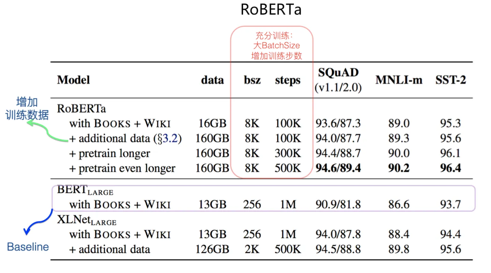
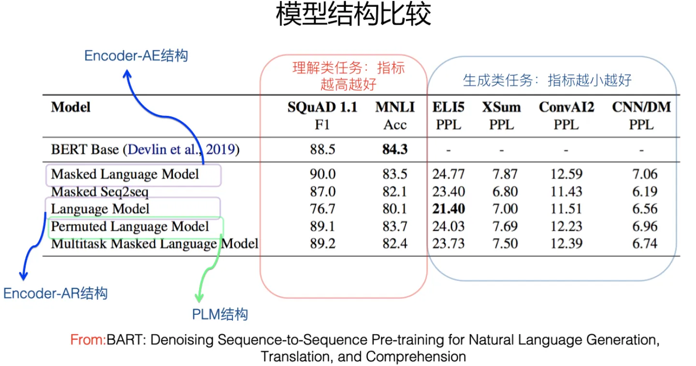
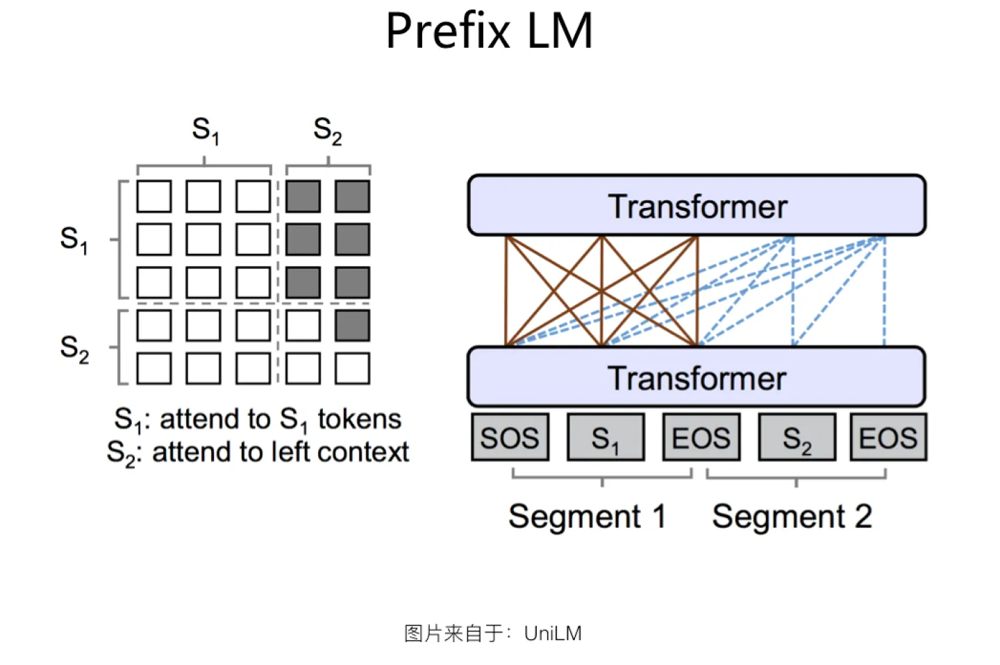
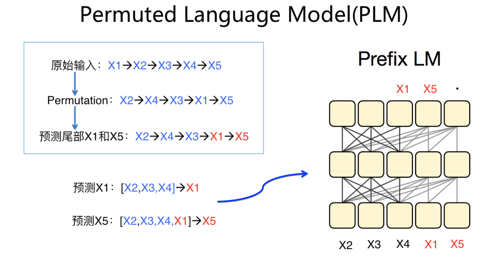
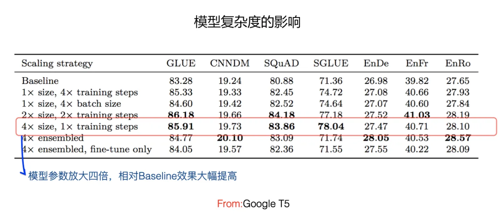
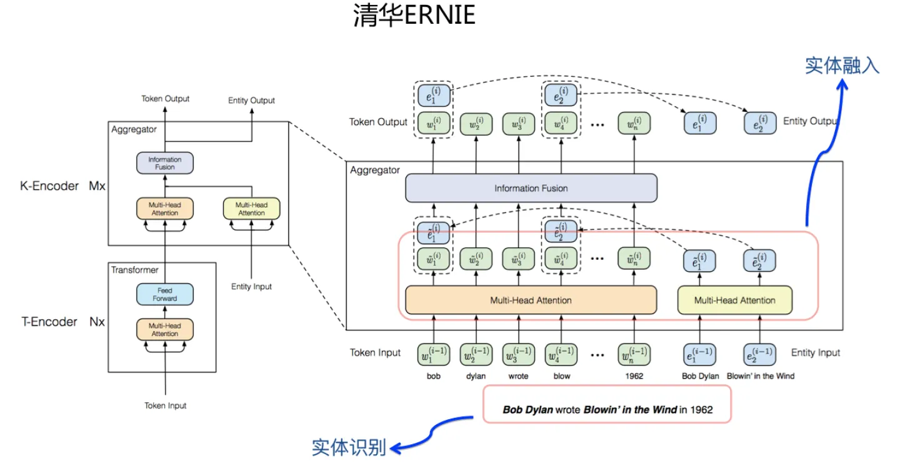
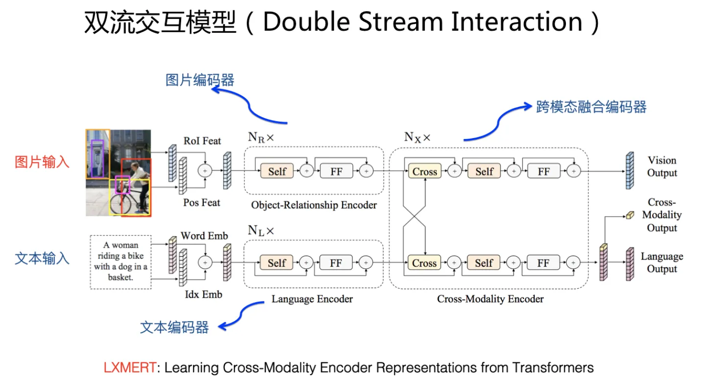
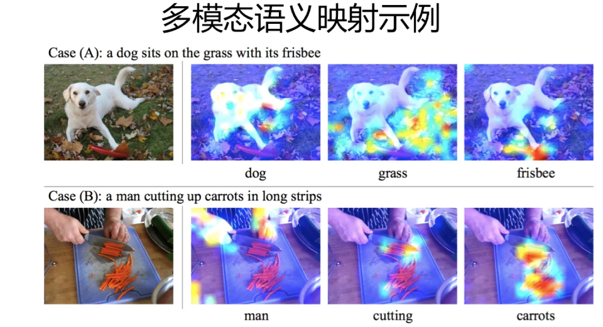
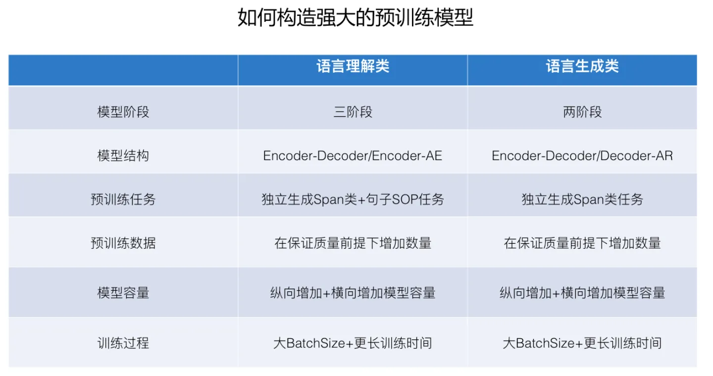

# 乘风破浪的PTM：两年来预训练模型的技术进展

来源：https://zhuanlan.zhihu.com/p/254821426

发布于 2020-09-20 09:01

Bert模型自18年10月推出，到目前为止快两年了。它卜一问世即引起轰动，之后，各种改进版本的预训练模型（Pre-Training Model, PTM）与应用如过江之鲫，层出不穷。Bert及它的继任者们，确实也不负众望，在NLP各个领域攻城略地，所向披靡，多种NLP数据集竞赛榜单，连续多年被各种新出现的预训练模型霸榜，有些榜单，个别模型已经把指标刷到超过人类。

那么，在近两年的时间里，诸多改进模型中，有哪些令人印象深刻的新模型？在那些表现突出的新模型中，是哪些因素导致它们的良好表现？预训练模型技术本身有重大的改动或创新么？或者，关于预训练模型，目前有哪些相对明确的结论？根据目前的技术发展水准，如何根据现有结论，来打造最强的预训练模型？本文通过梳理现有技术文献，试图来回答上述一系列问题。本文的数据都客观有出处，但是对数据的解读，带有严重的个人色彩，偏颇难免，还请谨慎参考。另外，如要透彻理解本文，需要有关于预训练模型的先导基础知识，对这个不太了解的同学，建议先阅读下文打个基础：

我们知道，在预训练模型框架下，解决NLP问题，会划分为序列进行的两阶段：第一阶段是预训练阶段，然后是Fine-tuning阶段，本文集中在预训练阶段。

如果我们一句话宏观地归纳预训练模型要做的事情（参考上图），其实很好理解，就是下面这句话：

在Transformer作为特征抽取器基础上，选定合适的模型结构，通过某种自监督学习任务，逼迫Transformer从大量无标注的自由文本中学习语言知识。这些语言知识以模型参数的方式，存储在Transformer结构中，以供下游任务使用。

我们见到的形形色色的预训练模型，无非就是，实现上述思路的具体做法而已。你可以换个模型结构，可以换个学习任务，也可以换个其它的部件，无非就是各种试，当然，有些做法相对有效，有些做法效果差些。一般而言，通常所说的预训练模型，都是从自由文本中学习语言知识，很明显，我们可以引入新型的知识或数据，比如人类已经挖掘好的结构化知识、多模态数据、多语言数据等，引入这些知识来促进模型理解语言，或者解决特殊类型的任务。

后文会先介绍预训练模型中常见的几种模型结构，并给出目前能得出的结论。然后，我们会找出目前表现比较好的那些预训练模型，并分析它们起作用的主要因素是什么。接下来，会简要介绍几种非自由文本类知识学习的预训练基本方法。

在谈这些之前，我们先从RoBERTa讲起。如果时光倒退半年多，你会发现，这是一个价值被严重低估的模型，其实，它很重要。

## 预训练模型中的强基准：RoBERTa

严格来说，原始的Bert模型是个未完成的半成品，而RoBERTa才是遵循Bert思路的完成品，或者说，Bert是进行时中的RoBERTa，也就是说下列等式成立Bert=RoBERTing。为什么这么说呢？因为，我们可以把RoBERTa看作是得到充分训练的Bert模型，而原始版本的Bert模型训练不够充分，这种模型是否得到充分训练的微小差异，能够极大提升原始版本Bert模型的效果。

在原始Bert模型的基础上，RoBERTa通过实验，证明了如下几点：

1. 进一步增加预训练数据数量，能够改善模型效果；
2. 延长预训练时间或增加预训练步数，能够改善模型效果；
3. 急剧放大预训练的每个Batch的Batch Size，能够明显改善模型效果；
4. 拿掉预训练任务中的Next Sentence Prediction子任务，它不必要存在；
5. 输入文本的动态Masking策略有帮助；

上面列出的五项改进中，第四项和第五项改动，对最终的模型效果影响不大，暂时可忽略。第一点改进增加预训练数据对模型效果有帮助，这个符合直觉。第二项和第三项则涉及到模型是否得到充分训练，本质上这两项相结合，代表了更充分训练的Bert模型。如上面的性能对比图所示，如果以Bert Large作为对比基准，可以发现：仅仅将Batch Size放大，三个数据集上的效果就获得了明显提升，如果再加入新的数据，以及不断增加训练步数，还能持续获得效果的进一步提升。可以看出，RoBERTa效果明显比Bert large好，在相同数据情况下，甚至超过了知名度很高的XLNet。这主要归功于数据规模的增加，以及更充分的训练过程，其中更充分的训练过程发挥的作用更大些。这是为何说RoBERTa 在某种意义上，其实是一个完成版本或者加强版本的Bert模型。

其次，对于一个改进模型来说，理论上都应该引入RoBERTa作为对比Baseline，而改进模型的效果，如果不能具备说服力地超过RoBERTa的话，那么这种改进的有效性，多少是成问题的，除非你强调改进模型的优势不在效果好，而在其它方面，比如更小更快等。

再次，后续的改进预训练模型，从策略角度讲，应该在设计之初，就站在RoBERTa的巨人肩膀上，就是说在增加一定数据量的前提下，增大Batch Size，加长预训练时间，让模型得到充分训练。因为，如果你不这么做，大概率你的效果是很难比过RoBERTa的，而目前我们能够见到的效果很突出的模型，你如果细究，会发现其实都已经引入了RoBERTa的关键要素了，关于这一点，在后面小节我们会做分析。

还有，对于追求落地效果的人来说，比如公司里做业务的同学，建议以RoBERTa为基础模型来做应用。

## 预训练的发动机：模型结构

对于预训练模型来说，目前的主流模型大都采用Transformer作为特征抽取器，现阶段看，Transformer的潜力仍然没有被充分挖掘，还有很大潜力可挖，意思是，Transformer效果足够好，而且还可以更好，貌似改进Transformer并非当务之急的事情。预训练模型的知识，是通过Transformer在训练迭代中从数据中不断学习，并以模型参数的形式编码到模型中的。虽然，大家都是用的Transformer，但是怎么用它搭建模型结构学习效率更高？这是一个问题。所谓学习效率高，就是给定相同大小规模的训练数据，它能编码更多的知识到模型里，这就意味着它的学习效率更高。不同的Transformer用法，会产生不同的模型结构，就会导致不同结构的差异化的学习效率。

本节我们归纳下目前能得到的，关于模型结构的现有研究结论，会介绍常见的五种模型结构。当然，这里用模型结构来表达不足够确切，因为除了模型结构外，一般还包含自监督的学习方法，常见的学习方法包括AutoEncoding(简称AE)和AutoRegressive(简称AR)。AE即我们常说的双向语言模型，而AR则代表从左到右的单向语言模型。

### Encoder-AE结构

Encoder-AE结构如上图所示。这其实是包括原始版本Bert在内的，大多数后续改进模型采取的结构。整个结构就是一个标准的Transformer，在语言模型预训练的时候，采用AE方法。也就是说，**输入句中的未被Mask的任意单词两两可见，但是被Mask掉的单词之间都相互独立，互不可见**。在预测某个被Mask掉的单词的时候，所有其它被Mask的单词都不起作用，但是句内未被Mask掉的所有单词，都可以参与当前单词的预测。可以看出，Encoder-AE是个采用双向语言模型的单Transformer结构。

模型结构比较（From BART）

模型结构比较（From Google T5）

从目前对比实验看（上面两图），除了下文要讲述的Encoder-Decoder结构外，貌似对于语言理解类的NLP任务，这种结构都是效果最好的，但是对于语言生成类的任务，这种结构效果相对很差。也就是说，这种结构比较适合做语言理解类的任务。

### Decoder-AR结构

Decoder-AR结构如上图所示。它和Encoder-AE结构相同，都是采用单个的标准Transformer，主要区别在于：语言模型预训练的时候，采用AR方法，就是从左到右逐个生成单词，第i个单词 Wi 只能看到它之前的第1到第（i-1）个单词 W1….Wi−1 ，不能看到后面的单词。采用这种结构的典型模型就是GPT1、GPT2、GPT3系列了。GPT3在文本生成任务方面的表现，确实是出乎意料地好。当然，这不能仅仅归功于这个结构本身，更复杂的模型和更大量的数据可能是主因。可以看出，Decoder-AR结构是个单向语言模型的单Transformer结构。

从目前对比实验看（参考Encoder-AE小节的两张效果对比图），除了Encoder-Decoder结构外，貌似对于语言生成类的任务，这种结构是效果最好的结构之一。但是相应的，语言理解类的任务，采用这种结构，效果比Encoder-AE结构差距非常明显，这也好理解，因为只看到上文看不到下文，对于很多语言理解类任务而言，信息损失很大，所以效果不好也在情理之中。也就是说，这种结构比较适合做语言生成类的任务。

### Encoder-Decoder结构

既然Encoder-AE比较适合做语言理解类的任务，Encoder-AR比较适合做语言生成类的任务。那么，我们能否结合两者的优势，使得预训练模型既能做好生成类NLP任务，又能做好理解类任务呢？这是个很自然的想法，而Encoder-Decoder结构就是如此将两者结合的。最早明确提出使用Encoder-Decoder结构做通用领域预训练的，应该是微软提出的MASS模型，不过和这里介绍的做法有差异。

Encoder-Decoder结构如上图所示。这种结构在Encoder侧，单独使用一个Transformer，采用了Encoder-AE的结构。也就是说，**编码阶段采用双向语言模型，任意两个单词两两可见，以更充分地编码输入信息**；而在Decoder侧，使用另外一个Transformer，**采用了Decoder-AR结构，从左到右逐个生成单词**。

当然，Decoder侧和标准的Decoder-AR不同的地方还是有的：Decoder侧生成的单词 Wi ，**除了像Decoder-AR结构一样能看到在它之前生成的单词序列 W1….,Wi−1 外，还能看到Encoder侧的所有输入单词** 。而这一般是通过Decoder侧对Encoder侧单词，进行Attention操作方式来实现的，这种Attention一般放在Encoder顶层Transformer Block的输出上。

在进行预训练的时候，Encoder和Decoder会同时对不同Mask部分进行预测：Encoder侧双向语言模型生成被随机Mask掉的部分单词；Decoder侧单向语言模型从左到右生成被Mask掉的一部分连续片断。两个任务联合训练，这样Encoder和Decoder两侧都可以得到比较充分地训练。

模型结构比较（From UniLM v2）

从目前对比实验看，无论是语言理解类的任务（参考Encoder-AE部分Google T5论文中展示的效果对比图），还是语言生成类的任务（参考上面来自于UniLM v2的效果对比），貌似Encoder-Decoder结构相对其它几种结构来说，效果都是最好的之一。而且，它有另外一个优点，就是用这个结构，可以同时做生成类和理解类的NLP任务，基本做到了不同任务在模型结构上的统一，这点还是很好的，一个结构可以到处使用，比较方便。但是，它也有个问题，因为两侧各用了一个Transformer，所以相对其它结构参数量翻倍，计算量也增加了，就是说比其它模型笨重。而且，Encoder-Decoder结构比其它结构效果好，很可能主要原因来自于参数量增加导致的模型容量增大，当然这是个人猜测。目前，采用这个结构的效果很好的模型包括Google T5以及BART等模型。

### Prefix LM

Prefix LM结构是Google T5论文中给出的叫法，这种结构最早由UniLM模型提出，我们沿用Google T5的这种称谓。如果深入分析的话，Prefix LM其实是Encoder-Decoder模型的变体：标准的Encoder-Decoder模型，Encoder和Decoder各自使用一个独立的Transformer；

而**Prefix LM，相当于Encoder和Decoder通过分割的方式，分享了同一个Transformer结构，Encoder部分占用左部，Decoder部分占用右部，这种分割占用是通过在Transformer内部使用Attention Mask来实现的**。与标准Encoder-Decoder类似，Prefix LM在Encoder部分采用AE模式，就是任意两个单词都相互可见，Decoder部分采用AR模式，即待生成的单词可以见到Encoder侧所有单词和Decoder侧已经生成的单词，但是不能看未来尚未产生的单词，就是说是从左到右生成。

目前的一些对比实验证明，在其它条件相同的情况下，关于语言理解类的任务（参考Encoder-AE部分Google T5论文中的相关实验），Prefix LM结构的效果要弱于标准Encoder-Decoder结构。这里是值得深入思考下的，因为看上去Prefix LM和标准的Encoder-Decoder结构是等价的。那么，为什么它的效果比不过Encoder-Decoder结构呢？我想，一方面的原因估计是两者的参数规模差异导致的；另外一方面，可能与它这种模式的Decoder侧对Encoder侧的Attention机制有关。在Decoder侧，Transformer的每层 Block对Encoder做Attention的时候，标准的Encoder-Decoder模式，Attention是建立在Encoder侧的最后输出上，这样可以获得更全面完整的全局整合信息；而Prefix LM这种结构，Decoder侧的每层Transformer对Encoder侧的Attention，是建立在Encoder的对应层上的，因为这种模式的Encoder和Decoder分割了同一个Transformer结构，Attention只能在对应层内的单词之间进行，很难低层跨高层。这可能是影响这种结构效果的原因之一。当然这只是个人猜测，无证据证明，还请谨慎参考。

关于语言生成类的任务，Prefix LM效果虽然要弱于Encoder-Decoder结构（参考Encoder-Decoder小节UniLM v2论文效果对比图），但是总体而言，两者相差不大，相对其它模型，Prefix LM结构在生成类任务表现也比较突出。

Prefix LM因为是Encoder-Decoder的变体，所以可以看出，它的优势也在于可以同时进行语言理解和语言生成类任务，而且相对Encoder-Decoder来说，因为只用了一个Transformer，所以**模型比较轻，这是Prefix LM的优势。缺点则是在效果方面，貌似要弱于Encoder-Decoder模型的效果，语言理解类任务相对有明显差距，生成类任务的效果相差不大**。

### Permuted Language Model(PLM)

PLM最早是在XLNet的论文中提出的，目前有些后续模型也在PLM上进行改进，所以我们把PLM也放在这里一起说一下。对于不熟悉XLNet的同学，可以参考去年XLNet刚出来时候我写的解读文章，补充下基础知识：

[XLNet:运行机制及和Bert的异同比较](https://zhuanlan.zhihu.com/p/70257427)

PLM一样采用单个Transformer模型作为主干结构，但是从训练方法上来说，是个很另类也很有创意的做法，是种“形为AR，实为AE”的做法。在语言模型预训练过程中，它看上去遵循AR从左到右的输入过程，这符合一般生成任务的外在表现形式，但是在内部通过Attention Mask，实际做法其实是AE的做法，无非是把AE的做法隐藏在Transformer内部。它和AE从细节来说，主要有两个区别：首先，预训练过程中，输入句子去掉了Mask标记，改为内部Attention Mask，以保持预训练过程和下游任务Fine-tuning的一致性。关于这一点，目前有实验证明这个虽然有积极影响，但是影响不大（ELECTRA针对预训练过程是否带Mask 标记做了效果对比，带Mask标记的Bert模型GLUE得分82.2，去掉Mask标记利用其它单词代替的对比模型GLUE得分82.4）；其次，也是它和AE的最主要区别，PLM认为被Mask掉的单词之间是相互有影响的，先产生的被Mask掉的单词，应该对后生成的被Mask掉的单词，在预测的时候发生作用，而标准的AE则认为被Mask掉的单词是相互独立的，相互之间不产生作用。

其实，如果你仔细分析下PLM的预训练过程，会发现本质上PLM是Prefix LM的一种变体。上图给出了个例子来说明这种情况，对于某个输入句子，PLM首先会进行单词顺序随机变换，然后选定变换后句子的末尾一部分单词进行Mask，被Mask的单词预测顺序是有序的，按照变换后在句中先后顺序来预测，上面例子中会先预测 x1 ，然后再预测 x5 。在预测 x1 的时候，未被Mask的上下文[ x2 , x3 , x4 ]会对预测 x1 有帮助；假设已经预测并输出了 x1 ，在预测 x5 的时候，未被Mask掉的上下文[ x2 , x3 , x4 ]，以及刚预测出的 x1 ，会对预测 x5 有帮助。其实你想，这等价于什么？等价于以 x4 作为边界切割开的Prefix LM模型，Encoder端包含[ x2 , x3 , x4 ]，Decoder侧包含[ x1 , x5 ]，在预测 x5 的时候，不仅能看到Encoder侧的所有输入，也能看到Decoder侧之前的输出 x1 。当然，因为每个输入句子的长度各异，被Mask掉的单词个数也不固定，所以看上去Encoder和Decoder的边界根据输入句子，边界是在动态变化的。所以，PLM其实是一种边界变化的Prefix LM变体结构。当然，上面纯属个人推理过程，不保证正确性，谨慎参考。

如果不考虑XLNet里的其它因素，单纯看PLM结构的话，目前有些对比实验，貌似PLM在语言理解类任务中，效果不及Encoder-AE（参考UniLM v2论文中的对比实验，未在本文列出，可参考论文）；在语言生成类任务中，效果略微优于Encoder-AE，但是距离Decoder-AR差距较大（参考Encoder-AE描述部分BART的对比实验）。在两类任务中，都有点上不着村，下不着店的感觉，就是都还可以，但都不够好的感觉。XLNet效果确实是很好的，但是，这说明XLNet效果好，真正起作用的貌似不是PLM，而是其它因素。

### 总结

上面内容简述了常见的五种预训练模型结构，如果总结一下的话：

首先，从模型效果来看，**Encoder-Decoder结构无论在语言理解类还是语言生成类任务中，都是效果最好的。当然，效果好的原因很可能在于模型参数多，模型容量大，而不一定是自身结构带来的优势。它的优点一个是效果好，一个是能够将理解和生成任务统一在一个框架下；缺点是参数多计算多，所以模型比较重。采用这个结构的代表模型包括Google T5和BART**。

其次，因为Encoder-Decoder模型比较重，所以，如果从相对轻量结构里进行选择的话，对于语言理解类任务，Encoder-AE结构相对而言效果较好，代表模型很多，典型的比如ALBert、RoBERTa；对于语言生成类任务，Decoder-AR结构和Prefix LM结构相对而言效果较好，都可考虑，Decoder-AR的代表模型是GPT系列，Prefix LM的代表模型是UniLM。语言理解类任务应该用AE任务，语言生成类任务应该用AR任务，这点也很明确了。

谈完了模型结构，下面我们来盘点下表现比较好的预训练模型，并分析下效果好背后的原因。

## 强者的狂欢：为什么有些模型表现这么好

目前Bert的改进模型有很多，有的表现非常突出，有的表现一般。我的主要目的是想找出那些表现好的模型，并分析下，到底是哪些因素导致这些模型效果超群的。

首先，我们需要先找出那些表现特别好的模型出来，我这里说的表现好，主要是从模型效果角度来说的，就是那些在公开数据集上指标比较高的模型。一种比较简单的方法就是：找GLUE、SuperGLUE、SQuAD 2.0这几个大规模NLP数据上，那些打榜模型中排名前列的。你可以看一下，自从Bert出现后，这几个榜单，都长年被预训练模型霸榜，指标在被各种新的预训练模型快速刷高，直到超过人类的水准。一般而言，能够打榜把指标刷到前列的，都是好模型，说明这些模型真的能打（插句闲话，这点其实特别值得推荐领域借鉴，就是有个大规模高难度数据集，供各种模型长年刷榜，这其实是促进领域技术进步很好的手段）。当然，也有一些新模型，可能未必会去打榜，所以作为补充措施，我又从比较新的文献中，找出一些模型，前提是它在文献中报道的效果要比RoBERTa好。这样，我筛出了一批表现优秀的模型，包括：RoBERTa，Google T5，ALBERT，ELECTRA，XLNet，GPT3，BART，UNILM v2, StructBert，MacBert。这些模型要么在某个榜单前几名，要么论文实验结果显示效果非常好，二者占其一。这里面，GPT3是个纯生成模型，ELECTRA相对而言方法比较特殊，在后面我会单独说下它。需要说明的是，ERNIE和NEZHA模型，效果也是非常好的，能够排在某些榜单前列。但是因为它们对应的论文比较早，我猜测现在打榜的模型，估计和原始论文中的做法，已经做了变动，但是具体怎么变的不清楚，所以没有在上面列表中列出。上述表单，应该基本囊括了目前时间（2020年9月）绝大多数效果最好的预训练模型了。

上述模型，都能找到对应的文章，可供仔细分析模型的有效因素。如果你仔细分析上述各个模型的共性，会发现，那些真正有效的因素会慢慢浮出水面。我在这里归纳一下：促进模型性能快速提高的因素，主要包含下列几方面。而且，这几方面的因素是可叠加的，就是说，如果一个模型采纳其中越多的因素，那么这个模型的效果表现可能会更好。

### 高质量、更多数量的预训练数据

首先，更高质量、更多数量的预训练数据。

关于预训练数据对模型效果的影响，Google T5做了大量对比实验，目前的结论，如果归纳一下的话，应该是这样的：在保证预训练数据质量的前提下，数据规模越大模型效果越好。这里需要注意的是，数据规模越大越好，这点其实从Bert一出来，就是一个容易想到的重要因素。因为数据量越多，数据里蕴含的知识也越多，那么模型能学到的东西越多，所以模型效果会更好，这是一个靠简单推理就能得出的结论。但是，它是有前提的，前提是数据质量要高，光数据量大不行，很多乱七八糟的数据，反而会对模型效果带来负面影响。

### 增加模型容量及复杂度

第二，增加模型容量及复杂度。

所谓增加模型容量及复杂度，指的是增加Transformer模型的参数量，一般而言，模型容量越大，模型的表达能力越强。最直接的增加模型容量的方式就是**增加Transformer Block层深**，比如可以从Bert base的12层，增加到Bert Large的24层，还可以继续增加到比如36层，这是纵向增加复杂度，Google T5走的这条路（从上图可以看出，模型容量增加到4倍后，有些数据集效果相对Baseline有大幅度的提升）。除此外，还可以横向增加模型复杂度，比如在**固定Transformer层深的情况下，可以通过放大Transformer中构件的大小**，比如Hidden Size的增大，FFN层对隐层的放大，Multi-Head Self Attention的Attention头的增加，等多种方式来做到这一点。ALBERT走的这条路，它的xxLarge模型效果最好，只用了12层Transformer Block，但是Hidden Size达到了4096。

这两种模式还可以相互结合，就是同时纵向和横向增加模型复杂度，GPT 3即是如此，将模型复杂度这点推到了极致。单词特征的Embedding不会放的太大，一般采用64或者128大小，ALBERT证明了如果单词特征Embedding跟着Transformer内部的Hidden Size同步放大，效果反而会降低。也就是说，增加模型容量指的是放大Transformer模型本身的参数量，但不包括输入层Embedding的参数。

### 更充分地训练模型

第三，更充分地训练模型；

这里所谓的“更充分”，一般指的是放大Batch Size、增加预训练步数，就是RoBERTa做的那两个事情。这块上文有述，这里不再赘述。

### 有难度的预训练任务

第四，有难度的预训练任务；

原始的Bert预训练，有两个训练任务：一个是单词级的Mask语言模型MLM，一个是句子级的下一句预测任务NSP。RoBERTa证明了NSP对于模型效果没什么影响，所以拿掉了这个任务。有很多研究集中在这一块，采取了五花八门的预训练任务（如上图所示）。那么哪些预训练任务相对而言更有效呢？目前已经能够得出些比较明确的结论。

如果归纳一下的话，应该是这样的：**对于单词级的Mask语言模型来说，Span类的预训练任务效果最好。所谓Span类的任务，就是Mask掉的不是一个独立的单词，而是一个连续的单词片断，要求模型正确预测片断内的所有单词**。Span类任务，只是一个统称，它会有一些衍生的变体，比如N-Gram，就是Span模型的一个变体，再比如Mask掉的不是单词而是短语，本质上也是Span类任务的变体，这里我们统称为Span类任务。

目前有相当多的研究证明Span类任务是效果最好的，最近有些工作（微软的ProphetNet和百度的ERNIE-GEN）进一步说明，Span内多个单词独立被生成效果会更好。所谓独立生成，举个例子，假设被Mask掉的片断是： x1 x2 x3 ，之前一般Span类的预训练是顺序生成片断内的单词，就是先生成 x1 ，然后根据上下文及 x1 ，生成 x2 ，这么个顺序，就是说序列生成片断内单词。而独立生成，就是根据上下文，同时生成 x1 ， x2 和 x3 ，被生成的单词之间无影响。所以目前单词级的Mask语言模型，独立生成的Span类任务，应该是目前效果最好的。

对于句子级的任务，NSP任务学习两个句子是否连续句：正例由两个连续句子构成，负例则随机选择一句跟在前一句之后，要求模型预测两者是否连续句子。本质上，NSP在预测两个句子是否表达相近主题，而这个任务，相对MLM来说，过于简单了，导致模型学不到什么知识。ALBERT采用了句子顺序预测SOP（Sentence Order Prediction）：跟NSP一样，两个连续出现的句子作为正例，但是在构造负例的时候，则交换句子正确顺序，要求模型预测两个句子出现顺序是否正确，这样增加任务难度，StructBERT也采取了类似的做法。实验证明SOP是有效的句子级预测任务。

总而言之，目前证明Span类任务是有效的单词级任务，SOP是有效的句子级任务。目前看，预训练任务越有难度，则预训练模型越能高效率地学习知识，所以寻找更新的更有难度的预训练任务是有较大探索空间以及成功可能的。

### 总结

上面列了四个主要因素，那么，还有其它因素么？我的猜测是基本没有了，尽管可能还有一些差异化的改进点是有效的，但它对最终效果的贡献，应该不是特别大，起码不像上述四个因素那么大。上面四个因素，如果进一步要划分重要性的话，估计前三个都很重要，第四个相对而言影响稍小一些。当然，同样地，这是我个人的猜测，谨慎参考。

如果我们根据上述可叠加的有效因素，来分析现有模型，可得出如上图所示列表（具备某因素的模型，对应的格子做了标记）。从上表中，我们可以得出一些结论：

首先，所有这些效果表现突出的模型，都增加了更多的高质量预训练数据。另外，通过增大Batch Size以及增加预训练步数方式，都使得模型得到更充分地训练。也就是说，所有这些表现突出的模型，都是站在RoBERTa模型的肩膀上的。其实，只要你站在RoBERTa肩膀上，效果都不会太差，剩下的问题是能比它好多少的问题。

其次，如果我来冒昧地做个判断的话，貌似对于语言理解类任务来说，估计Google T5和ALBERT是效果最好的预训练模型；而对于语言生成类的任务来说，估计GPT3是效果最好的模型。对于Google T5和ALBERT模型来说，两者都采纳了绝大部分有效因素，主要不同在于预训练任务，Google T5采用了Span类单词级任务，而ALBERT采用了SOP类句子级任务。这三个表现最突出的模型，和其它模型最大的区别，大概率在于它们在增加更多高质量数据的同时，走了大规模提升模型容量的路子。也就是说，在增加数据规模基础上大规模增加模型容量，这应该是拉开不同模型效果最主要的因素。

再次，我们可以据此预测，如果一个模型，采纳了上述所有有效因素，那么可以获得当前技术水准下的最好模型效果，就如上表中最后一行展示的，目前仍未知的Model X那样。就是说，这个模型应该是这样的：在RoBERTa模型基础上，增加更多高质量数据的同时，充分放大模型容量，而预训练任务则是单词类Span任务和句子类SOP任务的结合。当然，估计这里面起到主要作用的还是大量数据+大模型的因素。

这里单独说下ELECTRA，这是一个比较独特的预训练方法(参考上图)。 它形式上采取了类似GAN的模式，但是本质上并非GAN，因为缺乏GAN最关键的生成器和判别器的对抗训练过程。ELECTRA联合训练了小的生成器以及大的判别器，它强迫判别器对生成器产生的所有单词，做个是否经过改写的判断，这无疑增加了模型的学习效率，因为原先的MLM只学习15%的被Mask单词，而ELECTRA对所有单词都要进行判断，并从中学习。ELECTRA论文做了分析，模型的绝大多数收益来自于全部单词参与训练这一步。这意味着，ELECTRA这种所有单词全员参与训练过程的模式，能够在其它条件相同的情况下（模型复杂度，数据量等），使得模型获得更高的学习效率，这个结论和做法还是很有价值的。本质上，ELECTRA这种提升模型效率的方法，和上面所述其它模型的各种做法，是相互互补的。就是说，在ELECTRA的训练模式下，增加训练数据、增加模型规模、模型充分训练，有可能获得更好的模型效果。

## 暴力美学：简单粗暴但有效

前文有述，RoBERTa是个非常强的Baseline，相对目前表现最强的Google T5和ALBERT模型，其实RoBERTa与这两个天花板模型之间，它们之间的性能Gap并不是特别大。其它表现突出的模型，要我猜，性能应该介于RoBERTa这个Baseline和两个天花板模型之间。而所有这些模型之间的主要差异，极有可能是模型容量的大小差异带来的。

从某种角度上看，我们可以认为：RoBERTa可以被看作是经过更充分训练的Bert模型，而ALBERT/Google T5可以理解为进一步增加了模型复杂度的RoBERTa增强版本。从Bert到RoBERTa，再到ALBERT/Google T5，这三类模型，很可能代表了自Bert出现来的最主要技术进展。所以，从模型改进的角度看，自从Bert诞生后近两年，并没有出现特别有效的模型改进方法。尽管从解决NLP任务效果的角度看，新的预训练模型相比Bert有了巨大的提升，但是这些提升，大致可以理解为是因为引入更多高质量数据、采用更多模型参数、模型训练更充分以及增加训练任务难度这几点综合导致的。而其中，在RoBERTa这种充分训练的模型基础上，增加数据，并加上更大的模型，可能在其中起到了主导作用。

由此进一步推理，我们可以得出如下结论：目前预训练模型都采用的Transformer结构，从模型容量或模型复杂度来说是足够复杂的。就是说，Transformer结构本身，目前并非制约预训练模型效果的瓶颈，我们可以仅仅通过增加高质量数据、增加模型复杂度配以更充分地模型训练，就仍然能够极大幅度地提升Bert的性能。

这说明了什么呢？这说明了大数据+大模型的暴力美学，这条粗暴简洁但有效的路子，还远远没有走到尽头，还有很大的潜力可挖。尽管这带来的副作用是：好的预训练模型，训练成本会非常高，这不是每个研究者都能够承受的。但是，我的意见，这其实是个好事情。如果仅仅通过加数据、扩模型就能获得更好的效果，这么简单的方式就能推动模型效果不断上升，推动更多应用获得更好效果，这不是天大的好事么？ 至于由此带来的大模型落地难的问题，我相信可以通过搭配知识蒸馏等把模型做小的方案来获得解决。就是说，很可能预训练模型发展会走出一个哑铃模式：两头大，中间小。两个大头中，一头是越来越大的预训练模型，一头是追求各种技术来实用化地把模型做小，这两端会越来越重要。

如果上述假设成立，即预训练领域的暴力美学依然暴力且美丽，那么从今往后的模型改进，我们应该怎么走呢？我的感觉，应该优先探索大数据+大模型的路，先走到暴力美学的尽头，然后再集中精力探索模型本身的改进。就是说，我们应该先把数据红利吃完，而不是优先发展新型模型，当然两者可以并行做，但是原则上，新型模型优先级不如先把数据红利吃完。为什么这么说呢？因为，目前很多研究表明：大多数改进新模型带来的提升，根本比不过提升数据质量数量的同时扩充模型容量带来的收益。而一些新模型的有效性，在数据量小的时候可能是有效的，但很可能发生的一幕是，当数据增大模型容量加大后，很多改进不再有效。也就是说，目前很多新模型的作用，很可能是增加了特殊类型的语言知识的编码和泛化能力，但是，这是完全可以通过增加数据数量和质量，并加大模型来达成的，这种方式又比较简单直观。所以，这是为何我觉得应该先把精力放到“大数据+大模型” 上，然后再集中精力进行模型改进的主要原因。

## 知识补习班：其它知识的引入

本文开头讲过，大多数预训练模型是从自由文本中学习语言知识。但是，很明显，我们能让模型学的，肯定不止自由文本这一种类型。理论上，任何包含知识的数据，都有些先验知识可供预训练模型学习。我的感觉，预训练模型的发展，会越来越像人脑，日益变成一个黑盒子。就是说，我们可以通过一定手段，喂给它数据，它就会学会其中包含的知识。但是，它是怎么学会的，学到了什么，这很可能对我们来说，会越来越难以理解，就是说，随着预训练模型学习领域的拓展，这个黑盒子，可能会越来越黑。下面我们介绍两个典型的其它领域，看看预训练模型是怎么学的。当然，我相信这种预训练方式，会拓展到越来越多的其它类型的数据或领域，这也是预训练模型领域，一个比较明晰的发展趋势。

### 显示知识的引入

原始Bert的语言学知识，是从大量自由文本中自主学习的，那么很自然的一个问题就是：我们过去已经通过一些技术手段，归纳出大量的结构化知识，比如知识图谱；或者已经建立了很多知识分析工具，比如命名实体识别系统等。那么能否利用这些知识识别工具，抑或已有的结构化知识，让预训练模型能够直接学到这些知识？

目前也有很多工作在做这个事情，就是让预训练模型能够编码更多的结构化知识或者语言知识。至于如何做，有两种典型的思路：一种以百度ERNIE为代表；一种以清华ERNIE为代表。这两个工作是最早做这个事情的，差不多同时出来，但思路不同，正好是两种具备代表性的方案。

百度ERNIE的思路是：在预训练阶段被Mask掉的对象上做文章，我们可以使用比如命名实体识别工具／短语识别工具，将输入中的命名实体或者部分短语Mask掉（参考上图），这些被Mask掉的片断，代表了某种类型的语言学知识，通过这种方式，强迫预训练模型去强化地学习相关知识。

清华ERNIE则是另外一种思路：我们已经有些结构化知识或者实体关系知识等现成的外部知识库，可以在预训练的过程中，通过工具找出句中的命名实体，句中的命名实体可以触发知识库中其它相关实体，然后预训练模型通过特殊的结构，来融合文本和结构化知识，以进一步促进语言的理解（参考上图）。这是另外一种思路。

关于知识的融入，后续还有很多工作，但是大体走的是上面两条路线之一。关于将显示知识或者结构化知识引入预训练模型，我是这么看的，纯属个人意见：

我觉得，假设说我们用来预训练的数据量特别特别大，而且特征抽取器的能力特别强。理论上，结构化知识是蕴含在这些文本内的，因为我们的外部知识库也是通过技术手段从自由文本里挖掘出来的。假设上面两个条件同时能够被满足，理论上，不太需要单独再把结构化知识独立补充给Bert这类预训练模型，预训练模型应该能够直接从自由文本中就学会这些知识。但是，以我们目前的技术条件，上面两个条件完全被满足，还是有一定难度的。于是，在这种约束下，感觉独立强化知识，让Bert在编码的时候更重视这些结构化知识，看上去是有一定补充作用的。我猜测，比较高频出现的知识，已经能够通过常规的语言模型预训练能够捕获了，很可能对于那些偏冷门的知识，引入结构化知识，会对预训练模型做下游任务有直接促进作用。而可以预见的是：随着机器资源能力越来越强大，如果在第一个预训练阶段，不断加大数据数量和质量，不断增加Transformer模型容量，那么，单独补充结构化知识给预训练模型，收益可能会越来越小。当然，以目前的技术发展阶段，感觉这个事情还有空间和潜力可挖掘。当然，上面说的是通用知识，如果手上的外部知识库，领域性很强，通用训练数据中包含的相关领域数据很少，那么，直接把知识引入，对于解决问题还是很有必要的。

### 多模态预训练

随着存储容量越来越大、网络传输速度越来越快、计算速度越来越强，除了传统的文字内容外，图片、视频、音频等各种多模态信息在互联网的内容占比中越来越多。如何融合多种模态信息进行内容理解，就变得越来越重要。那么，能否将多模态信息纳入预训练的框架之内呢？这是个非常有现实价值的问题。

前文有述，自由文本的预训练，本质上是让模型从海量自由文本中，通过语言模型等任务，来学习其中蕴含的的语言学知识。由此自然引发的问题就是：多模态预训练也是要将某种新型的知识塞到模型参数里，那么，这是一种什么样的知识呢？本质上，多模态预训练要学习的知识是两种模态之间，或者多种模态之间，的知识单元映射关系。比如对于文字-图片这两种多模态信息来说，我们可以把图片想像成一种特殊类型的语言，多模态预训练希望让模型学会这两种不同模态之间的语义映射关系，比如能够将单词“苹果”和图片中出现的苹果区域建立起联系。或者说，希望通过将不同模态的信息映射到相同的语义空间，来学会两者之间的语义映射关系。

如果我们能够成功地学会这种不同媒介间的语义映射，那么就可以做很多有意思的事情，比如说句话，搜出与这句话语义相近的图片（参考上图）；或者反过来，输入一个图片，能够找到或者生成对应的文字描述。再比如VQA（参考上图），就是给定一张图片，你可以针对图片提出一些问题，AI系统能够回答你的问题，给出正确答案。这涉及到图片-文字的跨媒体问答以及一些跨媒体的知识推理。而要想实现这种能力，如何通过预训练模型，让模型学会两种模态之间的语义映射关系就是至关重要的。

我们面临的第一个问题是：从什么样的数据里来学习不同模态之间的语义映射关系呢？自由文本的预训练模型，可以采纳海量无标注数据来做，然而，多模态预训练要学习不同模态信息间的语义映射关系，所以需要有标注好的“模态1-模态2”的对齐数据，比如：标注好的“文本-图片”或者“文本-视频”平行数据。只有具备跨模态对齐数据，模型才有可能从中学习不同媒介类型之间的语义映射关系。从这个角度讲，相对自由文本预训练来说，多模态预训练因为需要模态对齐训练数据，而这种数据往往是需要人工标注的，所以可获得的数据难度及成本就高了很多，明显不如文本预训练那么自由。

总体而言，**目前的多模态预训练任务中，通常都是“双模态”预训练，常见的包括“文本-图片”、“文本-视频”、“视频-音频”等模态类型组合**。其中， 相对而言，“文本-图片”类型的任务技术发展比较快，其它类型的多模态类型发展相对缓慢，我猜测这里的主要原因在于可用标注数据的差异。“文本-图片”目前有一些规模达到几十万到上百万规模的标注数据集合，典型的比如MS-COCO、Visual Gnome等，而其它类型的模态组合数据貌似缺乏大规模数据集合，这严重影响了领域技术进展。下面我们从“文本-图片”这种模态组合来宏观介绍下多模态预训练的常规做法，其它模态组合的技术方案差不太多，所缺的可能主要是标注好的模态对齐数据。

我们从模型结构和训练目标这两个角度来阐述。目前的大多数技术方案大同小异，主要差异在于采用了不同的模型结构及与不同训练目标的差异组合。

假设我们有“文本-图片”两种模态数据，需要联合学习三种预训练模型：文本模态自身的预训练模型，图片模态自身的预训练模型，以及两个模态之间的语义对齐预训练模型。从模型结构来说，目前主流的结构有两种：双流交互模型以及单流交互模型。

典型双流交互模型结构如上图LXMERT模型所示。文本编码器代表一个流，一般采用Transformer模型捕捉文本单词之间的关系；图片编码器代表另外一个流，一般也是采用Transformer模型，对于图片来说，一般用Faster-RCNN模型识别出图片中包含的多个物体及其对应的矩形位置信息，将高置信度的物体及其对应的位置信息作为图片侧Transformer的输入，用来学习图片中物品的相互关系；在两个流之上，再加入额外的Transformer模型，用于融合两个模态的语义映射关系。在这种双流结构上，模型同时学习文本预训练目标、图片预训练目标，以及图片-文本对齐预训练目标。一般文本预训练目标和标准的Bert做法类似，通过随机Mask一部分文本单词的语言模型来做；图片预训练目标类似，可以Mask掉图片中包含的部分物品，要求模型正确预测物品类别或者预测物品Embedding编码；为了能够让两个模态语义对齐，一般还要学习一个跨模态目标，常规做法是将对齐语料中的“文本-图片”作为正例，随机选择部分图片或者文本作为负例，来要求模型正确做二分类问题，通过这种方式逼迫模型学习两种模态间的对齐关系。典型的双流模型包括LXMERT、ViLBERT等。

典型的单流交互模型结构如上图Unicoder-VL模型所示。单流和双流的区别在于：**单流模型只用一个Transformer，而双流模型，如上所述，需要三个Transformer各自分工协作**。输入的图片，经过上述的Faster-RCNN物体识别和位置编码后，和文本单词拼接，整体作为Transformer模型的输入。也就是说，单流模型靠单个Transformer，同时学习文本内部单词交互、图片中包含物体之间大的交互，以及文本-图片之间的细粒度语义单元之间的交互信息。单流模型的预训练目标，与双流交互模型是类似的，往往也需要联合学习文本预训练、图片预训练以及对齐预训练三个目标。典型的单流模型包括Unicoder-VL、VisualBERT、VL-VERT、UNITER等。

经过多模态预训练之后，是否模型能够建立起不同模态信息之间的语义映射关系呢？答案可以参考上图：经过预训练后，输入一句话以及对应的图片进入模型，对于文本中的某个单词，我们可以观察这个单词与图片中哪块区域联系密切（根据Attention强度信息可以看出）。从上图示例可以看出，预训练模型确实学会了不同模态单词语义之间的映射关系。

多模态模型经过预训练之后，针对具体的应用任务，可以采取第二阶段Fine-tuning的模式增强应用效果。从上述描述可见，单流模型结构相对简单，模型参数也相对少些，而且能够在模型底层及早对不同模态之间的语义直接建立联系，所以看起来比双流模式更有发展前景，但是从目前的各种研究对比实验结果看，貌似两种方法的效果在伯仲之间。不过，可以得出的结论是，采用预训练模型的多模态方法，比不用预训练的传统方法，在应用效果上是有明显提升的。

目前来看，如果希望多模态预训练有更快速的技术发展，以下几个方面是需要重点关注的：

首先，也是最重要的，可能是**急需构建不同模态间的大规模对齐数据**。目前，“图片-文本”类型的对齐数据规模尚可，但是继续扩大数据规模无疑是有益的；对其它类型的模态组合而言，大规模的标准对齐数据比较缺乏，这会严重制约多模态预训练的发展。所以明显需要数据先行，这是发展技术的前提条件；

其次，感觉在自由文本预训练研究领域中，目前得到的一些得到验证的经验，推理起来，应该是能够直接迁移到多模态预训练领域的。典型的经验，比如：在扩大数据规模的同时，增加模型复杂度。增加模型复杂度包括图片特征抽取器模型复杂度（已经有实验验证加深ResNet模型对效果提升明显），以及增加对应的Transformer层深，放大Transformer的Hidden Size等，相信这是能够大幅提升多模态预训练的首选手段；再比如文本预训练任务中的Mask对象，采用Span方式而非单词方式（已有工作这么做了），加大Batch Size延长训练时间等训练方法优化手段，想来都应该是有益的；从训练目标来说，目前的模态间对齐任务还是有点类似NSP这种句子分类任务，明显偏简单了一些，这块可以考虑引入更有难度的对齐任务，以及实体级别细粒度的对齐任务，来增强模态对齐模型的效果。

再次，可以考虑由目前的两模态向真正的多模态扩展，比如三模态动态联合训练，目前常见的是“文本-图片”，或者“文本-视频”，通常是两模态结构，后面可以考虑“文本-图片-音频”，或者“文本-视频-音频”等三模态甚至更多模态的联合预训练。当然，这么做的前提，仍然是得先有多模态的对齐数据。

## 多多益善：从两阶段模型到四阶段模型

经典的预训练模型框架下，一般我们解决NLP问题有两个阶段：

- 第一阶段是模型预训练阶段，预训练模型从文本等信息中学习语言知识；
- 第二阶段是Fine-tuning阶段，根据手上的有监督数据，对模型参数进行微调，以获得更好的任务效果。

前文有述，预训练阶段的最明显发展趋势是大数据+大模型，在数据质量有保障的前提下，数据量越大，模型容量越大，预训练阶段学到的语言知识效果越好。其实，关于预训练数据，目前还有很多研究，能够得出另外一个结论：从领域、题材、类型等不同角度看，如果预训练数据和手上任务数据越接近，则预训练模型带来的收益就越大。

很多时候，我们手头上的任务数据有很强的领域性，比如可能是计算机领域的，因为预训练数据一般具备通用性，即使大量预训练文本里包含部分计算机类的文本，整体占比也很小。于是，这种情况下，由于领域差异比较大，预训练模型带给手头任务的收益，就没期望中那么大。一种直观的，也是不少人在用的解决方案是：把领域性文本，也加入到预训练数据中，一同参与预训练过程，这样能够增加预训练文本和手上任务的相似性，就能提升任务效果。事实上，这样做也确实能解决这个问题。但是，有一个问题：预训练阶段往往会兼顾模型的通用性，尽可能兼顾各种下游任务，希望模型能在不同领域都有效。而且，从趋势看，数据规模和模型规模会越来越大，也就是训练成本会越来越高。所以，这种把领域数据添加到预训练数据一起训练的做法，一则影响模型通用性，二则实现成本高，看上去就不是特别好的方法。

目前看，要解决这个问题，比较好的方法是把两个阶段分离：第一阶段仍然采取大数据、大模型，走通用普适、各种任务都能受益的路子，不特意考虑领域特点，因为兼顾不过来；第二阶段，在第一阶段训练好的通用预训练模型基础上，利用领域数据，再做一次预训练，等于把通用的预训练模型往领域方向拉动一下。这样两个阶段各司其职，有独立的优化目标，也能兼顾通用性和领域适配性。

上面这个方法，我猜应该不少人都已经在这么做了，论文“Don’t Stop Pretraining: Adapt Language Models to Domains and Tasks”也通过大量实验验证了领域数据预训练（DAPT）的有效性，再结合它得出的另外一个重要结论：用手上的任务数据，无论大小，如果做一次任务级数据预训练（TAPT），也就是拿着手上任务数据，在通用预训练模型基础上，再做一次预训练，也能够有效提升任务效果。综合这个文章和其它有关文章的结论，我们不难看出，要想更好地提升任务效果，我们应该从传统的两阶段模型，拓展到如下四阶段模型（参考上图）：

### 第一个阶段：通用预训练

这就是传统两阶段模式中的第一阶段。这个阶段不仅仅追求效果好，也追求领域通用性。它的优化目标是：在尽可能多的下游任务场景中，效果都尽可能好，但不单独考虑某个特殊领域的效果如何。这个阶段，目前看总的发展趋势是：在数据质量有保证的前提下，增加数据数量，以及数据的多样性，同时提升模型复杂度，这样可以提供普遍有效的模型增强能力。很明显，这个阶段，一般只有土豪公司才能做得起，而且从趋势看，会越来越如此。将来的发展模式可能是，超级土豪公司不断优化这个模型，然后放出来供大家用，有能力做这个事情的人，应该会越来越少。

### 第二个阶段：领域预训练

在第一阶段训练好的通用预训练模型基础上，利用不同领域的自由文本，构建多个、不同领域的领域预训练模型。比如我们可以分别收集计算机领域、生物领域、电商领域…等等，多个不同领域的无标注自由文本数据。在第一阶段通用模型基础上，分别用各个领域数据，再分别做一次预训练，这样我们就得到了适合解决各个不同领域的预训练模型：计算机领域、生物领域、电商领域…..等等多个不同的预训练模型。下游任务可以根据自己任务的领域，选择适配性好的领域预训练模型来使用。

这个阶段的预训练模型，在训练的时候，有个独特的问题需要解决：灾难遗忘问题。所谓“灾难遗忘”，就是说，当你用领域数据进行预训练的时候，因为会调整第一阶段预训练模型的参数，这种偏向领域性的参数调整，可能会导致第一阶段模型学好的参数被改写，这意味着：经过第二阶段预训练，第一阶段预训练模型里学会的很多通用语言知识，可能会被冲掉。灾难遗忘就是这个意思。灾难遗忘问题，对于预训练模型，尤其是领域预训练模型来说，是个很关键也很重要的问题，目前也有一些解决方案，限于篇幅，这里就不展开了。

这个阶段的预训练，因为数据量相比第一阶段会小很多，所以其实中农公司甚至贫农公司也能做得起，不存在土豪门槛，大家应该都能做。当然，一般我们只做跟自己手头任务相关的领域的预训练模型。如果你想做很多领域的预训练模型，那估计也要备足银行卡。估计后续也会有土豪公司做好很多不同领域的预训练模型，供大家个性化适配使用，虽说目前还没有，但是推断起来，这是个大概率会发生的事件。

### 第三个阶段：任务预训练

在前两个预训练模型基础上，比如从第二个阶段里面的多个不同的领域预训练模型中，选择和手头任务适配的那个领域预训练模型，在这个模型基础上，用手头数据，抛掉数据标签，再做一次预训练，无论手上任务数据有多少。比如手上任务是计算机领域的，那么从第二阶段的多个领域模型里面，选择计算机领域适配过的预训练模型，在这个模型基础上进行一次任务级别的预训练。这样应该能明显提升任务效果。

### 第四阶段：任务Fine-tuning

这是传统两阶段的第二阶段，做法一样，没什么好讲的。

当然，如果你手上的任务没有那么强的领域性，可以跳过第二阶段，也就是那个领域预训练模型阶段，走剩余的三阶段模式即可，无论如何，任务预训练都是值得做的一个事情。

## 聚沙成塔：如何建造强大的预训练模型

上文从不同角度或维度，总结了预训练模型某个方面的一些结论，我们综合起来看一下。不论出于什么目的，打榜也好，把手头应用做得更出色也好，如果我们综合各个维度的现有信息，那么，在当前技术水准下，如何构造强大的预训练模型，貌似是可以得出相对明晰结论的。因为NLP里面既有语言理解类任务，也有语言生成类任务，两者差异较大，所以我们分头来看。

### 语言理解类任务

对于语言理解类任务，我假设你的任务不是领域性特别强那种类型的，建议采取如下技术方案：

使用三阶段模型：通用预训练+任务预训练+任务Fine-tuning。在做完第一阶段预训练后，用手头任务数据，抛掉标签，再做一次任务预训练，然后任务Fine-tuning。

模型结构建议采取Encoder+Decoder结构，或者Encoder-AE结构；预训练任务配置两个：独立生成Span类语言模型及SOP句子任务；在质量优先的前提下，增加预训练数据的数量；比较关键的一点是，一定要增加模型容量：可以纵向增加Transformer Block层深，或者横向调大Transformer相应位置可配置参数大小。当然，如果你不差钱，两个可以一起上。另外，要使得模型得到充分训练，就是说增大训练过程中的Batch Size和训练步长。

### 语言生成类任务

对于语言生成类任务，建议采取如下技术方案：

使用两阶段模型：通用预训练+任务Fine-tuning。模型结构建议采取Encoder+Decoder结构，或者Decoder-AR结构；预训练任务采用独立生成Span类语言模型；在质量优先的前提下，增加预训练数据的数量；同样，比较关键的一点是，一定要增加模型容量：可以纵向增加Transformer Block层深，或者横向调大Transformer相应位置可配置参数大小。当然，如果你不差钱，两个可以一起上。另外，也要使得模型得到充分训练，就是说增大训练过程中的Batch Size和训练步长。

相信采取上述技术方案，你能在打榜过程中获得很好的名次，或者在实际工作中能比较快地完成自己的KPI或OKR。当然，如果是走落地应用的路子，关于知识蒸馏等一系列如何将模型做小这方面，记得要多花点功夫。