# 深度学习中Embedding的理解

来源：https://www.cnblogs.com/Renyi-Fan/p/13722485.html#

## 一、总结

一句话总结：Embedding就是把高维的one-hot进行降维的过程。

### 1、Embedding的概念引入？

1）一维列表也不行，二维稀疏矩阵也不行，怎么办呢？这里就引入了Embedding的概念，由密集向量表示，实现降维！

2）“并不是每个单词都会被一个向量来代替，而是被替换为用于查找嵌入矩阵中向量的索引”

3）同时训练神经网络时，每个Embedding向量都会得到更新，即在不断升维和降维的过程中，找到最适合的维度。

### 2、词袋模型和word2vec？

词袋模型基于词的one-hot表示，word2vec基于词的分布式表示

### 3、one-hot、word2vec、embedding关系？

1）由于one-hot编码得到的矩阵太稀疏而且维度太高了，所以可以将one-hot向量作为word2vec的输入，通过word2vec训练低维词向量（word embedding）。

2）或者直接将得到的编码序列通过word2vec转化成固定维度的向量，及得到自己的word embedding。

### 4、词袋模型？

1）将文本看成一系列的词语集合，将集合中所有词语构成一个词典，为每个词语构建索引，那么整个文本就能表示为一个索引集（一系列词的集合）。由于词很多，所以用袋子装起来，就简称为词袋模型了。

2）“基于词袋的词向量表达法像是为每一个文本建立了一个统计直方图，直方图的x轴是单词，y轴是单词在该文本的词频（或者TF-IDF）”。也就是将不定长的文本型数据转化为定长的数值型数据，便于机器学习方法处理。

### 5、词向量模型？

“词向量模型是考虑词语位置关系的一种模型。通过大量语料的训练，将每一个词语映射到高维度（几千、几万维以上）的向量当中，通过求余弦的方式，可以判断两个词语之间的关系。” 这个高维的向量就是词向量，现在常用word2vec构成词向量模型。

## 二、深度学习中Embedding的理解

转自或参考：[深度学习中Embedding的理解](https://www.cnblogs.com/lyeeer/p/10310135.html)

在自然语言处理领域，由于计算机并不直接处理文本，需要将其先转化成易于计算的特征向量。这里就需要用到文本特征表示模型，主要有两大类：直接从原始文本生成文本向量（LDA）；先从文本中获取字向量，然后在字向量的基础上得到文本向量（词袋模型基于词的one-hot表示，word2vec基于词的分布式表示）。

语言模型：通过上下文的词，计算某个词出现的概率的模型。其实就是一个多分类器

文本特征表示模型：将原始文本中的词、词组和句子转化为易于计算的特征向量，常用的有词袋模型、LDA模型、概率神经网络模型等。其中实际应用较多的是词袋模型，学术研究中用的较多的是深度神经网络模型。

词向量表示方法：One-hot表示和分布式表示（即用一个词附近的其他词来表示该词）

**词袋模型**：

将文本看成一系列的词语集合，将集合中所有词语构成一个词典，为每个词语构建索引，那么整个文本就能表示为一个索引集（一系列词的集合）。由于词很多，所以用袋子装起来，就简称为词袋模型了。

“基于词袋的词向量表达法像是为每一个文本建立了一个统计直方图，直方图的x轴是单词，y轴是单词在该文本的词频（或者TF-IDF）”。也就是将不定长的文本型数据转化为定长的数值型数据，便于机器学习方法处理。

**词向量模型**：

“词向量模型是考虑词语位置关系的一种模型。通过大量语料的训练，将每一个词语映射到高维度（几千、几万维以上）的向量当中，通过求余弦的方式，可以判断两个词语之间的关系。” 这个高维的向量就是词向量，现在常用word2vec构成词向量模型。

**word2vec**：

是一个计算词嵌入/词向量（word embedding）的工具，包含两种训练模型：CBOW模型根据中心词w(t)周围的词如w(t-2)&w(t-1)&w(t+1)&w(t+2)来预测中心词w(t)；Skip-gram模型则根据中心词W(t)来预测周围词。

由于one-hot编码得到的矩阵太稀疏而且维度太高了，所以可以将one-hot向量作为word2vec的输入，通过word2vec训练低维词向量（word embedding）。或者直接将得到的编码序列通过word2vec转化成固定维度的向量，及得到自己的word embedding。

**TF-IDF**：

词频(词的出现频率)-逆文档频率(衡量词的常见程度，如果是'的'/'了'这种没有实际意义的词，可以设置一个小的权重)，分母+1是避免分母为0。TF-IDF=TF*IDF

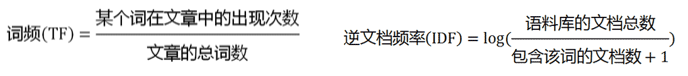

但是还是没有表现出词的位置信息以及相互关系。

**N-gram模型**：

为了保持词的顺序，所以类似于滑窗操作。N表示滑窗的大小，比如如果为2-gram，那么两个词当成一组，如我爱吃火锅可以构造的词典为{"我爱":1,"爱吃":2,"吃火锅":3}

## 三、one-hot（独热）编码

在机器学习算法中，会遇到很多分类的特征，比如颜色中的红橙黄绿、国籍、性别等，这些特征值都是离散的，但是要用算法实现的话，要对这些特征进行特征数字化处理。

也就是对这些特征进行数字化编码，比如把颜色中的红橙黄绿对应为[0,1,2,3]，但是这样也存在不合理性，1+2=3，也就是橙+黄变成绿，每个特征值又没有数值叠加的特点，在逻辑上显然是说不通的。

one-hot编码，通过查阅资料，给出的定义是又称为一位有效编码，主要是采用N位状态寄存器来对N个状态进行编码，每个状态都是由其独立的寄存器位，并且在任意时候只有一位有效。是分类变量作为二进制向量的表示，首先要求将分类值映射到整数值，然后每个整数值被表示为二进制向量，除了整数的索引外，都是0。

在特征提取上属于词袋模型

举个例子，

```
#今天也要加油鸭
[
[1 0 0 0 0 0 0]
[0 1 0 0 0 0 0]
[0 0 1 0 0 0 0]
[0 0 0 1 0 0 0]
[0 0 0 0 1 0 0]
[0 0 0 0 0 1 0]
[0 0 0 0 0 0 1]
]
```

那么，每一个字都被表示为一个包含七个元素的数组，每个字都与列表中的唯一一个数组对应，构成了一个稀疏矩阵。

如果将其表示为列表的形式：

```
#今天也要加油鸭
[0 1 2 3 4 5 6]
```

one-hot编码形成稀疏矩阵显然更便于计算与理解。而且解决了能分开词，这个最基本的问题。

缺点：

1）但是如果当这个文本数量变大，不是一句话，而是一本长篇小说，那需要表示成为一个...无法想象的矩阵，那这样的矩阵会过于稀疏，过度占用资源！

2）并且one-hot矩阵没有办法表示词的顺序关系，无法表示上下文。

## 四、Embedding层的作用

一维列表也不行，二维稀疏矩阵也不行，怎么办呢？

这里就引入了Embedding的概念，由密集向量表示，实现降维！也就是说Embedding就是把高维的one-hot进行降维的过程。

“并不是每个单词都会被一个向量来代替，而是被替换为用于查找嵌入矩阵中向量的索引”

同时训练神经网络时，每个Embedding向量都会得到更新，即在不断升维和降维的过程中，找到最适合的维度。

---

https://juejin.im/entry/5acc23f26fb9a028d1416bb3

https://blog.csdn.net/weixin_42078618/article/details/82999906

https://blog.csdn.net/kl1411/article/details/82981955

https://blog.csdn.net/program_developer/article/details/80852710

https://blog.csdn.net/u010412858/article/details/77848878

https://spaces.ac.cn/archives/4122

# Sentence embedding

https://blog.csdn.net/weixin_42894555/article/details/106886262

https://jiayuanyang.com/2021/04/17/Sentence-Embedding/

## 词向量（Word Embedding）

词向量（Word embedding），又叫Word嵌入式自然语言处理（NLP）中的一组语言建模和特征学习技术的统称，其中来自词汇表的**单词或短语被映射到实数的向量**。
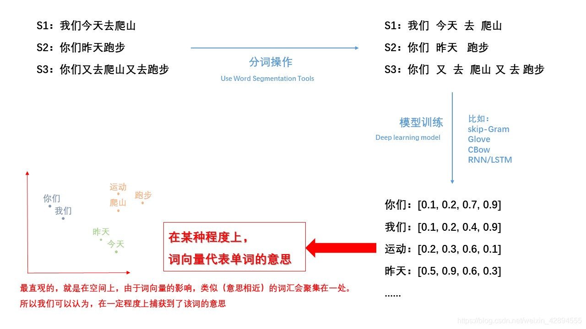

【说明：上面是二维空间上的呈现形式】

------

## 句向量（Sentence Embedding）


如果需要判断句子与句子之间的相似度，仅使用上述的词向量方法显然是不行的，所以如何获得句向量也是十分重要。句向量代表了整句话的语义信息，可以帮助机器理解上下文，意图及其它重要信息。

获得句向量的方法可以归为**加权平均法**和**模型法**两大类，下面分别给出这两大类中的具体方法：

## 加权平均法

加权平均法用了一种比较朴素的思想，利用句子中每个词的词向量加权来求得句向量，下面给出具体的方法：

### 累加求平均

直接对句子中每个词的词向量累加后求平均作为句向量。

Averging法则

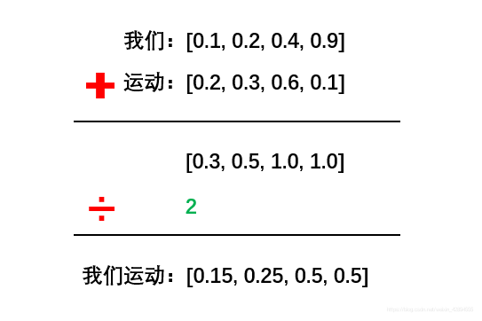

### TF-IDF 加权求平均

利用TF-IDF值对句子中每个词的词向量进行加权后求平均。

### 幂均值（Power Mean）加权平均

幂均值加权平均的全称为 Concatenated Power Mean Word Embeddings，即级联的幂均值词向量方法，其论文链接在参考[[1\]](https://jiayuanyang.com/2021/04/17/Sentence-Embedding/#Reference)中给出，该方法的核心是**幂均值**和**级联**。

**幂均值：**


上式中，n 为句子中词的个数，x 为词向量。当 p=1 时，上式即为简单的加权平均法，当 p=+∞ 时，相当于取每个词向量各维度的最大值，当 p=−∞ 时，相当于取每个词向量各维度的最小值。

**级联：**

考虑到不同的预训练词向量能够学习到不同的信息，论文中使用了四种不同的词向量：GloVe, Word2Vec, Attract-Repel 和 MorphSpecialized。为了能够利用不同的信息，该方法对这四种词向量进行了拼接，如下所示：


论文中最后构造的词向量维度是 4∗3∗300=3600，其中4表示使用四种不同的词向量，3表示 p 取值为 {−∞,1,+∞}.

### SIF（smooth inverse frequency）加权平均

SIF 【[论文](https://openreview.net/pdf?id=SyK00v5xx)和[代码](https://github.com/PrincetonML/SIF)】是一种简单且效果很好的获取句向量的加权方法，其在语义文本相似性任务上的表现甚至超过深度学习技术，比如 InferSent等。但是，在分类任务方面，SIF稍微落后于其它深度学习模型。这可能是因为加权平均的方法并不能提供足够复杂的表示来解决诸如情感分析之类的任务。(参考[[2\]](https://jiayuanyang.com/2021/04/17/Sentence-Embedding/#Reference)).

SIF 加权平均法的计算步骤如下所示：

1. 计算语料库中所有词的词频；
2. 给定超参数 a，通常取值为 1e−3∼1e−3，计算词向量的权重：a/(a+p(w))，其中 p(w) 为词频；
3. 使用SVD计算句向量矩阵的第一主成分 u，让每个句向量减去它在 u （单位向量）上的矢量投影[**移除所有句子的共有信息，因此保留下来的句子向量更能够表示其本身与其它句子向量之间的距离**]。


## 模型法

模型法主要是利用深度网络模型来获得句向量，可以分为无监督、有监督和多任务三大类(参考[[3\]](https://jiayuanyang.com/2021/04/17/Sentence-Embedding/#Reference))。

### 无监督模型法

#### Skip-Thought Vectors

Skip-Thought Vectors【[论文](https://arxiv.org/abs/1506.06726)】与 word2vec 中 skip-gram 的训练思想类似，通过一句话来预测其上一句话和下一句话。该模型是典型的 encoder-decoder 结构（GRU-RNN），只不过其有两个decoder，具体网络结构如下所示：

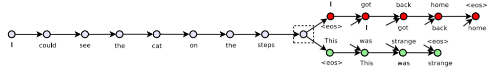

#### Quick-Thought Vectors

Quick-Thoughts【[论文](https://arxiv.org/abs/1803.02893)】模型是对 Skip-Thoughts 的优化，其主要优点在于训练速度的提升。Skip-Thoughts 网络结构实质上是生成模型，而且需要训练3个循环神经网络。Quick-Thoughts 则**将整个过程当作分类任务**来处理，具体网络结构如下所示：

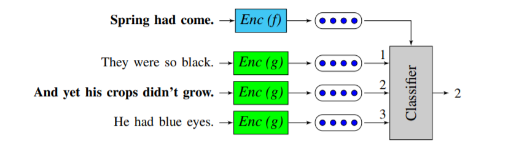

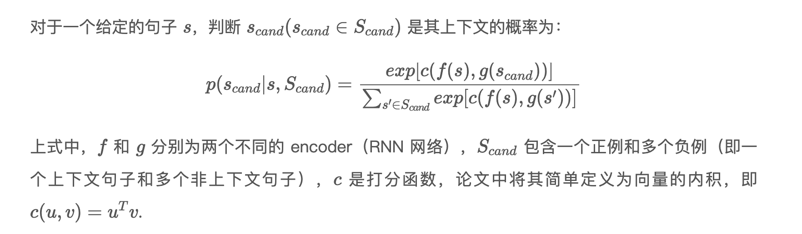

从上文求条件概率的等式中可以看出，该任务的目标函数是希望句子 s 和其上下文句子的向量内积越大越好，反之则越小越好。Quick-Thoughts 训练完成之后，对于下游任务中的任一句子 s，通过拼接 f(s) 和 g(s) 计算得出的向量来得到 s 对应的句向量。

#### Doc2vec 模型

Doc2vec【[论文](https://arxiv.org/abs/1405.4053)】是将 word2vec 的概念扩展到句子，段落或整个文章所形成的嵌入模型，借鉴 word2vec 中 CBOW 和 Skip-gram 的思想，其有两种添加句向量到模型中的方法。

**PV-DM(Distributed Memory version of Paragraph Vector)**
该方法与 CBOW 类似，通过上下文预测下一个词。但其在输入层额外添加了该上下文所对应的句向量，具体的网络结构如下所示：

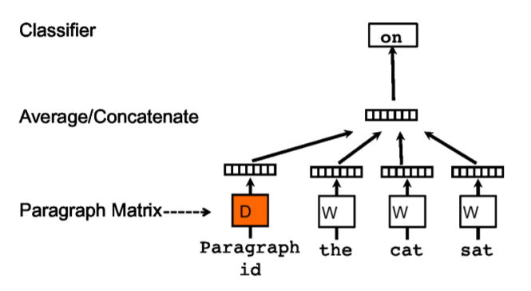

训练结束后，对于现有的文档，可以直接通过网络训练后得到的句向量矩阵查询。而对于一篇新的文档，需要重新将其输入到网络中进行训练，但该过程会冻结模型里的词向量矩阵以及投影层到输出层的权重参数，只需要更新句向量，所以该过程会很快收敛。

**PV-DOBW( Distributed Bag of Words version of Paragraph Vector)**

该方法与 Skip-gram 类似，通过文档来预测文档内的词。训练时随机从预测文档内采样一些文本片段，然后再从这个片段中采样一个词作为 label，模型借助这一分类任务来训练句向量，具体的网络结构如下所示：

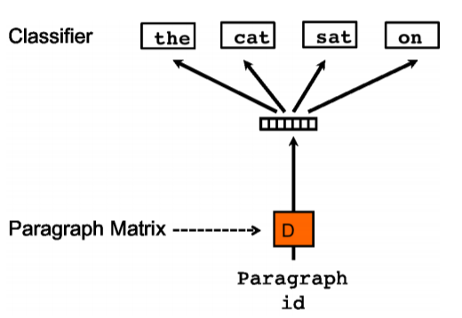

### 有监督模型法

#### Deep Averaging Networks (DAN)

DAN 模型【[论文](https://www.aclweb.org/anthology/P15-1162/)】的实现方式比较简单和直观，首先将句子中的词向量求平均作为网络的输入嵌入表示，随后使该平均向量经过一个或多个前馈层，最后经过 softmax 层来完成相应的分类任务，具体的网络结构如下所示：


#### Self-attentive Sentence Embedding

该模型【[论文](https://arxiv.org/abs/1703.03130)】通过引入 self-attention 机制来得到句向量，之前介绍的方法获得的词向量都是一维的向量表示，而该方法得到的句嵌入是二维的矩阵表示，矩阵的每一行表示对句子不同部分的**注意**，其网络结构如下所示：


#### InferSent

InferSent【[论文](https://arxiv.org/abs/1705.02364)】是由 Facebook AI Research 提出的一种句嵌入方法，该方法通过训练 Natural Language Inference(NLI) 模型的方式来间接获取句向量，其通用的训练结构如下所示：

上图中 u 和 v 权值共享， u 和 v 也是我们最终需要获得的句向量。这个框架最底层的 **sentence encoder** 便是最终要获取的句向量提取器。

在训练过程中，**premise** 和 **hypothesis** 的句子嵌入以及它们按元素乘积和按元素求差的结果被级联在一起，拼接后的**混合语义特征向量**被送入多个全连接层，最后以3分类的softmax层（类别为entailment 蕴含，contradiction 矛盾，neutral中立）结束。

读到这里，细心的你应该会发现还有一个重要的问题没有解决，那就是 **sentence encoder** 的结构还没有确定。论文作者对比了7种不同的 **sentence encoder**，主要包括 RNN 与 CNN，其中 RNN 包括取 LSTM/GRU 最后一个隐状态，Bi-GRU/Bi-LSTM 的 mean/max pooling 以及 self-attention，其中取得最优效果的是 **Bi-LSTM + max pooling**，下面给出其具体结构：

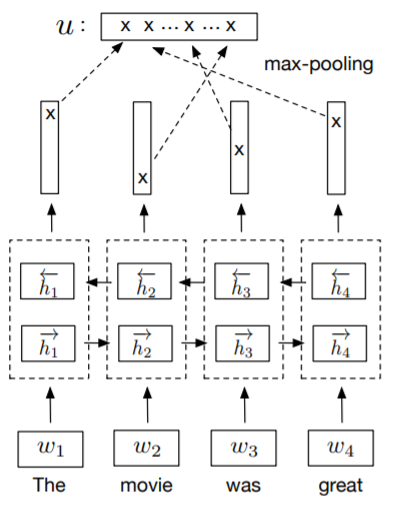
由上图可知，**sentence encoder** 最终生成的句嵌入是通过将两个 LSTM 网络的输出向量进行级联，随后在每个维度取最大值的方式获得。

#### Sentence-BERT

Sentence-BERT 这篇【[论文](https://arxiv.org/abs/1908.10084)】指出 Bert 在处理判断句子之间的相似度问题时所消耗的时间非常巨大（论文中给了一个小例子来阐述），这个问题的产生主要是受限于 Bert 的结构。但直接用 Bert 的输出作为句向量的效果比加权平均的 GloVe 还要差。基于上述问题，论文的作者提出了 Sentence-BERT 方法来获得效果较好的句向量。

SBERT 是在 **siamese/triplet** 网络结构上对 BERT 的微调，个人觉得其网络结构和 InferSent 的网络结构几乎没有太大的差异，文中 siamese 网络的具体结构如下图所示：

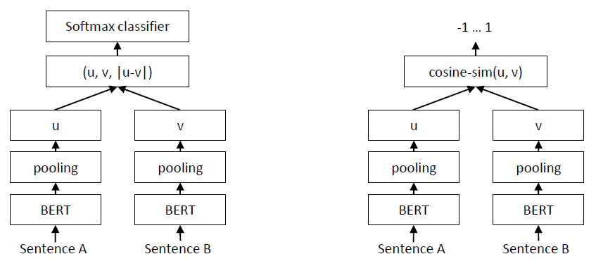

从上图中可以看出，SBERT 和 InferSent 的主要不同点在于 **sentence encoder** 部分，SBERT 是使用 BERT 网络结构作为其**sentence encoder** 部分。下表给出其具体的池化策略和级联方式：

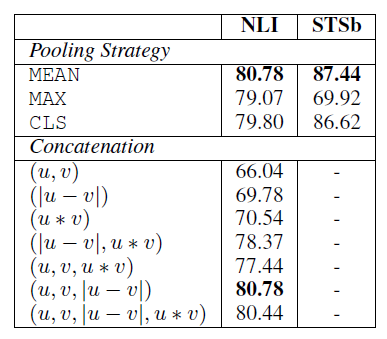

### 多任务学习模型法

#### Universal Sentence Encoder

Universal Sentence Encoder【[论文](https://arxiv.org/abs/1803.11175)】是Google 于 2018 年初发布的通用句子编码器，其主要思想是在**多个任务**上对句子编码器在有监督和无监督的语料库（无监督训练数据包括问答(QA)、维基百科和网页新闻等，有监督训练数据为 SNLI）上进行训练，且编码器参数共享，从而学习出一个通用的句子编码器，这样通用句子编码器生成的句向量便可以应用到不同的 NLP 任务中，比如文本相似性判断，聚类和文本分类等。其具体网络结构如下图所示：


基于准确性和训练速度的折中，文中分别给出了 transformer 和 DAN 两种编码器结构。transformer 编码器有着更好的准确性，对于长句子来说内存开销和计算资源消耗都比较严重，导致计算时间显著增加，但对于短句子来说其计算速度还在可以接受的范围。DAN 编码器相比 transformer 准确性略有降低，但其计算速度快且资源消耗少。

Universal Sentence Encoder 的任务具体介绍以及各任务网络实现的细节可以参考[[6\]](https://jiayuanyang.com/2021/04/17/Sentence-Embedding/#Reference)，这篇文章用可视化的方法详细介绍了Universal Sentence Encoder，通俗易懂，是很不错的学习资料。

# Reference

[[1\]. Concatenated Power Mean Word Embeddingsas Universal Cross-Lingual Sentence Representations](https://arxiv.org/abs/1803.01400)
[[2\]. How deep does your Sentence Embedding model need to be ?](https://medium.com/data-from-the-trenches/how-deep-does-your-sentence-embedding-model-need-to-be-cdffa191cb53)
[[3\]. 关于句子表征的学习笔记](https://zhuanlan.zhihu.com/p/85739175)
[[4\]. From Word Embeddings to Sentence Embeddings — Part 2/3](https://medium.datadriveninvestor.com/from-word-embeddings-to-sentence-embeddings-part-2-3-21a5b03592a1)
[[5\]. Top 4 Sentence Embedding Techniques using Python!](https://www.analyticsvidhya.com/blog/2020/08/top-4-sentence-embedding-techniques-using-python/)
[[6\]. Universal Sentence Encoder Visually Explained](https://amitness.com/2020/06/universal-sentence-encoder/)