# 通俗易懂的讲解下LLM attention时间复杂度是n^2 d，ffn是nd^2

### 一、先搞懂2个核心字母的含义（必看，不然全白搭）
我们所有的复杂度，都围绕两个大模型的核心参数：
- **n**：序列长度，就是输入给大模型的token个数（比如一句话有10个词/字，n=10；长文本场景n可以到几千、几万）。
- **d**：每个token的向量维度（隐藏层维度），就是大模型把每个token转换成的数字向量的长度。比如7B大模型常用d=4096，即每个token用4096个数字来表示。

补充：这里的时间复杂度，指的是**浮点运算次数（FLOPs）的量级**，我们只看增长最快的核心瓶颈项，常数倍、低次项可以直接忽略（大模型里n和d都是大数，低次项完全不影响性能瓶颈）。

---

### 二、为什么Attention的时间复杂度是 O(n²d)
我们以最核心的**自注意力（Self-Attention）**为例，先讲本质，再拆计算逻辑。

#### 核心本质
Attention的核心是**让每个token和序列里所有的token做一次全局交互，计算相似度（注意力分数）**，这是它能理解上下文的核心，但也带来了平方级的计算量。

#### 大白话拆解计算步骤&复杂度
标准缩放点积注意力的核心4步，我们只看影响量级的关键环节：
1. **生成Q/K/V三个矩阵**
   输入是n个token、每个d维，形状为`n×d`。我们给它乘3个权重矩阵，分别生成查询Q、键K、值V，三个矩阵的形状都是`n×d`。
   这一步的计算量是`3×n×d²`，量级为`nd²`，但不是核心瓶颈。

2. **计算注意力分数（核心瓶颈项）**
   要算每个token和所有token的相似度，就是拿Q和K做点积。Q是`n×d`，K转置后是`d×n`，两个矩阵相乘，得到`n×n`的注意力分数矩阵。
   最通俗的计算逻辑：
   - 总共有`n×n`个分数（n个token，每个都要和n个token算1次分）
   - 每算1个分数，要做`d`次乘法（两个d维向量的点积）
   - 这一步总运算量 = `n × n × d = n²d`，这就是复杂度的核心来源！

3. **Softmax归一化**
   对`n×n`的分数矩阵做归一化，计算量仅为`n²`，和`n²d`比可以直接忽略，不影响量级。

4. **注意力权重乘V矩阵**
   用归一化后的`n×n`注意力权重，乘以`n×d`的V矩阵，得到最终输出。
   这一步的矩阵乘法是`n×n × n×d`，运算量又是`n²d`。

#### 最终复杂度结论
把所有步骤加起来，总运算量是 `2×n²d + 3×nd²`。
我们说Attention复杂度是`O(n²d)`，是因为**当序列长度n变长时，n²d的增长速度会远远超过nd²**，是整个模块的性能瓶颈。
补充：多头注意力不会改变这个量级——把d分成h个头，每个头的计算量是`n²×(d/h)`，h个头加起来还是`n²d`。

---

### 三、为什么FFN的时间复杂度是 O(nd²)
FFN是Transformer里的**前馈神经网络**，和Attention完全相反，它的核心是**每个token单独处理，token之间没有任何交互**。

#### 标准FFN的结构
Transformer里的FFN固定为两层线性层+激活函数，行业通用设计是：
`FFN(x) = 线性层2( GELU激活( 线性层1(x) ) )`
- 线性层1：把每个token的d维向量，映射到4d维（4倍是通用设计，常数倍不影响量级）
- 线性层2：把4d维的向量，再映射回d维，和输入维度对齐

#### 大白话拆解计算&复杂度
输入还是`n×d`的矩阵（n个token，每个d维）：
1. **第一层线性层**：输入`n×d`，权重矩阵形状`d×4d`，矩阵乘法运算量 = `n × d × 4d = 4nd²`
2. **GELU激活**：对每个元素单独计算，运算量仅为`n×4d`，和`nd²`比可以直接忽略
3. **第二层线性层**：输入`n×4d`，权重矩阵形状`4d×d`，矩阵乘法运算量 = `n × 4d × d = 4nd²`

#### 最终复杂度结论
总运算量是`8nd²`，核心项是`nd²`，所以复杂度是`O(nd²)`。
本质原因：每个token独立计算，总运算量和token数量n是**线性关系**（n翻倍，运算量只翻倍）；而瓶颈来自模型维度d的平方（d翻倍，运算量翻4倍）。

---

### 四、一句话总结核心区别&直观例子
#### 核心区别
- Attention：**token全局两两交互**，计算量和序列长度n是平方关系，长文本下直接爆炸，是大模型长文本推理的核心瓶颈。
- FFN：**token独立映射**，计算量和序列长度n是线性关系，瓶颈来自模型维度d的平方，短序列下通常更费算力。

#### 直观数字例子（d=4096，7B模型常用维度）
| 序列长度n | Attention核心项n²d | FFN核心项nd² |
|-----------|---------------------|---------------|
| 2048（短文本） | ~172亿次运算 | ~344亿次运算 |
| 8192（长文本） | ~2748亿次运算 | ~1374亿次运算 |
| 16384（超长文本） | ~1.09万亿次运算 | ~2748亿次运算 |

可以清晰看到：短序列下FFN更费算力，一旦n变长，Attention的计算量会呈平方级暴涨，迅速成为绝对瓶颈。

# 大模型prefill和decode阶段复杂度分析

### 前置符号定义（行业通用标准）

- B：批次大小（batch size）
- L：序列长度（Prefill 阶段为 Prompt 总长度；Decode 单步为当前已生成的总序列长度，单步输入 token 长度为 1）
- \(d_{model}\)：模型隐藏层维度（词嵌入维度）
- \(n_{head}\)：注意力头数，单头维度 \(d_k = d_{model} / n_{head}\)
- \(d_{ff}\)：FFN 中间层维度，主流 LLM 实现为 \(4d_{model}\)
- 以下分析均为**单层 Transformer**的复杂度，整体模型只需乘以层数\(n_{layer}\)，不改变复杂度阶数；默认 Decode 阶段启用行业通用的 KV Cache 优化。

------

## 一、FFN（前馈网络）复杂度

FFN 为 token-wise 独立计算，每个 token 的计算完全并行，两阶段核心差异仅在于输入序列长度。

标准结构：\(FFN(x) = Linear_2(Activation(Linear_1(x)))\)，

其中\(Linear_1: d_{model} \to d_{ff}\)，\(Linear_2: d_{ff} \to d_{model}\)。

### 1. Prefill（预填充）阶段

- **时间复杂度**：\(O(BLd_{model}^2)\)
- 总 FLOPs 为\(4BLd_{model}d_{ff}\)，代入\(d_{ff}=4d_{model}\)得\(16BLd_{model}^2\)，与序列长度L呈线性关系。
- **空间复杂度**：
  - 权重参数：\(O(d_{model}^2)\)（与序列长度无关，两阶段一致）
  - 激活值显存：\(O(BLd_{model})\)（输入张量 + 中间激活张量，随序列长度线性增长）

### 2. Decode（单步解码）阶段

- **时间复杂度**：\(O(Bd_{model}^2)\)

  单步仅输入 1 个 token，总 FLOPs 为\(16Bd_{model}^2\)，与序列长度无关，为常数级计算量。

- **空间复杂度**：

  - 权重参数：同 Prefill，\(O(d_{model}^2)\)
  - 激活值显存：\(O(Bd_{model})\)，常数级占用。

------

## 二、Attention（多头自注意力）复杂度

两阶段的核心差异来自 KV Cache 的复用，是 LLM 推理性能瓶颈的核心来源。

标准核心公式：\(Attention(Q,K,V) = softmax(\frac{QK^T}{\sqrt{d_k}})V\)

### 1. Prefill（预填充）阶段

该阶段一次性处理完整 Prompt，\(L_q=L_k=L_v=L\)，无历史 KV 缓存，需完整计算全序列的 Q、K、V 和注意力矩阵。

- **时间复杂度**：长序列下主导项为\(O(BL^2d_{model})\)

  总 FLOPs 为\(8BLd_{model}^2 + 4BL^2d_{model}\)，其中\(4BL^2d_{model}\)为两次核心矩阵乘的计算量，与序列长度呈平方级增长，是 Prefill 阶段的计算瓶颈。

- **空间复杂度**：

  - 权重参数：QKV 投影 + 输出投影共 4 个线性层，\(O(d_{model}^2)\)（两阶段一致）
  - 激活值与中间张量：朴素实现下，长序列主导项为\(O(BL^2)\)（全量注意力分数矩阵），叠加\(O(BLd_{model})\)的 Q/K/V 张量；FlashAttention 可将\(O(L^2)\)项优化至\(O(BLd_{model})\)。

### 2. Decode（单步解码）阶段

该阶段每步仅输入 1 个新 token，\(L_q=1\)，复用历史 KV 缓存，\(L_k=L_v=L\)（当前总序列长度），无需重算历史 K/V，仅计算当前 token 的 Q、K、V 并追加到缓存。

- **时间复杂度**：主导项为\(O(BLd_{model})\)

  总 FLOPs 为\(8Bd_{model}^2 + 4BLd_{model}\)，无平方项，与序列长度呈线性增长，计算量远小于同长度下的 Prefill 阶段。

- **空间复杂度**：主导项为\(O(BLd_{model})\)

  核心开销来自 KV 缓存（每层需保存完整的 K、V 序列），随生成序列长度线性增长，是 Decode 阶段的显存瓶颈；其余激活张量均为\(O(Bd_{model})\)常数级占用。

------

## 核心复杂度汇总表

|   模块    |  阶段   | 时间复杂度（主导项） |                     空间复杂度（主导项）                     |
| :-------: | :-----: | :------------------: | :----------------------------------------------------------: |
|    FFN    | Prefill | \(O(BLd_{model}^2)\) |                      \(O(BLd_{model})\)                      |
|    FFN    | Decode  | \(O(Bd_{model}^2)\)  |                      \(O(Bd_{model})\)                       |
| Attention | Prefill | \(O(BL^2d_{model})\) | \(O(BL^2)\)（朴素实现）/ \(O(BLd_{model})\)（FlashAttention） |
| Attention | Decode  |  \(O(BLd_{model})\)  |                \(O(BLd_{model})\)（KV 缓存）                 |

------

### 关键补充说明

1. **瓶颈特性**：Prefill 是**计算密集型**，高并行度，核心瓶颈是\(L^2\)级的注意力矩阵计算；Decode 是**内存访问密集型**，低并行度，核心瓶颈是 KV 缓存的线性增长与频繁读写。
2. **全生成过程复杂度**：生成 N 个 token 的总 Decode 计算量为\(O(BN^2d_{model})\)，整体仍呈平方级增长，但单步为线性。
3. **优化影响**：FlashAttention 系列可消除 Prefill 的\(O(L^2)\)显存峰值；KV Cache 量化、稀疏化、MQA/GQA 等技术可显著降低 Decode 阶段的计算与显存开销。

## 分析transformer模型的参数量、计算量、中间激活、KV cache

分析transformer模型的参数量、计算量、中间激活、KV cache：https://zhuanlan.zhihu.com/p/624740065

[LLM]KV cache详解 图示，显存，计算量分析，代码：https://zhuanlan.zhihu.com/p/646577898

## 1. 前言

最近，OpenAI推出的ChatGPT展现出了卓越的性能，引发了大规模语言模型(Large Language Model, LLM)的研究热潮。大规模语言模型的“大”体现在两个方面：模型参数规模大，训练数据规模大。以GPT3为例，GPT3的参数量为1750亿，训练数据量达到了570GB。进而，训练大规模语言模型面临两个主要挑战：显存效率和计算效率。

现在业界的大语言模型都是基于transformer模型的，模型结构主要有两大类：encoder-decoder（代表模型是T5）和decoder-only，具体的，decoder-only结构又可以分为Causal LM（代表模型是GPT系列）和Prefix LM（代表模型是GLM）。归因于GPT系列取得的巨大成功，大多数的主流大语言模型都采用Causal LM结构。因此，针对decoder-only框架，为了更好地理解训练训练大语言模型的显存效率和计算效率，本文分析采用decoder-only框架transformer模型的模型参数量、计算量、中间激活值、KV cache。

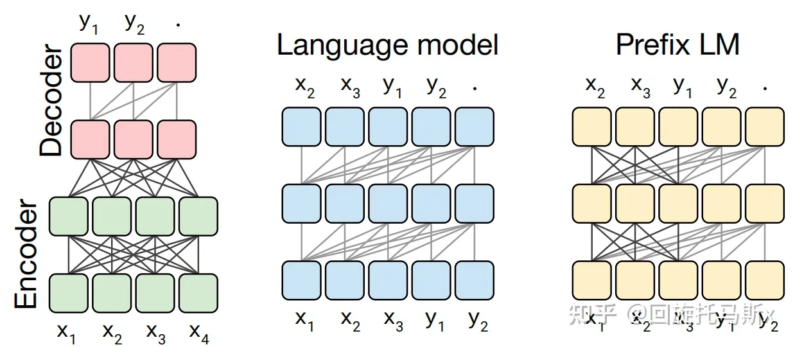

为了方便分析，先定义好一些数学符号。记transformer模型的层数为 l ，隐藏层维度为 h ，注意力头数为 a 。词表大小为 V ，训练数据的批次大小为 b ，序列长度为 s 。

## 2. 模型参数量

transformer模型由 l 个相同的层组成，每个层分为两部分：self-attention块和MLP块。

self-attention块的模型参数有 Q、K、V 的权重矩阵 WQ、WK、WV 和偏置，输出权重矩阵 WO 和偏置，4个权重矩阵的形状为 [h,h] ，4个偏置的形状为 [h] 。self- attention块的参数量为 4h^2+4h 。

MLP块由2个线性层组成，一般地，第一个线性层是先将维度从 h 映射到 4h ，第二个线性层再将维度从4h映射到h。第一个线性层的权重矩阵 W1 的形状为 [h,4h] ，偏置的形状为 [4h] 。第二个线性层权重矩阵 W2 的形状为 [4h,h] ，偏置形状为 [h] 。MLP块的参数量为 8h^2+5h 。

self-attention块和MLP块各有一个layer normalization，包含了2个可训练模型参数：缩放参数 γ 和平移参数 β ，形状都是 [h] 。2个layer normalization的参数量为 4h 。

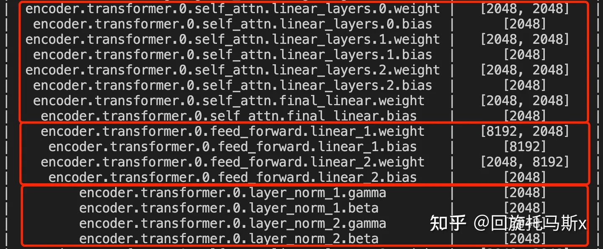

总的，**每个transformer层的参数量**为 12h^2+13h 。

除此之外，词嵌入矩阵的参数量也较多，词向量维度通常等于隐藏层维度 h ，词嵌入矩阵的参数量为 Vh 。最后的输出层的权重矩阵通常与词嵌入矩阵是参数共享的。

关于位置编码，如果采用可训练式的位置编码，会有一些可训练模型参数，数量比较少。如果采用相对位置编码，例如RoPE和ALiBi，则不包含可训练的模型参数。我们忽略这部分参数。

综上， **l 层transformer模型的可训练模型参数量为** l(12h^2+13h)+Vh 。当隐藏维度 h 较大时，可以忽略一次项，**模型参数量近似为** 12lh^2 。

接下来，我们估计不同版本LLaMA模型的参数量。

| 实际参数量 | 隐藏维度h | 层数l | 12lh^2         |
| ---------- | --------- | ----- | -------------- |
| 6.7B       | 4096      | 32    | 6,442,450,944  |
| 13.0B      | 5120      | 40    | 12,582,912,000 |
| 32.5B      | 6656      | 60    | 31,897,681,920 |
| 65.2B      | 8192      | 80    | 64,424,509,440 |

### 2.1 训练过程中的显存占用分析

在训练神经网络的过程中，占用显存的大头主要分为四部分：**模型参数、前向计算过程中产生的中间激活、后向传递计算得到的梯度、优化器状态**。这里着重分析参数、梯度和优化器状态的显存占用，中间激活的显存占用后面会详细介绍。训练大模型时通常会采用AdamW优化器，并用混合精度训练来加速训练，基于这个前提分析显存占用。

在一次训练迭代中，每个可训练模型参数都会对应1个梯度，并对应2个优化器状态（Adam优化器梯度的一阶动量和二阶动量）。设模型参数量为 Φ ，那么梯度的元素数量为 Φ ，AdamW优化器的元素数量为 2Φ 。float16数据类型的元素占2个bytes，float32数据类型的元素占4个bytes。在混合精度训练中，会使用float16的模型参数进行前向传递和后向传递，计算得到float16的梯度；在优化器更新模型参数时，会使用float32的优化器状态、float32的梯度、float32的模型参数来更新模型参数。因此，对于每个可训练模型参数，占用了 (2+4)+(2+4)+(4+4)=20bytes 。使用AdamW优化器和混合精度训练来训练参数量为 Φ 的大模型，**模型参数、梯度和优化器状态占用的显存大小为** 20Φ bytes 。

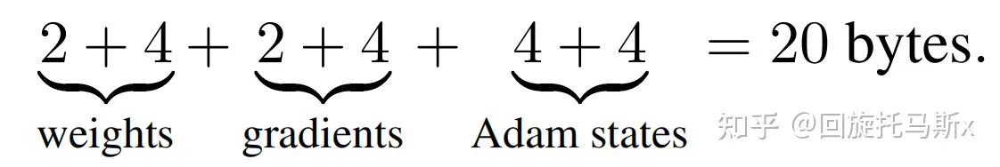

### **2.2 推理过程中的显存占用分析**

在神经网络的推理阶段，没有优化器状态和梯度，也不需要保存中间激活。**少了梯度、优化器状态、中间激活，模型推理阶段占用的显存要远小于训练阶段**。模型推理阶段，占用显存的大头主要是模型参数，如果使用float16来进行推理，**推理阶段模型参数占用的显存大概是** 2Φ bytes 。如果使用KV cache来加速推理过程，**KV cache也需要占用显存**，KV cache占用的显存下文会详细介绍。此外，输入数据也需要放到GPU上，还有一些中间结果（推理过程中的中间结果用完会尽快释放掉），不过这部分占用的显存是很小的，可以忽略。

## 3. 计算量FLOPs估计

FLOPs，floating point operations，表示浮点数运算次数，衡量了计算量的大小。

如何计算矩阵乘法的FLOPs呢？

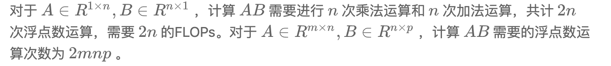

在一次训练迭代中，假设输入数据的形状为 [b,s] 。我们**先分析self-attention块的计算**，计算公式如下：

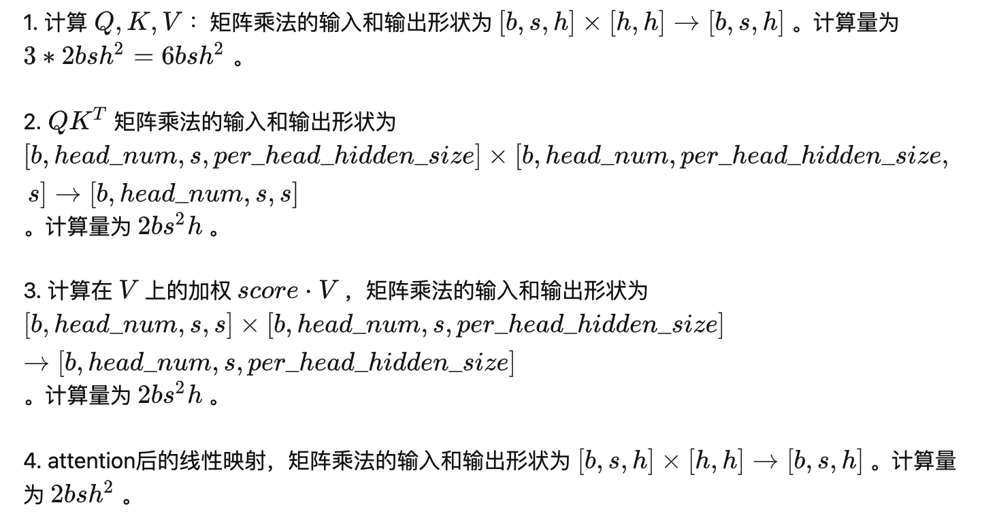

**接下来分析MLP块的计算，计算公式如下**：

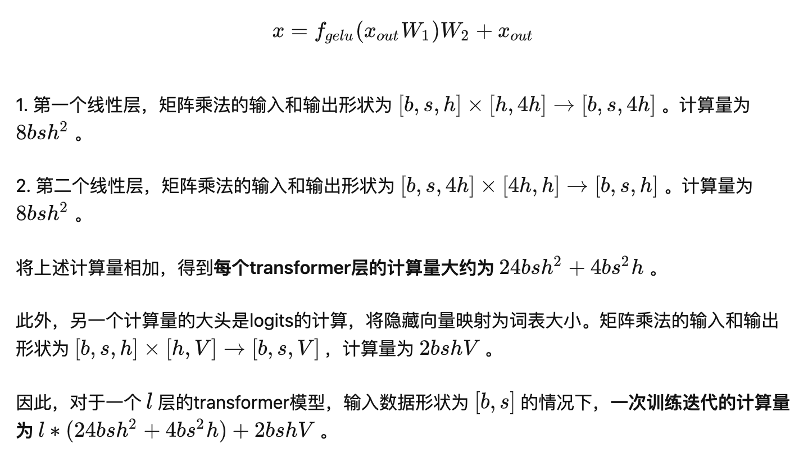

### 3.1 计算量与参数量的关联

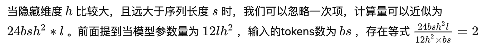

我们可以近似认为：**在一次前向传递中，对于每个token，每个模型参数，需要进行2次浮点数运算**，即一次乘法法运算和一次加法运算。

一次训练迭代包含了前向传递和后向传递，**后向传递的计算量是前向传递的2倍**。因此，前向传递 + 后向传递的系数 =1+2=3 。一次训练迭代中，对于每个token，每个模型参数，需要进行 2∗3=6 次浮点数运算。

接下来，我们可以估计训练GPT3-175B所需要的计算量。对于GPT3，每个token，每个参数进行了6次浮点数运算，再乘以参数量和总tokens数就得到了总的计算量。GPT3的模型参数量为 174600M ，训练数据量为 300B tokens。

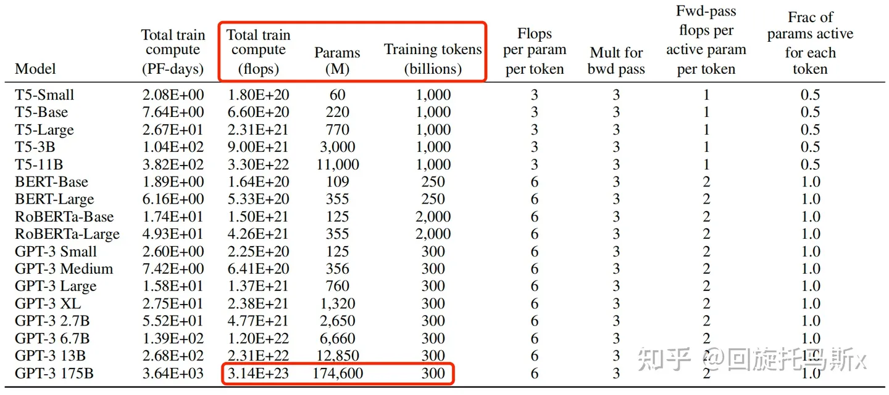

### 3.2 训练时间估计

模型参数量和训练总tokens数决定了训练transformer模型需要的计算量。给定硬件GPU类型的情况下，可以估计所需要的训练时间。给定计算量，训练时间（也就是GPU算完这么多flops的计算时间）不仅跟GPU类型有关，还与GPU利用率有关。计算端到端训练的GPU利用率时，不仅要考虑前向传递和后向传递的计算时间，还要考虑CPU加载数据、优化器更新、多卡通信和记录日志的时间。一般来讲，**GPU利用率一般在 0.3∼0.55 之间**。

上文讲到一次前向传递中，对于每个token，每个模型参数，进行2次浮点数计算。使用激活重计算技术来减少中间激活显存（下文会详细介绍）需要进行一次额外的前向传递，因此前向传递 + 后向传递 + 激活重计算的系数=1+2+1=4。使用**激活重计算**的一次训练迭代中，对于每个token，每个模型参数，需要进行 2∗4=8 次浮点数运算。**在给定训练tokens数、硬件环境配置的情况下，训练transformer模型的计算时间为**：

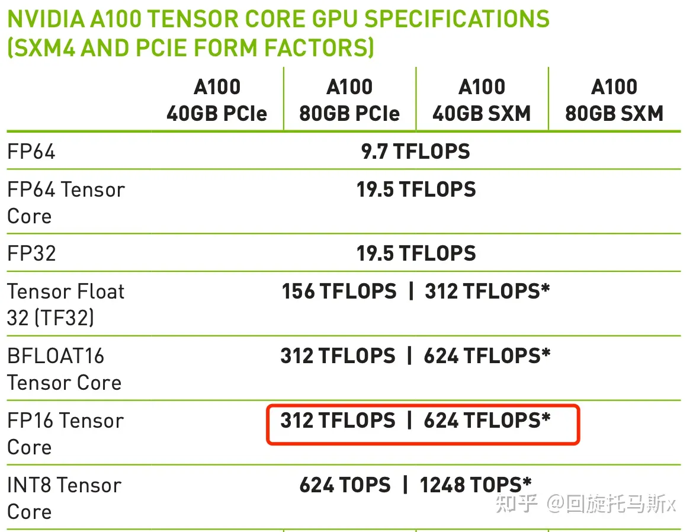

以GPT3-175B为例，在1024张40GB显存的A100上，在300B tokens的数据上训练175B参数量的GPT3。40GB显存A100的峰值性能为312TFLOPS，设GPU利用率为0.45，则**所需要的训练时间为34天，这与[7]中的训练时间是对得上的**。

以LLaMA-65B为例，在2048张80GB显存的A100上，在1.4TB tokens的数据上训练了65B参数量的模型。80GB显存A100的峰值性能为624TFLOPS，设GPU利用率为0.3，则**所需要的训练时间为21天，这与[4]中的实际训练时间是对得上的**。

## 4. 中间激活值分析

除了模型参数、梯度、优化器状态外，占用显存的大头就是前向传递过程中计算得到的中间激活值了，需要保存中间激活以便在后向传递计算梯度时使用。这里的激活（activations）指的是：**前向传递过程中计算得到的，并在后向传递过程中需要用到的所有张量**。这里的激活不包含模型参数和优化器状态，但包含了dropout操作需要用到的mask矩阵。

在分析中间激活的显存占用时，只考虑激活占用显存的大头，忽略掉一些小的buffers。比如，对于layer normalization，计算梯度时需要用到层的输入、输入的均值 μ 和方差 σ^2 。输入包含了 bsh 个元素，而输入的均值和方差分别包含了 bs 个元素。由于 h 通常是比较大的（千数量级），有 bsh≫bs 。因此，对于layer normalization，中间激活近似估计为 bsh ，而不是 bsh+2bs 。

大模型在训练过程中通常采用混合精度训练，中间激活值一般是float16或者bfloat16数据类型的。在分析中间激活的显存占用时，**假设中间激活值是以float16或bfloat16数据格式来保存的，每个元素占了2个bytes。唯一例外的是，dropout操作的mask矩阵，每个元素只占1个bytes**。在下面的分析中，单位是bytes，而不是元素个数。

每个transformer层包含了一个self-attention块和MLP块，并分别对应了一个layer normalization连接。

**先分析self-attention块的中间激活**。self-attention块的计算公式如下：

1. 对于 Q,K,V ，需要保存它们共同的输入 x ，这就是中间激活。输入 x 的形状为 [b,s,h] ，元素个数为 bsh ，占用显存大小为 2∗bsh=2bsh 。
2. 对于 QKT 矩阵乘法，需要保存中间激活 Q,K ，两个张量的形状都是 [b,s,h] ，占用显存大小合计为 2∗2∗bsh=4bsh 。
3. 对于 softmax() 函数，需要保存函数的输入 QKT ，占用显存大小为 2bs^2a ，这里的 a 表示注意力头数。

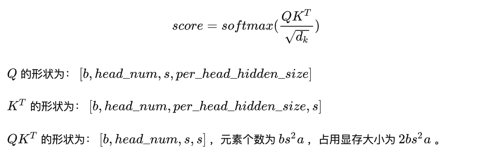

4. 计算完 softmax() 函数后，会进行dropout操作。需要保存一个mask矩阵，mask矩阵的形状与 QKT 相同，占用显存大小为 bs^2a 。
5. 计算在 V 上的attention，即 score⋅V ，需要保存 score ，大小为 2bs^2a ；以及 V ，大小为 2bsh 。二者占用显存大小合计为 2bs^2a+2bsh 。
6. 计算输出映射以及一个dropout操作。输入映射需要保存其输入，大小为 2bsh ；dropout需要保存mask矩阵，大小为 bsh 。二者占用显存大小合计为 3bsh 。

因此，将上述中间激活相加得到，self-attention块的中间激活占用显存大小为 11bsh+5bs^2a 。

接下来**看MLP块的中间激活。MLP块的计算公式如下**：

1. 第一个线性层需要保存其输入，占用显存大小为 2bsh 。
2. 激活函数需要保存其输入，占用显存大小为 8bsh 。
3. 第二个线性层需要保存其输入，占用显存大小为 8bsh 。
4. 最后有一个dropout操作，需要保存mask矩阵，占用显存大小为 bsh 。

对于MLP块，需要保存的中间激活值为 19bsh 。

另外，self-attention块和MLP块分别对应了一个layer normalization。每个layer norm需要保存其输入，大小为 2bsh 。2个layer norm需要保存的中间激活为 4bsh 。

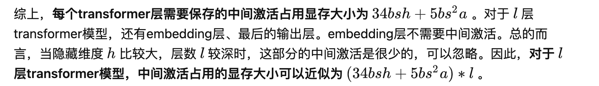

### 4.1 对比中间激活与模型参数的显存大小

在一次训练迭代中，模型参数（或梯度）占用的显存大小只与模型参数量和参数数据类型有关，与输入数据的大小是没有关系的。优化器状态占用的显存大小也是一样，与优化器类型有关，与模型参数量有关，但与输入数据的大小无关。而**中间激活值与输入数据的大小（批次大小 b 和序列长度 s ）是成正相关的**，随着批次大小 b 和序列长度 s 的增大，中间激活占用的显存会同步增大。当我们训练神经网络遇到显存不足OOM（Out Of Memory）问题时，通常会尝试减小批次大小来避免显存不足的问题，这种方式减少的其实是中间激活占用的显存，而不是模型参数、梯度和优化器的显存。

以GPT3-175B为例，我们来直观地对比下模型参数与中间激活的显存大小。GPT3的模型配置如下。我们假设采用混合精度训练，模型参数和中间激活都采用float16数据类型，每个元素占2个bytes。

| 模型名 | 参数量 | 层数 | 隐藏维度 | 注意力头数 |
| ------ | ------ | ---- | -------- | ---------- |
| GPT3   | 175B   | 96   | 12288    | 96         |

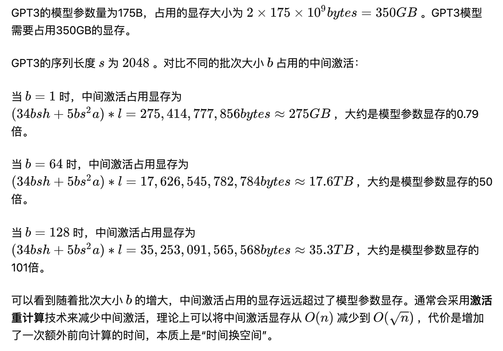

## 5. KV cache

在推断阶段，transformer模型加速推断的一个常用策略就是使用 KV cache。一个典型的大模型生成式推断包含了两个阶段：

1. **预填充阶段**：输入一个prompt序列，为每个transformer层生成 key cache和value cache（KV cache）。
2. **解码阶段**：使用并更新KV cache，一个接一个地生成词，当前生成的词依赖于之前已经生成的词。

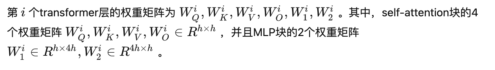

**预填充阶段**

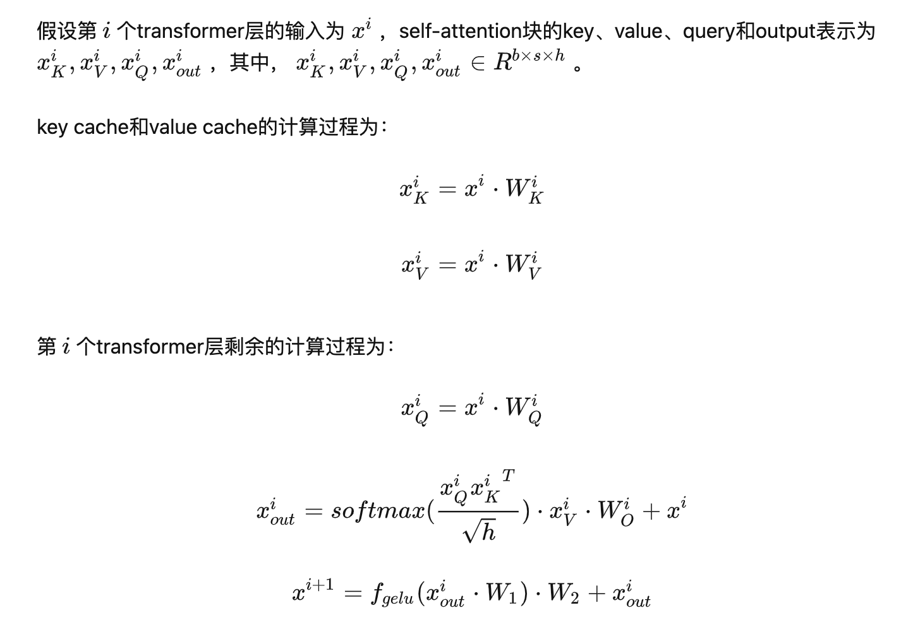

**解码阶段**

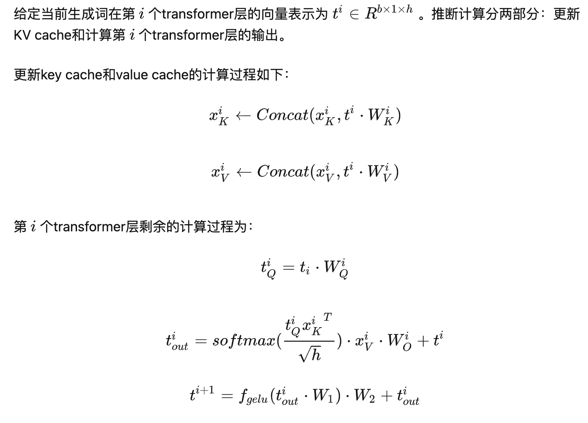

### 5.1 KV cache的显存占用分析

假设输入序列的长度为 s ，输出序列的长度为 n ，以float16来保存KV cache，那么**KV cache的峰值显存占用大小为** b(s+n)h∗l∗2∗2=4blh(s+n) 。这里第一个2表示K/V cache，第二个2表示float16占2个bytes。

以GPT3为例，对比KV cache与模型参数占用显存的大小。GPT3模型占用显存大小为350GB。假设批次大小 b=64 ，输入序列长度 s=512 ，输出序列长度 n=32 ，则KV cache占用显存为 4blh(s+n)=164,282,499,072bytes≈164GB ，大约是模型参数显存的0.5倍。

## 6. 总结

本文首先介绍了如何计算transformer模型的参数量，基于参数量可以进一步估计模型参数、梯度和优化器状态占用的显存大小。接着，本文估计了训练迭代中，在给定训练tokens数的情况下transformer模型的计算量，给予计算量和显卡性能可以进一步估计训练迭代的计算耗时。然后，本文分析了transformer模型前向计算过程中产生的中间激活值的显存大小，中间激活的显存大小与输入数据大小正相关，甚至会远超过模型参数占用的显存。最后，本文介绍了transformer模型推理过程常用的加速策略：使用KV cache。总的来说，分析transformer模型的参数量、计算量、中间激活和KV cache，有助于理解大模型训练和推断过程中的显存效率和计算效率。

## 7. 参考链接

1. Raffel C, Shazeer N, Roberts A, et al. Exploring the limits of transfer learning with a unified text-to-text transformer[J]. The Journal of Machine Learning Research, 2020, 21(1): 5485-5551.
2. Vaswani A, Shazeer N, Parmar N, et al. Attention is all you need[J]. Advances in neural information processing systems, 2017, 30.
3. Brown T, Mann B, Ryder N, et al. Language models are few-shot learners[J]. Advances in neural information processing systems, 2020, 33: 1877-1901.
4. Touvron H, Lavril T, Izacard G, et al. Llama: Open and efficient foundation language models[J]. arXiv preprint arXiv:2302.13971, 2023.
5. Sheng Y, Zheng L, Yuan B, et al. High-throughput generative inference of large language models with a single gpu[J]. arXiv preprint arXiv:2303.06865, 2023.
6. Korthikanti V, Casper J, Lym S, et al. Reducing activation recomputation in large transformer models[J]. arXiv preprint arXiv:2205.05198, 2022.
7. Narayanan D, Shoeybi M, Casper J, et al. Efficient large-scale language model training on gpu clusters using megatron-lm[C]//Proceedings of the International Conference for High Performance Computing, Networking, Storage and Analysis. 2021: 1-15.
8. Smith S, Patwary M, Norick B, et al. Using deepspeed and megatron to train megatron-turing nlg 530b, a large-scale generative language model[J]. arXiv preprint arXiv:2201.11990, 2022.