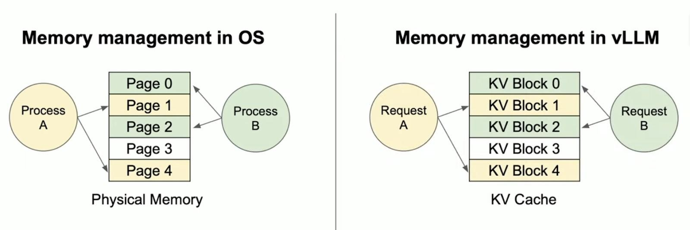
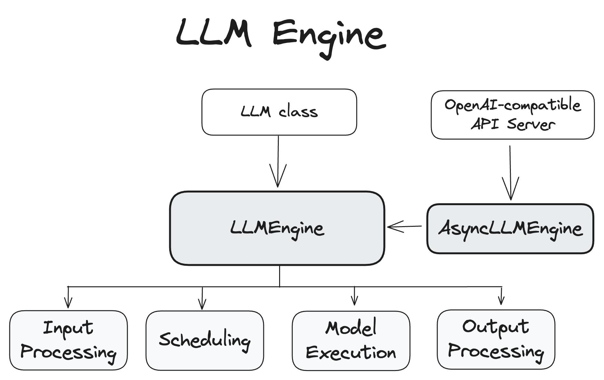

# vLLM 大模型推理框架 全详解

vLLM（Virtual Large Language Model inference engine）是由加州大学伯克利分校 Sky Computing Lab 研发、开源社区共同维护的**高性能大语言模型推理与服务框架**，采用 Apache 2.0 开源协议，核心定位是解决大模型推理中显存利用率低、并发能力弱、吞吐量不足的核心痛点，是当前工业界最主流的开源 LLM 推理部署方案之一。

## 一、vLLM 要解决的核心痛点

大模型自回归推理的核心瓶颈，集中在**KV Cache 内存管理**和**请求批处理调度**两大维度，传统推理框架（如原生 Hugging Face Transformers）存在致命缺陷：

1. **KV Cache 显存浪费与碎片化**

   LLM 推理中，每个 token 的生成都依赖前文所有 token 的 Key/Value（KV）缓存，传统方案需为每个请求预分配最大序列长度的连续显存。实际场景中，请求长度差异极大，导致显存利用率仅 20%-40%，大量空间被闲置，同时频繁的内存申请 / 释放产生严重碎片化，长上下文场景极易触发 OOM（显存溢出）。

2. **静态批处理的 GPU 利用率低下**

   传统静态批处理以完整请求为单位，必须等待批次内所有请求完成生成才能释放资源、接入新请求。批次内长短请求差异大时，GPU 大量时间处于空转等待状态，无法应对高并发在线场景，吞吐量被严重限制。

## 二、vLLM 核心技术详解

vLLM 的性能飞跃，核心来自两大革命性创新，辅以全链路的工程化优化，从底层重构了 LLM 推理的执行逻辑。

### 2.1 核心基石：PagedAttention（分页注意力机制）

PagedAttention 是 vLLM 的灵魂创新，它将操作系统**虚拟内存分页管理**的思想引入 GPU 显存管理，彻底解决了传统 KV Cache 的核心缺陷。

#### 核心设计逻辑

1. **固定粒度的 Block 拆分**

   将每个请求的 KV Cache 切分为固定大小的物理 Block（默认每个 Block 存储 16 个 token 的 KV 向量），Block 是显存分配与管理的最小单位。每个 Block 的大小固定，统一了内存分配粒度，从根源上减少碎片化。

2. **逻辑 - 物理地址解耦与块表映射**

为每个请求维护独立的Block Table（块表），类比操作系统的页表，记录「逻辑 Block（请求视角的连续序列）」到「物理 Block（GPU 显存中的实际存储位置）」的映射关系。物理 Block 无需在显存中连续存储，只需通过块表即可完成索引，彻底打破了连续内存分配的限制。



3. **按需分配与动态回收**

   仅为已生成的 token 分配物理 Block，新 token 生成时，仅当当前 Block 填满后，才从全局空闲块池申请新的 Block；请求完成后，所有物理 Block 立即释放回空闲池，供新请求复用。无预分配、无闲置，显存利用率可提升至 95% 以上。

4. **写时复制（Copy-on-Write）与缓存共享**

   基于 Block Table 的映射机制，vLLM 可实现零拷贝的 KV Cache 共享：

   - 多请求共享相同前缀（如系统提示词、RAG 检索的上下文）时，可映射到同一组物理 Block，无需重复存储与计算；
   - 并行采样、束搜索等场景中，多个生成序列可共享前文的 KV Cache，大幅降低显存开销。
   
   

#### 计算内核实现

vLLM 实现了定制化的 CUDA 注意力内核，支持跨非连续 Block 的注意力计算，保证与标准注意力计算的数学等价性。内核执行时，先通过 Block Table 索引到所需的 KV Block，将数据读取到片上共享内存，再完成注意力分数计算与加权求和，同时优化了内存访问模式，避免非连续访问带来的性能损耗vLLM。

### 2.2 核心调度：Continuous Batching（连续批处理）

连续批处理（也叫迭代级批处理）是 vLLM 高吞吐量的第二大核心，彻底颠覆了传统静态批处理的调度逻辑。

#### 核心逻辑

- 以**单个 token 生成步骤**为最小调度单位，而非完整请求；
- 每完成一个推理 step（生成一个 token），立即检查批次内的请求：完成生成的请求立即释放资源，同时将等待队列中的新请求无缝加入当前批次；
- 无需等待整个批次的所有请求结束，GPU 始终处于满负荷运行状态，空转时间被压缩到极致。

通俗类比：传统批处理是 “一桌客人必须全部吃完才能翻台”，而连续批处理是 “流水席，客人吃完就走，新客人随时入座”。

#### 核心收益

- 高并发场景下，GPU 利用率从传统的 30%-50% 提升至 90% 以上；
- 吞吐量相比静态批处理提升数倍，同时保证更稳定的生成延迟；
- 完美适配在线服务场景，支持请求的动态接入与结束。

### 2.3 配套全链路优化技术

除两大核心外，vLLM 还集成了大量工程化优化，进一步拉满推理性能：

1. **多维度量化支持**：原生支持 GPTQ、AWQ、INT4/INT8/FP8 量化，兼容主流量化模型，可进一步降低显存占用，提升单卡可承载的并发量vLLM。
2. **高性能内核集成**：深度集成 FlashAttention、FlashInfer 等业界最优的注意力内核，与 PagedAttention 深度协同，大幅降低注意力计算的延迟vLLM。
3. **前缀缓存（Prefix Caching）**：自动识别并缓存重复的前缀内容（如系统提示词、多轮对话历史、RAG 固定上下文），避免重复计算与存储，长对话场景性能提升显著vLLM。
4. **分块预填充（Chunked Prefill）**：将超长 prompt 分块处理，避免单次预填充占用过多显存和计算资源，平衡预填充和解码阶段的资源占用，提升高并发场景的稳定性vLLM。
5. **推测性解码（Speculative Decoding）**：支持小模型投机采样，用小模型快速生成候选 token，大模型仅做验证，大幅提升生成速度，降低单 token 延迟vLLM。
6. **多 LoRA 原生支持**：可同时加载和服务数十个 LoRA 微调模型，共享基座模型权重，仅需额外存储少量 LoRA 参数，大幅降低多模型服务的显存成本vLLM。

## 三、vLLM 整体架构与核心组件

vLLM 采用分层解耦的架构设计，从底层硬件适配到上层应用接入，各层职责清晰、接口标准化，既便于独立优化，也支持灵活扩展。

### 3.1 整体分层架构

| 架构层级   | 核心定位                             | 核心组件                                                 |
| :--------- | :----------------------------------- | :------------------------------------------------------- |
| 接入层     | 对外提供标准化接口，降低接入成本     | Python SDK、OpenAI 兼容 API 服务器、HuggingFace 模型集成 |
| 引擎层     | 系统核心中枢，统筹全流程请求处理     | LLMEngine、AsyncLLMEngine                                |
| 调度层     | 负责请求调度、显存管理与生命周期控制 | Scheduler、KV Cache Manager、Block Table 管理器          |
| 核心执行层 | 负责模型前向计算与底层内核执行       | Worker/Model Runner、定制 CUDA 内核、内存分配器          |
| 硬件适配层 | 屏蔽底层硬件差异，提供统一执行接口   | NVIDIA CUDA、AMD HIP、Intel OneAPI、TPU 适配模块         |

### 3.2 核心组件详解

vLLM 的核心执行逻辑围绕**LLMEngine**展开，核心组件职责如下vLLM：



1. **LLMEngine/AsyncLLMEngine**

   vLLM 的核心控制中枢，负责端到端的请求处理全流程，包括输入分词、请求入队、调度决策、模型执行、输出解码。其中：

   - `LLMEngine` 是同步核心，适合离线批量推理场景；
   - `AsyncLLMEngine` 基于异步 IO 实现，是在线服务的核心，支持高并发请求的异步处理，也是 OpenAI API 服务器的底层核心。
   
2. **Scheduler（调度器）**

   系统的调度核心，运行在每个 token 生成 step，核心职责包括：

   - 管理请求的全生命周期（pending、running、preempted、finished）；
   - 决策每个 step 要执行的请求，平衡预填充和解码阶段的资源占用；
   - 显存不足时，通过抢占机制降级处理，保证服务不崩溃；
   - 与 KV Cache Manager 协同，完成 Block 的分配、回收与映射更新。
   
3. **KV Cache Manager**

   显存管理核心，负责全局 KV Block 的生命周期管理：

   - 维护全局空闲物理 Block 池，实现 O (1) 复杂度的分配与回收；
   - 为每个请求维护独立的 Block Table，处理逻辑 - 物理地址映射；
   - 实现写时复制、前缀共享、Block 复用等核心机制；
   - 支持 CPU-GPU 之间的 Block 换入换出，进一步扩展显存容量。
   
4. **Worker/Model Runner**

   模型执行的实际载体，单 GPU 对应一个 Worker 实例，核心职责：

   - 加载模型分片，管理模型权重的显存存储；
   - 执行调度器下发的前向计算任务，完成模型推理；
   - 原生支持张量并行（TP）、流水线并行（PP），实现多卡 / 多节点分布式推理；
   - 对接底层定制 CUDA 内核，完成注意力计算与全链路算子优化。
   

## 四、vLLM 核心功能与核心优势

### 4.1 核心功能特性

1. **极致的推理性能**

   官方基准测试显示，vLLM 的吞吐量相比原生 Hugging Face Transformers 提升 8.5-24 倍，相比 Hugging Face TGI 提升 2.2-3.5 倍，相比 FasterTransformer 提升 3 倍以上；显存利用率最高可达 99%，同 GPU 可承载的并发请求量提升 5-10 倍。

2. **极致的易用性与兼容性**

   - 与 Hugging Face 生态无缝集成，支持 LLaMA 系列、Mistral、Qwen、ChatGLM、Gemma、DeepSeek 等几乎所有主流开源大模型，开箱即用，无需修改模型结构；
   - 提供完全兼容 OpenAI 的 API 接口，一行命令即可启动服务，基于 OpenAI 开发的应用可零成本迁移；
   - 支持流式输出、并行采样、束搜索、温度采样等所有主流解码策略，满足不同生成场景需求；
   - 提供官方 Docker 镜像、Kubernetes 部署方案，大幅降低生产环境部署成本。

3. **灵活的部署与扩展能力**

   - 全场景部署支持：覆盖单卡离线推理、单卡在线服务、单节点多卡分布式部署、多节点大规模集群部署；
   - 原生支持张量并行、流水线并行，可无缝扩展至数百张 GPU，部署千亿级参数的超大规模模型；
   - 跨硬件平台支持：除 NVIDIA GPU 外，还支持 AMD GPU/CPU、Intel GPU/CPU、Google TPU、AWS Neuron 等多种硬件，适配不同基础设施环境vLLM；
   - 原生支持多模态模型（如 LLaVA 系列）、多 LoRA 服务、前缀缓存等高级生产级特性，满足企业级复杂场景需求。

4. **生产级高可用特性**

   - 完善的异步请求处理机制，支持高并发场景的请求排队、限流、重试；
   - 内置容错机制，单请求异常不会导致整个服务崩溃，保障服务稳定性；
   - 提供 Prometheus 监控指标、完善的日志系统，便于生产环境的运维与排障；
   - 支持动态负载调整，自适应不同的请求流量峰值。


### 4.2 与主流推理框架的核心对比

| 对比维度       | Hugging Face Transformers    | TGI                    | TensorRT-LLM                    | vLLM                                           |
| :------------- | :--------------------------- | :--------------------- | :------------------------------ | :--------------------------------------------- |
| 核心优势       | 生态最全、适配性最强、零门槛 | 官方服务框架、稳定性强 | NVIDIA 深度优化、极致单请求延迟 | 显存效率极致、高并发吞吐最强、易用性与性能平衡 |
| 相对吞吐量     | 1x                           | 2-3x                   | 4-6x                            | 8-24x                                          |
| 显存利用率     | <40%                         | ~65%                   | ~80%                            | 95%+                                           |
| 长上下文支持   | 差，极易 OOM                 | 一般                   | 良好                            | 极佳，动态分配无闲置                           |
| 部署复杂度     | 极低，开箱即用               | 低                     | 高，需编译与模型适配            | 低，开箱即用                                   |
| 模型兼容性     | 最全，覆盖所有开源模型       | 主流模型全覆盖         | 主流模型适配                    | 主流模型全覆盖，迭代速度快                     |
| 生产级高级特性 | 基础支持                     | 基础支持               | 丰富                            | 极丰富（前缀缓存、多 LoRA、推测解码等）        |
| 开源协议       | Apache 2.0                   | Apache 2.0             | Apache 2.0                      | Apache 2.0                                     |

## 五、vLLM 部署与使用流程

### 5.1 快速上手

1. **安装 vLLM**

   bash运行

   ```
   # 稳定版安装（推荐）
   pip install vllm
   #  nightly版（最新特性）
   pip install -U vllm-nightly
   ```
   
   
   
2. **离线批量推理示例**

   python运行

   ```
   from vllm import LLM, SamplingParams
   
   # 加载模型（自动适配Hugging Face格式）
   llm = LLM(model="Qwen/Qwen2-7B-Instruct", tensor_parallel_size=1)
   
   # 配置生成参数
   sampling_params = SamplingParams(
       temperature=0.7,
       top_p=0.9,
       max_tokens=512,
       repetition_penalty=1.05
   )
   
   # 批量推理
   prompts = [
       "请解释一下什么是大模型推理优化",
       "写一段关于春天的散文"
   ]
   outputs = llm.generate(prompts, sampling_params)
   
   # 输出结果
   for output in outputs:
       prompt = output.prompt
       generated_text = output.outputs[0].text
       print(f"Prompt: {prompt}\n生成结果: {generated_text}\n")
   ```
   
3. **启动 OpenAI 兼容在线服务**

   一行命令即可启动兼容 OpenAI 接口的服务，支持流式输出、多轮对话等所有核心功能：

   bash运行

   ```
   # 单卡启动服务
   vllm serve Qwen/Qwen2-7B-Instruct --port 8000
   
   # 多卡张量并行启动（如2张GPU）
   vllm serve Qwen/Qwen2-72B-Instruct --tensor-parallel-size 2 --port 8000
   ```

   启动后，即可通过 OpenAI SDK 直接调用：

   python运行

   ```
   from openai import OpenAI
   
   client = OpenAI(base_url="http://localhost:8000/v1", api_key="dummy_key")
   response = client.chat.completions.create(
       model="Qwen/Qwen2-7B-Instruct",
       messages=[{"role": "user", "content": "你好，介绍一下vLLM"}],
       stream=True,
       max_tokens=512
   )
   for chunk in response:
       if chunk.choices[0].delta.content:
           print(chunk.choices[0].delta.content, end="")
   ```
   

### 5.2 主流部署模式

1. **离线批量推理模式**

   适合离线文本生成、大规模数据标注、模型评估、数据预处理等场景，使用`LLM`类，支持大批量数据的并行处理，最大化利用 GPU 算力，缩短任务执行时间。

2. **单卡在线服务模式**

   适合中小流量的 AI 对话服务、Chatbot、内部工具等场景，使用`vllm serve`命令启动 OpenAI 兼容服务，支持高并发请求、流式输出，开箱即用，运维成本极低。

3. **分布式部署模式**

   - **单节点多卡张量并行**：适合 70B + 大模型单节点部署，通过`tensor-parallel-size`参数设置并行卡数，将模型层拆分到多张 GPU，分摊显存与计算压力；
   - **多节点流水线并行**：适合千亿级参数超大规模模型，将模型拆分到多个节点，通过流水线并行提升吞吐量；
   - 分布式部署原生支持 NCCL/Gloo 通信后端，多卡协同效率高，无需手动拆分模型权重。
   

## 六、vLLM 适用场景与局限性

### 6.1 核心适用场景

1. **高并发在线 LLM 服务**：如 AI 客服、对话平台、C 端 Chatbot 应用，vLLM 的高吞吐量、低延迟特性可大幅降低服务成本，支撑海量用户同时在线。
2. **长上下文推理场景**：如 RAG 检索增强生成、长文档摘要、法律文书分析、代码库理解、长对话机器人，vLLM 的动态 KV Cache 管理可完美适配 32K + 超长上下文，避免 OOM 风险。
3. **离线批量推理任务**：如大规模文本生成、数据预处理、预训练后处理、模型微调 / 评估，高吞吐量可大幅缩短任务执行时间，提升工作效率。
4. **多模型 / 多 LoRA 服务场景**：如企业级多场景 AI 平台，需要同时服务多个行业 / 场景的微调模型，vLLM 的多 LoRA 支持可大幅降低显存开销，实现 “一个基座支撑数十个场景”。
5. **低资源 / 边缘部署场景**：显存受限的边缘设备、低配置 GPU 环境，vLLM 的高显存利用率可实现 “小卡跑大模型”，降低部署的硬件门槛。

### 6.2 当前局限性

1. **硬件优化偏向 NVIDIA GPU**：虽然支持多硬件平台，但核心的 CUDA 内核优化、最佳性能表现仍集中在 NVIDIA GPU，AMD、Intel、TPU 等硬件的优化深度不足，性能差距较大。
2. **小众模型适配成本高**：对于非标准结构的小众定制模型，需要手动适配 vLLM 的注意力内核、调度逻辑与 KV Cache 管理，有一定的开发门槛。
3. **极端低延迟场景表现不足**：vLLM 的核心优势是高并发吞吐量，对于单请求、极致低延迟的场景，相比 TensorRT-LLM 等经过极致编译优化的框架，单 token 延迟表现略逊。
4. **部分特性兼容性受限**：部分自定义注意力机制、非常规量化方案、定制化算子，与 vLLM 的 PagedAttention 内核存在兼容性问题，需要额外的适配开发。
5. **超大规模集群部署门槛**：虽然支持多节点分布式部署，但相比专门的集群推理服务框架，在负载均衡、容灾容错、多租户隔离等企业级集群特性上，仍有一定的完善空间。

## 七、生态与发展现状

vLLM 是当前开源社区最活跃、工业界应用最广泛的 LLM 推理框架之一，截至 2026 年 3 月，GitHub 星标超 5 万，社区贡献者超千人，版本迭代速度极快，持续跟进业界最新的模型结构与优化技术。

工业界方面，vLLM 被全球大量企业与 AI 平台采用，包括国内外主流的大模型服务商、AI 创业公司、云计算厂商，是很多 Chatbot、RAG、Agent 应用的默认推理后端；同时被 LangChain、LlamaIndex、Haystack 等主流 LLM 应用框架深度集成，成为大模型应用落地的核心基础设施。

未来，vLLM 将持续在多硬件适配、多模态支持、极致性能优化、企业级生产特性四大方向迭代，进一步降低大模型推理部署的门槛与成本。