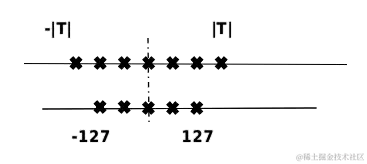
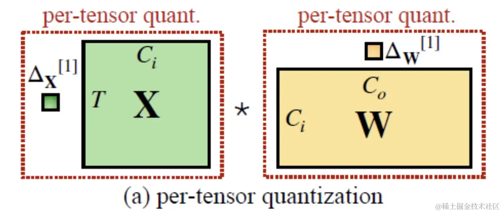
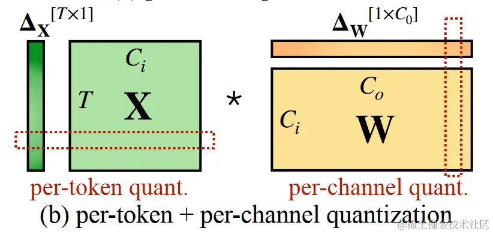
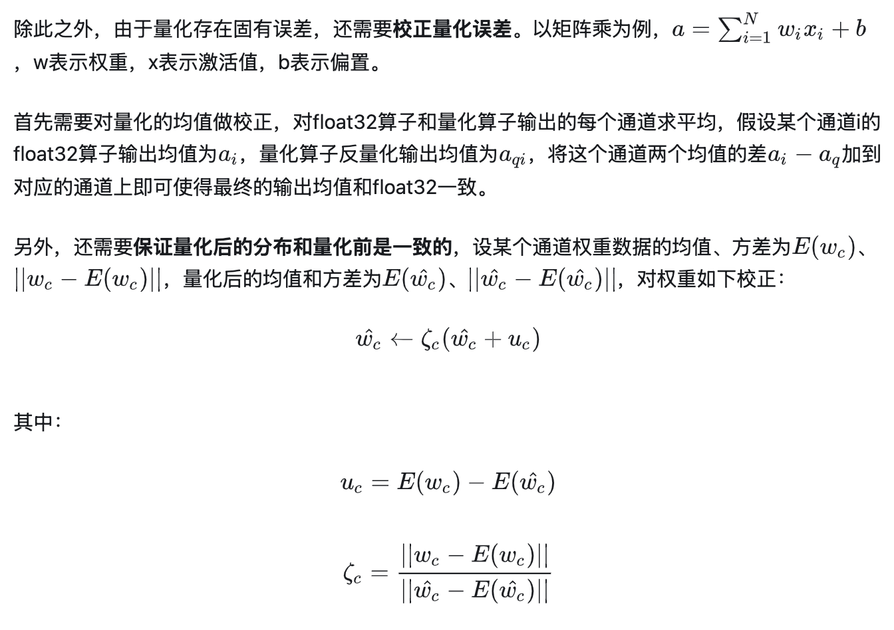
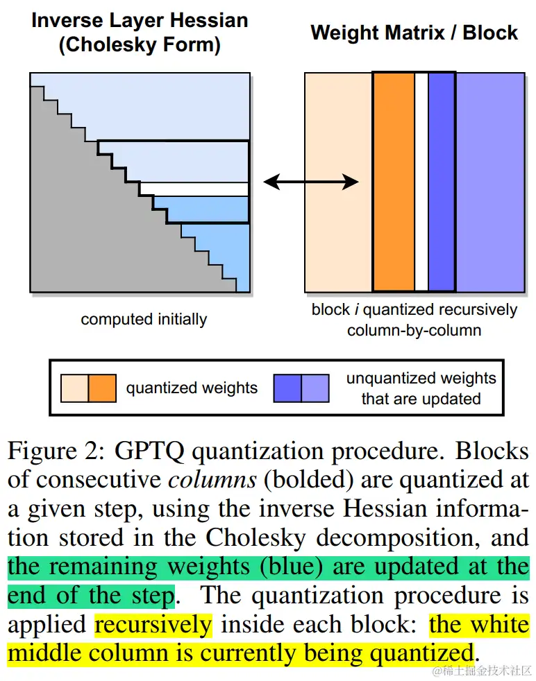
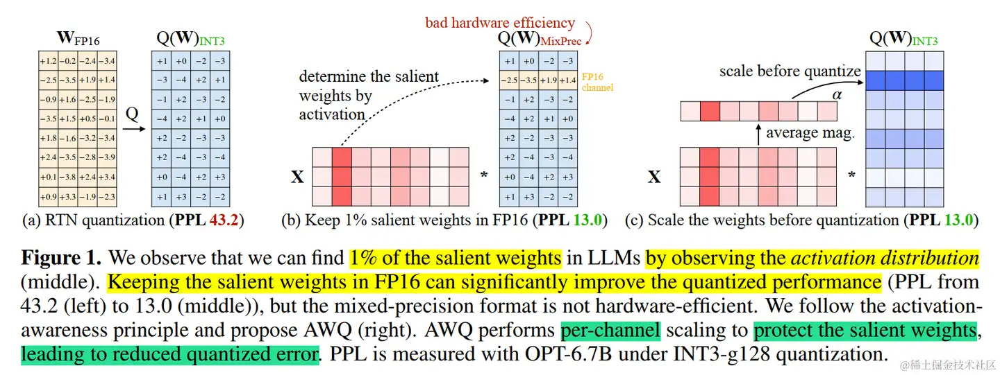
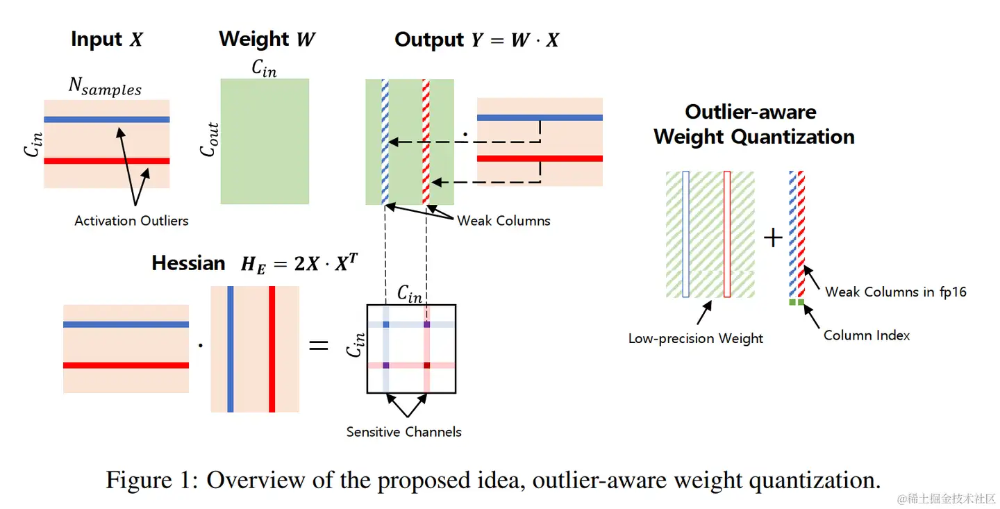
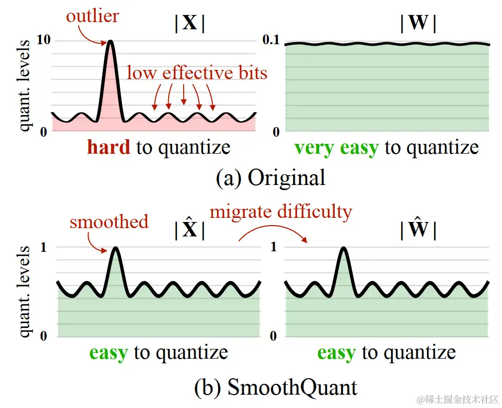

# 大模型量化概述

近年来，随着[Transformer](https://zhida.zhihu.com/search?content_id=623110831&content_type=Answer&match_order=1&q=Transformer&zhida_source=entity)、[MOE架构](https://zhida.zhihu.com/search?content_id=623110831&content_type=Answer&match_order=1&q=MOE架构&zhida_source=entity)的提出，使得深度学习模型轻松突破上万亿规模参数，从而导致模型变得越来越大，因此，我们需要一些大模型压缩技术来降低模型部署的成本，并提升模型的推理性能。 模型压缩主要分为如下几类：

- [剪枝](https://zhida.zhihu.com/search?content_id=623110831&content_type=Answer&match_order=1&q=剪枝&zhida_source=entity)（Pruning）
- [知识蒸馏](https://zhida.zhihu.com/search?content_id=623110831&content_type=Answer&match_order=1&q=知识蒸馏&zhida_source=entity)（Knowledge Distillation）
- 量化Quantization）

本系列将针对一些常见大模型量化方案（GPTQ、LLM.int8()、SmoothQuant、AWQ等）进行讲述。

- **[大模型量化概述](https://www.zhihu.com/question/627484732/answer/3261671478)**
- 量化感知训练：
  - **[大模型量化感知训练技术原理：LLM-QAT](https://zhuanlan.zhihu.com/p/647589650)**
  - **[大模型量化感知微调技术原理：QLoRA](https://www.zhihu.com/question/627484732/answer/3261671478/edit)**
- 训练后量化：
  - **[大模型量化技术原理：GPTQ、LLM.int8()](https://zhuanlan.zhihu.com/p/680212402)**
  - **[大模型量化技术原理：SmoothQuant](https://www.zhihu.com/question/576376372/answer/3388402085)**
  - **[大模型量化技术原理：AWQ、AutoAWQ](https://zhuanlan.zhihu.com/p/681578090)**
  - **[大模型量化技术原理：SpQR](https://zhuanlan.zhihu.com/p/682871823)**
  - **[大模型量化技术原理：ZeroQuant系列](https://zhuanlan.zhihu.com/p/683813769)**
  - **[大模型量化技术原理：FP8](https://www.zhihu.com/question/658712811/answer/3596678896)**
  - **[大模型量化技术原理：FP6](https://zhuanlan.zhihu.com/p/939334374)**
  - **[大模型量化技术原理：KIVI、IntactKV、KVQuant](https://zhuanlan.zhihu.com/p/5932153295)**
  - **[大模型量化技术原理：Atom、QuaRot](https://zhuanlan.zhihu.com/p/6281447174)**
  - **[大模型量化技术原理：QoQ量化及QServe推理服务系统](https://zhuanlan.zhihu.com/p/8047106486)**
  - **[大模型量化技术原理：FP4](https://www.zhihu.com/question/627484732/answer/3261671478/edit)**
- **[大模型量化技术原理：总结](https://www.zhihu.com/question/627484732/answer/3261671478/edit)**

本文将讲述大模型压缩部署最重要的技术模型量化的基本概念以及当前大模型量化相关的一些工作。

> 文章较长，建议先点赞收藏，后续再慢慢观看。另外，我撰写的**大模型相关的博客及配套代码**均整理放置在Github：[llm-action](https://link.zhihu.com/?target=https%3A//github.com/liguodongiot/llm-action/tree/main)，有需要的朋友自取。

## 简介

模型量化是指以较低的推理精度损失将连续取值（通常为float32或者大量可能的离散值）的浮点型权重近似为有限多个离散值（通常为int8）的过程。通过以更少的位数表示浮点数据，模型量化可以减少模型尺寸，进而减少在推理时的内存消耗，并且在一些低精度运算较快的处理器上可以增加推理速度。具体如下图所示，[-T, T]是量化前的数据范围，[-127, 127]是量化后的数据范围。

image.png

## 量化比特

计算机中不同数据类型的占用比特数及其表示的数据范围各不相同。可以根据实际业务需求将原模型量化成不同比特数的模型，一般深度神经网络的模型用单精度浮点数表示，如果能用有符号整数来近似原模型的参数，那么被量化的权重参数存储大小就可以降到原先的四分之一，用来量化的比特数越少，量化后的模型压缩率越高。

工业界目前最常用的量化位数是8比特，低于8比特的量化被称为低比特量化。1比特是模型压缩的极限，可以将模型压缩为1/32，在推理时也可以使用高效的[XNOR和BitCount位运算](https://zhida.zhihu.com/search?content_id=623110831&content_type=Answer&match_order=1&q=XNOR和BitCount位运算&zhida_source=entity)来提升推理速度。

## 量化对象

模型量化的对象主要包括以下几个方面：

- **权重**（weight）：weight的量化是最常规也是最常见的。量化weight可达到减少模型大小内存和占用空间。
- **激活**（activation）：实际中activation往往是占内存使用的大头，因此量化activation不仅可以大大减少内存占用。更重要的是，结合weight的量化可以充分利用整数计算获得性能提升。
- **KV cache**：量化 KV 缓存对于提高长序列生成的吞吐量至关重要。
- **梯度**（Gradients）：相对上面两者略微小众一些，因为主要用于训练。在训练深度学习模型时，梯度通常是浮点数，它主要作用是在分布式计算中减少通信开销，同时，也可以减少backward时的开销。

## 量化形式

另外，根据量化数据表示的原始数据范围是否均匀，还可以将量化方法分为线性量化和非线性量化。实际的深度神经网络的权重和激活值通常是不均匀的，因此理论上使用非线性量化导致的精度损失更小，但在实际推理中非线性量化的计算复杂度较高，通常使用线性量化。

下面着重介绍线性量化的原理。假设r表示量化前的浮点数，量化后的整数q可以表示为：

round(⋅)和clip(⋅)分别表示取整和截断操作，qmin和qmax是量化后的最小值和最大值。s是数据量化的间隔，z是表示数据偏移的偏置，z为0的量化被称为对称（Symmetric）量化，不为0的量化称为非对称（Asymmetric）量化。

对称量化可以避免量化算子在推理中计算z相关的部分，降低推理时的计算复杂度；非对称量化可以根据实际数据的分布确定最小值和最小值，可以更加充分的利用量化数据信息，使得量化导致的损失更低。

根据量化参数s和z的共享范围（即量化粒度），量化方法可以分为逐层量化（per-tensor）、逐通道（per-token & per-channel 或者 vector-wise quantization ）量化和逐组量化（per-group、Group-wise）。

- 逐层量化，这是最简单的一种方式，也是范围最大的粒度。**以一层网络为量化单位，每层网络一组量化参数**；

image.png

- 逐通道量化，**以一层网络的每个量化通道为单位，每个通道单独使用一组量化参数**。逐通道量化由于量化粒度更细，能获得更高的量化精度，但计算也更复杂。
  - per-token：针对激活 x 而言：每行对应一个量化系数。
  - per-channel：针对权重 w 而言：每列对应一个量化系数。

- 逐组量化以组为单位，每个group（比如：**K 行（对于激活而言）或者 K 列（对于权重而言）**）使用一组s和z；它的粒度处于 per-tensor 和 per-channel 之间。比如：group_size=128对应一个量化系数，共有 ⌊T/group_size⌋ * ⌊C0/group_size⌋ 个。当 group_size=1 时，逐组量化与逐层量化等价；当 group_size=num_filters（如：dw（Depthwise）将卷积核变成单通道）时，逐组量化与逐通道量化等价。

注意：权重和激活可以选择不同的量化粒度。譬如权重用 per-tensor，激活用 per-token。并且对于激活还有动态量化与静态量化之分。

**大家如果想深入了解模型压缩相关知识，推荐深度神经网络模型压缩课程，系统讲解深度神经网络中的模型压缩典型算法，代码级讲解多种压缩工具的原理细节和使用方式，覆盖视觉和大语言模型的全方位压缩知识和实际部署经验，感兴趣的朋友可以看看**。

## 量化分类

根据应用量化压缩模型的阶段，可以将模型量化分为：

- **量化感知训练**（Quantization Aware Training, QAT）：在模型训练过程中加入伪量化算子，通过训练时统计输入输出的数据范围可以提升量化后模型的精度，适用于对模型精度要求较高的场景；其量化目标无缝地集成到模型的训练过程中。这种方法使LLM在训练过程中适应低精度表示，增强其处理由量化引起的精度损失的能力。这种适应旨在量化过程之后保持更高性能。
- **量化感知微调**（Quantization-Aware Fine-tuning，QAF）：在微调过程中对LLM进行量化。主要目标是确保经过微调的LLM在量化为较低位宽后仍保持性能。通过将量化感知整合到微调中，以在模型压缩和保持性能之间取得平衡。
- **训练后量化**（[Post Training Quantization](https://zhida.zhihu.com/search?content_id=623110831&content_type=Answer&match_order=1&q=Post+Training+Quantization&zhida_source=entity), PTQ）：在LLM训练完成后对其参数进行量化，只需要少量校准数据，适用于追求高易用性和缺乏训练资源的场景。主要目标是减少LLM的存储和计算复杂性，而无需对LLM架构进行修改或进行重新训练。PTQ的主要优势在于其简单性和高效性。但PTQ可能会在量化过程中引入一定程度的精度损失。

### 量化感知训练

量化感知训练是在训练过程中模拟量化，**利用伪量化算子将量化带来的精度损失计入训练误差，使得优化器能在训练过程中尽量减少量化误差**，得到更高的模型精度。量化感知训练的具体流程如下：

- **初始化**：设置权重和激活值的范围qmin和qmax的初始值；
- **构建模拟量化网络**：在需要量化的权重和激活值后插入伪量化算子；
- **量化训练**：重复执行以下步骤直到网络收敛，**计算量化网络层的权重和激活值的范围**qmin和qmax，并**根据该范围将量化损失带入到前向推理和后向参数更新的过程中**；
- **导出量化网络**：获取qmin和qmax，并计算量化参数s和z；**将量化参数代入量化公式中，转换网络中的权重为量化整数值；删除伪量化算子，在量化网络层前后分别插入量化和反量化算子**。

### 训练后量化

训练后量化也可以分成两种，权重量化和全量化。

- 权重量化**仅量化模型的权重**以压缩模型的大小，在推理时将权重反量化为原始的float32数据，后续推理流程与普通的float32模型一致。权重量化的好处是不需要校准数据集，不需要实现量化算子，且模型的精度误差较小，由于实际推理使用的仍然是float32算子，所以推理性能不会提高。
- 全量化**不仅会量化模型的权重，还会量化模型的激活值**，在模型推理时执行量化算子来加快模型的推理速度。为了量化激活值，需要用户提供一定数量的校准数据集用于统计每一层激活值的分布，并对量化后的算子做校准。**校准数据集可以来自训练数据集或者真实场景的输入数据，需要数量通常非常小**。

在量化激活值时会**以校准数据集为输入，执行推理流程然后统计每层激活值的数据分布并得到相应的量化参数**。具体的操作流程如下：

- 使用直方图统计的方式**得到原始float32数据的统计分布**Pf；
- 在给定的搜索空间中选取若干个qmin和qmax分别**对激活值量化**，得到量化后的数据Qq；
- 使用直方图统计得到Qq的**统计分布**;
- 计算每个Qq与Pf的统计分布差异，并**找到差异性最低的一个**对应的qmin和qmax来计算相应的量化参数，常见的用于度量分布差异的指标包括KL散度(Kullback-Leibler Divergence)、对称KL散度(Symmetric Kullback-Leibler Divergence)和JS散度(Jenson-Shannon Divergence)。

下面来看看当前大模型量化相关的一些工作。

## 量化感知训练方法

LLM-QAT（论文：**LLM-QAT: Data-Free Quantization Aware Training for Large Language Models**）利用预训练模型生成的结果来实现无数据蒸馏。此外，LLM-QAT不仅量化权重和激活，还量化了KV缓存。这个策略旨在增强吞吐量并支持更长的序列依赖。LLM-QAT能够将带有量化权重和KV缓存的LLaMA模型蒸馏为仅有4比特的模型。这一突破性的结果论证了生产准确的4比特量化的LLM的可行性。详情请查看之前的文章：[大模型量化感知训练开山之作：LLM-QAT](https://zhuanlan.zhihu.com/p/647589650)

## 量化感知微调方法

PEQA（论文：**Memory-efficient fine-tuning of compressed large language models via sub-4-bit integer quantization**），这是一种新的量化感知 PEFT 技术，可以促进模型压缩并加速推理。它采用了双阶段过程运行。在第一阶段，每个全连接层的参数矩阵被量化为低比特整数矩阵和标量向量。在第二阶段，对每个特定下游任务的标量向量进行微调。这种策略大大压缩了模型的大小，从而降低了部署时的推理延迟并减少了所需的总体内存。 同时，快速的微调和高效的任务切换成为可能。

QLORA（论文： **QLORA: Efficient Finetuning of Quantized LLMs**）引入了新的数据类型NF4、双重量化和分页优化器等创新概念。这些想法旨在在不影响性能的情况下节省内存。QLORA使得微调LLaMA-65B大模型仅需48G显存，同时，基本不会影响微调效果。详情请查看之前的文章：[大模型参数高效微调技术原理综述（五）-LoRA、AdaLoRA、QLoRA](https://zhuanlan.zhihu.com/p/636215898)

## 训练后量化方法

PTQ 的主要目标是减少 LLM 的存储和计算复杂性，而无需对 LLM 架构进行修改或重新训练。PTQ 的主要优势在于其简单和高效。然而，值得注意的是，PTQ可能会在量化过程中引入一定程度的精度损失。

### 权重量化

在PTQ中，某些方法专注于仅对LLM的权重进行量化，以提高效率并减少计算需求。

LUT-GEMM（论文：**nuqmm: Quantized matmul for efficient inference of large-scale generative language models**）通过仅对权重进行量化以及使用BCQ格式在LLM中优化矩阵乘法，通过提高计算效率来增强延迟降低和性能。

LLM.int8()（论文：**LLM.int8(): 8-bit Matrix Multiplication for Transformers at Scale**）采用混合精度分解的量化方法。先做了一个矩阵分解，对绝大部分权重和激活用8bit量化（vector-wise）。对离群特征的几个维度保留16bit，对其做高精度的矩阵乘法。

image.png

ZeroQuant （论文：**ZeroQuant: Efficient and Affordable Post-Training Quantization for Large-Scale Transformers**）对权重做group-wise，对激活值做token-wise。用逐层知识蒸馏缓解精度损失（原网络做老师），量化后的网络做学生。和W8A8的普通方法做比较，在BERT和GPT3-style模型上精度更好，还能把权重量化到4bit，但加速效果糟糕。

GPTQ (论文：**GPTQ: ACCURATE POST-TRAINING QUANTIZATION FOR GENERATIVE PRE-TRAINED TRANSFORMERS**) 对某个 block 内的所有参数逐个量化，每个参数量化后，需要适当调整这个 block 内其他未量化的参数，以弥补量化造成的精度损失。 GPTQ 量化需要准备校准数据集。

image.png

Dettmers和Zettlemoyer 通过分析推理缩放定律（论文：**The case for 4-bit precision: k-bit inference scaling laws**），深入探讨了LLM中模型大小和比特精度之间在零样本性能方面的权衡。他们在各种LLM家族之间进行了广泛的实验，在全部的模型比特数和零样本准确性之间，发现4比特精度几乎普遍是实现平衡的最佳选择。

AWQ （论文：**AWQ: Activation-aware Weight Quantization for LLM Compression and Acceleration**）发现对于LLM的性能，权重并不是同等重要的，通过保留1%的显著权重可以大大减少量化误差。在此基础上，AWQ采用了激活感知方法，考虑与较大激活幅度对应的权重通道的重要性，这在处理重要特征时起着关键作用。该方法采用逐通道缩放技术来确定最佳缩放因子，从而在量化所有权重的同时最小化量化误差。

image.png

OWQ （论文：**OWQ: Lessons learned from activation outliers for weight quantization in large language models**）通过分析激活异常如何放大权重量化中的误差，引入了混合精度量化方案，**将更高的精度应用于易受激活异常影响的权重**。

image.png

SpQR（论文：**SpQR: A Sparse-Quantized Representation for Near-Lossless LLM Weight Compression**）确定并隔离了异常权重，将其存储在更高的精度中，并将所有其他权重压缩为3-4比特。

### 全量化（权重和激活量化）

此外，许多PTQ中的工作尝试对LLM的权重和激活同时进行量化。

LLM中激活往往由于异常值的存在而变得更加复杂，而SmoothQuant（论文：**SmoothQuant: Accurate and Efficient Post-Training Quantization for Large Language Models**）解决了量化激活的挑战。SmoothQuant观察到不同的token在它们的通道上展示出类似的变化，引入了逐通道缩放变换，有效地平滑了幅度，使得模型更易于量化。

image.png

鉴于量化LLM中激活的复杂性，RPTQ（论文：**RPTQ: Reorder-based Post-training Quantization for Large Language Models**）揭示了不同通道之间不均匀范围的挑战，以及异常值的存在所带来的问题。为了解决这个问题，RPTQ**将通道策略性地分组为簇进行量化，有效地减轻了通道范围的差异**。此外，它将通道重排集成到层归一化操作和线性层权重中，以最小化相关的开销。

而 OliVe（论文：**OliVe: Accelerating Large Language Models via Hardware-friendly Outlier-Victim Pair Quantization**）进一步采用了 outlier-victim 对（OVP）量化，并在低硬件开销和高性能增益的情况下局部处理异常值，因为它发现异常值很重要，而其旁边的正常值却不重要。

Outlier Suppression+（论文：**Outlier Suppression+: Accurate quantization of large language models by equivalent and optimal shifting and scaling**）通过确认激活中的有害异常呈现出不对称分布，主要集中在特定通道中。因此，引入了一种新的策略，涉及通道级的平移和缩放操作，以纠正异常的不对称呈现，并减轻问题通道的影响，并定量分析了平移和缩放的最佳值，同时考虑了异常的不对称性以及下一层权重引起的量化误差。

ZeroQuant-FP（论文：**ZeroQuant-FP: A Leap Forward in LLMs Post-Training W4A8 Quantization Using Floating-Point Formats**）探索了浮点（FP）量化的适用性，特别关注FP8和FP4格式。研究揭示，对于LLM，FP8激活在性能上持续优于INT8，而在权重量化方面，FP4在性能上与INT4相比具有可比性，甚至更优越。为了解决由权重和激活之间的差异引起的挑战，ZeroQuant-FP要求所有缩放因子为2的幂，并将缩放因子限制在单个计算组内。值得注意的是，ZeroQuant-FP还集成了Low Rank Compensation (LoRC) 策略，以进一步增强其量化方法的有效性。

## 结语

本文简要概述了模型量化基本原理以及目前针对大模型的一些量化方法。