# 大模型量化感知训练开山之作：LLM-QAT

https://zhuanlan.zhihu.com/p/647589650

近日，Meta的元宇宙部门 [Reality Labs](https://zhida.zhihu.com/search?content_id=232039480&content_type=Article&match_order=1&q=Reality+Labs&zhida_source=entity) 提出了针对大模型的的量化感知训练，由于此前的一些工作主要是针对大模型进行训练后量化（PTQ），而针对大模型的量化感知训练（QAT）相关研究相对空白，因此，该论文可谓是大模型量化感知训练的开山之作，下面我们来看看该论文的技术原理、实验效果以及对数据选择策略，量化方法对比、知识蒸馏方法进行的消融实验。

> 文章较长，建议先点赞收藏，后续再慢慢观看。另外，我撰写的**大模型相关的博客及配套代码**均整理放置在Github：**[llm-action](https://link.zhihu.com/?target=https%3A//github.com/liguodongiot/llm-action/tree/main)**，有需要的朋友自取。

## 摘要

目前一些针对大模型的训练后量化（Post Training Quantization）方法已被证明在低至 8 比特的情况下也能表现良好。但是本文的作者发现这些方法在较低比特精度下会出现问题；因此，本文研究了 LLM 的量化感知训练(Quantization Aware Training) ，以进一步提高量化水平。同时，作者还提出了**一种 [data-free 蒸馏](https://zhida.zhihu.com/search?content_id=232039480&content_type=Article&match_order=1&q=data-free+蒸馏&zhida_source=entity)方法**，该方法利用预训练模型产生的生成，可以更好地保留原始输出分布，并允许独立于其训练数据来量化任何生成模型，类似于训练后量化方法。文中除了量化权重和激活之外，还**量化了 KV 缓存**，这对于提高吞吐量和支持当前模型规模的长序列依赖至关重要。

论文中在低至 4 比特的量化级别上对LLaMA-7B/13B /30B 模型进行了实验，相对于 training-free 方法，本文的训练感知量化对模型效果有很大的改进，特别是在低比特的场景。

## 序言

随着GPT3、Bloom、LLaMA等大模型的诞生证实了随着模型参数规模的增加将会带来模型的能力的提升。而目前百亿甚至千亿级参数规模的模型在AI领域已经非常常见了。尽管目前大模型已经取得了长足的发展，但是由于需要大量的算力和显存的花销，因此对于用户来说，服务化如此大的模型仍然面临很大的挑战。

幸运的是，目前已经有越来越多工作（Smoothquant、Zeroquant等）去尝试精确的量化大语言模型，主要集中在针对权重和激活进行8比特的训练后量化，实现模型的准确率只有细微的降低。然而，对于**LLaMA-65B**大模型来说，仅**模型权重仍然需要65G的GPU内存**，并且**保存注意力层激活的KV缓存可以轻松达到数十 GB**，同时，它也是长序列中常见的吞吐量瓶颈。然而，上述的一些工作并没有在权重和激活量化时，对KV 缓存进行量化。

不幸的是，**当前最好的低于8比特的训练后量化方法会导致模型质量急剧下降**。因此，对于更高的量化水平，我们发现有必要使用量化感知训练（QAT）。

目前，针对大模型的量化感知训练并没有相关的研究，主要有两个原因：

第一，大模型的训练从技术上来说很困难，并且，对于算力资源要求比较集中。

第二，**QAT需要训练数据，但是对于大模型来说，很难获取到这些训练数据**。而预训练数据的庞大规模和多样性本身就是一个障碍。因此，数据的预处理也很困难；同时，由于法律的限制，有些数据可能根本不能使用。并且，多阶段的大模型训练（如：指令微调、RLHF）越来越普遍，这也导致在QAT过程中很难复现。

而本文通过使用大模型本身生成的数据进行知识蒸馏来规避这个问题，该方法被称为 **data-free 知识蒸馏**，并适用于任何生成模型，无论原始训练数据是否可用。实验表明，即使与使用原始训练集的大型子集进行训练相比，该方法也能够更好地保留原始模型的输出分布。 此外，我们可以**仅使用一小部分（100k）采样数据成功地提取量化模型，从而保证一个合适的计算成本**。本文所有的实验都是在单个 8-GPU 训练节点进行的。

本文首次将 QAT 应用到 LLM，从而产生了第一个精确的 4 比特量化 LLM，我们还证实了**在量化权重和激活时，同时量化 KV 缓存，这对于缓解长序列生成的吞吐量瓶颈至关重要**。 以上都是通过一种新颖的 data-free蒸馏方法实现的，这使得 QAT 对于大型预训练生成模型来说非常实用。

## 方法

使用QAT量化LLM在两个主要方面面临挑战：

第一，LLM 需要经过预训练，并在 zero-shot 生成方面表现出色，并在量化后保持这种能力至关重要。因此，选择合适的微调数据集很重要。 **如果 QAT 数据域太窄或者与原始预训练数据分布存在显著不同，则可能会损害模型的性能**。 另一方面，由于LLM训练及其复杂，因此，**很难准确地复现原始的训练设置**。下面将介绍 data-free 量化感知训练（QAT），它使用下一个Token 数据生成的方式来生成 QAT 数据。 与使用原始预训练数据的子集相比，该方法表现出了优越的性能。 

第二，由于 LLM 表现出独特的权重和激活分布，其特点是**存在大量的异常值**，这是它们与较小的模型的不同之处。 因此，针对小型模型的最好的量化裁剪（clipping）方法，但该方法对于LLM来说并不是开箱即用的。 下面，将确定适合 LLM 的量化方法。

### Data-free 蒸馏

为了将预训练数据的分布与有限数量的微调数据紧密的结合，本文提出了从原始预训练模型生成下一个 Token 数据的方法。

如下图1（a）所示，我们**从词汇表中随机化第一个Token**：<start>，并**让预训练模型生成下一个Token**：<out1>，然后将生**成的Token附加到起始Token以生成新的输出**：<out2>。 重复这个迭代过程，直到达到句子Token的结尾或最大生成长度。 

作者在下一个Token生成时测试三种不同的采样策略。 最直接的方法是**选择第 1 个候选者作为下一个Token**。 然而，该策略生成的**句子缺乏多样性**，并且会循环重复几个Token。 为了解决这个问题，我们**使用预训练模型的 SoftMax 输出作为概率，从分布中随机采样下一个Token**。 这种采样策略会产生更加多样化的句子，并大大提高了微调学生模型的准确性。 此外，我们还发现最初的几个Token在确定预测趋势方面起着至关重要的作用。 因此，对他们来说拥有更高的置信度很重要。 在生成过程中，我们采用了**混合采样策略**，针对前 3~5 个Token确定性地选择 top-1 预测，然后剩余的Token进行随机采样。 

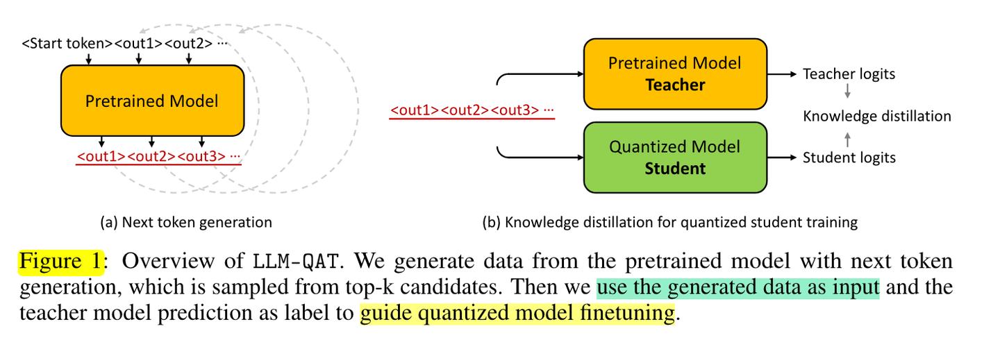

### QAT

**预备知识**
本文的作者研究了线性量化，即均匀量化。 根据实际值是否被截断（clipped），线性量化可以分为两类：保留所有值范围的 MinMax 量化和基于截断（裁剪）的量化。

在 MinMax 量化中，量化过程可以用如下公式表示：

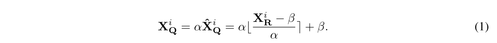

这里 XQ 和 XR 分别表示量化的变量和全精度的变量。 i 指的是张量中的第 i 个元素。 α 是缩放因子，β 是零点（zero-point）值。 对于对称量化， 。对于非对称量化， 。

**与 MinMax 量化相比，截断异常值有助于提高精度并为中间值分配更多位**。 因此，最近的许多工作（Q-BERT、Ternarybert）对基于 Transformer 的语言模型采用了基于裁剪的量化。 量化可以表示为：

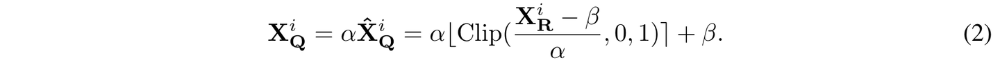

其中，缩放因子α和零点值β可以通过统计计算或通过梯度学习。

**大模型量化**

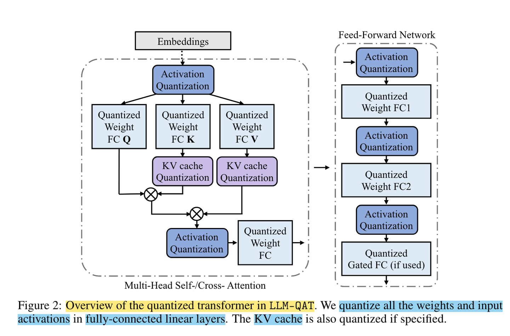

**量化函数：**图 2 为量化 Transformer 模型的示例图。根据 Llm.int8 () 和 Smoothquant 中的发现，我们还观察到在大语言模型（LLM）中，**权重和激活都存在显著的异常值 。 这些异常值对量化过程有显著影响，因为它们有助于增加量化步长，同时降低中间值的精度。**

但**事实证明，在量化过程中裁剪这些异常值不利于 LLM 的性能**。 在训练的初始阶段，任何基于裁剪的方法都会导致异常高的困惑度（perplexity）分数（即> 10000），从而导致大量信息丢失，并且事实证明很难通过微调来恢复。 因此，我们选择保留这些异常值。 此外，我们还发现在具有门控线性单元（GLU）的模型中，激活权重大多是对称分布的。 根据我们的分析和经验观察，我们为权重和激活选择对称 MinMax 量化，公式如下所示：

其中， XQ 表示量化后的权重或激活，XR 表示实际的权重或激活。 为了确保有效的量化，我们采用 per-token 激活量化和 per-channel 权重量化，如图 3 (a) 所示。 

**键值缓存的量化感知训练**：除了权重和激活量化之外，大语言模型（LLM）中的键值缓存（KV 缓存）也会消耗不少的内存。 然而，之前只有少数工作解决了 LLM 中的 KV 缓存的量化问题，且方法主要局限于训练后量化（High-throughput generative inference of large language models with a single gpu）。 在我们的研究中，我们证明了可以采用用于激活量化的类似量化感知训练方法来量化 KV 缓存。 如图 3 所示，我们在等式 3 中采用Per-token量化。 假设key和value是由token生成的。 在生成过程中，当前的key和value都会被量化，并存储它们对应的缩放因子。 在 QAT 的训练过程中，我们对 key 和 value 的整个激活张量进行量化，如图 2 所示。通过将量化函数集成到梯度计算中，确保使用量化的键值对进行有效的训练。

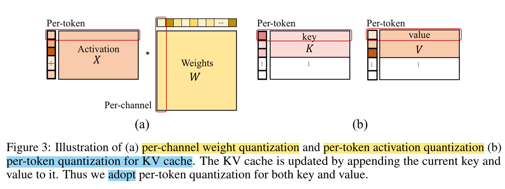

**知识蒸馏**：我们使用基于交叉熵的 logits 蒸馏从全精度预训练教师网络训练量化的学生网络，公式如下所示：

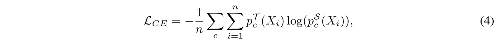

其中， i 表示当前批次中的第 i 个样本，总共有 n 个句子。 c 表示类的数量，在文本的例子中，它等于词汇量的大小。 T和S分别是教师网络和学生网络。

**在数据生成过程中，从分布中采样下一个Token是非常重要的，而不是总是选择 top-1 候选Token。**通过这样做，下一个Token不一定代表训练学生模型的最佳标签，因为采样会**引入固有的噪声**。 因此，我们建议利用预训练模型的预测作为软标签，这为指导学生模型的训练**提供了更多信息的目标**。

## 实验

本文通过在 LLaMA-7B/13B/30B 模型上进行实验并展示各种任务的结果来评估本文提出的方法的有效性。 

具体来说，本文采用了三种训练后量化方法 round-to-nearest (RTN)、 GPT-Q 和 SmoothQuant 作为基线，在BoolQ、PIQA、SIQA、HellaSwag、WinoGrande、ARC和 OBQA 数据集上针对不同的量化方法对比了常识推理任务的零样本性能，还在 TriviaQA 和 MMLU数据集上评估了不同的量化方法的小样本性能，同时，在 WikiText2和 C4 数据集上对比了不同的量化方法的困惑度分数 。其中，**困惑度评估用于验证量化模型是否能够在其训练域的不同样本上保留模型的输出分布**。 **零样本和少样本评估则衡量模型在下游任务上的能力是否得到保留**。

### 关键结果

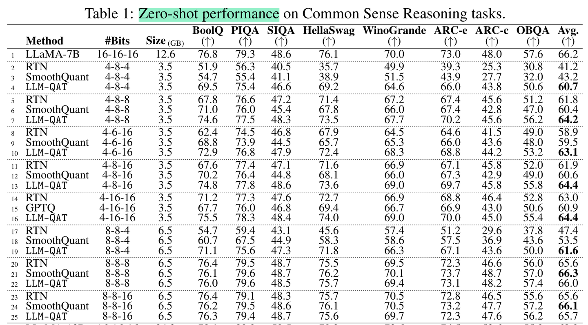

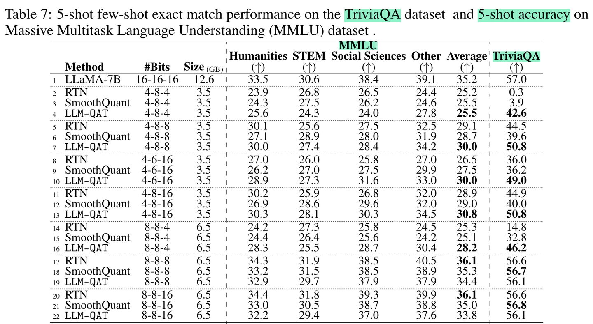

从表1、表2、表7看到，他们的趋势基本相似。 所有方法在所有模型规模的 8 比特量化中往往表现良好。 即使 KV 缓存连同权重和激活都被量化为 8 比特，这一点仍然成立。 然而，当这三个值中的任何一个被量化为小于 8 比特时，PTQ 方法会导致精度损失，而 LLM-QAT 的情况要好很多。

对于从业者来说，一个重要的问题是是**选择使用全精度的小模型，还是选择具有类似推理成本的较大的量化模型？**

虽然确切的权衡可能会因多种因素而异，但作者根据本文的结果提出了一些建议。

首先，**使用8比特量化的大模型应该优于较小的全精度模型**，并且 **PTQ 方法足以满足这种情况**。使用 8-8-8 量化的 30B 模型优于类似大小的 13B 模型，并且在实践中应该具有更低的延迟和更高的吞吐量。 这也适用于 8 比特 13B 模型与 16 比 的 7B 模型相比。

此外，**使用 LLM-QAT 量化的 4 比特的模型应该优于类似大小的 8 比特模型**。 例如，使用 LLM-QAT 方法进行 4-8-4 量化的 LLaMA-30B 模型优于 8 比特的 LLaMA-13B，使用 LLM-QAT 方法进行 4-8-8 量化的 LLaMA-13B 优于 8 比特的 LLaMA-7B。

因此，作者建议使用 4 比特的 LLM-QAT 模型，以实现最佳效率与精度的权衡。

### 消融实验

本文分别对数据选择策略、量化方法和知识蒸馏方法进行了消融研究。 并公布了 WikiText2/C4 数据集上的困惑度分数以及零样本常识推理任务的性能。

**数据选择策略**

为了对不同量化选择进行综合评估，我们在第 3.3.2 节中提供了消融研究。

通过表 3 观察到使用从维基百科提取的文本构建的 WikiText并不包含预训练期间使用的所有信息。 因此，仅在 WikiText 上微调的模型往往会过拟合该特定数据集，并且很难很好地普及到其他数据集。 另一方面，爬虫语料库 (C4) 数据集包含从网络收集的数百 GB 的干净英语文本。 在 C4 上的微调模型，在 WikiText 数据集上进行评估时，可以产生合理的迁移精度。 然而，在执行零样本推理任务时，它的准确性较差。 与现有数据相比，根据生成的数据进行微调的模型表现出优异的通用性，特别是在零样本任务中。 此外，**与未采样生成的数据相比，通过从分布采样生成的数据表现出更大的多样性， 这种增强的多样性可以显著提高所有任务的性能**。

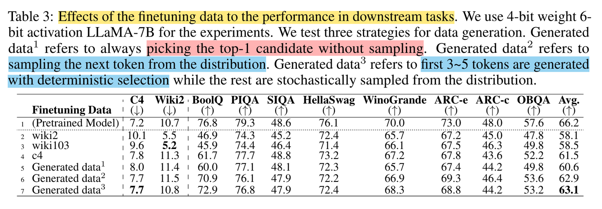

**量化方法对比**

本文将非裁剪量化方法与基于裁剪的量化方法进行了比较，如表 4 所示。

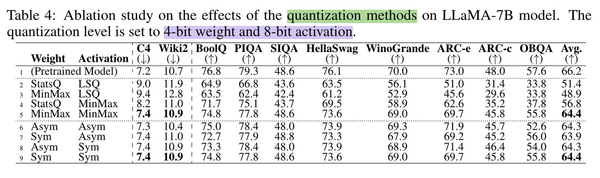

遵循之前工作（Bit: Robustly binarized multi-distilled transformer 和 Data-Free Neural Architecture Search via Recursive Label Calibration）中的做法，本文使用了 StatsQ（一种统计计算的缩放因子，用于基于裁剪的权重量化）和 LSQ（一种可学习的缩放因子，用于基于裁剪的激活量化）。

然而，本文的研究结果表明，这两种最先进的基于裁剪的量化方法并没有超过非裁剪对称方法MinMax所实现的性能。这一观察结果强化了这样的论点：**保留异常值对于大语言模型的性能至关重要**。

此外，作者还观察到，**对于 LLaMA 模型，激活和权重主要表现出对称分布，这使得使用对称量化成为最佳选择**。 然而，这个结论可能不适用于其他大型语言模型，尤其是那些包含 GeLU 层的语言模型。

**知识蒸馏**

表5显示了不同的知识蒸馏方法对微调模型的最终精度有显著的影响。

值得注意的是，由于在生成过程中从候选分布中进行采样所引入的固有随机性和噪声，因此，单独使用下一个Token作为标签并不是最优的。相比之下，logit 蒸馏则利用了教师模型的完整 logit 分布预测，与基于标签的训练方法相比，其微调模型的性能更优越。同时，作者观察到组合注意力蒸馏或隐藏层蒸馏实际上会阻碍性能。因此，作者在所有实验中专门采用 Logit 蒸馏。

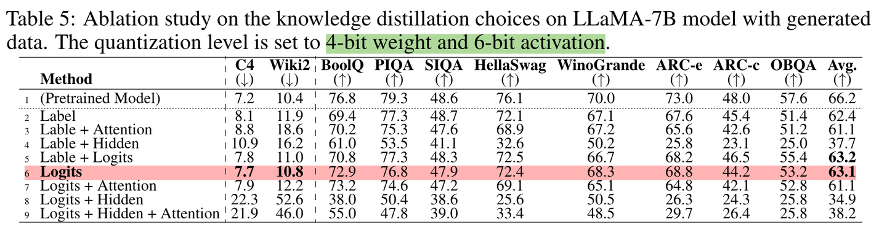

**与 SmoothQuant 的兼容性**

本文的方法还与 SmoothQuant中提出的权重激活重新缩放技术兼容。

表 6 显示，将 SmoothQuant 合并到 4 比特权重 4 比特激活 (W4A4) 量化中可以进一步提高精度。然而，在激活比特大于权重比特（即W4A8）的情况下，添加SmoothQuant不会产生任何改进，甚至可能会损害性能。

