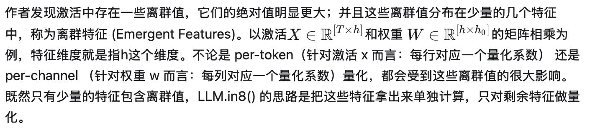
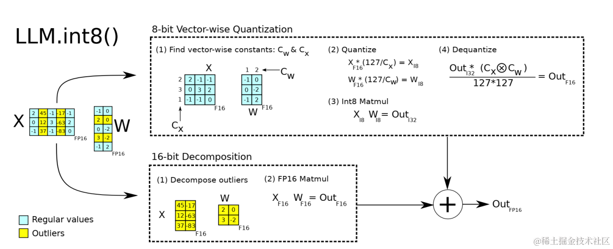
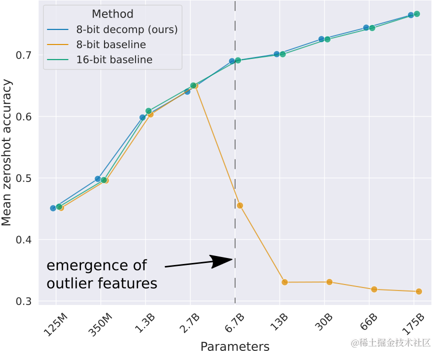
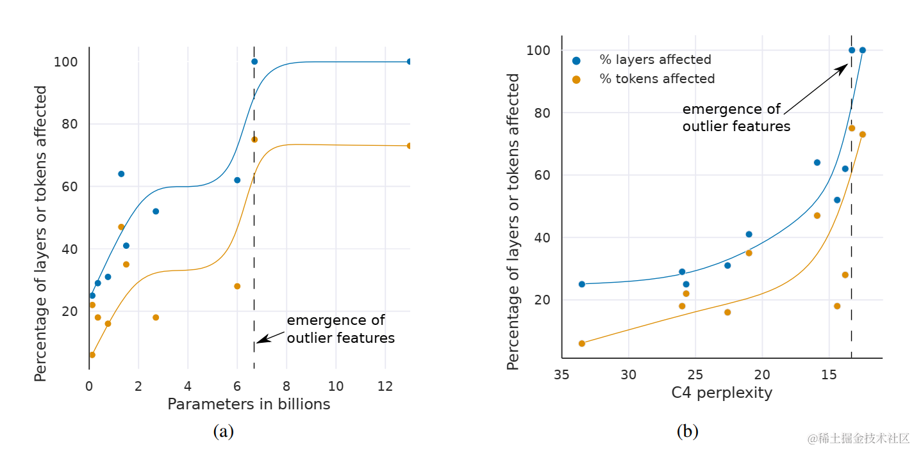
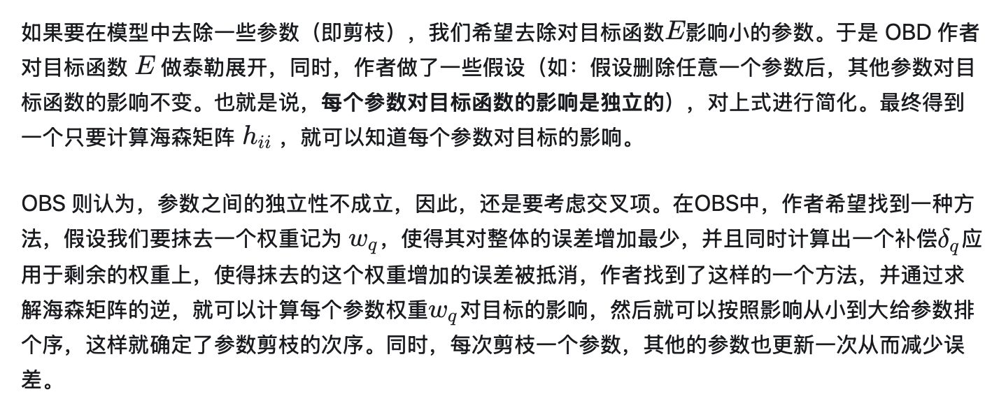
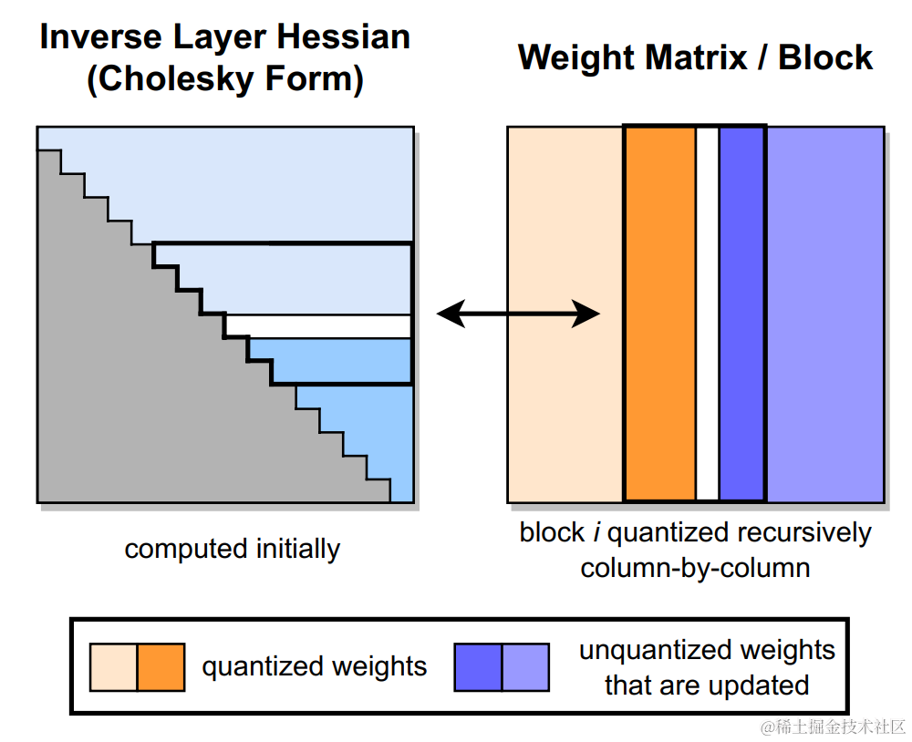
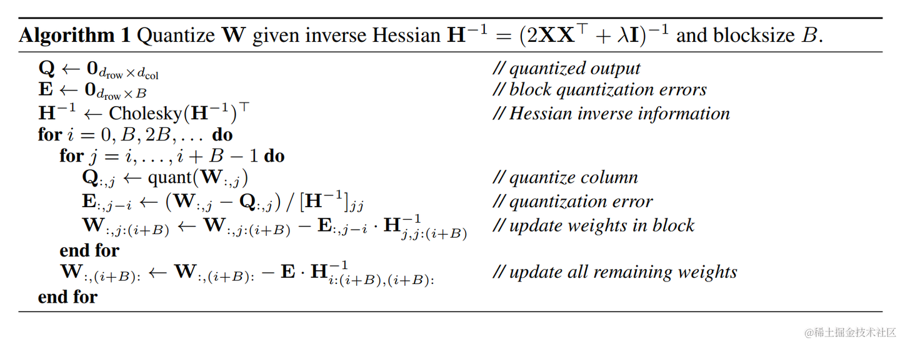

# 大模型量化技术原理-LLM.int8()、GPTQ

https://zhuanlan.zhihu.com/p/680212402

系列将针对大模型的一些常见训练后量化方案（GPTQ、LLM.int8()、SmoothQuant、AWQ等）进行讲述。

- [大模型量化概述](https://www.zhihu.com/question/627484732/answer/3261671478)
- [大模型量化技术原理-GPTQ、LLM.int8()](https://zhuanlan.zhihu.com/p/680212402/edit)
- [大模型量化技术原理-SmoothQuant](https://zhuanlan.zhihu.com/p/680212402/edit)
- [大模型量化技术原理-AWQ、AutoAWQ](https://zhuanlan.zhihu.com/p/680212402/edit)
- [大模型量化技术原理-SpQR](https://zhuanlan.zhihu.com/p/680212402/edit)
- [大模型量化技术原理-ZeroQuant系列](https://zhuanlan.zhihu.com/p/680212402/edit)

而本文主要针对大模型量化技术LLM.int8()、GPTQ进行讲述。

## 大模型量化的对象

大模型量化的对象主要有：权重、激活、KV Cache、梯度、优化器等。由于梯度量化主要在训练场景使用，用于减少反向传播时的计算和通信开销。优化器量化（如：8-Bit Optimizers Via Block-Wise Quantization）也是用于训练场景；因此，本系列仅讨论**权重、激活、KV Cache量化**方案。

- 仅权重量化，如：W4A16、AWQ及GPTQ中的W4A16，W8A16（权重量化为INT8，激活仍为BF16或FP16）
- 权重、激活量化，如：SmoothQuant中的W8A8
- KV Cache INT8 量化，LLM 推理时，为了避免冗余计算，设计了 KV Cache 缓存机制，本质上是空间换时间，由于 KV Cache 的存在，对于支持越长的文本长度的 LLM， KV Cache 的显存占用越高。 因此，KV Cache 的量化也是有很必要的。

## LLM.int8()

### 背景



### 技术原理

LLM.int8()（论文：**LLM.int8(): 8-bit Matrix Multiplication for Transformers at Scale**）是一种采用混合精度分解的量化方法。该方案先做了一个矩阵分解，对绝大部分权重和激活用8bit量化（vector-wise）。对离群特征的几个维度保留16bit，对其做高精度的矩阵乘法。



image.png

LLM.int8() 通过三个步骤完成矩阵乘法计算:

1. 从输入的隐含状态中，按列提取异常值 (离群特征，即大于某个阈值的值)。
2. 对离群特征进行 FP16 矩阵运算，对非离群特征进行量化，做 INT8 矩阵运算；
3. 反量化非离群值的矩阵乘结果，并与离群值矩阵乘结果相加，获得最终的 FP16 结果。

实验结果表明该方法效果良好。可以通过使用 LLM.int8() 的量化过程来恢复全部性能。您可以清楚地看到随着模型参数量逐渐变多 8 比特基线（即 vector-wise quantization）的性能大幅下降。 而 LLM.int8() 方法使用**vector-wise quantization**和**混合精度分解**来恢复全部性能。



image.png

虽然 LLM.in8() 带来的性能下降微乎其微，但是这种分离计算的方式**拖慢了推理速度**。对于 BLOOM-176B，相比于 FP16，LLM.int8() 慢了大约 15% 到 23%；对于更小的模型（3B 和 11B），速度差距更为明显，LLM.int8() 慢了三倍以上。

此外，论文中测量了异常值特征对于注意力和预测性能的影响。

下图展示了 Transformer 中受模型大小或 C4 困惑度影响的大量异常值特征的层和所有序列维度的百分比。

从图中可知，当通过参数数量进行测量时，Transformer 所有层上的大幅异常值特征突然出现在 6B 和 6.7B 参数之间。受影响层的百分比从 65% 增加到 100%， 受影响的序列维度数量从 35% 迅速增加到 75%。 这种突然的转移与量化开始失败的点同时发生。

当通过困惑度（perplexity）进行测量时，Transformer 所有层中大量异常值特征的出现可以被视为**根据困惑度递减的指数函数**平滑的出现。这表明异常值的出现并不是突然的，并且通过研究较小模型中的指数趋势，我们也许能够在相移（相位移动，Phase shift，是一个物理学和工程学中常用的术语。它指的是一个波形在时间上发生的移位现象）发生之前检测到异常值出现的特征。这也表明，**异常值的出现不仅与模型大小有关，还与困惑度有关**，而困惑度与多个其他因素有关，例如：使用的训练数据量和数据质量。



image.png

如下图a所示，一旦异常值特征出现在Transformer的所有层中，中间的异常值特征量值就会迅速增加。大量异常值特征及其不对称分布破坏了 Int8 量化精度。 这是量化方法从 6.7B 开始失败的核心原因——量化分布的范围太大，导致大多数量化 bins 为空，小的量化值被量化为零，基本上消除了信息。我们推测，除了 Int8 推理之外，由于超出 6.7B 参数范围，常规 16 位浮点训练也会因异常值而变得不稳定。如果通过向量填充乘以 60 的值，很容易偶然超过最大 16 位值 65535。

如下图b所示，离群值特征的数量相对于 C4 困惑度的降低严格单调增加，而与模型大小的关系是非单调的。 这表明模型的困惑度（perplexity）决定了相移，而不仅是模型的大小。 我们推测模型大小只是离散特征出现所需的众多协变量中的一个重要协变量。


image.png

目前，LLM.int8() 的实现主要在 `bitsandbytes` 库；之前的文章 [大模型微调实战（八）-使用INT8/FP4/NF4微调大模型](https://link.zhihu.com/?target=https%3A//juejin.cn/post/7308901392471015475) 中介绍过`bitsandbytes` 库，同时，transformers 库已经集成并 **原生** 支持了 bitsandbytes 这个量化库。课可以说 bitsandbytes 是量化任何模型的最简单方法之一，因为它不需要量化校准数据及校准过程 (即零样本量化)。任何模型只要含有 `torch.nn.Linear` 模块，就可以对其进行开箱即用的量化。每当在 `transformers` 库中添加新架构时，只要其可以用 `accelerate` 库的 `device_map="auto"` 加载，用户就可以直接受益于开箱即用的 bitsandbytes 量化，同时该方法对性能的影响也是最小的。量化是在模型加载时执行的，无需运行任何后处理或准备步骤。与此同时，LLM.int8() 作者提出的另一种 QAT 量化方案 QLoRA 也是基于 bitsandbytes 进行实现。

在 Transformers 中使用 LLM.int8() 只需提前安装 bitsandbytes 即可，使用 LLM.int8() 方法量化transformer模型具体示例如下：

8bit量化：

```text
from transformers import AutoModelForCausalLM
model = AutoModelForCausalLM.from_pretrained(
  'decapoda-research/llama-7b-hf',
  device_map='auto',
  load_in_8bit=True,
  max_memory={
    i: f'{int(torch.cuda.mem_get_info(i)[0]/1024**3)-2}GB'
    for i in range(torch.cuda.device_count())
  }
)
```

4bit量化：

```text
from transformers import BitsAndBytesConfig

nf4_config = BitsAndBytesConfig(
   load_in_4bit=True,
   bnb_4bit_quant_type="nf4",
   bnb_4bit_use_double_quant=True,
   bnb_4bit_compute_dtype=torch.bfloat16
)

model_nf4 = AutoModelForCausalLM.from_pretrained(model_id, quantization_config=nf4_config)
```

## GPTQ

### 背景

GPTQ 并不是凭空出现的，它的原理来自于另一个量化方法OBQ(Optimal Brain Quantization)，而OBQ 实际上是对 OBS(Optimal Brain Surgeon，一种比较经典的剪枝方法）的魔改， 而OBS则来自于OBD（Optimal Brain Damage，由 Yann LeCun 在1990年提出的剪枝方法）。



OBQ 把它推广到量化中，剪枝是一种特殊的量化，常用的量化是把数值近似到一个接近的值，而剪枝实际上可以看做把数值直接近似成0，可以理解为一种特殊的量化。

OBQ 不错，但是太慢，OBQ 在一小时左右量化一个 ResNet50，在大模型（如：GPT3）上可能要数天。GPTQ 对 OBQ 做了一些算法和性能上的优化，在降低量化算法复杂度的同时保留了模型的精度，因而可以实现大模型的高效量化。可以说 GPTQ 是它的加速版，使用 GPTQ 量化一个 Bloom 模型 (176B) 则只需不到 4 个小时；并且 GPTQ 的量化有严谨的数学理论推导，所有的算法步骤都有理论支撑。

### 技术原理

GPTQ(论文：**GPTQ: ACCURATE POST-TRAINING QUANTIZATION FOR GENERATIVE PR E-TRAINED TRANSFORMERS**) 采用 int4/fp16 (W4A16) 的混合量化方案，其中模型权重被量化为 int4 数值类型，而激活值则保留在 float16，是一种仅权重量化方法。在推理阶段，模型权重被动态地反量化回 float16 并在该数值类型下进行实际的运算；同 OBQ 一样，GPTQ还是从单层量化的角度考虑，希望找到一个量化过的权重，使的新的权重和老的权重之间输出的结果差别最小。

GPTQ 将权重分组（如：128列为一组）为多个子矩阵（block）。对某个 block 内的所有参数逐个量化，每个参数量化后，需要适当调整这个 block 内其他未量化的参数，以弥补量化造成的精度损失。因此，GPTQ 量化需要准备校准数据集。

GPTQ 量化过程如下图所示。首先，使用 Cholesky 分解中 Hessian 矩阵的逆，在给定的step中对连续列的块（粗体）进行量化，并在step结束时更新剩余的权重（蓝色）。量化过程在每个块内递归应用：白色中间列表示当前正在被量化。



image.png

GPTQ 的创新点如下：

- **取消贪心算法**：OBS 采用贪心策略，先量化对目标影响最小的参数；但 GPTQ 发现直接按顺序做参数量化，对精度影响也不大。这项改进使得**参数矩阵每一行的量化可以做并行的矩阵计算**（这意味着我们可以独立地对每一行执行量化。即所谓的 per-channel quantization）。对于大模型场景，这项改进使得量化速度快了一个数量级；
- **Lazy Batch-Updates**：OBQ 对权重一个个进行单独更新，作者发现性能瓶颈实际在于GPU的内存带宽，而且同一个特征矩阵W不同列间的权重更新是不会互相影响的。因此作者提出了延迟批处理的方法，通过延迟一部分参数的更新，一次处理多个（如：128）列，来**缓解带宽的压力**，大幅提升了计算速度。
- **Cholesky 分解**：用 Cholesky 分解求海森矩阵的逆，提前计算好所有需要的信息，在**增强数值稳定性**的同时，后续更新的过程中再计算，进一步减少了计算量。

GPTQ的伪代码如下所示，包括了上面讨论的一些优化：



image.png

该方案有以下两方面的优点：

- int4 量化能够节省接近4倍的内存，这是因为反量化操作发生在算子的计算单元附近，而不是在 GPU 的全局内存中。
- 由于用于权重的位宽较低，因此可以节省数据通信的时间，从而潜在地提升了推理速度。

一般来说，GPTQ推荐使用8-bit量化及groupsize = 128。

目前，社区存在一些基于 GPTQ 算法大语言模型量化工具，如：AutoGPTQ、[GPTQ-for-LLaMa](https://link.zhihu.com/?target=https%3A//github.com/qwopqwop200/GPTQ-for-LLaMa) 、[Exllama](https://link.zhihu.com/?target=https%3A//github.com/turboderp/exllama) 和 [llama.cpp](https://link.zhihu.com/?target=https%3A//github.com/ggerganov/llama.cpp/) ， 其中，[GPTQ-for-LLaMa](https://link.zhihu.com/?target=https%3A//github.com/qwopqwop200/GPTQ-for-LLaMa) 、[Exllama](https://link.zhihu.com/?target=https%3A//github.com/turboderp/exllama) 和 [llama.cpp](https://link.zhihu.com/?target=https%3A//github.com/ggerganov/llama.cpp/) 主要针对 Llama 模型架构实现量化策略。相较之下，AutoGPTQ 因其对丰富的 Transformers 架构的平滑覆盖而广受欢迎。

同时，[AutoGPTQ](https://link.zhihu.com/?target=https%3A//github.com/PanQiWei/AutoGPTQ) 代码库集成到了 Transformers 中，让用户使用 GPTQ 算法在 8 bit、4 bit、3 bit，甚至是 2 bit 精度下量化和运行模型成为可能。当使用 int4 量化时，精度的下降可以忽略不计，同时在小批量推理上保持着与 `fp16` 基线相当的速度。需要注意的是，GPTQ 方法与 bitsandbytes 提出的训练后量化方法有所不同，GPTQ 需要在量化阶段提供一个校准数据集。

在 Transformers 中使用 GPTQ 只需提前安装AutoGPTQ和[Optimum](https://link.zhihu.com/?target=https%3A//github.com/huggingface/optimum)即可，使用 GPTQ 方法量化transformer模型具体示例如下：

```text
from transformers import AutoModelForCausalLM, AutoTokenizer, GPTQConfig

model_id = "facebook/opt-125m"
tokenizer = AutoTokenizer.from_pretrained(model_id)
quantization_config = GPTQConfig(bits=4, dataset = "c4", tokenizer=tokenizer)

model = AutoModelForCausalLM.from_pretrained(model_id, device_map="auto", quantization_config=quantization_config)
```

## 结语

本文简要介绍了两种比较常用的大模型量化方法 GPTQ、LLM.int8()；LLM.int8() 属于 round-to-nearest (RTN) 量化：舍入到最近的定点数。而 GPT-Q 则是把量化问题视作优化问题，逐层寻找最优的量化权重。目前，这两种量化方法也集成到了Transformers库中，大家可以非常方便的使用。

码字不易，如果觉得我的文章能够能够给您带来帮助，期待您的点赞收藏加关注~~

## 参考文档

- [大语言模型的模型量化(INT8/INT4)技术](https://zhuanlan.zhihu.com/p/627436535)
- [https://github.com/TimDettmers/bitsandbytes](https://link.zhihu.com/?target=https%3A//github.com/TimDettmers/bitsandbytes)
- [https://timdettmers.com/2022/08/17/llm-int8-and-emergent-features/](https://link.zhihu.com/?target=https%3A//timdettmers.com/2022/08/17/llm-int8-and-emergent-features/)
- [https://huggingface.co/blog/zh/hf-bitsandbytes-integration](https://link.zhihu.com/?target=https%3A//huggingface.co/blog/zh/hf-bitsandbytes-integration)
- [https://huggingface.co/blog/zh/4bit-transformers-bitsandbytes](https://link.zhihu.com/?target=https%3A//huggingface.co/blog/zh/4bit-transformers-bitsandbytes)
- [https://github.com/IST-DASLab/gptq](https://link.zhihu.com/?target=https%3A//github.com/IST-DASLab/gptq)
- [https://github.com/AutoGPTQ/AutoGPTQ](https://link.zhihu.com/?target=https%3A//github.com/AutoGPTQ/AutoGPTQ)
- [https://huggingface.co/blog/zh/gptq-integration](https://link.zhihu.com/?target=https%3A//huggingface.co/blog/zh/gptq-integration)
- QLoRA、GPTQ：模型量化概述：https://zhuanlan.zhihu.com/p/646210009
- NLP（十一）：大语言模型的模型量化(INT8/INT4)技术：https://zhuanlan.zhihu.com/p/627436535
- [GPTQ-for-LLaMa 量化分析和优化](https://link.zhihu.com/?target=https%3A//mp.weixin.qq.com/s%3F__biz%3DMzU3Mzg5ODgxMg%3D%3D%26mid%3D2247485822%26idx%3D1%26sn%3D7fd1b859df52eb67419326e3cedc9228%26chksm%3Dfd3be02dca4c693be9b90ebe2b190f46a41de33cc8b8b2c54db086635ed8172c9fdf972758b0%26token%3D343937971%26lang%3Dzh_CN%23rd)