# FP8

https://www.zhihu.com/question/658712811/answer/3596678896

本文将讲述FP8量化相关的一些工作。

> 文章较长，建议先点赞收藏，后续再慢慢观看。另外，我撰写的**大模型相关的博客及配套代码**均整理放置在Github：[llm-action](https://link.zhihu.com/?target=https%3A//github.com/liguodongiot/llm-action/tree/main)，有需要的朋友自取。

## FP8 简介

FP8 是 Nvidia、Arm、Intel 联合推出的8位浮点数据格式，用于加速深度学习训练和推理，其发布了论文：**FP8 Formats for Deep Learning**。目前，在 Nvidia Hopper 和 Ada Lovelace 等 GPU 上提供了支持。

## 补充：浮点表示法

根据 IEEE 754 标准，在计算机中，使用符号位、指数、尾数三部分表示一个浮点数。

- **符号位**：表示数值的符号，只占用1bit，0-表示整数，1-表示负数。
- **指数部分**：表示数值的指数（阶码数值）部分，决定了数的范围。
- **尾数部分**：表示数值的底数部分，决定了数的精度和小数部分的具体值。

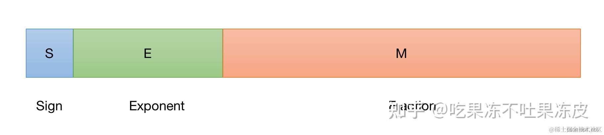

浮点数的表示公式为：

V = (-1)^s \times 2^E \times M \\

比如，FP32 的表示如下所示

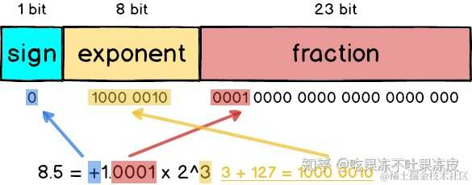


浮点数根据指数位的值分为规格化，非规格化和特殊值（无穷和NAN）。

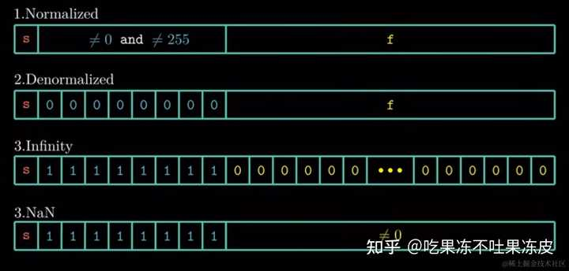

对于规格化的值，指数位不全为1或0，其中，E= p - b ， b = 2^{e-1}-1 ， 1 \leq p \leq 2^e -1-1 ， M = 1 + f

也可以表示为：

f = (-1)^s 2^{p-b} \left( 1 + \frac{d_1}{2} + \frac{d_2}{2^2} + \cdots \frac{d_m}{2^m} \right) \\

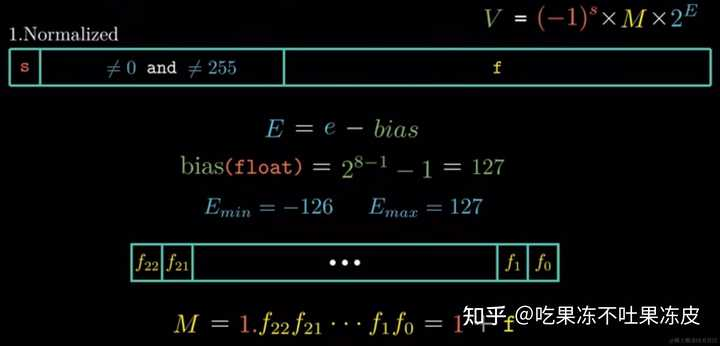

对于非规格化的值，指数位全为0；因此，p=1，E= 1 - b ， b = 2^{e-1}-1 ， M = f

也可以表示为：

f = (-1)^s 2^{1-b} \left(0 + \frac{d_1}{2} + \frac{d_2}{2^2} + \cdots \frac{d_m}{2^m} \right) \\

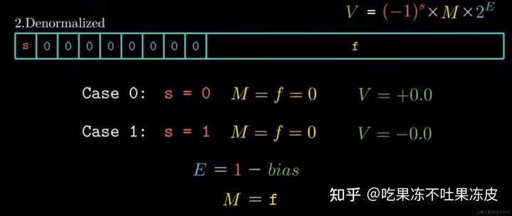

对于特殊值，当指数位为全为1，同时尾数位全为0时，表示无穷。当指数位为全为1，同时尾数位不全为0时，表示NaN。

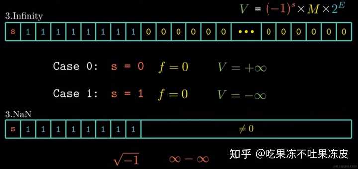

## FP8 表示形式

通常，在硬件中 FP8 有两种不同的表示形式：E4M3、E5M2，每种表示形式在不同的场景中都有用。**根据指数位数表示为 FP8-E[X]，有些地方也会对FP8-E2（E2M5）、FP8-E3(E3M4)格式同步进行研究，以理解这些格式的行为**。

- E4M3：由1位符号位、4位指数位、3位尾数组成。它可以存储高达 +/-448 和 `nan` 的值。
- E5M2：由1位符号位、5位指数位、2位尾数组成。它可以存储最多 +/-57344、+/- `inf` 和 `nan` 的值。

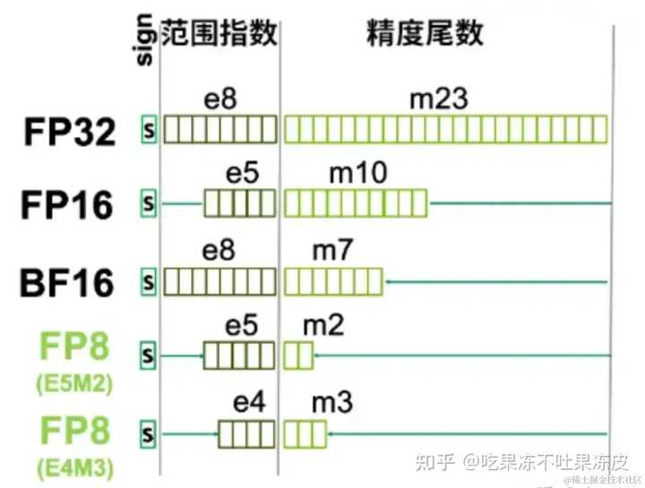

E4M3 能表示的精度更高，而 E5M2 能表示的动态范围更大，增加动态范围的代价是存储值的精度较低。

FP8 精度的 E5M2 数据格式的指数部分，与 FP16 的保持一致。这意味着 FP8 精度的 E5M2 数据格式具备与 FP16 相当的动态范围，因此该数据格式常被用在训练的反向传播阶段。而 E4M3 则适合前向传播。

在 H100 的第四代 Tensor Core 中，支持任意的 FP8 格式矩阵的乘法 （E4M3xE4M3, E5M2xE5M2, E4M3xE5M2, E5M2xE4M3），然后会进行累加到 FP32 和 FP16 的数据格式中，同时也支持浮点格式之间的互相转换。

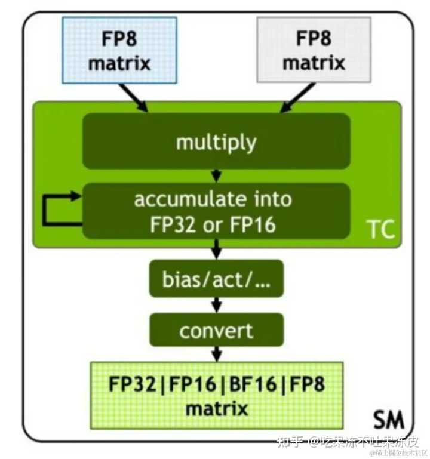

E5M2 完全遵循上面的 IEEE 754 的浮点数格式，示例如下

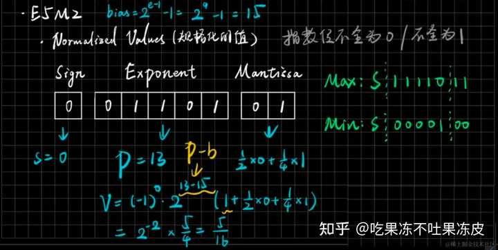

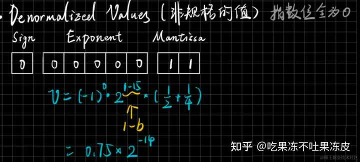

而 E4M3 不完全遵循 IEEE 754 的数据格式，**主要不同在于当指数位全为1时，一样可以用来表示规格化的值**（当小数位不为1），当且仅当指数与底数全为1时，其表示NaN，同时，E4M3不能用来表示 Infinites。比如：

- 二进制的 (0 1111 110) 在 FP8 E4M3 格式中表示 2^(15-7) * (1+1/2 + 1/4) = 448
- 二进制的 (1 1111 100) 在 FP8 E4M3 格式中表示 -2^(15-7) * (1+1/2) = -384
- 二进制的 (1 1111 111) 在 FP8 E4M3 格式中表示负无穷大

一些常见的FP8二进制格式如下所示：

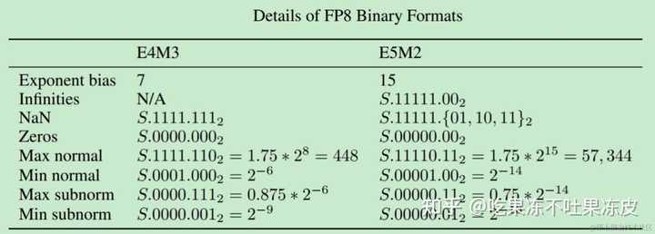

根据表示的方式，可以把浮点数看成 2 的幂（2^E）之间的 2^M 个样本的精度；比如，在 E5M2 中，2 和 4 之间会有 4 个样本，4 和 8 之间也会有 4 个样本；在 E4M3 中，2 和 4 之间有 8 个样本。通过这一特性，可以容易得出：

- E5M2量化误差比E4M3更大。
- FP8表示的数值是非均匀的，浮点量化的误差会随着数值变化的增大而增大。

FP8量化误差示意图如下所示：

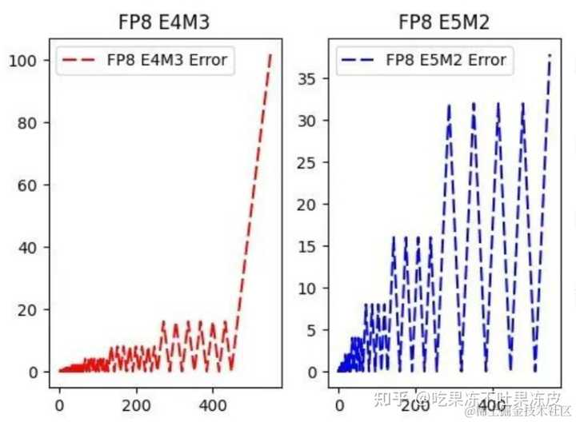

FP8与INT8的数值分布示意图如下所示，对FP8来说，越靠近0，分布越稠密，越远离0，分布越稀疏；

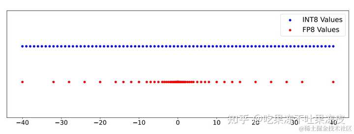

## INT8 与 FP8 对比

### FP8 与 INT8 量化精度

针对不同的数值分布，高通AI研究院的研究人员在**FP8 versus INT8 for efficient deep learning inference** 中 给出了INT8和FP8量化后的精度对比，纵坐标值越大，精度越好。

- 对于均匀分布，INT8的精度是最好的，FP8-E4和FP8-E5的精度较差。
- 对于正态分布，FP8-E2（具有2个指数位、5个尾数位和1个符号位）的精度是最好的，INT8的精度紧随其后，FP8-E4和FP8-E5的精度较差。
- 而对于具有异常值的t-分布，量化精度普遍较差，其中FP8-E4的精度稍好。

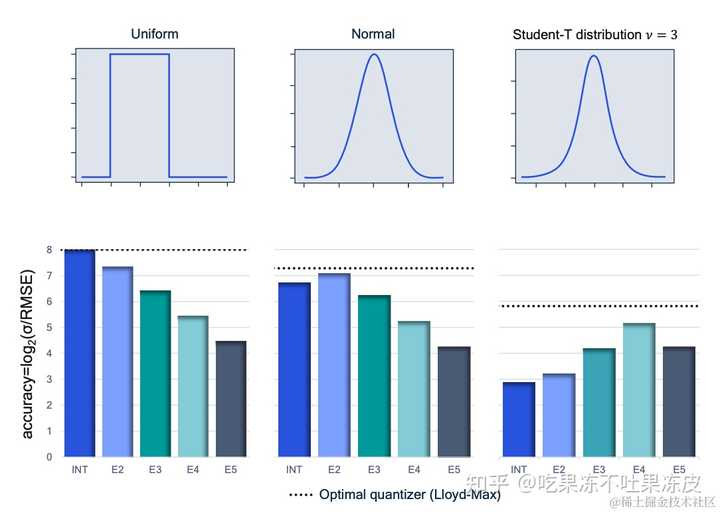

对于权重与激活量化，**Integer or Floating Point? New Outlooks for Low-Bit Quantization on Large Language Models** 中统计了LLaMA-65B各层权重的Per Channel量化后的偏差，并对结果进行了排序，结果表明INT8在所有层的权重量化的精度方面要明显好于FP8-E4。

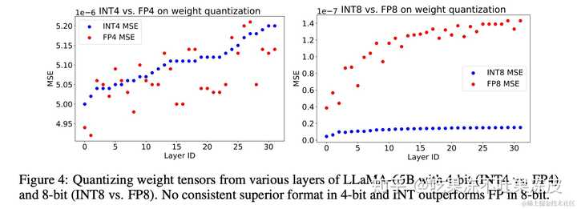

同时，也统计了 LLaMA-65B各层激活值的 Per Tensor 量化后的偏差，并对结果进行了排序，结果表明FP8-E4在大多数层的激活值量化的精度方面要好于INT8。论文中对该结果进行了解释：**激活值是动态的，随着每个输入的不同而变化，因此需要使用校准集来确定量化Scale；校准过程是选择所有Batch的最大值来计算量化Scale，导致非最大值所在的Batch量化后的数值普遍偏小，而FP8-E4对于小值的精度更好。**

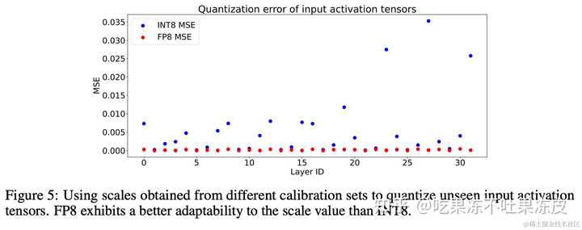

因此，INT8和FP8不存在哪一个有绝对优势，可以根据不同的层的实际loss进行选择。相对来说，INT8量化更适合于权重，FP8-E4量化更适合于大多数层的激活值。

### FP8 与 INT8 量化性能

以 Nvidia L40(Ada Lovelace) GPU 为例，其硬件参数如下：

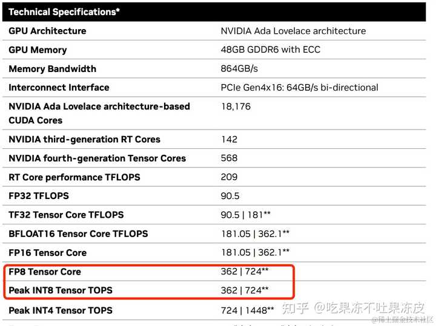

可以发现 FP8 Tensor Core和 INT8 Tensor Core 的计算能力是相同的。该硬件参数在H800、L20和L40S上也是相同的。

同时，**Integer or Floating Point? New Outlooks for Low-Bit Quantization on Large Language Models** 中针对不同位宽（INT/FP）的运算进行比较，如加法器、乘法器、乘法累加运算单元（multiply-accumulate (MAC) ）。对于8位MAC，乘法器为8位，累加器为16位，以防止溢出。

对于在 DNN 中作为矩阵乘法的基本构建块的 MAC 单元，FP 运算通常比 INT 运算需要更多的面积。然而，这种差异随着位宽的减小而缩小。有趣的是，在 8 位时，FP8 和 INT8 MAC 单元的面积要求几乎相同。这一观察结果表明 INT8 和 FP8 表现出相似的硬件成本和推理性能。与H800等GPU的硬件参数一致。

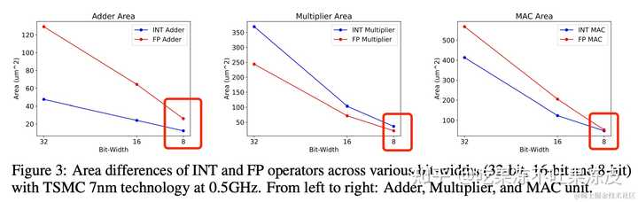

在深度学习中的累加器的示意图如下所示。权重和激活存储在内存中并移至 MatMul 计算单元。位宽对于传输数据的延迟和能耗都很重要。在计算单元进行矩阵乘法；位宽和格式都对延迟和能耗产生影响。累加器存储中间结果，可以选择其格式/位宽。最后，输出格式也可以选择，其中位宽决定了有多少位被传输并存储回内存中。


每个步骤（权重、激活、累加器以及写回内存的值的位宽和格式）都需要做出选择。不同的选择导致不同的表现。其效率取决于特定的架构和网络。

**FP8 versus INT8 for efficient deep learning inference** 中对比了实现不同类型的乘加计算单元所需的硬件。

下面是乘法累加单元中组件的示意图。深蓝色部分代表乘法本身所需的逻辑。灰色区域需要累加，绿色区域对齐/添加乘积到累加器。

左边是带有定点累加器的定点和浮点方案，对于定点累加和浮点输入，需要乘积流水阶段和乘积对齐（移位）。相反，整数输入则不需要。

右边是浮点累加器，浮点累加显著增加了复杂性，但累加器位数却更少。该设计保持累加器的标准化并假设舍入最近偶数。Nvidia 的 Hopper 架构支持 FP16 和 FP32 浮点累加。

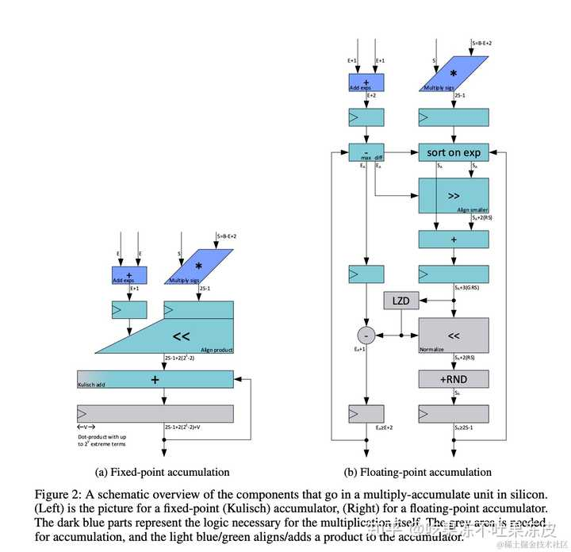

定点累加器对于 INT8 等数字格式来说既精确又高效，而浮点累加器虽然不精确，但对于具有大量指数位的数字格式（例如：FP8-E4）更高效，以允许覆盖更大的动态范围的乘积，而无需大幅增加累加器的大小。由于浮点累加器的不精确性质，求和的顺序很重要并且可能产生不同的结果。此外，总和越大，累加值就越不准确。

下图展示了硬件中实现每种格式和累加器组合所需的 2-input 门的数量，假设面积和功耗与构建设计所需的 2-input 门的数量成正比。从左到右，从 INT8 到 FP8-E5， 每三个一组，第一条代表定点累加器的结果。第二条表示 FP16 累加器的结果，第三条表示 FP32 累加器的结果。可以看到，与定点累加器相比，FP8-E4->16 位需要多 53% 的门，而 FP8-E4->32 位需要多 183% 的门才能在硬件中实现。


对于 INT8 一直到 FP8-E3，定点精度累加器是最高效的。**但对于 FP8-E4，浮点和定点累加器效率几乎持平**。而最重要的是，INT8 与 FP8-E4 相比，浮点格式的成本增加了 53%。如果使用 FP32 累加器，情况会明显变得更糟。与 INT8 相比，带有 FP32 累加器的 FP8-E4 格式效率低 183%。

因此，通过针对这两种格式的专用硬件实现，FP8-E4 在计算所需的面积和功耗方面比 INT8 更昂贵。如果模型因计算而成为瓶颈，这也将导致相对性能大幅下降。

### FP8 与 INT8 综合对比

1. INT8在数值空间是均匀分布的，将浮点数空间的数值按照等分区间映射到一个整数上，很多浮点数数值都会映射到相同的整数数值，从而损失边界特征值。而FP8仍然是浮点数，有更大的动态范围表示和更高的精度表示。
2. 混合精度训练时，FP8到FP16/FP32/BF16的转换，更简单直接，而INT8到FP的转化需要需要乘法和加法而导致更大的开销。
3. 在CPU上，FP8的速度会比INT8慢很多。
4. INT的量化步长是均匀的，总是以一定的步长完成量化，这是一种均匀的量化。而浮点的量化则是非均匀的，随着数值增大，其步长也在逐渐变大。且E5M2的步长变化较E4M3而言更加明显。从另一个角度出发，量化的误差总是与步长正相关的，因此**FP8浮点量化相比于INT8而言，对于小数来说会更加精确，但对于大数则更不精确**。

## FP8 量化方案

### FP8 量化模拟

来自高通AI研究院的论文 **FP8 Quantization: The Power of the Exponent**通过对FP8量化格式的深入分析，包括理论基础和实验验证。提出了一种一种在 FP32 硬件中模拟 FP8 量化的新方法，，该方法可加快 FP8 量化模拟速度，同时很容易地在常见的深度学习框架中实现，有助于快速进行PTQ和QAT，并且它暴露了FP8量化器的参数（即尾数/指数位和指数偏置值），允许通过反向传播学习这些参数。

最后得出FP8格式在多种网络模型的 PTQ 中通常优于INT8，5M2E 和 4M3E FP8 格式效果最好，而对于具有更多异常值（例如：Transformer）的神经网络模型，增加指数位数效果最好。同时，还表明在进行量化感知训练时，该格式的许多优点都会消失，因为网络模型学会了在 INT8 量化中也表现良好。

### MoFQ 混合格式量化方法

上海交通大学、北京大学和微软亚洲研究院联合发布的论文 I**nteger or Floating Point? New Outlooks for Low-Bit Quantization on Large Language Models** 中对INT和FP量化进行了比较分析，发现不同层的最佳量化格式因张量分布的复杂性和多样性而异，没有一种量化格式在所有情况下都始终优于其他量化格式，从而提出了一种**混合格式量化方法**（Mixture of Formats Quantization (MoFQ)）。该方法逐层（layer-wise）选择最优的量化格式，以最小的精度损失实现 W8A8 量化结果。无论是仅权重还是权重激活量化场景中都取得了良好的效果。

在 8 比特的权重激活量化中，MoFQ 显著优于仅 INT/FP 的方法，实现了接近全精度模型的性能。这表明 MoFQ8 有效地为每一层的分布选择最合适的格式（INT8 或 FP8），最终以最小的精度损失实现 W8A8 量化结果。值得注意的是，与仅 INT/FP 量化相比，MoFQ 不会产生硬件开销，因为位宽保持不变。

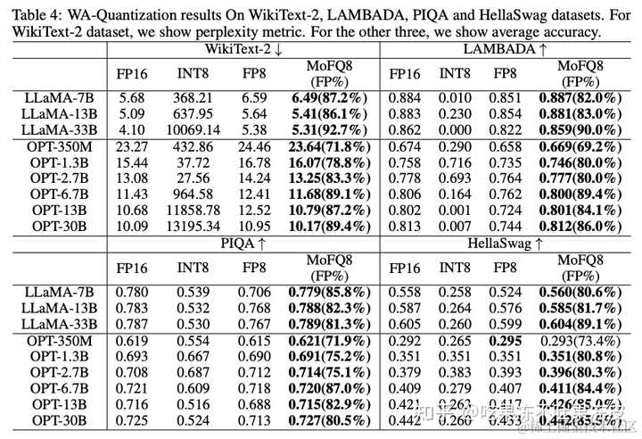

## FP8 推理流程

训练时为确保梯度计算准确，权重通常维持为高精度（如：BF16 或 FP32），这是由于训练时需更新参数，而在推理时，权重已固定，故可在模型加载或预处理阶段提前将权重转换为 FP8，确保模型加载即为 FP8 格式。

此外，推理阶段应尽量进行操作融合，如将 LayerNorm 与后续数据格式转换操作整合，确保 kernel 输入输出尽可能维持 FP8，从而能够有效提升 GPU 内存吞吐。同样，GeLU (Gaussian Error Linear Unit) 激活函数也要力求融合。

目前少量输出仍会保持为 FP16，原因是 NVIDIA NCCL 仅支持高精度reduce操作，所以现在仍然需采用 FP16 进行 reduce，完成后再转化为 FP8。

推理流程就简化为下图所示。绿线代表 FP8 的输入输出（I/O），红线表示高精度 I/O。图中可见，最前端的 LayerNorm 输出与权重均为 FP8，矩阵输出暂时保持 FP16，与前文描述一致。并且经过测试验证可得，虽然矩阵输出精度对整体性能影响较小，但与输入问题的规模相关；且因其计算密集的特性，对输出形态影响微弱。

在完成 MHA 后，需要将结果转换为 FP8 以进行后续矩阵计算，Reduce 是以 FP16 执行后再转换到 FP8 的。对于 MLP1 和 MLP2，两者逻辑相似，但不同之处在于：MLP1 的输出可保持在 FP8，因为它已经把 GeLU 加 Bias 等操作直接融合到 MLP1 的 kernel。

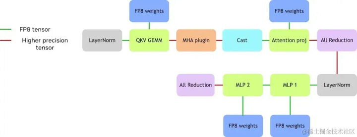

## FP8 在 TensorRT-LLM 中的应用

TensorRT-LLM 是基于 NVIDIA TensorRT 构建，其 FP8 能力也主要是通过 TensorRT 提供。自 TensorRT 9.0 版本起，开始支持 FP8 推理。要在 TensorRT 中启用 FP8 推理，需完成以下几步：

1. **设置 FP8 标志**：通过调用 config.set_flag (trt.BuilderFlag.FP8) 在 TensorRT 配置中启用 FP8 支持。类似 INT8、BF16、FP16，FP8 也是类似的启用方式。
2. **添加 GEMM 缩放因子（scale）** ：主要针对输入和权重，需在 weight.py （TensorRT-LLM 中的文件）中额外加载这些缩放因子。这是 FP8 推理中不可或缺的步骤。
3. **编写 FP8 模型**：现阶段需要明确编写需要 FP8 支持的模型。具体做法如下：将原始 FP16 输入量化至 FP8，随后进行反量化；权重同样进行量化与反量化操作。如此编写的模型，TensorRT 会自动将量化与反量化操作尽可能与前一个 kernel 融合，以及将反量化操作与 matmul kernel 融合。最终生成的计算图表现为量化后的 X 与 W 直接进行 FP8 计算，输出也为 FP8 结果。

为了简化 FP8 在 TensorRT-LLM 中的应用，TensorRT-LLM 已对其进行封装，提供了 FP8 linear 函数和 FP8 row linear 函数来实现。直接使用线性层（linear layer），无需重新编写代码，直接调用函数即可。

在 TensorRT-LLM 使用FP8的推理流程如下图所示。首先权重以 FP8 精度存储的，在进行计算前，权重先经历一次反量化。注意，在此之前，权重的量化已在输入前完成了，此处仅需进行反量化操作。这意味着，在进行矩阵内部计算时，实际上是使用反量化后的数据，通常是 FP16 或甚至 FP32 来进行运算的。

矩阵层尽管以 FP8 表示，但累加是采用 FP32 完成，累加后再乘以 scale 的相关参数。最终得到的结果具备较高精度。由于累加器（accumulator）需要采用高精度的数值，因此，要获得最终 FP8 的输出结果，模型还需经过一个量化节点 （quantitation node）。

回顾整个流程，输入经历了量化与反量化操作。其中，量化 kernel 发生在反量化 kernel 之前，而 TensorRT 则会智能地融合这些 kernel，确保计算的高效和准确。

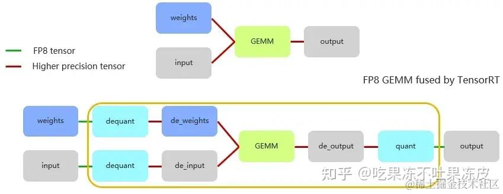

## FP8 在 vLLM 中的应用

vLLM 可以在 Nvidia H100 和 AMD MI300x 等 GPU 上使用 FP8 进行权重和激活量化。目前，仅支持 Hopper 和 Ada Lovelace GPU。使用 FP8 进行模型量化可将模型内存需求减少 2 倍，并将吞吐量提高 1.6 倍，同时对准确性的影响最小。

### 在线动态量化

在 vLLM 中， 使用 BF16/FP16 模型到 FP8 的动态量化，无需任何校准数据。通过在启动推理引擎时指定 `--quantization="fp8"` 或者在LLM 构造函数中设置 `quantization="fp8"` 来启用该功能。

该量化方法所有的 Linear 模块（最后的 `lm_head` 除外）的权重都通过 per-tensor 缩放量化为 FP8_E4M3 精度。在每次前向传递期间计算激活的最小值和最大值，以提供动态的 per-tensor 缩放以实现高精度。因此，该方法对延迟的改进有限。目前该方法在量化到 8 比特之前以原始精度加载模型，因此需要足够的内存来加载整个模型。

```text
python -m vllm.entrypoints.openai.api_server \
--port 9009 \
--disable-custom-all-reduce \
--gpu-memory-utilization 0.95 \
--dtype auto \
--model /workspace/models/Qwen1.5-7B-Chat \
--tensor-parallel-size 1 \
--quantization="fp8" \
--max-model-len 10000 \
--served-model-name qwen1.5 \
--max-num-seqs 256 \
--max-num-batched-tokens 10000

from vllm import LLM
model = LLM("facebook/opt-125m", quantization="fp8")
# INFO 06-10 17:55:42 model_runner.py:157] Loading model weights took 0.1550 GB
result = model.generate("Hello, my name is")
```

### 离线动态量化

接下来使用离线量化方案，离线量化到 FP8，需安装 AutoFP8 库。

```text
git clone https://github.com/neuralmagic/AutoFP8.git
pip install -e AutoFP8
```

该包引入了 `AutoFP8ForCausalLM` 和 `BaseQuantizeConfig` 对象来管理模型的压缩方式。

### 离线动态量化

使用 AutoFP8 将权重提前量化为 FP8(E4M3) 并生成检查点，并让 vLLM 在运行时处理激活的动态缩放（scales）的计算，以获得最大精度。可以使用 `activation_scheme="dynamic"` 参数启用此功能。虽然此模式不会为您提供更好的性能，但与在线量化相比，它减少了内存占用。

```text
from auto_fp8 import AutoFP8ForCausalLM, BaseQuantizeConfig

pretrained_model_dir = "meta-llama/Meta-Llama-3-8B-Instruct"
quantized_model_dir = "Meta-Llama-3-8B-Instruct-FP8-Dynamic"

# 使用动态激活scales定义量化配置
quantize_config = BaseQuantizeConfig(quant_method="fp8", activation_scheme="dynamic")
# For dynamic activation scales, there is no need for calbration examples
examples = []

# Load the model, quantize, and save checkpoint
model = AutoFP8ForCausalLM.from_pretrained(pretrained_model_dir, quantize_config)
model.quantize(examples)
model.save_quantized(quantized_model_dir)
```

其输出日志中可以看到模型定义中线性模型被替换为量化线性模块 (FP8DynamicLinear)，注意，当前默认情况下会跳过末尾的 `lm_head` Linear 模块。

```text
LlamaForCausalLM(
  (model): LlamaModel(
    (embed_tokens): Embedding(128256, 4096)
    (layers): ModuleList(
      (0-31): 32 x LlamaDecoderLayer(
        (self_attn): LlamaSdpaAttention(
          (q_proj): FP8DynamicLinear()
          (k_proj): FP8DynamicLinear()
          (v_proj): FP8DynamicLinear()
          (o_proj): FP8DynamicLinear()
          (rotary_emb): LlamaRotaryEmbedding()
        )
        (mlp): LlamaMLP(
          (gate_proj): FP8DynamicLinear()
          (up_proj): FP8DynamicLinear()
          (down_proj): FP8DynamicLinear()
          (act_fn): SiLU()
        )
        (input_layernorm): LlamaRMSNorm()
        (post_attention_layernorm): LlamaRMSNorm()
      )
    )
    (norm): LlamaRMSNorm()
  )
  (lm_head): Linear(in_features=4096, out_features=128256, bias=False)
)
```

最后，直接在 vLLM 中加载量化模型检查点即可使用。

```text
from vllm import LLM
model = LLM(model="Meta-Llama-3-8B-Instruct-FP8-Dynamic/")
# INFO 06-10 21:15:41 model_runner.py:159] Loading model weights took 8.4596 GB
result = model.generate("Hello, my name is")
```

### 离线静态量化

为了获得最佳的推理性能， 可以使用 AutoFP8 中带有校准数据的静态量化方案，通过启用 `activation_scheme="static"` 参数来为权重和激活生成 per-tensor 的静态缩放（scales）。

```text
from datasets import load_dataset
from transformers import AutoTokenizer
from auto_fp8 import AutoFP8ForCausalLM, BaseQuantizeConfig

pretrained_model_dir = "meta-llama/Meta-Llama-3-8B-Instruct"
quantized_model_dir = "Meta-Llama-3-8B-Instruct-FP8"

tokenizer = AutoTokenizer.from_pretrained(pretrained_model_dir, use_fast=True)
tokenizer.pad_token = tokenizer.eos_token

# Load and tokenize 512 dataset samples for calibration of activation scales
ds = load_dataset("mgoin/ultrachat_2k", split="train_sft").select(range(512))
examples = [tokenizer.apply_chat_template(batch["messages"], tokenize=False) for batch in ds]
examples = tokenizer(examples, padding=True, truncation=True, return_tensors="pt").to("cuda")

# 使用静态激活scales定义量化配置
quantize_config = BaseQuantizeConfig(quant_method="fp8", activation_scheme="static")

# Load the model, quantize, and save checkpoint
model = AutoFP8ForCausalLM.from_pretrained(pretrained_model_dir, quantize_config)
model.quantize(examples)
model.save_quantized(quantized_model_dir)
```

最后，直接在 vLLM 中加载量化模型检查点即可使用。

```text
from vllm import LLM
model = LLM(model="Meta-Llama-3-8B-Instruct-FP8/")
# INFO 06-10 21:15:41 model_runner.py:159] Loading model weights took 8.4596 GB
result = model.generate("Hello, my name is")
```

### KV Cache FP8（E5M2）量化

INT8/INT4 量化方案需要额外的 GPU 内存存储，这降低了预期的 GPU 内存优势。 而FP8数据格式保留2~3个尾数位，可以将float/fp16/bflaot16和fp8相互转换。vLLM中的示例如下所示：

```text
from vllm import LLM, SamplingParams
# Sample prompts.
prompts = [
    "Hello, my name is",
    "The president of the United States is",
    "The capital of France is",
    "The future of AI is",
]
# Create a sampling params object.
sampling_params = SamplingParams(temperature=0.8, top_p=0.95)

# Create an LLM.
llm = LLM(model="facebook/opt-125m", kv_cache_dtype="fp8")

# 根据提示生成文本。输出是一个RequestOutput对象列表，其中包含提示、生成的文本和其他信息。
outputs = llm.generate(prompts, sampling_params)

# Print the outputs.
for output in outputs:
    prompt = output.prompt
    generated_text = output.outputs[0].text
    print(f"Prompt: {prompt!r}, Generated text: {generated_text!r}")
```

### KV Cache FP8（E4M3）量化

与 E5M2 相比，E4M3 格式的优点之一是浮点数以更高的精度表示。然而，FP8 E4M3 的数据范围小（可以表示 ±240.0）通常需要在每个量化tensor旁边使用更高精度（通常是 FP32）的缩放因子。目前，仅支持 per-tensor (scalar) 缩放因子。正在开发支持更细粒度的缩放因子（例如：per-channel）。

这些缩放因子可以通过在加载时将可选的量化参数 JSON 传递给 LLM 引擎来指定。如果未指定此 JSON，则缩放因子默认为 1.0。这些缩放因子通常是通过量化工具（例如：AMD quantizer 或 NVIDIA AMMO）运行未量化模型获取。

研究表明，FP8 E4M3 量化通常只会较小程度地降低推理精度。同时，AMD MI300、NVIDIA Hopper 或更高版本支持 fp32、fp16、bf16 等数据精度之间的本机硬件转换。因此，LLM 推理速度大大加快，且精度损失很小。

vLLM中， FP8 E4M3 的 KV Cache 量化 示例如下所示：

```text
from vllm import LLM, SamplingParams
sampling_params = SamplingParams(temperature=1.3, top_p=0.8)
llm = LLM(model="meta-llama/Llama-2-7b-chat-hf",
          kv_cache_dtype="fp8",
          quantization_param_path="./tests/fp8_kv/llama2-7b-fp8-kv/kv_cache_scales.json")
prompt = "London is the capital of"
out = llm.generate(prompt, sampling_params)[0].outputs[0].text
print(out)

# output w/ scaling factors:  England, the United Kingdom, and one of the world's leading financial,
# output w/o scaling factors:  England, located in the southeastern part of the country. It is known
```

关于如何生成 kv_cache_scales.json 参考文档：[https://github.com/vllm-project/vllm/blob/main/examples/fp8/README.md](https://link.zhihu.com/?target=https%3A//github.com/vllm-project/vllm/blob/main/examples/fp8/README.md)

## FP8在不同推理框架及硬件的性能对比

在 TensorRT-LLM 使用 FP8 性能测试如下表所示。 其中，FP16 的 max 值为 75，而 FP8 的 max 值则提升至 85。原因是 FP8 节省了权重部分的内存，但部分 tensor 以及 KV cache 仍保持在 FP16。表格最后一列展示了使用 FP8 KV cache 的情况，此时能够看到其 max 值相比 FP16 的 max 值超出 2 倍。

在性能方面，单纯启用 FP8 会由于 batch size 提升有限，以及 KV cache 的影响，导致性能提升并不显著。然而，一旦将 KV cache 也转换至 FP8，通过减半其内存消耗，模型吞吐量可以相较 FP16 提升约两倍左右，这是一个相当理想的性能提升幅度。

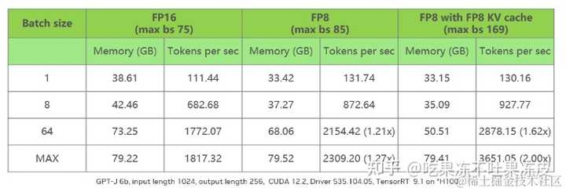

下面是使用vLLM针对qwen1.5-chat在不同硬件上进行了FP8量化后的实测结果（注：仅供参考具体以实测为准）。

- 数据集：羊驼中文数据集 1k
- 服务器配置：4090/H800/h20
- 框架：vLLM
- 指标：端到端时延、首Token时延、Token间时延

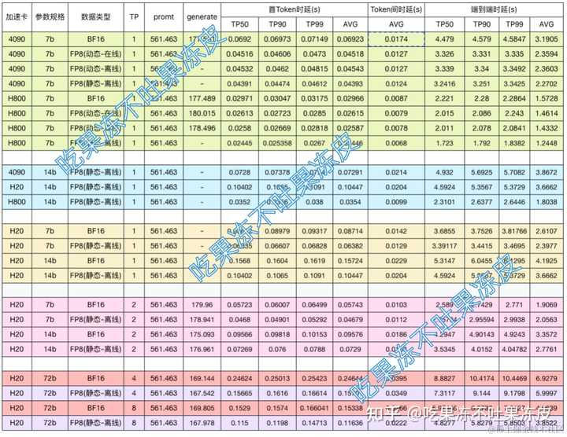

整体来说，FP8静态量化相对于BF16来说，在不同硬件上均有10%~30的性能提升。

## 总结

本文针对FP8进行了基本的介绍，同时从性能和精度方面对比了FP8与INT8，并且介绍了一些目前FP8的量化方案。虽然FP8还不是很成熟，但是目前知名的推理工具都提供了对FP8的支持，文中也介绍了推理框架TensorRT-LLM与vLLM中关于FP8的应用。同时，测试了针对不同硬件FP8相对于BF16的性能对比。

参考文档：

- [FP8 FORMATS FOR DEEP LEARNING](https://link.zhihu.com/?target=https%3A//arxiv.org/pdf/2209.05433)
- [FP8 Quantization: The Power of the Exponent](https://link.zhihu.com/?target=https%3A//arxiv.org/pdf/2208.09225)
- [FP8 versus INT8 for efficient deep learning inference](https://link.zhihu.com/?target=https%3A//arxiv.org/pdf/2303.17951) * -高通
- [Integer or Floating Point? New Outlooks for Low-Bit Quantization on Large Language Models](https://link.zhihu.com/?target=https%3A//arxiv.org/pdf/2305.12356) *
- [NVIDIA GPU 架构下的 FP8 训练与推理](https://zhuanlan.zhihu.com/p/694352617)*
- [FP8 量化-原理、实现与误差分析](https://zhuanlan.zhihu.com/p/619431625)**
- [FP8 量化基础知识（扫盲）](https://link.zhihu.com/?target=https%3A//mp.weixin.qq.com/s%3F__biz%3DMzU3Mzg5ODgxMg%3D%3D%26mid%3D2247489394%26idx%3D1%26sn%3D31f06a0ef0019dbbbe3eb1c2f7164a6a%26chksm%3Dfd3bfe21ca4c7737c757c4644e6ec556afc5b20ca8340371970326bdc93ca34a9c8b2c1da2e4%26token%3D471663163%26lang%3Dzh_CN%23rd)
- [量化那些事之FP8与LLM-FP4](https://link.zhihu.com/?target=https%3A//mp.weixin.qq.com/s%3F__biz%3DMzU3Mzg5ODgxMg%3D%3D%26mid%3D2247489394%26idx%3D1%26sn%3D31f06a0ef0019dbbbe3eb1c2f7164a6a%26chksm%3Dfd3bfe21ca4c7737c757c4644e6ec556afc5b20ca8340371970326bdc93ca34a9c8b2c1da2e4%26token%3D471663163%26lang%3Dzh_CN%23rd)
- [LLM推理量化：FP8 VS INT8](https://link.zhihu.com/?target=https%3A//mp.weixin.qq.com/s%3F__biz%3DMzU3Mzg5ODgxMg%3D%3D%26mid%3D2247488487%26idx%3D1%26sn%3Dc653dd3dd2a52b57aba5c32fc18c6cc8%26chksm%3Dfd3bfab4ca4c73a2432d8a6a5ed852b80e7c6d7aaeda5e1d9976c0ab7f987e07307790cfc110%26token%3D471663163%26lang%3Dzh_CN%23rd)
- [大模型训练新风尚FP8-LLM（H800的正确打开方式）](https://link.zhihu.com/?target=https%3A//mp.weixin.qq.com/s%3F__biz%3DMzU3Mzg5ODgxMg%3D%3D%26mid%3D2247487931%26idx%3D1%26sn%3Df2c7d2ebb86d93cc59f06e79fd645e91%26chksm%3Dfd3bf8e8ca4c71fe21536a1270132b0180c5d897f004e0c6b316691371125add96bc616ef254%26token%3D471663163%26lang%3Dzh_CN%23rd)
- [vLLM](https://link.zhihu.com/?target=https%3A//github.com/vllm-project/vllm)
- [vLLM fp8](https://link.zhihu.com/?target=https%3A//docs.vllm.ai/en/stable/quantization/fp8.html)*
- [FP8 E5M2 KV Cache](https://link.zhihu.com/?target=https%3A//docs.vllm.ai/en/latest/quantization/fp8_e5m2_kvcache.html)
- [深入理解浮点数实现原理、范围和精度以及大数吃小数问题](https://link.zhihu.com/?target=https%3A//blog.csdn.net/Dong_HFUT/article/details/124290674)
- [浮点数](https://link.zhihu.com/?target=https%3A//www.bilibili.com/video/BV1VK4y1f7o6/%3Fspm_id_from%3D333.337.search-card.all.click%26vd_source%3Db12bd535d71dd38f94ddfaed6c3c441b)*