# 大模型量化技术原理：总结

https://zhuanlan.zhihu.com/p/11886909512

前面的一系列文章针对目前主流的一些量化方法进行了介绍。

## 基本概念

### 简介

模型量化是一种用于减少神经网络模型大小和计算量的技术，将模型参数（如：权重）从高精度数据类型（如：float32）转换为低精度数据类型（如：int8 或 fp4）。模型量化通过以更少的位数表示数据，可以减少模型尺寸，进而减少在推理时的内存消耗，并且在一些低精度运算较快的处理器上可以增加推理速度，同时仍然可以保持模型的性能。

### 模型量化的粒度

- per-tensor（又名 per-layer）量化：每层或每个张量只有一个缩放因子，张量内的所有值都被这个缩放因子量化。
- per-channel 量化：卷积核的每个通道都有不同的缩放因子。
- per-token 量化：针对激活而言，针对每一行进行量化。在LLM中，通常与per-channel 量化搭配使用，如：逐Token量化激活，逐通道量化权重。
- per-group/group-wise：，以组为单位。正如 **Q-BERT: Hessian Based Ultra Low Precision Quantization of BERT** 中所说的那样，分组量化的一个特殊情况是，将每个密集矩阵视为一组，每个矩阵都可以有自己的量化范围。而更普遍的情况是**将每个密集矩阵按输出神经元进行分割，每个连续的 N 输出神经元作为一个组**。比如：GPTQ、AWQ中使用128个元素为一组进行量化。有些地方也称为子通道分组（Sub-channel-wise）量化，即将通道划分为更小的子组，以实现更细粒度的精度控制。

下图展示了不同的量化粒度；其中，d为模型大小/隐藏状态维度；h是一个MHSA（多头自注意）中的Head数。

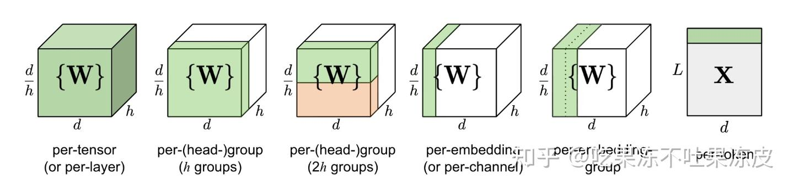

下面展示了一些量化方法中不同量化对象的量化粒度：

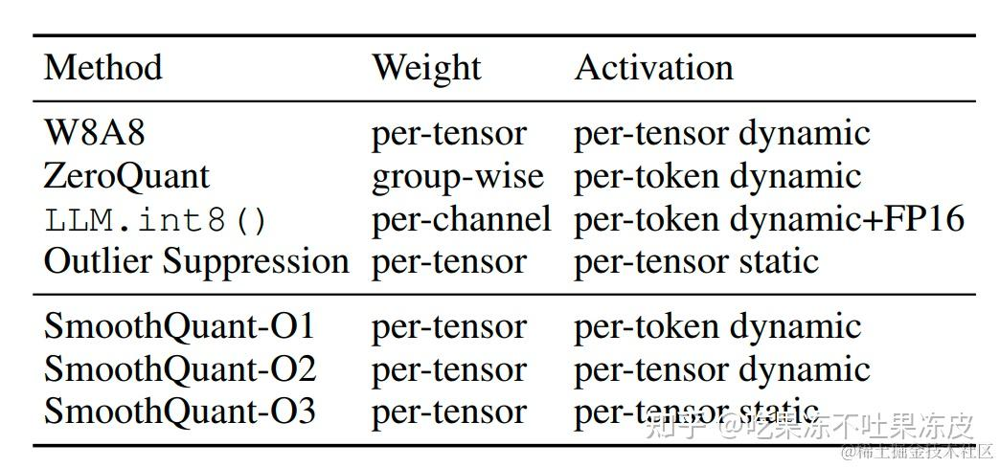

image.png

### 模型量化对象

- Weight：权重量化是最常见的量化对象。量化权重可达到减少模型内存占用空间。权重在训练完后固定，数值范围与输入无关，可离线完成量化，通常相对容易量化；
- Activation：实际上激活往往是占内存使用的大头，因此量化激活不仅可以大大减少内存占用。更重要的是，结合权重量化可以充分利用整数计算获得模型推理性能的提升。但激活输出随输入变化而变化，需要统计数据动态范围，通常更难量化。
- KV Cache：除了权重和激活量化之外，在大语言模型中的 KV 缓存也会消耗不少的内存。 因此，量化 KV 缓存对于提高模型长序列生成的吞吐量至关重要。
- Gradient：相对上面的量化对象，略微小众一些，主要用于训练场景。在训练深度学习模型时，梯度通常是浮点数，量化梯度可以在分布式计算中减少通信开销，同时，也可以减少反向传播时的开销。

### 静态量化与动态量化

通常，**对于激活而言**，静态量化是指如果采用具有代表性的校准数据集来为其生成缩放因子和零点，这些参数在模型的整个生命周期中保持不变。静态量化的优点在于推理时的计算效率较高，因为它不需要在运行时动态计算量化参数。然而，由于量化参数是固定的，静态量化可能会引入一些量化误差，从而影响模型的精度

而动态量化是指在每次前向传递期间计算激活的最小值和最大值，以提供动态的缩放因子以实现高精度。动态量化的优点在于它可以更准确地表示模型的激活值，因为它考虑了运行时的实际数据分布。然而，这种方法的缺点是可能会增加计算开销，因为需要在运行时计算量化参数。动态量化适合于那些对模型精度要求较高的应用场景，尤其是当模型的输入数据分布变化较大时。

目前，常见的是对激活使用静态量化，其中最小/最大范围是在离线校准阶段计算的。但由于LLM中激活范围差异巨大，将导致准确度显著下降。

### 离线量化与在线量化

离线量化是指模型上线前进行量化并生成缩放因子，而在线量化是指模型运行时进行量化。

动态与静态量化的区别在于是否使用校准集，而离线与在线量化的区别则是量化的时机不同。简单理解就是说**离线静态量化**是指在模型上线推理前使用校准集生成缩放因子，对权重和激活进行量化。**在线动态量化**是指在模型上线推理时，在每次前向传播过程中实时生成缩放因子，对模型对权重和激活进行量化。 而**离线动态量化**通常是指对权重在运行前先进行量化，对激活在运行时进行动态量化。

### [线性量化](https://zhida.zhihu.com/search?content_id=251400333&content_type=Article&match_order=1&q=线性量化&zhida_source=entity)与[非线性量化](https://zhida.zhihu.com/search?content_id=251400333&content_type=Article&match_order=1&q=非线性量化&zhida_source=entity)

根据量化数据表示的原始数据范围是否均匀，还可以将量化方法分为线性量化和非线性量化。实际的深度神经网络的权重和激活值通常是不均匀的；因此，理论上使用非线性量化导致的精度损失更小，但在实际推理中非线性量化的计算复杂度较高，通常使用线性量化。 下面着重介绍线性量化的原理。假设 r 表示量化前的浮点数，量化后的整数 q 可以表示为：

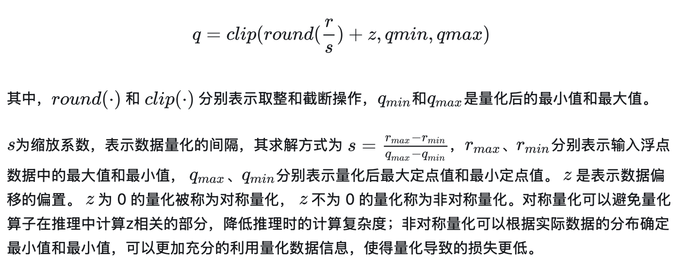

### 量化数据类型

LLM主要有三种类型量化：

- 仅权重量化：只量化每个线性层的权重张量W。
- 权重激活量化：量化每个线性层的输入激活X和权重张量W。
- KV缓存量化：量化每个自注意力块中的键张量K和值张量V。

下面列举了业界的一些量化数据类型的典型方案。

针对仅权重量化：

- 对于 W8A16 量化，代表方法有 MinMax
- 对于 W6A16 量化，代表方法有 FP6-LLM
- 对于 W4A16 量化，代表方法有 AWQ、GPTQ、SpQR、OmniQuant、QuIP#
- 对于 W3A16 量化，代表方法有 GPTQ、SpQR、OmniQuant、QuIP#
- 对于 W2A16 量化，代表方法有 OmniQuant、QuIP、QuIP#

针对权重激活量化：

- 对于 W8A8 量化，代表方法有 LLM.int8()、SmoothQuant、ZeroQuant
- 对于 W6A6 量化，代表方法有 OmniQuant
- 对于 W4A8 量化，代表方法有 QoQ
- 对于 W4A4 量化，代表方法有 Atom 、QuaRot、OmniQuant

针对 KV Cache量化：

- KV8：INT8（LMDeploy、TensorRT-LLM）、FP8（TensorRT-LLM、vLLM）
- KV4：Atom、QuaRot、QoQ
- KV3：KVQuant
- KV2：KVQuant、KIVI

### 量化分类

根据应用量化压缩模型的阶段，可以将模型量化分为：

- 量化感知训练（Quantization Aware Training, QAT）：在模型训练过程中加入伪量化算子，通过训练时统计输入输出的数据范围可以提升量化后模型的精度，适用于对模型精度要求较高的场景；其量化目标无缝地集成到模型的训练过程中。这种方法使LLM在训练过程中适应低精度表示，增强其处理由量化引起的精度损失的能力。这种适应旨在量化过程之后保持更高性能。
- 量化感知微调（Quantization-Aware Fine-tuning，QAF）：在微调过程中对LLM进行量化。主要目标是确保经过微调的LLM在量化为较低位宽后仍保持性能。通过将量化感知整合到微调中，以在模型压缩和保持性能之间取得平衡。
- 训练后量化（Post Training Quantization, PTQ）：在LLM训练完成后对其参数进行量化，只需要少量校准数据，适用于追求高易用性和缺乏训练资源的场景。主要目标是减少LLM的存储和计算复杂性，而无需对LLM架构进行修改或进行重新训练。PTQ的主要优势在于其简单性和高效性。但PTQ可能会在量化过程中引入一定程度的精度损失。

## 模型量化方法精要

最近两年，业界诞生了很多关于LLM量化方法，比如：LLM.int8() 和 SmoothQuant 都属于 round-to-nearest (RTN) 量化。针对激活中的离群值，SmoothQuant 给出了与 LLM.int8() 不同的解题思路。既然激活的量化比权重的量化难得多，那么可以通过一个平滑系数，把二者的难度综合一下。GPT-Q 则是把量化问题视作优化问题，逐层寻找最优的量化权重。AWQ方法则基于不是所有权重都是同等重要的这一发现，其中只有 0.1%-1% 的权重（salient weights）对模型精度贡献更大，并且这些权重取决于激活值分布而不是权重分布。该方法的量化过程类似于 SmoothQuant，差异主要在于 scale 是基于激活值分布计算得到的。而 SmoothQuant 的 scale 是在校准样本上根据权重和激活值通过公式计算获得。

下面总结了目前业界主流的大模型量化方法。

### RTN

RTN（Round to Nearest）量化是最简单的量化方法，就是采取四舍五入的方式，把量化权重近似到最近的整数上。对于LLM而言，由于大量异常值的存在，如果单独使用RTN量化，对精度影响较大。通常会采用一些方式抑制异常值之后，再使用RTN量化。

### LLM-QAT

特点：训练感知量化、无数据知识蒸馏、对称 MinMax 均匀量化（线性量化）、逐通道权重量化，逐 Token 激活量化，逐 Token KV缓存量化

大语言模型中，权重和激活都存在显著的异常值。这些异常值对量化过程有显著影响，因为它们会增加量化步长，同时降低中间值的精度。因此，在量化过程中裁剪这些异常值不利于 LLM 的性能。

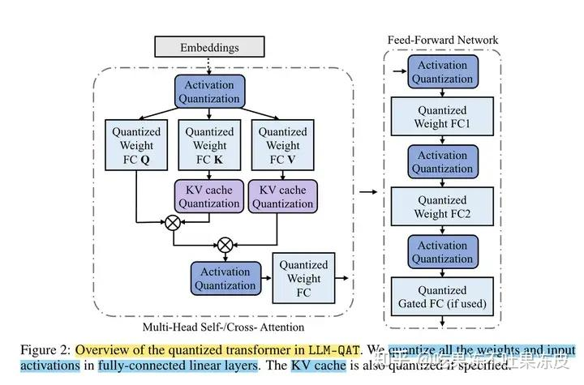

在训练的初始阶段，任何基于裁剪的方法都会导致异常高的困惑度，从而丢失大量信息，并且通过事实证明很难通过微调来恢复。 因此，选择保留这些异常值。

此外，在具有门控线性单元（GLU）的模型中，激活权重大多是对称分布的。 因此，为权重和激活选择对称 MinMax 量化，对权重采用逐通道量化，对激活采用逐 Token 量化。

同时，大语言模型推理工程中的KV缓存也会消耗不少的内存，对于 KV 缓存进行逐 Token量化，Key和Value是由 Token 生成的。 在生成过程中，当前的 Key 和 Value 都会被量化，并存储它们对应的缩放因子。在 QAT 的训练过程中，对 key 和 value 的整个激活张量进行量化。并通过将量化函数集成到梯度计算中，确保使用量化的键值对进行有效的训练。

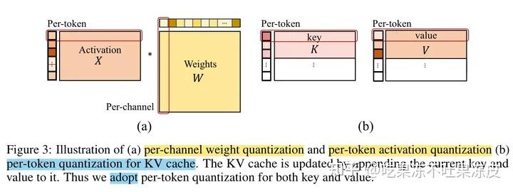

### QLoRA

特点：量化感知微调、分页优化器、双量化

QLoRA 将预训练模型量化为 4 比特，然后添加一小组可学习的LoRA权重，这些权重通过量化权重的反向传播梯度进行微调。无论何时使用 QLoRA 权重张量，都会将张量反量化为 BFloat16，然后执行 16 位矩阵乘法。

在QLoRA 中，提出了两种技术实现来保证 4 比特微调的精度——NF4量化和双量化。[NF4数据类型](https://zhida.zhihu.com/search?content_id=251400333&content_type=Article&match_order=1&q=NF4数据类型&zhida_source=entity)对正态分布数据比INT4/FP4更优。双量化对第一次量化后的那些常量再进行一次量化，进一步减少存储空间。

此外，还引入了分页优化器，以防止梯度检查点期间的内存峰值，从而导致内存不足的错误；在过去，这些错误使得大模型难以在单台机器上进行微调。使用此功能为优化器状态（Optimizer）分配分页内存，然后在 GPU 内存不足时将其自动卸载到 CPU 内存，并在优化器更新需要时将其加载回 GPU 内存。

### LLM.int8()

特点：W8A8、推理性能差、在模型加载时进行量化、不需要校准集

LLM.int8()是一种采用混合精度分解的量化方法。该方案先做了一个矩阵分解，对绝大部分权重和激活用8bit量化（vector-wise）。对离群特征的几个维度保留16bit，对其做高精度的矩阵乘法。

LLM.int8() 通过三个步骤完成矩阵乘法计算:

- 从输入的隐含状态中，按列提取异常值 (离群特征，即大于某个阈值的值)。
- 对离群特征进行 FP16 矩阵运算，对非离群特征进行量化，做 INT8 矩阵运算；
- 反量化非离群值的矩阵乘结果，并与离群值矩阵乘结果相加，获得最终的 FP16 结果。

### GPTQ

特点：W4A16、量化速度慢、离线静态量化

GPTQ(论文：GPTQ: ACCURATE POST-TRAINING QUANTIZATION FOR GENERATIVE PRE-TRAINED TRANSFORMERS) 是一种仅权重量化方法，其中模型权重被量化为 int4 数值类型，而激活值则保留在 float16。在推理阶段，模型权重被动态地反量化回 float16 并在该数值类型下进行实际的运算；同 OBQ 一样，GPTQ还是从单层量化的角度考虑，希望找到一个量化过的权重，使的新的权重和老的权重之间输出的结果差别最小。

GPTQ 将权重分组（如：128列为一组）为多个子矩阵（block）。对某个 block 内的所有参数逐个量化，每个参数量化后，需要适当调整这个 block 内其他未量化的参数，以弥补量化造成的精度损失。因此，GPTQ 量化需要准备校准数据集。

GPTQ 量化过程如下图所示。首先，使用 Cholesky 分解求解 Hessian 矩阵的逆，然后在给定的步骤中对连续列的块（粗体）进行量化，并在该步骤结束时更新剩余的权重（蓝色）。量化过程在每个块内递归应用，白色中间列表示当前正在被量化。

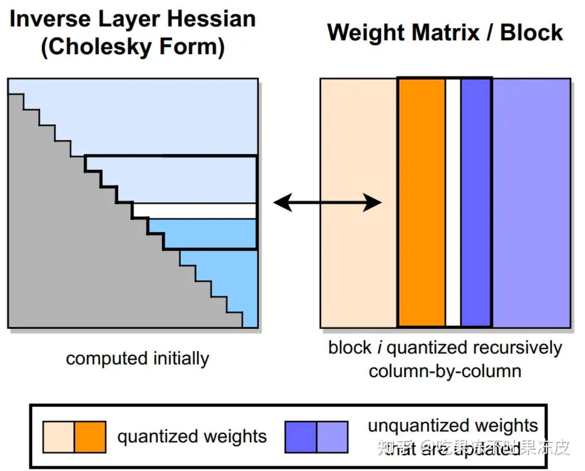

GPTQ 的创新点如下：

- 取消贪心算法：OBS 采用贪心策略，先量化对目标影响最小的参数；但 GPTQ 发现直接按顺序做参数量化，对精度影响也不大。这项改进使得参数矩阵每一行的量化可以做并行的矩阵计算（这意味着我们可以独立地对每一行执行量化。即所谓的 per-channel quantization）。对于大模型场景，这项改进使得量化速度快了一个数量级；
- Lazy Batch-Updates：OBQ 对权重一个个进行单独更新，作者发现性能瓶颈实际在于GPU的内存带宽，而且同一个特征矩阵W不同列间的权重更新是不会互相影响的。因此作者提出了延迟批处理的方法，通过延迟一部分参数的更新，一次处理多个（如：128）列，来缓解带宽的压力，大幅提升了计算速度。
- Cholesky(乔莱斯基) 分解：用 Cholesky 分解(一种分解矩阵的方法)求海森矩阵的逆，提前计算好所有需要的信息，在增强数值稳定性的同时，后续更新的过程中再计算，进一步减少了计算量。

GPTQ的伪代码如下所示。

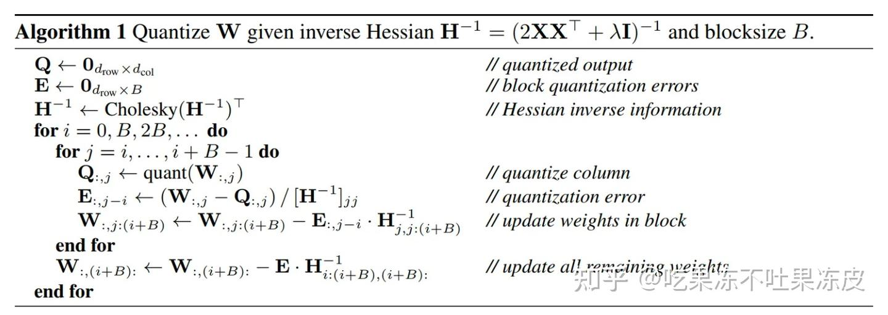

### SmoothQuant

特点：离线静态量化、逐通道对权重缩放，逐 Token对激活缩放，W8A8（对权重进行per-tensor或per-channel，对激活进行per-token或per-tensor）

SmoothQuant是一种同时确保准确率且推理高效的训练后量化 (PTQ) 方法，可实现 8 比特权重与激活 (W8A8) 量化。

针对大模型而言，权重很容易量化，对于激活值，由于异常值的存在，导致激活则较难量化。作者对比了 per-channel、per-token、per-tensor 激活量化方案。在这几种不同的激活量化方案中。per-tensor量化是最高效的实现方式。但只有逐通道量化（per-channel）保留了精度，但它与 INT8 GEMM Kernel 不兼容。即per-channel量化不能很好地映射到硬件加速的GEMM内核（硬件不能高效执行，从而增加了计算时间）。

为了进行 vector-wise quantization 以有效利用 INT8 GEMM Kernel，我们只能使用外部维度（即激活的维度 T 和 权重的维度 ）的缩放因子，不能使用内部维度（即通道内维度 ）。因此，先前的工作对激活都采用了per-token量化，但并不能降低激活的难度。

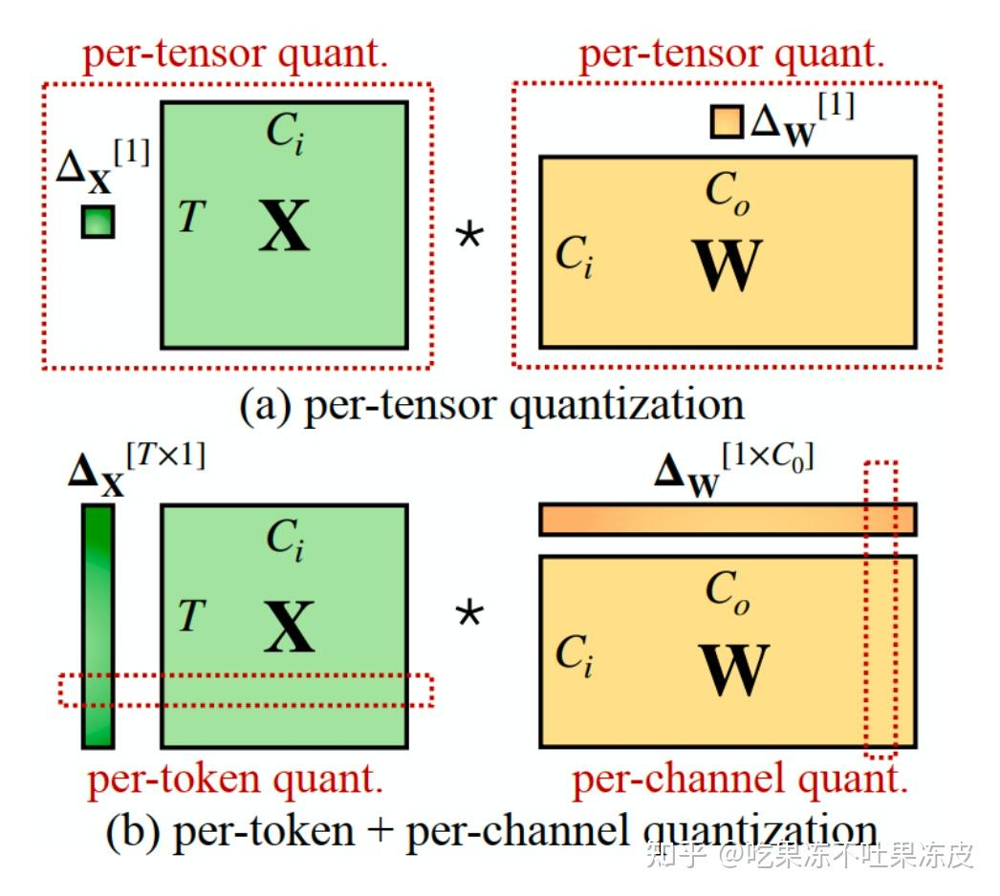

于是 SmoothQuant 提出了一种数学上等价的逐通道缩放变换（per-channel scaling transformation），通过引入平滑因子s来平滑激活异常值，数学上等效的变换将量化难度从激活转移到权重上，从而使模型易于量化，保持精度的同时，还能够保证提升推理速度。

根据量化方式不同，作者提出三种策略 O1、O2、O3，其计算延迟依次降低。SmoothQuant的O1和O2级成功地保持了浮点精度，而O3级（per-tensor static）虽然延迟更低，但平均精度下降了0.8%，可能是因为静态收集的统计数据与真实评估样本的激活统计数据之间的差异。

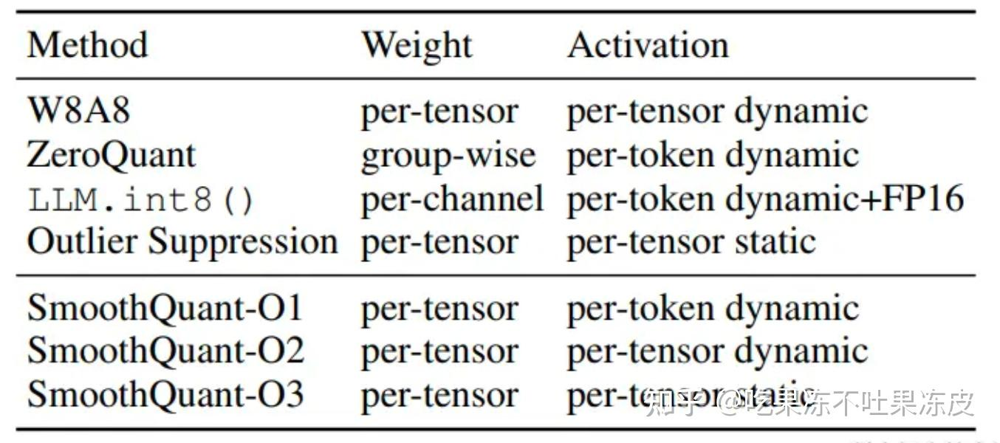

在我们实际使用过程中，在SmoothQuant平滑后，对应的存储和计算精度都可以是 INT8 或者 FP8，可以利用 INT8 或者 FP8 的 TensorCore 进行计算。在实现细节上，权重支持 Per-tensor 和 Per-channel 的量化，激活值支持 Per-tensor 和 Per-token 的量化。

### AWQ

特点：W4A16，per-group量化（INT4-g128），量化速度慢

AWQ（AWQ: Activation-aware Weight Quantization for LLM Compression and Acceleration）方法源于“权重对于LLM的性能并不同等重要”的观察，存在约（0.1%-1%）显著权重对大模型性能影响太大，通过跳过这1%的重要权重（salient weight）不进行量化，可以大大减少量化误差。

具体如下图所示，左边的(a)使用RTN量化误差较大，中间的(b)通过保留1%的重要权重不量化，量化误差明显降低。但是该方法采用混合精度计算并不是硬件高效的方式。右边则是使用AWQ进行激活感知的仅权重(即W4A16)量化方法，通过逐通道缩放以保护显著权重来减少量化误差，这种方法不存在硬件效率低下的问题。

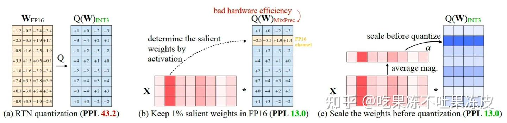

尽管我们只做了权重量化，但要找到显著的权重通道，我们应该根据激活分布而不是权重分布，与较大激活幅度(activation magnitudes)相对应的权重通道更加突出，因为它们处理了更重要的特征。

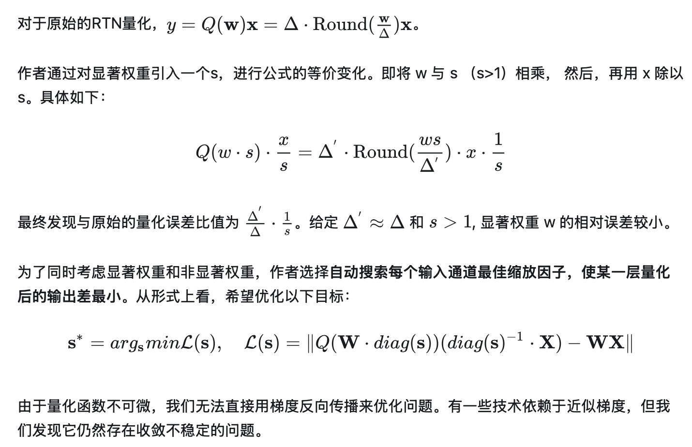

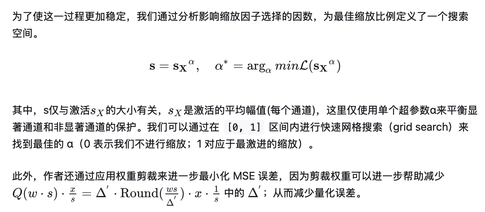

### SpQR

特点：仅权重量化、双层量化（对量化元数据进一步进行量化）、非对称（最小-最大）量化

之前的 LLM 量化算法同等对待低敏感度权重和高敏感度权重；然而这可能会导致次优量化。

SpQR 提出隔离此类异常值，并以 SpQR 格式有效地对给定模型进行编码。为了利用所得结构，还开发了一种基于压缩稀疏行（CSR）格式的专门稀疏矩阵乘法算法。为了使用 SpQR 进行逐个token生成，将这种稀疏算法与 3-4 比特权重的密集量化矩阵乘法结合起来。与LLM 生成 16 比特推理相比，SpQR 将 LLMs 的内存占用减少了约 3.4 倍或更多，从而实现小于1%的精度损失。

具体工作原理如下：

- 首先，确定并隔离离群权重，发现对其量化会导致不成比例的高误差。因此，将这些权重保持高精度，使用一个稀疏矩阵单独保存；而其他权重存储在低得多的精度中，例如：3 比特格式。
- 其次，由于重要参数往往以行或者列聚集，因此实现了一种具有非常小的组大小（group size）的分组量化的变体，例如：16 个连续元素。同时，将量化缩放（scales）本身量化为 3 比特表示(压缩量化元数据)。

### ZeroQuant

特点：W8A8、对权重矩阵使用分组量化、对激活进行逐Token动态量化，不需要校准激活范围

对于权重矩阵进行分组量化，将整个权重矩阵分成64或128组。同时在设计时考虑了 GPU Ampere 架构（例如: A100）的硬件约束，计算单元基于 Warp Matrix Multiply and Accumulate (WMMA) 的分片大小，实现最佳加速。

对于激活采用逐Token量化并动态计算每个Token的最小/最大范围，以减少激活引起的量化误差。同时，为了降低应用逐 Token 量化导致的量化和反量化成本（引入了额外的操作，导致 GPU 计算单元和主存之间产生昂贵的数据移动开销），ZeroQuant 构建了一个高度优化的推理后端，例如：采用Kernel融合技术将量化算子与其先前的算子（如：层归一化）融合，以减轻逐 Token 量化的数据移动成本。类似地，在将最终 FP16 结果写回到下一个 FP16 算子（如：GeLU）的主存之前，使用权重和激活量化缩放因子缩放 INT32 累加，以减轻不同 GeMM 输出的反量化成本。

### ZeroQuant-V2

特点：新增了模型参数，拖累了推理的性能

一种称为低秩补偿（LoRC）的优化方法，该方法通过新增两个两个低秩矩阵来近似量化误差，该方式以最小的模型参数大小的增加来提升模型质量的恢复。同时两个低秩矩阵也可以量化为 8 比特，而不会出现任何性能差异。

### ZeroQuant-FP

特点：W4A8、FP4、FP8

通过调查显示，对于 LLMs，**FP8 激活始终优于其INT8激活** ，并且在参数超过 10 亿的模型中，性能优势变得更加明显。对于权重量化，**FP4 表现出与 INT4 相当（即使不是更优）的性能**，从而简化了在 H100 等支持 FP 的硬件上的部署。

本文对权重进行FP4量化对激活进行FP8量化。选择使用的方法与 GPTQ 保持一致。根据 ZeroQuant-V2 ，本文应用了细粒度权重量化（FGQ），并对激活进行 token-wise 量化。此外，本文还将研究ZeroQuant-V2中提出的附加特征 LoRC（低秩补偿），其目的是通过采用低秩矩阵分解来减少权重的量化误差。

由于 W4A8 在 H100 NVIDIA 硬件中的实际软件实现是需要转换 W 的 FP4 以匹配 A 中使用的 FP8 精度。直接反量化然后再次量化的方法可能会对推理效率产生不利影响。

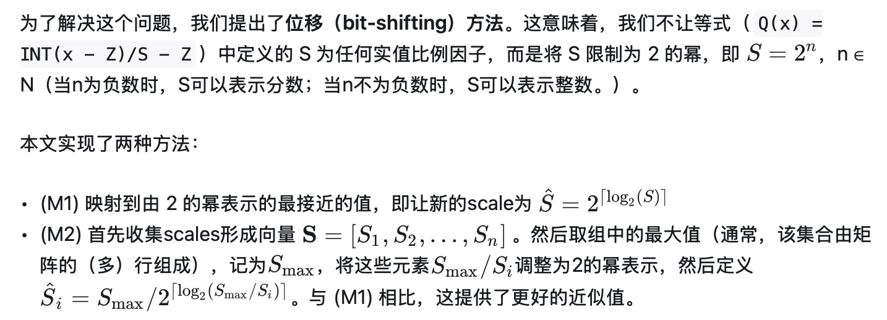

注意：这种使用 2 的幂的限制，无论是使用 (M1) 还是 (M2)，都可以简化计算，特别是在基于二进制逻辑操作的数字系统中。这是优化计算效率和保持模型性能的方法的关键要素。

### FP6-LLM（W6A16）

特点：W6A16

FP6量化的一个挑战是缺乏针对这种不规则位宽的高效GPU KERNEL设计。在 FP6-LLM 中设计并实现了TC-FPx，第一个具有 Tensor Core 支持的用于FP6和各种量化位宽(6位、5位、3位等)的浮点权重的GPU系统设计方案，缓解了LLM推理期间的“内存墙”问题。TC-FPx打破了底层GPU硬件的限制，允许GPU支持涉及任意位宽模型权重的矩阵乘法计算。在TC-FPx中，Tensor Cores用于矩阵乘法的密集计算，而SIMT Cores在运行时有效地用于权重反量化，将模型权重反量化为FP16类型，Tensor Core基于此进行计算。它具有以下关键创新:

- 运行前比特层级的数据排布转换。用以解决权重具有不规则位宽时不友好的内存访问挑战，实现GPU内存的最优访问；
- 运行时高效的SIMT计算。用以最小化权重反量化的运行时开销；
- 全栈的高效流水线设计。其 SIMT Core 计算、Tensor Core 计算和GPU内存访问进行高效调度，最大程度提升性能。

平均而言， FP6 kernel 在 NVIDIA A100 GPU 上进行（因decoder的矩阵形状狭长而导致参数矩阵的访存成为瓶颈的）矩阵乘法时，处理速度比FP16 cuBLAS 基准提高了2.1倍。值得注意的是，通过FP6量化实现的 FP6 kernel 使LLaMA-70b 模型能够在单个 A100 GPU 上运行。这使得其在批处理大小小于32的LLM推理任务中，性能比FP16基准高出1.69到2.65倍。

尽管FP6量化带来了显著的好处，但当前实现仍面临一些限制。值得注意的是，在 GEMM 因批处理较大或有充足的GPU内存而使得瓶颈变为Tensor Core计算时，本文的仅权重量化kernel可能无法保持其性能优势，尤其是与厂商的优化库如cuBlas相比。然而，本文系统的低内存占用仍是一个关键优势。目前仅支持非混合专家（Non-MoE）结构。此外，当前系统仅与FP16输入模型兼容，因为当前实现的FP6 Kernel仅支持处理FP16的激活。

### KIVI

特点：在线量化、对Token的KV缓存进行分组，在组内对K缓存逐通道量化，对V缓存逐Token量化，KV2

KIVI开发了一种 2 位非对称 KV 缓存量化方法。通过实验证明对 Key 缓存按通道进行量化，对 Value 缓存按Token进行量化能够有效保持模型的精度。

由于LLM新生成的Token的Key和Value缓存是按顺序到达的。从实现的角度来看，逐Token的Value缓存量化可以与流式场景很好地结合在一起，新量化的张量按Token维度直接附加到现有的量化的Value缓存中。然而，对于逐通道的 Key 缓存量化，量化过程跨越不同的Token，因此，不能直接在流式场景中实现。为了解决这个问题，KIVI 将 Token 的KV缓存分成两部分，即分组部分和余留部分。分组部分将每 G 个 Token 的 KV 缓存分为一组。在组内分别进行逐Token的Value缓存量化和逐通道的Key缓存量化。而余留部分则保留全精度不进行量化。

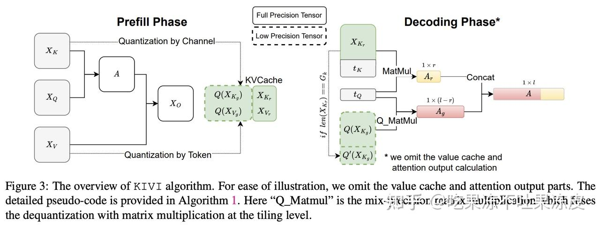

### IntactKV

特点：保持关键词元的KV缓存无损

IntactKV先使用全精度模型生成关键词元的无损 KV 并将其缓存下来，量化模型在推理时就能直接使用无损的关键词元表征，从而有效提升量化模型精度。通过利用LLM推理时的公共前缀防止给量化模型的推理带来任何额外开销。即IntactKV只包含公共前缀，那么全精度模型在生成IntactKV后就可以被释放。

此外，缓存的IntactKV还可以作为模型的额外参数做校准来进一步弥补量化误差。比如：在大小为128的校准集上做轻量化训练，可学习参数仅为缓存下来的IntactKV，损失函数采用量化模型和全精度模型输出的 MSE 损失。

### KVQuant

特点：离线量化、基于校准集量化无需进行分组

KVQuant 通过结合几种新颖的方法来缓解 KV 缓存量化的精度损失。具体的优化技术如下：

一、逐通道（Per-Channel）对 Key 进行量化，通过调整 Key 激活的量化维度以更好地匹配分布；按通道对Key进行量化也在同期的工作KIVI中被探索，该工作将同一通道中的大幅度值组合在一起以最小化量化误差。他们的按通道量化方法需要进行细粒度分组，同时保持KV缓存的一部分为fp16精度。而本工作则展示了通过利用离线校准集，可以准确地执行按通道量化，而不需要进行分组。

二、在 RoPE 之前对 Key 进行量化，在旋转位置嵌入之前量化Key激活，以减轻其对量化的影响；同时，为了能够在RoPE之前量化Key，作者**开发了一个融合Kernel，以在反量化后高效应用RoPE**。

三、非均匀 KV 缓存量化，通过导出每层敏感度加权的非均匀数据类型，以更好地表示分布；

四、按向量（Per-Vector）密集和稀疏量化，分别隔离每个向量的异常值，以最大限度地减少量化范围中的偏差。

五、Attention Sink 感知量化，由于 Attention Sink 现象，模型对第一个Token中的量化误差异常敏感。通过仅保留第一个Token为FP16 来确保模型的精度。

六、在逐通道量化中，更新在线缩放因子是具有挑战性的，因为每个传入通道对应的缩放因子可能需要在 KV 缓存中添加新Token时进行更新。因此，离线（即在运行推理之前使用校准数据）计算统计数据。**采用逐通道量化有效地进行离线校准，从而避免了在线更新缩放因子的需要**。对于逐Token量化，由于存在异常的 Value tokens ，离线校准缩放因子是具有挑战性的。因此，**每个传入Token在线计算缩放因子和异常值阈值**。通过卸载到CPU来有效地在线计算每个Token的异常值阈值。通过**利用定制的量化函数**实现来压缩激活，可以**在线执行逐 Token 的 Value 量化**而不会影响性能。

### Atom

特点：W4A4KV4、对异常值应用INT8量化

为了在保持准确性的同时将LLMs量化到极低比特精度，Atom结合了一系列针对LLM特性量身定制的量化机制。具体如下：

一、通过对权重和激活进行混合精度量化与通道重排序，提高量化准确性。同时由于8位（如：FP8和INT8）足以表示异常值，因此对异常值应用INT8量化。

二、细粒度分组量化**将矩阵分成子组并在每个子组内独立进行量化**，在准确性提升和反量化开销之间提供了权衡。

三、采用**动态量化**，为每次推理中的每个激活矩阵定制量化参数。为了控制动态量化的开销，作者像ZeroQuant的实现一样，将量化操作融合到先前的算子中。由于非对称量化可能会导致显著的运行时开销，因为需要大量的额外计算。为了在吞吐量和准确性之间取得平衡，作者**采用具有精心选择的裁剪阈值进行对称量化**；同时，还在量化权重矩阵时引入了GPTQ，因为这是一个离线过程，可以在不牺牲运行时效率的情况下提升准确性。

四、对KV缓存以注意力头的粒度应用非对称低比特量化，以保持高精度。

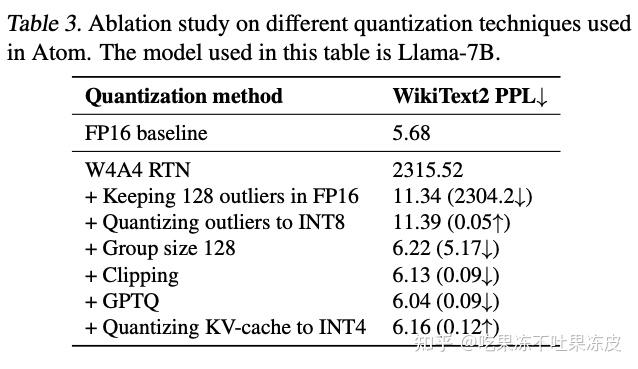

### QuaRot

特点：W4A4KV4

由于量化激活很困难，因为它们有较大的异常值。以前的工作依赖于使用校准集来表征异常特征，并在推理期间将它们保留在更高的精度。而本文通过使用随机Hadamard变换旋转模型输入来解决异常特征问题。作者利用计算不变性的思想，将Hadamard变换融合到权重矩阵中，从而得到一个没有异常特征的等效网络。这使得权重、激活和KV缓存可以量化到4比特，而模型精度损失很小。QuaRot由两个阶段组成。

- 第一阶段，对模型权重进行运算（以全精度），并在模型的前向传播中插入两个额外的哈达玛（Hadamard）运算（哈达玛矩阵是一种方块矩阵。它的矩阵元素仅包含1或-1。其矩阵中不同的行具备正交性质），有效地抑制了异常值通道。
- 第二阶段，使用某种现有方法（GPTQ、RTN等）量化权重，并在前向传播中添加量化操作以实现激活的在线量化。

默认情况下，使用GPTQ量化权重，而激活则使用简单的RTN方案进行在线量化。

### QoQ

特点：W4A8KV4

为了实现 W4A8KV4 量化精度的理论吞吐量优势，同时不牺牲大语言模型的有效性。QoQ算法采用渐进式分组量化、SmoothAttention和各种通用量化优化功能。

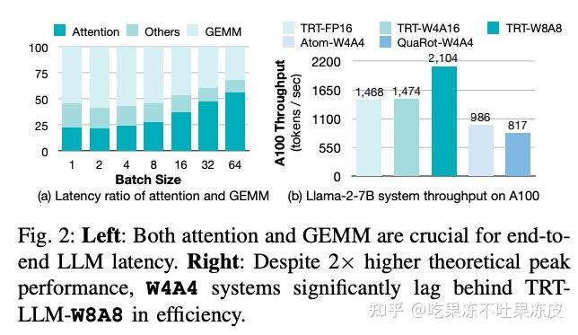

具体如下：

**渐进式分组量化**：给定权重张量，首先**应用逐通道（per-channel）对称INT8量化**，然后，进一步在中间权重张量上**应用逐组（per-group）非对称INT4量化**。对于 W4A8 GEMM 计算，4位量化权重张量将首先根据上述方程反量化为中间8位量化权重张量，然后执行INT8矩阵乘法，就好像是 W8A8 逐通道（per-channel）量化一样。此外，QoQ引入了一个保护范围，允许将反量化操作融合到 W4A8 GEMM Kernel 中，实现全寄存器级并行，最小化CUDA Core开销。

**SmoothAttention**：由于Key矩阵在每个Attention头中都有固定的异常值通道。受SmoothQuant的启发，作者提出**通过逐通道（per-channel）因子缩小 Key 缓存中的异常通道**。为了消除SmoothAttention缩放额外Kernel调用开销，将缩放因子融合到前一层的权重中。

**LLM量化通用优化**：块输入模块旋转（受Quarot、Quip的启发，通过乘以旋转矩阵来旋转块输入激活）、块输出模块平滑（受SmoothQuant的启发）、激活感知的通道重排序（使得具有相似显著性的通道在同一个量化组，降低精度损失）、权重裁剪（减少量化误差）。

## 量化对大模型的影响

该部分参考：**Evaluating Quantized Large Language Models**

### 量化对模型精度的影响

- **越大的模型对于权重和KV Cache量化容忍度更高，而对权重-激活值量化容忍度更低**。出现这种现象的原因可以通过数据分布发现：模型越大，分布在权重和KV Cache中的离群值越少，而分布在激活值中的离群值越多。 
  - 小模型的 INT4 仅权重量化会导致精度大幅下降，但这种影响会随着模型大小的增加而减弱。
  - INT8 激活导致小型模型的准确度下降最小，但较大的模型表现出更大的下降。

- 利用专家混合（MoE）技术增加模型大小并不一定增强模型对量化的容忍度。
- 在大多数任务上，大部分LLMs可以通过W4或KV4量化保持其性能。当将LLMs量化到W3或KV3时，所有模型家族中小型模型的性能都会明显下降。此外，对于W2或KV2，大多数模型都会经历显著的性能损失。
- 对于权重-激活量化，W4A8 可以达到良好性能。W4A4量化将严重影响LLMs的效果。在具有大批量大小和长文本的实际应用中，一种常见做法是同时量化权重和KV缓存。对于短文本任务，W8KV4几乎无损失。对于长文本任务，W8KV8是更好的选择。

### 量化对不同任务类型能力的影响

**自然语言处理能力**：

基本自然语言处理能力包括语言建模、自然语言理解、自然语言生成能力。

对于多数自然语言处理任务，大多数大模型可以采用W4、W4A8、KV4、W8KV4量化位宽，几乎没有性能损失（<2%）。

当使用极低的位宽时，如W2或W4A4，若想使用SOTA量化方法将模型性能恢复到类似于FP16的水平是一个很大的挑战。

**涌现能力**：

大模型的涌现能力包括上下文学习、指令跟随、多步推理、自我校准能力。四类涌现能力对于量化的容忍度由高到低依次为：上下文学习~指令跟随>多步推理~自我校准。

上下文学习任务：

对于上下文学习任务，适当增加例子数量（由0到5）可以提升模型（或量化模型）的性能；但例子过多（~10个）时模型性能不会持续，甚至略有下降。

多步推理任务：

在多步推理任务中，**数学推理对于量化的容忍度低于常识推理**。对于数学推理任务，模型量化后会出现一些量化前没有出现的错误，主要的错误类型包括抄写错误、漏看条件、计算错误、逻辑错误。

总的来说，对于较小的模型（小于13B），W8或KV8适合于维持多步推理和自我校准能力。对于较大的模型（大于13B），W4或KV4适合于维持**上下文学习、指令跟随、多步推理、自我校准**的涌现能力。此外，对于大多数大语言模型，**W4A8不会导致显著的性能损失，但W4A4会导致所有模型完全丧失涌现能力**。

**对话能力**：

多数模型在W8、W8A8、KV4量化位宽下对话能力几乎不损失。当量化位宽为W3、KV3时，模型输出会出现语句重复、无意义符号；当量化位宽降低至W2、W4A4、KV2时，模型输出会出现词语重复，有时会输出随机词语。

**长文本能力**：

相较于短文本（<4k），输入长文本（>4k）时模型性能对权重和kv cache量化容忍度更低。对于长文本任务，**多数模型对KV Cache量化的容忍度低于对权重、权重-激活量化**。因此在多数情况下，推荐使用W4、W4A8、KV8量化位宽执行长文本任务。

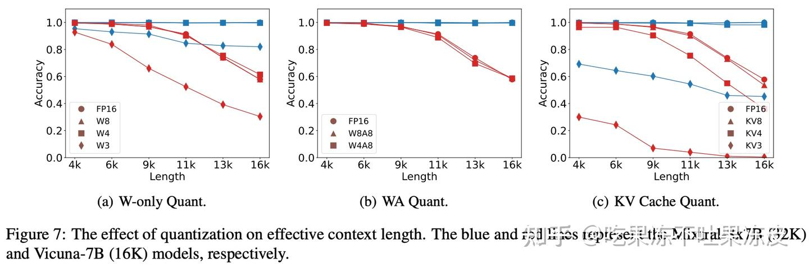

### 量化对于模型推理性能的影响

- Weight-only量化可以显著加速decoding阶段，从而改善端到端延迟。
- 关于prefill阶段，Weight-only量化可能实际上会增加延迟。
- 随着批量大小和输入长度的增加，Weight-only量化所带来的加速效果逐渐减小。
- 对于较大的模型，Weight-only量化提供了更大的益处，因为较大模型尺寸的内存访问开销显著增加。

## 如何选择正确量化方法最佳实践

下面是TensorRT-LLM中选择量化方法的最佳实践。量化方法包含三个主要组成部分：

- 权重精度格式
- 激活精度格式
- 校准算法

通常，在小批量推理场景（批量大小≤4）的情况下，推理通常是“内存限制”。在内存限制推理中，吞吐量受权重加载时间（从 GPU 内存到 GPU 缓存）的限制，即推理受到内存带宽的限制。因此，仅权重量化方法（例如：INT4 AWQ 或 INT4-FP8 AWQ，此外还可以考虑微软的FP6-LLM方案）可提供不错的性能提升。

对于大批量推理场景（例如：批量大小≥16），内存带宽和计算密度都成为关键因素。因此，建议选择权重和激活同时量化以及使用具有较低精度计算Kernel的量化方法。对于批量大小 ≥ 16，量化方法的选择是特定于模型的。建议优先使用 FP8，因为 FP8 几乎不会导致精度下降，并且性能强大。如果 FP8 性能不能满足您的要求，可以尝试 INT4-FP8 AWQ。如果部署在 Ampere GPU 或更早版本上，建议使用 INT4 AWQ 或 INT8 SQ。

根据特定的使用场景，用户可能对精度下降和校准时间有不同的容忍度。下表是TensorRT-LLM中如何选择量化方法的总结。其中，性能和影响是在 10 多个流行的 LLMs 上测量的而来。

| 量化方法                      | 小批量性能 | 大批量性能 | 精度下降 | 详情                                                         |
| ----------------------------- | ---------- | ---------- | -------- | ------------------------------------------------------------ |
| FP8                           | 中         | 中         | 非常低   | - 使用 min-max 校准进行 FP8 逐张量（per-tensor）权重和激活量化。  - 将 FP16/BF16 模型压缩至原始大小的 50%。 - 校准时间：分钟。 - 通过 TensorRT、TensorRT-LLM 进行部署。支持的 GPU 架构：Ada、Hopper 及更高版本。 |
| INT8 SmoothQuant              | 中         | 中         | 中       | - 使用SmoothQuant校准的变体进行 8 位整数量化。 - 逐通道权重量化、逐张量激活量化。 - 将 FP16/BF16 模型压缩至原始大小的 50%。 - 校准时间：分钟。 - 使用 TensorRT、TensorRT-LLM 进行部署。大多数 GPU 都支持。 |
| INT4 Weights only AWQ (W4A16) | 高         | 低         | 低       | - - 通过AWQ校准进行 4 位整数仅权重量化（group-wise/block-wise）。 - - 将 FP16/BF16 模型压缩至原始大小的 25%。 - 校准时间：数十分钟。 - 通过 TensorRT-LLM 进行部署。支持的 GPU：Ampere 及更高版本。 |
| INT4-FP8 AWQ (W4A8)           | 高         | 中         | 低       | - 使用 AWQ校准进行4 位整数权重量化（group-wise/block-wise）、FP8 激活量化（per-tensor） - 将 FP16/BF16 模型压缩至原始大小的 25%。 - 校准时间：数十分钟 - 通过 TensorRT-LLM 部署。支持的 GPU：Ada、Hopper 及更高版本。 |

## 结语

本文总结了目前市面上主流的大模型量化方案以及讲述了如何根据特定的场景选择合适的量化算法。

码字不易，如果觉得我的文章能够能够给您带来帮助，期待您的点赞收藏加关注~~

参考文档：

- [量化方法怎么选？如何评估量化后的大模型LLM？](https://zhuanlan.zhihu.com/p/695144724)
- [Qllm-Eval：大模型压缩量化方案怎么选？看这一篇就够了](https://zhuanlan.zhihu.com/p/704228271)
- [Evaluating Quantized Large Language Models](https://link.zhihu.com/?target=https%3A//arxiv.org/pdf/2402.18158)
- [Best practices to choose the right quantization methods](https://link.zhihu.com/?target=https%3A//nvidia.github.io/TensorRT-Model-Optimizer/guides/_choosing_quant_methods.html)
- [量化粒度](https://link.zhihu.com/?target=https%3A//medium.com/@curiositydeck/quantization-granularity-aec2dd7a0bb4)
- [量化时机与粒度](https://link.zhihu.com/?target=https%3A//blog.gopenai.com/model-quantization-3-timing-and-granularity-a0978c6e58d4)
- [what's the meaning of "Groupwise 4-bit (128)" #3559](https://link.zhihu.com/?target=https%3A//github.com/pytorch/executorch/issues/3559)
- [揭秘NVIDIA大模型推理框架：TensorRT-LLM](https://link.zhihu.com/?target=https%3A//hub.baai.ac.cn/view/34855)