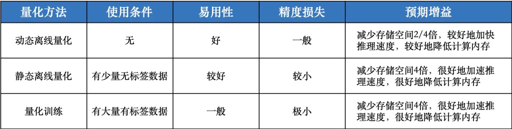
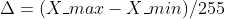
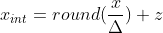
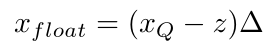
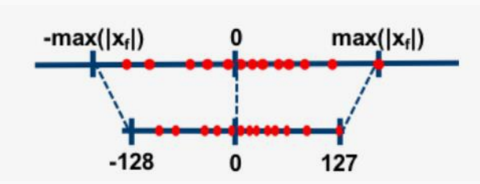
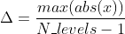
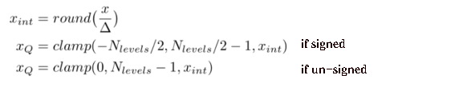
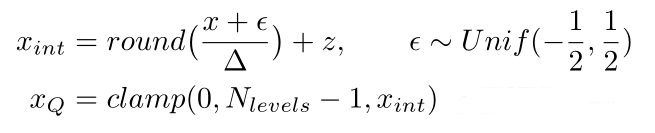
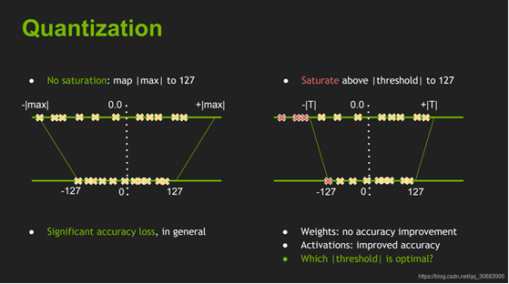

# 量化中的QAT和PTQ

来源：https://zhuanlan.zhihu.com/p/557859725

## 1. 量化分类：

根据谷歌量化白皮书中定义，分为PTQ和QAT两种，而PTQ又包括两种。

**3种量化方式：**QAT, PTQ Dynamic, PTQ Static。

### 1） 量化感知训练 (Quant Aware Training, QAT)：

量化训练让模型感知量化运算对模型精度带来的影响，通过 finetune 训练降低量化误差。这种方法会降低训练速度，但是能够获得更高的精度。

### 2） 动态离线量化 (Post Training Quantization Dynamic, PTQ Dynamic)：

动态离线量化仅将模型中特定算子的**权重**从FP32类型映射成 INT8/16 类型，bias和激活函数 在推理过程中动态量化。但是对于不同的输入值来说，其缩放因子是**动态计算**的（“动态”的由来）。动态量化是几种量化方法中性能最差的。

动态量化常用于非常大的模型。

### 3） 静态离线量化 (Post Training Quantization Static, PTQ Static)：

静态离线量化使用少量无标签校准数据，采用 KL 散度等方法计算量化比例因子。静态量化（Static quantization）与动态量化的区别在于其输入的缩放因子计算方法不同，静态量化的模型在使用前有“calibrate”的过程（校准缩放因子）：准备部分输入（对于图像分类模型就是准备一些图片，其他任务类似），使用静态量化后的模型进行预测，在此过程中量化模型的缩放因子会根据输入数据的分布进行调整。一旦校准完成后，权重和输入的缩放因子都固定（**“静态”的由来**）。静态量化的性能一般比动态量化好，常用于中等模型和大模型。因此实际中基本都是在用静态量化。 [网址](https://link.zhihu.com/?target=https%3A//aistudio.baidu.com/aistudio/projectdetail/3924444)

静态离线量化的目标是求取量化比例因子，主要通过对称量化、非对称量化方式来求，而找最大值或者阈值的方法又有MinMax、KLD、ADMM、EQ等方法，这些后文会讲。

**Tips：**

a） feature map(fm)就是每一层网络的输入tensor，模型最开始时将图像读取后输入到模型的那个tensor就是第一个featuremap，经过conv+relu等输出后得到下一个featuremap；

b）静态量化：对于权重而言，在模型训练完成后数值就基本确定了，而对于 feature map(fm) 来说，却没法事先得知，因此会用一批校准数据 (通常就是验证集的一小部分) 跑一遍网络，以此来统计每一层 feature map 的数值范围。这里的featuremap量化就是我们常说的激活量化。

c） 由于训练网络的时间和资源成本不低，以及通常是客户训练好网络，找我们公司来做硬件部署，因此都是先使用PTQ量化方法来部署，将各个tricks尝试一遍后，基本也能满足部署要求了，因此感觉QAT 量化感知训练一般工业上很少用（至少目前我们还没用到过）。

d）3种量化方式区分框图及对比如下：

该图展示了如何根据需要选择模型量化方法

综合对比了模型量化方法的使用条件、易用性、精度损失和预期收益

## **2. 量化方法：**

量化方法：非对称量化、对称量化、随机量化。

### 1）非对称量化

假设输入的浮点数范围为(X_min, X_max)，量化后的范围为（0, N_levels - 1），对8bits量化来说N_levels为256，scale和零点的计算公式如下：

注：上述z要取一个round，zeropoint基于定点域平移， zeropoint是一个定点域的数。

得到了scale和零点后，对于任意的输入x，量化计算过程为：

其中 clamp计算公式为：

对应的反量化计算公式为：

注意：对于单边分布如(2.5, 3.5)，需要将其范围放宽至(0, 3.5)再量化，在极端的单边分布的情况下会损失精度。

即**若min大于0，就将范围缩放到（0，max）。**

### 2）对称量化

scale（缩放因子）计算公式如下，对8bits量化来说N_levels为128：

对称量化比较简单，它限制零点值为0，量化公式如下：

反量化公式：

### 3）随机量化

随机量化与非对称量化类似，区别在于量化时引入了噪音，其参数计算与反量化过程与非对称量化相同，此处不再赘述。

**Tips：**

a）在硬件支持的情况下，量化时对激活值X使用非对称量化，对权重值W使用对称量化，这是一种常用的量化方案（谷歌白皮书建议）

## 3. 量化工具/框架整理：

参考[该作者](https://link.zhihu.com/?target=http%3A//www.360doc.com/content/22/0127/12/7673502_1015090625.shtml)内容，整理如下：

| 公司         | 量化工具                                        | 推理引擎   | 部署平台            |
| ------------ | ----------------------------------------------- | ---------- | ------------------- |
| Intel        | NNCF                                            | OpenVino   | x86 CPU             |
| 高通         | AIMet                                           | SNPE/QNN   | 高通 DSP/NPU 等芯片 |
| MTK          | Neuropilot                                      | Neuron SDK | 联发科 APU 芯片     |
| Nvidia       | TensorRT（习惯称为TRT）                         | TensorRT   | 英伟达部分 GPU 芯片 |
| 商汤         | MQBench、PPL                                    | PPL        | --                  |
| 腾讯         | NCNN                                            | NCNN       | 多种 CPU 平台       |
| Meta（脸书） | pytorch                                         | Libtorch   | arm/x86 CPU         |
| 微软         | NNI                                             |            |                     |
| 华为         | MindSpore Lite converter—PTQ MindSpore Lite—QAT | MindSpore  | 端、边、云          |
| tvm团队      | TVM                                             | TVM        | 端、边、云          |
| 百度         | PaddleSlim                                      |            |                     |

当然，还有其他厂家的未开源的工具，如芯原、寒武纪、地平线这些厂家都有自己的量化工具。

看了上面这张表后，大家可能也发现了：不同量化训练工具能部署的推理框架和平台，是不一样的。这就意味着，如果你要把量化的模型部署到英伟达的 GPU平台，你就得用英伟达的 TRT 进行量化训练然后导出模型。

同样地，如果要用 华为的 NPU 来部署，就得用 MindSpore。

各家之间没有兼容，对部署工作很不方便。对于 fp32 的模型 (全精度模型)，不管是用 tensorflow 还是 pytorch 训练的模型，都可以很方便地转换到 tflite/SNPE/NCNN 等平台，做到一次训练多平台部署。为什么到了量化这里就不行了呢？

我个人觉得，一个很重要的原因是，量化这块缺乏统一的标准，各个芯片产商都在抢夺市场，各自为战，因此具体到量化推理框架上，各家的算法实现也有很大差异。此外，量化推理和硬件本身有很强的关联性，不同芯片由于支持的指令集和硬件单元的差异，也会导致量化算法有一些差别。

有一点能肯定的是，各家量化工具基本都遵循谷歌量化白皮书，因此大体上量化算法是类似的。

## 4. 量化方法中的量化策略

**TRT量化思路**：使用校准数据集，使得Kullback-Leibler divergence (KLD)为最小值来找到量化时的激活层阈值，来量化激活（也即特征图，featuremap），权重量化是使用的abs(值）的最大值（maximum absolute values）作为阈值量化的；

（也就是权重用的minmax，激活用的KLD求解T）

**TensorflowLite量化思路**：使用abs(值）的最大值（maximum absolute values）作为阈值量化激活，权重量化也是用maximum absolute values作为阈值，并且针对per-channel进行量化；

（也就是权重和激活都是用的minmax）

常用几种量化策略：MinMax、KLD、ADMM、EQ。更多PTQ中量化方式在该论文中的2.2介绍：**EasyQuant: Post-training Quantization via Scale Optimization （EQ算法出处）**

EQ 量化⽅法的主要思想是：误差累计、整⽹决策变成单⽹决策、以余弦相似度为优化⽬标、交替优化权重缩放系数和激活值缩放系数。

总结就是上面说到的权重量化和激活量化时候的scale和bias怎么选择；通常是权重的参数直接计算出来，而激活层更需要量化策略寻找最佳参数；

### 4.1 TRT量化

TensorRT的量化工具也比较成熟了。具体流程就是，我们导出ONNX模型，转换为TensorRT的过程中可以使用TRT提供的Calibration方法去校准，这个使用起来比较简单。可以直接使用trt官方提供的trtexec命令去实现，也可以使用trt提供的python或者C++的API接口去量化。

**TensorRT实现int8量化**

- 对权重直接使用了最大值量化（非饱和量化）；
- 对偏移直接忽略；
- 对激活值采用饱和量化；

*注:* 我理解这里提出的非饱和量化和饱和量化与上文中的对称、非对称量化可以类比，意思差不多。

a）非饱和量化方法（No Saturation）：map |max| to 127

非饱和量化方法计算 FP32 类型 Tensor 中绝对值的最大值 abs_max，将其映射为 127，则量化比例因子等于 abs_max/127

b）饱和量化方法（Saturation）：above |threshold| to 127

饱和量化方法使用 KL 散度计算一个合适的阈值 T（0 < T < mab_max），将其映射为 127，则量化比例因子等于 T/127

非饱和（左）饱和（右）：引用英伟达图

· 一般而言，对于待量化 OP 的权重 Tensor，采用非饱和量化方法，对于待量化 OP 的激活 Tensor（包括输入和输出），采用饱和量化方法。

激活为什么用饱和量化？

因为激活值通常分布不均匀，直接使用非饱和量化会使得量化后的值都挤在一个很小的范围从而浪费了INT8范围内的其他空间，也就是说没有充分利用INT8（-128~+127）的值域；

而进行饱和量化后，使得映射后的-128~+127范围内分布相对均匀，这相当于去掉了一些不重要的因素，保留了主要成分。

如何寻找这个阈值T就成了INT量化的关键，怎么找呢？

不同模型的激活值分布差异很大，这就需要进行动态的量化。

于是，NVIDIA就选择了**KL散度**也即相对熵来对量化前后的激活值分布进行评价，来找出使得量化后INT8分布相对于原来的FP32分布，信息损失最小的那个阈值。

**INT8量化校准过程**

- 先在一个校准数据集上跑一遍原FP32的模型；
- 然后，对每一层都收集激活值的直方图（默认2048个bin），并生成在不同阈值下的饱和量化分布；
- 最后，找出使得KL散度最小的那个阈值T，即为所求。

【TensorRT训练中量化】

此外，训练中量化(QAT)是TensorRT8新出的一个“新特性”，这个特性其实是指TensorRT有直接加载QAT模型的能力。实际上QAT过程和TensorRT没有太大关系，trt只是一个推理框架，实际的训练中量化操作一般都是在训练框架中去做，比如我们熟悉的Pytorch。这一点跟TVM类似，都可以导入提前量化好的模型来做后续部署。

后续继续完善...

## 5. 参考文献

1）量化方法介绍 [【深度学习】模型量化-笔记/实验](https://link.zhihu.com/?target=https%3A//blog.csdn.net/qq_40035462/article/details/123745290)

2）量化方法的综合对比 [模型量化（2）：Paddle 模型的静态量化和动态量化 - 飞桨AI Studio](https://link.zhihu.com/?target=https%3A//aistudio.baidu.com/aistudio/projectdetail/3924444)

