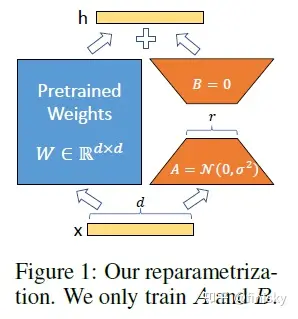

# LoRA: Low-Rank Adaptation of Large Language Models 简读

来源：https://zhuanlan.zhihu.com/p/514033873

之前我们谈到 Adapters 与 Prompting 都是轻量级的训练方法，所谓 lightweight-finetuning。今天来看一下另一种轻量级训练大语言模型的方法:

[LoRA: Low-Rank Adaptation of Large Language Models](https://link.zhihu.com/?target=https%3A//arxiv.org/abs/2106.09685)

微调大规模语言模型到特殊领域和任务是自然语言处理的重要课题之一。但随着模型规模的不断扩大，微调模型的所有参数（所谓`full fine-tuning`）的可行性变得越来越低。以GPT-3的175B参数为例，每增加一个新领域就需要完整微调一个新模型，代价和成本很高：

> An important paradigm of natural language processing consists of large-scale pretraining on general domain data and adaptation to particular tasks or domains. As we pre-train larger models, full fine-tuning, which retrains all model parameters, becomes less feasible. Using GPT-3 175B as an example – deploying independent instances of fine-tuned models, each with 175B parameters, is prohibitively expensive.

## 已有方案的问题

为解决微调大规模语言模型到不同领域和任务的挑战，已有多种方案，比如部分微调、使用adapters和prompting。但这些方法存在如下问题：

- Adapters引入额外的推理延迟 (由于增加了模型层数)
- Prefix-Tuning难于训练，且预留给prompt的序列挤占了下游任务的输入序列空间，影响模型性能

### Adapter引入**推理延迟**

显然，使用Adapter增加模型层数会增加推理的时长：

> While one can reduce the overall latency by pruning layers or exploiting multi-task settings, there is no direct ways to bypass the extra compute in adapter layers.

从上图可以看出，对于线上batch size为1，输入比较短的情况，推理延迟的变化比例会更明显。不过个人认为，绝对延迟的区别不大。 :-)

### **很难直接优化Prompt**

之前工作都提到Prefix-Tuning难于训练，模型性能也并非总是稳步提升。相比之下，LoRA的优势是容易训练：

> We observe that prefix tuning is difficult to optimize and that its performance changes non-monotonically in trainable parameters, confirming similar observations in the original paper.

预留一些sequence做adaption会让处理下游任务的可用sequence长度变少，一定程度上会影响模型性能:

> More fundamentally, reserving a part of the sequence length for adaptation necessarily reduces the sequence length available to process a downstream task, which we suspect makes tuning the prompt less performant compared to other methods.

## LoRA

考虑到上述问题，开个脑洞，根本不对原模型做微调是否可行？

来看看LoRA的思路：

> We take inspiration from Li et al. (2018a); Aghajanyan et al. (2020) which show that the learned over-parametrized models in fact reside on a low intrinsic dimension.
>
> We hypothesize that the change in weights during model adaptation also has a low “intrinsic rank”, leading to our proposed Low-Rank Adaptation (LoRA) approach.

虽然模型的参数众多，但其实模型主要依赖低秩维度的内容(`low intrinsic dimension`)，类比一下，似乎adaption好人使的本质也依赖于此，所以提出了Low-Rank Adaptation (LoRA)。

LoRA的思想也很简单，在原始PLM旁边增加一个旁路，做一个降维再升维的操作，来模拟所谓的 `intrinsic rank` 。训练的时候固定PLM的参数，只训练降维矩阵A与升维矩阵B。而模型的输入输出维度不变，输出时将BA与PLM的参数叠加。用随机高斯分布初始化A，用0矩阵初始化B，保证训练的开始此旁路矩阵依然是0矩阵。

这种思想有点类似于残差连接，同时使用这个旁路的更新来模拟full finetuning的过程。并且，full finetuning可以被看做是LoRA的特例（当r等于k时）：

> This means that when applying LoRA to all weight matrices and training all biases, we roughly recover the expressiveness of full fine-tuning by setting the LoRA rank r to the rank of the pre-trained weight matrices.
>
> In other words, as we increase the number of trainable parameters, training LoRA roughly converges to training the original model, while adapter-based methods converges to an MLP and prefix-based methods to a model that cannot take long input sequences.

在生产环境部署时，LoRA可以不引入推理延迟，只需要将预训练模型参数 W_0 与LoRA参数进行合并（也就是所谓的模型合并）即可得到微调后的模型参数： W=W_0+BA ，在生产环境中像以前一样进行推理，即微调前计算 h=W_0x ，现在计算 h=Wx ，没有额外延迟。现在不少模型仅发布LoRA权重，需要本地与基模型进行模型合并才能使用的原理就在于此。

LoRA与Transformer的结合也很简单，仅在QKV attention的计算中增加一个旁路，而不动MLP模块：

> We limit our study to only adapting the attention weights for downstream tasks and freeze the MLP modules (so they are not trained in downstream tasks) both for simplicity and parameter-efficiency.

总结，基于大模型的内在低秩特性，增加旁路矩阵来模拟全模型参数微调，LoRA通过简单有效的方案来达成轻量微调的目的。它的应用自不必提，可以将现在的各种大模型通过轻量微调变成各个不同领域的专业模型。

此外，考虑OpenAI对GPT模型的认知，GPT的本质是对训练数据的有效压缩，从而发现数据内部的逻辑与联系，LoRA的思想与之有相通之处，原模型虽大，但起核心作用的参数是低秩的，通过增加旁路，达到四两拨千斤的效果。