# 大模型并行技术全体系详解

大模型并行技术是支撑千亿～万亿参数大模型可训练、可推理的核心技术体系，核心目标是解决三大行业瓶颈：**显存墙**（单卡无法容纳完整模型与训练中间态）、**算力墙**（单卡算力不足导致训练周期过长）、**通信墙**（分布式通信开销抵消算力扩展收益）。经过多年工业界实践，已形成以**四大基础并行范式**为核心、**场景化进阶并行**为延伸、**混合并行架构**为落地标准的完整技术栈。

------

## 一、四大基础并行范式（训练 / 推理通用核心）

这是整个并行技术栈的根基，分别从**数据、张量、模型层、序列**四个正交维度做拆分并行，所有进阶方案均基于此扩展。

### 2.1 数据并行（Data Parallelism, DP）

数据并行是分布式训练中最通用、开箱即用的并行范式，核心是**数据分片、模型全量复制**，核心解决训练吞吐量不足的问题，优化后也可突破部分显存瓶颈。

#### 1. 核心原理

将**完整的模型副本（含参数、优化器状态）复制到每一张加速卡（GPU/NPU）上**，同时将全局训练批次（Global Batch）按卡数均分为多个互不重叠的微批次（Mini-batch），每张卡仅处理自己分到的分片数据；完成前向 / 反向计算得到梯度后，所有卡同步并聚合梯度，统一更新模型参数，保证所有卡的模型始终完全一致。

#### 2. 核心执行步骤（同步 SGD 模式，工业界主流）

1. **模型复制**：所有 Worker（卡 / 节点）初始化完全相同的模型副本、优化器状态，保证初始参数一致。
2. **数据分片**：全局 Batch 数据按卡数 N 均分为 N 份，每张卡仅加载自己的分片数据。
3. **前向传播**：每张卡独立用本地分片数据完成前向计算，得到本地 Loss。
4. **反向传播**：每张卡基于本地 Loss，独立计算模型参数对应的本地梯度。
5. **梯度聚合同步**：通过集合通信（主流为 Ring AllReduce），所有卡的本地梯度做全局平均，得到统一的全局梯度。
6. **参数更新**：每张卡用完全相同的全局梯度更新本地模型参数，进入下一轮迭代。

#### 3. 主流架构与优化变种

（1）参数服务器（PS）架构（早期主流）

- 中心化架构：分为 Worker 节点（负责计算梯度）和 Server 节点（负责存储全局参数、聚合梯度、更新参数）。
- 流程：Worker 计算本地梯度→上传给 PS→PS 聚合梯度并更新参数→Worker 拉取最新参数。
- 缺点：PS 节点易成为带宽和性能瓶颈，大规模扩展时加速比下降严重，目前已逐步被 AllReduce 架构替代。

（2）AllReduce 架构（当前主流，如 PyTorch DDP）

- 去中心化架构：所有节点完全对等，无中心节点，通过 Ring AllReduce 算法实现梯度的高效聚合。
- 优势：通信开销与卡数无关，仅与梯度数据量相关，大规模多卡场景下加速比远优于 PS 架构，是当前数据并行的事实标准。

（3）ZeRO（零冗余优化器，DeepSpeed 核心技术）

- 原生数据并行的核心痛点：N 张卡存在 N 份完全冗余的模型参数、梯度、优化器状态，显存浪费严重，模型大小无法超过单卡显存上限。
- ZeRO 通过分片消除冗余，是数据并行的革命性优化，分为 3 个阶段：
  - ZeRO-1：仅分片优化器状态，显存占用减少 4 倍（Adam 优化器）；
  - ZeRO-2：分片优化器状态 + 梯度，显存占用再减少 N 倍（N 为卡数）；
  - ZeRO-3：分片优化器状态 + 梯度 + 模型参数，理论上显存占用随卡数线性下降，可支持单卡无法容纳的超大模型，无需修改模型代码。

#### 4. 优缺点与适用场景

|   维度   |                           核心特点                           |
| :------: | :----------------------------------------------------------: |
|   优点   | 1. 实现极简，框架原生支持，几乎无需修改模型代码；2. 通用性极强，适配所有模型结构；3. 计算完全并行，通信仅发生在梯度同步阶段，单机房内线性加速比优秀； |
|   缺点   | 1. 原生方案显存冗余严重，模型大小受限于单卡显存；2. 大模型 / 跨节点场景下，梯度通信开销急剧增大，加速比下降； |
| 适用场景 | 1. 中小模型训练，快速提升训练吞吐量；2. 搭配 ZeRO 优化，实现低成本的大模型训练；3. 作为混合并行的基础组件，提升数据吞吐量； |

### 2.2 张量并行（Tensor Parallelism, TP，层内模型并行）

#### 核心定位

层内参数拆分，从根本上解决单卡无法容纳单个大层的问题，适配高带宽单机多卡场景，是千亿参数大模型训练的必备组件。

#### 核心原理

对 Transformer 单个层的权重矩阵按数学维度切分，拆分到多张卡上，多张卡协同完成该层的前向 / 反向计算，仅需同步必要的中间结果，无需存储全量权重。

#### 主流切分方式（以线性层 `Y = X @ W` 为例）

1. **列并行（按列切分权重 W）**

将 W 按列均分为 N 份，每张卡存储 1/N 列，输入 X 全量保留在所有卡；每张卡独立计算 

   ```
   Y_i = X @ W_i
   ```

最终通过 AllGather 拼接得到完整 Y。典型场景为 Transformer 的 QKV 投影层，将多个注意力头拆分到不同卡，单卡独立计算对应注意力头，大幅降低单卡参数量。

2. **行并行（按行切分权重 W）**

将 W 按行均分为 N 份，每张卡存储 1/N 行，输入 X 按列对应切分；每张卡独立计算 

   ```
   Y_i = X_i @ W_i
   ```

最终通过 AllReduce 求和得到完整 Y。典型场景为 Transformer FFN 层的降维线性层，与列并行的升维层配合，实现中间激活值无通信，仅需一次 AllReduce，最小化通信开销。

#### 工业界标准实现

英伟达 Megatron-LM 的 Transformer 专用张量并行，最优组合为：Self-Attention 层（QKV 列并行 + 输出投影行并行）+ FFN 层（升维列并行 + 降维行并行），配套序列并行优化，消除 LayerNorm、Dropout 等算子的计算冗余。

#### 优缺点与适用场景

|                             优点                             |                             缺点                             |                           适用场景                           |
| :----------------------------------------------------------: | :----------------------------------------------------------: | :----------------------------------------------------------: |
| 单层参数拆分，彻底突破单卡大层显存限制；无流水线气泡，算力利用率高 | 层内通信频繁，对带宽要求极高，仅适合单机 NVLink 高速互联场景；需修改模型代码，有侵入性 | 1. 大参数量 Transformer 层的拆分，单机 8 卡 / 16 卡高带宽场景；2. 混合并行架构的核心组件，与 PP/DP 配合 |

------

### 2.3 流水线并行（Pipeline Parallelism, PP，层间模型并行）

#### 核心定位

层间纵向拆分，解决模型总层数过多、总参数量过大的问题，适配跨节点多机多卡场景，是万亿参数大模型的核心支撑技术。

#### 核心原理

将完整模型按层 / 层组拆分为多个连续的计算阶段（Stage），每个阶段部署到不同的卡 / 节点上；训练时，数据依次流经各个阶段完成前向计算，梯度反向依次回流完成参数更新，每张卡仅存储自己负责阶段的参数。

#### 核心痛点与优化演进

原生流水线并行的致命缺陷是**计算气泡（Bubble）**：单批次数据训练时，大部分卡处于空闲等待状态，算力利用率极低。工业界通过以下方案逐步解决：

1. **GPipe（谷歌，微批次拆分）**

核心优化是将全局 Batch 拆分为多个微批次（Micro-batch），前一阶段完成一个微批次计算后，立即传给下一阶段，同时开始下一个微批次的计算，将流水线填满。气泡占比为 

   ```
   (阶段数-1)/微批次数量
   ```

微批次越多，气泡占比越低，算力利用率可提升至 90% 以上；缺点是需等待所有微批次前向完成后再统一执行反向计算，激活值显存占用高。

2. **PipeDream（1F1B 调度，当前主流）**

核心优化是采用「1 个前向计算 + 1 个反向计算」的交替调度策略，前向和反向计算重叠执行，大幅压缩气泡，同时降低激活值显存占用。进阶优化为 Megatron-LM 的 Interleaved 1F1B（交错调度），将单个卡上的阶段拆分为多个虚拟阶段，进一步降低气泡，解决阶段间负载不均衡问题。

#### 优缺点与适用场景

|                             优点                             |                             缺点                             |                           适用场景                           |
| :----------------------------------------------------------: | :----------------------------------------------------------: | :----------------------------------------------------------: |
| 模型总参数量可远超单卡显存上限，仅需单个阶段能塞进单卡；通信仅发生在相邻阶段，通信量小，适配跨节点低带宽场景；并行度随模型层数线性扩展 | 原生实现气泡严重，需复杂的调度优化；阶段间负载不均衡会导致利用率大幅下降；需手动拆分层组，对模型有侵入性 | 1. 超深层、千亿参数以上大模型的跨机训练；2. 混合并行架构的核心组件，与 TP/DP 配合 |

------

### 2.4 序列并行（Sequence Parallelism, SP）

#### 核心定位

序列维度拆分，解决长上下文大模型的激活值显存爆炸问题，是当前百万 token 长序列训练 / 推理的核心技术。随着大模型上下文窗口从 4k→32k→128k→百万 token，序列维度的激活值显存呈平方级增长，远超参数显存，序列并行已成为刚需。

#### 主流实现方案

1. **基础序列并行（Megatron-LM）**

核心原理是针对张量并行无法覆盖的 LayerNorm、Dropout、Softmax 等算子，沿序列维度（seq_len）拆分输入，每张卡仅处理序列的一个分片，消除计算冗余，降低激活值显存。限制是仅能拆分非注意力算子，无法拆分注意力计算本身，序列长度扩展能力有限，无法支持超百万 token。

2. **Ring Attention（环形注意力，当前长序列主流）**

核心突破是彻底实现注意力计算的序列维度并行，理论上序列长度可随卡数线性扩展，无上限。

   - 核心原理：将输入序列、KV 缓存沿序列维度拆分到多张卡上，每张卡仅存储序列的一个分片；注意力计算时，通过环形通信依次获取相邻卡的 KV 分片，完成当前分片的注意力计算，通信和计算完全重叠；整个过程无需存储全量序列和 KV 缓存，单卡显存占用仅和本地序列分片长度成正比。
   - 进阶方案：搭配 Flash Attention 进一步提升计算效率，目前已成为百万 token 级超长序列大模型训练 / 推理的标配。

#### 优缺点与适用场景

|                             优点                             |                             缺点                             |                           适用场景                           |
| :----------------------------------------------------------: | :----------------------------------------------------------: | :----------------------------------------------------------: |
| 彻底解决长序列激活值显存爆炸问题，序列长度可随卡数线性扩展；通信和计算可重叠，开销可控 | 对通信延迟敏感，跨节点场景需优化调度；需修改注意力算子实现，有侵入性 | 1. 长上下文大模型（seq_len>32k）的训练 / 推理；2. 百万 token 级超长序列场景，如文档理解、代码生成、长对话模型 |

------

## 二、场景化进阶并行技术

针对特定模型架构、特定场景的专用并行技术，是基础范式的重要补充，支撑超大规模大模型的落地。

### 3.1 专家并行（Expert Parallelism, EP，MoE 大模型专用）

#### 核心定位

混合专家模型（MoE）的核心并行技术，解决 MoE 模型专家数量多、参数量爆炸的问题，是万亿参数大模型的核心支撑方案。MoE 模型（如 GPT-4、Switch Transformer、GLaM）的核心是将 Transformer 的 FFN 层替换为多个独立的专家 FFN，每个 token 仅路由到 2-4 个专家进行计算，在不增加计算量的前提下大幅提升模型参数量。

#### 核心原理

将所有专家沿专家维度拆分到不同的卡 / 节点上，每张卡仅存储一部分专家；前向计算时，通过 All2All 集合通信，将 token 路由到对应专家所在的卡，完成计算后再将结果传回原卡；反向计算时，梯度按相同路径回流，更新对应专家的参数。

#### 核心优化与挑战

- 路由机制优化：解决专家负载不均衡问题（部分专家被大量 token 路由，部分空闲），主流方案有辅助损失、门控机制优化、专家容量限制等；
- 通信优化：All2All 通信开销较大，通过 token 预取、通信计算重叠、拓扑感知路由等方式降低开销；
- 主流实现：DeepSpeed-MoE、Megatron-LM MoE、Switch Transformer、GShard。

#### 优缺点与适用场景

|                             优点                             |                             缺点                             |                           适用场景                           |
| :----------------------------------------------------------: | :----------------------------------------------------------: | :----------------------------------------------------------: |
| 可支撑万亿参数级超大模型，参数量随专家数线性扩展，计算量仅小幅增长；显存占用随卡数线性下降 | 专家负载不均衡会导致算力利用率大幅下降；All2All 通信开销较大，对集群网络要求高；仅适配 MoE 架构模型 | 1. 万亿参数级 MoE 大模型的训练 / 推理；2. 追求大参数量、低计算量的大模型场景 |

------

### 3.2 配套核心优化技术（与并行技术深度绑定）

这些技术虽不是严格的并行范式，但和并行技术配合可大幅提升显存效率和训练效率，是大模型训练的必备组件：

1. **激活重计算（Activation Checkpointing）**

核心原理是前向计算时仅保存部分关键激活值，反向计算时按需重新计算丢弃的激活值，用计算换显存，可降低 70% 以上的激活值显存占用。进阶方案有选择性重计算、梯度检查点分片，进一步平衡计算和显存。

2. **显存卸载（Offloading）**

核心原理是将暂时不用的参数、梯度、优化器状态、激活值，从 GPU 显存卸载到 CPU 内存 / SSD 硬盘，训练时按需加载回 GPU，进一步突破单卡显存上限。主流实现有 ZeRO-Offload、FSDP Offload、DeepSpeed CPU Offload。

3. **通信计算重叠**

核心原理是将通信操作和计算操作在时间上重叠，隐藏通信延迟，比如反向计算时同时完成已计算完层的梯度 AllReduce，是所有并行方案的标配优化。

4. **拓扑感知调度**

核心原理是根据集群的网络拓扑（如单机内 NVLink、机间 RoCE/Infiniband），优化并行策略的映射，比如 TP 放在单机内，PP/DP 跨机，最小化通信开销。

------

## 三、工业界落地标准：混合并行架构

当前千亿 / 万亿参数大模型训练，**不会单独使用任何一种并行范式**，而是采用多种并行技术组合的混合并行架构，兼顾显存效率、算力利用率和通信开销。

### 4.1 3D 并行（基础标准架构）

当前千亿 / 万亿参数大模型训练，**不会单独使用某一种并行范式**，而是采用**数据并行 + 张量并行 + 流水线并行**结合的 3D 混合并行方案（Megatron-LM 提出），兼顾显存效率、计算效率和扩展性。

### 典型 3D 并行配置示例

以 256 卡集群（32 台机器，每台 8 卡，NVLink 高速互联）为例：

1. **张量并行（TP=8）**：单机内 8 张卡做层内张量并行，拆分 Transformer 层的权重矩阵，利用 NVLink 的高带宽降低通信开销，解决单卡无法容纳大层的问题；
2. **流水线并行（PP=4）**：跨机器将模型拆分为 4 个阶段，每个阶段 8 台机器，解决模型总层数过多、总参数量过大的问题；
3. **数据并行（DP=8）**：每个流水线阶段内的 8 台机器做数据并行，拆分训练数据，提升训练吞吐量，同时通过梯度同步保证模型一致性。

总并行度：`TP * PP * DP = 8 * 4 * 8 = 256`，完美适配集群规模，同时兼顾显存、算力和通信效率。

代表应用：GPT-3 175B、LLaMA 2 70B、PaLM 540B 训练。

### 4.2 4D/5D 并行（进阶架构）

- 4D 并行：3D 并行 + 序列并行 SP（长序列场景）/ 专家并行 EP（MoE 场景）；
- 5D 并行：3D 并行 + SP + EP，适配万亿参数 MoE 长序列大模型；
- 代表应用：GPT-4（推测为 MoE 4D/5D 并行）、Switch Transformer 1.6T、百万 token 长序列模型。

### 4.3 并行策略选型原则

| 模型规模 | 上下文长度 | 模型架构 |                推荐并行方案                |
| :------: | :--------: | :------: | :----------------------------------------: |
|   <10B   |    <8k     | 稠密模型 |        DP + ZeRO/FSDP，无需其他并行        |
| 10B-70B  |   8k-32k   | 稠密模型 | 3D 并行（DP+TP+PP），单机 TP=8，跨机 PP+DP |
|   >70B   |  32k-128k  | 稠密模型 |           3D 并行 + 序列并行 SP            |
|  >100B   |   >128k    | 稠密模型 |          3D 并行 + Ring Attention          |
|   >1T    |    任意    | MoE 模型 |        4D/5D 并行（DP+TP+PP+EP+SP）        |

------

## 四、推理侧的并行技术

大模型推理的核心目标是**低延迟、高吞吐、高显存利用率**，并行技术围绕这三个目标优化，核心方案如下：

1. **张量并行 TP**：将模型层拆分到多张卡，降低单卡显存占用，同时并行计算降低推理延迟，是当前推理最常用的并行方案；
2. **流水线并行 PP**：将模型按层拆分为多个阶段，部署到不同卡，实现多请求的流水线处理，提升推理吞吐量，适配超大模型推理；
3. **专家并行 EP**：MoE 模型推理的核心，将专家拆分到不同卡，按需激活对应专家，降低单卡显存占用，提升吞吐量；
4. **序列并行 SP/Ring Attention**：长上下文推理的核心，拆分序列和 KV 缓存，解决长序列推理的显存爆炸问题；
5. **多实例并行（MIP）**：在多卡集群上启动多个独立的推理实例，每个实例处理不同的请求，线性提升整体吞吐量，适配高并发在线推理场景。

------

## 五、常见误区与核心注意事项

1. **误区 1：并行度越高，训练速度越快**

纠正：并行度提升会带来通信开销的线性增长，当通信开销超过计算开销时，加速比会急剧下降，甚至出现负加速。需根据模型规模、集群带宽，平衡并行度与通信开销。

2. **误区 2：模型并行一定比数据并行好**

纠正：两者有明确的适用场景。中小模型训练，数据并行的简单性、通用性和加速比远优于模型并行；只有当模型规模超过单卡显存上限时，才需要引入模型并行。

3. **误区 3：所有并行技术都需要高带宽网络**

纠正：不同并行技术对网络的要求差异极大：TP、EP、Ring Attention 需要 NVLink/Infiniband 高带宽低延迟网络；PP、DP 通信量小，适配普通 RoCE 以太网跨节点场景。

4. **核心注意事项：负载均衡是并行效率的关键**

无论是 PP 的阶段负载、EP 的专家负载，还是 DP 的数据负载，不均衡都会导致部分卡空闲，算力利用率大幅下降，是并行策略优化的核心重点。


# 大模型分布式训练并行技术（一）-概述

近年来，随着[Transformer](https://zhida.zhihu.com/search?content_id=221180389&content_type=Article&match_order=1&q=Transformer&zhida_source=entity)、[MOE架构](https://zhida.zhihu.com/search?content_id=221180389&content_type=Article&match_order=1&q=MOE架构&zhida_source=entity)的提出，使得深度学习模型轻松突破上万亿规模参数，传统的单机单卡模式已经无法满足超大模型进行训练的要求。因此，我们需要基于单机多卡、甚至是多机多卡进行分布式大模型的训练。

而利用[AI集群](https://zhida.zhihu.com/search?content_id=221180389&content_type=Article&match_order=1&q=AI集群&zhida_source=entity)，使深度学习算法更好地从大量数据中高效地训练出性能优良的大模型是分布式机器学习的首要目标。为了实现该目标，一般需要根据硬件资源与数据/模型规模的匹配情况，考虑对计算任务、训练数据和模型进行划分，从而进行分布式存储和分布式训练。因此，分布式训练相关技术值得我们进行深入分析其背后的机理。

下面主要对大模型进行分布式训练的并行技术进行讲解，本系列大体分九篇文章进行讲解。

- **[大模型分布式训练并行技术（一）-概述](https://link.zhihu.com/?target=https%3A//juejin.cn/post/7195845066887053368)**
- **[大模型分布式训练并行技术（二）-数据并行](https://link.zhihu.com/?target=https%3A//juejin.cn/post/7195845066887053368)**
- **[大模型分布式训练并行技术（三）-流水线并行](https://link.zhihu.com/?target=https%3A//juejin.cn/post/7195845066887053368)**
- **[大模型分布式训练并行技术（四）-张量并行](https://link.zhihu.com/?target=https%3A//juejin.cn/post/7195845066887053368)**
- **[大模型分布式训练并行技术（五）-序列并行](https://link.zhihu.com/?target=https%3A//juejin.cn/post/7195845066887053368)**
- **[大模型分布式训练并行技术（六）-多维混合并行](https://link.zhihu.com/?target=https%3A//juejin.cn/post/7195845066887053368)**
- **[大模型分布式训练并行技术（七）-自动并行](https://link.zhihu.com/?target=https%3A//juejin.cn/post/7195845066887053368)**
- **[大模型分布式训练并行技术（八）-MOE并行](https://link.zhihu.com/?target=https%3A//juejin.cn/post/7195845066887053368)**
- **[大模型分布式训练并行技术（九）-总结](https://link.zhihu.com/?target=https%3A//juejin.cn/post/7195845066887053368)**

> 另外，我撰写的**大模型相关的博客及配套代码**均整理放置在Github：[llm-action](https://link.zhihu.com/?target=https%3A//github.com/liguodongiot/llm-action%23llm%E5%BE%AE%E8%B0%83%E5%AE%9E%E6%88%98)，有需要的朋友自取。

本文为分布式训练并行技术的第一篇，对大模型进行分布式训练常见的并行技术进行简要介绍。

## **数据并行**

数据并行是最常见的并行形式，因为它很简单。在数据并行训练中，数据集被分割成几个碎片，每个碎片被分配到一个设备上。这相当于沿批次（Batch）维度对训练过程进行并行化。每个设备将持有一个完整的模型副本，并在分配的数据集碎片上进行训练。在反向传播之后，模型的梯度将会聚合（All Reduce），以便在不同设备上的模型参数能够保持同步。典型的数据并行实现：PyTorch DDP。

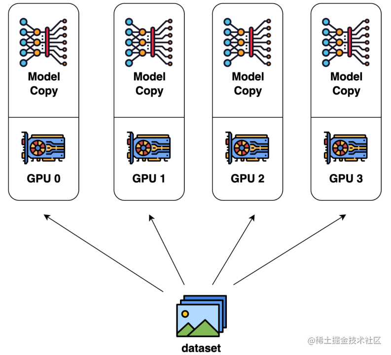

image.png

## **[模型并行](https://zhida.zhihu.com/search?content_id=221180389&content_type=Article&match_order=1&q=模型并行&zhida_source=entity)**

在数据并行训练中，一个明显的特点是每个 GPU 持有整个模型权重的副本。这就带来了冗余问题。另一种并行模式是模型并行，即模型被分割并分布在一个设备阵列上。

通常有两种类型的模型并行：张量并行和流水线并行。

- 张量并行是在一个操作中进行并行计算，如：矩阵-矩阵乘法。
- 流水线并行是在各层之间进行并行计算。

因此，从另一个角度来看，张量并行可以被看作是层内并行，流水线并行可以被看作是层间并行。

### **张量并行**

张量并行训练是将一个张量沿特定维度分成 N 块，每个设备只持有整个张量的 1/N，同时不影响计算图的正确性。这需要额外的通信来确保结果的正确性。

以一般的矩阵乘法为例，假设我们有 C = AB。我们可以将B沿着列分割成 [B0 B1 B2 ... Bn]，每个设备持有一列。然后我们将 A 与每个设备上 B 中的每一列相乘，我们将得到 [AB0 AB1 AB2 ... ABn] 。此刻，每个设备仍然持有一部分的结果，例如，设备(rank=0)持有 AB0。为了确保结果的正确性，我们需要收集全部的结果，并沿列维串联张量。通过这种方式，我们能够将张量分布在设备上，同时确保计算流程保持正确。

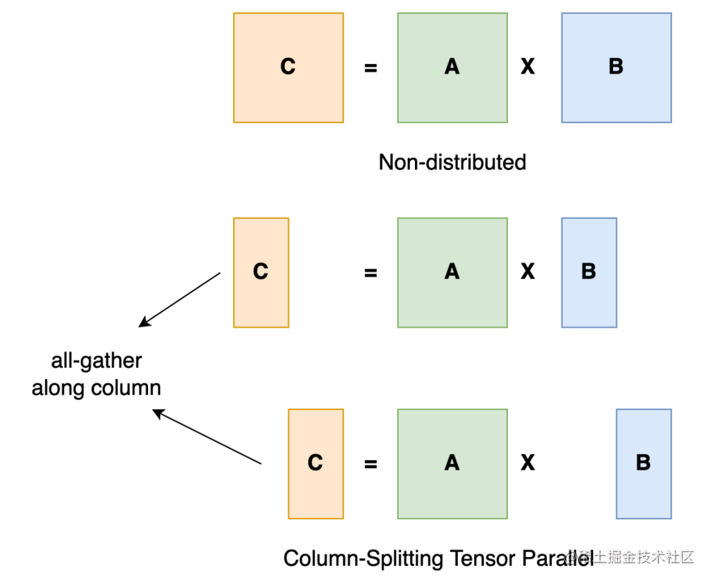

image.png

典型的张量并行实现：Megatron-LM（1D）、Colossal-AI（2D、2.5D、3D）。

### **流水线并行**

流水线并行的核心思想是，模型按层分割成若干块，每块都交给一个设备。

- 在前向传播过程中，每个设备将中间的激活传递给下一个阶段。
- 在后向传播过程中，每个设备将输入张量的梯度传回给前一个流水线阶段。

这允许设备同时进行计算，从而增加训练的吞吐量。

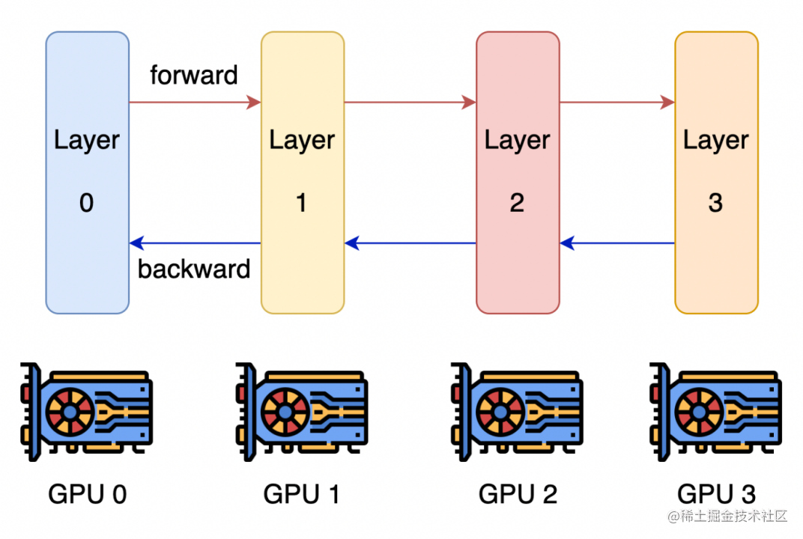

image.png

流水线并行训练的一个明显缺点是训练设备容易出现空闲状态（因为后一个阶段需要等待前一个阶段执行完毕），导致计算资源的浪费，加速效率没有数据并行高。

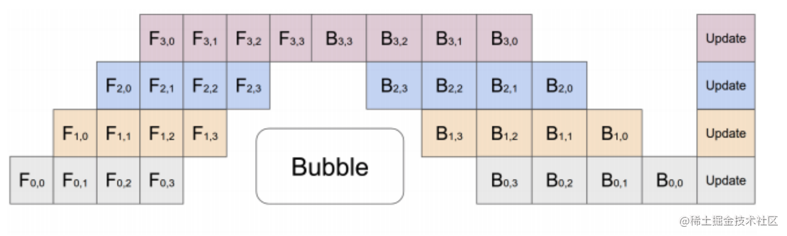

image.png

典型的流水线并行实现：GPipe、PipeDream、PipeDream-2BW、PipeDream Flush（1F1B）。

## **优化器相关的并行**

目前随着模型越来越大，单个GPU的显存目前通常无法装下那么大的模型了。那么就要想办法对占显存的地方进行优化。

通常来说，模型训练的过程中，GPU上需要进行存储的参数包括了模型本身的参数、优化器状态、激活函数的输出值、梯度以及一些零时的Buffer。各种数据的占比如下图所示：

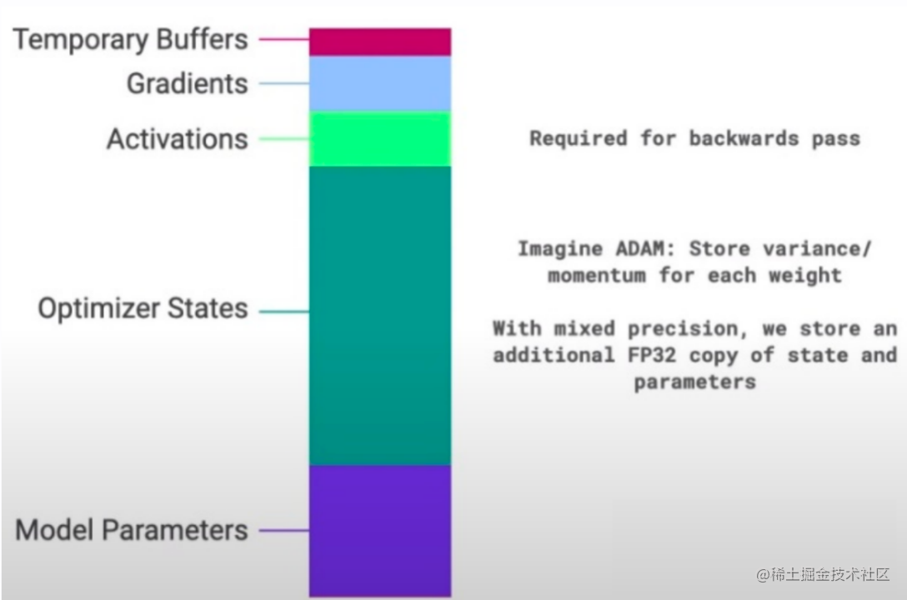

image.png

可以看到模型参数仅占模型训练过程中所有数据的一部分，当进行混合精度运算时，其中模型状态参数(优化器状态 + 梯度+ 模型参数）占到了一大半以上。因此，我们需要想办法去除模型训练过程中的冗余数据。

而优化器相关的并行就是一种去除冗余数据的并行方案，目前这种并行最流行的方法是 [ZeRO](https://zhida.zhihu.com/search?content_id=221180389&content_type=Article&match_order=1&q=ZeRO&zhida_source=entity)（即零冗余优化器）。针对模型状态的存储优化（去除冗余），ZeRO使用的方法是分片，即每张卡只存 1/N 的模型状态量，这样系统内只维护一份模型状态。ZeRO有三个不同级别，对模型状态进行不同程度的分片：

- ZeRO-1 : 对优化器状态分片（Optimizer States Sharding）
- ZeRO-2 : 对优化器状态和梯度分片（Optimizer States & Gradients Sharding）
- ZeRO-3 : 对优化器状态、梯度分片以及模型权重参数分片（Optimizer States & Gradients & Parameters Sharding）

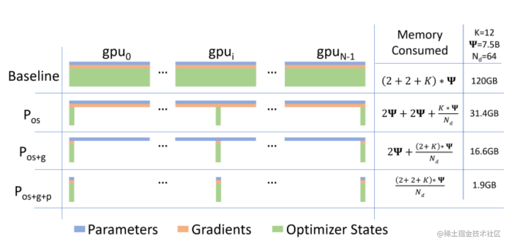

image.png

## **[异构系统并行](https://zhida.zhihu.com/search?content_id=221180389&content_type=Article&match_order=1&q=异构系统并行&zhida_source=entity)**

上述的方法中，通常需要大量的 GPU 来训练一个大型模型。然而，人们常常忽略一点，与 GPU 相比，CPU 的内存要大得多。在一个典型的服务器上，CPU 可以轻松拥有几百GB甚至上TB的内存，而每张 GPU 卡通常只有 48 或 80 GB的内存。这促使人们思考为什么 CPU 内存没有被用于分布式训练。

而最近的进展是依靠 CPU 甚至是 NVMe 磁盘来训练大型模型。主要的想法是，在不使用张量时，将其卸载回 CPU 内存或 NVMe 磁盘。

通过使用异构系统架构，有可能在一台机器上容纳一个巨大的模型。

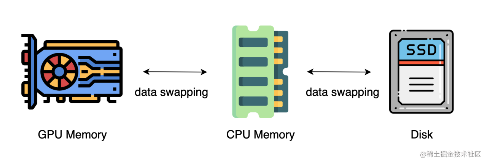

image.png

## **多维混合并行**

多维混合并行指将数据并行、模型并行和流水线并行等多种并行技术结合起来进行分布式训练。

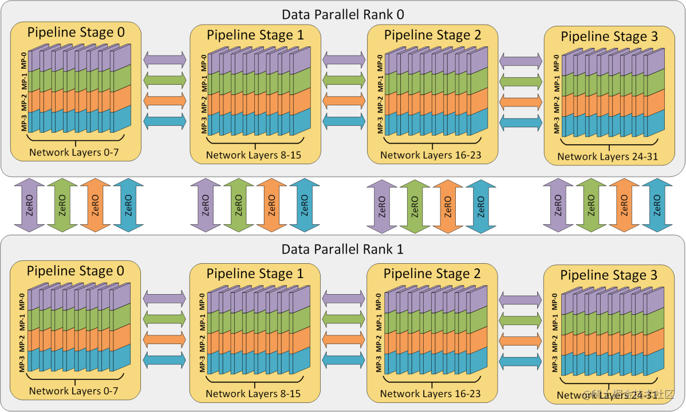

image.png

通常，在进行超大规模模型的预训练和全参数微调时，都需要用到多维混合并行。

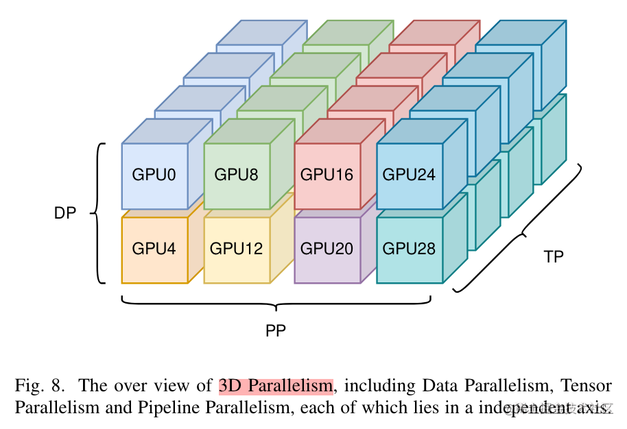

image.png

为了充分利用带宽，通常情况下，张量并行所需的通信量最大，而数据并行与流水线并行所需的通信量相对来说较小。因此，同一个服务器内使用张量并行，而服务器之间使用数据并行与流水线并行。

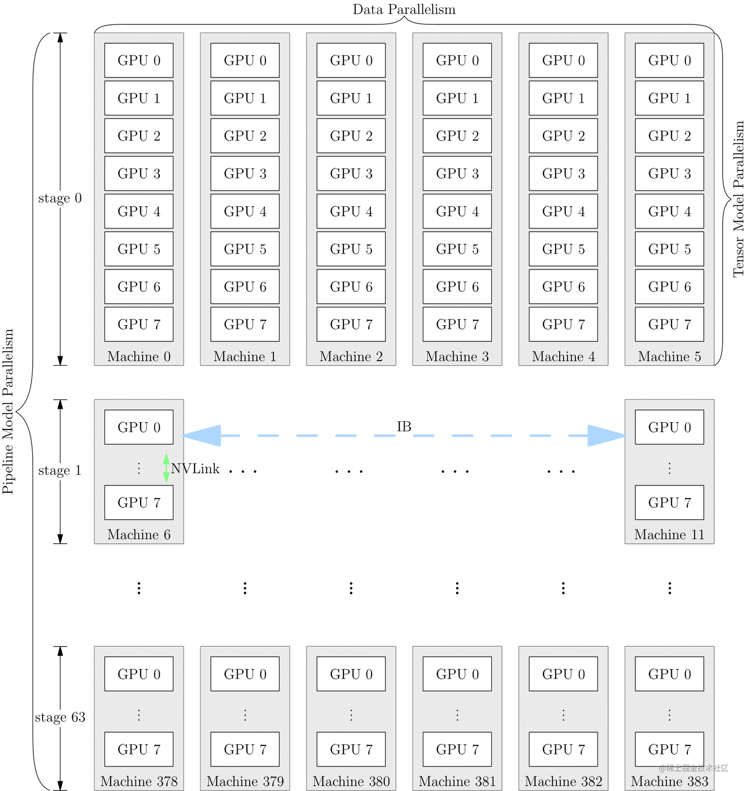

image.png

## **自动并行**

上面提到的数据并行、张量并行、流水线并行等多维混合并行需要把模型切分到多张AI加速卡上面，如果让用户手动实现，对开发者来说难度非常大，需要考虑性能、内存、通信、训练效果等问题，要是能够将模型按算子或者按层自动切分到不同的加速卡上，可以大大的降低开发者的使用难度。因此，自动并行应运而生。

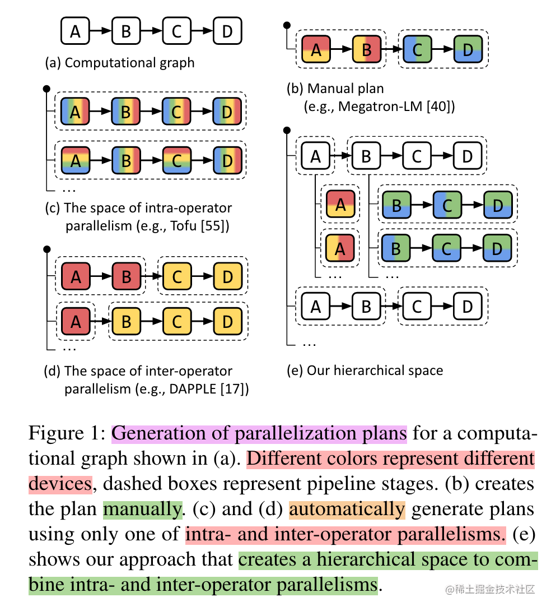

image.png

## **MOE并行 / 专家并行**

通常来讲，模型规模的扩展会导致训练成本显著增加，计算资源的限制成为了大规模密集模型训练的瓶颈。为了解决这个问题，一种基于稀疏 MoE 层的深度学习模型架构被提出，即将大模型拆分成多个小模型(专家，`expert`)， 每轮迭代根据样本决定激活一部分专家用于计算，达到了节省计算资源的效果； 并引入可训练并确保稀疏性的门( `gate` )机制，以保证计算能力的优化。

使用 MoE 结构，可以在计算成本次线性增加的同时实现超大规模模型训练，为恒定的计算资源预算带来巨大增益。而 MOE 并行，本质上也是一种模型并行方法。下图展示了一个有六个专家网络的模型被两路专家并行地训练。其中，专家1-3被放置在第一个计算单元上，而专家4-6被放置在第二个计算单元上。

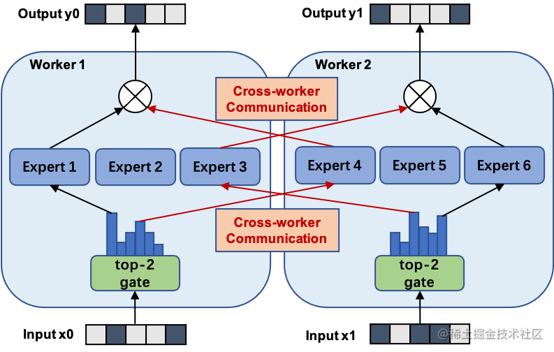

image.png

## **结语**

本文针对大模型进行分布式训练常见的并行技术进行了简要的介绍。后续章节将针对常见并行技术的不同方案进行详细的讲解。