# 大模型参数高效微调技术原理综述（二）-BitFit、Prefix Tuning、Prompt Tuning

## **BitFit**

### **背景**

虽然对每个任务进行全量微调非常有效，但它也会为每个预训练任务生成一个独特的大型模型，这使得很难推断微调过程中发生了什么变化，也很难部署， 特别是随着任务数量的增加，很难维护。

理想状况下，我们希望有一种满足以下条件的高效微调方法：

- 到达能够匹配全量微调的效果。
- 仅更改一小部分模型参数。
- 使数据可以通过流的方式到达，而不是同时到达，便于高效的硬件部署。
- 改变的参数在不同下游任务中是一致的。

上述的问题取决于微调过程能多大程度引导新能力的学习以及暴露在预训练LM中学到的能力。

虽然，之前的高效微调方法Adapter-Tuning、Diff-Pruning也能够部分满足上述的需求。但是，作者提出了一种参数量更小的稀疏的微调方法BitFit，来满足上述的需求。

### **技术原理**

BitFit（论文：**BitFit: Simple Parameter-efficient Fine-tuning or Transformer-based Masked Language-models**）是一种稀疏的微调方法，它训练时只更新bias的参数或者部分bias参数。

对于[Transformer模型](https://zhida.zhihu.com/search?content_id=229395200&content_type=Article&match_order=1&q=Transformer模型&zhida_source=entity)而言，冻结大部分 transformer-encoder 参数，只更新bias参数跟特定任务的分类层参数。涉及到的bias参数有attention模块中计算query,key,value跟合并多个attention结果时涉及到的bias，MLP层中的bias，Layernormalization层的bias参数。

在Bert-Base/[Bert-Large](https://zhida.zhihu.com/search?content_id=229395200&content_type=Article&match_order=1&q=Bert-Large&zhida_source=entity)这种模型里，bias参数仅占模型全部参数量的0.08%～0.09%。但是通过在Bert-Large模型上基于GLUE数据集进行了 BitFit、Adapter和Diff-Pruning的效果对比发现，BitFit在参数量远小于Adapter、Diff-Pruning的情况下，效果与Adapter、Diff-Pruning想当，甚至在某些任务上略优于Adapter、Diff-Pruning。

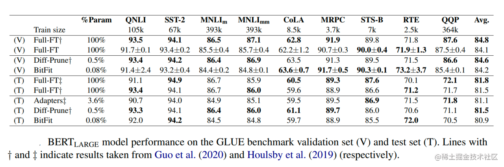

image.png

同时，通过实验结果还可以看出，BitFit微调结果相对全量参数微调而言, 只更新极少量参数的情况下，在多个数据集上都达到了不错的效果，虽不及全量参数微调，但是远超固定全部模型参数的Frozen方式。

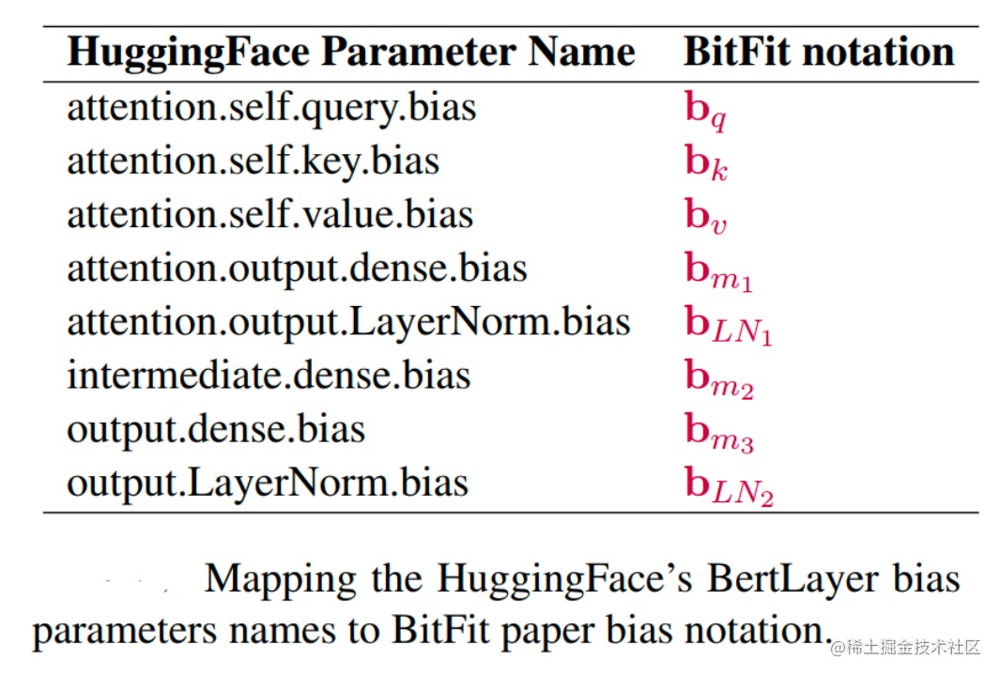

image.png

同时，通过对比BitFit训练前后的参数，发现很多bias参数并没有太多变化（例如：跟计算key所涉及到的bias参数）。发现计算query和将特征维度从N放大到4N的FFN层（intermediate）的bias参数变化最为明显，只更新这两类bias参数也能达到不错的效果，反之，固定其中任何一者，模型的效果都有较大损失。

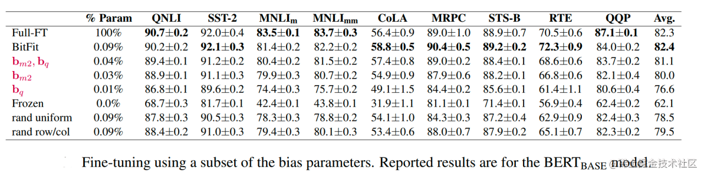

image.png

## **Prefix Tuning**

### **背景**

在Prefix Tuning之前的工作主要是人工设计离散的模版或者自动化搜索离散的模版。对于人工设计的模版，模版的变化对模型最终的性能特别敏感，加一个词、少一个词或者变动位置都会造成比较大的变化。而对于自动化搜索模版，成本也比较高；同时，以前这种离散化的token搜索出来的结果可能并不是最优的。

除此之外，传统的微调范式利用预训练模型去对不同的下游任务进行微调，对每个任务都要保存一份微调后的模型权重，一方面微调整个模型耗时长；另一方面也会占很多存储空间。

基于上述两点，Prefix Tuning提出固定预训练LM，为LM添加可训练，任务特定的前缀，这样就可以为不同任务保存不同的前缀，微调成本也小；同时，这种Prefix实际就是连续可微的Virtual Token（Soft Prompt/Continuous Prompt），相比离散的Token，更好优化，效果更好。

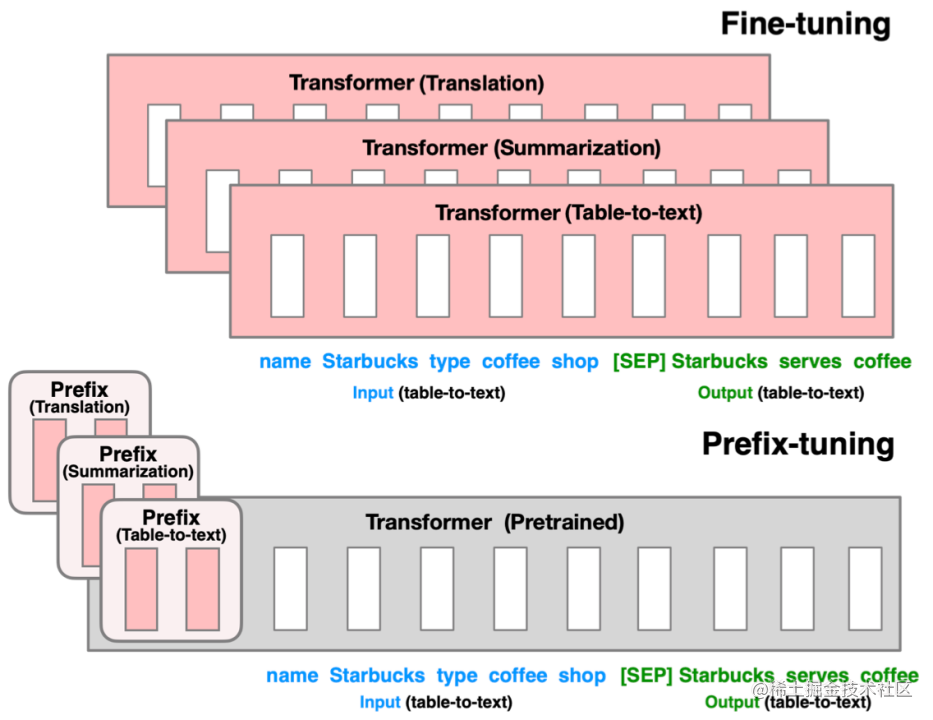

image.png

### **技术原理**

Prefix Tuning（论文：**Prefix-Tuning: Optimizing Continuous Prompts for Generation**），在输入token之前构造一段任务相关的virtual tokens作为Prefix，然后训练的时候只更新Prefix部分的参数，而PLM中的其他部分参数固定。

针对不同的模型结构，需要构造不同的Prefix。

- 针对自回归架构模型：在句子前面添加前缀，得到 `z = [PREFIX; x; y]`，合适的上文能够在固定 LM 的情况下去引导生成下文（比如：[GPT3](https://zhida.zhihu.com/search?content_id=229395200&content_type=Article&match_order=1&q=GPT3&zhida_source=entity)的上下文学习）。
- 针对编码器-解码器架构模型：Encoder和Decoder都增加了前缀，得到 `z = [PREFIX; x; PREFIX0; y]`。Encoder端增加前缀是为了引导输入部分的编码，Decoder 端增加前缀是为了引导后续token的生成。

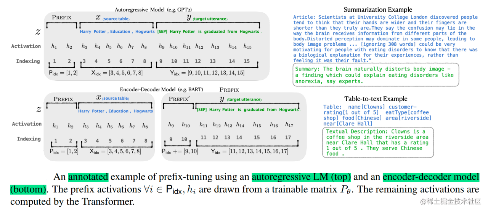

image.png

该方法其实和构造Prompt类似，只是Prompt是人为构造的“显式”的提示，并且无法更新参数，而Prefix则是可以学习的“隐式”的提示。

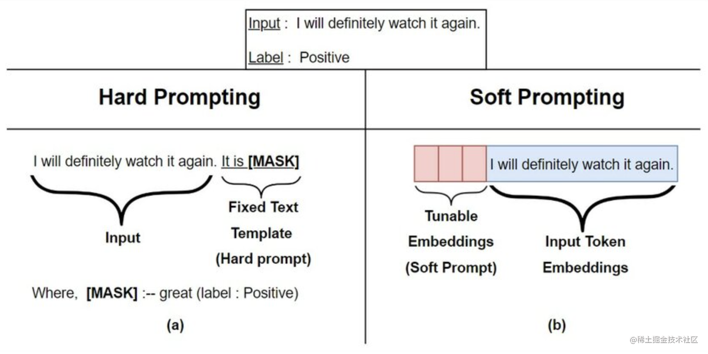

同时，为了防止直接更新Prefix的参数导致训练不稳定和性能下降的情况，在Prefix层前面加了MLP结构，训练完成后，只保留Prefix的参数。

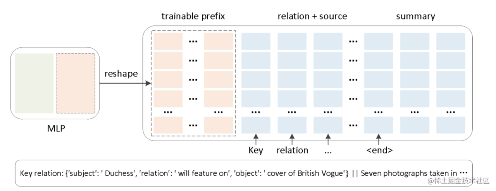

image.png

除此之外，通过消融实验证实，只调整embedding层的表现力不够，将导致性能显著下降，因此，在每层都加了prompt的参数，改动较大。

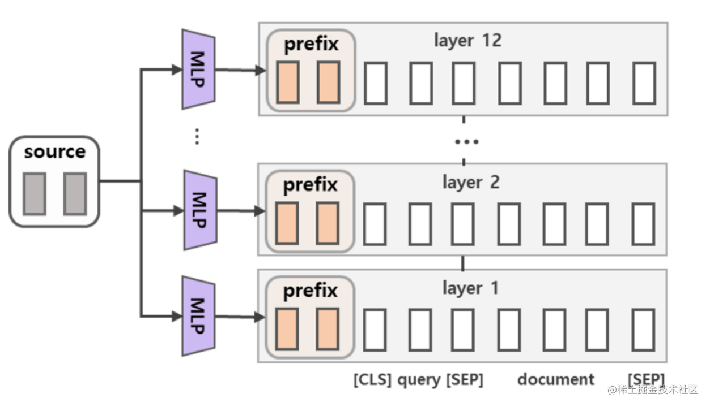

image.png

另外，实验还对比了位置对于生成效果的影响，Prefix-tuning也是要略优于Infix-tuning的。其中，Prefix-tuning形式为 `[PREFIX; x; y]`，Infix-tuning形式为 `[x; INFIX; y]`。

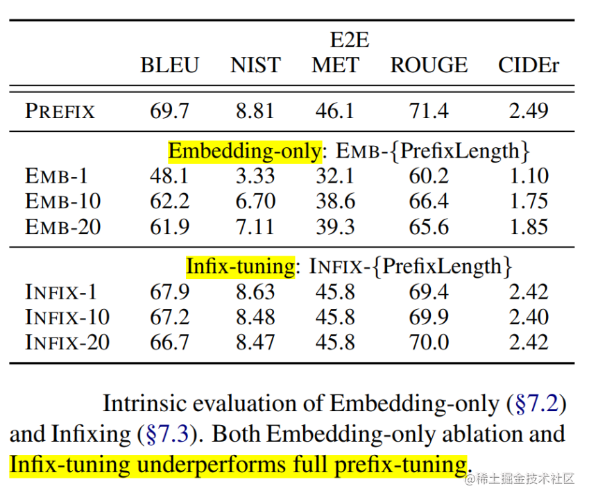

image.png

## **Prompt Tuning**

### **背景**

大模型全量微调对每个任务训练一个模型，开销和部署成本都比较高。同时，离散的prompts（指人工设计prompts提示语加入到模型）方法，成本比较高，并且效果不太好。

基于此，作者提出了Prompt Tuning，通过反向传播更新参数来学习prompts，而不是人工设计prompts；同时冻结模型原始权重，只训练prompts参数，训练完以后，用同一个模型可以做多任务推理。

### **技术原理**

Prompt Tuning（论文：**The Power of Scale for Parameter-Efficient Prompt Tuning**），该方法可以看作是Prefix Tuning的简化版本，它给每个任务定义了自己的Prompt，然后拼接到数据上作为输入，但**只在输入层加入prompt tokens**，并且不需要加入 MLP 进行调整来解决难训练的问题。

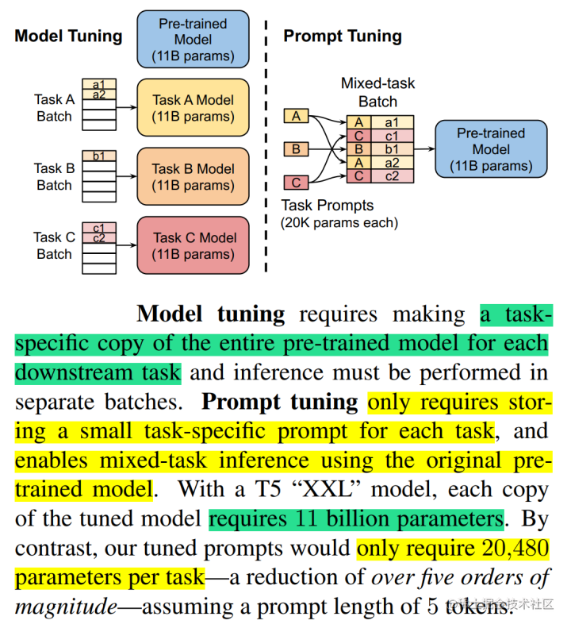

image.png

通过实验发现，随着预训练模型参数量的增加，Prompt Tuning的方法会逼近全参数微调的结果。

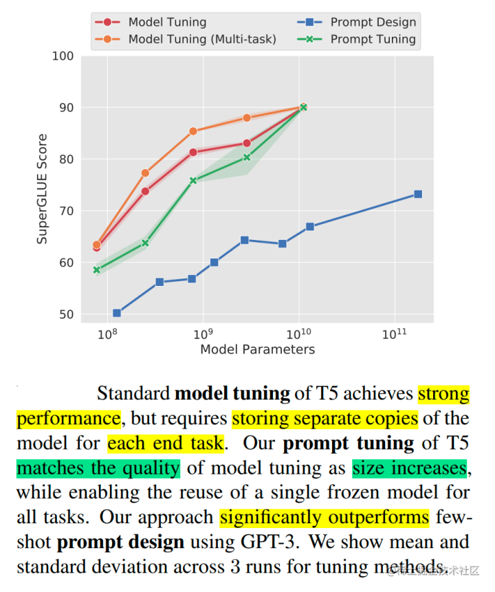

image.png

同时，Prompt Tuning 还提出了 Prompt Ensembling，也就是在一个批次（Batch）里同时训练同一个任务的不同 prompt（即采用多种不同方式询问同一个问题），这样相当于训练了不同模型，比模型集成的成本小多了。

image.png

除此之外，Prompt Tuning 论文中还探讨了 Prompt token 的初始化方法和长度对于模型性能的影响。通过消融实验结果发现，与随机初始化和使用样本词汇表初始化相比，Prompt Tuning采用类标签初始化模型的效果更好。不过随着模型参数规模的提升，这种gap最终会消失。

Prompt token 的长度在20左右时的表现已经不错（超过20之后，提升Prompt token长度，对模型的性能提升不明显了），同样的，这个gap也会随着模型参数规模的提升而减小（即对于超大规模模型而言，即使 Prompt token 长度很短，对性能也不会有太大的影响）。

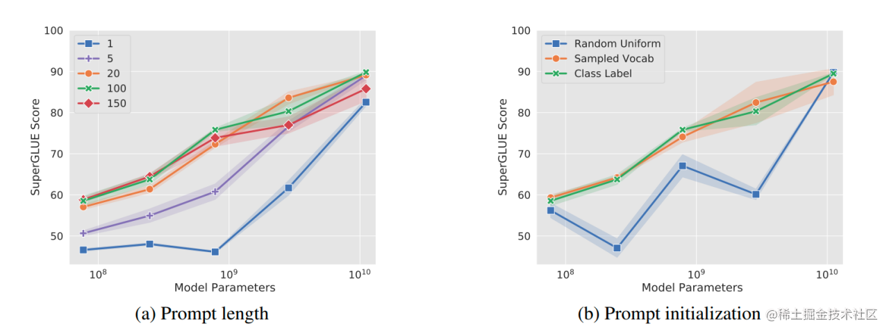

image.png

## **结语**

本文针对讲述了仅更新一部分参数高效微调方法BitFit以及通过增加额外参数的软提示高效微调方法Prefix Tuning、Prompt Tuning，下文将对高效微调方法P-Tuning、P-Tuning v2进行讲解。