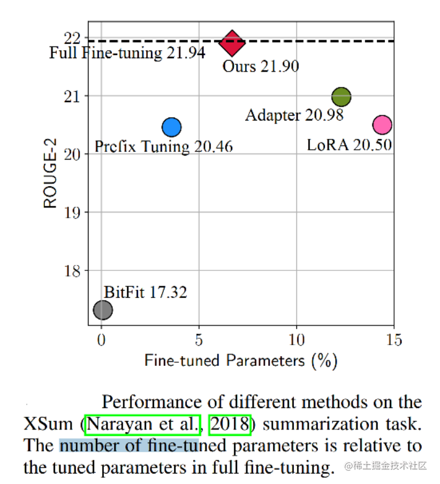
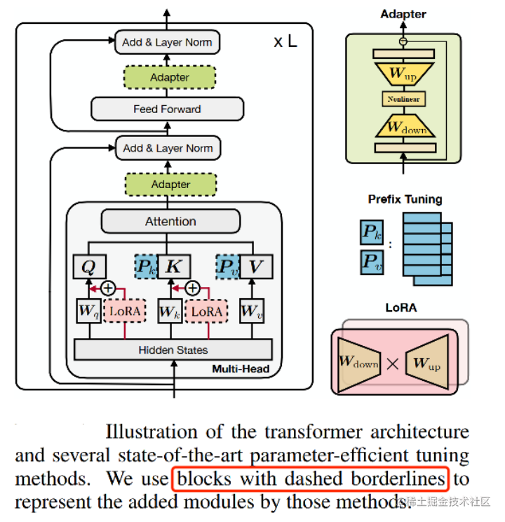
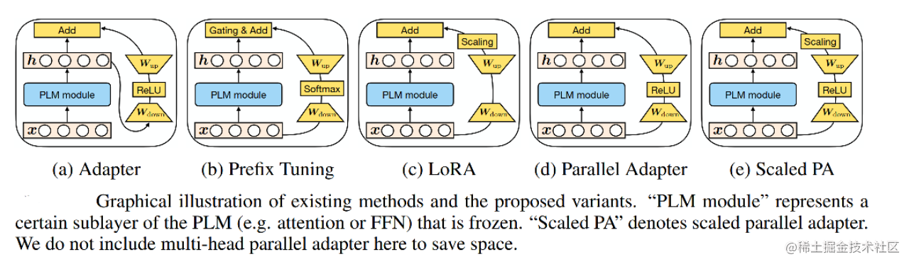
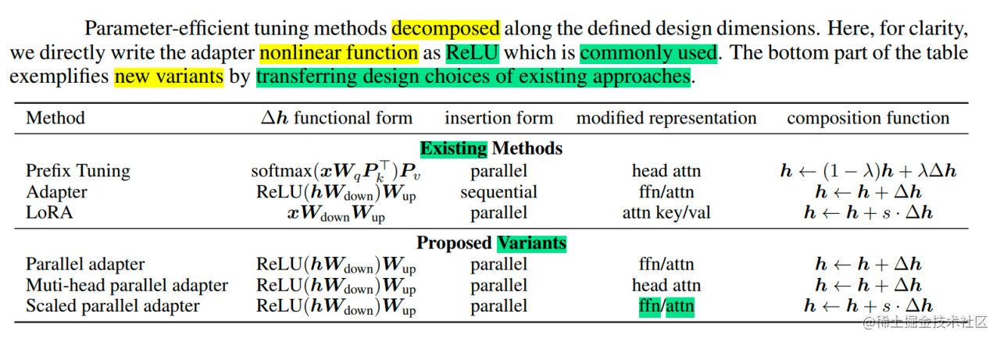
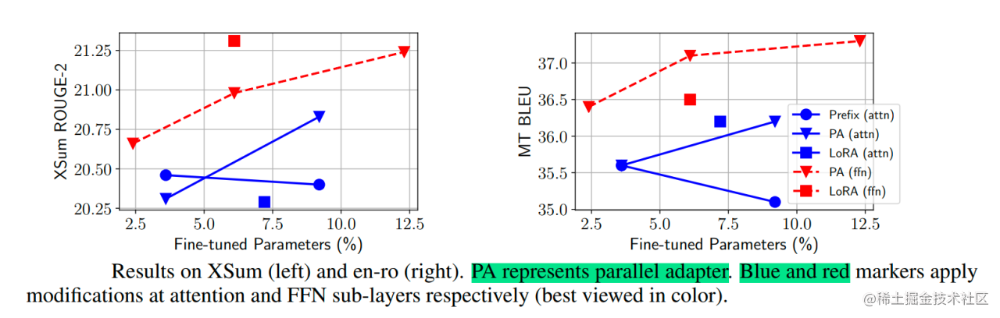
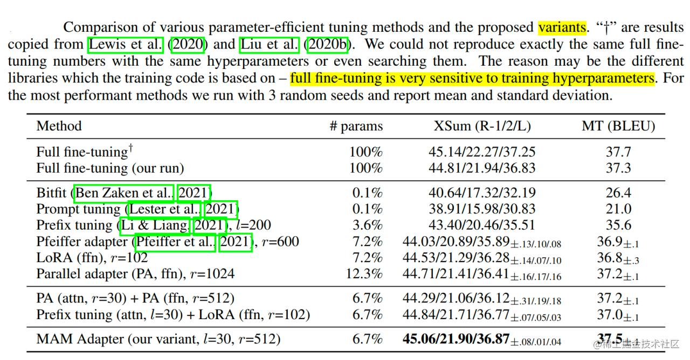
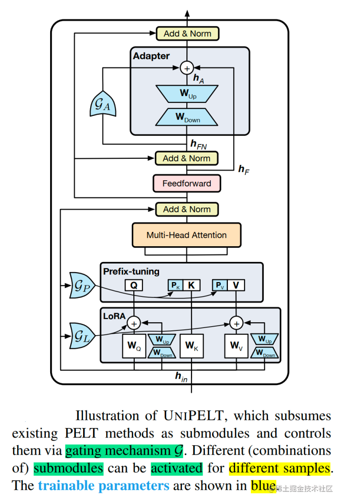
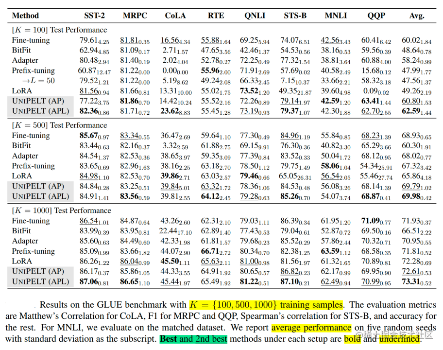
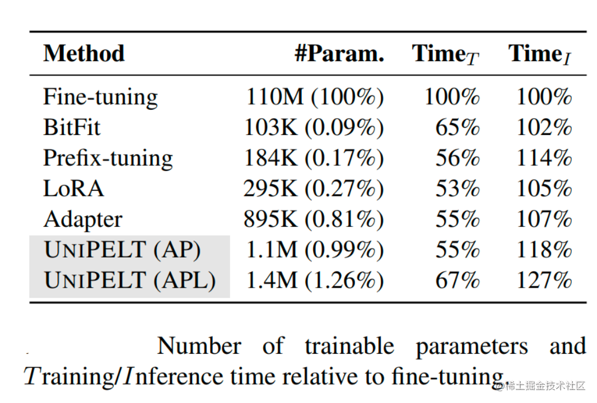

# 大模型参数高效微调技术原理综述（六）-MAM Adapter、UniPELT

## **MAM Adapter**

### **背景**

近年来提出了多种参数高效的迁移学习方法，这些方法仅微调少量（额外）参数即可获得强大的性能。虽然有效，但人们对为什么有效的关键要素以及各种高效微调方法之间的联系知之甚少。

下图展示了不同的微调方法，在[Xsum数据集](https://zhida.zhihu.com/search?content_id=229545520&content_type=Article&match_order=1&q=Xsum数据集&zhida_source=entity)上做英文文本摘要任务的效果（[ROUGE-2](https://zhida.zhihu.com/search?content_id=229545520&content_type=Article&match_order=1&q=ROUGE-2&zhida_source=entity)是该任务的评价指标（越大越好））以及其他高效微调方法参数量相对于全参数微调参数量的百分比。图中的左上角的位置是理想化的方法。从图中发现，Adapter，Prefix Tuning和LoRA都是性能比较好的方法。

image.png

为什么看起来Adapter、Prefix Tuning、LoRA（在结构上和公式上）都不太一样，尤其是Prefix Tuning，但是这三种方法有近似的效果？

基于此，作者分解了当下最先进的参数高效迁移学习方法（Adapter、Prefix Tuning和LoRA）的设计，并提出了一种新方法MAM Adapter，一个在它们之间建立联系的统一框架。具体来说，将它们重新构建为对预训练模型中特定隐藏状态的修改，并定义一组设计维度，不同的方法沿着这些维度变化。

image.png

首先，作者通过对Prefix Tuning变换，发现Prefix Tuning和Adapters的公式高度相似。

然后，分析不同微调方法的内部结构和结构插入形式的相似之处。下图展示了高效微调方法Adapter、Prefix Tuning、LoRA以及新变体（通过更换一些元素，设计了前人的工作里没有的变体） Parallel Adapter、 Scaled PA的结构。 

下表展示了高效微调方法Adapter、Prefix Tuning、LoRA以及新变体在新增可训练参数结构形式（functional form）、结构插入形式（Insertion form）、新增结构在PLM修改的具体位置（modified representation）、新增结构与PLM的组合函数（composition function）。其中，新增可训练参数结构形式为需要学习的部分（注：Prefix Tuning为经过转换后的格式）；插入形式有串联或并联；模型修改的具体位置有Attention、FFN层。

image.png

### **技术原理**

MAM Adapter（论文：TOWARDS A UNIFIED VIEW OF PARAMETER-EFFICIENT TRANSFER LEARNING），一个在Adapter、Prefix Tuning和LoRA之间建立联系的统一方法。

**具体实现**：

作者对Adapter的放置和软提示（soft prompt）进行了详细的调查。得出如下结论：

- 并行放置的Adapter优于顺序放置的Adapter，并且与 FFN 并行放置的Adapter优于多头注意力（MHA）并行放置的Adapter（模型修改的位置如下图中所示，蓝色表示修改Attention、红色表示修改FFN）。
- 软提示可以通过仅更改 0.1% 的参数来有效地修改注意力。

image.png

然后，提出了“mix-and-match”（MAM）。 因此，最终模型 MAM Adapter 是用 FFN 层的并行Adapter和软提示的组合。

通过最终的实验结果，可以看到 MAM Adapter 在仅用了6.7%参数量（相比全量微调）的情况下，在Xsum和MT这两个任务上达到了和全量微调相近的效果，并且该方法大大优于 BitFit 和 Prompt Tuning，并始终优于 LoRA、Adapter 和 Prefix Tuning。 

## **UniPELT**

### **背景**

近年来，涌现出了许多针对语言模型的参数高效微调（PELT）方法，在模型训练参数极大的减少的情况下，模型效果与全量微调相当。但是不同的PELT方法在同一个任务上表现差异可能都非常大，这让针对特定任务选择合适的方法非常繁琐。

基于此，作者提出了UniPELT方法，将不同的PELT方法作为子模块，并通过门控机制学习激活最适合当前数据或任务的方法。

### **技术原理**

UniPELT（论文： UNIPELT: A Unified Framework for Parameter-Efficient Language Model Tuning）是 LoRA、Prefix Tuning和Adapter的门控组合。

更具体地说，LoRA 重新参数化用于 WQ 和 WV 注意力矩阵，Prefix Tuning应用于每一Transformer层的key和value，并在Transformer块的feed-forward子层之后添加Adapter。 对于每个模块，门控被实现为线性层，通过GP参数控制Prefix-tuning方法的开关，GL控制LoRA方法的开关，GA控制Adapter方法的开关。可训练参数包括 LoRA 矩阵 WA（Down）和WB（Up），提示调优参数Pk和Pv、Adapter参数和门函数权重。即图中蓝颜色的参数为可学习的参数。

image.png

UniPELT 仅用 100 个示例就在低数据场景中展示了相对于单个 LoRA、Adapter 和 Prefix Tuning 方法的显著改进。在更高数据的场景中，UniPELT 的性能与这些方法相当或更好。

image.png

实验还对不同 PELT 方法训练时间和推理时间进行了分析。

- 从训练速度来看，UniPELT比之前微调的方法多一些，但是还在能接受的范围，
- 从推理时间来看，BitFit方法增加的最少，UniPELT方法时间增加了27%。
- 从训练参数量来看，LoRA，BitFit，Prefix-tuning都比较小，UniPELT参数量相对会多一些。

image.png

总之，本方法始终优于常规的全量微调以及它在不同设置下包含的子模块，通常超过在每个任务中单独使用每个子模块的最佳性能的上限；并且，通过研究结果表明，多种 PELT 方法的混合涉及到PLM 的不同部分可能对模型有效性和鲁棒性都有好处。