# 大模型推理服务调度优化技术-Continuous batching

https://zhuanlan.zhihu.com/p/719610083

由于类 GPT 的仅编码器模型推理分为预填充和解码两个阶段。在解码阶段一次推理只输出一个token，输出的 token 会与输入 tokens 拼接在一起，然后作为下一次推理的输入，这样不断反复直到遇到终止符。这样会造成大量的冗余计算。同时用由于仅编码器模型的 Self Attention 中带 Masked ，因此，在推理的时候，前面已经生成的 Token 不需要与后面的 Token 产生 Attention ，从而使得前面已经计算的 K 和 V 可以缓存起来。因此，KV Cache 应运而生。之前针对 KV Cache 技术进行了讲述，KV Cache 是一种典型的以空间换时间（或者叫以内存换计算）的优化技术提升推理速度从而降低延迟。除了从模型视角优化推理的性能，对于一个系统而言，还可以以更高的视角从系统层面来考虑优化整体的模型服务性能。

而本文将介绍大模型服务请求调度优化技术 Continuous batching 通过提高硬件利用率从而提升系统的系统的性能（吞吐量）。

## 批处理基本概念

### 单处理

单处理也就是不组成Batch或者说一个Batch中数据始终为1，也就是单个提示（Prompt）传过来直接送入到LLM进行推理。

单条数据虽然简单而且灵活，不过因为每次只能处理一条数据，对GPU资源的利用率较低。因此，我们通常会将多条数据放入一个批次进行处理，从而提升GPU的利用率。

### 静态批处理（static batching）

静态批处理指将多个Prompt打包进行一个批处理请求，并在批处理请求中所有Prompt完成后返回响应，批处理的大小在推理完成之前保持不变。

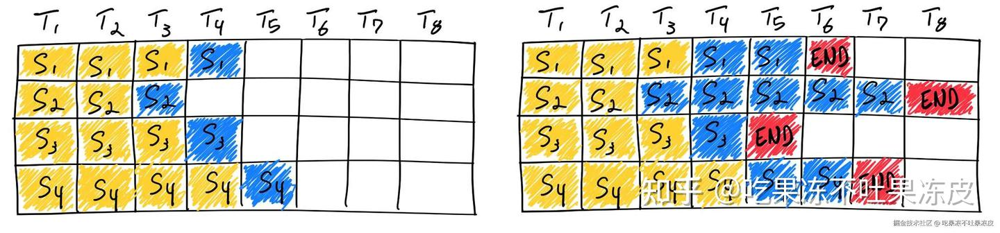

与传统的深度学习模型不同，由于LLM推理具有迭代性质，一个批次中不同序列的生成长度不同。有的Prompt在批处理中较早“完成”，但需等待这一批次中Prompt最长的生成结束，因此，GPU 未得到充分利用。

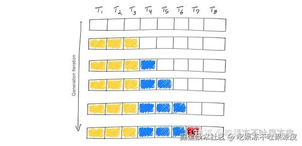

### 动态批处理（Dynamic batching）

动态批处理是指允许将一个或多个推理请求组合成单个批次（必须动态创建）以最大化吞吐量的功能。就 [Triton 推理服务框架](https://zhida.zhihu.com/search?content_id=248043626&content_type=Article&match_order=1&q=Triton+推理服务框架&zhida_source=entity)而言，Triton 会对这些输入请求进行批处理，没有任何延迟，但用户可以选择为调度程序分配有限的延迟，以收集更多推理请求供动态批处理程序使用。

如下图所示，在不使用动态批处理的情况下，所有请求都会按顺序处理，这意味着需要 `5X ms` 处理所有请求。这个过程非常浪费，因为每个批处理可以比顺序处理执行更多的数据。

使用动态批处理可以更有效地将请求打包到 GPU 内存中，从而显著加快的速度。它还减少了整体响应的延迟（需要 `3X ms` 处理所有请求），因为可以在更短的周期内处理更多的查询。

如果考虑使用延迟，以在一个批处理中收集更多推理请求，则需要 `2.5X ms` 处理所有请求。

当然以上都是理想状态，实际情况并非所有执行元素都可以完美并行，从而导致较大批次的执行时间更长。但可以看到，使用动态批处理可以改善模型服务时的延迟和吞吐量。

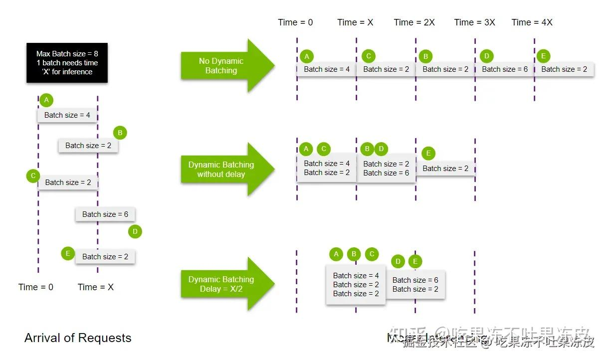

### 变长输入批处理（Ragged Batching）

Triton 中提供动态批处理功能，它结合同一模型执行的多个请求，以提供更大的吞吐量。默认情况下，仅当请求中的每个输入具有相同的形状时，才能对请求进行动态批处理。为了在输入形状经常变化的情况下利用动态批处理，**客户端需要将请求中的输入张量填充为相同的形状**。

而 Ragged batching 是一种通过允许用户指定哪些输入**不需要形状检查来避免显式填充**的功能。

比如，Triton 中用户可以通过在模型配置中设置 `allow_ragged_batch` 字段来指定此类输入(ragged input)。

```text
...
input [
  {
    name: "input0"
    data_type: TYPE_FP32
    dims: [ 16 ]
    allow_ragged_batch: true
  }
]
...
```

如何在一个批次请求中处理不规则的输入取决于后端实现。 ONNX Runtime 后端、TensorFlow 后端、PyTorch 后端和 TensorRT 后端等后端要求模型接受不规则的输入作为一维张量。这些后端将请求输入连接到一维张量中。

由于连接的输入不会跟踪每个请求的开始和结束索引，因此后端通常要求模型具有额外的输入（批量输入），以描述所形成的批次的各种信息。

下面是一个变长输入批处理的示例：

如果您的模型接受 1 个可变长度输入张量 INPUT，其形状为 [ -1, -1 ]。第一个维度是批量维度，第二个维度是变长内容。当客户端发送 3 个形状为 [ 1, 3 ]、[ 1, 4 ]、[ 1, 5 ] 的请求时。为了利用动态批处理，实现该模型的直接方法将期望 INPUT 形状设置为 [ -1, -1 ] 并假设所有输入都填充到相同的长度，以便所有请求都变为形状 [ 1, 5 ]，因此， Triton 可以批处理并将它们作为单个 [ 3, 5 ] 张量发送到模型。在这种情况下，填充张量以及对填充内容进行额外的模型计算都会产生开销。下面是输入配置：

```text
max_batch_size: 16
input [
  {
    name: "INPUT"
    data_type: TYPE_FP32
    dims: [ -1 ]
  }
]
```

使用 Triton Ragged batching ，模型将被实现为期望 INPUT 形状 [ -1 ] 和额外的批处理输入 INDEX，形状 [ -1 ]，模型使用它来解释 INPUT 中的批处理元素。对于这种模型，客户端请求不需要填充，可以按原样发送（形状为 [ 1, 3 ]、[ 1, 4 ]、[ 1, 5 ]）。后端会将输入批处理为形状 [12] 的张量，其中包含3个请求的连接（ 3 + 4 + 5）。 Triton 还创建形状为 [ 3 ] 且值为 [ 3, 7, 12 ] 的批量输入张量，该张量给出了每个批量元素结束处的输入张量的偏移量。下面是输入配置：

```text
max_batch_size: 16
input [
  {
    name: "INPUT"
    data_type: TYPE_FP32
    dims: [ -1 ]
    allow_ragged_batch: true
  }
]
batch_input [
  {
    kind: BATCH_ACCUMULATED_ELEMENT_COUNT
    target_name: "INDEX"
    data_type: TYPE_FP32
    source_input: "INPUT"
  }
]
```

上面的示例使用 `BATCH_ACCUMULATED_ELEMENT_COUNT` 类型的不规则批处理。

使用ragged batching 需要实际的模型支持才行（如何处理ragged batch和index）。实际 LLM 推理中用到的比较多，比如：TensorRT-LLM 中 kernel 实现的时候已经考虑到了这种情况。在图像场景中，ragged batch一般用不上。

### 连续批处理（Continuous Batching）

无论是动态批处理还是静态批处理，通常在相同形状的输入和输出请求的场景，提高GPU的利用率。但对于自回归大模型推理场景而言，都不太适用（同一批次中的数据输入和输出长度都不一样）。为了提高生成式大模型推理场景GPU的利用率，Continuing Batching 应运而生。

Continuing Batching（有的地方也叫做 Inflight batching 或者 Iteration batching）指请求在到达时一起批量处理，但它不是等待批次中所有序列都完成，而是当一个输入提示生成结束之后，就会在其位置将新的输入Prompt插入进来，从而比静态批处理具备更高的 GPU 利用率。**由于每次迭代的批处理大小是动态的，因此，有些地方也叫动态Batching，本文为了避免概念混淆后续都叫Continuing Batching**。可以说，Continuous batching 几乎是所有优秀 LLM 推理框架的必备技术。

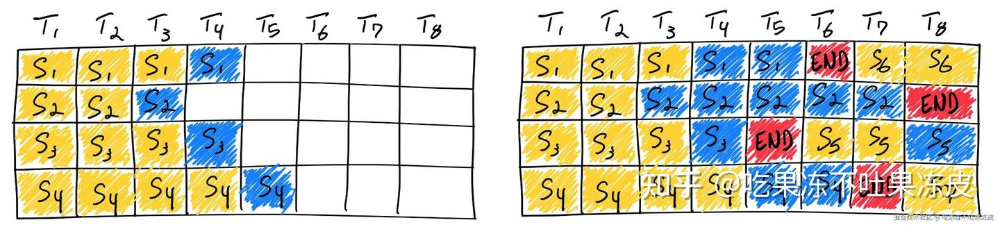

### 静态/动态/连续批处理对比

- **静态批处理**：客户端将多个Prompt打包进一个请求中，并在批次中所有序列完成后返回响应。通常，多数推理服务支持这种方法，但并不要求这样做。
- **动态批处理**：多个请求的Prompt在服务端内部动态打包进一个批次处理。通常，这种方法的表现不如静态批处理，但如果响应短或长度一致，可以接近最优。当请求具有不同参数时，这种方法效果不佳。
- **连续批处理**：将请求在到达时一起批量处理，它不是等待批次中所有序列完成，而是在迭代推理层级将序列组合在一起。它可以实现比静态批处理高10倍到20倍的吞吐量，目前是最先进的方法。

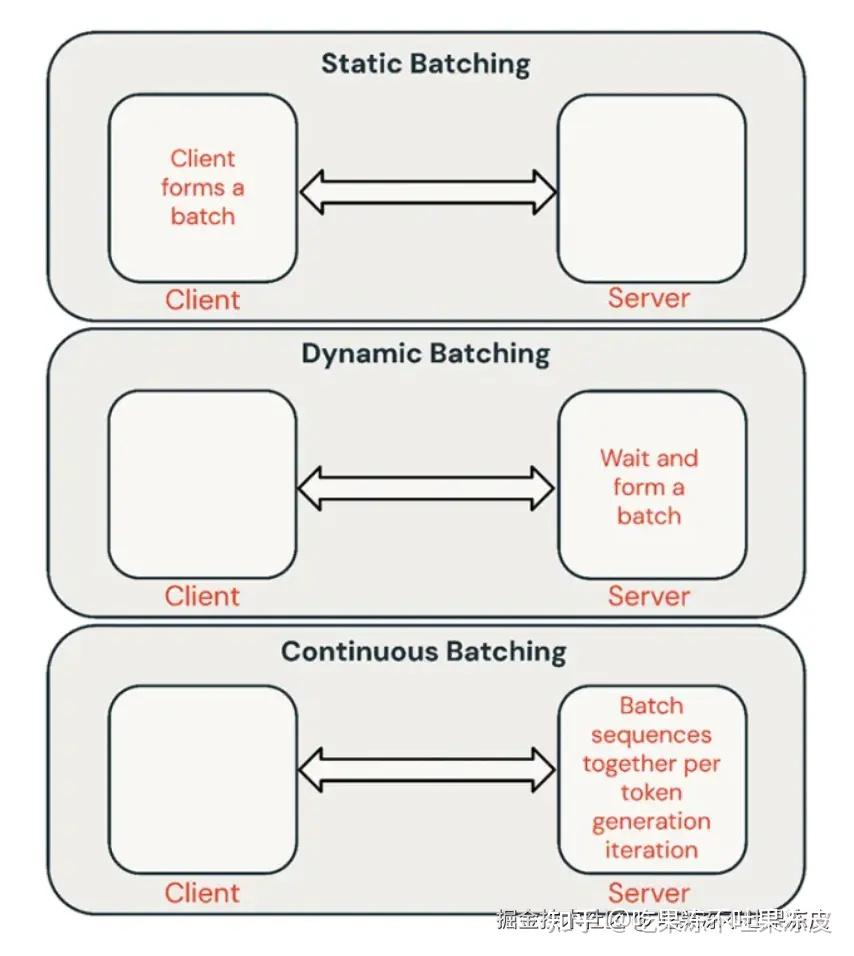

## ORCA 原理

目前，主流 LLM 推理框架 Continuous batching 的实现都是借鉴论文 Orca: A Distributed Serving System for Transformer-Based Generative Models 而来， Continuous batching 更是在 vLLM 的推动下已成为 LLM 推理框架标准功能。只是不同框架实现有差别，主要体现在对prefill处理的方式上。将prefill单独处理还是和decoding融合，以什么样的粒度融合，有一些讲究。 下面来看看 ORCA 的工作原理。

由于现有系统在处理请求时，通常是按批次处理，这导致一些请求在批次中提前完成但无法及时返回给客户端，增加了延迟。同时，新到达的请求需要等待当前批次完全处理完毕，增加了排队时间。因此，ORCA提出了以下解决方案：

- 迭代级调度（Iteration-level Scheduling）：提出一种新的调度机制，调度执行时以迭代为单位，而不是整个请求。这样，每次迭代后，检测到完成的请求，并立即将生成的Token返回给客户端。对于新到达的请求，有机会在当前的迭代执行后进行处理，从而减少等待时间。通过迭代级调度，调度器可以完全控制每次迭代处理的请求数量和哪些请求，具体如下图所示。

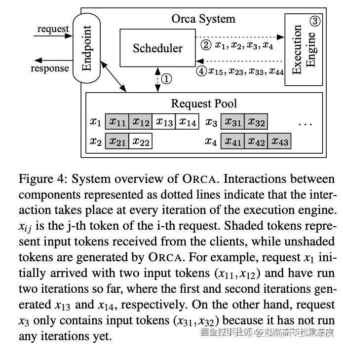

- 选择性批处理（Selective Batching）：在应用批处理和迭代级调度时，只对选定的少数操作(与形状不规则的输入张量兼容的操作)应用批处理。即所有非注意力操作，包括线性、层归一化、Add和GeLU操作，它们不需要区分不同请求的张量元素，而注意力操作需要请求的概念（即需要批量维度）来仅在相同请求的Token之间计算注意力。选择性批处理了解每个操作的不同特性；它将批次分割并对每个请求单独处理注意力操作，同时将其他操作应用到没有请求概念的Token级（而不是请求级）批处理。这样可以在不同的操作中灵活地处理请求，避免因不同请求处理不同数量的Token 而导致的批处理问题，具体如下图所示，可以看到Attn前后有Split和Merge操作。


此外，ORCA作为一个分布式服务系统，除了实现上述两种技术。它还采用了模型并行策略（如层内和层间模型并行化），以支持大规模模型。

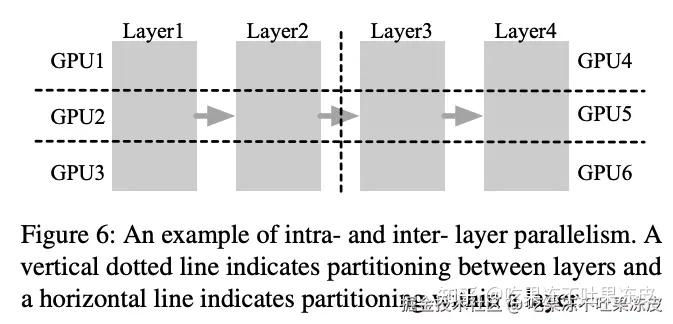

ORCA的系统架构包括请求池、调度器和执行引擎。调度器负责从请求池中选择请求，执行引擎则负责执行模型的迭代。

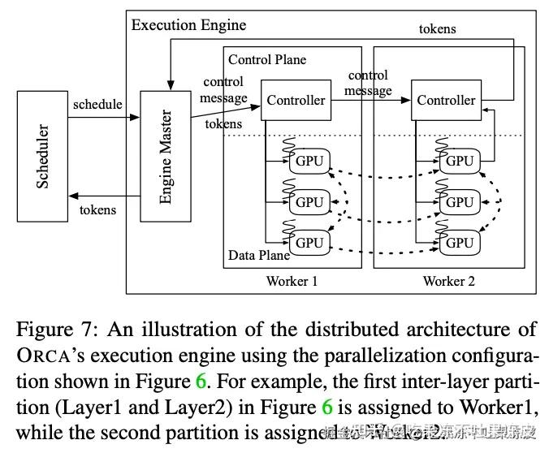

### ORCA 与现有系统（FasterTransformer）流水线并行对比

ORCA的调度器使得引擎中的Worker在多个批次之间进行流水线式执行（调度器不会等待一个调度批次返回），直到n_scheduled（当前调度批次的数量）达到n_workers（工作线程的数量）。通过这样做，调度器保持引擎中同时运行的批次数量为n_workers，这意味着引擎中的每个Worker线程都在处理一个批次，而没有空闲。图8a展示了3个ORCA工作线程的执行流水线，使用的最大批次大小为2。起初，调度器根据到达时间选择请求A和B，并调度引擎处理一个包含请求A和B的批次（这里称之为批次AB），其中工作线程Worker1、Worker2和Worker3依次处理该批次。调度器仅在调度器注入另外两个批次CD和EF之后，才等待批次AB的返回。一旦批次AB返回，请求A和B由于是请求池中最早到达的请求，将再次被选中和调度。

相比之下，现有服务系统和执行引擎之间的接口（例如：Triton和FasterTransformer的组合）由于请求级调度的限制不允许在当前运行批次完成之前注入另一个批次。也就是说，Triton不能在当前批次AB完成之前将下一个请求C注入到FasterTransformer。为了在这种限制下启用多个层间分区的流水线执行，FasterTransformer将一个请求批次分割成多个微批次，并在微批次之间流水线执行分区。在图8b中，FasterTransformer将批次AB分割成两个微批次。由于每个分区以批量方式处理一个微批次（它比原始批次小），批处理带来的性能提升可能会变小。此外，当微批次大小太大时，可能会造成比较大的流水线Bubble。

因此，FasterTransformer需要在批处理效率（较大的微批次大小）和流水线效率（较少的流水线Bubble）之间进行权衡，但ORCA由于迭代级调度而无需进行这种权衡，可以轻松地在不将批次分割成微批次的情况下流水线处理请求。


## Continuous batching 在 LLM 推理框架中的应用

前面谈到 Continuous batching 已经广泛应用于 LLM 推理框架，从下图也可以窥见一二，同时下图还展示了主流 LLM 推理的优化技术、具体实现和主要特性。

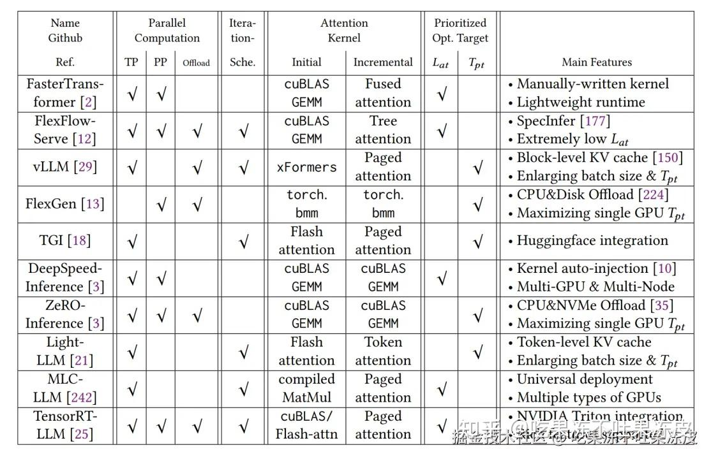

因此，下面介绍下 Continuous batching 在各大推理框架中的应用。

### vLLM 中的 Continuous Batching

在vLLM中，通过 LLM 引擎类 `LLMEngine` 接收请求并生成文本。它接收来自客户端的请求并从 LLM 生成文本。它包括一个分词器、一个语言模型（可能分布在多个 GPU 上）以及为中间状态分配的 GPU 内存空间（或称为 KV Cache）。该类利用迭代级调度和高效的内存管理来最大化服务的吞吐量。

而每一次迭代级调度都是在 `step()` 方法中完成，即完成一次推理过程（整个prefill阶段算1个次推理，decode阶段每迭代生成一个Token算1次推理）。

整个step()方法的执行流程如下所示：

- 步骤 1：安排下一次迭代中要执行的序列以及要换入（CPU->GPU）换出（GPU->CPU）复杂的Token块。 
  - 根据调度策略，序列可能被抢占/重新排序。
  - 序列组（SG）是指由同一提示生成的一组序列。
- 
- 步骤2：调用分布式执行器执行模型。
- 步骤3：处理模型输出。这主要包括： 
  - 解码相关输出。
  - 根据采样参数（是否使用beam_search）使用模型输出来更新已调度的序列组。
  - 释放已完成的序列组。

- 最后，它创建并返回新生成的结果。

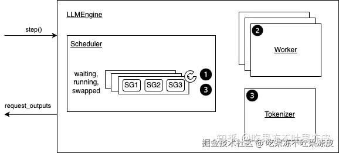

vLLM 中使用三个双端队列来维护所有用户的请求的调度：waiting，running，swapped。

- waiting：由所有等待 Prefill 的请求组成。
- running：由所有即将或者进行推理的请求组成。
- swapped：由所有暂时换出到 CPU 内存中的请求组成。

那么在 vLLM 中，三个队列如何协同工作来决定在当前step中应该运行哪些请求集呢？

当有空闲的 KV Block 内存： 将waiting中的请求放入到running队列（waiting -> running）

当没有新的 KV Block 内存时，因此需要释放 KV Block 内存，以进行新一次迭代Token的生成，根据抢占策略不同，做出不同的响应：

- 交换(Swapping)模式: 将被抢占序列的块交换到CPU内存中，并在序列恢复时将它们交换回来（running -> swapped）。
- 重计算(Recomputation)模式: 丢弃被抢占序列的块，并在恢复序列时重新计算它们，将序列视为新的提示（running -> waiting）。

和ORCA不同之处在于，vLLM Batching时候prefill和decoding是分开的，一个Batching step要么处理decoding要么处理prefill。这样实现比OCRA更简单了，prefill阶段直接调用xformers处理计算密集的attn计算；decode阶段使用手写CUDA PagedAttention处理访存密集的attn计算。 其中，PagedAttention提出将KV缓存存储在非连续的内存空间中，它将每个序列的 KV Cache 划分为多个块，每个块包含固定数量Token的Key和Value。这种方法有效地控制了注意力计算期间的内存浪费。

不过因为Prefill阶段会抢占Decode阶段的step优先处理，因此，decode阶段都需要等待。如果输入prompt sequence length过长，会造成更长的延迟。

### [DeepSpeed-MII](https://zhida.zhihu.com/search?content_id=248043626&content_type=Article&match_order=1&q=DeepSpeed-MII&zhida_source=entity) 中的 Dynamic SplitFuse

**背景：**

在当前系统中，有两种主要方法来实现连续批处理。在 TGI 和 vLLM 中，生成阶段被抢占以执行提示处理（在 TGI 中称为 infill），然后继续生成。在 Orca 中，prefill 和 decode 阶段不被区分；相反，只要总序列数没有达到固定限制，Orca 就会将提示加入正在运行的批次中。这两种方法都在不同程度上需要暂停生成以处理长提示。因此，DeepSpeed-MII中提出了一种Continous Batching变种Dynamic SplitFuse，它利用动态提示和生成分解, 统一来进一步改善连续批处理和系统吞吐量。

**工作原理：**

DeepSpeed-MII 中利用动态分割融合（Dynamic SplitFuse）策略，通过从提示中取出部分令牌并与生成过程相结合，使得模型可以保持一致的前向传递大小（forward size）。具体来说，动态分割融合执行两个关键行为：

1. 将长提示分解成更小的块，并在多个前向传递（迭代）中进行调度，只有在最后一个前向传递中才执行生成。
2. 短提示将被组合以精确填充目标Token预算。即使是短提示也可能被分解，以确保预算被精确满足，前向大小（forward sizes）保持良好对齐。

动态分割融合（Dynamic SplitFuse）提升了以下性能指标：

1. **更好的响应：** 由于长提示不再需要极长的前向传递来处理，模型将提供更低的客户端延迟。在同一时间窗口内执行的前向传递更多。
2. **更高的效率：** 短提示的融合到更大的令牌预算使模型能够持续运行在高吞吐量状态。
3. **更低的波动和更好的一致性：** 由于前向传递的大小一致，且前向传递大小是性能的主要决定因素，每个前向传递的延迟比其他系统更加一致。生成频率也是如此，因为DeepSpeed-FastGen不需要像其他先前的系统那样抢占或长时间运行提示，因此延迟会更低。

因此，DeepSpeed-FastGen 将以尽可能快且持续生成的速度从传入的提示中消耗Token，同时向系统添加Token，从而提高系统利用率，与其他最先进的LLM服务系统相比，为所有客户端的流式生成，提供了更低的延迟和更高的吞吐量。

下图对比了Orca、vLLM与DeepSpeed-MII的连续批处理策略。每个块表示一个前向传递的执行。箭头表示前向传递有一个或多个生成的Token序列。vLLM 在一个前向传递中要么生成Token，要么处理提示；提示处理抢占令牌生成。Orca 在生成Token过程中以完整长度处理提示。DeepSpeed-FastGen的动态分割融合则执行固定大小批次的动态组合，包括生成Token和处理提示Token。

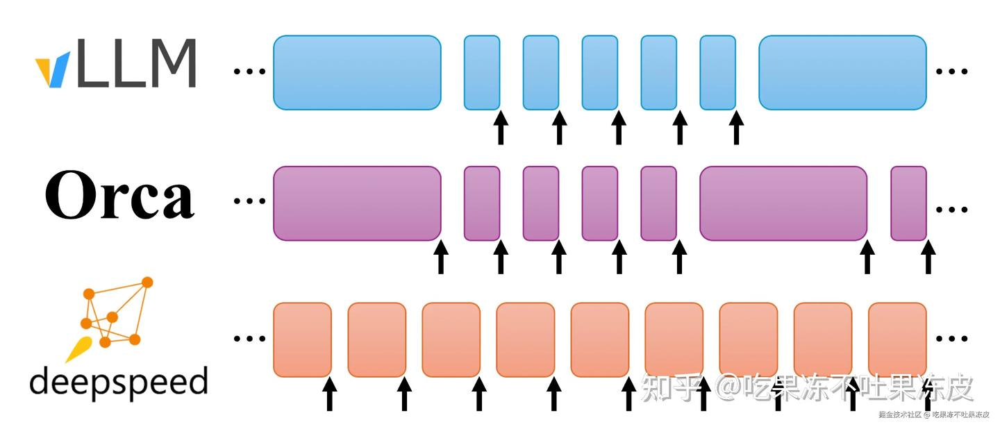

### vLLM 与 DeepSpeed-FastGen 性能基准

在 NVIDIA A100-80GB GPU 上使用 LLaMA-7B 模型在以下场景中对这两个系统进行了基准测试。当工作负载始终是长提示和短输出时，DeepSpeed-FastGen 表现更佳。在其他场景中，vLLM 表现出优越的性能。

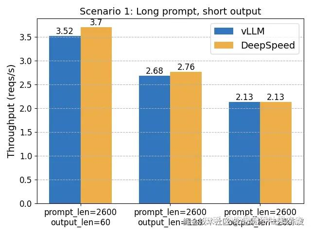

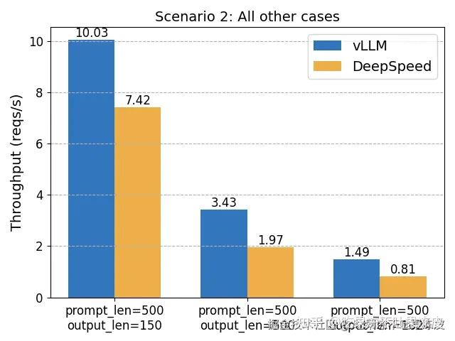

### LMDeploy 中的 Persistent Batching

LMDeploy 中的 Persistent Batching（类似continuous batching的功能）是在其TurboMind 推理引擎中实现。TurboMind 结构如下所示，主要包括：LLaMA 架构模型的支持，persistent batch 推理模式和可扩展的 KV 缓存管理器。

```text
  +--------------------+
  |        API         |
  +--------------------+
          |    ^
    请 求  |    | 流式回调
          v    |
  +--------------------+    获取   +-------------------+
  |  Persistent Batch  | <-------> |  KV Cache 管理器 |
  +--------------------+    更新   +-------------------+
             ^
             |
             v
+------------------------+
|      LLaMa推理实现      |
+------------------------+
| FT kernels & utilities |
+------------------------+
```

Persistent Batching 的实现需要一个请求队列（推理请求首先先加入到请求队列中），其次，需要Persistent线程从请求队列中获取请求进行处理。

Persistent线程执行逻辑：

- 该功能会预先准备好 N 个 batch slots。
- 当有空闲 slots 时，请求就会加入到 batch 中。当请求对应的 tokens 都生成完毕后，对应的 batch slot 会立刻被释放，接收新的请求。
- **当一个 sequence 命中缓存时，它的历史 token 不必在每轮中都进行解码，所以它的 token 生成过程会即刻开始**。
- 整个 batch 会自动扩缩容来避免不必要的计算。

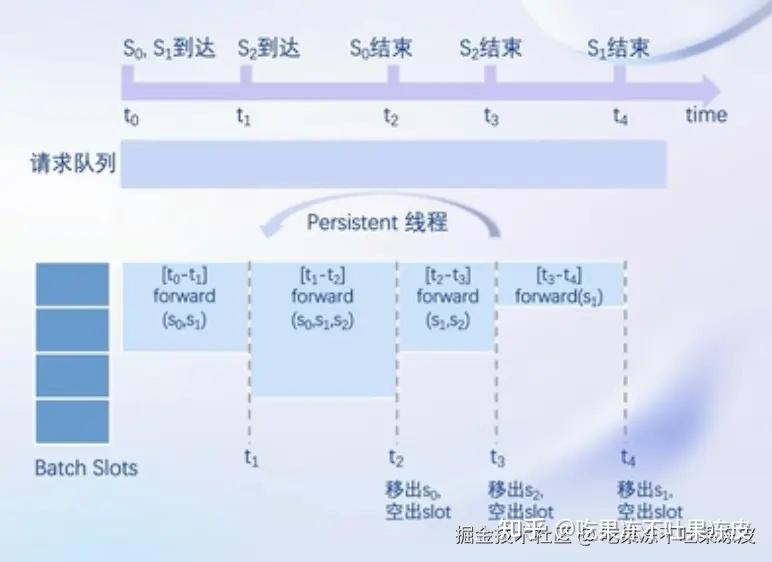

实现 Persistent Batching 时，通常会与 KV Cache 内存管理优化相结合进一步提升性能。在 TurboMind 中，通过 [KV Cache 管理器](https://link.zhihu.com/?target=https%3A//github.com/InternLM/lmdeploy/blob/main/src/turbomind/models/llama/SequenceManager.h) 实现，这是一个内存池类型的对象，并且在其中加入了 LRU 的实现，这样整个管理器可以被看作是一个 **KV Cache的缓存**。大致工作方式如下：

- KV Cache 由管理器分配。管理器会根据预先配置好的 slot 数量开辟空间。每个 slot 对应于一个 sequence 所需的 KV 缓存。分配的内存块大小可通过配置来实现预分配或者按需分配（或介于两者之间）。
- 当有新的请求，但是缓存池中没有空闲 slot时，根据 LRU 机制，管理器会踢除最近使用最少的 sequence，把它占据的 slot 分给新的请求。
- 如果sequence获取到了slot，类似缓存命中。它在缓存中的历史KV会被直接返回，而不用再进行context decoding 。
- 被踢除的 sequences 不会被完全的删除，而是会被转换成最简洁的形式，例如 token IDs 。当之后获取到相同的 sequence id 时 (即 *cache-miss* 状态)，这些 token IDs 将被 FMHA 的 context decoder 解码并被转回 KV 缓存。
- 踢除和转换均由 TurboMind 内部自动管理，所以对用户来说是透明的。**从用户的使用角度来看，使用了 TurboMind 的系统就像是可以访问无限的设备内存**。

此外，MDeploy 也引入了 dynamic split & fuse。

### TensorRT-LLM 中的 in-flight batching

TensorRT-LLM 依赖于一个称为批处理管理器的组件来支持请求的in-flight batching（在社区中，也称为continuous batching或Iteration batching）。该技术旨在减少队列中的等待时间，消除 padding 请求的需求并带来更高的 GPU 利用率。

更详细地说，此功能允许在循环生成Token的每次迭代中**包含新到达的请求并返回新完成的请求**。运行中批处理通过称为批处理管理器的 TensorRT-LLM 组件进行访问。该批处理管理器公开了钩子，供用户注册函数指针来定义 TensorRT-LLM 如何读取新请求以及如何将已完成的请求返回给用户。

### LightLLM 中的 Continues Batching

LightLLM 是一款纯 Python 的 LLM 推理框架，里面也实现了Continues Batching，相关代码逻辑在[RouterManager.loop_for_fwd()](https://link.zhihu.com/?target=https%3A//github.com/ModelTC/lightllm/blob/main/lightllm/server/router/manager.py%23L160)中；Prefill 和 Decode 会在同一个 step 进行处理。同时，其针对PagedAttention进行了改进，提出了TokenAttention（一种在Token级别管理键和值缓存的注意力机制）来最大限度地减少内存碎片并实现高效的内存共享，而且还可以促进高效的内存分配和释放。它提供了一种更精确和细粒度的内存管理，从而优化内存利用率。另外，该框架也引入了 SplitFuse 特性。

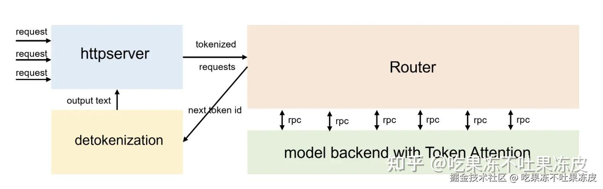

## 总结

本文先介绍了不同批处理基本概念区别，然后，讲述了 LLM 推理框架中提升吞吐性能最重要的技术 Continuous batching。同时，分析了其在不同框架中的应用实现。

参考文档：

- [LLM 推理加速方式汇总](https://zhuanlan.zhihu.com/p/688736901)
- [连续批处理](https://link.zhihu.com/?target=https%3A//www.bilibili.com/video/BV15b421a7Rm/%3Fspm_id_from%3D333.999.0.0%26vd_source%3Db12bd535d71dd38f94ddfaed6c3c441b)
- [LLM Inference: Continuous Batching and PagedAttention](https://link.zhihu.com/?target=https%3A//insujang.github.io/2024-01-07/llm-inference-continuous-batching-and-pagedattention/)
- [借着triton inference server聊一下各种batching方法](https://link.zhihu.com/?target=https%3A//mp.weixin.qq.com/s%3F__biz%3DMzU3Mzg5ODgxMg%3D%3D%26mid%3D2247489116%26idx%3D1%26sn%3D0f2771e71f2c3e020ab8e86684df0093%26chksm%3Dfd3bff0fca4c7619db3f3dc800df858150a12c7f192234625b871a4f15cfc699c5746846c5b8%26token%3D1935281044%26lang%3Dzh_CN%23rd)*
- [Dynamic Batching & Concurrent Model Execution(triton)](https://link.zhihu.com/?target=https%3A//github.com/triton-inference-server/tutorials/tree/main/Conceptual_Guide/Part_2-improving_resource_utilization)*
- [Ragged Batching(triton)](https://link.zhihu.com/?target=https%3A//docs.nvidia.com/deeplearning/triton-inference-server/user-guide/docs/user_guide/ragged_batching.html)*
- [Orca: A Distributed Serving System for Transformer-Based Generative Models](https://link.zhihu.com/?target=https%3A//www.usenix.org/system/files/osdi22-yu.pdf)
- [The Batch Manager in TensorRT-LLM](https://link.zhihu.com/?target=https%3A//github.com/NVIDIA/TensorRT-LLM/blob/v0.11.0/docs/source/advanced/batch-manager.md%23the-batch-manager-in-tensorrt-llm)
- [TurboMind 框架(TurboMind)](https://link.zhihu.com/?target=https%3A//github.com/InternLM/lmdeploy/blob/v0.5.1/docs/zh_cn/inference/turbomind.md)
- [LlamaBatch.cc(TurboMind)](https://link.zhihu.com/?target=https%3A//github.com/InternLM/lmdeploy/blob/v0.5.1/src/turbomind/models/llama/LlamaBatch.cc)
- [LMDeploy 大模型量化部署实践](https://link.zhihu.com/?target=https%3A//www.bilibili.com/video/BV1iW4y1A77P/%3Fvd_source%3Db12bd535d71dd38f94ddfaed6c3c441b)
- [llm_engine.py(vLLM)](https://link.zhihu.com/?target=https%3A//github.com/vllm-project/vllm/blob/v0.5.2/vllm/engine/llm_engine.py%23L817)*
- [LLMEngine(vLLM)](https://link.zhihu.com/?target=https%3A//docs.vllm.ai/en/latest/dev/engine/llm_engine.html)*
- [vLLM Meetups](https://link.zhihu.com/?target=https%3A//docs.vllm.ai/en/latest/community/meetups.html)
- [从continuous batching到vLLM中的batching](https://zhuanlan.zhihu.com/p/688551989)*
- [图解大模型计算加速系列：vLLM源码解析1，整体架构](https://zhuanlan.zhihu.com/p/691045737)
- [大模型推理核心技术之Continuous Batching和我的WXG往事](https://zhuanlan.zhihu.com/p/676109470)**
- [How continuous batching enables 23x throughput in LLM inference while reducing p50 latency](https://link.zhihu.com/?target=https%3A//www.anyscale.com/blog/continuous-batching-llm-inference)*
- [Notes on vLLM v.s. DeepSpeed-FastGen](https://link.zhihu.com/?target=https%3A//blog.vllm.ai/2023/11/14/notes-vllm-vs-deepspeed.html)*
- [DeepSpeed-FastGen：通过 MII 和 DeepSpeed-Inference 实现 LLM 高吞吐量文本生成](https://link.zhihu.com/?target=https%3A//github.com/microsoft/DeepSpeed/tree/master/blogs/deepspeed-fastgen/chinese)
- [continues_batch(LightLLM)](https://link.zhihu.com/?target=https%3A//github.com/ModelTC/lightllm/tree/main/lightllm/server/router/req_queue/continues_batch)
- [SplitFuseBackend(LightLLM)](https://link.zhihu.com/?target=https%3A//github.com/ModelTC/lightllm/blob/main/lightllm/server/router/model_infer/mode_backend/splitfuse/impl.py)