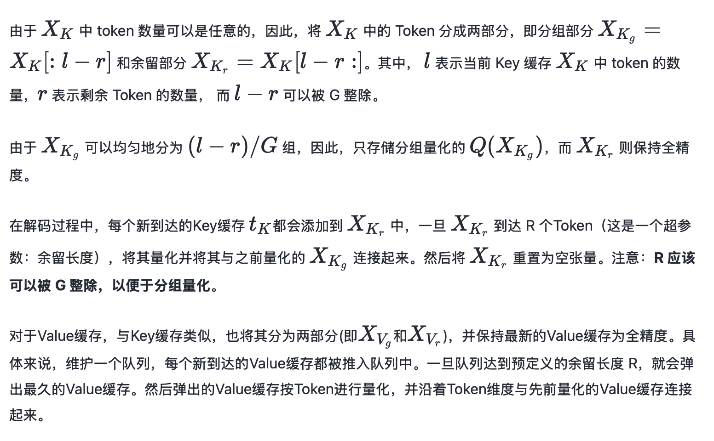
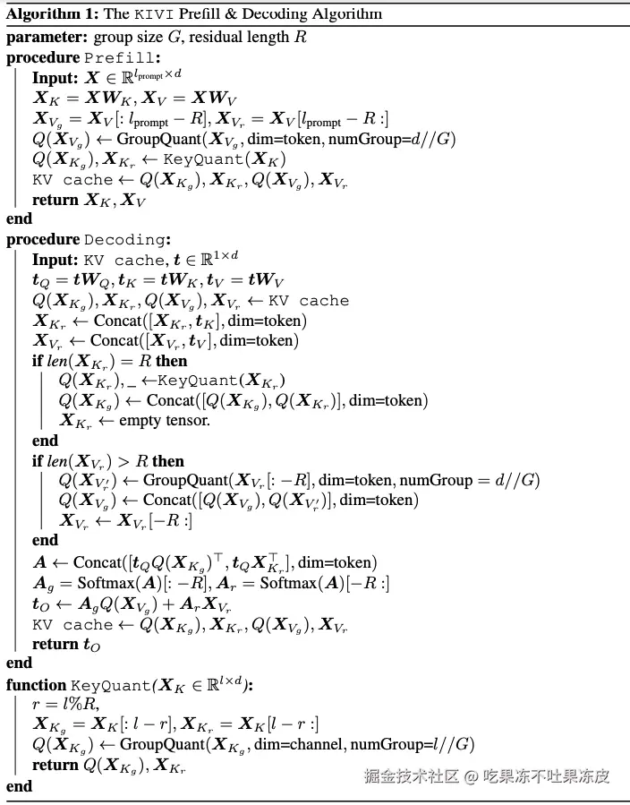
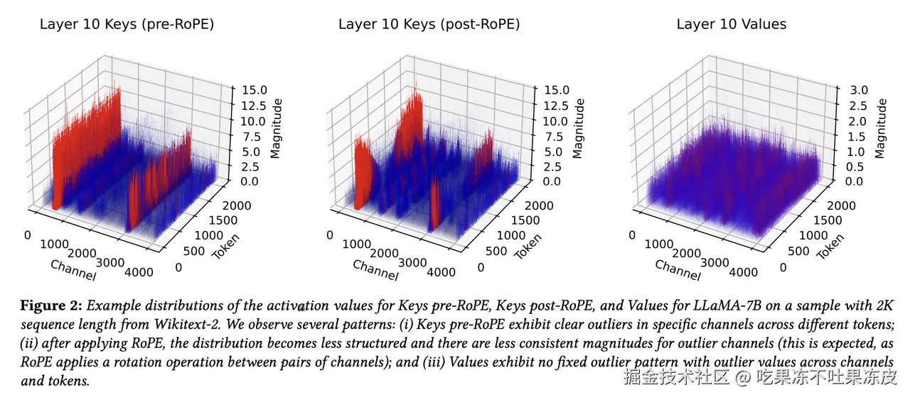
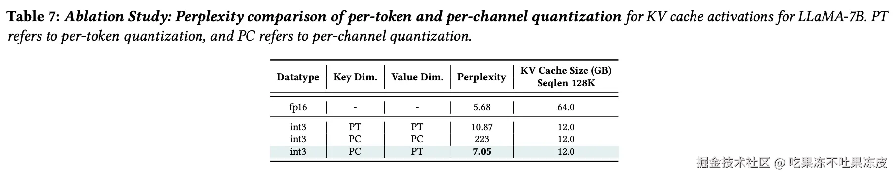
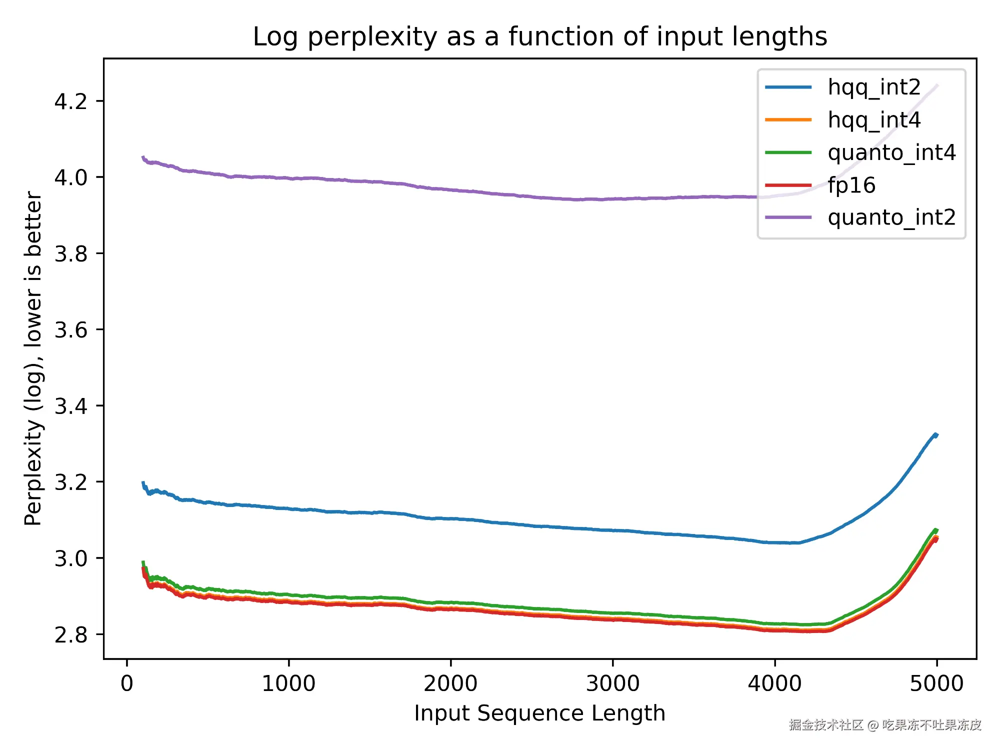

# 大模型推理优化技术-KV Cache量化

https://juejin.cn/post/7420231738558627874

之前在 [大模型推理优化技术-KV Cache](https://juejin.cn/post/7362789570217885759) 一文讲述了在大模型推理时，通常会使用 KV Cache 进行推理优化，以避免在大模型生成阶段，反复计算KV 值，从而提高推理速度。但与此同时，KV Cache 造成了对于内存需求的显著提升。所以，KV Cache 是一种折衷方案（用显存换计算），本文将讲述一些针对 KV Cache 量化的方法来降低对于显存的消耗，从而使我们能够生成更长的序列以及处理更大的批次数据。

## 为什么需要进行 KV Cache 量化？

在大模型推理过程中，模型的显存占用主要由模型权重、激活（前向传递过程中生成的张量）以及KV缓存（从之前处理过的 token 的 self-attention 层中提取的Key-Value对）组成。模型的权重和激活由于模型参数规模确定之后通常比较固定。 而 KV 缓存除了与模型参数规模规模有关，还有输入与生成序列的长度有关。

KV 缓存的计算公式如下：

- 每个Token的 KV 缓存大小（以字节为单位）= `2 * 2 * 层数 * 键值头数 * 每个头的维度` ，其中第一个 `2` 表示键和值，第二个 `2` 是我们需要的字节数 (假设模型加载精度为 `float16`) = `2 * num_layers * (num_heads * dim_head) * precision_in_bytes`
- 每个批处理中，KV缓存的总大小（半精度） = `batch_size * sequence_length * 2 * num_layers * hidden_size * sizeof(FP16)`

对于一个 LLaMA2-7B 而言，模型权重和 KV Cache 的数据类型均为FP16，则缓存一个Token的KV大概需要0.5M，因此，对于1张RTX4090显卡24G显存需要有14G存储模型权重，剩余的10G最多能缓存20000个Token（理想状态下，这里不考虑激活的显存占用）。假设序列长度为1000，则最大能处理的批处理大小为20，对于很多业务场景而言，这是很常见的情况。

可见 KV Cache 消耗的显存可能与模型权重相当，甚至很多场景比模型权重消耗的显存更多。这是由于 KV Cache 是紧密依赖于当前请求线程的，不同请求依赖的 Prefix Prompt 是完全不同的，因此无法合并。同时，大量 KV 缓存的加载会导致计算Core的空闲，从而限制了推理速度。

因此，在LLM推理场景中，内存的瓶颈和推理速度在于存储和加载KV Cache。所以，KV Cache 部分的量化其实是非常有必要的，尤其是超长提示词长度的时候。

## KV Cache 量化方法

最近，涌现了不少关于 KV Cache 量化的工作。比如：KIVI、KVQuant、QServe(QoQ)等。

### KIVI

KIVI 通过对流行的 LLM 的 KV 缓存中的元素分布进行了全面的研究，发现如下几点：

- 当对 Key 和 Value 缓存使用常用的按Token量化时，INT4 数据类型可以保持准确性。然而，将其减少到 INT2 时，会导致精度显著下降。
- 当按通道量化 Value 缓存时，无论如何量化Key缓存，精度都会显著恶化。
- 当使用较低的数值精度（例如：INT2）时，最准确的方法是逐通道量化 Key 缓存和逐 Token 量化 Value 缓存。

因此，KIVI开发了一种 2 比特非对称 KV 缓存量化方法。该方法对 Key 缓存按通道进行量化，即沿通道维度对元素进行分组并将它们一起量化。同时，对 Value 缓存按Token进行量化。这使得 Llama、Falcon 和 Mistral 模型与FP16相比保持几乎相同的质量，同时减少了 2.6 倍的峰值内存（包括模型权重）。并且内存使用量的减少使得批量大小增加了 4 倍，实际的推理吞吐量提高了 2.35 倍 ∼ 3.47 倍。

**为什么键和值缓存应该沿着不同的维度进行量化**？

一是由于观察到将逐通道的Key缓存和逐Token的Value缓存量化为 2 比特导致的精度下降非常小。

二是通过可视化不同层的原始 KV 缓存分布，观察到，在 Key 缓存中，一些固定通道表现出非常大的幅度，**每个通道内异常值的持续存在意味着每个通道量化可以将量化误差限制在每个通道内，而不影响其他正常通道**。而在Value缓存中，没有明显的异常值。同时，由于注意力分数高度稀疏，因此，输出只是一些重要 Token 的 Value 缓存的组合。每个 Token 的量化可以将误差限制在每个单独的Token上。因此，量化其他 Token 不会影响重要Token的准确性。因此，按Token量化会导致相对误差更小。

**KIVI 工作原理**：

由于LLM新生成的Token的Key和Value缓存是按顺序到达的。从实现的角度来看，逐Token的Value缓存量化可以与流式场景很好地结合在一起，新量化的张量按Token维度直接附加到现有的量化Value缓存中。

然而，对于逐通道 key 缓存量化，量化过程跨越不同的Token，这不能直接在流式场景中实现。KIVI解决这个问题的关键思想是将每 G 个Token的 Key 缓存进行分组并分别进行量化。

 具体解决方案如下：



在预填充阶段，尽管只有量化的 KV 缓存保留在内存中，但**全精度（FP16）的Key和Value张量会传递到下一层**。

整个算法的伪代码如下所示。



### KVQuant

KV 缓存已然成为长序列长度和大批量大小的内存消耗的主要贡献者，并且由于批量推理中的每个序列都依赖于单独的过去的上下文；因此，在批量推理过程中加载缓存的Key和Value以进行各自的计算时，不存在批量级并行。所以，KV 缓存加载始终受内存带宽限制。这促使人们寻求压缩 KV 缓存的方法，而量化是一种很有前途的压缩 KV 缓存激活的方法；即使是以更复杂的反量化过程为代价。

但是现有的解决方案无法以低于 4 比特的数值精度来准确表示激活。KVQuant 则通过结合几种新颖的方法来促进低精度 KV 缓存量化。

具体的优化技术如下：

一、**按通道（Per-Channel）对Key进行量化**，通过调整 Key 激活的量化维度以更好地匹配分布；

通过分析KV缓存的分布情况发现Key矩阵在特定通道上存在明显的异常值，这些通道的平均幅值比其他通道大；这与之前（LLM.int8()、SmoothQuant）的论文中关于LLM激活中的异常通道的观察结果一致。而Value矩阵既存在异常通道也存在异常token（但这些异常值没有Key矩阵中的通道的异常值那么极端）。



为了更好地匹配分布，研究了按通道的KV缓存量化，即缩放因子和零点由同一通道中的元素共享。通过沿通道维度共享缩放因子和零点，将具有相似幅度的值组合在一起，从而在低精度量化时减轻异常通道对其他通道的影响，并且通过实验发现对Key按通道量化带来了显著的准确性，但对Value则不然。通过消融比较发现对 Key 按通道量化和对 Value 按 token 量化获得了更好的困惑度（Perplexity）。



此外，按通道量化可能面临挑战，因为如果在线计算，每次向Key缓存中添加新token时可能需要重新计算缩放因子。本文展示了可以通过使用校准集离线校准缩放因子，从而避免昂贵的在线重新计算。

按通道对Key进行量化也在同期的工作KIVI中被探索，该工作利用了将同一通道中的大幅度值组合在一起以最小化量化误差。他们的方法需要对按通道量化进行细粒度分组，同时保持KV缓存的一部分为fp16精度（直到该组的所有元素都已添加到KV缓存中）。

而本文的工作展示了通过利用离线校准，可以准确地执行按通道量化，而不进行分组。

二、**在 RoPE 之前对 Key 进行量化**，在旋转位置嵌入之前量化Key激活，以减轻其对量化的影响；

在量化Keys时遇到的一个问题是处理旋转位置嵌入（RoPE），它在大多数 LLMs（包括LLaMA和LLaMA-2等）中应用于 Keys 和 Queries 。但应用RoPE后的Key向量缓存的挑战在于，它导致序列中不同位置的不同通道对（pairs）以不同数量混合。上图2中展示了RoPE之后的激活分布，由于通道对之间旋转导致不一致的通道幅度，这使得通常具有一致的大幅度值的Key激活通道更难量化。这激发了作者对**是否可以在RoPE应用之前执行Key量化，然后在反量化后即时高效地应用位置嵌入**的探索。

通过实验发现在 RoPE 之前对 Key 进行量化带来了精度的提升，同时，为了能够在RoPE之前量化Key，作者开发了一个融合Kernel，以在反量化后高效应用RoPE。

三、**非均匀 KV 缓存量化**，通过导出每层敏感度加权的非均匀数据类型，以更好地表示分布；

统一量化对于KV缓存量化来说是不理想的，因为Query和Key激活的分布是非均匀的。此外，KV缓存加载受内存带宽限制，无论批量大小或序列长度如何，这意味着非均匀量化方法引入的反量化开销不会成为问题（因为增加的计算不会引入任何额外的延迟）。因此，**作者希望利用非均匀量化方法对KV缓存进行量化**。

在 SqueezeLLM 中，作者使用敏感度加权的k-means方法计算非均匀量化。然而，这不能直接应用于 KV 缓存量化，因为 **Values 是在运行时动态量化的**，这意味着我们需要在推理过程中在线应用 K-means，并且在线估计激活的敏感度也很困难。

因此，KVQuant 通过在校准数据上离线导出每层（per-tensor）的非均匀数据类型来促使高效的在线的进行非均匀 KV 缓存量化，然后再按 per-channel 或 per-token 重新缩放以准确表示Key和Value的分布。通过在推理之前在校准集上离线计算敏感度加权量化路标（signposts），同时在导出共享数据类型之前将每个通道单独归一化到范围 `[−1 , 1 ]` 来保持与per-vector量化的兼容性。

四、**按向量（Per-Vector）密集和稀疏量化**，分别隔离每个向量的异常值，以最大限度地减少量化范围中的偏差。

对于Key和Value，**大多数元素（约99%）都被包含在动态范围的一小部分内**。这意味着通过采用密集和稀疏量化的方法，如SqueezeLLM中所示，可以**隔离一小部分数值上的异常值，并将它们存储在一个单独的稀疏矩阵中**。这样做可以限制需要表示的范围，从而允许我们用更高的精度来表示剩余的元素。

此外，Key和Value的分布中，不同的通道和token具有不同的平均幅值。因此，在一个通道中被视为异常值的元素，在另一个通道中可能并不是异常值（因为那个通道可能有更大的平均幅值）。因此，直接处理**那些会在特定维度上扭曲量化范围的异常值**是至关重要的，以便解决沿着特定维度范围扩大的值。KVQuant 采用了按向量密集和稀疏量化的方法，通过为每个向量使用不同的异常值阈值（对于按通道量化，是每个通道单独一个阈值；对于按token量化，是每个token单独一个阈值），而不是为每层使用单一的异常值阈值。

计算按向量密集和稀疏量化的异常值阈值可能会带来潜在的准确性和效率挑战。KVQuant 能够准确地离线校准 per-channel 的异常值阈值，并能够在线高效地计算per-token的异常值阈值。在确定上下异常值阈值后，向量中的其余数字被归一化到`[-1, 1]`的范围，然后最小化方程 Q(A)∗≃argminQ∑i=1NFii(Ai−Q(Ai))2Q(A)∗≃argminQ∑i=1NFii(Ai−Q(Ai))2（忽略异常值）以获得剩余数字的非均匀数据类型的量化路标（signposts）。

下图展示了通过移除一小部分数值离群值，并保持其全精度的好处，以及按向量（Per-Vector）密集和稀疏量化相对于每层（Per-Tenser/Per-Matrix）使用单个全局离群值阈值的优势。


五、**Attention Sink感知量化**

先前的工作表明，**LLMs在前几层之后，模型倾向于将较大的注意力分数分配给第一个Token**。即使初始Token在语义上并不重要，也会发生这种情况。发生这种现象是因为模型倾向于使用初始Token作为“sink”。在 KVQuant 中证明，由于 Attention Sink 现象，**模型对第一个Token中的量化误差异常敏感**。通过仅保留第一个Token为fp16，就可以获得好处，特别是对于 2 比特量化。另一项同期进行的工作 Intactkv 也得出了类似的观察结果。

注意，**在保留第一个Token为fp16时，也在校准过程中考虑到这一点**，这意味着我们在导出 nuqX 数据类型（一个 X 比特按层灵敏度加权非均匀数据类型）以及校准Key的缩放因子和零点时忽略第一个Token。该方法会持续产生性能优势，特别是在较低位宽且没有密集和稀疏量化的情况下。

此外，为了在推理期间高效地执行激活量化，KVQuant 利用专们的 kernel 进行实现，采用4位量化方法压缩向量到要降低的精度，并提取稀疏异常值，**使用压缩向量执行矩阵-向量乘法**，并**使用稀疏异常值执行稀疏矩阵-密集向量乘法**。将量化的Key和Value矩阵元素存储为4比特，它们用作查找表的索引以恢复相应的 fp16 值。同时，通过以压缩稀疏行（CSR）或压缩稀疏列（CSC）格式存储稀疏异常值矩阵（取决于哪种格式更适合添加新的Key和Value token）；并且 Key 矩阵-向量运算的 kernels 实时应用RoPE以支持在RoPE之前量化。

本文仅介绍了两篇关于 KV Cache 量化具有代表性的工作：KIVI、KVQuant。此外还有很多关于 KV Cache 量化的工作就不一一介绍了。

## KV Cache 量化在AI框架中的应用

KV Cache 量化技术在AI框架中也得到了广泛的应用。但是每个框架对于 KV Cache 量化的支持有一些差别。比如：vLLM 提供了 FP8 KV Cache 量化，TensorRT-LLM 提供了 FP8和INT8 KV Cache 量化，而 LMDeploy 则提供了 INT8和INT4 KV Cache 量化，Hugging Face Transformers 除了提供 INT8和INT4 ， 甚至还提供了 INT2 的 KV Cache 量化。

### HuggingFace Transformers

Transformers 中的 KV Cache 量化很大程度上受启发于 [KIVI: A Tuning-Free Asymmetric 2bit Quantization for kv Cache](https://link.juejin.cn/?target=https%3A%2F%2Farxiv.org%2Fabs%2F2402.02750) 的论文。该论文对大语言模型引入了 2 比特非对称量化。由于研究表明，对于 LLM 而言，Key在某些通道上容易出现高幅度的异常值，而Value并无此表现。因此，KIVI 采用按通道量化Key和按词元量化Value的方法，量化精度和原始精度之间的相对误差要小得多。

而集成至 transformers 时，Key和Value都是按通道量化的。量化的主要瓶颈是每次添加新词元 (即每个生成步骤) 时都需要Key和Value进行量化和反量化，这可能会降低生成速度。为了解决这个问题，决定保留固定大小的余留缓存 (residual cache)，以原始精度存储Key和Value。当余留缓存达到其最大容量时，存储在里面的Key和Value都会被量化，然后将其内容从余留缓存中清空。这个小技巧还有助于保持准确性，因为一些最新的键和值始终以其原始精度存储。设置余留缓存长度时主要需要考虑内存效率的权衡。虽然余留缓存以其原始精度存储键和值，但这可能会导致总体内存使用量增加。实验发现使用余留长度为 128 作为基线的效果不错。

目前，Transformers 支持 KV 量化的后端有: quanto 后端，支持 int2 和 int4 量化; HQQ 后端，支持 int2 、 int4 和 int8 量化。如下图所示，两个后端的 `int4` 缓存的生成质量与原始 `fp16` 几乎相同，而使用 `int2` 时出现了质量下降。



以下为使用 HQQ 后端 进行 KV 缓存量化的示例：

```python
import torch
from transformers import AutoTokenizer, AutoModelForCausalLM, set_seed, BitsAndBytesConfig

set_seed(1234)  # For reproducibility

prompt = "The best tomato sauce is"

model_id = "meta-llama/Meta-Llama-3-8B-Instruct"

bnb_config = BitsAndBytesConfig(
        load_in_4bit=True,
        bnb_4bit_quant_type="nf4",
        bnb_4bit_compute_dtype=torch.float16,
        bnb_4bit_use_double_quant=True,
)

tokenizer = AutoTokenizer.from_pretrained(model_id)
model = AutoModelForCausalLM.from_pretrained(model_id, quantization_config=bnb_config, attn_implementation="flash_attention_2", torch_dtype=torch.float16, device_map="cuda:0")

inputs = tokenizer(prompt, return_tensors="pt").to(model.device)
# quanto后端
# model.generate(**inputs, do_sample=False, max_new_tokens=20, cache_implementation="quantized", cache_config={"backend": "quanto", "nbits": 4})
# hqq后端
outputs = model.generate(**inputs, max_new_tokens=150, cache_implementation="quantized", cache_config={"backend": "HQQ", "nbits": 4, "q_group_size": 128, "residual_length": 64, "device":model.device})
result = tokenizer.decode(outputs[0], skip_special_tokens=True)

print(result)
```

`cache_config`中量化涉及的超参数如下：

- **backend** ：执行量化时使用的后端，根据对准确性与推理速度的偏好，选择 HQQ 或 Quanto。
- **nbits** ：设置量化精度。quanto支持[2,4]，HQQ支持[1,2,3,4,8]。默认为2。尽管 2 位量化是一种选择，但请注意，它可能会显著影响LLM效果，仅少量减少内存使用。
- **q_group_size** ：量化组的大小，应该是模型隐藏维度的除数。默认为64。建议将其保持在 128。减少此数字可以提高量化精度，但对内存使用量的减少将不太明显。
- **residual_length** ：剩余缓存的长度，它将始终以原始精度存储。默认为128。
- **device** ：建议将其显式设置为加载模型权重的同一设备。允许 Transformers 库自动管理，但这可能会导致效率低下，例如：模型加载到了 GPU，也会默认使用 CPU。
- **compute_dtype** ：模型中计算使用的默认dtype。在反量化之后，键和值将被强制转换为此dtype。默认为float16。

### vLLM

由于 INT8/INT4 量化方案需要额外的 GPU 内存存储，这降低了预期的 GPU 内存优势。 而FP8数据格式保留2~3个尾数位，可以将float/fp16/bflaot16和fp8相互转换。vLLM通过 compressed-tensors 支持 FP8 KV Cache 量化。

注：当前的Prefix Caching不适用于启用 FP8 KV Cache的情况。

以下是vLLM中将KV Cache量化为 FP8（E5M2）的示例代码。

```python
from vllm import LLM, SamplingParams
import time
import pandas as pd

# Sample prompts.
prompts = [
  {
    "ability": "语言理解能力",
    "question": "请解释“双关语”是什么，并给出一个例子。"
  },
  {
    "ability": "逻辑推理能力",
    "question": "如果所有的猫都怕水，而Tom是一只猫，那么Tom怕水吗？"
  },
  {
    "ability": "知识广度",
    "question": "请列出五个诺贝尔奖类别，并简要说明每个类别的颁奖领域。"
  },
  {
    "ability": "道德和伦理判断",
    "question": "在一个假设的情景中，如果一个人工智能系统必须在保护多数人和保护一个无辜者之间做出选择，它应该如何决定？"
  }
]

# Create a sampling params object.
sampling_params = SamplingParams(temperature=0.8, top_p=0.95, max_tokens=512)

# 初始化LLM时，指定 KV Cache 的数据类型
llm = LLM(model="/workspace/models/Qwen2-7B-Instruct", kv_cache_dtype="fp8")
#llm = LLM(model="/workspace/models/Qwen2-7B-Instruct")

infer_times = []
gen_lens = []
# 根据提示生成文本。输出是一个RequestOutput对象列表，其中包含提示、生成的文本和其他信息。
# Print the outputs.
for prompt in prompts:
    start = time.time()
    question = prompt["question"]
    output = llm.generate(question, sampling_params)
    infer_time = time.time() - start
    print("耗时：", infer_time)
    gen_len=len(output[0].outputs[0].token_ids)
    
    infer_times.append(infer_time)
    gen_lens.append(gen_len)
    
    #prompt = output[0].prompt
    generated_text = output[0].outputs[0].text
    prompt["answer"] = generated_text 
    print(f"Prompt: {question!r}, Generated text: {generated_text!r}")

print(infer_times)
print(gen_lens)
avg_infer_time = round(sum(infer_times) / len(infer_times), 4)
print("avg_infer_time: ", round(sum(infer_times) / len(infer_times), 4))

avg_gen_len= round(sum(gen_lens) / len(gen_lens), 2)
print("avg_gen_len: ", round(sum(gen_lens) / len(gen_lens), 2))

avg_infer_time_per_token = round(avg_infer_time  / avg_gen_len, 4)
print("avg_infer_time_per_token: ", avg_infer_time_per_token)

df = pd.DataFrame(prompts)
df.to_excel('vllm-fp8-e5m2.xlsx', index=False)
```

### TensorRT-LLM

TensorRT-LLM 中采用静态逐层（per-tensor）KV Cache 8 位（FP8和INT8）量化方案。以下是将KV Cache量化为INT8的示例代码：

首先将进行模型权重转换，这里通过kv_cache_dtype指定KV Cache的数据类型：

```css
CUDA_VISIBLE_DEVICES=0,1,2  python examples/quantization/quantize.py --model_dir /workspace/models/Qwen1.5-7B-Chat \
                                   --dtype bfloat16 \
                                   --kv_cache_dtype int8 \
                                   --output_dir /workspace/models/Qwen1.5-7B-Chat-1tp-wbf16-kvint8-trt \
                                   --calib_size 512 \
                                   --calib_dataset 
                                   
```

进行模型编译：

```css
rm -rf  /workspace/models/Qwen1.5-7B-Chat-1tp-wbf16-kvint8-trt-engine-4090
trtllm-build --checkpoint_dir /workspace/models/Qwen1.5-7B-Chat-1tp-wbf16-kvint8-trt \
--output_dir /workspace/models/Qwen1.5-7B-Chat-1tp-wbf16-kvint8-trt-engine-4090 \
--gpt_attention_plugin bfloat16 \
--gemm_plugin bfloat16 \
--max_num_tokens 7000 \
--use_custom_all_reduce disable \
--paged_kv_cache enable \
--workers 1 \
--multiple_profiles enable \
--max_input_len 1024 \
--max_output_len 1024 \
--max_batch_size 128
```

接下来使用Triton部署模型，先修改配置文件。

```bash
#rm -rf /workspace/models/Qwen1.5-7B-Chat-wbf16kvint8-server-4090
cp -r /workspace/code/tensorrtllm_backend/all_models/inflight_batcher_llm /workspace/models/Qwen1.5-7B-Chat-wbf16kvint8-server-4090

export HF_LLAMA_MODEL=/workspace/models/Qwen1.5-7B-Chat
export ENGINE_PATH=/workspace/models/Qwen1.5-7B-Chat-1tp-wbf16-kvint8-trt-engine-4090
export TEMPLATE_PATH=/workspace/models/Qwen1.5-7B-Chat-wbf16kvint8-server-4090

cd /workspace/code/tensorrtllm_backend
python3 tools/fill_template.py -i ${TEMPLATE_PATH}/preprocessing/config.pbtxt \
tokenizer_dir:${HF_LLAMA_MODEL},triton_max_batch_size:64,preprocessing_instance_count:1

python3 tools/fill_template.py -i ${TEMPLATE_PATH}/postprocessing/config.pbtxt \
tokenizer_dir:${HF_LLAMA_MODEL},triton_max_batch_size:64,postprocessing_instance_count:1

python3 tools/fill_template.py -i ${TEMPLATE_PATH}/tensorrt_llm_bls/config.pbtxt \
triton_max_batch_size:64,decoupled_mode:False,bls_instance_count:1,accumulate_tokens:False

python3 tools/fill_template.py -i ${TEMPLATE_PATH}/ensemble/config.pbtxt \
triton_max_batch_size:64

python3 tools/fill_template.py -i ${TEMPLATE_PATH}/tensorrt_llm/config.pbtxt \
triton_backend:tensorrtllm,triton_max_batch_size:128,decoupled_mode:True,\
max_beam_width:1,engine_dir:${ENGINE_PATH},\
kv_cache_free_gpu_mem_fraction:0.95,gpu_weights_percent:0.5,\
exclude_input_in_output:True,\
batching_strategy:inflight_fused_batching,max_queue_delay_microseconds:0,\
enable_chunked_context:False,batch_scheduler_policy:max_utilization

echo "------------------------------------"
echo ${TEMPLATE_PATH}
cat ${TEMPLATE_PATH}/tensorrt_llm/config.pbtxt | grep -C 5 "kv_cache_free_gpu_mem_fraction"
cat ${TEMPLATE_PATH}/tensorrt_llm/config.pbtxt | grep -C 5 "inflight_fused_batching"
cat ${TEMPLATE_PATH}/tensorrt_llm/config.pbtxt | grep -C 5 "batch_scheduler_policy" 
cat ${TEMPLATE_PATH}/tensorrt_llm/config.pbtxt | grep -C 5 "enable_chunked_context"    
```

部署推理服务：

```bash
docker run -it --rm \
--gpus '"device=6"' \
--shm-size=32g \
-p 8400:8000 \
-v /share/aidev/data/guodong.li/workspace:/workspace \
-w /workspace \
aiharbor.msxf.local/nvidia/tritonserver:24.06-trtllm-python-py3 \
tritonserver --model-repository /workspace/models/Qwen1.5-7B-Chat-wbf16kvint8-server-4090 \
--log-info true \
--log-verbose 4
```

最后使用接口`/v2/models/ensemble/generate`正常请求就行。

### LMDeploy

LMDeploy 自 v0.4.0 起支持**在线** kv cache int4/int8 量化，量化方式为 per-head per-token 的非对称量化。原来的 kv 离线量化方式移除。

从直观上看，量化 kv 有利于增加 kv block 的数量。与 fp16 相比，int4/int8 kv 的 kv block 分别可以增加到 4 倍和 2 倍。这意味着，在相同的内存条件下，kv 量化后，系统能支撑的并发数可以大幅提升，从而最终提高吞吐量。但通常，量化会伴随一定的模型精度损失。

LMDeploy 中 kv 量化具备以下优势：

- 量化不需要校准数据集
- 支持 volta 架构（sm70）及以上的所有显卡型号
- kv int8 量化精度几乎无损，kv int4 量化精度在可接受范围之内
- 推理高效，在 llama2-7b 上加入 int8/int4 kv 量化，RPS 相较于 fp16 分别提升近 30% 和 40%

注：与vLLM不同，Prefix Caching 可以与 KV Cache 量化同时使用。

以下为 LMDeploy 中对于llama2、internlm2模型使不使用kv 量化的推理效率对比：

| model             | kv type | test settings                            | RPS   | v.s. kv fp16 |
| ----------------- | ------- | ---------------------------------------- | ----- | ------------ |
| llama2-chat-7b    | fp16    | tp1 / ratio 0.8 / bs 256 / prompts 10000 | 14.98 | 1.0          |
| -                 | int8    | tp1 / ratio 0.8 / bs 256 / prompts 10000 | 19.01 | 1.27         |
| -                 | int4    | tp1 / ratio 0.8 / bs 256 / prompts 10000 | 20.81 | 1.39         |
| llama2-chat-13b   | fp16    | tp1 / ratio 0.9 / bs 128 / prompts 10000 | 8.55  | 1.0          |
| -                 | int8    | tp1 / ratio 0.9 / bs 256 / prompts 10000 | 10.96 | 1.28         |
| -                 | int4    | tp1 / ratio 0.9 / bs 256 / prompts 10000 | 11.91 | 1.39         |
| internlm2-chat-7b | fp16    | tp1 / ratio 0.8 / bs 256 / prompts 10000 | 24.13 | 1.0          |
| -                 | int8    | tp1 / ratio 0.8 / bs 256 / prompts 10000 | 25.28 | 1.05         |
| -                 | int4    | tp1 / ratio 0.8 / bs 256 / prompts 10000 | 25.80 | 1.07         |

以下是将KV Cache量化为INT4示例代码，其中，**`qant_policy=4` 表示 kv int4 量化，`quant_policy=8` 表示 kv int8 量化。**

```python
from lmdeploy import pipeline, TurbomindEngineConfig
from lmdeploy.messages import GenerationConfig
import time
import pandas as pd

# Sample prompts.
prompts = [
  {
    "ability": "语言理解能力",
    "question": "请解释“双关语”是什么，并给出一个例子。"
  },
  {
    "ability": "历史知识",
    "question": "请简述第二次世界大战的主要参战方和战争转折点。"
  },
  {
    "ability": "道德和伦理判断",
    "question": "在一个假设的情景中，如果一个人工智能系统必须在保护多数人和保护一个无辜者之间做出选择，它应该如何决定？"
  }
]

engine_config = TurbomindEngineConfig(quant_policy=4)
#engine_config = TurbomindEngineConfig(quant_policy=0)
gen_config = GenerationConfig(top_p= 0.95 , temperature= 0.8 , max_new_tokens= 512 ,  random_seed= 1 )
pipe = pipeline("/workspace/models/Qwen1.5-7B-Chat", backend_config=engine_config)

# 根据提示生成文本。输出是一个RequestOutput对象列表，其中包含提示、生成的文本和其他信息。
# Print the outputs.
for prompt in prompts:
    start = time.time()
    question = prompt["question"]
    response = pipe(question, gen_config=gen_config)
    infer_time = time.time() - start
    generate_text = response.text
    print(f"Prompt: {question!r}, Generated text: {generate_text!r}")
    print("耗时：", infer_time)
    prompt["answer"] = generate_text 
    
```

## 总结

总之，量化 KV Cache是一种减少内存需求的重要方法。在LLMs推理过程中，根据所选的量化方法和特定的量化设置，可以将 KV Cache大小缩小 2 到 3 倍，从而可能释放数十 GB 的显存空间。然而，量化可能会降低解码速度，并可能显著影响解码的准确性，因此，这需要权衡和取舍，并通过仔细调整量化超参数可以减轻这些影响。

参考文档：

- [Memory Optimization in LLMs: Leveraging KV Cache Quantization for Efficient Inference](https://link.juejin.cn/?target=https%3A%2F%2Fmedium.com%2F@tejaswi_kashyap%2Fmemory-optimization-in-llms-leveraging-kv-cache-quantization-for-efficient-inference-94bc3df5faef)
- [用 KV 缓存量化解锁长文本生成](https://link.juejin.cn/?target=https%3A%2F%2Fhuggingface.co%2Fblog%2Fzh%2Fkv-cache-quantization)
- [LLM Inference Series: 4. KV caching, a deeper look](https://link.juejin.cn/?target=https%3A%2F%2Fmedium.com%2F@plienhar%2Fllm-inference-series-4-kv-caching-a-deeper-look-4ba9a77746c8)

