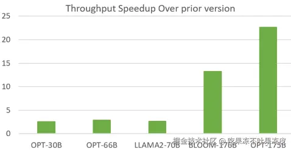

# 大模型低显存推理优化-Offload技术

https://juejin.cn/post/7405158045628596224

近两年大模型火出天际；同时，也诞生了大量针对大模型的优化技术。本系列将针对一些常见大模型优化技术进行讲解。

- [大模型推理优化技术-KV Cache](https://juejin.cn/post/7362789570217885759)
- [大模型推理服务调度优化技术-Continuous batching](https://juejin.cn/post/7401065821596336164)
- 大模型显存优化技术-PagedAttention
- 大模型低显存推理优化-Offload技术
- 大模型优化技术-FlashAttention
- 大模型解码优化-Speculative Decoding及其变体

> 另外，我撰写的**大模型相关的博客及配套代码**均整理放置在Github：[llm-action](https://link.juejin.cn/?target=https%3A%2F%2Fgithub.com%2Fliguodongiot%2Fllm-action%2Ftree%2Fmain)，有需要的朋友自取。

由于 GPU 资源稀缺和昂贵，一定程度上使得大模型的应用和普及变得困难。因此，本文从大模型推理部署出发，介绍了一些低硬件成本（消费级GPU、CPU等）部署大模型的方法，并着重介绍了低显存推理优化技术Offload在各个AI框架的应用。

## 简述

对于LLM推理场景而言，内存需求主要包括如下几个方面：

- **模型权重**，以LLaMA2-7B为例，以 16 位精度（FP16 或 BF16）加载，7B * sizeof(FP16) ~= 14 GB
- KV caching，自注意力KV张量的缓存，以避免冗余计算。
  - 每个Token的 KV 缓存大小（以字节为单位）= 2 * (num_layers) * (num_heads * dim_head) * precision_in_bytes
  - 每个批处理中，KV缓存的总大小（半精度） = **(batch_size) \* (sequence_length) \* 2 \* (num_layers) \* (hidden_size) \* sizeof(FP16)**
  - 对于 16 位精度的 LLaMA2-2 7B 模型为例，批量大小为 1，KV 缓存的大小将为 1 * 4096 * 2 * 32 * 4096 * 2 字节，即约 2 GB。
- 输入张量、内部激活张量、中间结果临时变量等

因此，低显存推理优化的对象通常为权重、KV Cache、激活等。

## 低显存推理优化技术

而要使用更低的显存进行推理，常用的优化手段有 Kernel 优化、模型压缩、Offload技术等。

### Kernel 优化

对于 Kernel 优化，主要有针对 Attention 的优化，比如：

- MQA / **GQA**
- FlashAttention
  - v1：重排Attention的计算，通过利用tiling、recompute来显著加快速度并将内存使用量从二次降低到线性。
  - v2：通过减少非矩阵乘计算（FLOPs）提升吞吐量，优化Attention部分thread blocks计算，使其在序列长度维度上并行化，让SM的利用率尽量打满。优化thread blocks内部warp层级的工作模式，尽量减少warp间的通讯和读取shared memory的次数。
  - v3：利用Hopper架构新硬件特性 Tensor Core WGMMA 计算和 [Tensor Memory Accelerator（TMA）](https://link.juejin.cn/?target=https%3A%2F%2Fdocs.nvidia.com%2Fcuda%2Fhopper-tuning-guide%2Findex.html%23tensor-memory-accelerator)的异步性来重叠计算与通信，利用FP8低精度计算。
- PagedAttention
  - 背景：KV Cache 显存占用大、碎片化。
  - KV Cache 被划分成块，块不需要在内存空间中连续。
  - 高效的内存共享（并行采样）。

### 压缩

对于推理场景，模型压缩主要的应用技术有模型量化和模型剪枝。

对于模型量化常用的技术有：

- 权重量化：
  - LLM.int8()（W8A16）、AWQ(W4A16、W4A8-FP8）、SpQR(W3/4A16)、GPTQ(W2/3/4A16)、FP8、Quant-LLM(**FP6**/FP5/FPx)
- 激活量化：
  - SmoothQuant（W8A8）、FP8、ZeroQuant（W8A8）、ZeroQuant-FP （W8A8-FP8）
- KV Cache 量化：
  - [KIVI](https://link.juejin.cn/?target=https%3A%2F%2Farxiv.org%2Fabs%2F2402.02750)(2 比特非对称)、FP8、[KVQuant](https://link.juejin.cn/?target=https%3A%2F%2Farxiv.org%2Fabs%2F2401.18079)

对于模型剪枝常用的技术有：

- 结构化剪枝：
  - LLM-Pruner、LLM-Shearing
- 非结构化剪枝：
  - SparseGPT、Flash-LLM、Wanda

### Offload技术（Dynamic Computation Offloading）/混合部署/混合推理

Offload 技术（也可以理解为混合部署或混合推理）将对象卸载到外部资源或将其分布在多种设备上以减少主设备的内存负载，常用用于在GPU显存有限的设备上优化内存使用。比如：将GPU显存中的权重卸载到CPU内存、NVMe/Disk。

对于推理场景下，Offload的对象有以下两种：

- 权重
- KV Cache

## Offload 技术在AI框架中的应用

目前，Offload 技术已经广泛用于各AI框架用于降低训练和推理的显存。下面来看看 Offload 在AI框架中的应用。

### HuggingFace Transformers

通常情况下，使用Pytorch来加载模型步骤如下：

1. 创建模型
2. 将权重加载到内存（一个叫做`state_dict`的字典对象）
3. 在已创建模型基础上加载权重值
4. 将模型加载到相应设备上（如：GPU）进行模型推理

示例代码：

```ini
ini

 代码解读
复制代码import torch

my_model = ModelClass(...)
state_dict = torch.load(checkpoint_file)
my_model.load_state_dict(state_dict)
```

对于超大模型进行推理，这种常规的加载方式存在一些明显的局限性。第一步，在 RAM 中加载模型的完整版本，并花一些时间随机初始化权重，第二步将模型的另一个完整预训练权重加载到 RAM 中。因此，对于一个6B的模型，使用FP16半精度加载，也需要24G内存。因此，这种常规的加载方式已经无法满足要求。

在 Transformers 库中利用Accelerate库来完成这些超大模型的加载。那么 Accelerate 如何利用 PyTorch 来加载和运行大模型进行推理呢？具体步骤如下：

1. 创建一个空模型（没有权重）
2. 当有多个计算设备可用时，决定每一层权重的去向。Accelerate库提供了一个函数用来自动检测一个空模型使用的设备类型。它会最大化利用所有的GPU资源，然后再使用CPU资源，并且给不能容纳的权重打上标记，并 offload 到硬盘。
3. 加载部分权重到内存
4. 将内存中的这些权重加载到空模型中
5. 将权重移动到计算设备上完成推理
6. 对剩下的权重，重复步骤 3，直到加载完所有权重，并完成最终推理。

示例代码如下：

```python
import torch
from accelerate import init_empty_weights, load_checkpoint_and_dispatch

with init_empty_weights():
    model = MyModel(...)

model = load_checkpoint_and_dispatch(
    model, checkpoint=checkpoint_file, device_map="auto"
)

input = torch.randn(2,3)
input = input.to("cuda")
output = model(input)
```

上面的代码通过设置`device_map=auto`，会根据可用资源自动确定模型每一层的放置位置。

在 Transformers 库中，也是通过在`from_pretrained()`或者`pipeline()`函数中设置`device_map=auto`完成同样的操作。

此外，`device_map`有如下选项可供设置：

- `"auto"` 或 `"balanced"`: Accelerate将会根据所有GPU均衡切分权重，尽量均匀的切分到各个GPU上；
- `"balanced_low_0"`: Accelerate均匀分割权重到各个GPU上，除了第一个GPU（序号为0）。在第一个GPU上会尽量节省显存（这种模式可以有效节省第一个GPU的显存，以便使用generate函数用于模型生成）；
- `"sequential"`: Accelerate按照GPU的顺序占用显存（后面的GPU可能根本不会使用）。

当然也可以根据需求设置`device_map`参数，以决定各个部分权重应该放置的设备。

```ini
device_map = {"block1": 0, "block2.linear1": 0, "block2.linear2": 1, "block2.linear3": 1}
```

此外，还可以通过max_memory来控制各个设备使用的内存的大小。

```ini
max_memory={0: "10GiB", 1: "20GiB", 2: "20GiB", "cpu": "60GiB"}
```

下面展示了Transformers使用 3 张 4090 加载 Qwen1.5-72B 模型。其中，GPU0显存限制为使用10G、GPU1/2显存限制为使用20G、CPU内存限制为使用60G，其余使用Disk加载。

```python
from transformers import AutoModelForCausalLM, AutoTokenizer
import torch

path = "/workspace/models/Qwen1.5-72B-Chat"
model = AutoModelForCausalLM.from_pretrained(
    path, 
    device_map="auto", 
    #max_memory={0: "15GiB", 1: "20GiB", "cpu": "60GiB"},
    #max_memory={0: "15GiB", 1: "20GiB", 2: "20GiB", "cpu": "60GiB"},
    max_memory={0: "10GiB", 1: "20GiB", 2: "20GiB", "cpu": "60GiB"},
    offload_folder="offload",
    #offload_buffers=True,
    offload_state_dict = True, 
    torch_dtype=torch.float16
)
model.hf_device_map
```

加载完成之后，可以看到模型中每一层放置的具体位置。

```arduino
{
	'model.embed_tokens': 0,
	'model.layers.0': 0,
	'model.layers.1': 0,
	'model.layers.2': 0,
	'model.layers.3': 1,
        ...
	'model.layers.14': 1,
	'model.layers.15': 2,
	...
	'model.layers.26': 2,
	'model.layers.27': 'cpu',
	...
	'model.layers.61': 'cpu',
	'model.layers.62': 'disk',
	...
	'model.layers.79': 'disk',
	'model.norm': 'disk',
	'lm_head': 'disk'
}
```

之后即可进行模型推理了。

此外，Transformers 为了减少 GPU VRAM 使用，实现了Offload KV Cache的功能，通过将大多数层的 KV 缓存移至 CPU 来实现这一点。

当模型的`forward()`方法迭代各层时，该策略会在GPU上维护当前层的缓存。同时，它异步预取下一层缓存，并将上一层缓存发送回 CPU。与 KV 缓存量化（可能损失模型精度）不同，此策略始终与默认 KV Cache 实现产生相同的结果。示例代码如下：

```python
>>> import torch
>>> from transformers import AutoTokenizer, AutoModelForCausalLM
>>> ckpt = "microsoft/Phi-3-mini-4k-instruct"

>>> tokenizer = AutoTokenizer.from_pretrained(ckpt)
>>> model = AutoModelForCausalLM.from_pretrained(ckpt, torch_dtype=torch.float16).to("cuda:0")
>>> inputs = tokenizer("Fun fact: The shortest", return_tensors="pt").to(model.device)

>>> out = model.generate(**inputs, do_sample=False, max_new_tokens=23, cache_implementation="offloaded")
>>> print(tokenizer.batch_decode(out, skip_special_tokens=True)[0])
Fun fact: The shortest war in history was between Britain and Zanzibar on August 27, 1896.

>>> out = model.generate(**inputs, do_sample=False, max_new_tokens=23)
>>> print(tokenizer.batch_decode(out, skip_special_tokens=True)[0])
Fun fact: The shortest war in history was between Britain and Zanzibar on August 27, 1896.
```

因此，它可以作为默认 KV 缓存的直接替代品或备用方案，具体示例如下：

```python
>>> import torch
>>> from transformers import AutoTokenizer, AutoModelForCausalLM
>>> def resilient_generate(model, *args, **kwargs):
...     oom = False
...     try:
...         return model.generate(*args, **kwargs)
...     except torch.cuda.OutOfMemoryError as e:
...         print(e)
...         print("retrying with cache_implementation='offloaded'")
...         oom = True
...     if oom:
...         torch.cuda.empty_cache()
...         kwargs["cache_implementation"] = "offloaded"
...         return model.generate(*args, **kwargs)
...
...
>>> ckpt = "microsoft/Phi-3-mini-4k-instruct"
>>> tokenizer = AutoTokenizer.from_pretrained(ckpt)
>>> model = AutoModelForCausalLM.from_pretrained(ckpt, torch_dtype=torch.float16).to("cuda:0")
>>> prompt = ["okay "*1000 + "Fun fact: The most"]
>>> inputs = tokenizer(prompt, return_tensors="pt").to(model.device)
>>> beams = { "num_beams": 40, "num_beam_groups": 40, "num_return_sequences": 40, "diversity_penalty": 1.0, "max_new_tokens": 23, "early_stopping": True, }
>>> out = resilient_generate(model, **inputs, **beams)
>>> responses = tokenizer.batch_decode(out[:,-28:], skip_special_tokens=True)
```

### DeepSpeed ZeRO-Inference

2022年9月 DeepSpeed 提出了 ZeRO-Inference 用于 Offload 权重。 [Zero Inference](https://link.juejin.cn/?target=https%3A%2F%2Fwww.deepspeed.ai%2F2022%2F09%2F09%2Fzero-inference.html) 利用 ZeRO Stage 3 的数据并行特性，能够将模型分布到多张GPU上或者Offload到内存或者NVMe上，使单GPU无法加载的模型进行推理。

**工作原理**

大模型推理的大量计算需求意味着需要 GPU 等加速器才能高效执行。因此，在有限的 GPU 预算上进行大模型推理的一个重要设计决策是如何在模型权重、推理输入和中间结果之间分配 GPU 内存。Zero Inference提供了两种方案。

第一种方案：**卸载所有模型权重**

将整个模型权重固定在 CPU 或 NVMe 中，并将权重逐层流式传输到 GPU 中以进行推理计算。计算完一层后，输出将保留在 GPU 内存中作为下一层的输入，而层权重消耗的内存将被释放以供下一层使用。因此，**模型推理时间由在 GPU 上计算各层的时间和通过 PCIe 获取各层的时间组成**。

ZeRO-Inference 通过两种方式提供了可扩展性的优势。

首先，通过只在 GPU 内存中保留一个（或几个）模型层，ZeRO-Inference 显著减少了推理大规模模型所需的 GPU 内存量。对于当前具有大约一百层的大模型（例如，GPT3-175B 和 Megatron-Turing-530B 中分别有 96 层和 105 层），ZeRO-Inference 将 GPU 内存需求降低了两个数量级。例如，通过ZeRO-Inference，Megaton-Turing-530B 半精度（FP16）推理的GPU内存消耗从1TB下降到10GB。

其次，通过将模型放置到比 GPU 内存便宜几个数量级的 CPU 或 NVMe 内存中，ZeRO-Inference 使得扩展到更大的模型（例如，具有数万亿或数十万亿参数）的成本比其他方法（将整个模型放入 GPU 内存中）更经济实惠。

尽管通过 PCIe 互连从 CPU 或 NVMe 获取模型权重存在延迟，但 ZeRO-Inference 仍可为面向吞吐量的推理应用程序提供高效计算。主要原因是**通过将 GPU 内存使用限制为模型的一层或几层权重，ZeRO-Inference 可以使用大部分 GPU 内存来支持大量以长序列或大批量形式出现的输入Token**。大模型层需要大量计算，尤其是在处理具有许多输入Token的输入时。例如，一个 GPT3-175B 的Transformer层来处理批量大小为 1、序列长度为 2048 的输入需要大约 7 TFlops 。因此，对于长序列长度和大批量大小的推理场景，计算时间在获取模型权重的延迟中占主导地位，这最终提高了效率。总而言之，ZeRO-Inference 利用 GPU 内存支持大量输入Token的策略可以为大型模型提供高性能推理。

此外，ZeRO-Inference 利用两项额外的优化来减少从 CPU 或 NVMe 获取层权重到 GPU 内存的延迟。

- 第一个优化将层的获取与较早层的计算重叠，即**层预取**。层预取允许 ZeRO-Inference 隐藏预取层的部分传输延迟。
- 第二个优化适用于多个 GPU上的推理，涉及通过使用每个 GPU 仅获取该层的一部分来跨多个 GPU 并行获取每个层。以这种方式**使用 GPU 的聚合 PCIe 链路，本质上线性增加了传输带宽，从而减少了延迟**。通过这种方法，将层提取到 GPU 内存中分两个阶段进行。首先，每个 GPU 独立地将层的一个分区从PCIe提取到其内存中。此时，每个 GPU 上将仅驻留该层的一个分区。接下来，每个 GPU 通过高带宽 GPU-GPU 互连（例如：NVLink、xGMI 等）从其他 GPU 获取缺失的层分区，从而组装完整的层进行计算。**由于 GPU-GPU 互连带宽通常比 PCIe 带宽高一个数量级，因此可以使用高效的多 GPU 或多节点通信原语（例如：NCCL 或 RCCL all-gather）在所有 GPU 上高效地组装完整层，其延迟与 PCIe 延迟相比，可以忽略不计**。

第二种方案： **在 GPU 内存中托管一些模型权重**

**将尽可能多的模型权重固定到 GPU 内存中**，并在需要计算时获取剩余部分（从 CPU 或 NVMe）。这种方法的一个好处是**避免了获取已固定在 GPU 内存中的权重的延迟**。然而，这种方法有两个缺点：

- 千亿参数模型的延迟节省可以忽略不计，因为只有一小部分权重可以放入 GPU 内存中；
- 即使相当一部分模型权重可以放入 GPU 内存中（例如，对于~10B模型 > 50%），剩余的GPU内存只能容纳小批量大小，这会损害推理吞吐量。

补充：**ZeRO-Inference 与 DeepSpeed-Inference 的区别**

- [ZeRO-Inference](https://link.juejin.cn/?target=https%3A%2F%2Fwww.deepspeed.ai%2F2022%2F09%2F09%2Fzero-inference.html)主要针对我们希望在非常有限的 GPU 内存上使用非常大的模型运行推理的情况。它利用 ZeRO Offload 功能将大部分模型权重移动到 CPU 内存（甚至 NVME 存储）。由于存在与卸载权重相关的开销，因此它通常不太适合低延迟推理的场景。
- [DeepSpeed-Inference](https://link.juejin.cn/?target=https%3A%2F%2Fwww.deepspeed.ai%2Ftutorials%2Finference-tutorial%2F)是一个独立的引擎，为运行推理引入了大量优化。例如，支持对数万个模型进行自定义Kernel注入(它比 pytorch/transformers 提供的基准 Kernel 有更好的性能)，这可以显著提高延迟和吞吐量。这是在进行推理时获得最低延迟的最佳选择，但代价是需要更多的 GPU 内存。

ZeRO-Inference 与 DeepSpeed-Inference 的示例代码如下：

```python
# Launch with `deepspeed deepspeed-zero-inference.py`

import torch
import deepspeed
import os
import time
from transformers.deepspeed import HfDeepSpeedConfig
from transformers import AutoConfig, AutoTokenizer, AutoModelForCausalLM

local_rank = int(os.getenv("LOCAL_RANK", "0"))
world_size = int(os.getenv("WORLD_SIZE", "1"))

model_name = "/workspace/models/llama-7b-hf"

def run_zero_inference():
    ds_config = {
        "fp16": {"enabled": True},
        "bf16": {"enabled": False},
        "zero_optimization": {
            "stage": 3,
            "offload_param": {
                "device": "cpu",
            },
        },
        "train_micro_batch_size_per_gpu": 1,
    }
    
    # 与HuggingFace共享DeepSpeed配置，以便我们可以正确使用 zero stage 3 加载大模型
    hfdsc = HfDeepSpeedConfig(ds_config)

    # Load the model and tokenizer
    tokenizer = AutoTokenizer.from_pretrained(model_name)
    model = AutoModelForCausalLM.from_pretrained(
        model_name, torch_dtype=torch.float16
    )

    # Initialize DeepSpeed
    ds_engine = deepspeed.initialize(model=model, config_params=ds_config)[0]
    ds_engine.module.eval()
    model = ds_engine.module

    # Run inference
    start_time = time.time()
    inputs = tokenizer.encode("DeepSpeed is", return_tensors="pt").to(
        f"cuda:{local_rank}"
    )
    outputs = model.generate(inputs, max_new_tokens=20)
    output_str = tokenizer.decode(outputs[0])
    end_time = time.time()
    print(output_str)
    print("ZeRO-inference time:", end_time - start_time)
    print("-------------------------------")


def run_deepspeed_inference():
    # Load the model on meta tensors
    config = AutoConfig.from_pretrained(model_name)
    tokenizer = AutoTokenizer.from_pretrained(model_name, use_fast=False)
    with deepspeed.OnDevice(dtype=torch.float16, device="meta", enabled=True):
        model = AutoModelForCausalLM.from_config(config, torch_dtype=torch.float16)

    # Define the checkpoint dict. You may need to convert *.safetensors to
    # *.bin for this work. Make sure you get all the *.bin and *.pt files in
    # the checkpoint_files list.
    checkpoint_dir = "/workspace/models/llama-7b-hf"
    checkpoint_files = [
        os.path.join(checkpoint_dir, f"pytorch_model-{i:05d}-of-00033.bin")
        # os.path.join(checkpoint_dir, f"model-{i:05d}-of-00033.safetensors")
        for i in range(1, 34)
    ]
    checkpoint_dict = {
        "type": "DS_MODEL",
        "checkpoints": checkpoint_files,
        "version": 1.0,
    }
    print(checkpoint_dict)

    model = deepspeed.init_inference(
        model,
        replace_with_kernel_inject=False,
        tensor_parallel={"tp_size": world_size},
        #replace_method="auto",
        #replace_with_kernel_inject=True,
        #mp_size=world_size,
        dtype=torch.float16,
        checkpoint=checkpoint_dict,
    )

    # Run inference
    start_time = time.time()
    inputs = tokenizer.encode("DeepSpeed is", return_tensors="pt").to(
        f"cuda:{local_rank}"
    )
    outputs = model.generate(inputs, max_new_tokens=20)
    output_str = tokenizer.decode(outputs[0])
    end_time = time.time()
    print(output_str)
    print("DeepSpeed-inference time:", end_time - start_time)

if __name__ == "__main__":
    run_zero_inference()
    run_deepspeed_inference()
```

2023年9月 DeepSpeed 更新了 ZeRO-Inference 以支持 Offload **KV Cache**。相比之前的版本，通过利用两项内存优化（**权重量化**和**KV cache offload**），将推理吞吐量提升高达 20 倍。

模型主要的内存消耗来自模型权重和 KV Cache，这限制了可用于推理的最大批量大小（从而限制了吞吐量）。 ZeRO-Inference 现在提供模型权重的 4 位量化，从而使其内存使用量和 PCIe 传输量减少大约 4× 。同时，在 DeepSpeed 框架中集成了高效的量化/反量化 Kernel。

此外，KV Cache作为提高系统吞吐量的另一个限制因素，现在可以将其卸载到更便宜的 CPU 内存，而不是使用更昂贵的 HBM 容量。官方提供了对BLOOM、LLAMA2 、 OPT模型的支持。如果需要支持其他模型进行KV Cache Offload，则需要进行少许代码更改。具体步骤如下：

1. 通过在模型运行推理之前调用 `set_kv_cache_offload()` 函数，为 HF 模型启用 KV 缓存卸载。该函数适当修改 HF 模型的forward函数，以触发注意力模块中的卸载行为。
2. 初始化一个空的CPU张量缓冲区来保存KV缓存。
   1. KV cache 张量的大小为 `2 * num_layers * batch_size * max_seq_len * hidden_size` ，其中 `2` 表示 K 值和 V 值， `num_layers` 是Transformer块的数量， `batch_size` 是推理批量大小， `max_seq_len` 是提示和生成的Token的总长度， `hidden_size` 是模型的隐藏维度。
   2. 如果 K 值和 V 值需要不同的布局，则可以使用两个单独的张量缓冲区来保存每个值。
   3. 空张量分配可以在模型初始化阶段或推理中的提示处理阶段完成。虽然理论上在模型初始化时初始化空张量会提高prompt阶段的吞吐量，但是**实验表明，在提示处理中分配 KV cache张量实际上会在测试的硬件/软件环境中带来稍微更好的整体吞吐量。因此，在当前的实现中采用这种方法。**
3. 在提示处理阶段将KV值传送到 CPU buffer。
   1. 在模型层级将相应的张量缓冲片传递给各个transformer块，然后在提示阶段将生成的KV值传递给 CPU buffer。
   2. 由于这种 GPU 到 CPU 的数据传输比 KV 值被投影(projected)早发生，因此我们将其放入不同的 GPU stream 中，并将其与以下注意力块中的计算**并行化**。
4. 解码阶段使用CPU KV cache：在解码阶段，当前Token的 KV 值被投影(projected)后，将其传输到 CPU KV 缓存。然后，CPU 上的完整 KV 值将用于注意力分数计算。
5. 计算注意力分数。
   1. **可以在 CPU 或 GPU 上完成**。如果在CPU上完成（计算速度慢），则需要将Q值（较少的数据）传输到CPU；如果在 GPU 上完成（快速计算），KV 值（更多数据）需要传输到 GPU。
   2. 由于注意力分数计算通常受到内存带宽的限制，如果有合适的 CPU，前一种方法可以提供更好的性能。因此，**当前的实现在 CPU 上计算注意力分数**。
   3. 注意：如果在 CPU 上计算，则需要在随后的输出投影线性层之前将注意力输出传输回 GPU。

在单个 NVIDIA A6000 GPU 上对各种模型大小执行面向吞吐量的推理。与之前版本相比，新版 ZeRO-Inference 的整体吞吐量提升明显。



此外，HF Transformers/Accelerate 对 DeepSpeed ZeRO-Inference 进行了集成，以便进行推理。

如果使用Trainer，要运行 ZeRO Inference，将常用训练参数传递给[TrainingArguments](https://link.juejin.cn/?target=https%3A%2F%2Fhuggingface.co%2Fdocs%2Ftransformers%2Fv4.44.0%2Fen%2Fmain_classes%2Ftrainer%23transformers.TrainingArguments)类并添加`--do_eval`参数，示例如下。

```css
deepspeed --num_gpus=2 your_program.py <normal cl args> --do_eval --deepspeed ds_config.json
```

DeepSpeed 也可以在没有[Trainer](https://link.juejin.cn/?target=https%3A%2F%2Fhuggingface.co%2Fdocs%2Ftransformers%2Fv4.44.0%2Fen%2Fmain_classes%2Ftrainer%23transformers.Trainer)类的情况下与 Transformer 配合使用。由`HfDeepSpeedConfig`进行处理，当您调用[from_pretrained()](https://link.juejin.cn/?target=https%3A%2F%2Fhuggingface.co%2Fdocs%2Ftransformers%2Fv4.44.0%2Fen%2Fmain_classes%2Fmodel%23transformers.PreTrainedModel.from_pretrained)时，它只负责收集（gathering） ZeRO-3 参数并在多个 GPU 上分割模型。

> 注意：如果您希望自动为您处理所有事情，请将 DeepSpeed 与[Trainer](https://link.juejin.cn/?target=https%3A%2F%2Fhuggingface.co%2Fdocs%2Ftransformers%2Fv4.44.0%2Fen%2Fmain_classes%2Ftrainer%23transformers.Trainer)结合使用！需遵循[DeepSpeed 文档](https://link.juejin.cn/?target=https%3A%2F%2Fwww.deepspeed.ai%2F)，并在配置文件中手动配置参数值（不能使用`"auto"`值）。

要高效部署 ZeRO-3，必须在模型之前实例化`HfDeepSpeedConfig`对象并保持该对象处于活动状态。

不使用Trainer的情况下的示例如下所示：

```python
#!/usr/bin/env python

# This script demonstrates how to use Deepspeed ZeRO in an inference mode when one can't fit a model
# into a single GPU
#
# 1. Use 1 GPU with CPU offload
# 2. Or use multiple GPUs instead
#
# First you need to install deepspeed: pip install deepspeed
#
# Here we use a 3B "bigscience/T0_3B" model which needs about 15GB GPU RAM - so 1 largish or 2
# small GPUs can handle it. or 1 small GPU and a lot of CPU memory.
#
# To use a larger model like "bigscience/T0" which needs about 50GB, unless you have an 80GB GPU -
# you will need 2-4 gpus. And then you can adapt the script to handle more gpus if you want to
# process multiple inputs at once.
#
# The provided deepspeed config also activates CPU memory offloading, so chances are that if you
# have a lot of available CPU memory and you don't mind a slowdown you should be able to load a
# model that doesn't normally fit into a single GPU. If you have enough GPU memory the program will
# run faster if you don't want offload to CPU - so disable that section then.
#
# To deploy on 1 gpu:
#
# deepspeed --num_gpus 1 t0.py
# or:
# python -m torch.distributed.run --nproc_per_node=1 t0.py
#
# To deploy on 2 gpus:
#
# deepspeed --num_gpus 2 deepspeed-inference-zero.py
# 既然指定了GPU的ID，那么就不需要再设置“--num_nodes”、“--num_gpus”
# deepspeed --include=localhost:6,7 deepspeed-inference-zero.py 
# or:
# python -m torch.distributed.run --nproc_per_node=2 t0.py

from transformers import AutoTokenizer, AutoConfig, AutoModelForSeq2SeqLM,AutoModelForCausalLM
from transformers.integrations import HfDeepSpeedConfig
import deepspeed
import os
import torch

os.environ["TOKENIZERS_PARALLELISM"] = "false"  # To avoid warnings about parallelism in tokenizers

# distributed setup
local_rank = int(os.getenv("LOCAL_RANK", "0"))
world_size = int(os.getenv("WORLD_SIZE", "1"))
torch.cuda.set_device(local_rank)
deepspeed.init_distributed()

#model_name = "bigscience/T0_3B"
model_name = "/workspace/models/Qwen2-7B-Instruct"

config = AutoConfig.from_pretrained(model_name)
# model_hidden_size = config.d_model
model_hidden_size = config.hidden_size

# 批处理大小必须被world_size整除，但可以大于world_size
# batch size has to be divisible by world_size, but can be bigger than world_size
train_batch_size = 1 * world_size

# ds_config notes
#
# - enable bf16 if you use Ampere or higher GPU - this will run in mixed precision and will be
# faster.
#
# - for older GPUs you can enable fp16, but it'll only work for non-bf16 pretrained models - e.g.
# all official t5 models are bf16-pretrained
#
# - set offload_param.device to "none" or completely remove the `offload_param` section if you don't
# - want CPU offload
#
# - if using `offload_param` you can manually finetune stage3_param_persistence_threshold to control
# - which params should remain on gpus - the larger the value the smaller the offload size
#
# For in-depth info on Deepspeed config see
# https://huggingface.co/docs/transformers/main/main_classes/deepspeed

# keeping the same format as json for consistency, except it uses lower case for true/false
# fmt: off
ds_config = {
    "fp16": {
        "enabled": False
    },
    "bf16": {
        "enabled": False
    },
    "zero_optimization": {
        "stage": 3,
        "offload_param": {
            "device": "cpu",
            "pin_memory": True
        },
        "overlap_comm": True,
        "contiguous_gradients": True,
        "reduce_bucket_size": model_hidden_size * model_hidden_size,
        "stage3_prefetch_bucket_size": 0.9 * model_hidden_size * model_hidden_size,
        "stage3_param_persistence_threshold": 10 * model_hidden_size
    },
    "steps_per_print": 2000,
    "train_batch_size": train_batch_size,
    "train_micro_batch_size_per_gpu": 1,
    "wall_clock_breakdown": False
}
# fmt: on

# next line instructs transformers to partition the model directly over multiple gpus using
# deepspeed.zero.Init when model's `from_pretrained` method is called.
#
# **it has to be run before loading the model AutoModelForSeq2SeqLM.from_pretrained(model_name)**
#
# otherwise the model will first be loaded normally and only partitioned at forward time which is
# less efficient and when there is little CPU RAM may fail
dschf = HfDeepSpeedConfig(ds_config)  # keep this object alive

# now a model can be loaded.
#model = AutoModelForSeq2SeqLM.from_pretrained(model_name)
#  Model type should be one of BartConfig, BigBirdPegasusConfig, BlenderbotConfig, BlenderbotSmallConfig, EncoderDecoderConfig, FSMTConfig, GPTSanJapaneseConfig, LEDConfig, LongT5Config, M2M100Config, MarianConfig, MBartConfig, MT5Config, MvpConfig, NllbMoeConfig, PegasusConfig, PegasusXConfig, PLBartConfig, ProphetNetConfig, SeamlessM4TConfig, SeamlessM4Tv2Config, SwitchTransformersConfig, T5Config, UMT5Config, XLMProphetNetConfig
model = AutoModelForCausalLM.from_pretrained(model_name, torch_dtype=torch.float16)

# initialise Deepspeed ZeRO and store only the engine object
ds_engine = deepspeed.initialize(model=model, config_params=ds_config)[0]
ds_engine.module.eval()  # inference

# Deepspeed ZeRO can process unrelated inputs on each GPU. So for 2 gpus you process 2 inputs at once.
# If you use more GPUs adjust for more.
# And of course if you have just one input to process you then need to pass the same string to both gpus
# If you use only one GPU, then you will have only rank 0.
rank = torch.distributed.get_rank()
if rank == 0:
    text_in = "Is this review positive or negative? Review: this is the best cast iron skillet you will ever buy"
elif rank == 1:
    text_in = "Is this review positive or negative? Review: this is the worst restaurant ever"

tokenizer = AutoTokenizer.from_pretrained(model_name)
inputs = tokenizer.encode(text_in, return_tensors="pt").to(device=local_rank)
with torch.no_grad():
    outputs = ds_engine.module.generate(inputs, max_new_tokens=20, synced_gpus=True)
text_out = tokenizer.decode(outputs[0], skip_special_tokens=True)
print(f"rank{rank}:\n   in={text_in}\n  out={text_out}")
```

运行结果：

```kotlin
# deepspeed --num_gpus 2 t0.py

rank0:
   in=Is this review positive or negative? Review: this is the best cast iron skillet you will ever buy
  out=Positive
rank1:
   in=Is this review positive or negative? Review: this is the worst restaurant ever
  out=negative
```

这里需要注意的是采用多 GPU 与 ZeRO-3 组合使用进行推理生成时，需要通过在[generate()](https://link.juejin.cn/?target=https%3A%2F%2Fhuggingface.co%2Fdocs%2Ftransformers%2Fv4.44.0%2Fen%2Fmain_classes%2Ftext_generation%23transformers.GenerationMixin.generate)方法中设置`synced_gpus=True`同步GPU。否则，如果一个 GPU 在另一个 GPU 之前完成推理生成，整个系统就会挂起（hangs），因为其余 GPU 不能从最先完成的 GPU 接收到权重分片。

对于 Transformers>=4.28，如果在推理生成过程中检测到多个 GPU， `synced_gpus`会自动设置为`True` 。

### llama.cpp

llama.cpp 主要目标是在本地和云端的各种硬件上以最少的设置和最先进的性能实现 LLM 推理。其支持使用**CPU+GPU 进行混合推理，以部分加速大于 VRAM 总容量的模型。** 使用 llama.cpp 之前需要将模型权重格式转换成**GGUF**格式。

> 补充：**GGUF**
>
> GGUF（GPT-Generated Unified Format）是由Georgi Gerganov（著名开源项目llama.cpp的创始人）定义发布的一种大模型文件格式。它是一种二进制格式文件的规范，原始的大模型预训练结果经过转换后变成GGUF格式可以更快地被载入使用，也会消耗更低的资源。原因在于GGUF采用了多种技术来保存大模型预训练结果，包括采用紧凑的二进制编码格式、优化的数据结构、内存映射等。
>
> 综上所述，GGUF可以理解为一种格式定义，采用相应的工具将原始模型预训练结果转换成GGUF之后可以更加高效的使用。目前，GGUF的发展势头强劲，HF已经对GGUF提供支持，并且适配了llama/qwen2等模型架构。

llama.cpp 也有类似于 HuggingFace Transformers 和 DeepSpeed ZeRO-Inference 类似的功能，但是与其的稍微不同之处是：llama.cpp是控制模型从CPU内存offload到GPU内存。而 HuggingFace Transformers 和 DeepSpeed ZeRO-Inference 的 offload 是从 GPU内存 offload 到 CPU 内存。具体的控制参数如下：

- `--n-gpu-layers` 或 `-ngl`： offload 模型权重层到 GPU 进行计算。0表示仅加载到CPU，999表示模型全部加载到GPU等加速卡。
- `--no-kv-offload` 或 `-nkvo`：禁用 KV Cache offload 到 GPU，默认是允许 offload 到 GPU。

直接使用llama.cpp的Python封装包部署模型，这里使用了4张RTX 4090部署72B模型，其中，将30个Transoformer层加载到GPU内存。具体示例如下：

```python
from llama_cpp import Llama
import time

llm = Llama(
      #model_path = "/workspace/models/Qwen2-7B-Instruct/ggml-model-f16.gguf",
      model_path="/workspace/models/Qwen1.5-72B-Chat/ggml-model-f16.gguf",
      n_gpu_layers = 30,
      # n_gpu_layers=-1, # Uncomment to use GPU acceleration
      # seed=1337, # Uncomment to set a specific seed
      # n_ctx=2048, # Uncomment to increase the context window
)


start = time.time()
output = llm(
      "Q:保持健康的秘诀有哪些？ A: ", # Prompt
      max_tokens=32, # Generate up to 32 tokens, set to None to generate up to the end of the context window
      #stream=True,
      stop=["Q:", "\n"], # Stop generating just before the model would generate a new question
      echo=True # Echo the prompt back in the output
) # Generate a completion, can also call create_completion
print(output)
infer_time = time.time() - start
print("耗时：", infer_time)
```

### vLLM

vLLM 对于 offload 的支持相对较晚，目前 vLLM 已经在 0.5.3 版本提供了 offload 权重到 CPU的支持，该实现与流水线并行相结合（因为vllm中的所有模型即将支持流水线并行，因此这应该是一个很好的选择）。通过 `--cpu-offload-gb`参数控制，该参数表示每个 GPU 可以额外使用多少内存！例如，如果您有一个 24 GB GPU 并将其设置为 10，实际上您可以将其视为 34 GB GPU。然后您可以加载BF16权重的13B模型，这需要至少26GB GPU内存。具体示例如下：

```python
from vllm import LLM, SamplingParams

# Sample prompts.
prompts = [
    "Hello, my name is",
    "The president of the United States is",
    "The capital of France is",
    "The future of AI is",
]
# Create a sampling params object.
sampling_params = SamplingParams(temperature=0.8, top_p=0.95)

# Create an LLM.
llm = LLM(model="meta-llama/Llama-2-13b-chat-hf", cpu_offload_gb=10)
# Generate texts from the prompts. The output is a list of RequestOutput objects
# that contain the prompt, generated text, and other information.
outputs = llm.generate(prompts, sampling_params)
# Print the outputs.
for output in outputs:
    prompt = output.prompt
    generated_text = output.outputs[0].text
    print(f"Prompt: {prompt!r}, Generated text: {generated_text!r}")
```

### TensorRT-LLM

TensorRT-LLM 中使用 Weight Streaming可以将一些权重卸载到CPU内存，并在运行时将它们流式传输到GPU内存。以此来减少 GPU 内存中的权重大小，因此，可以在相同的 GPU 内存预算中运行更大的模型或更大的批量大小。

在构建期间，使用 `--weight-streaming --strongly_typed --gemm_plugin disable` 构建引擎，因为Weight Streaming仅支持强类型模型和 non-plugin 权重。

在运行时，使用 `--gpu_weights_percent x` 以配置 GPU 上保留的权重百分比。 `x` 可以是 `0.0` 到 `1.0` 之间的值，默认值为1.0。

以下是使用 Weight Streaming 运行 llama-7b的示例：

```bash
# Convert model as normal. Assume hugging face model is in llama-7b-hf/
python3 examples/llama/convert_checkpoint.py \
    --model_dir llama-7b-hf/ \
    --output_dir /tmp/llama_7b/trt_ckpt/fp16/1-gpu/ \
    --dtype float16

# Build engine that enabled Weight Streaming.
trtllm-build \
    --checkpoint_dir /tmp/llama_7b/trt_ckpt/fp16/1-gpu/ \
    --output_dir /tmp/llama_7b/trt_engines/fp16/1-gpu/ \
    --weight_streaming \
    --strongly_typed \
    --gemm_plugin disable \
    --max_batch_size 128 \
    --max_input_len 512 \
    --max_output_len 50
```

使用 20% 的权重在GPU内存运行引擎。

```sql
# Run the engine with 20% weights in GPU memory.
python3 examples/summarize.py \
    --engine_dir /tmp/llama_7b/trt_engines/fp16/1-gpu/ \
    --batch_size 1 \
    --test_trt_llm \
    --hf_model_dir llama-7b-hf/ \
    --data_type fp16 \
    --gpu_weights_percent 0.2
```

如果希望使用Triton Server部署，配置示例如下：

```css
parameters: {
  key: "gpu_weights_percent"
    value: {
      string_value: "0.2"
  }
}
```

此外，TensorRT-LLM 也支持 Offload KV Cache 到CPU内存。Offload KV Cache 到CPU内存通常会与 KV Cache 重用配合使用。这增加了 KV Cache 重用的可能性。**较高优先级任务所需的可重用块将被复制到CPU内存中的缓冲区，而不是被逐出**。这极大地扩展了可重用的内存量，使块可以更长时间地保持可重用状态。

另一方面， KV Cache 块的卸载（以及KV Cache 块被重用时的后续载入）会产生一些成本，因为块必须从 CPU 复制到 GPU 内存。但该成本在 Grace-Hopper GPU上可以忽略不计，因为足够小，可以为具有 Hopper GPU 的 x86 机器上的许多场景产生净收益。**由于 GPU 和主机（CPU）内存之间的（相对）较慢的连接，Offload 不太可能在旧架构上带来好处。**

如果运行 Triton server 搭配 TensorRT-LLM 式，则可以使用 kv_cache_host_memory_bytes 参数启用主机内存卸载。下面展示了将其添加到Triton 模型配置文件中，这将在主机内存中创建 45 GB Offload 缓冲区。

```css
parameters: {
  key: "kv_cache_host_memory_bytes"
  value: {
    string_value: "45000000000"
  }
}
```

除了以上的AI框架中提供了像fastllm、FlexGen、FlexFlow-Serve中均提供了Offload功能，这里就不一一介绍了。

## 总结

本文介绍了大模型低显存推理的一些常用方法，同时，重点介绍了 Offload 技术在各个AI框架中的应用。整个思想在各个AI框架中都大同小异，从技术实现上来说，各个 AI 框架的实现略有不同。从灵活性和可控制性上面来说，我更喜欢Huggingface Transformers。从推理速度和易用性上来说，我觉得 LLama.cpp 更好。

