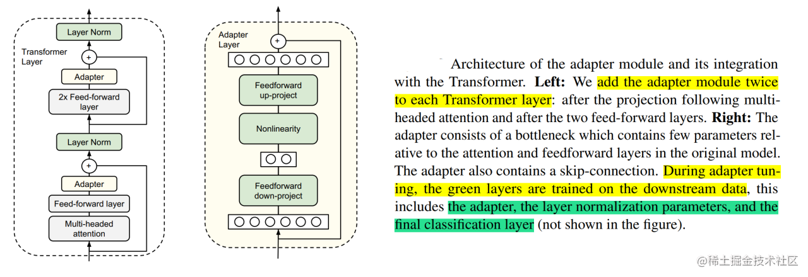
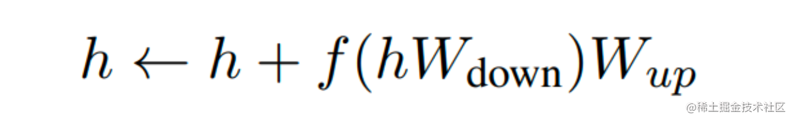
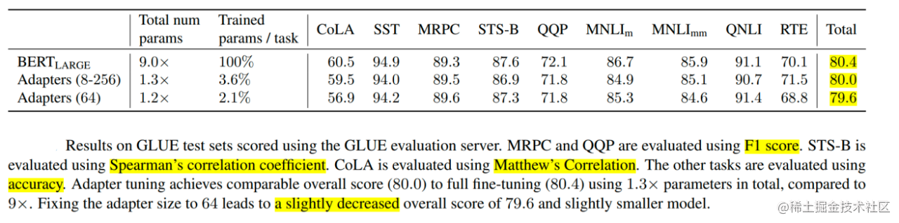
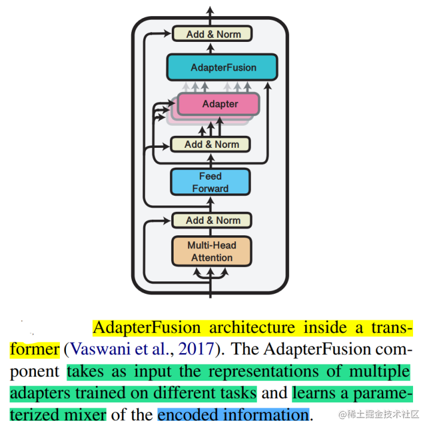
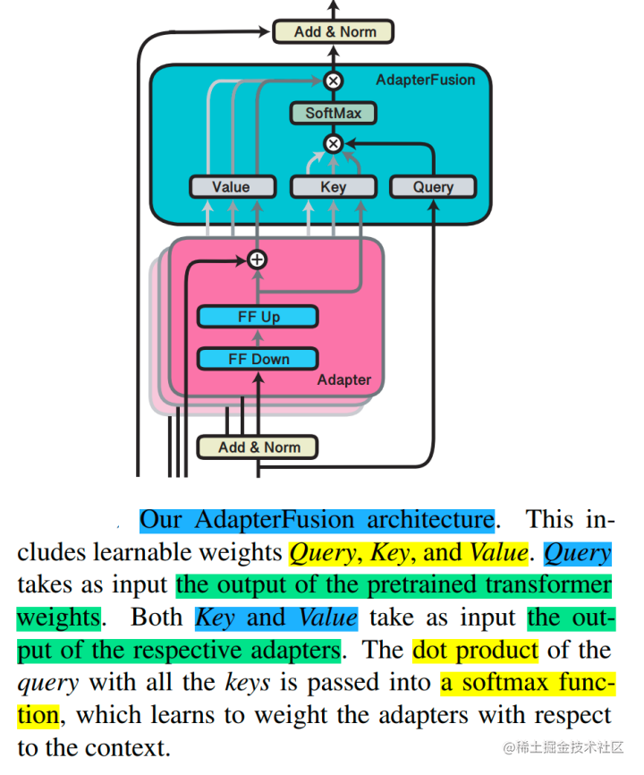
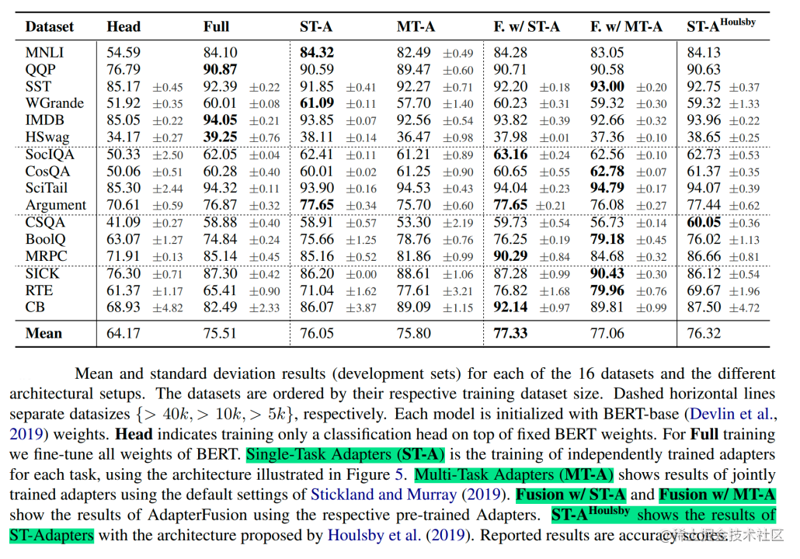
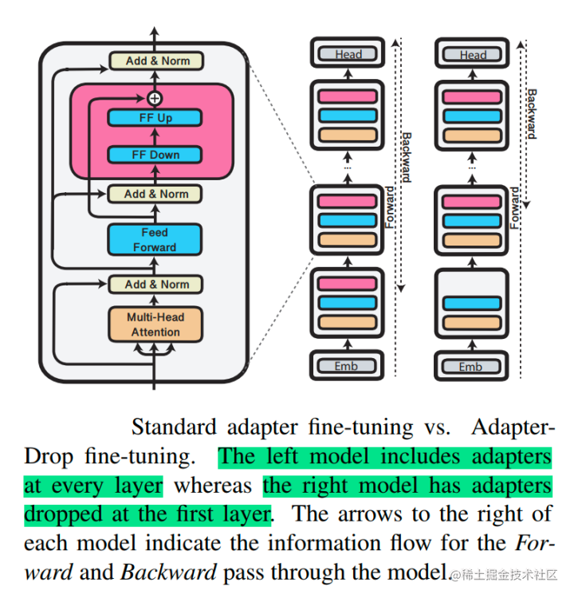
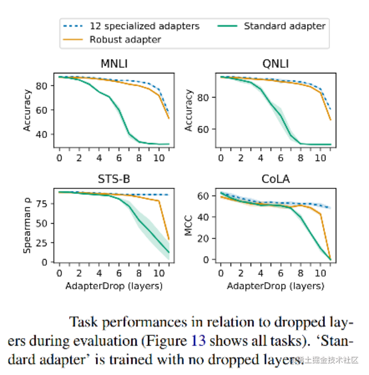
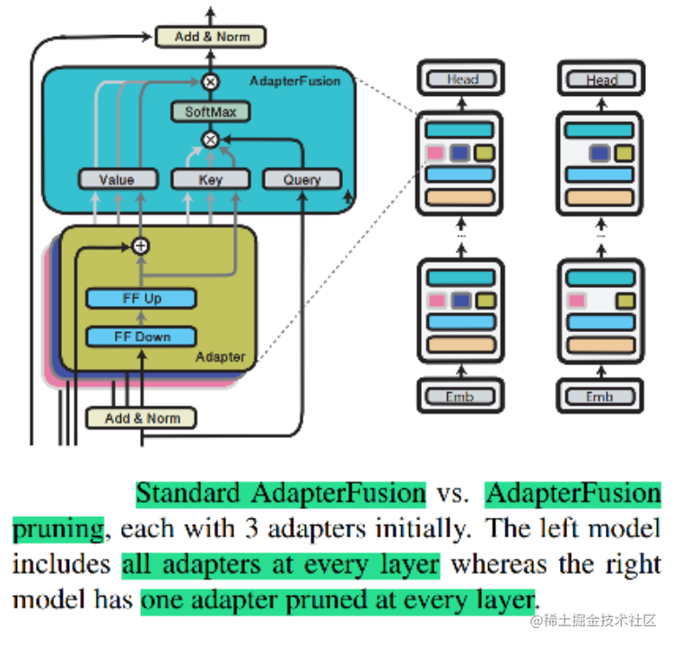
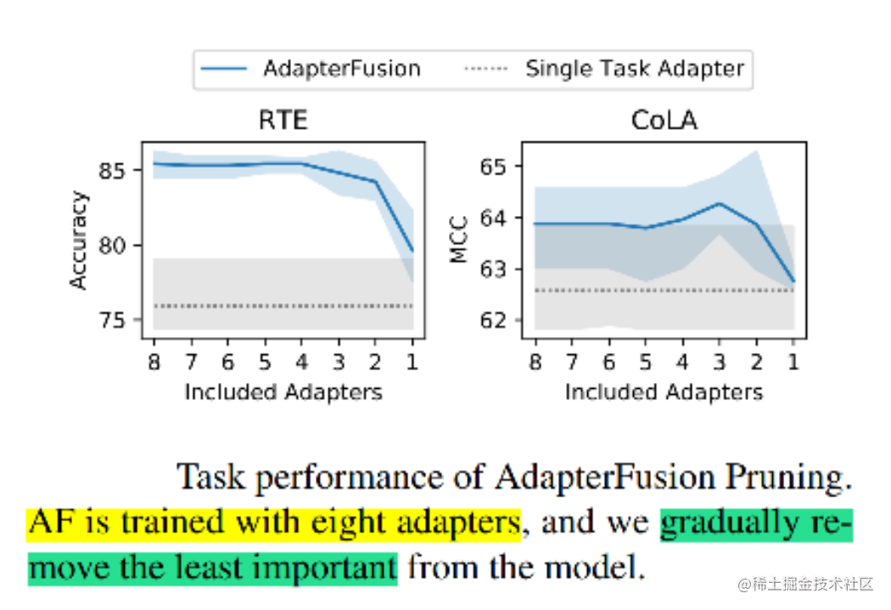

# 大模型参数高效微调技术原理综述（四）-Adapter Tuning及其变体

## **Adapter Tuning**

### **背景**

随着计算机硬件性能的提高，预训练模型参数量越来越多，在训练下游任务时进行全量微调变得昂贵且耗时。

基于此，作者提出了Adapter Tuning，Adapter 的出现缓解了上述问题 Adapter 在预训练模型每层中插入用于下游任务的参数（针对每个下游任务，仅增加3.6%的参数），在微调时将模型主体冻结，仅训练特定于任务的参数，从而减少了训练时的算力开销。

### **技术原理**

Adapter Tuning（论文：**Parameter-Efficient Transfer Learning for NLP**），该方法设计了Adapter结构，并将其嵌入Transformer的结构里面，针对每一个Transformer层，增加了两个Adapter结构(分别是多头注意力的投影之后和第二个feed-forward层之后)，在训练时，固定住原来预训练模型的参数不变，只对新增的 Adapter 结构和 Layer Norm 层进行微调，从而保证了训练的高效性。

每当出现新的下游任务，通过添加Adapter模块来产生一个易于扩展的下游模型，从而避免全量微调与灾难性遗忘的问题。

image.png

**Adapter结构具体细节**：

每个 Adapter 模块主要由两个前馈（Feedforward）子层组成，第一个前馈子层（down-project）将Transformer块的输出作为输入，将原始输入维度d（高维特征）投影到m（低维特征），通过控制m的大小来限制Adapter模块的参数量，通常情况下，m<<d。然后，中间通过一个非线形层。在输出阶段，通过第二个前馈子层（up-project）还原输入维度，将m（低维特征）重新映射回d（原来的高维特征），作为Adapter模块的输出。同时，通过一个skip connection来将Adapter的输入重新加到最终的输出中去，这样可以保证，即便 Adapter 一开始的参数初始化接近0，Adapter也由于skip connection的设置而接近于一个恒等映射，从而确保训练的有效性。

image.png

通过实验发现，只训练少量参数的Adapter方法的效果可以媲美全量微调，这也验证了Adapter是一种高效的参数训练方法，可以快速将语言模型的能力迁移到下游任务中去。同时，可以看到，Adapter 最佳的中间层特征维度m视数据集的大小而异，如：MINI数据集为256，最小的RTE数据集为8。如果始终将维度限制在64，将导致平均准确率略微下降。

image.png

总之，Adapter通过引入0.5%～5%的模型参数可以达到不落后全量微调模型1%的性能。

## **[AdapterFusion](https://zhida.zhihu.com/search?content_id=229473397&content_type=Article&match_order=1&q=AdapterFusion&zhida_source=entity)**

### **背景**

为了整合来自多个任务的知识，传统的两个方法是按一定顺序微调（Sequential fine-tuning）或者多任务学习（multi-task learning）。前者的一大问题是需要先验知识来确定顺序，且模型容易遗忘之前任务学到的知识，后者的问题是不同的任务会互相影响，也难以平衡数据集大小差距很大的任务。

而之前的工作，Adapter Tuning的一个优势就是不用更新预训练模型的参数，而是插入比较少的新的参数就可以很好地学会一个任务。此时，Adapter 的参数某种程度上就表达了解决这个任务需要的知识。

作者受此启发，如果想要把来自多个任务的知识结合起来，是否可以考虑把多个任务的Adapter的参数结合起来？基于此，作者提出了 AdapterFusion，这是一种新的两阶段学习算法，可以利用来自多个任务的知识。

### **技术原理**

Adapter Fusion（论文：**AdapterFusion:Non-Destructive Task Composition for Transfer Learning**），一种融合多任务信息的Adapter的变体，在 Adapter 的基础上进行优化，通过将学习过程分为两阶段来提升下游任务表现。

- 知识提取阶段：在不同任务下引入各自的Adapter模块，用于学习特定任务的信息。
- 知识组合阶段：将预训练模型参数与特定于任务的Adapter参数固定，引入新参数（AdapterFusion）来学习组合多个Adapter中的知识，以提高模型在目标任务中的表现。

image.png

对于第一阶段，有两种训练方式，分别如下：

- Single-Task Adapters(ST-A)：对于N个任务，模型都分别独立进行优化，各个任务之间互不干扰，互不影响。
- Multi-Task Adapters(MT-A)：N个任务通过多任务学习的方式，进行联合优化。

对于第二阶段，为了避免通过引入特定任务参数而带来的灾难性遗忘问题，AdapterFusion提出了一个共享多任务信息的结构。针对特定任务m，AdapterFusion联合了第一阶段训练得到的N个Adapter信息。固定语言模型的参数跟N个Adapter的参数，新引入AdapterFusion的参数，目标函数也是学习针对特定任务m的AdapterFusion的参数。

**AdapterFusion结构**：

AdapterFusion具体结构就是一个Attention，它的参数包括query，key, value的矩阵参数，在transformer的每一层都存在，它的query是transformer每个子模块的输出结果，它的key跟value则是N个任务的adapter的输出。通过AdapterFusion，模型可以为不同的任务对应的adapter分配不同的权重，聚合N个任务的信息，从而为特定任务输出更合适的结果。

image.png

通过对全量微调、Adapter Tuning、AdapterFusion这三种方法在各个数据集上进行对比实验可以看出，AdapterFusion在大多数情况下性能优于全模型微调和Adapter Tuning，特别在MRPC与RTE数据集中，性能显著优于另外两种方法。

同时，还可以看到第一阶段采用ST-A+第二阶段AdapterFusion是最有效的方法，在多个数据集上的平均效果达到了最佳。而第一阶段采用MT-A+第二阶段AdapterFusion没有取得最佳的效果，在于第一阶段其实已经联合了多个任务的信息了，所以AdapterFusion的作用没有那么明显，同时MT-A这种多任务联合训练的方式需要投入较多的成本，并不算一种高效的参数更新方式。另外，ST-A的方法在多个任务上都有提升，但是MT-A的方法则不然，这也表明了MT-A虽然可以学习到一个通用的表征，但是由于不同任务的差异性，很难保证在所有任务上都取得最优的效果。

image.png

总之，通过将适配器的训练分为知识提取和知识组合两部分，解决了灾难性遗忘、任务间干扰和训练不稳定的问题。但是，Adapter模块的添加也导致模型整体参数量的增加，降低了模型推理时的性能。

## **[AdapterDrop](https://zhida.zhihu.com/search?content_id=229473397&content_type=Article&match_order=1&q=AdapterDrop&zhida_source=entity)**

### **背景**

近年来Adapter已被证明可以很好地用于机器翻译、跨语言迁移、社区问答和迁移学习的任务组合。尽管它们最近很受欢迎，但Adapter的计算效率尚未在参数效率之外得到探索。

作者通过对Adapter的计算效率进行分析，发现与全量微调相比，Adapter在训练时快60%，但是在推理时慢4%-6%。

基于此，作者提出了AdapterDrop方法缓解该问题。

### **技术原理**

AdapterDrop（论文：AdapterDrop: On the Efficiency of Adapters in Transformers），在不影响任务性能的情况下，对Adapter动态高效的移除，尽可能的减少模型的参数量，提高模型在反向传播（训练）和正向传播（推理）时的效率。

image.png

实验表明，从较低的 Transformer 层中删除Adapter可以显着提高多任务设置中的推理速度。 例如，将前五个Transformer层中的Adapter丢弃，在对 8 个任务进行推理时，速度提高了 39%。并且即使有多个丢弃层，AdapterDrop 也能保持良好的结果。

image.png

除此之外，作者还研究了对 AdapterFusion中的Adapter进行剪枝后的效果。

通过实验表明可以移除 AdapterFusion 中的大多数Adapter而不影响任务性能。使用剩余的两个Adapter，实现了与具有八个Adapter的完整 AdapterFusion 模型相当的结果，并将推理速度提高了 68%。

因此，作者建议在实际部署这些模型之前执行 AdaperFusion 剪枝。 这是一种简单而有效的技术，即使在完全保持性能的情况下也能实现效率提升。

总之，AdapterDrop 通过从较低的 Transformer 层删除可变数量的Adaper来提升推理速度。 当对多个任务执行推理时，动态地减少了运行时的计算开销，并在很大程度上保持了任务性能。