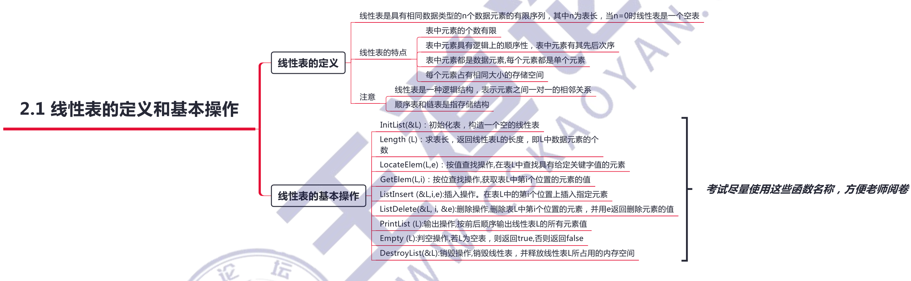
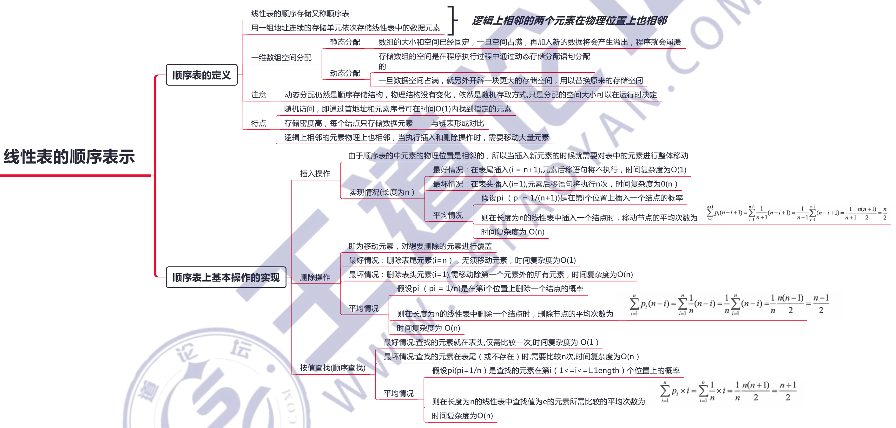
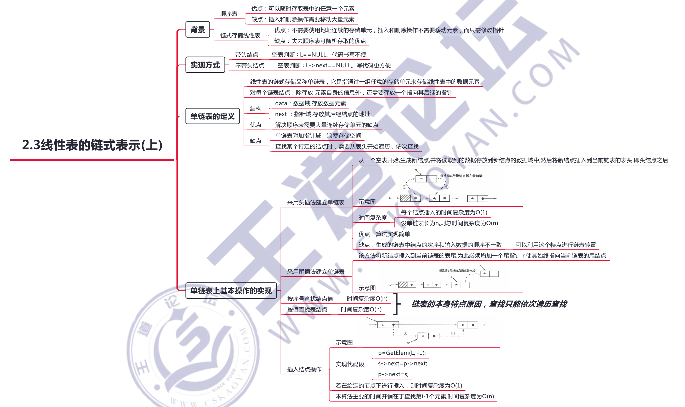

# 线性表

## 一、线性表的定义和基本操作



## 二、线性表的顺序表示（数组）



### 1、环形数组

#### 1）任意位置为起点，循环遍历

例题：[134. 加油站](https://leetcode-cn.com/problems/gas-station/)

使用 `i = (i + 1) % n;` 模拟跑一圈的过程

```c++
class Solution {
public:
    int canCompleteCircuit(vector<int>& gas, vector<int>& cost) {
        int n = gas.size();
        for (int start = 0; start < n; start++) {
            int residual = 0;  // 到达 i 点时剩余的汽油（还没在 i 点加油）
            int i = start;
            int cnt = 0;  // 遇见起点的次数
            while (true) {
                if (i == start) cnt++;
                if (cnt == 2) break;      // 第二次遇见时跳出循环
                residual += gas[i];       // 在 i 点加油
                residual -= cost[i];      // 从 i 点开到 i+1 点剩下的油
                if (residual < 0) break;  // 开到下个位置后，检查下剩余油量
                i = (i + 1) % n;          // i 更新为下一个位置
            }
            // 跳出循环时，可能中途跳出，也可能第一个位置就不满足，所以还要判别下 cnt == 2
            if (i == start && cnt == 2) return start;
        }
        return -1;
    }
};
```

#### 2）尾首拼接（断环成链）

例题：[2134. 最少交换次数来组合所有的 1 II](https://leetcode-cn.com/problems/minimum-swaps-to-group-all-1s-together-ii/)

如何处理环状数组: 将num再拼接一次，断环成链

```c++
int n = nums.size();
for (int i = 0; i < n; i++) {
    nums.push_back(nums[i]);
}
```

## 三、线性表的链式表示（链表）




### 1、做题技巧

#### 技巧一：哨兵节点

链表的题目涉及到插入及删除节点的，一般都可以引入一个哨兵节点便于统一处理

`dummy` 和 `cur` 指向原头节点的前一个，所以后面要返回 `dummy->next`

```c++
ListNode *dummy = new ListNode(0, head);
ListNode *cur = dummy;
```

或 :)

```c++
ListNode *hair = new ListNode(0, head);
ListNode *cur = hair;
```

#### 技巧二：纸上画链表

遇到想不清的，直接在纸上画出链表，标注出那些指针，模拟指针的移动

#### 技巧三：舍得用变量

舍得用变量，千万别想着节省变量，否则容易被逻辑绕晕

#### 技巧四：在遍历的过程中 new 个新节点拼接

链表题，好的解法一般都会用 `o(1)` 的空间复杂度完成，即一般不会在遍历的过程中 new 一个新节点拼接。

但是有时候为了方便得到答案，不得已而为之。

#### 技巧五：破釜沉舟

实在是不会做的题，先把链表的值全部取出来放入列表中，

然后按照列表题做，最后把处理好的列表恢复成链表，返回。


注意：当要终结一个链表的时候，记得尾部接上空指针 `node->next = nullptr;`

### 2、环形链表

参照双指针中，[环的相应算法](../2-算法基础/3-双指针.md)