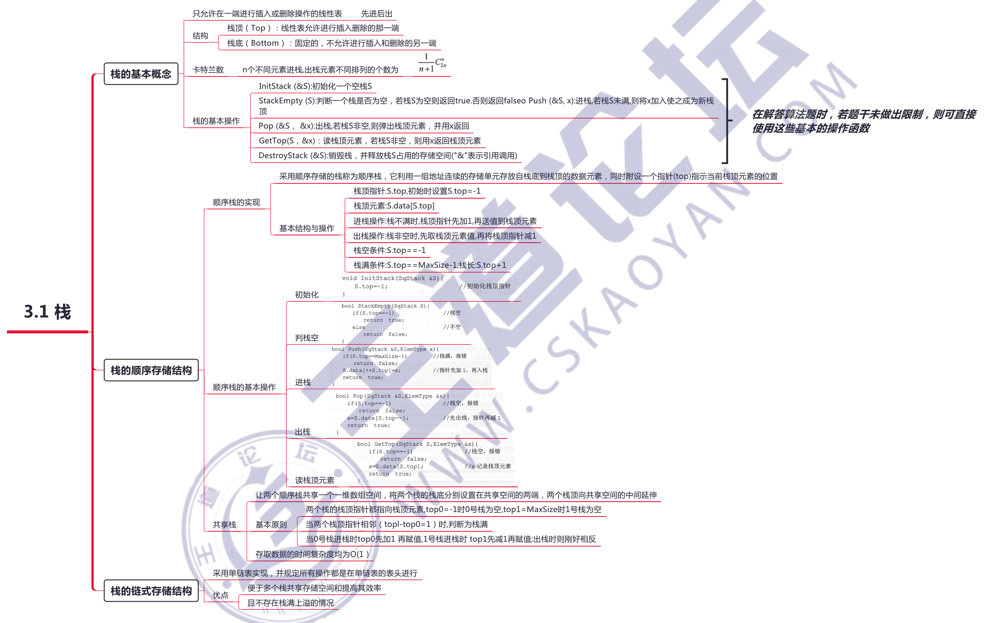
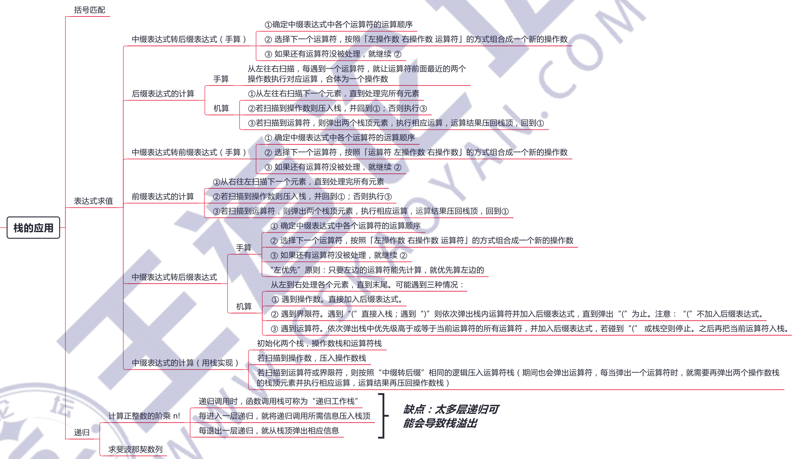
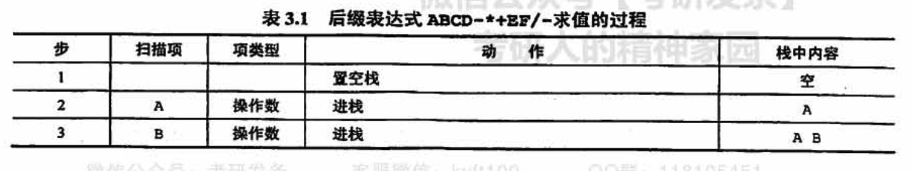
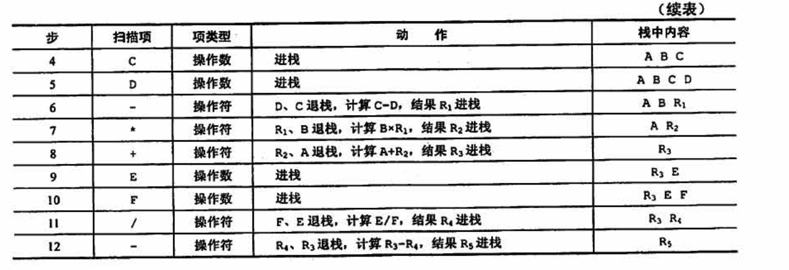

# 栈（stack）

## 一、概念



栈中存储的元素满足“后进先出（简称LIFO）”的准则。

stack 每次只能访问适配器中位于最顶端的元素，也只有移除 stack 顶部的元素之后，才能访问位于栈中的元素。

## 二、单调栈

参考：[单调栈和应用实践](https://www.jianshu.com/p/6bbd3653a57f)

单调栈分为「单调递增栈」和「单调递减栈」，特性是栈内的顺序与原数组的顺序一样

单增、单减描述的是从「栈顶至栈底」的大小变化，例如 [1,2,3,4,5] 为单调递减栈，[5,4,3,2,1] 为单调递增栈

如下图，分别插入6,10,3,7,4,12的时候，单调递增栈和单调递减栈的情况分别是样子的


应用：

- 单调递增栈：表示如栈元素左边第一个比它「大」的元素
- 单调递减栈：表示如栈元素左边第一个比它「小」的元素

以单调递减栈为例（栈内元素从左到右是）：

- 如果新的元素比栈顶元素大，就入栈
- 如果新的元素较小，那就一直把栈内元素弹出来，直到栈顶比新元素小，然后新元素入栈

**模版**

```c++
stack<int> st;
for(int i = 0; i < nums.size(); i++)
{
	while(!st.empty() && nums[i] < st.top())
	{
		st.pop();
	}
	st.push(nums[i]);
}
```

一般会使用加入前后哨兵的模版，有几个细节

- 在缓存数据的时候，是从左向右缓存的，
- 计算出一个结果的顺序是从右向左的（while中），并且计算完成以后我们就不再需要了，符合后进先出的特点

```c++
nums.insert(nums.begin(), 0);  // 第一个元素为添0，可以避免栈为空的情况，下面的while不用判断 !st.empty()，0可看作是所有元素中最小的值
nums.push_back(0);             // 最后一个元素添0，是为了触发最后一个单调栈开始收缩
vector<int> st = {0};          // 第一个元素0，先入栈，是为了while里面的 st.back() 第一次能取到值
for (int i = 1; i < nums.size(); i++) {
    // 此时i指向新元素，当新元素小于此时的栈顶（i-1）时，单调栈开始收缩，
    // 第一个老栈顶肯定为i-1，也是最初栈里面的最高点，否则不符合逻辑
    while (nums[i] < nums[st.back()]) {
        int curHeight = nums[st.back()];
        st.pop_back();
    }
    st.push_back(i);
}

```

## 三、应用



### 1、括号匹配

假设表达式中允许包含两种括号：圆括号和方括号，其嵌套的顺序任意即(()[])或[([])]等均为正确的格式，([)]或([())或(()]均为不正确的格式。

**算法的思想**:

- 初始设置一个空栈，顺序读入括号
- 若是右括号，使置于栈顶的最急迫期待得以消解，或者是不合法的情况（括号序列不匹配），退出程序
- 若是左括号，则作为一个新的更急迫的期待压入栈中，自然使原有的在栈中的所有末消解的期待的急迫性降了一级。
- 算法结束时，栈为空，否则括号序列不匹配。

### 2、表达式求值

表达式求值是程序设计语言编译中一个最基本的问题，它的实现是栈应用的一个典型范例。

中缀表达式不仅依赖运算符的优先级，而且还要处理括号。

后缀表达式的运算符在操作数后面，在后缀表达式中己考虑了运算符的优先级，没有括号，只有操作数和运算符。

中缀表达式 `A + B * (C - D) - E / F` 所对应的后级表达式为 `ABCD-*+EF/-`





### 3、栈在递归中的应用

递归是一种重要的程序设计方法。简单地说，若在一个函数、过程或数据结构的定义中又应用了它自身，则这个函数、过程或数据结构称为是递归定义的，简称递归。

它通常把一个大型的复杂问题层层转化为一个与原问题相似的规模较小的问题来求解，递归策略只需少量的代码就可以描述出解题过程所需要的多次重复计算，**大大减少了程序的代码量**。但在通常情况下，它的**效率并不是太高**。

其必须满足下面的两个条件：

- 递归表达式（递归体）
- 边界条件（递归出口）

**递归的精髓在于能否将原始问题转换为属性相同但规模较小的问题**

在递归调用的过程中，**系统为每一层的返回点、局部变量、传入实参等开辟了递归工作栈来进行数据存储**，递归次数过多容易造成栈滥出等。而其效率不高的原因是递归调用过程中**包含很多重复的计算**。

### 4、移除问题-单调栈

移出 k 个元素，使剩下的数组最大/最小

核心思路是：对于两个数 `1 2 3 a _ _ _` 和 `1 2 3 b _ _ _`

- 如果 a > b， 那么 `123a___` 大于 `123b___`
- 否则，那么 `123a___` 小于等于 `123b___`

**两个「相同位数」的数字大小关系取决于「第一个不同」的数的大小**

[402. 移掉 K 位数字](https://leetcode-cn.com/problems/remove-k-digits/) (中等)

[321. 拼接最大数](https://leetcode-cn.com/problems/create-maximum-number/) (困难)

[316. 去除重复字母](https://leetcode-cn.com/problems/remove-duplicate-letters/) (困难)

[1081. 不同字符的最小子序列](https://leetcode-cn.com/problems/smallest-subsequence-of-distinct-characters/) （中等）
