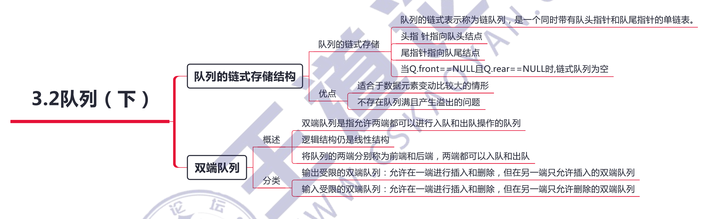

# 队列（queue）

## 一、概念

## 二、单调队列

**获取最小值，使用「单增队列」**

- 添加元素时，与「队尾」元素相比较，比元素值大的值去掉，然后在「队尾」添加元素。「队首」可获取到最小值
- 删除元素时，与「队首」元素相比较，与「队首」元素相等时删除

例如 1 2 3，往里面添加 2，先去掉 3，再添加 2，最后为 1 2 2

**获取最大值，使用「单减队列」**

- 添加元素时，与「队尾」元素相比较，比元素值小的值去掉，然后在「队尾」添加元素。「队首」可获取到最大值
- 删除元素时，与「队首」元素相比较，与「队首」元素相等时删除

例如 3 2 1，往里面添加 2，先去掉 1，再添加 2，最后为 3 2 2

## 三、应用

### 1、层次遍历

在信息处理中有一大类问题需要逐层或逐行处理。这类问题的解决方法往往是**在处理当前层或当前行时就对下一层或下一行做预处理**，把处理顺序安排好，等到当前层或当前行处理完毕，就可以处理下一层或下一行。

使用队列是为了保存下一步的处理顺序。

### 2、队列在计算机系统中的应用

队列在计算机系统中的应用非常广泛，以下仅从两个方面来简述队列在计算机系统中的作用：

- 解决主机与外部设备之间速度不匹配的问题
- 解决由多用户引起的资源竞争问题

对于第一个方面，仅以主机和打印机之间速度不匹配的问题为例做简要说明。主机输出数据给打印机打印，输出数据的速度比打印数据的速度要快得多，由于速度不匹配，若直接把输出的数据送给打印机打印显然是不行的。解决的方法是设置一个打印数据缓冲区，主机把要打印输出的数据依次写入这个缓冲区，写满后就暂停输出，转去做其他的事情。打印机就从缓冲区中按照「先进先出」的原则依次取出数据并打印，打印完后再向主机发出请求。主机接到请求后再向缓冲区写入打印数据。这样做既保证了打印数据的正确，又使主机提高了效率。由此可见，打印数据缓冲区中所存储的数据就是一个队列。

对于第二个方面，CPU（即中央处理器，它包括运算器和控制器）资源的竞争就是一个典型的例子。在一个带有多终端的计算机系统上，有多个用户需要 CPU 各自运行自己的程序，它们分别通过各自的终端向操作系统提出占用CPU 的请求。操作系统通常按照每个请求在时间上的先后顺序，把它们排成一个队列，每次把 CPU 分配给队首请求的用户使用。当相应的程序运行结束或用完规定的时间间隔后，令其出队，再把CPU 分配给新的队首请求的用户使用。这样既能满足每个用户的请求，又使 CPU 能够正常运行.

