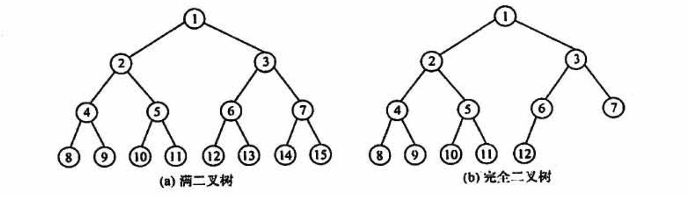
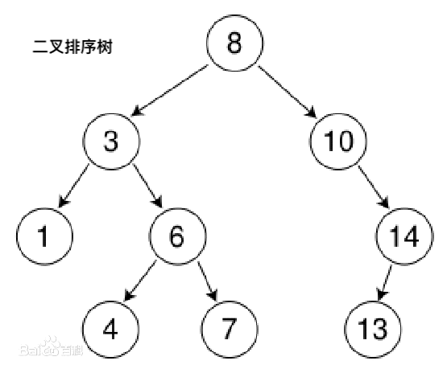
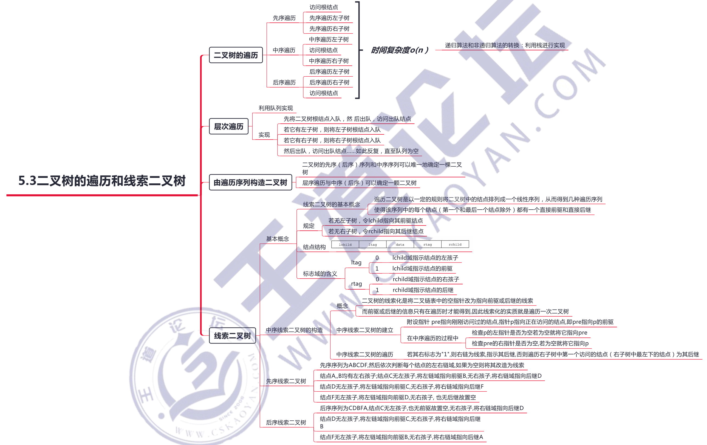
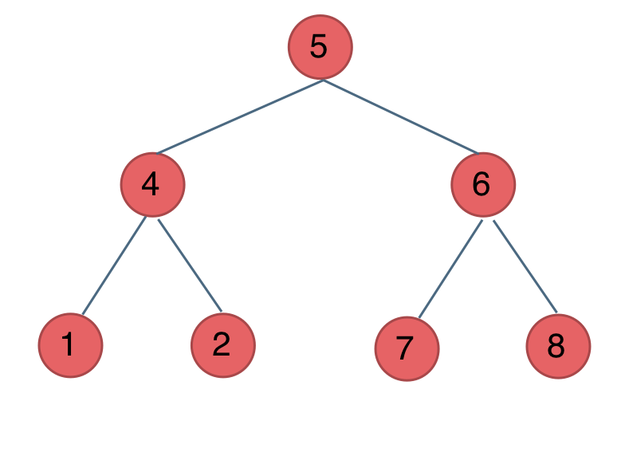
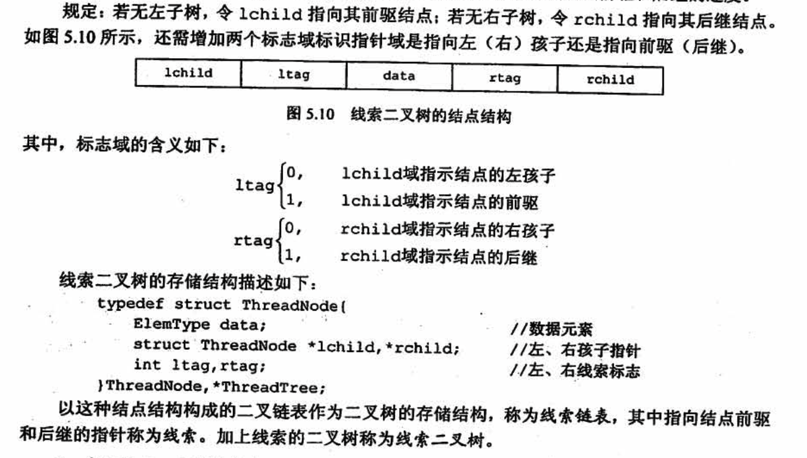
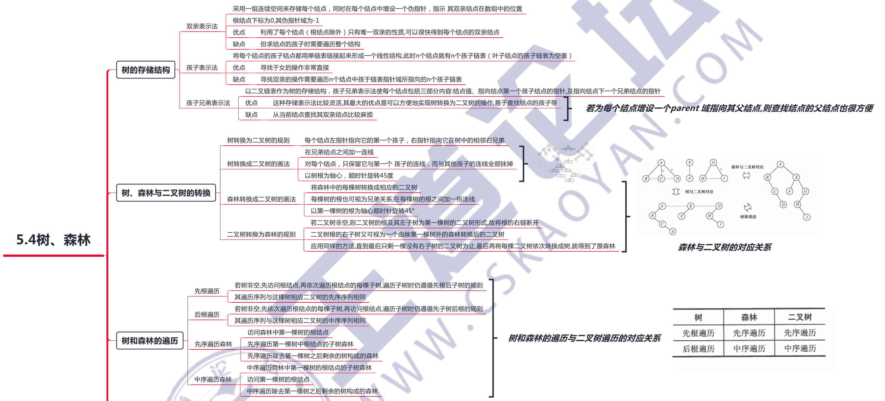
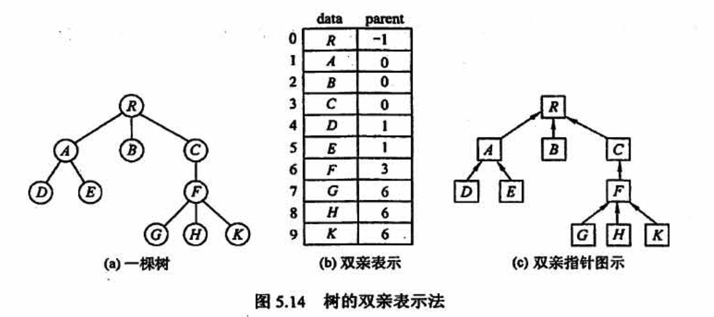

# 树和二叉树

## 一、树的基本概念


### 树的种类

- 有序树，树中结点的各子树从左到右是有次序的，不能互换
- 无序树，结点的各子树无序的
- 二叉树，每个结点最多有两个子树
- 满二叉树，树中的每层都有最多的结点，叶子结点都在最下层
- 完全二叉树，高度为h、有n个结点的二叉树，当且仅当其每个结点都与高度为h的满二叉树中编号为1～n的结点一一对应（相当于满二叉树从右下角开始，从右往左，从下往上，进行消退）
- 二叉排序树，左子树上所有结点的关键字均小于根结点的关键字：右子树上的所有结点的关键字均大于根结点的关键字；左子树和右子树又各是一棵二叉排序树
- 平衡二叉树（AVL树），树上任一结点的左子树和右子树的深度之差不超过 1
- 线索二叉树，利用结点中的空指针存储该结点的前驱和后继







## 二、二叉树

### 1、二叉树的概念




### 2、二叉树的遍历



- 前序遍历（中左右）：5 4 1 2 6 7 8
- 中序遍历（左中右）：1 4 2 5 7 6 8
- 后序遍历（左右中）：1 2 4 7 8 6 5
- 层序遍历：5 4 6 1 2 7 8

#### 1）前序遍历

```c++
class Solution {
public:
    void dfs(TreeNode *cur, vector<int> &vec) {
        if (cur == NULL) return;
        vec.push_back(cur->val);  // 中
        dfs(cur->left, vec);      // 左
        dfs(cur->right, vec);     // 右
    }
    vector<int> preorderTraversal(TreeNode *root) {
        vector<int> res;
        dfs(root, res);
        return res;
    }
};
```

#### 2）中序遍历

```c++
class Solution {
public:
    void dfs(TreeNode *cur, vector<int> &vec) {
        if (cur == NULL) return;
        dfs(cur->left, vec);
        vec.push_back(cur->val);
        dfs(cur->right, vec);
    }

    vector<int> inorderTraversal(TreeNode *root) {
        vector<int> res;
        dfs(root, res);
        return res;
    }
};
```

#### 3）后序遍历

```c++
class Solution {
public:
    void dfs(TreeNode *cur, vector<int> &vec) {
        if (cur == NULL) return;
        dfs(cur->left, vec);
        dfs(cur->right, vec);
        vec.push_back(cur->val);
    }

    vector<int> postorderTraversal(TreeNode *root) {
        vector<int> res;
        dfs(root, res);
        return res;
    }
};
```

#### 4）层序遍历

每一层放入一个 vector 写法，如：[[3],[9,20],[15,7]]

```c++
class Solution {
public:
    vector<vector<int>> levelOrder(TreeNode *root) {
        vector<vector<int>> res;
        if (!root) return res;

        queue<TreeNode *> q;
        q.push(root);
        while (!q.empty()) {
            int layerSz = q.size();
            vector<int> layer;
            for (int i = 0; i < layerSz; i++) {
                auto node = q.front();
                q.pop();
                layer.push_back(node->val);
                if (node->left) q.push(node->left);
                if (node->right) q.push(node->right);
            }
            res.push_back(layer);
        }
        return res;
    }
};
```

全部放一起，如：[3 9 20 15 7 ]

```c++
class Solution {
public:
    vector<vector<int>> levelOrder(TreeNode *root) {
        vector<int> res;
        queue<TreeNode *> q;
        q.push(root);
        while (!q.empty()) {
            auto node = q.front();
            q.pop();
            res.push_back(node->val);
            if (node->left) q.push(node->left);
            if (node->right) q.push(node->right);
        }
        for (const auto &c : res) cout << c << " ";
        return res;
    }
};
```

### 3、二叉树的构造

#### 由遍历序列构造二叉树

**由二叉树的先序序列和中序序列可以唯一地确定一棵二叉树**

在先序遍历序列中，第一个结点一定是二叉树的根结点：而在中序遍历中，根结点必然将中序序列分割成两个子序列，前一个子序列是根结点的左子树的中序序列，后一个子序列是根结点的右子树的中序序列。根据这两个子序列，在先序序列中找到对应的左子序列和右子序列。在先序序列中，左子序列的第一个结点是左子树的根结点，右子序列的第一个结点是右子树的根结点。如此递归地进行下去，便能唯一地确定这棵二叉树。

同理，**由二叉树的后序序列和中序序列也可以唯一地确定一棵二叉树**

因为后序序列的最后一个结点就如同先序序列的第一个结点，可以将中序序列分割成两个子序列，然后采用类似的方法递归地进行划分，进而得到一株二叉树。

由二叉树的**层序序列和中序序列也可以唯一地确定一棵二叉树**，实现方法留给读者思考。需要注意的是，若**只知道二叉树的先序序列和后序序列，则无法唯一确定一棵二叉树**。

#### [105. 从前序与中序遍历序列构造二叉树](https://leetcode-cn.com/problems/construct-binary-tree-from-preorder-and-inorder-traversal/)

1、题目告诉我们没有重复的元素，才可以用 inorderIdx 记录其中节点的index

2、Input: preorder = [3,9,20,15,7], inorder = [9,3,15,20,7]

 	如果输入中有 None 来标记没有节点了，那么就可以通过一个前序就能恢复

```python
class Solution:
    def buildTree(self, preorder: List[int], inorder: List[int]) -> TreeNode:
        # 先序遍历的顺序是根节点，左子树，右子树。中序遍历的顺序是左子树，根节点，右子树。
        # 所以我们只需要根据先序遍历得到根节点，然后在中序遍历中找到根节点的位置，它的左边就是左子树的节点，右边就是右子树的节点。
        # 生成左子树和右子树就可以递归的进行了。
        inorderIdx = collections.defaultdict(int)
        for i, v in enumerate(inorder):
            inorderIdx[v] = i

        def dfs(preStart, preEnd, inStart, inEnd):
            # preStart  指向前序的起点
            # preEnd    指向前序的终点
            # inStart   指向中序的起点
            # inEnd     指向中序的终点
            if preStart > preEnd or inStart > inEnd:
                return None

            root_val = preorder[preStart]
            root_in_idx = inorderIdx[root_val]
            left_size = root_in_idx - inStart

            node = TreeNode(root_val)
            node.left = dfs(preStart+1, preStart+left_size, inStart, root_in_idx-1)
            node.right = dfs(preStart+left_size+1, preEnd, root_in_idx+1, inEnd)
            # 左子树：前序起点+1            前序起点+左子树宽度 中序起点    节点中序-1
            # 右子树：前序起点+左子树宽度+1 前序终点            节点中序+1  中序终点
            # 辅助记忆
            # 前序：节点 + 前序起点+1 -> 前序起点+左子树宽度 -> 前序起点+左子树宽度+1 -> 前序终点
            # 中序：中序起点 -> 节点中序-1 + 节点 + 节点中序+1 -> 中序终点
            
            return node

        return dfs(0, len(preorder) - 1, 0, len(inorder) - 1)
```

#### [106. 从中序与后序遍历序列构造二叉树](https://leetcode-cn.com/problems/construct-binary-tree-from-inorder-and-postorder-traversal/)

与上题同理

```python
class Solution:
    def buildTree(self, inorder: List[int], postorder: List[int]) -> TreeNode:

        node_in_idx = collections.defaultdict(int)
        for i, v in enumerate(inorder):
            node_in_idx[v] = i

        def dfs(postStart, postEnd, inStart, inEnd):
            if postStart > postEnd or inStart > inEnd:
                return None
            
            node_val = postorder[postEnd]
            node_idx = node_in_idx[node_val]
            left_size = node_idx - inStart

            node = TreeNode(node_val)
            node.left = dfs(postStart, postStart+left_size-1, inStart, node_idx-1)
            node.right = dfs(postStart+left_size, postEnd-1, node_idx+1, inEnd)
            return node
        
        return dfs(0, len(postorder)-1, 0, len(inorder)-1)
```

#### [449. 序列化和反序列化二叉搜索树](https://leetcode-cn.com/problems/serialize-and-deserialize-bst/)

方法一：此题中元素的值是有重复的，但是它是个搜索树，所以也可以用 inOrderIdx 记录节点的index（此想法不一定对）

方法二：或者**在序列化时候，将没有的节点用 None 来记录**，就可以用同样的排序（只用一个前序）恢复为树，还可以有效避免元素的值重复，强烈建议用方法二

题解：https://leetcode-cn.com/problems/serialize-and-deserialize-bst/solution/xu-lie-hua-he-fan-xu-lie-hua-er-cha-sou-0fq67/

```python
# 方法一 76 ms 19.7 MB
class Codec:

    def serialize(self, root: TreeNode) -> str:
        """Encodes a tree to a single string.
        """
        # https://oi-wiki.org/ds/bst/
        # 搜索二叉树的中序排列时从小到大的
        # 返回前序排列，解码时将前序排列排个序，就是中序排列
        def dfs(node):
            if not node:
                return
            preOrder.append(node.val)
            dfs(node.left)
            dfs(node.right)

        preOrder = []
        dfs(root)
        return ",".join(map(str, preOrder))
        
    def deserialize(self, data: str) -> TreeNode:
        """Decodes your encoded data to tree.
        """
        # 从前序排列，根据二叉搜索树特性得出中序排列
        if data == "":
            return None
        preOrder = [int(x) for x in data.split(",")]
        inOrder = sorted(preOrder)
        
        # 如果节点的数值有重复的，就不能用下面的方法记录位置了，而是在每次遍历的过程中找
        inOrderIdx = collections.defaultdict(int)
        for i, v in enumerate(inOrder):
            inOrderIdx[v] = i

        def dfs(preStart, preEnd, inStart, inEnd):
            if preStart > preEnd or inStart > inEnd:
                return None
            
            node_val = preOrder[preStart]
            # node_in_idx = inStart
            # while inOrder[node_in_idx] != node_val:
            #     node_in_idx += 1
            node_in_idx = inOrderIdx[node_val]

            left_size = node_in_idx - inStart

            node = TreeNode(node_val)
            node.left = dfs(preStart+1, preStart+left_size, inStart, node_in_idx-1)
            node.right = dfs(preStart+left_size+1, preEnd, node_in_idx+1, inEnd)
            return node

        return dfs(0, len(preOrder)-1, 0, len(inOrder)-1)
```

```python
# 方法二 72 ms 19.6 MB
class Codec:

    def serialize(self, root: TreeNode) -> str:
        """Encodes a tree to a single string.
        """
        def dfs(node):
            if not node:
                preOrder.append("None")
                return
            preOrder.append(str(node.val))
            dfs(node.left)
            dfs(node.right)
        
        preOrder = []
        dfs(root)
        return ",".join(preOrder)
        

    def deserialize(self, data: str) -> TreeNode:
        """Decodes your encoded data to tree.
        """
        if data == "":
            return None
        # 强烈建议，这里不要用 [] (580 ms 19.9 MB),要用 collections.deque (72 ms 19.6 MB)
        preOrder = collections.deque([i for i in data.split(",")])
        def dfs(preOrder):
            node_val = preOrder.popleft()
            if node_val == "None":
                return None
            node = TreeNode(int(node_val))
            node.left = dfs(preOrder)
            node.right = dfs(preOrder)
            return node
        return dfs(preOrder)
```

#### [297. 二叉树的序列化与反序列化](https://leetcode-cn.com/problems/serialize-and-deserialize-binary-tree/)

dfs 用同样的方法攻破 104 ms 19.6 MB 时间复杂度为 O(n) 空间复杂度为 O(n)

```python
class Codec:

    def serialize(self, root):
        """Encodes a tree to a single string.
        
        :type root: TreeNode
        :rtype: str
        """
        def dfs(node):
            if not node:
                inOrder.append("None")
                return 
            inOrder.append(str(node.val))
            dfs(node.left)
            dfs(node.right)

        inOrder = collections.deque()
        dfs(root)
        return ",".join(inOrder)

    def deserialize(self, data):
        """Decodes your encoded data to tree.
        
        :type data: str
        :rtype: TreeNode
        """
        if data == "":
            return None
        
        def dfs():
            node_val = inOrder.popleft()
            if node_val == "None":
                return
            node = TreeNode(node_val)
            node.left = dfs()
            node.right = dfs()
            return node

        inOrder = collections.deque([i for i in data.split(",")])
        return dfs()
```

bfs: 100 ms 19.7 MB 时间复杂度为 O(n) 空间复杂度为 O(n)

```python
class Codec:

    def serialize(self, root):
        """Encodes a tree to a single string.
        
        :type root: TreeNode
        :rtype: str
        """
        if not root:
            return ""
        layerOrder = []
        queue = collections.deque()
        queue.append(root)

        while queue:
            node = queue.popleft()
            if node:
                queue.append(node.left)
                queue.append(node.right)
                layerOrder.append(str(node.val))
            else:
                layerOrder.append("None")
        print(",".join(layerOrder))
        return ",".join(layerOrder)
        
    def deserialize(self, data):
        """Decodes your encoded data to tree.
        
        :type data: str
        :rtype: TreeNode
        """
        if data == "":
            return None
            
        layerOrder = [i for i in data.split(",")]
        queue = collections.deque()

        root = TreeNode(layerOrder[0])
        queue.append(root)
        idx = 1
        while queue:
            node = queue.popleft()
            if layerOrder[idx] != "None":
                node.left = TreeNode(int(layerOrder[idx]))
                queue.append(node.left)
            idx += 1
            if layerOrder[idx] != "None":
                node.right = TreeNode(int(layerOrder[idx]))
                queue.append(node.right)
            idx += 1
        return root
```

### 4、线索二叉树

遍历二叉树是以一定的规则将二叉树中的结点排列成一个线性序列，从而得到几种遍历序列，**使得该序列中的每个结点(第一个和最后一个结点除外）都有一个直接前驱和直接后继**。

传统的二叉链表存储仅能体现一种父子关系，不能直接得到结点在遍历中的前驱或后继。前面提到，在含n个结点的二叉树中，有n+1个空指针。这是因为每个叶结点（n0个）有2个空指针，每个度为1的结点（n1个）有1个空指针，度为2的结点有n2个，空指针总数为 `2*n0+n1`，又因为 `n0=n2+1`，所以空指针总数为 `n0+n1+n2+1=n+1`。

由此设想利用这些空指针来存放指向其前驱或后继的指针，这样就可以像**遍历单链表那样方便地遍历二叉树**。

引入线索二叉树正是为了**加快查找结点前驱和后继的速度**。



**可利用中序、前序、后序的方式构造线索二叉树**

数据结构-136页

## 三、树和森林



### 1、树的存储

**注意：区别树的顺序存储结构与二叉树的顺序存储结构**

在树的顺序存储结构中，数组下标代表结点的编号，下标中所存的内容指示了结点之间的关系。而在二叉树的顺序存储结构中，数组下标既代表了结点的编号，又指示了二叉树中各结,点之问的关系。当然，二叉树属于树，因此**二叉树都可以用树的存储结构来存储，但树却不都能用二叉树的存储结构来存储**。

#### 1）双亲表示法

这种存储方式**采用一组连续空间来存储每个结点，同时在每个结点中增设一个伪指针，指示其双亲结点在数组中的位置**。



该存储结构利用了每个结点（根结点除外）只有唯一双亲的性质，**可以很快得到每个结点的双亲结点**，但**求结点的孩子时需要遍历整个结构**。

#### 2）孩子表示法

孩子表示法是**将每个结点的孩子结点都用单链表链接起来**形成一个线性结构，此时n个结点就有n个孩子链表（叶子结点的孩子链表为空表）。

这种存储方式寻找子女的操作非常直接，而寻找双亲的操作需要遍历n个结点中孩子链表指针域所指向的n个孩子链表。


#### 3）孩子兄弟表示法

**孩子兄弟表示法又称二叉树表示法，即以二叉链表作为树的存储结构**。孩子兄弟表示法使每个结点包括三部分内容：结点值、指向结点第一个孩子结点的指针，及指向结点下一个兄弟结点的指针（沿此域可以找到结点的所有兄弟结点）


这种存储表示法比较灵活，其最大的优点是可以方便地实现树转换为二叉树的操作，易于查找结点的孩子等，但缺点是从当前结点查找其双亲结点比较麻烦。若为每个结点增设一个 parent 域指向其父结点，则查找结点的父结点也很方便。

### 2、树、森林和二叉树的转换

数据结构-162页

### 3、树和森林的遍历

数据结构-163页

