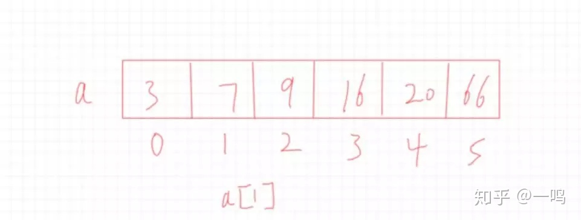
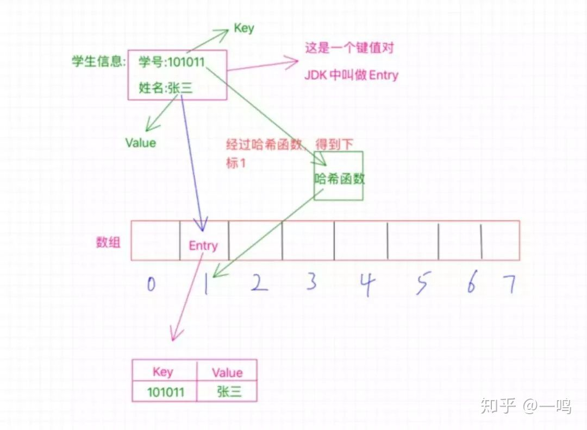
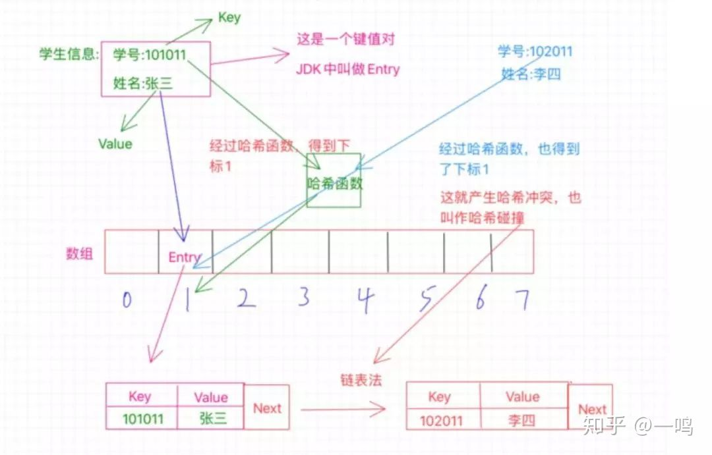
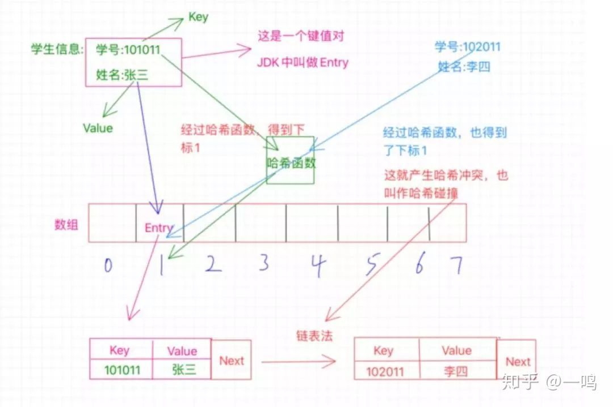

# 哈希表

参考 1：[哈希表是个啥？](https://zhuanlan.zhihu.com/p/95156642)

参考 2：[哈希表（散列表）详解](http://c.biancheng.net/view/3437.html)

参考 3：[百度百科-哈希表](https://baike.baidu.com/item/%E5%93%88%E5%B8%8C%E8%A1%A8/5981869?fr=aladdin)

## 一、概念

[散列表](https://baike.baidu.com/item/散列表/10027933)（Hash table，也叫哈希表），是根据关键码值(Key value)而直接进行访问的[数据结构](https://baike.baidu.com/item/数据结构/1450)。也就是说，它通过把关键码值映射到表中一个位置来访问记录，以加快查找的速度。这个映射函数叫做[散列函数](https://baike.baidu.com/item/散列函数/2366288)，存放记录的[数组](https://baike.baidu.com/item/数组/3794097)叫做[散列表](https://baike.baidu.com/item/散列表/10027933)。

**哈希表不存储哈希值**，哈希值是键的函数，是定类数据到定序数据的映射，**哈希值本身是地址数据**，也就是说，任何一个数据-键，都用散列函数将其转换为一个地址数据-哈希值。键值是哈希值指定的哈希表地址的存储数据。

### 1、哈希表其实本质上是一个「数组」

哈希表我们可以采用两种方法

1. 数组+链表
2. 数组+二叉树

无论哪个都是必须有数组啊，都是再数组的基础上取搞其他的，而且比如第一种数组+链表的形式，本质上是出现哈希冲突的一种解决办法，使用链表存放，所以综合起来叫做数组+链表的方式来实现一个哈希表，另外数组中一般就是存放的单一的数据，而哈希表中存放的是一个键值对，这是个区别

### 2、散列函数

例如，取姓名的首字母做一个排序，那么这是不是就是通过一些特定的方法去得到一个特定的值，比如这里取人名的首字母

那么如果是放到数学中，是不是就是类似一个函数似的，**给一个值，经过某些加工得到另外一个值**

那么这个函数或者是这个方法在哈希表中就叫做散列函数，其中规定的一些操作就叫做函数法则

### 3、关键值key

就像这个图，1是怎么得出来得，是不是根据未加工之前得101得出来得，这个加工过程其实就是个散列函数，而丢给它的这个101就是这个关键值啊，为啥叫它关键值嘞，那是因为我们要对它做加工才能得出我们想要的1啊，你说它关不关键

因此，哈希表就是通过将「关键值key」通过「散列函数」加工处理之后得到一个值，这个值就是「数据存放位置」，我们就可以根据这个「数据存放位置」快速的找到我们想要的数据

哈希表的本质其实是个数组，数组有啥特点：下标从0开始啊，连续的，直接通过下标访问

有一个数组a，我们可以直接通过a[1]的形式来访问到数值7，所以查询效率很高。

### 4、键值对和Entry

我们知道哈希表本质上是个数组，难道就跟数组的基本使用那样，存个数值，然后通过下表读取之类的嘛？

当然不是啦，**对于哈希表，它经常存放的是一些键值对的数据**，啥是键值对啊，就是我们经常说的key-value啊，简单点说就是一个值对应另外一个值，比如a对应b，那么a就是key，b是value，哈希表存放的就是这样的键值对。

在哈希表中是通过哈希函数将一个值映射到另外一个值的，所以在哈希表中，a映射到b，a就叫做键值，而b呢？就叫做a的哈希值，也就是hash值。

学生的学号和姓名就是一个键值对，根据这个学号就能找到这个学生的姓名

那啥是Entry嘞，我们都知道键值对，在很多语言中也许都有键值对，在jdk中可不能那么俗气，不能再叫键值对了，那就叫Entry，其实是一回事

### 5、哈希函数

哈希函数就是之前说的散列函数，叫散列表时为散列函数，叫哈希表时为哈希函数

常用的哈希函数的构造方法有 6 种：直接定址法、数字分析法、平方取中法、折叠法、除留余数法和随机数法

**哈希函数是核心**

如果一个哈希函数设计的足够好的话，就会减少哈希冲突的概率，如果设计的不好，那就会经常撞衫 ，那就很影响性能了

如果哈希函数设计的比较简单粗陋，那很容易被那些不怀好意的人捣乱，比如知道了哈希函数的规则，故意制造容易冲突的key值，那哈希表就会一直撞啊撞啊

## 二、哈希表如何存数据

### 1、哈希表不存储哈希值

我们已经知道了哈希表本质是个数组，所以这里有个数组，长度是8，现在我们要做的是把这个学生信息存放到哈希表中，也就是这个数组中去，那我们需要考虑怎么去存放呢？

这里的学号是个key，我们之前也知道了，哈希表就是根据key值来通过哈希函数计算得到一个值，这个值就是用来确定这个Entry要存放在哈希表中的位置的，实际上这个值就是一个下标值，来确定放在数组的哪个位置上。

比如这里的学号是101011，那么经过哈希函数的计算之后得到了1，这个1就是告诉我们应该把这个Entry放到哪个位置，**这个1就是数组的确切位置的下标**，也就是需要放在数组中下表为1的位置，如图中所示。

我们之前已经介绍过什么是Entry了，所以这里你要知道，**数组中1的位置存放的是一个Entry，它不是一个简单的单个数值，而是一个键值对**，也就是存放了key和value，key就是学号101011，value就是张三，我们经过哈希函数计算得出的**1只是为了确定这个Entry该放在哪个位置而已**。现在我们就成功把这个Entry放到了哈希表中了

因此：

**哈希表不存储哈希值**，哈希值是键的函数，是定类数据到定序数据的映射，**哈希值本身是地址数据**，也就是说，任何一个数据-键，都用散列函数将其转换为一个地址数据-哈希值。键值是哈希值指定的哈希表地址的存储数据。

### 2、哈希冲突

这个哈希函数，是不是有一个特定的加工过程，比如可以经过某种计算把101011转换成1，那么有没有可能其他的学号经过哈希函数的计算也得出1呢？那这个时候是不是就撞衫啦

这种情况就是「哈希冲突」或者也叫「哈希碰撞」

关于哈希冲突的解决办法有好几种，两种主要的方法，一个是开放寻址法，一个是拉链法

#### 1）开放寻址法

开放寻址法其实简单来说就是，既然位置被占了，那就另外再找个位置

这里其实也有很多的实现，我们说个最基本的就是既然当前位置被占用了，我们就看看该位置的后一个位置是否可用，也就是1的位置被占用了，我们就看看2的位置，如果没有被占用，那就放到这里呗，当然，也有可能2的位置也被占用了，那咱就继续往下找，看看3的位置，一次类推，直到找到空位置。

Java中的ThreadLocal就是利用了开放寻址法

开放寻址有个疑问，那就是如果一直找不到空的位置咋整啊？

实际情况是位置不会被占光的，因为有一定量的位置被占了的时候就会发生扩容

#### 2）拉链法

拉链法也是比较常用的，像HashMap就是使用了这种方法

之前说的开放寻址法采用的方式是在数组上另外找个新位置，而**拉链法则不同，还是在该位置，这里采用的是链表**，什么意思呢？

就像图中所示，现在张三和李四都要放在1找个位置上，但是张三先来的，已经占了这个位置，待在了这个位置上了，那李四呢？解决办法就是链表，这时候这个1的位置存放的不单单是之前的那个Entry了，**此时的Entry还额外的保存了一个next指针**，这个指针指向数组外的另外一个位置，将李四安排在这里，然后张三那个Entry中的next指针就指向李四的这个位置，也就是保存的这个位置的内存地址，如果还有冲突，那就把又冲突的那个Entry放在一个新位置上，然后李四的Entry中的next指向它，这样就形成了一个链表

如果冲突过多的话，这块的链表会变得比较长，怎么处理呢？

这里举个例子吧，拿java集合类中的HashMap来说吧，如果这里的链表长度大于等于8的话，链表就会转换成树结构，当然如果长度小于等于6的话，就会还原链表。以此来解决链表过长导致的性能问题

### 3、哈希表的扩容

其实不仅仅因为位置被占光会扩容，还有一个很重要的原因就是**当哈希表被占的位置比较多的时候，出现哈希冲突的概率也就变高了**，所以很有必要进行扩容。

那么这个扩容是怎么扩的呢？这里一般会有一个增长因子的概念，也叫作负载因子，简单点说就是已经被占的位置与总位置的一个百分比，比如一共十个位置，现在已经占了七个位置，就触发了扩容机制，因为它的增长因子是0.7，也就是达到了总位置的百分之七十就需要扩容。

还拿HashMap来说，当它当前的容量占总容量的百分之七十五的时候就需要扩容了。

而且这个扩容也不是简单的把数组扩大，而是**新创建一个数组是原来的2倍，然后把原数组的所有Entry都重新Hash一遍放到新的数组**

为什么需要重新Hash一遍？

因为数组扩大了，所以一般哈希函数也会有变化，这里的Hash也就是把之前的数据通过新的哈希函数计算出新的位置来存放。

## 三、哈希表如何读取数据

比如我们现在要通过学号102011来查找学生的姓名，怎么操作呢？

1. 首先通过学号利用哈希函数得出位置1
2. 然后去位置1拿数据，拿到这个Entry之后，看看这个Entry的key是不是我们的学号102011
3. 如果不是要的key，然后根据这个Entry的next知道下一给位置，再比较key，找到李四

在哈希表中进行查找的操作同哈希表的构建过程类似，其具体实现思路为：

- 对于给定的关键字 K，将其带入哈希函数中，求得与该关键字对应的数据的哈希地址
- 如果该地址中没有数据，则证明该查找表中没有存储该数据，查找失败
- 如果哈希地址中有数据，就需要做进一步的证明（排除冲突的影响），找到该数据对应的关键字同 K 进行比对，
  - 如果相等，则查找成功
  - 如果不相等，说明在构造哈希表时发生了冲突，需要根据构造表时设定的处理冲突的方法找到下一个地址，同地址中的数据进行比对，直至遇到地址中数据为 NULL（说明查找失败），或者比对成功

