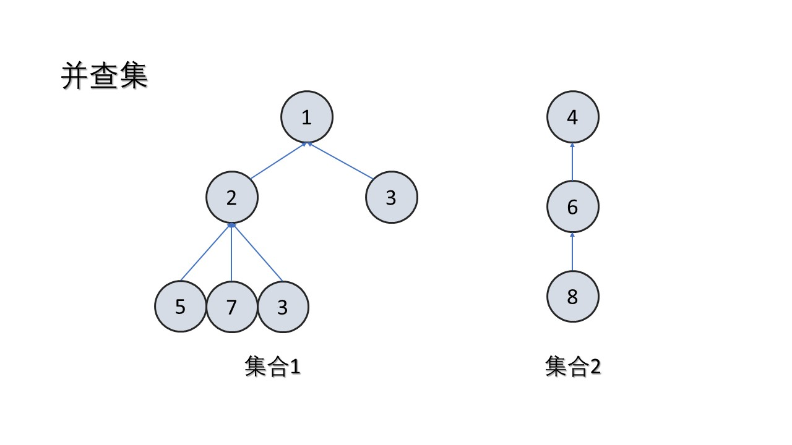

# 并查集

参考1：[https://leetcode-cn.com/problems/number-of-provinces/solution/python-duo-tu-xiang-jie-bing-cha-ji-by-m-vjdr/](https://leetcode-cn.com/problems/number-of-provinces/solution/python-duo-tu-xiang-jie-bing-cha-ji-by-m-vjdr/)

参考2：https://oi-wiki.org/ds/dsu/

## 一、基本概念

并查集是一种树形的数据结构，顾名思义，它用于处理一些不交集的 **合并** 及 **查询** 问题。 它支持两种操作：

- 查找（Find）：确定某个元素处于哪个子集；
- 合并（Union）：将两个子集合并成一个集合。
- 集（Set），代表这是一个以字典为基础的数据结构，它的基本功能是合并集合中的元素，查找集合中的元素

**并查集解决单个问题（添加，合并，查找）的时间复杂度都是O(1)**

因此，并查集可以应用到在线算法中

## 二、应用

### 1、处理连通分量


## 三、并查集的实现

### 1、数据结构



并查集跟树有些类似，只不过她跟树是相反的。在树这个数据结构里面，每个节点会记录它的子节点。在并查集里，**每个节点会记录它的父节点**。

可以看到，如果节点是相互连通的（从一个节点可以到达另一个节点），那么他们在同一棵树里，或者说在同一个集合里，或者说他们的**祖先是相同的**。

### 2、初始化

当把一个新节点添加到并查集中，它的父节点应该为空


### 3、查找祖先

查找祖先的方法是：**如果节点的父节点不为空，那就不断迭代。**

这里有一个优化的点：如果我们树很深，比如说退化成链表，那么每次查询的效率都会非常低。所以我们要做一下**路径压缩。也就是把树的深度固定为二。**

这么做可行的原因是，**并查集只是记录了节点之间的连通关系，而节点相互连通只需要有一个相同的祖先就可以了。**路径压缩可以用递归，也可以迭代

路径压缩的时间复杂度为O(logn) = O(1)，当成结论记下


### 4、合并两个节点

如果发现两个节点是连通的，那么就要把他们合并，也就是他们的祖先是相同的。这里究竟把谁当做父节点一般是没有区别的。


### 5、两节点是否连通

我们判断两个节点是否处于同一个连通分量的时候，就需要判断它们的祖先是否相同

## 四、路径压缩

### 1、python模版

```python
class UnionFind:
    def __init__(self):
        """
        记录每个节点的父节点
        """
        self.father = {}    
    
    def add(self, x):
        """
        添加新节点，它的父节点应该为空
        """
        if x not in self.father:
            self.father[x] = None

    def find(self, x):
        """
        查找根节点，如果节点的父节点不为空，那就不断迭代。
        """
        root = x
        while self.father[root] != None:
            root = self.father[root]

        # 路径压缩
        while x != root:
            original_father = self.father[x]
            self.father[x] = root
            x = original_father
        return root

    def merge(self, x, y):
        """
        合并两个节点，y的根结点作为x根节点的父亲
        """
        root_x, root_y = self.find(x), self.find(y)

        if root_x != root_y:
            # root_x 接在 root_y 后面
            self.father[root_x] = root_y

    def is_connected(self, x, y):
        """
        判断两节点是否相连，判断它们的祖先是否相同
        """
        return self.find(x) == self.find(y)
      
```

### 2、c++模版

```c++
class UnionFind {
private:
    // 记录父节点
    unordered_map<int, int> father;

public:
    void add(int x) {
        if (!father.count(x)) {
            father[x] = -1;
        }
    }

    int find(int x) {
        int root = x;
        while (father[root] != -1) {
            root = father[root];
        }

        while (x != root) {
            int original_father = father[x];
            father[x] = root;
            x = original_father;
        }
        return root;
    }

    void merge(int x, int y) {
        int root_x = find(x);
        int root_y = find(y);

        if (root_x != root_y) {
            father[root_x] = root_y;
        }
    }

    bool is_connected(int x, int y) {
        return find(x) == find(y);
    }
};
```

## 五、启发式合并（按秩排序）

由于需要我们支持的只有集合的合并、查询操作，当我们需要将两个集合合二为一时，无论将哪一个集合连接到另一个集合的下面，都能得到正确的结果。但不同的连接方法存在时间复杂度的差异。

具体来说，**如果我们将一棵点数与深度都较小的集合树连接到一棵更大的集合树下**，显然相比于另一种连接方案，接下来执行查找操作的用时更小（也会带来更优的最坏时间复杂度）。

当然，我们不总能遇到恰好如上所述的集合————点数与深度都更小。鉴于点数与深度这两个特征都很容易维护，我们常常从中择一，作为估价函数。而无论选择哪一个，时间复杂度都为 O(ma(m, n))

在算法竞赛的实际代码中，即便不使用启发式合并，代码也往往能够在规定时间内完成任务。在 Tarjan 的论文[1]中，证明了不使用启发式合并、只使用路径压缩的最坏时间复杂度是 O(mlogn)。在姚期智的论文[2]中，证明了在平均情况下

- 不使用启发式合并、只使用路径压缩，时间复杂度依然是 O(ma(m, n))

- 如果只使用启发式合并，而不使用路径压缩，时间复杂度为 O(mlogn)

由于路径压缩单次合并可能造成大量修改，有时路径压缩并不适合使用。例如，在可持久化并查集、线段树分治 + 并查集中，一般使用只启发式合并的并查集。

### 1、python模版

```python
class UnionFind:
    def __init__(self, n):
        self.count = n
        self.parent = [i for i in range(n)] # 初始化节点i的父节点为i
        self.rank = [0] * n

    def find(self, i):
        # 递归查找根节点，如果节点i的父节点为本身就找到了根，结束递归
        if self.parent[i] != i:
            self.parent[i] = self.find(self.parent[i])
        return self.parent[i]

    def union(self, x, y):
        # 合并两个节点
        rootx = self.find(x)
        rooty = self.find(y)
        if rootx != rooty:
            if self.rank[rootx] < self.rank[rooty]:
                rootx, rooty = rooty, rootx
            self.parent[rooty] = rootx
            if self.rank[rootx] == self.rank[rooty]:
                self.rank[rootx] += 1
            self.count -= 1
            
    def is_connected(self, x, y):
        # 判断两个节点是否连通
        return self.find(x) == self.find(y)

    def disconnected(self, x):
        # 断开节点与他父亲的连接
        self.parent[x] = x
        self.rank[x] = 0
```

### 2、c++模版（推荐使用）

```c++
class UnionFind {
public:
    vector<int> parent;  // 下标idx为节点，parent[idx]为该节点的父亲
    vector<int> size;    // 若idx为父亲根节点，size[idx]为该连通分量的大小
    int n;               // 节点数量
    int setCount;        // 连通分量的数量

public:
    UnionFind(int _n) : n(_n), setCount(_n), parent(_n), size(_n, 1) {
        iota(parent.begin(), parent.end(), 0);
    }

    int find(int x) {
        return parent[x] == x ? x : parent[x] = find(parent[x]);
    }

    bool unite(int x, int y) {
        x = find(x);
        y = find(y);
        if (x == y) return false;

        if (size[x] < size[y]) {
            swap(x, y);
        }
        parent[y] = x;       // x 作为 y 的父亲
        size[x] += size[y];  // 父亲节点x的联通分量大小加上y节点的
        --setCount;
        return true;
    }

    bool is_connected(int x, int y) {
        x = find(x);
        y = find(y);
        return x == y;
    }

    void disconnected(int x) {
        if (x != parent[x]) {
            parent[x] = x;
            size[x] = 1;
            ++setCount;
        }
    }
};
```

