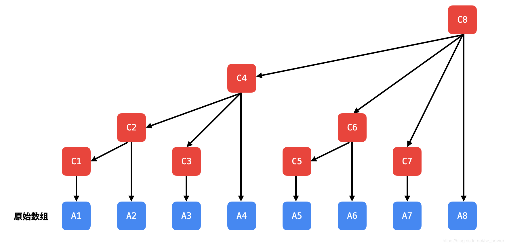
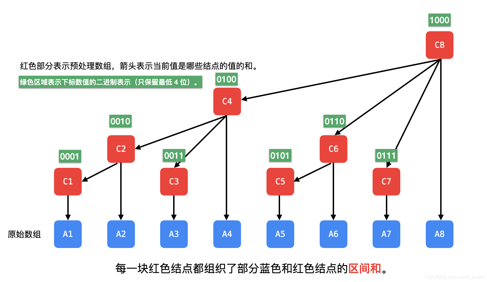

# 树状数组

来源1：https://leetcode-cn.com/problems/count-of-smaller-numbers-after-self/solution/shu-zhuang-shu-zu-by-liweiwei1419/

来源2：https://leetcode-cn.com/problems/range-sum-query-mutable/solution/guan-yu-ge-lei-qu-jian-he-wen-ti-ru-he-x-41hv/

来源3：https://oi-wiki.org/ds/fenwick/

「树状数组」也叫 Binary Indexed Tree，二进制索引树，很好地表示了「树状数组」处理数据的思路：「树状数组」里某个元素管理了原始输入数组多少数据是由下标决定的。

用于：高效地解决「前缀和查询」与「单点更新」问题

思想：空间换时间

## 一、概述

预备知识：**前缀和**

我们知道前缀和就可以求区间和，这是因为不同规模的区间和有重复的部分，相减以后就得到了区间和。

「前缀和」数组的思路是：将原始数组进行预处理，将来需要查询数据的时候，只需要查询预处理数组的某些值即可。

要优化「修改操作」造成的线性时间复杂度，**预处理数据组织成线性结构（前缀和数组）肯定是不行的**，因此一种方案是把预处理的数据组织成「树形结构」，有两种数据结构：

- 线段树：高效处理「区间和」查询（不仅仅可以处理和、还可以处理区间最值等），单点修改；
- 树状数组：高效处理「前缀和」查询，单点修改。

**「线段树」和「树状数组」一样，都是对原始输入数组进行了预处理，使得在真正需要查询数据的时候，我们只需要看「预处理数组」的部分信息即可，由于组织成树形结构，「修改」和「查询」的时间复杂度都是 O(logN)**

注意：「线段树」和「树状数组」不能处理输入数组的长度有增加或者减少的情况。

- 线段树是一棵二叉树

红色部分表示预处理数组，蓝色部分是原始输入数组，箭头表示当前值是哪些结点的值的和。

- 树状数组是多叉树

红色部分表示预处理数组，蓝色部分是原始输入数组，箭头表示当前值是哪些结点的值的和。

## 二、树状数组

### 1、「树状数组」如何组织原始输入数据的结构？

和「堆」一样，树状数组的 0 号下标不放置元素，从 1 号下标开始使用。从上图可以观察到，与数组 C 的某个结点有关的数组 A 的某些结点，它们的下标之间有如下关系。

| 数组 `C` 的值由数组 `A` 的哪些元素而来 | 数组 `A` 的元素个数 |
| -------------------------------------------------- | ------------------------- |
| C[1] = A[1] | 1 |
| C[2] = A[1] + A[2] | 2 |
| C[3] = A[3] | 1 |
| C[4] = A[1] + A[2] + A[3] + A[4] | 4 |
| C[5] = A[5] | 1 |
| C[6] = A[5] + A[6] | 2 |
| C[7] = A[7] | 1 |
| C[8] = A[1] + A[2] + A[3] + A[4] + A[5] + A[6] + A[7] + A[8] | 8 |

这件事情是由下标数值的二进制决定的，把下标写成二进制的形式，**最低位的 1 以及后面的 0 表示了预处理数组 C 管理了多少输入数组 A 的元素**。我们看一下下面的图：

例如：6 的二进制表示为 0110，这里只保留最低 4 位。将 6 进行二级制分解得到：
$$
6 = 1 
$$

