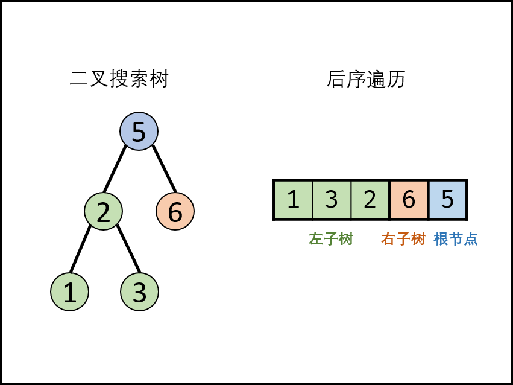

题目：[剑指 Offer 33. 二叉搜索树的后序遍历序列](https://leetcode.cn/problems/er-cha-sou-suo-shu-de-hou-xu-bian-li-xu-lie-lcof/)

输入一个整数数组，判断该数组是不是某二叉搜索树的后序遍历结果。如果是则返回 `true`，否则返回 `false`。假设输入的数组的任意两个数字都互不相同。

参考以下这颗二叉搜索树：

```
     5
    / \
   2   6
  / \
 1   3
```

**示例 1：**

```
输入: [1,6,3,2,5]
输出: false
```

**示例 2：**

```
输入: [1,3,2,6,5]
输出: true
```

**提示：**

1. `数组长度 <= 1000`

---

- **后序遍历定义：** `[ 左子树 | 右子树 | 根节点 ]` ，即遍历顺序为 “左、右、根” 。
- **二叉搜索树定义：** 左子树中所有节点的值 << 根节点的值；右子树中所有节点的值 >> 根节点的值；其左、右子树也分别为二叉搜索树。



方法一：递归分治

- 根据二叉搜索树的定义，可以通过递归，判断所有子树的 **正确性** （即其后序遍历是否满足二叉搜索树的定义） ，若所有子树都正确，则此序列为二叉搜索树的后序遍历。

递归解析：

- **终止条件：** 当 i≥j ，说明此子树节点数量 ≤1 ，无需判别正确性，因此直接返回 true；
- **递推工作：**
    - **划分左右子树：** 遍历后序遍历的 [i, j] 区间元素，寻找 **第一个大于根节点** 的节点，索引记为 m 。此时，可划分出左子树区间 [i,m-1]、右子树区间 [m, j - 1] 、根节点索引 j 。
    - **判断是否为二叉搜索树：**
        - **左子树区间** [i, m - 1] 内的所有节点都应 << postorder[j]。而第 `1.划分左右子树` 步骤已经保证左子树区间的正确性，因此只需要判断右子树区间即可。
        - **右子树区间** [m, j-1] 内的所有节点都应 >> postorder[j] 。实现方式为遍历，当遇到 ≤ postorder[j] 的节点则跳出；则可通过 p = j 判断是否为二叉搜索树。
- **返回值：** 所有子树都需正确才可判定正确，因此使用 **与逻辑符** \&\& 连接。
    - `p=j`判断 **此树** 是否正确。
    - `recur(i, m-1)`  判断 **此树的左子树** 是否正确。
    - `recur(m, j-1)`  判断 **此树的右子树** 是否正确。

**复杂度分析：**

- 时间复杂度 O(N^2)
- 空间复杂度 O(N)

```cpp
class Solution {
public:
    vector<int> postorder;
    bool dfs(int start, int end) {
        if (start >= end) return true;
        int ptr = start;
        while (postorder[ptr] < postorder[end]) {
            ptr++;
        }
        // 跳出循环时，ptr右子树的第一个
        int first_right = ptr;

        while (postorder[ptr] > postorder[end]) {
            ptr++;
        }
        // 跳出循环时，ptr若为end，表示 [start, end] 的整体结构没问题
        // 但是还得在 左子树[start, first_right-1] 和 右子树[first_right, end-1] 深入查查
        if (ptr == end && dfs(start, first_right - 1) && dfs(first_right, end - 1)) {
            return true;
        }
        return false;
    }

    bool verifyPostorder(vector<int>& postorder) {
        this->postorder = postorder;
        return dfs(0, postorder.size() - 1);
    }
};
```

