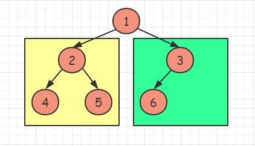
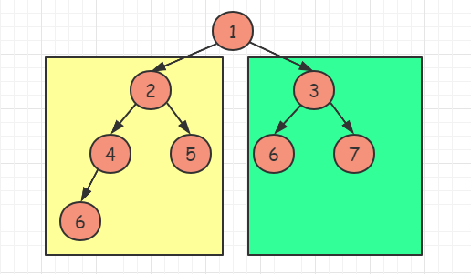
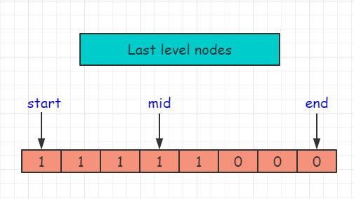
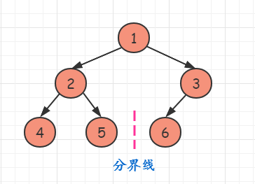

题目：[222. 完全二叉树的节点个数](https://leetcode.cn/problems/count-complete-tree-nodes/)

给你一棵 **完全二叉树** 的根节点 `root` ，求出该树的节点个数。

[完全二叉树](https://baike.baidu.com/item/完全二叉树/7773232?fr=aladdin) 的定义如下：在完全二叉树中，除了最底层节点可能没填满外，其余每层节点数都达到最大值，并且最下面一层的节点都集中在该层最左边的若干位置。若最底层为第 `h` 层，则该层包含 `1~ 2^h` 个节点。

**示例 1：**


```
输入：root = [1,2,3,4,5,6]
输出：6
```

**示例 2：**

```
输入：root = []
输出：0
```

**示例 3：**

```
输入：root = [1]
输出：1
```

**提示：**

- 树中节点的数目范围是`[0, 5 * 10^4]`
- `0 <= Node.val <= 5 * 10^4`
- 题目数据保证输入的树是 **完全二叉树**

**进阶：**遍历树来统计节点是一种时间复杂度为 `O(n)` 的简单解决方案。你可以设计一个更快的算法吗？

---

题解：https://leetcode.cn/problems/count-complete-tree-nodes/solution/c-san-chong-fang-fa-jie-jue-wan-quan-er-cha-shu-de/

### 1. 遍历所有节点

深度优先遍历数的所有节点，不过没有使用到完全二叉树的性质。

- 时间复杂度为O(n)，空间复杂度为O(1)【不考虑递归调用栈】
- 当然也可以使用广度优先遍历

```cpp
class Solution {
public:
    void countNodes(TreeNode* root){
        if(!root) return 0;
        return countNodes(root->left) + countNodes(root->right) + 1;
    }
};
```

### 2. 根据完全二叉树的性质简化遍历次数

**这是一棵完全二叉树**：除最后一层外，其余层全部铺满；且最后一层向左停靠 

- 如果根节点的左子树深度等于右子树深度，则说明**左子树为满二叉树**



- 如果根节点的左子树深度大于右子树深度，则说明**右子树为满二叉树**



- 如果知道子树是满二叉树，那么就可以轻松得到该子树的节点数目：`(1<<depth) - 1; // depth为子树的深度`；为了加快幂的运算速度，可以使用移位操作符
- 接着我们只需要接着对另一子树递归即可
- 时间复杂度为O(logn * logn)，空间复杂度为O(1)【不考虑递归调用栈】

```cpp
class Solution {
public:
    // 统计树的深度
    int countLevels(TreeNode* root) {
        int levels = 0;
        while (root) {
            root = root->left; levels += 1;
        }
        return levels;
    }
    int countNodes(TreeNode* root){
        // 2. 利用完全二叉树性质简化遍历次数
        if(root == nullptr) return 0;
        int left_levels = countLevels(root->left);
        int right_levels = countLevels(root->right);
        // 左子树深度等于右子树深度, 则左子树是满二叉树
        if(left_levels == right_levels){
            return countNodes(root->right) + (1<<left_levels);
        }else{
            return countNodes(root->left) + (1<<right_levels);
        }
    }
};
```

对于这份代码，我们可以较容易的看到，还是存在重复遍历的情况；例如：遍历完左右子树的深度后，再下一轮迭代时，还是会重复一次子树深度的遍历，不想改了~~~

### 3. 二分查找

根据完全二叉树的性质，我们可以清楚的知道：总节点数 = 倒数第二层以上的节点数 + 最后一层的节点数

- 除最后一层外，这棵树为满二叉树，节点数为：`2^depth_prev - 1`，depth_prev为倒数第二层树的深度
- 最后一层的节点数的范围是 `[1, 2^depth_prev]`；并且依次靠左排列
- 所以现在的问题就转换为判断最后一层节点数

先不说怎么判断一个节点是否存在，假设这个方法为`is_exist()`，我们先了解一下二分法如何使用：

**最后一层节点情况：** 1代表非空节点，0代表空节点



所以现在的问题就可以简单的看成最后一个1的索引位置，怎么用二分法就不用我说了。

接下来是如何判断最后一层某个节点是否存在，也就是`is_exist()函数：`

**给定最后一层某节点的位置索引 index，将他和分界线比大小，就可以判断该节点在左子树还是右子树**，例如：现在查找6这个节点，索引为3，大于分界线2，所以6在右子树；对右子树重复操作即可，剩下的工作就交给迭代了~~~



```cpp
class Solution {
public:
    // 求二叉树的深度
    int countLevels(TreeNode* root) {
    	int levels = 0;
    	while (root) {
    	    root = root->left; levels += 1;
        }
        return levels;
    }

    /*
    * 功能： 判断最后一层第index个索引是否存在
    * root： 二叉树根节点
    * index：判断最后一层索引为index的节点是否存在, 索引范围是[1, 2^depth]
    * depth：倒数第二层的深度, 这是因为满二叉树最后一层的节点数等于 2^depth
    */
    bool is_exist(TreeNode* root, int index, int depth) {
        TreeNode* node = root;
        while (depth) {
            // 最后一层分界线
            int mid = ((1 << depth) >> 1);
            if (index > mid) {
                // 如果在右子树，需要更新索引值
                index -= mid;
                node = node->right;
            }
            else {
                node = node->left;
            }
            depth -= 1;
        }
        return node != nullptr;
    }

    int countNodes(TreeNode* root) {
        // 3. 二分查找
        if (root == nullptr) return 0;
        // 二叉树深度
        int depth = countLevels(root);
        // 倒数第二层深度
        int depth_prev = depth - 1;

        int start = 1, end = (1 << depth_prev), mid = 0;
        while (start <= end) {
            mid = start + ((end - start) >> 1);
            if (is_exist(root, mid, depth_prev)) start = mid + 1;
            else end = mid - 1;
        }
        // start - 1为最后一层节点数
        int ret = (1 << depth_prev) - 1 + start - 1;
        return ret;
    }
};
```

