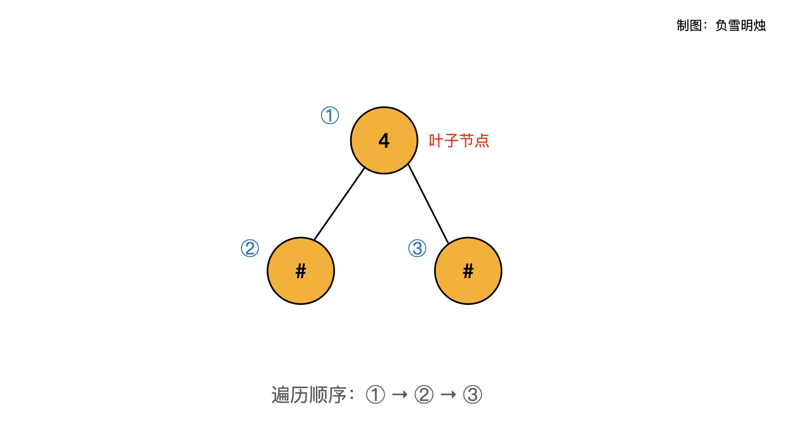
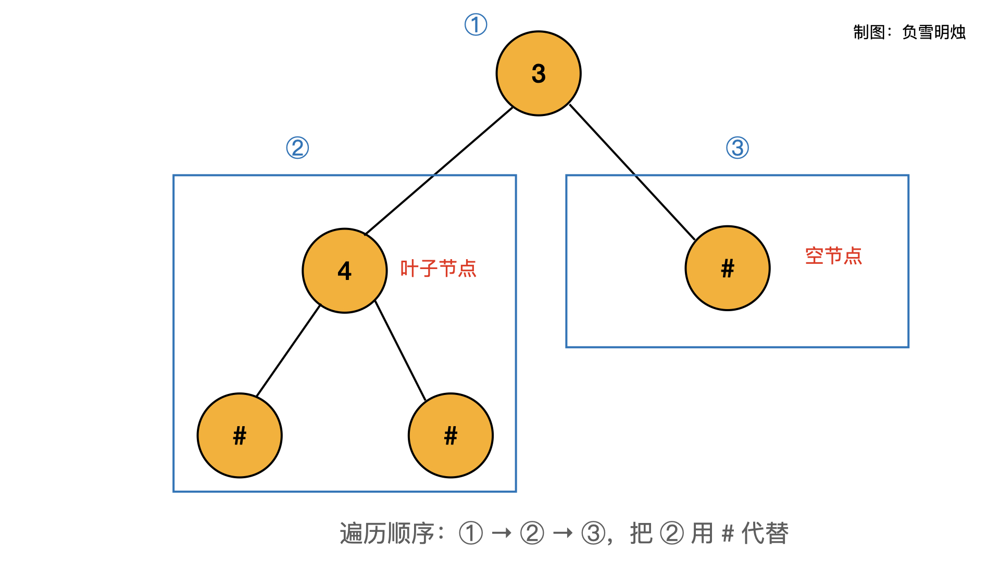
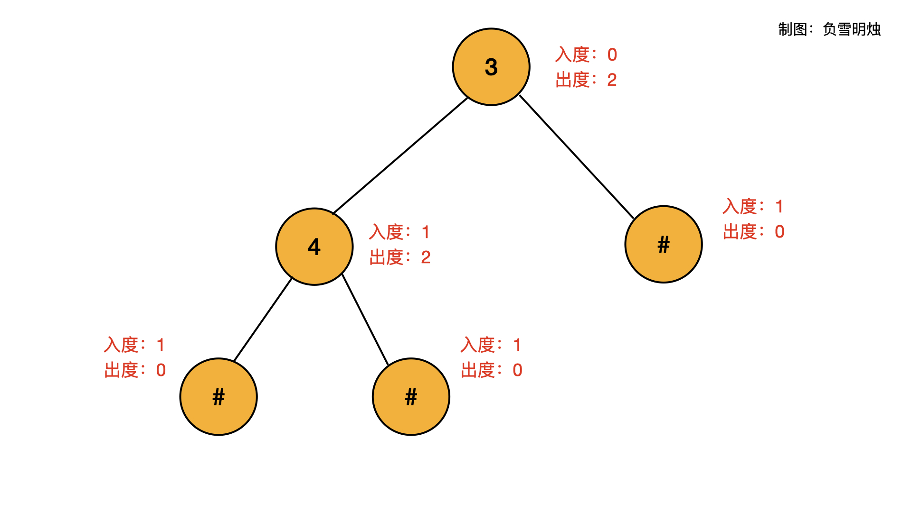

题目：[331. 验证二叉树的前序序列化](https://leetcode.cn/problems/verify-preorder-serialization-of-a-binary-tree/)

序列化二叉树的一种方法是使用 **前序遍历** 。当我们遇到一个非空节点时，我们可以记录下这个节点的值。如果它是一个空节点，我们可以使用一个标记值记录，例如 `#`。


例如，上面的二叉树可以被序列化为字符串 `"9,3,4,#,#,1,#,#,2,#,6,#,#"`，其中 `#` 代表一个空节点。

给定一串以逗号分隔的序列，验证它是否是正确的二叉树的前序序列化。编写一个在不重构树的条件下的可行算法。

**保证** 每个以逗号分隔的字符或为一个整数或为一个表示 `null` 指针的 `'#'` 。

你可以认为输入格式总是有效的

- 例如它永远不会包含两个连续的逗号，比如 `"1,,3"` 。

**注意：**不允许重建树。

**示例 1:**

```
输入: preorder = "9,3,4,#,#,1,#,#,2,#,6,#,#"
输出: true
```

**示例 2:**

```
输入: preorder = "1,#"
输出: false
```

**示例 3:**

```
输入: preorder = "9,#,#,1"
输出: false
```

**提示:**

- `1 <= preorder.length <= 104`
- `preorder` 由以逗号 `“，”` 分隔的 `[0,100]` 范围内的整数和 `“#”` 组成

---

题解：https://leetcode.cn/problems/verify-preorder-serialization-of-a-binary-tree/solution/pai-an-jiao-jue-de-liang-chong-jie-fa-zh-66nt/

# 解题思路

今天题目要我们验证输入字符串是否是有效的二叉树的前序序列化，力扣的二叉树题目的输入都是这种格式的。

本文使用两种方法解决：

1. 栈
2. 计算入度出度

## 方法一：栈

栈的思路是「自底向上」的想法。下面要结合本题是「**前序遍历**」这个重要特点。

我们知道「前序遍历」是按照「**根节点-左子树-右子树**」的顺序遍历的，只有当根节点的所有左子树遍历完成之后，才会遍历右子树。对于本题的输入，我们可以先判断「**左子树**」是否有效的，然后再判断「**右子树**」是否有效的，最后判断「**根节点-左子树-右子树**」是否为有效的。这个思路类似于递归，而把递归改写成循环时，就会使用「栈」，这就是本题使用「栈」的原因。

下面的重点是如何判断一棵子树是否有效？首先考虑最简单情况：怎么判断一个节点是叶子节点？很明显，当一个节点的两个孩子都是 `"#"`（空）的时候，该节点就是叶子节点。



当一个节点不是叶子节点的时候，那么它必定至少有一个孩子非空！有两种情况

- 两个孩子都非`"#"`（空）；
- 一个孩子为`"#"`（空），另一个孩子非`"#"`（空）；

为了兼容这两个情况，我们想出了本题的一个重磅级的技巧：**把有效的叶子节点使用 `"#"` 代替。** 比如把 `4##` 替换成 `#` 。此时，**叶子节点会变成空节点**！



具体操作流程示例如下：

如输入： `"9,3,4,#,#,1,#,#,2,#,6,#,#"` ，当遇到 `x,#,#` 的时候，就把它变为 `#`。

模拟一遍过程：

1. `[9,3,4,#,#] => [9,3,#]`，继续
2. `[9,3,#,1,#,#] => [9,3,#,#] => [9,#]` ，继续
3. `[9,#2,#,6,#,#] => [9,#,2,#,#] => [9,#,#] => [#]`，结束

下面的动画模拟了`"9,3,4,#,#,1,#,#,#"`的操作过程：


这个操作流程完美结合了「**栈**」和「**前序遍历**」的特性，完美！代码如下：

```python
class Solution:
    def isValidSerialization(self, preorder: str) -> bool:
        stack = []
        preorder = preorder.split(',')
        # 最前往后遍历
        for node in preorder:
            stack.append(node)
            while len(stack) >= 3 and stack[-1] == stack[-2] == "#" and stack[-3] != "#":
                stack.pop(), stack.pop(), stack.pop()
                stack.append("#")
        return len(stack) == 1 and stack[0] == "#"
```

- 时间复杂度：O(N)
- 空间复杂度：O(N)

## 方法二：计算入度出度

背景知识：

- **入度**：有多少个节点指向它；
- **出度**：它指向多少个节点。

我们知道在树（甚至图）中，**所有节点的入度之和等于出度之和**。可以根据这个特点判断输入序列是否为有效的！

在一棵二叉树中：

- 每个空节点（ `"#"` ）会提供 0 个出度和 1 个入度。
- 每个非空节点会提供 2 个出度和 1 个入度（根节点的入度是 0）。



我们只要把字符串遍历一次，每个节点都累加 `diff = 出度 - 入度` 。

在遍历到任何一个节点的时候，要求`diff >= 0`，原因是还没遍历到该节点的子节点，所以此时的出度应该大于等于入度。当所有节点遍历完成之后，整棵树的 `diff == 0` 。

这里解释一下为什么下面的代码中 diff 的初始化为 1。因为，我们加入一个非空节点时，都会对 diff 先减去 1（入度），再加上 2（出度）。但是由于根节点没有父节点，所以其入度为 0，出度为 2。因此 diff 初始化为 1，是为了在加入根节点的时候，diff 先减去 1（入度），再加上 2（出度），此时 diff 正好应该是2.

```python
class Solution(object):
    def isValidSerialization(self, preorder):
        nodes = preorder.split(',')
        diff = 1
        for node in nodes:
            diff -= 1
            if diff < 0:
                return False
            if node != '#':
                diff += 2
        return diff == 0
```

- 时间复杂度：O(N)
- 空间复杂度：O(1)