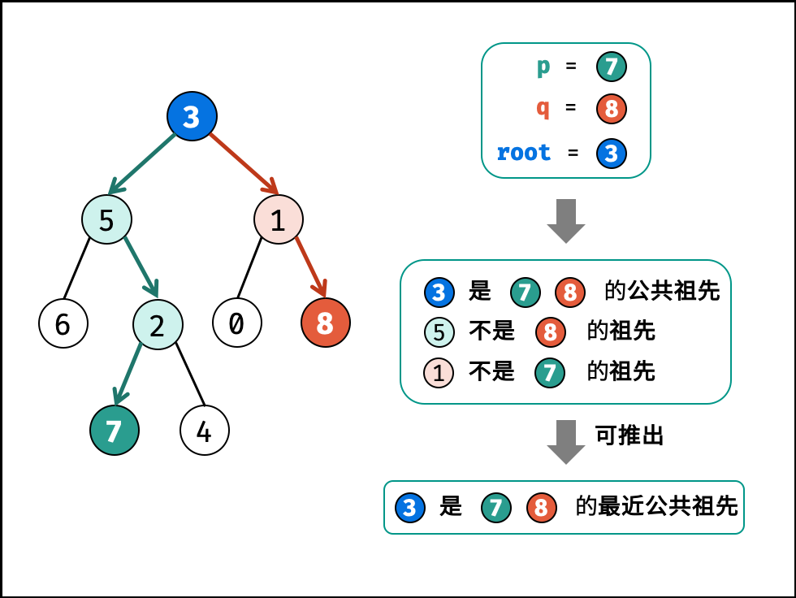

题目：[剑指 Offer 68 - II. 二叉树的最近公共祖先](https://leetcode.cn/problems/er-cha-shu-de-zui-jin-gong-gong-zu-xian-lcof/)

题解：[剑指 Offer 68 - II. 二叉树的最近公共祖先（DFS ，清晰图解）](https://leetcode.cn/problems/er-cha-shu-de-zui-jin-gong-gong-zu-xian-lcof/solution/mian-shi-ti-68-ii-er-cha-shu-de-zui-jin-gong-gon-7/)

给定一个二叉树, 找到该树中两个指定节点的最近公共祖先。

百度百科中最近公共祖先的定义为：“对于有根树 T 的两个结点 p、q，最近公共祖先表示为一个结点 x，满足 x 是 p、q 的祖先且 x 的深度尽可能大（一个节点也可以是它自己的祖先）。”

例如，给定如下二叉树: root = [3,5,1,6,2,0,8,null,null,7,4]


```
示例 1:

输入: root = [3,5,1,6,2,0,8,null,null,7,4], p = 5, q = 1
输出: 3
解释: 节点 5 和节点 1 的最近公共祖先是节点 3。

示例 2:

输入: root = [3,5,1,6,2,0,8,null,null,7,4], p = 5, q = 4
输出: 5
解释: 节点 5 和节点 4 的最近公共祖先是节点 5。因为根据定义最近公共祖先节点可以为节点本身。
```

**说明:**

- 所有节点的值都是唯一的。
- p、q 为不同节点且均存在于给定的二叉树中。

注意：本题与主站 236 题相同：https://leetcode-cn.com/problems/lowest-common-ancestor-of-a-binary-tree/



考虑通过递归对二叉树进行先序遍历，当遇到节点 p 或 q 时返回。从底至顶回溯，当节点 p, q 在节点 root 的异侧时，节点 root 即为最近公共祖先，则向上返回 root 。

递归解析

**终止条件**：

- 当越过叶节点，则直接返回 null ；
- 当 root 等于 p, q，则直接返回 root（因为 p 或 q 必在 root 的一边，或者也是 root） ；

**递推工作**：

- 开启递归左子节点，返回值记为 left ；
- 开启递归右子节点，返回值记为 right ；

**返回值**： 根据 left 和 right ，可展开为四种情况；

- 当 left 和 right 同时为空 ：说明 root 的左 / 右子树中都不包含 p,q ，返回 null ；

- 当 left 和 right 同时不为空 ：说明 p, q 分列在 root 的 异侧 （分别在 左 / 右子树），因此 root 为最近公共祖先，返回 root ；

- 当 left 为空 ，right 不为空 ：p,q 都不在 root 的左子树中，直接返回 right 。具体可分为两种情况：

    - p,q 其中一个在 root 的 右子树 中，此时 right 指向 p（假设为 p ）；
    - p,q 两节点都在 root 的 右子树 中，此时的 right 指向 最近公共祖先节点 ；
- 当 left 不为空 ， right 为空 ：与情况 3. 同理；

```cpp
/**
 * Definition for a binary tree node.
 * struct TreeNode {
 *     int val;
 *     TreeNode *left;
 *     TreeNode *right;
 *     TreeNode(int x) : val(x), left(NULL), right(NULL) {}
 * };
 */
class Solution {
public:
    TreeNode* dfs(TreeNode* cur, TreeNode* p, TreeNode* q) {
        if (cur == nullptr) return cur;
        if (p == cur || q == cur) return cur;

        TreeNode* left = dfs(cur->left, p, q);
        TreeNode* right = dfs(cur->right, p, q);

        if (left == nullptr && right == nullptr) return nullptr;  // 1.
        if (left == nullptr && right != nullptr) return right;    // 3.
        if (left != nullptr && right == nullptr) return left;     // 4.
        return cur; // 2. if(left != nullptr and right != nullptr)
    }

    TreeNode* lowestCommonAncestor(TreeNode* root, TreeNode* p, TreeNode* q) {
        return dfs(root, p, q);
    }
};

```

