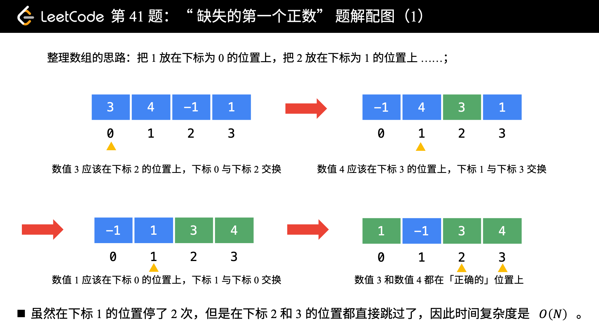

题目：[41. 缺失的第一个正数](https://leetcode.cn/problems/first-missing-positive/)

给你一个未排序的整数数组 `nums` ，请你找出其中没有出现的最小的正整数。

请你实现时间复杂度为 `O(n)` 并且只使用常数级别额外空间的解决方案。

**示例 1：**

```
输入：nums = [1,2,0]
输出：3
```

**示例 2：**

```
输入：nums = [3,4,-1,1]
输出：2
```

**示例 3：**

```
输入：nums = [7,8,9,11,12]
输出：1
```

**提示：**

- `1 <= nums.length <= 5 * 105`
- `-231 <= nums[i] <= 231 - 1`

---

## 方法：原地哈希（哈希函数为：f(nums[i]) = nums[i] - 1）

**将原数组视为哈希表**

前置问题：[剑指 Offer 03. 数组中重复的数字](https://leetcode-cn.com/problems/shu-zu-zhong-zhong-fu-de-shu-zi-lcof/)。

- 由于题目要求我们「**只能使用常数级别的空间**」，而要找的数一定在 `[1, N + 1]` 左闭右闭（这里 `N` 是数组的长度）这个区间里。因此，我们可以就把原始的数组当做哈希表来使用。事实上，**哈希表其实本身也是一个数组**；
- 我们要找的数就在 `[1, N + 1]` 里，最后 `N + 1` 这个元素我们不用找。因为在前面的 `N` 个元素都找不到的情况下，我们才返回 `N + 1`；
- 那么，我们可以采取这样的思路：就把 1 这个数放到下标为 0 的位置， 2 这个数放到下标为 1 的位置，按照这种思路整理一遍数组。然后我们再遍历一次数组，第 1 个遇到的它的值不等于下标的那个数，就是我们要找的缺失的第一个正数。
- 这个思想就相当于**我们自己编写哈希函数**，这个哈希函数的规则特别简单，那就是数值为 `i` 的数映射到下标为 `i - 1` 的位置。



```cpp
class Solution {
public:
    int firstMissingPositive(vector<int> &nums) {
        for (int i = 0; i < nums.size(); i++) {
            while (nums[i] != i + 1) {
                if (nums[i] <= 0 || nums[i] > nums.size() || nums[i] == nums[nums[i] - 1])
                    break;
                // 满足在指定范围内、并且没有放在正确的位置上，才交换
                // 例如：数值 3 应该放在索引 2 的位置上
                int idx = nums[i] - 1;
                nums[i] = nums[idx];
                nums[idx] = idx + 1;
            }
        }
        for (int i = 0; i < nums.size(); i++) {
            if (nums[i] != (i + 1)) {
                return (i + 1);
            }
        }
        // 都正确则返回数组长度 + 1
        return (nums.size() + 1);
    }
};
```

**复杂度分析**：

- 时间复杂度：O(N)，这里 N*N* 是数组的长度。
- 空间复杂度：O(1)

说明：`while` 循环不会每一次都把数组里面的所有元素都看一遍。如果有一些元素在这一次的循环中被交换到了它们应该在的位置，那么在后续的遍历中，由于它们已经在正确的位置上了，代码再执行到它们的时候，就会被跳过。

最极端的一种情况是，在第 1 个位置经过这个 `while` 就把所有的元素都看了一遍，这个所有的元素都被放置在它们应该在的位置，那么 `for` 循环后面的部分的 `while` 的循环体都不会被执行。

平均下来，每个数只需要看一次就可以了，`while` 循环体被执行很多次的情况不会每次都发生。这样的复杂度分析的方法叫做**均摊复杂度分析**。

最后再遍历了一次数组，最坏情况下要把数组里的所有的数都看一遍，因此时间复杂度是 O(N)。

## 投机方法

```cpp
class Solution {
public:
    int firstMissingPositive(vector<int>& nums) {
        unordered_set<int> nums_set(nums.begin(), nums.end());
        for (int num = 1; num <= pow(2, 31)-1; num++) {
            if (nums_set.count(num) == 0) return num;
        }
        return -1; // 实际不会走到这
    }
};
```


### 同类问题

| 问题                                                         | 题解                                                         |
| ------------------------------------------------------------ | ------------------------------------------------------------ |
| [442. 数组中重复的数据](https://leetcode-cn.com/problems/find-all-duplicates-in-an-array/) | [题解](https://leetcode-cn.com/problems/find-all-duplicates-in-an-array/solution/chou-ti-yuan-li-ji-yu-yi-huo-yun-suan-jiao-huan-li/) |
| [448. 找到所有数组中消失的数字](https://leetcode-cn.com/problems/find-all-numbers-disappeared-in-an-array/) | [题解](https://leetcode-cn.com/problems/find-all-numbers-disappeared-in-an-array/solution/tong-pai-xu-ji-yu-yi-huo-yun-suan-jiao-huan-liang-/) |