题目：[2416. 字符串的前缀分数和](https://leetcode.cn/problems/sum-of-prefix-scores-of-strings/)

给你一个长度为 `n` 的数组 `words` ，该数组由 **非空** 字符串组成。

定义字符串 `word` 的 **分数** 等于以 `word` 作为 **前缀** 的 `words[i]` 的数目。

- 例如，如果 words = ["a", "ab", "abc", "cab"] ，那么 "ab" 的分数是 2 ，因为 "ab" 是 "ab" 和 "abc" 的一个前缀。


返回一个长度为 `n` 的数组 `answer` ，其中 `answer[i]` 是 `words[i]` 的每个非空前缀的分数 **总和** *。*

**注意：**字符串视作它自身的一个前缀。

```
示例 1：

输入：words = ["abc","ab","bc","b"]
输出：[5,4,3,2]
解释：对应每个字符串的答案如下：
- "abc" 有 3 个前缀："a"、"ab" 和 "abc" 。
- 2 个字符串的前缀为 "a" ，2 个字符串的前缀为 "ab" ，1 个字符串的前缀为 "abc" 。
总计 answer[0] = 2 + 2 + 1 = 5 。
- "ab" 有 2 个前缀："a" 和 "ab" 。
- 2 个字符串的前缀为 "a" ，2 个字符串的前缀为 "ab" 。
总计 answer[1] = 2 + 2 = 4 。
- "bc" 有 2 个前缀："b" 和 "bc" 。
- 2 个字符串的前缀为 "b" ，1 个字符串的前缀为 "bc" 。 
总计 answer[2] = 2 + 1 = 3 。
- "b" 有 1 个前缀："b"。
- 2 个字符串的前缀为 "b" 。
总计 answer[3] = 2 。

示例 2：

输入：words = ["abcd"]
输出：[4]
解释：
"abcd" 有 4 个前缀 "a"、"ab"、"abc" 和 "abcd"。
每个前缀的分数都是 1 ，总计 answer[0] = 1 + 1 + 1 + 1 = 4 。
```

**提示：**

- `1 <= words.length <= 1000`
- `1 <= words[i].length <= 1000`
- `words[i]` 由小写英文字母组成


这个题也是「前缀树」的模版题，只不过每个节点的含义需要重新定义一下：**表示以该路径为前缀的单词数量**

可能表述的有些抽象，以 `["abc","ab","bc","b"]` 为例，直接看图：



构建好了前缀树，如果我们需要查询某个单词的前缀分数和，如 `"abc"`，只需要路径 `abc` 的节点累加即可，2 + 2 + 1 = 5

```cpp

class Trie {
public:
    Trie* son[26];  // 存放当前字符之后的字符
    bool isWord;
    string str;
    int cnt = 0;

    Trie() {
        for (int i = 0; i < 26; i++) son[i] = nullptr;
        isWord = false;
        str = "";
    }
    ~Trie() {
        for (int i = 0; i < 26; i++) {
            if (son[i] != nullptr) delete son[i];
        }
    }

    void insert(string word) {
        Trie* root = this;     // 从头节点开始查
        for (char c : word) {  // 类似链表的遍历
            int cur = c - 'a';
            if (root->son[cur] == nullptr) root->son[cur] = new Trie();
            root->son[cur]->cnt++;
            root = root->son[cur];
        }
        root->isWord = true;  // 在单词的结尾节点标记一下 是单词
        root->str = word;     // 结尾直接记录单词
    }

    int query(string word) {
        Trie* root = this;  // 从头节点开始查
        int scores = 0;
        for (char c : word) {  // 类似链表的遍历
            int cur = c - 'a';
            if (root->son[cur] == nullptr) return scores;
            scores += root->son[cur]->cnt;
            root = root->son[cur];
        }
        return scores;
    }
};

class Solution {
public:
    vector<int> sumPrefixScores(vector<string>& words) {
        Trie trie;
        for (string& word : words) {
            trie.insert(word);
        }

        vector<int> ans;
        for (string& word : words) {
            ans.push_back(trie.query(word));
        }
        return ans;
    }
};

```

