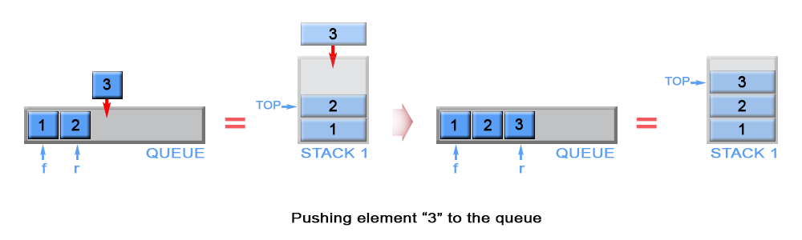

# 两个栈实现队列

题目：[232. 用栈实现队列](https://leetcode.cn/problems/implement-queue-using-stacks/)

来源：[用栈实现队列 - 用栈实现队列 - 力扣（LeetCode）](https://leetcode.cn/problems/implement-queue-using-stacks/solution/yong-zhan-shi-xian-dui-lie-by-leetcode/)

队列是一种 先进先出（first in - first out， FIFO）的数据结构，队列中的元素都从后端（rear）入队（push），从前端（front）出队（pop）。

实现队列最直观的方法是用链表，但在这篇文章里我会介绍另一个方法 - 使用栈。

栈是一种 后进先出（last in - first out， LIFO）的数据结构，栈中元素从栈顶（top）压入（push)，也从栈顶弹出（pop）。

## 方法一

为了满足队列的 FIFO 的特性，我们需要用到两个栈，用它们其中一个来反转元素的入队顺序，用另一个来存储元素的最终顺序。

**入队（push）**：首先需要把 `s1` 中所有的元素移到 `s2` 中，接着把新元素压入 `s2`。最后把 `s2` 中所有的元素弹出，再把弹出的元素压入 `s1`。


时间复杂度：`O(n)`

**出队（pop）**、**判断空（empty）**、**取队首元素（peek）**：时间复杂度：`O(1)`

```c++
class MyQueue {
public:
    stack<int> s1;  // 新来的放入栈底
    stack<int> s2;

    MyQueue() {}

    void push(int x) {
        while (!s1.empty()) {
            s2.push(s1.top());
            s1.pop();
        }
        s1.push(x);
        while (!s2.empty()) {
            s1.push(s2.top());
            s2.pop();
        }
    }

    int pop() {
        int top = s1.top();
        s1.pop();
        return top;
    }

    int peek() {
        return s1.top();
    }

    bool empty() {
        return s1.empty();
    }
};

```

## 方法二

**入队（push）**

新元素总是压入 `s1` 的栈顶，同时我们会把 `s1` 中压入的第一个元素赋值给作为队首元素的 `front` 变量。

时间复杂度：`O(1)`

**出队（pop）**

根据栈 LIFO 的特性，s1 中第一个压入的元素在栈底。为了弹出 s1 的栈底元素，我们得把 s1 中所有的元素全部弹出，再把它们压入到另一个栈 s2 中，这个操作会让元素的入栈顺序反转过来。通过这样的方式，s1 中栈底元素就变成了 s2 的栈顶元素，这样就可以直接从 s2 将它弹出了。一旦 s2 变空了，我们只需把 s1 中的元素再一次转移到 s2 就可以了。



时间复杂度： 均摊复杂度 `O(1)`，最坏情况下的时间复杂度 `O(n)`

我们的「倒腾」不是发生在每一次的「输出操作」中，而是集中发生在一次「输出栈为空」的时候，因此 `pop` 和 `peek` 都是均摊复杂度为 `O(1)` 的操作。

**判断空（empty）**

`s1` 和 `s2` 都存有队列的元素，所以只需要检查 `s1` 和 `s2` 是否都为空就可以了。

时间复杂度：`O(1)`

**取队首元素（peek)**

我们定义了 front 变量来保存队首元素，每次 入队 操作我们都会随之更新这个变量。当 s2 为空，front 变量就是队首元素，当 s2 非空，s2 的栈顶元素就是队首元素。

时间复杂度：`O(1)`，队首元素要么是之前就被计算出来的，要么就是 `s2` 栈顶元素。因此时间复杂度为 `O(1)`

```c++
class MyQueue {
public:
    int front;
    stack<int> s1;  // 先来的在下面
    stack<int> s2;  // 先来的在上面，s2整体上比s1老

    MyQueue() {}

    void push(int x) {
        if (s1.empty()) front = x;
        s1.push(x);
    }

    int pop() {
        if (s2.empty()) {
            while (!s1.empty()) {
                s2.push(s1.top());
                s1.pop();
            }
        }
        int ans = s2.top();
        s2.pop();
        return ans;
    }

    int peek() {
        if (!s2.empty()) return s2.top();
        return front;
    }

    bool empty() {
        return s1.empty() && s2.empty();
    }
};
```

# 两个队列实现栈

题目：[225. 用队列实现栈](https://leetcode.cn/problems/implement-stack-using-queues/)

## 方法

每次入队的时间复杂度为 `O(n)`，没有均摊为 `O(1)` 的方法

```c++
class MyStack {
public:
    queue<int> s1;  // 后来的在队列前面
    queue<int> s2;  // 中转用的

    MyStack() {}

    void push(int x) {
        while (!s1.empty()) {
            s2.push(s1.front());
            s1.pop();
        }
        s1.push(x);
        while (!s2.empty()) {
            s1.push(s2.front());
            s2.pop();
        }
    }

    int pop() {
        int top = s1.front();
        s1.pop();
        return top;
    }

    int top() {
        return s1.front();
    }

    bool empty() {
        return s1.empty();
    }
};
```

也可以用一个队列实现，原理是一样的

```c++
class MyStack {
public:
    queue<int> s1;  // 后来的在队列前面

    MyStack() {}

    void push(int x) {
        int n = s1.size();
        s1.push(x);
        for (int i = 0; i < n; i++) {
            s1.push(s1.front());
            s1.pop();
        }
    }

    int pop() {
        int top = s1.front();
        s1.pop();
        return top;
    }

    int top() {
        return s1.front();
    }

    bool empty() {
        return s1.empty();
    }
};
```

