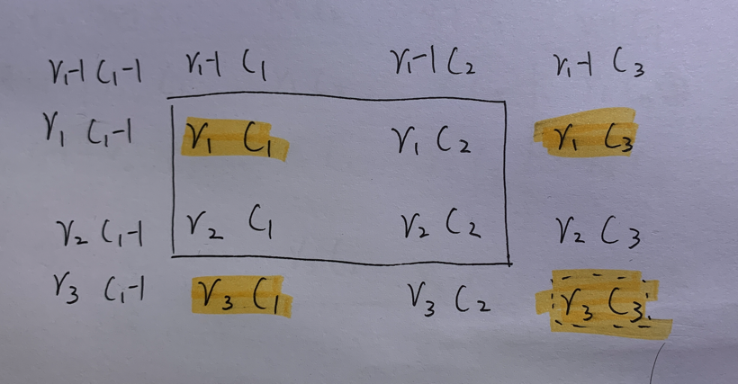

# 差分

参考：[https://oi-wiki.org/basic/prefix-sum/](https://oi-wiki.org/basic/prefix-sum/)

差分是一种和前缀和相对的策略，可以当做是求和的逆运算。

**应用：看到区间的变化相同的量，果断想能不能用差分**

差分数组可由前缀和数组算出：
$$
diff[i] = 
\begin{cases}
preSum[i]-preSum[i-1] & i>1 \\
preSum[i] & i=0
\end{cases}
$$

则差分数组从0累加到第n项，也是第n项前缀和为：

$$
\begin{align}
\sum\limits_{i=0}^{n}diff[i] &= preSum[0] + preSum[1]-preSum[0] + ...+preSum[n] - preSum[n-1] \\
&= preSum[n]
\end{align}
$$

## 一维差分数组

对**差分数组内区间「两端」**进行操作以代替**前缀和数组内「整个区间」**的操作，**时间复杂度从 O(k) 降至 O(1)**

一个区间 `[i, i+k-1]`，区间长度为 `k`

在差分数组内区间首元素 `diff[i]` 加上变化量 `△`，区间尾元素的下一位 `diff[i+k]` 减上变化量 `△`，就可以算出差分数组。

$$
\begin{cases} diff[i]+\triangle \\ 
diff[i+k]-\triangle 
\end{cases}
$$

应用前缀和公式，就可以算出「累积计数数组」（前缀和数组），其描述了每个位置上「累积的变化量」
$$
pre\_sum[i] = pre\_sum[i-1]+diff[i]
$$

注意防止数组越界：~~在初始化差分数组时长度要设为 `sz+△`~~，或者 `i` 有限制的话至少也要设为 `sz+1`、`sz+2`

### 实例

有个数组 `requests = [[1,3],[0,1]]` 每个元素描述：在原数组 `nums = [1,2,3,4,5]` 区间 `[start,end]` 内都会加上变化量 `△=2`

最后输出原数组变化后的样子。

```python
sz = len(nums)
# 1. 差分数组，注意将差分数组的长度扩充
diff = [0 for _ in range(sz+2)]
for start, end in requests:
    diff[start] += 2
    diff[end+1] -= 2
print(diff) # [2, 2, -2, 0, -2, 0, 0]

# 2. 通过差分数组推出计数数组（前缀和数组），描述了原数组每个位置的变化量
pre_sum = [0 for _ in range(sz+1)]
for i in range(sz):
    pre_sum[i+1] = pre_sum[i] + diff[i]
print(pre_sum) # [0, 2, 4, 2, 2, 0]

# 3. 输出原数组变化后的样子
for i in range(sz):
    nums[i] += pre_sum[i+1]
print(nums) # [3, 6, 5, 6, 5] 
```
采用差分算法的时间复杂度为 `O(n)`，采用普通的方法为 `O(n*k)`，k 为区间长度。

```python
nums = [1,2,3,4,5]
requests = [[1,3],[0,1]]
for start, end in requests:
    for i in range(start, end+1):
        nums[i] += 2
print(nums) # [3, 6, 5, 6, 5]
```

当区间的下标不确定时，可用平衡树，方便从小到大计算

```c++
class Solution {
public:
    int minGroups(vector<vector<int>> &intervals) {
        map<int, int> diff;
        for (auto &p : intervals)
            ++diff[p[0]], --diff[p[1] + 1];
        
        // 查找累积数组中的最大值
        int ans = 0, sum = 0;
        for (auto &[_, d] : diff)
            ans = max(ans, sum += d);
        
        return ans;
    }
};

```

### 证明

前缀和数组 `preSum` 在区间长度为 `k` 的 `[i, i+k-1]` 范围内的元素都加 `1`

可以看出差分数组区间内的首元素加 `1`：`diff[i]+1`，末元素的下一位减 `1`：`diff[i+k]-1`

| preSum(原来)   | diff(原来)                  | preSum(加一后)      | diff(加一后)                                |
| -------------- | --------------------------- | ------------------- | ------------------------------------------- |
| preSum[i-1]    | preSum[i-1]-preSum[i-2]     | preSum[i-1]         | preSum[i-1]-preSum[i-2]=diff[i-1]           |
| preSum[i]      | preSum[i]-preSum[i-1]       | **preSum[i]+1**     | **preSum[i]+1-preSum[i-1]=diff[i]+1**       |
| preSum[i+1]    | preSum[i+1]-preSum[i]       | **preSum[i+1]+1**   | preSum[i+1]+1-preSum[i]-1=diff[i+1]         |
| ...            | ...                         | ...                 | ...                                         |
| preSum[ i+k-2] | preSum[i+k-2]-preSum[i+k-3] | **preSum[i+k-2]+1** | preSum[i+k-2]+1-preSum[i+k-3]+1=diff[i+k-2] |
| preSum[ i+k-1] | preSum[i+k-1]-preSum[i+k-2] | **preSum[i+k-1]+1** | preSum[i+k-1]+1-preSum[i+k-2]+1=diff[i+k-1] |
| preSum[ i+k]   | preSum[i+k]-preSum[i+k-1]   | preSum[i+k]         | **preSum[i+k]-preSum[i+k-1]+1=diff[i+k]-1** |

前缀和数组内区间元素整体加 `1`，而在差分数组内区间只是两端变化（首元素加 `1`，末元素的下一位减 `1`）

## 二维差分数组

一个区间 `[r, r+k-1]`，`[c, c+k-1]`，的 `k*k` 区域内（前缀和数组），整体变化`△`

在二维差分数组中，左上角 `[r][c]` 、右上角往右一位 `[r][c+k]` 、左下角往下一位 `[r+k][c]` 、右下角往右下一位 `[r+k][c+k]` 这四个点进行操作：
$$
\begin{cases} 
diff[r][c]+\triangle \\ 
diff[r][c+k]-\triangle \\
diff[r+k][c]-\triangle \\
diff[r+k][c+k]+\triangle 
\end{cases}
$$
应用前缀和公式，就可以算出「二维累积计数数组」（二维前缀和数组），其描述了每个位置上「累积的变化量」
$$
preSum[r][c] = preSum[r][c-1] + preSum[r-1][c] - preSum[r-1][c-1] + diff[r][c]
$$
防止数组越界：在初始化差分数组时 `row、col` 设为 `rows+△` 和 `cols+△`，或者 `row、col` 有限制的话至少也要设为 `rows+1` 和 `cols+1`

因为右上角往右一位、左下角往下一位、右下角往右下一位这三个点需要将坐标加一

### 反推证明

左上角 `[r1][c1]` 与右下角 `[r2][c2]` 的 `2x2` 区域内（前缀和数组），整体加一



1. 列出受区间变化影响的区域：左上角 `[r1][c1]` 与右下角 `[r3][c3]` 的 `3x3` 区域都会都影响

```
preSum[r1][c1] = preSum[r1][c1-1] + preSum[r1-1][c1] - preSum[r1-1][c1-1] + diff[r1][c1]
preSum[r1][c2] = preSum[r1][c1] + preSum[r1-1][c2] - preSum[r1-1][c1] + diff[r1][c2]
preSum[r1][c3] = preSum[r1][c2] + preSum[r1-1][c3] - preSum[r1-1][c2] + diff[r1][c3]

preSum[r2][c1] = preSum[r2][c1-1] + preSum[r1][c1] - preSum[r1][c1-1] + diff[r2][c1]
preSum[r2][c2] = preSum[r2][c1] + preSum[r1][c2] - preSum[r1][c1] + diff[r2][c2]
preSum[r2][c3] = preSum[r2][c2] + preSum[r1][c3] - preSum[r1][c2] + diff[r2][c3]

preSum[r3][c1] = preSum[r3][c1-1] + preSum[r2][c1] - preSum[r2][c1-1] + diff[r3][c1]
preSum[r3][c2] = preSum[r3][c1] + preSum[r2][c2] - preSum[r2][c1] + diff[r3][c2]
preSum[r3][c3] = preSum[r3][c2] + preSum[r2][c3] - preSum[r2][c2] + diff[r3][c3]
```

2. 左上角 `[r1][c1]` 与右下角 `[r2][c2]` 的 `2x2` 区域内，整体加 `d`

```
preSum[r1][c1] + d = preSum[r1][c1-1] + preSum[r1-1][c1] - preSum[r1-1][c1-1] +【diff[r1][c1] + d】
preSum[r1][c2] + d =【preSum[r1][c1] + d】+ preSum[r1-1][c2] - preSum[r1-1][c1] + diff[r1][c2]
preSum[r1][c3] =【preSum[r1][c2] + d】+ preSum[r1-1][c3] - preSum[r1-1][c2] +【diff[r1][c3] - d】

preSum[r2][c1] + d = preSum[r2][c1-1] +【preSum[r1][c1] + d】- preSum[r1][c1-1] + diff[r2][c1]
preSum[r2][c2] + d =【preSum[r2][c1] + d】+ 【preSum[r1][c2] + d】-【preSum[r1][c1] + d】+ diff[r2][c2]
preSum[r2][c3] =【preSum[r2][c2] + d】 + preSum[r1][c3] -【preSum[r1][c2] + d】+ diff[r2][c3]

preSum[r3][c1] = preSum[r3][c1-1] +【preSum[r2][c1] + d】- preSum[r2][c1-1] +【diff[r3][c1] - d】
preSum[r3][c2] = preSum[r3][c1] +【preSum[r2][c2] + d】-【preSum[r2][c1] + d】+ diff[r3][c2]
preSum[r3][c3] = preSum[r3][c2] + preSum[r2][c3] -【preSum[r2][c2] + d】+【diff[r3][c3] + d】
```

可以看出在差分数组中区域的：

- 左上角 `diff[r1][c1] + d`
- 右上角往右一位 `diff[r1][c3] - d`
- 左下角往下一位 `diff[r3][c1] - d`
- 右下角偏外右下 `diff[r3][c3] + d`。

在二维差分数组中，这四个点的变化，可以引起二维前缀和数组中 `2x2` 区域的整体变化。

## 例题

1109 航班预订统计

995 K 连续位的最小翻转次数

1589 所有排列中的最大和

2132 用邮票贴满网格图（二维差分+二维前缀和）


