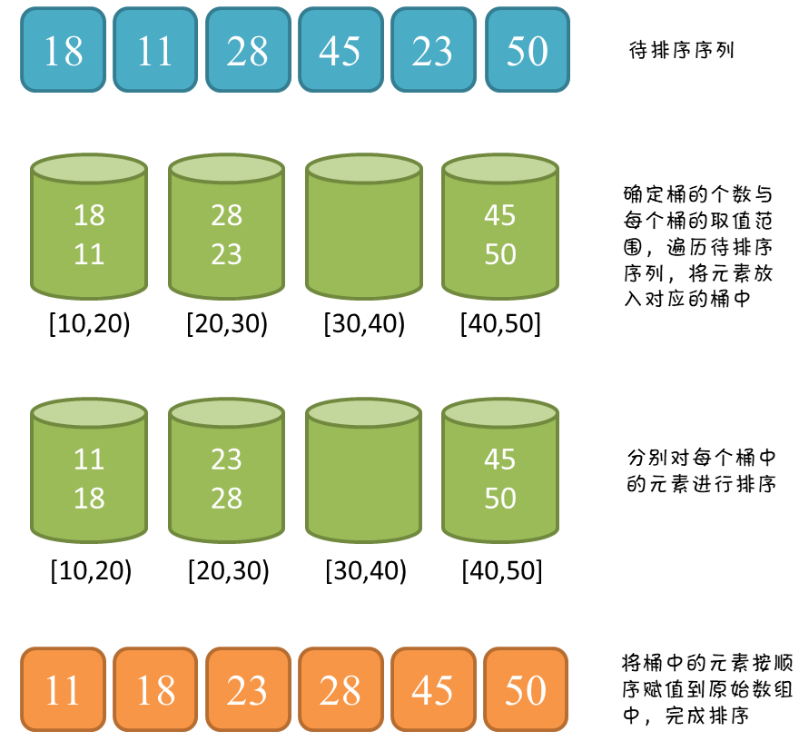

# 排序算法

| 算法     | 稳定性           | 时间复杂度 | 空间复杂度 |
| -------- | ---------------- | ---------- | ---------- |
| 冒泡排序 |                  |            |            |
| 选择排序 |                  |            |            |
| 插入排序 |                  |            |            |
| 快速排序 |                  |            |            |
| 基数排序 |                  |            |            |
| 计数排序 | 稳定             | O(n)       | O(n)       |
| 桶排序   | 取决桶内排序算法 | O(n)       | O(n)       |
| 并归排序 |                  |            |            |
|          |                  |            |            |

[稳定性](https://www.cnblogs.com/codingmylife/archive/2012/10/21/2732980.html)：保证排序前2个相等的数其在序列的前后位置顺序和排序后它们两个的前后位置顺序相同。如果Ai = Aj，Ai原来在位置前，排序后Ai还是要在Aj位置前

## 并归排序

#### [剑指 Offer 51. 数组中的逆序对](https://leetcode-cn.com/problems/shu-zu-zhong-de-ni-xu-dui-lcof/)

## 一、冒泡排序：

基本思想：两个数比较大小，较大的数下沉，较小的数冒起来。

```python
def bubble_sort(nums):
	for i in range(0, len(nums)-1):
		for j in range(i+1, len(nums)):
			if nums[i] > nums[j]:
				nums[i], nums[j] = nums[j], nums[i]
	return nums
```

```C++
#include<iostream>
#include<vector>
using namespace std;
& 传入的是地址，在原地址上更改
vector<int> bubble_sort(vector<int>& nums){
    for(int i=0; i<nums.size()-1; i++){
        for(int j=i+1; j<nums.size(); j++){
            if(nums[i] > nums[j]){
                int tmp = nums[j];
                nums[j] = nums[i];
                nums[i] = tmp;
            }
        }
    }
    return nums;
}

int main(){
    vector<int> nums{1,2,5,3,7,4,5,8};
    bubble_sort(nums);
    for(int i=0; i<nums.size(); i++){
        cout << nums[i] << endl;
    }
    return 0;
}
```


## 二、选择排序

基本思想：第一次遍历n-1个数，找到最小的数值与第一个元素交换

第二次遍历n-2个数，找到最小的数值与第二个元素交换…………

```python
def selection_sort(nums):
    for i in range(0, len(nums)-1):
        minindex = i
        for j in range(i+1, len(nums)):
            if nums[j] < nums[i]:
                minindex = j
        if minindex != i:
            nums[i], nums[j] = nums[j], nums[i]
    return nums
```

```c++
vector<int> selection_sort(vector<int>& nums){
    for(int i=0; i<nums.size()-1; i++){
        int minindex = i;
        for(int j=i+1; j<nums.size(); j++){
            if(nums[j] < nums[i]){
                minindex = j;
                }
            }
        if(minindex != i){
            int tmp = nums[minindex];
            nums[minindex] = nums[i];
            nums[i] = tmp;
        }
    }
    return nums;
}
```

## 三、插入排序

将第i个元素，插入到前面已经拍好的数组中，使其也是有序的。重复

```python
def insert_sort(nums):
    for i in range(1, len(nums)):
        key = nums[i]
        j = i-1
        while j >= 0:
            if key < nums[j]:
                nums[j+1] = nums[j] #这里的j+1位置上的数其实是key的值
                nums[j] = key
            j -= 1
    return nums
```

```c++
vector<int> insert_sort(vector<int>& nums){
    for(int i=1; i<nums.size(); i++){
        int key = nums[i];
        int j = i-1;
        while (j >= 0) {
            if(key < nums[j]){
                nums[j+1] = nums[j];
                nums[j] = key;
            }
            j--;
        }
    }
    return nums;
}
```

## 四、快速排序（重要）

先从数列中取出一个数作为key值；

将比这个数小的数全部放在它的左边，大于或等于它的数全部放在它的右边。重复

```python
def quick_sort(nums, left, right):
    if left >= right: # 退出递归
        return
    low = left 					# 提前记录递归的左边界
    high = right 				# 提前记录递归的右边届
    key = nums[low] 		# 初始化key值，比key大的放右边，比key小的放左边
    while left < right: # 筛选出本次key值，左边都小，右边都大的数组，跳出时left=right(不懂为啥)
        while left < right and nums[right] > key: # 找到右边比key值小的停下来,因为left位置的值传给key后没用了，先判断右边放到没用的left位置上
            right -= 1
        nums[left] = nums[right] # 把右边错位的值放在array[left]上，看上面left->low->key，所以left这个位置的值已经传给key了，array[left]没用了
        while left < right and nums[left] <= key: # 找到左边比key值大的停下来
            left += 1
        nums[right] = nums[left] # 把左边错位的值放在array[right]上，因为right这个位置上的值已经放到左边了，所以array[right]没用了

    nums[right] = key 	# 此时left=right，所以传到right或left位置都可以

    quick_sort(nums, low, left - 1) 	# left或right都可以
    quick_sort(nums, left + 1, high) 	# left或right都可以

nums = [5,2,9,6,3,7,10,4,1,8,13,54,76,33]
quick_sort(nums,0,len(nums)-1)
print(nums)
```

```c++
void quick_sort(vector<int>& nums, int left, int right){
    if(left >= right){
        return;
    }
    int low = left;
    int high = right;
    int key = nums[low];
    
    while (left < right) {
        while (left < right && nums[right] > key) {
            right--;
        }
        nums[left] = nums[right];
        while (left < right && nums[left] <= key) {
            left++;
        }
        nums[right] = nums[left];
    }
    nums[right] = key;
    quick_sort(nums, low, left-1);
    quick_sort(nums, left+1, high);
}
```

## 五、计数排序

[参考](https://www.cnblogs.com/xiaochuan94/p/11198610.html)

计数排序（英语：Counting sort）是一种线性时间的排序算法该算法于1954年由 Harold H. Seward提出，通过计数将时间复杂度降到了`O(N)`

算法步骤：

1. 找出原数组中元素值最大的，记为`max`。
2. 创建一个新数组`count`，其长度是`max`加1，其元素默认值都为0。
3. 遍历原数组中的元素，以原数组中的「元素值」作为`count`数组的「索引」，以原数组中的元素「出现次数」作为`count`数组的「元素值」
3. 创建结果数组`result`，起始索引`index`。
3. 遍历`count`数组，找出其中元素值大于0的元素，将其对应的索引作为元素值填充到`result`数组中去，每处理一次，`count`中的该元素值减1，直到该元素值不大于0，依次处理`count`中剩下的元素。
3. 返回结果数组`result`。

```
原数组  nums: [2 4 3 1 2 5 9]
计数数组 cnt: [0 1 2 1 1 1 0 0 0 1]
排序完  nums: [1 2 2 3 4 5 9]
```

```c++
#include <iostream>
#include <vector>
using namespace std;

int main() {
    vector<int> nums = {2, 4, 3, 1, 2, 5, 9};
    int maxVal = INT_MIN;
    for (int num : nums) {
        maxVal = max(maxVal, num);
    }

    vector<int> cnt(maxVal + 1, 0); // 数组长度为最大值+1
    for (int num : nums) {
        cnt[num]++;
    }

    int index = 0;
    for (int i = 0; i < cnt.size(); i++) {
        while (cnt[i] > 0) {
            nums[index] = i;
            index++;
            cnt[i]--;
        }
    }

    for (int num : nums) {
        cout << num << " ";
    }
    // 1 2 2 3 4 5 9

    return 0;
}
```

它有一个缺陷，那就是存在空间浪费的问题。比如一组数据`{101,109,108,102,110,107,103}`，其中最大值为110，需要创建一个长度为111的计数数组，前面的`[0,100]`的空间浪费了

优化：将数组长度定为`max-min+1`，即不仅要找出最大值，还要找出最小值，**根据两者的差来确定计数数组的长度，元素要减去最小值再作为新索引，最后取结果时将减去的最小值补上**

```c++
#include <iostream>
#include <vector>
using namespace std;

int main() {
    vector<int> nums = {101, 109, 108, 102, 110, 107, 109};
    int maxVal = INT_MIN;
    int minVal = INT_MAX;
    for (int num : nums) {
        maxVal = max(maxVal, num);
        minVal = min(minVal, num);
    }

    vector<int> cnt(maxVal - minVal + 1, 0);  // 长度为最大值减最小值加1
    for (int num : nums) {
        cnt[num - minVal]++;
    }

    int index = 0;
    for (int i = 0; i < cnt.size(); i++) {
        while (cnt[i] > 0) {
            nums[index] = i + minVal;  // 取结果时将减去的最小值补上
            index++;
            cnt[i]--;
        }
    }

    for (int num : nums) {
        cout << num << " ";
    }
    // 101 102 107 108 109 109 110

    return 0;
}
```

## 六、桶排序

[参考1](https://blog.csdn.net/qq_27124771/article/details/87651495)，[参考2](https://oi-wiki.org/basic/bucket-sort/)

桶排序（英文：Bucket sort）是排序算法的一种，适用于待排序数据值域较大但分布比较均匀的情况，否则当所有数据集中在同一个桶中时，桶排序失效

「桶排序」是「计数排序」的扩展版本，计数排序可以看成每个桶只存储相同元素，而桶排序每个桶存储一定范围的元素，通过映射函数，将待排序数组中的元素映射到各个对应的桶中，对每个桶中的元素进行排序，最后将非空桶中的元素逐个放入原序列中

一句话总结：**划分多个范围相同的区间，每个子区间自排序，最后合并**




**算法步骤**

1. 计算最大值与最小值
2. 计算桶的数量，**(最大值-最小值)/数组长度+1**，保证分布均匀时每个数入一个桶
3. 将每个元素放入桶
4. 对每个桶进行排序
5. 将桶中的元素赋值到原序列

**稳定性**

如果使用稳定的内层排序，并且将元素插入桶中时不改变元素间的相对顺序，那么桶排序就是一种稳定的排序算法。

由于每块元素不多，一般使用插入排序。此时桶排序是一种稳定的排序算法。

**时间复杂度**

桶排序的平均时间复杂度为 `O((n+n^2)/(k+k))` （将值域平均分成 n 块 + 排序 + 重新合并元素），当 k约等于n 时为 `O(n)`

桶排序的最坏时间复杂度为`O(n^2)` 

```c++
#include <iostream>
#include <vector>
using namespace std;

int main() {
    vector<int> nums = {101, 109, 108, 102, 110, 107, 109};

    // 1 计算最大值与最小值
    int maxVal = INT_MIN;
    int minVal = INT_MAX;
    for (int num : nums) {
        maxVal = max(maxVal, num);
        minVal = min(minVal, num);
    }

    // 2 计算桶的数量
    int bucketNum = (maxVal - minVal) / nums.size() + 1;  // 2 = (110-101)/7+1
    vector<vector<int>> bucket(bucketNum);

    // 3 将每个元素放入桶
    for (int num : nums) {
        int idx = (num - minVal) / nums.size();
        bucket[idx].push_back(num);
    }
    // 桶1: 101 102 107
    // 桶2: 109 108 110 109

    // 4 对每个桶进行排序，注意是引用
    for (auto &b : bucket) {
        sort(b.begin(), b.end());
    }

    // 5 将桶中的元素赋值到原序列
    int index = 0;
    for (auto b : bucket) {
        for (int n : b) {
            nums[index] = n;
            index++;
        }
    }

    for (int num : nums) {
        cout << num << " ";
    }
    // 101 102 107 108 109 109 110
    return 0;
}
```

