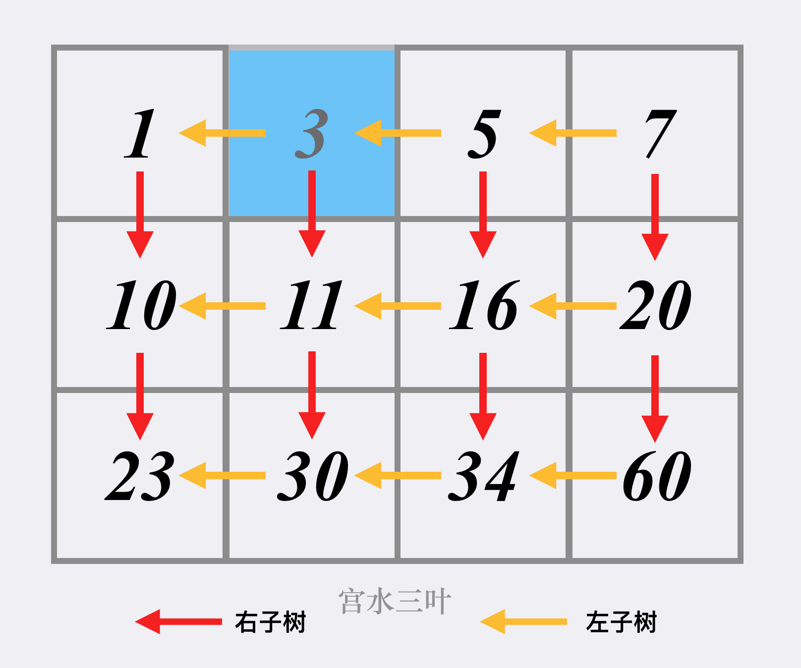

[74. 搜索二维矩阵](https://leetcode-cn.com/problems/search-a-2d-matrix/)

编写一个高效的算法来判断 m x n 矩阵中，是否存在一个目标值。该矩阵具有如下特性：

- 每行中的整数从左到右按升序排列。
- 每行的第一个整数大于前一行的最后一个整数。

**示例 1：**


```
输入：matrix = [[1,3,5,7],[10,11,16,20],[23,30,34,60]], target = 3
输出：true
```

**示例 2：**


```
输入：matrix = [[1,3,5,7],[10,11,16,20],[23,30,34,60]], target = 13
输出：false
```

提示：

m == matrix.length
n == matrix[i].length
1 <= m, n <= 100
`-104 <= matrix[i][j], target <= 104`

## 二分解法（一）

- 先找所在行
- 再找所在列

- 时间复杂度：O(\log{m} + \log{n})
- 空间复杂度：O(1

```cpp
class Solution {
public:
    bool searchMatrix(vector<vector<int>>& matrix, int target) {
        int rows = matrix.size();
        int cols = matrix[0].size();
        if (target < matrix[0][0] || target > matrix[rows - 1][cols - 1]) {
            return false;
        }
        int row, col;
        int up = 0;
        int down = rows - 1;
        while (up <= down) {
            int mid = up + (down - up) / 2;
            if (matrix[mid][0] <= target && target <= matrix[mid][cols - 1]) {
                row = mid;
                break;
            }
            if (target < matrix[mid][0]) {
                down = mid - 1;
            } else if (matrix[mid][cols - 1] < target) {
                up = mid + 1;
            }
        }
        int left = 0;
        int right = cols - 1;
        while (left <= right) {
            int mid = left + (right - left) / 2;
            if (matrix[row][mid] == target) {
                return true;
            }
            if (target < matrix[row][mid]) {
                right = mid - 1;
            } else if (matrix[row][mid] < target) {
                left = mid + 1;
            }
        }
        return false;
    }
};
```

## 二分解法（二）

当然，因为将二维矩阵的行尾和行首连接，也具有单调性。

我们可以将「二维矩阵」当做「一维矩阵」来做。

- 时间复杂度：O(\log{(m * n)})
- 空间复杂度：O(1)

```python
class Solution:
    def searchMatrix(self, matrix: List[List[int]], target: int) -> bool:
        m, n = len(matrix), len(matrix[0])
        l, r = 0, m * n - 1
        while l <= r:
            mid = (l + r) >> 1
            x, y = mid // n , mid % n
            if matrix[x][y] > target:
                r = mid - 1
            elif matrix[x][y] < target:
                l = mid + 1
            else:
                return True
        return False
```

## 抽象 BST 解法

我们可以将二维矩阵抽象成「以右上角为根的 BST」：



那么我们可以从根（右上角）开始搜索，如果当前的节点不等于目标值，可以按照树的搜索顺序进行：

1. 当前节点「大于」目标值，搜索当前节点的「左子树」，也就是当前矩阵位置的「左方格子」，即 y--
2. 当前节点「小于」目标值，搜索当前节点的「右子树」，也就是当前矩阵位置的「下方格子」，即 x++

- 时间复杂度：O(m+n)
- 空间复杂度：O(1)

```cpp
class Solution {
public:
    bool searchMatrix(vector<vector<int>>& matrix, int target) {
        int rows = matrix.size();
        int cols = matrix[0].size();
        int r = 0;
        int c = cols - 1;
        // 右上角开始查找
        while (r < rows && c >= 0) {
            if (matrix[r][c] == target) {
                return true;
            } else if (target > matrix[r][c]) {
                r++;
            } else if (target < matrix[r][c]) {
                c--;
            }
        }
        return false;
    }
};
```

