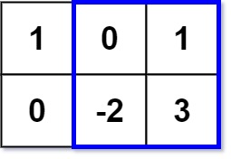

#### [363. 矩形区域不超过 K 的最大数值和](https://leetcode-cn.com/problems/max-sum-of-rectangle-no-larger-than-k/)

https://leetcode.cn/problems/max-sum-of-rectangle-no-larger-than-k/solutions/954329/tong-ge-lai-shua-ti-la-yi-ti-wu-jie-bao-9opdb

给你一个 `m x n` 的矩阵 `matrix` 和一个整数 `k` ，找出并返回矩阵内部矩形区域的不超过 `k` 的最大数值和。

题目数据保证总会存在一个数值和不超过 `k` 的矩形区域。

**示例 1：**



```
输入：matrix = [[1,0,1],[0,-2,3]], k = 2
输出：2
解释：蓝色边框圈出来的矩形区域 [[0, 1], [-2, 3]] 的数值和是 2，且 2 是不超过 k 的最大数字（k = 2）。
```

**示例 2：**

```
输入：matrix = [[2,2,-1]], k = 3
输出：3
```

**提示：**

- `m == matrix.length`
- `n == matrix[i].length`
- `1 <= m, n <= 100`
- `-100 <= matrix[i][j] <= 100`
- `-105 <= k <= 105`

**进阶：**如果行数远大于列数，该如何设计解决方案？

```python
class Solution:
    def maxSumSubmatrix(self, matrix: List[List[int]], k: int) -> int:
        rows = len(matrix)
        cols = len(matrix[0])
        mat = [[0 for _ in range(cols+1)] for _ in range(rows+1)]
        for r in range(rows):
            for c in range(cols):
                mat[r+1][c+1] = mat[r][c+1] + mat[r+1][c] - mat[r][c] + matrix[r][c]
                if mat[r+1][c+1] == k: return k;
        ans = float("-inf")
        # for r1 in range(rows):
        #     for r2 in range(r1, rows):
        #         mem = []
        #         for c in range(0, cols):
        #             area = mat[r2+1][c+1] - mat[r1][c+1]
        #             res = k - area # 找个小于等于res但最贴近res的值
        #             for m in mem:
        #                 if m<=res and area-m>ans:
        #                     ans = area-m
        #             mem.append(area) 
        for r1 in range(rows):
            for c1 in range(cols):
                for r2 in range(r1, rows):
                    for c2 in range(c1, cols):
                        area = mat[r2+1][c2+1] - mat[r2+1][c1] - mat[r1][c2+1] + mat[r1][c1]
                        if area == k: return k
                        if area <= k and area>ans:
                            ans = area;
        return ans
```

