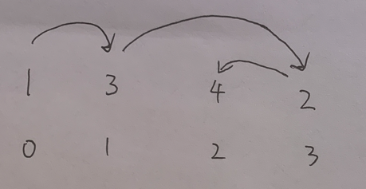
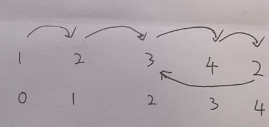

[287. 寻找重复数](https://leetcode-cn.com/problems/find-the-duplicate-number/)

给定一个包含 `n + 1` 个整数的数组 `nums` ，其数字都在 `[1, n]` 范围内（包括 `1` 和 `n`），可知至少存在一个重复的整数。

假设 `nums` 只有 **一个重复的整数** ，返回 **这个重复的数** 。

你设计的解决方案必须 **不修改** 数组 `nums` 且只用常量级 `O(1)` 的额外空间。

**示例 1：**

```
输入：nums = [1,3,4,2,2]
输出：2
```

**示例 2：**

```
输入：nums = [3,1,3,4,2]
输出：3
```

 提示：

1 <= n <= 105
nums.length == n + 1
1 <= nums[i] <= n
nums 中 只有一个整数 出现 两次或多次 ，其余整数均只出现 一次

**进阶：**

- 如何证明 `nums` 中至少存在一个重复的数字?
- 你可以设计一个线性级时间复杂度 `O(n)` 的解决方案吗？

## 方法：快慢双指针+环入口

### 本题的难点是如何将输入的数组看作为链表

先明确前提，整数的数组 `nums` 中的数字范围是 `[1,n]`。考虑一下两种情况：

情况一：如果数组中没有重复的数，以数组 `[1,3,4,2]`为例，我们将数组下标 `n` 和数 `nums[n]` 建立映射关系

我们从下标为 0 出发，根据映射关系计算出一个值，以这个值为新的下标，再用这个映射关系计算，以此类推，直到下标超界。

这样可以产生一个类似链表一样的序列 `0->1->3->2->4->null`




情况二：如果数组中有重复的数，以数组 `[1,2,3,4,2]` 为例,我们将数组下标 `n` 和数 `nums[n]` 建立映射关系

我们从下标为 0 出发，根据映射关系，以此类推产生一个类似链表一样的序列

`0->1->2->3->4->2->3->4->2...`，产生了环 `3->4->2`



从理论上讲，数组中如果有重复的数，那么就会产生「多对一的映射」，这样，形成的链表就一定会有环路了


因此这个问题转化为，寻找环入口

时间复杂度：O(n)  空间复杂度：O(1)

```c++
class Solution {
public:
    int findDuplicate(vector<int>& nums) {
        int n = nums.size();
        int slow = 0;
        int fast = 0;
        while (true) {
            slow = nums[slow];
            fast = nums[nums[fast]];
            if (slow == fast) break;
        }
        fast = 0;
        while (nums[slow] != nums[fast]) {
            slow = nums[slow];
            fast = nums[fast];
        }
        return nums[slow];
    }
};
```

