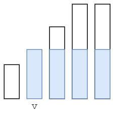

[2171. 拿出最少数目的魔法豆](https://leetcode-cn.com/problems/removing-minimum-number-of-magic-beans/)

## 方法：排序+贪心

我们可以将 beans 从小到大排序后，枚举最终非空袋子中魔法豆的数目 v，将小于 v 的魔法豆全部清空，大于 v 的魔法豆减少至 v，这样所有非空袋子中的魔法豆就均相等了。

由于拿出魔法豆 + 剩余魔法豆 = 初始魔法豆之和，我们可以考虑最多能剩下多少个魔法豆，从而计算出最少能拿出多少个魔法豆。



如上图所示，可以保留蓝色矩形区域内的魔法豆。设数组 beans 的长度为 n，对于第 i 个袋子，我们可以至多保留 `(n - i) * beans[i]` 个豆子

**最小变动数量 = 总数 - 保留的最大数量**

**注意：一定要排序，才能算出后面的面积**

```c++
class Solution {
public:
    long long minimumRemoval(vector<int>& beans) {
        long long sum = 0;
        long long remain = 0;
        int n = beans.size();
        sort(beans.begin(), beans.end());
        for (int i = 0; i < n; i++) {
            sum += beans[i];
            remain = max(remain, (long long)(n - i) * beans[i]);
        }
        return sum - remain;
    }
};
```

