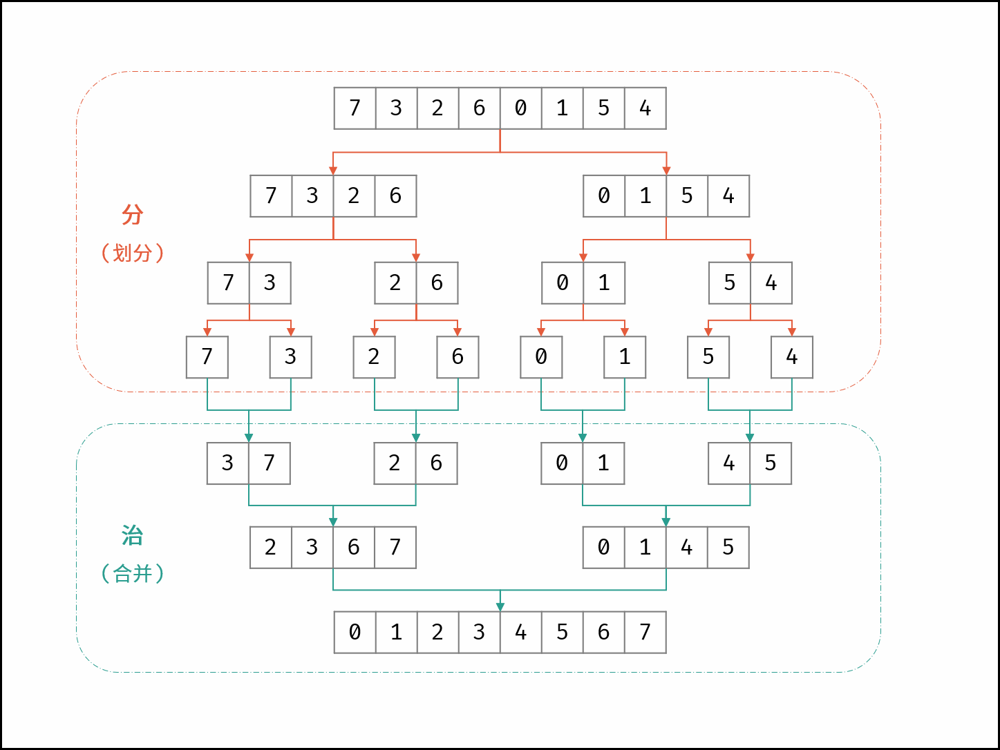
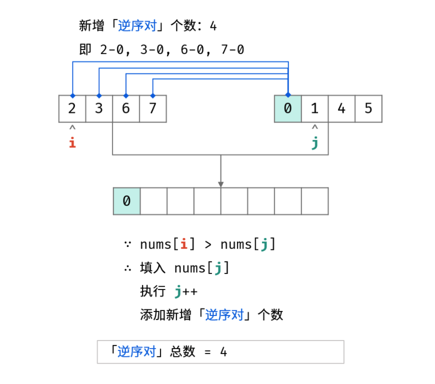
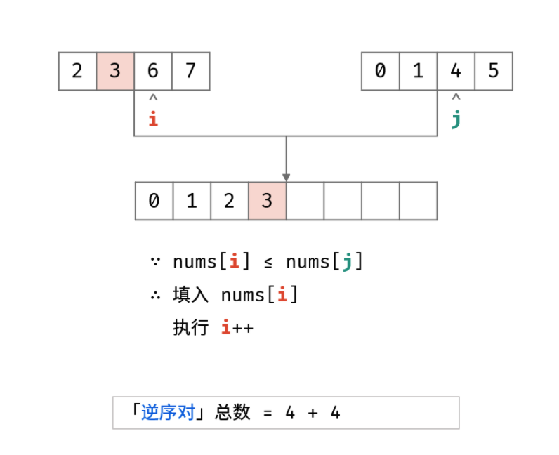
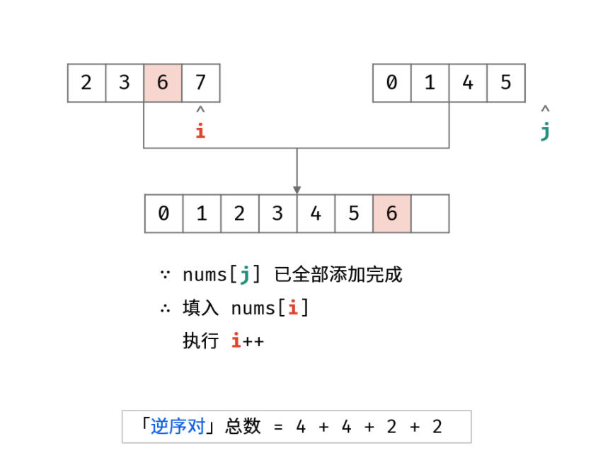
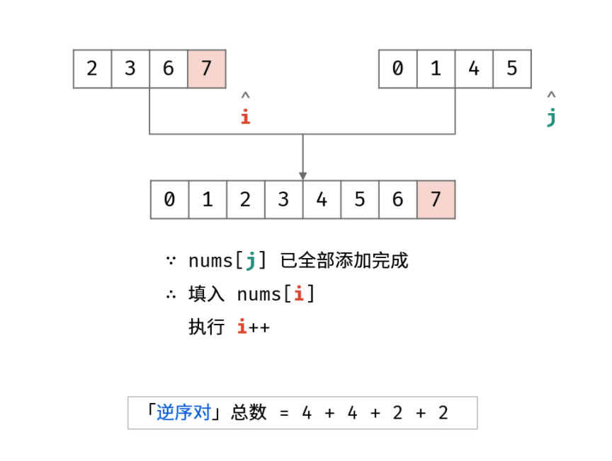

[剑指 Offer 51. 数组中的逆序对](https://leetcode-cn.com/problems/shu-zu-zhong-de-ni-xu-dui-lcof/)

在数组中的两个数字，如果前面一个数字大于后面的数字，则这两个数字组成一个逆序对。输入一个数组，求出这个数组中的逆序对的总数。

**示例 1:**

```
输入: [7,5,6,4]
输出: 5
```

**限制：**

```
0 <= 数组长度 <= 50000
```

## 方法一：并归排序

[题解来源](https://leetcode-cn.com/problems/shu-zu-zhong-de-ni-xu-dui-lcof/solution/jian-zhi-offer-51-shu-zu-zhong-de-ni-xu-pvn2h/)

「归并排序」与「逆序对」是息息相关的。归并排序体现了 “分而治之” 的算法思想，具体为：

- 分： 不断将数组从中点位置划分开（即二分法），将整个数组的排序问题转化为子数组的排序问题；
- 治： 划分到子数组长度为 1 时，开始向上合并，不断将 较短排序数组 合并为 较长排序数组，直至合并至原数组时完成排序；

如下图所示，为数组 [7, 3, 2, 6, 0, 1, 5, 4] 的归并排序过程。



**「合并阶段」本质上是「合并两个排序数组」的过程，而每当遇到「左子数组当前元素 > 右子数组当前元素」时，意味着「左子数组当前元素 至 末尾元素」与「右子数组当前元素」构成了若干「逆序对」**












如下图所示，为数组 [7, 3, 2, 6, 0, 1, 5, 4] 的归并排序与逆序对统计过程。


算法实现上对模版进行几处更改：

- 添加成员变量 reverse_pairs
- tmp[ptr_l] > tmp[ptr_r] 的情况下，计算当前两个有序数组的逆序对 mid - ptr_l + 1
- 注意：在 tmp[ptr_l] == tmp[ptr_r] 的情况下，两个指针相等，一定要左指针移动

例如 [1,2,3] [1,3]

- 若两指针相等「右指针」移动，会导致右边数组的 1 被空过去，左边的更大值无法与它比较
- 若两指针相等「左指针」移动，因为 1 就是左边最小的，不会错过答案

```c++
class MergeSort {
private:
    vector<int> tmp;  // 用于辅助合并有序数组
    void _sort(vector<int> &nums, int lo, int hi) {
        if (lo == hi) return;  // 单个元素不用排序
        int mid = lo + (hi - lo) / 2;
        _sort(nums, lo, mid);      // 先对左半部分数组 [lo,mid] 排序
        _sort(nums, mid + 1, hi);  // 再对右半部分数组 [mid+1,hi] 排序
        merge(nums, lo, mid, hi);  // 将两部分有序数组合并成一个有序数组
    }
    void merge(vector<int> &nums, int lo, int mid, int hi) {
        // 先把 [lo, hi] 复制到辅助数组中，以便合并后的结果能够直接存入 nums
        for (int i = lo; i <= hi; i++) tmp[i] = nums[i];
        // 双指针，分别指向左右两个有序数组，合并
        int ptr_l = lo, ptr_r = mid + 1;
        for (int idx = lo; idx <= hi; idx++) {
            if (ptr_l == mid + 1) {  // 左半边数组已全部被合并
                nums[idx] = tmp[ptr_r++];
            } else if (ptr_r == hi + 1) {  // 右半边数组已全部被合并
                nums[idx] = tmp[ptr_l++];
            } else if (tmp[ptr_l] < tmp[ptr_r]) {
                nums[idx] = tmp[ptr_l];
                ptr_l++;
            } else if (tmp[ptr_l] == tmp[ptr_r]) {
                nums[idx] = tmp[ptr_l];  // 注意注意注意：两个指针相等时，一定要左指针移动
                ptr_l++;
            } else if (tmp[ptr_l] > tmp[ptr_r]) {
                reverse_pairs += mid - ptr_l + 1;  // 逆序对进行累加
                nums[idx] = tmp[ptr_r];
                ptr_r++;
            }
        }
    }

public:
    int reverse_pairs;
    void sort(vector<int> &nums) {
        int n = nums.size();
        reverse_pairs = 0;
        tmp.resize(n);          // 先给辅助数组开辟内存空间，不要放在递归里面
        _sort(nums, 0, n - 1);  // 排序整个数组（原地修改）
    }
};

class Solution {
public:
    int reversePairs(vector<int> &nums) {
        if (nums.empty()) return 0;
        MergeSort ms;
        ms.sort(nums);
        return ms.reverse_pairs;
    }
};
```

## 方法二：离散化+树状数组

与 [315. 计算右侧小于当前元素的个数](https://leetcode-cn.com/problems/count-of-smaller-numbers-after-self/solution/shu-zhuang-shu-zu-c-python-by-dodo_1202-igmr/) 一摸一样

```c++
class FenwickTree {
public:
    int size;
    vector<int> tree;

    FenwickTree(int n) {
        size = n;
        tree.resize(size + 1, 0);
    }
    int lowbit(int idx) {
        return idx & (-idx);
    }
    void add(int idx, int delta) {
        while (idx < size + 1) {
            tree[idx] += delta;
            idx += lowbit(idx);
        }
    }
    int query(int idx) {
        int sum = 0;
        while (idx > 0) {
            sum += tree[idx];
            idx -= lowbit(idx);
        }
        return sum;
    }
};

class Solution {
public:
    int reversePairs(vector<int>& nums) {
        set<int> s(nums.begin(), nums.end());
        unordered_map<int, int> um;
        int rank = 1;
        for (auto it = s.begin(); it != s.end(); it++) {
            um[*it] = rank;
            rank++;
        }
        FenwickTree ftree(s.size());
        int ans = 0;
        for (int i = nums.size() - 1; i >= 0; i--) {
            rank = um[nums[i]];
            ftree.add(rank, 1);
            ans += ftree.query(rank - 1);
        }
        return ans;
    }
};
```

