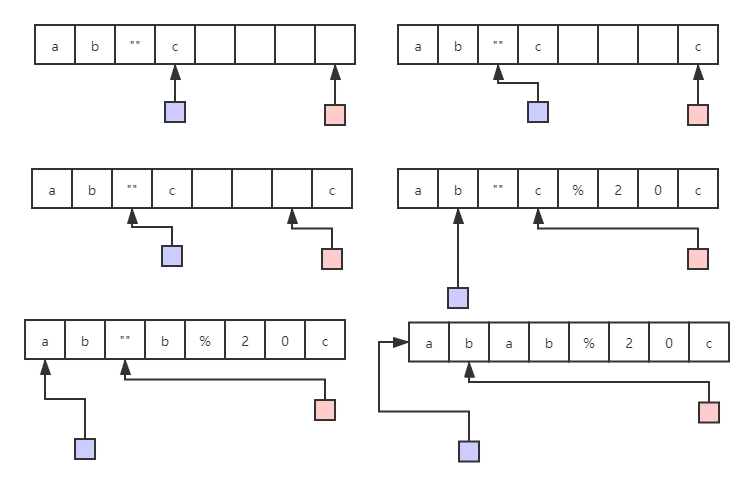

题目：[面试题 01.03. URL化](https://leetcode.cn/problems/string-to-url-lcci/)

URL化。编写一种方法，将字符串中的空格全部替换为`%20`。假定该字符串尾部有足够的空间存放新增字符，并且知道字符串的“真实”长度。（注：用`Java`实现的话，请使用字符数组实现，以便直接在数组上操作。）

**示例 1：**

```
输入："Mr John Smith    ", 13
输出："Mr%20John%20Smith"
```

**示例 2：**

```
输入："               ", 5
输出："%20%20%20%20%20"
```

**提示：**

- 字符串长度在 [0, 500000] 范围内。

---

https://leetcode.cn/problems/string-to-url-lcci/solutions/626139/wu-e-wai-kong-jian-dao-xu-ji-suan-by-acv-pfia

看题意 题目似乎有个隐藏条件
不需要额外的空间 只在输入的字符串中进行计算
因为字符串的长度实际比输入的字符要大
那么我们可以倒序计算
两个指针分别指向字母和字符串的最末尾，
如果是其他字母则照样复制 两指针分别向前移动
如果是空格则在字符串末尾添加%20三个字符，向前移动三位，字母的指针则向前移动一位。




```cpp
class Solution {
public:
    string replaceSpaces(string S, int length) {
        int i = S.size() - 1;  // 要填充的下标
        int j = length - 1;    // 原字符串下标
        while (j >= 0) {
            if (S[j] == ' ') {
                S[i] = '0';
                i--;
                S[i] = '2';
                i--;
                S[i] = '%';
                i--;
            } else {
                S[i] = S[j];
                i--;
            }
            j--;
        }
        cout << S.size() << endl;
        return S.substr(i + 1);
    }
};
```

