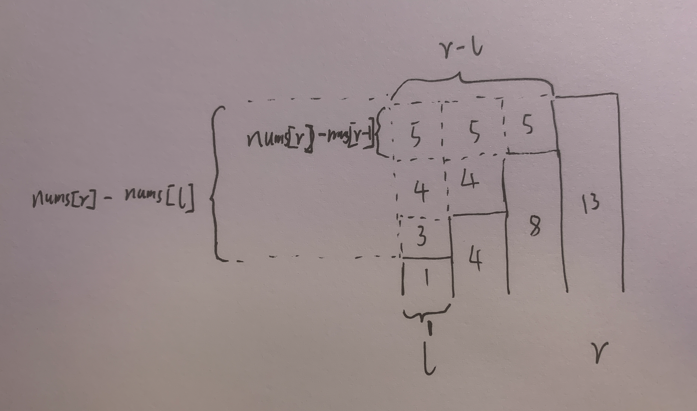

[1838. 最高频元素的频数](https://leetcode-cn.com/problems/frequency-of-the-most-frequent-element/)

## 方法：排序+滑动窗口+前缀和思想

- 先进行数据预处理，方便滑窗
- 频数为窗口长度 right - left + 1，找最大的
- 使用 window 记录窗口内的元素 [left, right]，都变成 nums[right] 需要多少增量
- 当 window 内累积的增量大于 k 时，左边届收缩



窗口右边扩展，每次增加最上层，增加的面积为 `(r-l) * (nums[r] - nums[r-1])`

窗口左边收缩，每次减少最左列，减少的面积为 `1 * (nums[r] - nums[l])`

时间复杂度：`O(nlogn)`

空间复杂度：`O(logn)`

```c++
class Solution {
public:
    int maxFrequency(vector<int>& nums, int k) {
        sort(nums.begin(), nums.end());
        int n = nums.size();
        int left = 0;
        int right = 1;
        long long window = 0;
        int ans = 1;
        while (right < n) {
            // 右边届入窗，每次增加最上层
            window += (long long)(right - left) * (nums[right] - nums[right - 1]);
            // 左边届出窗，每次减少最左列
            while (window > k) {
                window -= 1 * (nums[right] - nums[left]);
                left++;
            }
            ans = max(ans, right - left + 1);
            right++;
        }
        return ans;
    }
};

```

